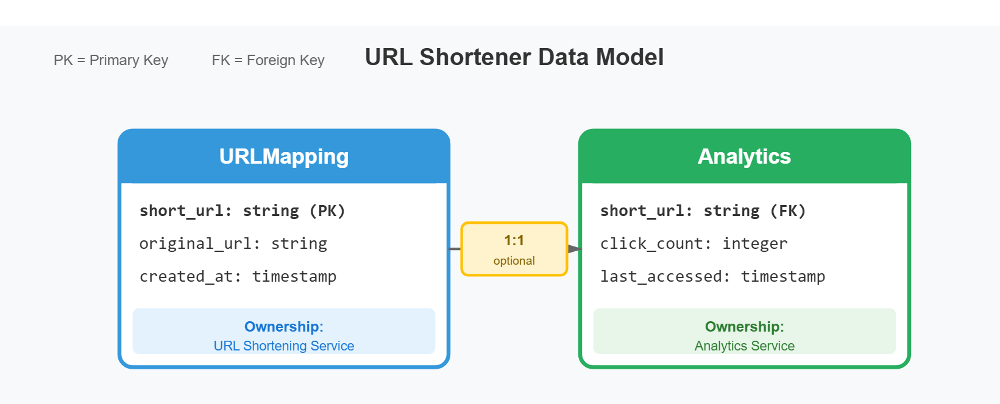
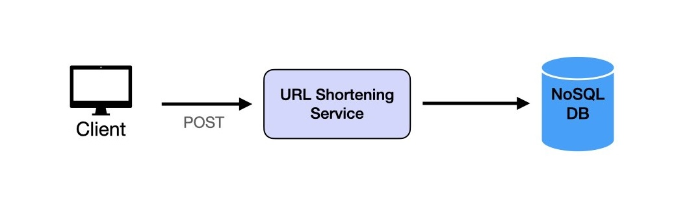
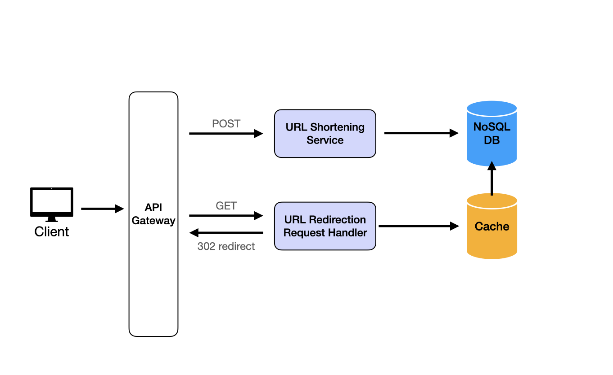
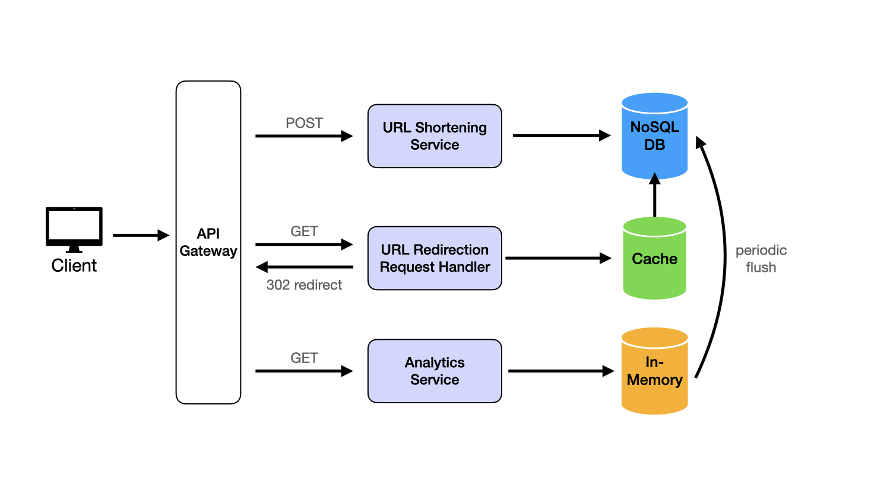
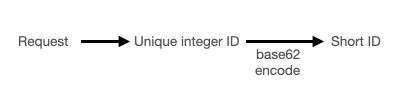
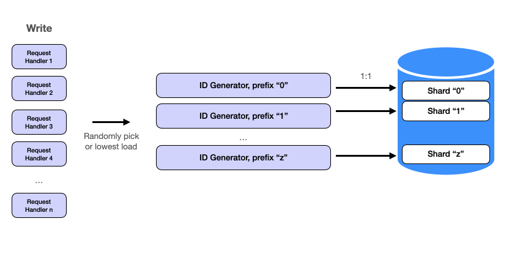
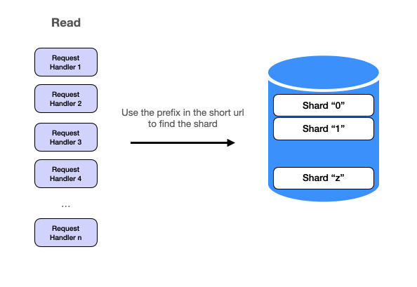

# Design URL Shortener

Source: https://systemdesignschool.io/problems/url-shortener/solution

> Note on fidelity: like Google Calendar and unlike the primer/rate-limiter pages, this page uses real static image diagrams (SVG/JPEG/PNG files hosted by the site, not live JS/SVG widgets), plus collapsible "Field Details" tables, "Request & response" API panels, "Option N" sub-accordions inside the deep dives, and "Staff-Level Discussion Topics" accordions. All of these were expanded via the live page and are transcribed in full below, in the order they appear on the site.

Tags: system design · easy

---

## Introduction

A URL Shortener is a service that takes a long URL and generates a shorter, unique alias that redirects users to the original URL. Popular examples include bit.ly, TinyURL, and Twitter's t.co.

```text
Long URL ──▶ [ URL Shortener ] ──▶ Short Alias ──(redirect)──▶ Original URL
```
Illustrates the core concept: a long URL goes in, a short alias comes out and redirects back to the original.

This alias is often a fixed-length string of characters. The system should be able to handle millions of URLs, allowing users to create, store, and retrieve shortened URLs efficiently. Each shortened URL needs to be unique and persistent. Additionally, the service should be able to handle high traffic, with shortened URLs redirecting to the original links in near real-time. In some cases, the service may include analytics to track link usage, such as click counts and user locations.

## Functional Requirements

We extract verbs from the problem statement to identify core operations:

- "**takes** a long URL and **generates** a shorter alias" → CREATE operation (URL Shortening)
- "**redirects** users to the original URL" → READ operation (URL Redirection)
- "**track** link usage" → UPDATE/INCREMENT operation (Analytics)

Each verb maps to a functional requirement that defines what the system must do.

1. Users should be able to input a long URL and receive a unique, shortened alias. The shortened URL should use a compact format with English letters and digits to save space and ensure uniqueness.
2. When users access a shortened URL, the service should redirect them seamlessly to the original URL with minimal delay.
3. The system should be able to track the number of times each shortened URL is accessed to provide insights into link usage.

**Out of Scope:** (the page's "Out of Scope" heading is present but renders with no bullet content beneath it on the live site.)

**Scale Requirements:**

| Assumption | Value |
|---|---|
| Daily active users | 100M |
| Read:write ratio | 100:1 |
| Data retention | 5 years |
| Write requests / day | ~1 million |
| Entry size | ~500 bytes |

## Non-Functional Requirements

We extract adjectives and descriptive phrases from the problem statement to identify quality constraints:

- "**unique**" alias → System must guarantee no collisions
- "**millions of URLs**" + "**high traffic**" → System must handle large scale
- "**efficiently**" + "**near real-time**" → System must respond quickly
- "**persistent**" → System must not lose data
- "**handle high traffic**" → System must remain operational under load

Each adjective becomes a non-functional requirement that constrains our design choices.

- **High Availability** — The service should ensure that all URLs are accessible 24/7, with minimal downtime, so users can reliably reach their destinations. (Derived from 'high traffic')
- **Low Latency** — URL redirections should occur almost instantly, ideally in under a few milliseconds, to provide a seamless experience for users. (Derived from 'near real-time' and 'efficiently')
- **High Durability** — Shortened URLs should be stored reliably so they persist over time, even across server failures, ensuring long-term accessibility. (Derived from 'persistent')
- **Uniqueness** — Each shortened URL must map to exactly one original URL across all users. (Derived from 'unique')
- **Security** — The service must prevent malicious links from being created and protect user data, implementing safeguards against spam, abuse, and unauthorized access to sensitive information.

## Data Model

The data model is derived from extracting nouns in the problem statement:

- "URL" and "alias" → URLMapping entity with short_url and original_url fields
- "link usage" and "click counts" → Analytics entity with click_count field
- "persistent" requirement → created_at timestamp for durability tracking

Ownership is distributed across services to enable independent scaling. The URL Shortening Service owns URLMapping to ensure unique ID generation. The Analytics Service owns Analytics to handle high-volume write traffic without impacting redirection performance.

**URLMapping** — Stores the mapping between short URLs and original URLs. This is the core entity that enables the shortening and redirection operations.

**Field Details (expanded):**

| Field | Type | Description |
|---|---|---|
| short_url | string | Primary key. Base62 encoded unique identifier (6 characters). Example "a1B2c3" |
| original_url | string | The destination URL that the short URL redirects to |
| created_at | timestamp | When the URL was shortened. Used for analytics and expiration policies |

URL Shortening Service is the source of truth for this entity.

**Analytics** — Tracks access metrics for each shortened URL. Supports the link tracking functional requirement.

**Field Details (expanded):**

| Field | Type | Description |
|---|---|---|
| short_url | string | Foreign key to URLMapping. Links analytics data to the shortened URL |
| click_count | integer | Total number of times this short URL has been accessed |
| last_accessed | timestamp | Most recent access timestamp for staleness detection |

Analytics Service is the source of truth for this entity.

URLMapping and Analytics have a one-to-one relationship. Each shortened URL has exactly one analytics record. The relationship is optional — URLs can exist without analytics if tracking is disabled.



Shows the URLMapping and Analytics entities linked 1:1 on `short_url`.

## API Endpoints

We derive API endpoints directly from the functional requirements (verbs identified in Step 0):

- CREATE operation: "**takes** a long URL and **generates** a shorter alias" → `POST /api/urls/shorten` (accepts longUrl, returns shortUrl)
- READ operation: "**redirects** users to the original URL" → `GET /api/urls/{shortUrl}` (accepts shortUrl, returns longUrl or 302 redirect)
- UPDATE operation: "**track** link usage" → Handled internally via event-driven architecture (not exposed as a public API endpoint)

Each endpoint maps to exactly one core operation, following RESTful conventions where HTTP methods indicate operation type.

**POST `/api/urls/shorten`** — Shorten a given long URL and return the shortened URL.

Request & response (expanded):

Request body:
```json
{ "longUrl": "http://example.com" }
```
Response body:
```json
{ "shortUrl": "http://urlshort.ly/abcd" }
```

**GET `/api/urls/{shortUrl}`** — Redirect to the original long URL using the shortened URL.

Request & response (expanded):

Response body:
```json
{ "longUrl": "http://example.com" }
```

## High Level Design

### 1. URL Shortening

Users should be able to input a long URL and receive a unique, shortened alias. The shortened URL should use a compact format with English letters and digits to save space and ensure uniqueness.

The design for URL shortening follows a basic two-tier architecture that processes requests quickly and scales to handle high volumes:

1. **Client** — The frontend application sends HTTP POST requests containing long URLs to the URL Shortening service.
2. **URL Shortening Service** — The backend receives requests and is responsible for creating and returning shortened URLs. It performs these key functions: generates a unique, short alias by encoding the URL or using hashing techniques to ensure uniqueness; stores the mapping of long URLs to short aliases in the database; manages errors and ensures each short URL is unique across all users.
3. **Database** — A highly available database (e.g., DynamoDB or Cassandra) is used to persist mappings between long URLs and short aliases.


*Client → URL Shortening Service → Database.*

This design supports efficient and quick URL shortening with minimal data storage requirements per URL entry.

### 2. URL Redirection

When users access a shortened URL, the service should redirect them seamlessly to the original URL with minimal delay.

The URL redirection service ensures that users accessing a shortened URL are quickly redirected to the original URL with minimal delay. This design focuses on high read throughput and low latency, as the read traffic will be significantly higher than URL creation.

1. **API Gateway** — As we now have two request types, we need an API Gateway. This acts as the entry point for all incoming requests, routing POST requests to the URL Shortening Service and GET requests to the URL Redirection Handler.
2. **URL Redirection Request Handler** — Accepts GET requests with the shortened URL, queries the cache for the original URL, and responds with a `302 Found` status and the original URL in the `Location` header to facilitate seamless redirection.
3. **Caching Layer** — To reduce latency and offload read requests from the database, we implement a read-through caching layer (e.g., Redis with cache libraries) that stores frequently accessed URL mappings in memory. When a URL is not found in the cache, the cache itself automatically retrieves it from the database and stores it for future requests, making the process transparent to the Request Handler.
4. **Database** — The database stores all URL mappings. The cache layer automatically queries the database when needed, without requiring the Request Handler to manage cache misses directly.


*Client → API Gateway → URL Redirection Request Handler → Caching Layer (hit) / Database (miss, fills cache) → 302 redirect.*

This setup ensures efficient and reliable URL redirection at scale by combining the API Gateway, Request Handler, Caching Layer, and Database.

### 3. Link Analytics

The system should be able to track the number of times each shortened URL is accessed to provide insights into link usage.

To track the number of accesses for each shortened URL, we introduce an Analytics Service that counts and stores access events in real time. This setup provides useful insights into link usage patterns and is designed to scale for high traffic.

1. **API Gateway** — Routes GET requests to both the URL Redirection Handler (for redirection) and the Analytics Service (for tracking access).
2. **Analytics Service** — Tracks each URL access by incrementing a counter associated with the short URL. This service logs access events and can be optimized by using a lightweight in-memory counter before periodically updating the database.
3. **In-Memory Database** — For high-speed access counting, we use an in-memory data store like Redis to cache the counters for each short URL. This enables real-time tracking and reduces the load on the main database.
4. **Database** — Periodically, the Analytics Service flushes the in-memory counters to the main database to ensure persistent storage of access counts.


*API Gateway → Analytics Service → In-Memory Database → (periodic flush) → Database.*

This architecture enables efficient, real-time analytics collection, combining the speed of in-memory storage with the durability of a database.

## Deep Dive Questions

### What are the two properties we need for the IDs? (Mid-Level)

The two properties we need for the IDs are:

1. **Global Uniqueness** — It has to be globally unique across our system. We obviously do not want two long URLs to map to the same short URL.
2. **Shortness** — It has to be "short". This is a relative concept. The URL shorteners used in production are around 5-8 characters long. For example, https://shorturl.at/xLMPr, https://t.ly/ecgGp and https://tinyurl.com/e9enh3uz.

The basic idea behind URL generation involves creating a unique integer ID for each URL, followed by encoding that ID into a shorter, human-readable format.


*Shows the two-stage pipeline: generate unique integer ID → encode into short string.*

### How can we generate unique IDs for each URL? (Mid-Level)

There are several options for generating unique integer IDs. (Note: an "integer" can be represented in different number systems — e.g. 123456 in decimal is 0x1e240 in hexadecimal and 0b1111000100100000 in binary.)

**Option 1: Hash Functions (expanded)**
- **MD5** — produces a 128-bit hash value and is fast, but it's prone to collisions, which reduces its suitability for unique ID generation. Example: MD5 results in `c984d06aafbecf6bc55569f964148ea3`, or `267864437531868025902444334967583706787` in decimal.
- **SHA256** — produces a 256-bit hash, which is more secure than MD5 and collision-resistant. However, its length (64 characters) is impractical for URL shortening. Example: `e3b0c44298fc1c149afbf4c8996fb92427ae41e4649b934ca495991b7852b855`.
- **Double Hashing or Longer Hashes** can reduce collisions but increase the ID length, making them unsuitable for our requirements.

**Option 2: UUID (expanded)**
- **UUIDv4** relies on randomness and offers a large ID space (122 bits), which makes collisions extremely unlikely. However, the resulting 36-character ID is still too long for our URL shortener. Example: `f47ac10b-58cc-4372-a567-0e02b2c3d479`.
- **UUIDv1** uses a timestamp and the machine's MAC address, ensuring uniqueness, but it can leak information about the machine and time of generation.

**Option 3: Snowflake IDs (expanded)**
- **Structure** — combines a timestamp, machine ID, and sequence number into a 64-bit ID, making it suitable for distributed systems. Example: `130267849091223552` in decimal (converted from binary).
- **Drawback** — Snowflake IDs are unique and timestamp-based, but still too long for "short" URLs.

**Option 4: Machine ID + Sequence Number (Chosen Solution) (expanded)**
- **Method** — uses a Machine (or Shard) ID and an incrementing sequence number. Each machine is assigned a unique prefix (Machine ID), and it increments its sequence number for each URL generated. Example: if Machine ID is `A1` and Sequence Number is `0001`, the ID could be `A10001`.
- **Benefits** — we can control the length by adjusting the size of the Machine ID and sequence number, allowing us to scale by adding more shards (machines) with unique prefixes. This ensures unique IDs without long, complex strings.

We choose Option 4 because it allows controlled scaling and produces a shorter ID length suitable for URL shortening.

### How can we encode the unique IDs into short, user-friendly URLs? (Mid-Level)

After generating a unique integer ID for each URL, we need to encode it into a shorter, readable string to create a user-friendly shortened URL. The encoding method must balance shortness with usability, avoiding special characters that might be confusing or hard to type.

**Option 1: Hexadecimal (Base16) (expanded)**
- Characters: uses digits 0-9 and letters a-f, making 16 possible characters. Example: the integer `123456` is encoded as `1e240` in hex.
- Pros: widely recognized and straightforward to implement.
- Cons: not compact enough for URL shortening; a 64-bit integer in hex would result in a 16-character string, which is too long for our needs.

**Option 2: Base64 (expanded)**
- Characters: uses A-Z, a-z, 0-9, +, /, and =, making 64 possible characters. Example: the integer `123456` is encoded as `MTIzNDU2` in Base64.
- Pros: more compact than hex, resulting in shorter strings.
- Cons: uses special characters (+, /, =), which can cause issues in URLs and make typing more difficult.

**Option 3: Base62 (Chosen Solution) (expanded)**
- Characters: uses A-Z, a-z, and 0-9, totaling 62 characters. Example: the integer `123456` would be encoded as `W7E` in Base62.
- Pros: shorter strings without special characters, making it ideal for URLs. A Base62 encoding of 6 characters can represent over 56 billion unique IDs, which meets our system's requirements.
- Cons: slightly more complex encoding/decoding process since 62 is not a power of 2, but manageable.

**Why Base62?** Base62 offers a compact format that avoids special characters, resulting in short, user-friendly URLs. With 6 Base62 characters, we can represent up to 56 billion unique IDs, more than sufficient for our expected 1.8 billion URLs over five years. Calculation: a Base62 encoded string of length n has 62^n possible combinations. With n = 6, we have 62^6 ≈ 56 billion unique possibilities, which exceeds our requirement.

Sample code for Base62 encoding:
```python
import string

CHARS = string.ascii_lowercase + string.ascii_uppercase + string.digits

def base62_encode(num):
    """Encodes a number using Base62 encoding."""
    if num == 0:
        return CHARS[0]
    encoding = ''
    while num > 0:
        num, remainder = divmod(num, 62)
        encoding = CHARS[remainder] + encoding
    return encoding
```

This Base62 encoding allows us to convert our generated integer IDs into shorter, human-readable strings for easy sharing and typing.

### How can we scale the system to handle high traffic? (Senior)

To support high traffic and ensure scalability, we implement a sharding strategy that distributes data and load across multiple machines. Sharding allows us to scale horizontally, so as traffic increases, we can add more machines without reconfiguring the entire system.

**Scaling with Sharding.** With ID generation in place, the next step is to scale the system. Request handlers can be easily scaled as they function as independent HTTP servers. However, scaling the ID generator requires a bit more consideration.

**Machine ID (Prefix) as Shard Key.** To horizontally scale the system, we need to shard the service. We already have a solution from the previous section: using 1 character for the machine ID. This "prefix" serves as the shard key for our ID Generator service. By sharding the database and ID Generator using the same shard key, each machine corresponds to exactly one database shard. This is a common design pattern. The approach ensures that write paths are completely independent and concurrent so we can scale the entire system by adding more servers without affecting existing ones.


*Shows each machine (with its own prefix) writing to its own dedicated database shard.*

The primary benefits of this approach:
- **Scalability** — adding more machines to the system is straightforward. Each new machine is assigned a unique prefix, allowing it to generate IDs and write to its own shard without impacting the existing setup. This allows the system to handle increased load seamlessly.
- **Concurrency** — independent write paths mean that multiple machines can perform write operations simultaneously without conflicting with each other. This parallelism enhances the system's overall throughput and efficiency.

Additional side benefits:
- **Isolation** — each machine and its corresponding database shard operate independently, minimizing the risk of system-wide failures. If one machine or shard encounters an issue, it does not affect the others, ensuring higher system reliability.
- **Simplicity in Data Management** — with each machine handling a distinct shard, data management becomes simpler. Maintenance tasks such as backups, indexing, and scaling can be performed on individual shards without disrupting the entire system.

For the read request, if there is a cache miss, we can use the prefix in the short url to find the proper database shard to find the data. For example, if the short url is `a82c7w`, the request handler would go to shard `a` to find the long url. We could go even further to shard the cache using the same shard key if it becomes necessary.


*Shows a cache-miss read using the short URL's prefix to route to the correct database shard.*

**Scaling Request Handlers and ID Generator Independently (expanded).** One question you may ask is why not make request handlers and ID generators 1:1 as well? In general, the Request Handlers would likely need more machines compared to the URL Generation Service, due to the nature of their roles and workloads:
- **Request Handler load** — primarily I/O bound (handling HTTP requests, checking cache, holding open sockets); may require more instances to handle high concurrency and low latency.
- **URL Generation Service load** — more CPU and I/O bound (generating IDs, writing to the database); may require fewer instances if each instance can handle a higher number of generation tasks efficiently.

This is why we scale them differently. The request handlers can randomly pick an ID Generator machine to evenly distribute the load, or pick the one with the lowest load if we want to use more complex logic.

**Database considerations:** a database like Cassandra or DynamoDB is ideal, as these databases are designed to support horizontal scaling and partitioning. The database schema remains simple, with fields for `short_url`, `original_url`, and `created_at`. The `short_url` field includes the Machine ID as the shard key, making lookups efficient within each shard. Replication and durability: database replication can be enabled across shards, with replicas on different machines, reducing the risk of data loss if a single machine fails.

**What about pre-generating unique IDs in bulk? (expanded).** One potential issue with the current design of generating IDs on demand is that it could become a bottleneck under high load — we need to generate a unique ID for each new URL as requests come in and save it to the database, and high load could overwhelm the database. This is where we want to consider pre-generating a batch of IDs periodically or when the system starts up, and then handing them out as needed.

Advantages:
- Can handle a sudden influx of requests.
- Lower latency since we don't need to generate an ID from scratch when a request comes in (although this is a small overhead).

Downside:
- More complex to implement — we need to manage the batch of IDs and ensure we don't run out and have to generate more when the batch is exhausted; this is extra infrastructure to maintain.
- Could end up generating more IDs than needed, leading to inefficiencies and wasted resources.

## Staff-Level Discussion Topics

The following topics contain open-ended architectural questions without prescriptive solutions. They are designed for staff+ conversations where you demonstrate systems thinking, trade-off analysis, and strategic decision-making. All four topics were expanded via the live page.

### 301 vs 302 Redirect Strategy

**Context:** Your URL shortener serves both external marketing campaigns and internal employee tools. Product and engineering teams need to understand redirect behavior implications for different use cases.

**Discussion Points:**
- When would you choose 301 (permanent redirect) vs 302 (temporary redirect) and why?
- For an internal application, why is 301 better? How does it reduce server load?
- What are the browser caching implications of 301 vs 302 for both user experience and analytics?
- How does redirect choice affect click tracking and analytics accuracy?
- What happens if you need to change the destination URL after using 301? How would you handle migration?
- What organizational processes ensure the right redirect type is chosen for each use case?

### Multi-Region Deployment and Global Consistency

**Context:** A user in California creates a shortened URL. Seconds later, a user in Asia tries to access it. The URL returns 404. Your support team is flooded with complaints about 'broken links'.

**Discussion Points:**
- What is the latency across regions when a URL is created in one region and accessed from another?
- What happens when a user in Asia tries to access a URL created seconds ago in California?
- How long is the acceptable lead time before the URL is usable across the globe?
- How do you design for acceptable user experience during replication lag without compromising write latency?
- What trade-offs exist between strong consistency guarantees, eventual consistency, and write performance?
- When would you choose synchronous cross-region replication vs eventual consistency?
- How would you communicate these trade-offs to product and business stakeholders?

### Service Health Monitoring and Failure Detection

**Context:** It's 3am. Your on-call phone rings. The URL shortener is 'broken' but monitoring shows all green. How do you know what's actually wrong and where to look?

**Discussion Points:**
- What are all the ways this service can break down? (database failure, cache failure, ID generator failure, network partitions, DNS issues, region outages)
- How do you detect each type of failure before users report it? What metrics and alerts would you implement?
- What monitoring and alerting strategy distinguishes between partial failures vs complete outages?
- How do you measure the 'health' of the service from the user's perspective vs internal systems?
- What's your incident response playbook for each major failure mode?
- How do you handle cascading failures across components (e.g., database slow → cache overload → API timeout)?
- What organizational structures ensure 24/7 coverage and rapid incident response?

### Malicious URL Detection and Prevention

**Context:** Security vendors have blocklisted your domain because phishing campaigns are using your URL shortener. Legitimate users can no longer share links. Revenue is dropping. The exec team wants answers.

**Discussion Points:**
- How would you detect and prevent malicious URLs from being created in the first place?
- What are the trade-offs between real-time URL scanning (adds latency to shortening) vs batch scanning (allows malicious URLs temporarily)?
- How do you handle false positives that block legitimate URLs? What's the user impact and support burden?
- What happens to existing malicious URLs that get reported after creation? How quickly can you take them down?
- How do you prevent your domain from being blocklisted by security vendors and email providers?
- What cross-functional processes are needed between engineering, security, legal, and support teams for incident response?
- How do you balance security measures with user privacy (e.g., scanning destination content)?

(Each staff topic also has a "Discuss with AI" button on the live page, linking into the site's AI tutor chat — not reproducible as static text.)

## Level Expectations

The following table summarizes what interviewers typically expect at each level when discussing URL shortener design. Use this as a guide for calibrating depth of discussion.

| Dimension | Mid-Level (L4) | Senior (L5) | Staff (L6) |
|---|---|---|---|
| **ID Generation** | Explain uniqueness and shortness requirements; suggest one valid approach | Compare hash vs UUID vs Snowflake vs Machine ID approaches with tradeoffs | Design ID coordination across regions; handle clock skew and machine failures |
| **Encoding Strategy** | Explain Base62 encoding and calculate ID space (62^6 ≈ 56B) | Discuss Base16/62/64 tradeoffs; explain why special characters matter in URLs | Consider encoding implications for analytics, debugging, and URL patterns |
| **Scaling Strategy** | Understand sharding concept and why it enables horizontal scaling | Design shard key strategy; explain write path independence and read routing | Handle shard rebalancing, hot shards, and consistent hashing alternatives |
| **Caching & Performance** | Include cache layer in design; explain read-through pattern | Calculate cache hit ratios; design cache invalidation strategy | Design multi-tier caching; handle cache stampede and thundering herd |
