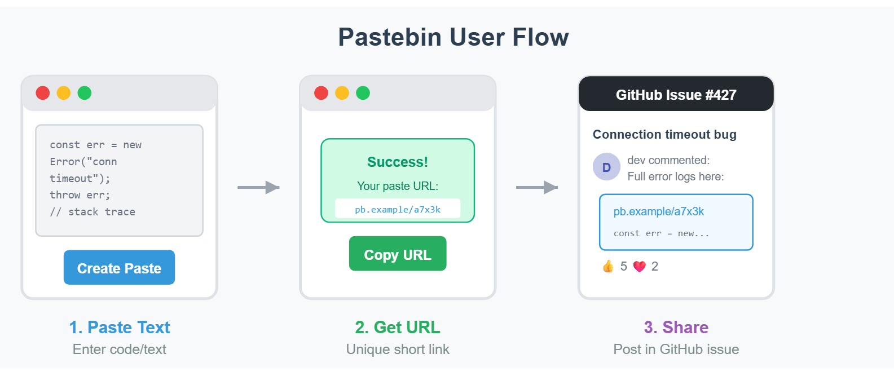
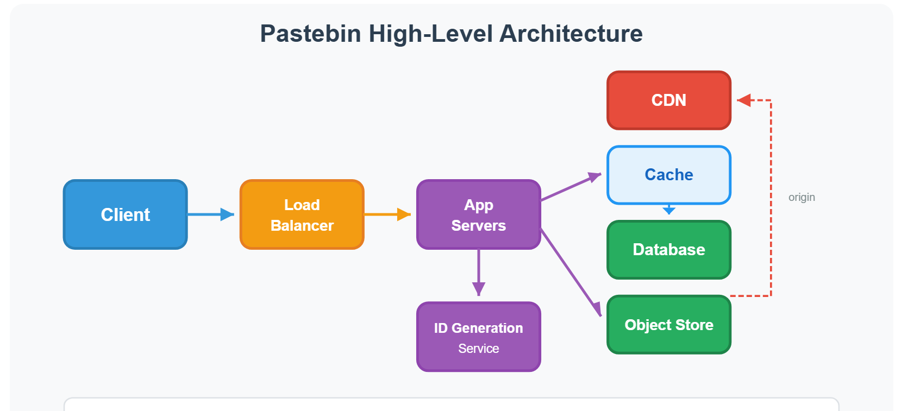
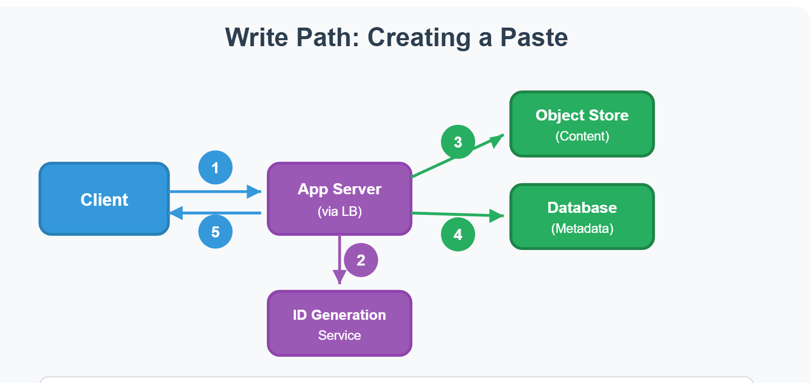
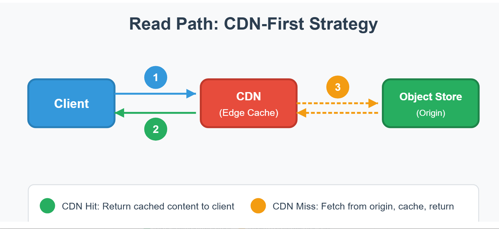
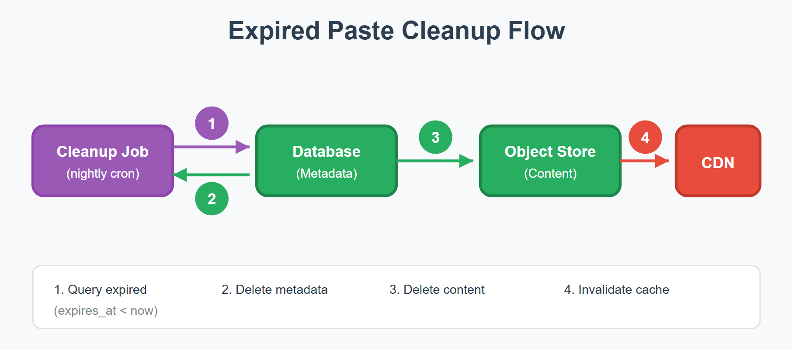
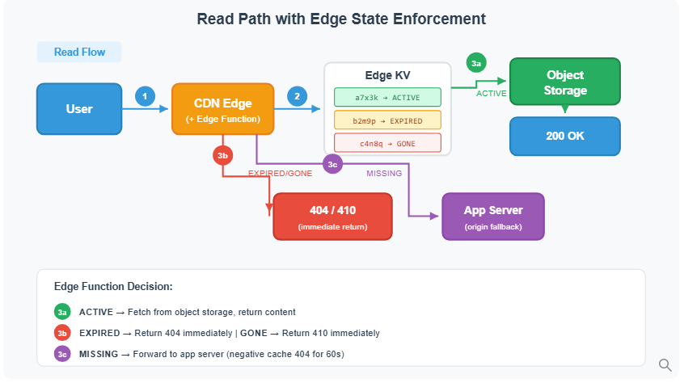
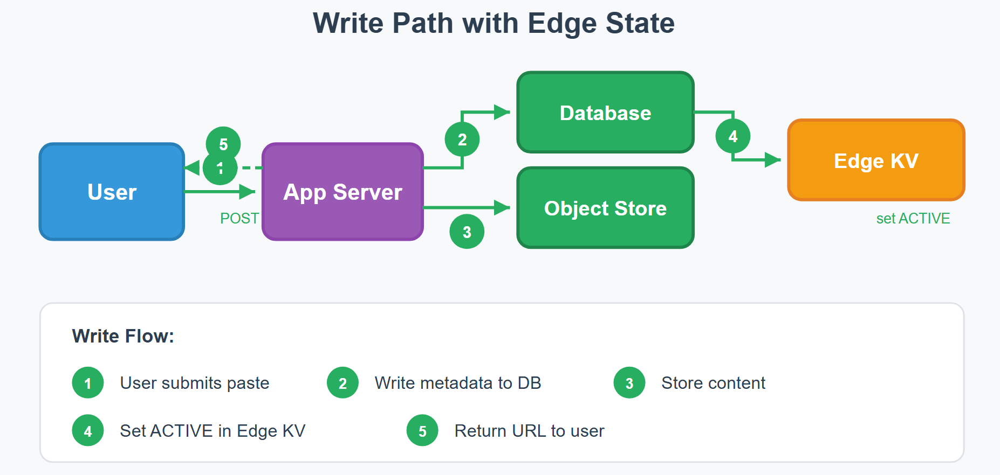
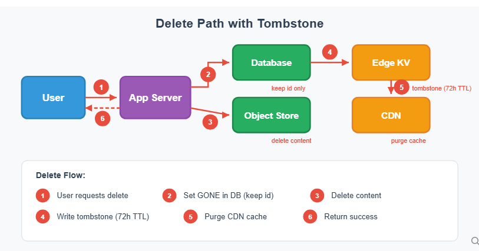

# Design Pastebin

Source: https://systemdesignschool.io/problems/pastebin/solution

> Note on fidelity: like the URL Shortener and Google Calendar pages, this page uses real static SVG diagram images (not live JS/SVG widgets), plus collapsible "Out of Scope", "Request & response" API panels, and many "Option N" sub-accordions inside each deep dive (comparing alternative designs before naming a recommended choice). A first pass with the page-text fetch tool only surfaced part of the page (through the first deep dive); reopening the live page and clicking through all 33 accordion controls revealed three additional deep-dive sections plus "Level Expectations" and "Interview Cheatsheet" sections that follow. Everything below is transcribed in the order it appears on the site.

Tags: system design · easy

---

## Introduction

A developer debugging a production issue copies 200 lines of error logs and pastes them into a text box. They click "Create Paste" and receive a short URL like `pb.example/a7x3k`. They post this link in a GitHub issue asking for help. Over the next week, dozens of developers investigating the same bug click that link.


The basic user flow: paste text in → short URL out → others click the URL to view the text.

This simple interaction hides interesting challenges: How do we generate millions of unique short URLs without collisions? Where do we store text that ranges from 10 bytes to 1 megabyte? How do we serve content fast when reads vastly outnumber writes?

## Functional Requirements

Pastebin has two core operations: storing text and retrieving it.

The write path generates unique IDs and persists data. At 12 writes/sec, this is straightforward — the interesting decision is where to store the actual text content.

The read path serves content fast. With a 100:1 read-to-write ratio (~1,200 reads/sec), CDN caching isn't optional — it's essential.

We decompose into:

1. **Store text** — Handle uploads, generate IDs, persist to storage. Users upload text content. The system generates a unique short URL and persists the text. The URL is returned immediately for sharing.
2. **Retrieve text** — Serve content with low latency using CDN. Users access a paste via its unique URL. The system retrieves and returns the text content with low latency.

**Out of Scope (expanded):**
- User authentication and accounts
- Syntax highlighting and formatting
- Paste editing after creation
- Comments and collaboration features
- Analytics and view counts

**Scale Requirements:**

| Assumption | Value |
|---|---|
| Daily active users | 1M |
| Read:write ratio | 100:1 (pastes shared on forums, GitHub issues, and documentation get many views) |
| Data retention | 3 months |
| Write operations | 1 per user per day |
| Average paste size | 10KB (max 1MB) |

## Non-Functional Requirements

- **Low latency** — Paste retrieval under 100ms (users expect instant page loads).
- **High durability** — Text must not be lost once stored (developers paste important code).
- **High availability** — 99.9% uptime (43 minutes downtime per month maximum).
- **Keep URLs unlisted** — Prevent scraping of all pastes (sensitive code snippets, config files). Important assumption: once shared, assume the whole world can access it — others can spread the URL freely. Deletion removes access but cannot prevent prior cloning. The entire design is based on this assumption.

## API Endpoints

**POST `/paste`** — Create a new paste. Returns a short URL and delete token immediately. Size limit 1MB to prevent abuse.

Request & response (expanded):

Request body:
```json
{ "text": "console.log('Hello world');", "expiry": "24h" }
```
Response body:
```json
{
  "id": "a7x3k",
  "url": "https://pb.example/a7x3k",
  "delete_token": "d8f2a1b9c4e7",
  "expires_at": "2024-01-16T12:00:00Z"
}
```

**GET `/{id}`** — Retrieve paste content. Returns 404 if expired or not found.

Request & response (expanded):

Response body:
```json
{
  "id": "a7x3k",
  "text": "console.log('Hello world');",
  "created_at": "2024-01-15T12:00:00Z",
  "expires_at": "2024-01-16T12:00:00Z"
}
```

**DELETE `/{id}`** — Delete a paste early. Requires the delete_token returned at creation.

Request & response (expanded):

Request body:
```json
{ "delete_token": "d8f2a1b9c4e7" }
```
Response body:
```json
{ "status": "deleted" }
```

## High Level Design

### 1. Store Text

Users upload text content. The system generates a unique short URL and persists the text. The URL is returned immediately for sharing.

A developer pastes 50 lines of error logs and clicks "Create." Within 200ms, they have a URL to share.

**The First Decision: Where Should We Store the Text?**

The simplest approach stores everything in one database table:

```sql
CREATE TABLE pastes (
  id VARCHAR(8) PRIMARY KEY,
  content TEXT,
  created_at TIMESTAMP
);
```

But at scale: text content varies wildly — from 10 bytes to 1 megabyte. With 1M pastes per day at 10KB average, we're storing 900GB over 3 months. Putting all that in a relational database creates problems:
- **Table bloat** — large TEXT columns fragment across pages, slowing queries.
- **Backup pain** — database dumps include all content — 900GB takes hours to backup and restore.
- **Cost** — database storage costs significantly more per GB than object storage.

This points toward separating metadata from content. The chosen approach is a **hybrid**: database for metadata, object storage for content. The database stays fast for queries we actually need (checking expiry, analytics), while object storage handles the bulk content at a fraction of the cost.

**Why Not Just Use Object Storage for Everything? (expanded)** Without a database, we can't: query "find pastes expiring tomorrow" without scanning all objects; build an admin dashboard showing paste counts by day; implement rate limiting based on a user's recent paste count. Object storage is great for blobs, but terrible for queries. By keeping metadata in the database, we get the best of both: cheap storage AND queryable metadata.

**High-Level Architecture**


Database (metadata) + Object storage (content) + CDN (in front of object storage, edge caching) + in-memory Cache (metadata lookups).

The system separates concerns:
- **Database** holds metadata: ID, creation time, expiry time, content size (fixed-size rows, fast queries).
- **Object storage** holds text content: keyed by paste ID (cheap, durable, unlimited scale).
- **CDN** serves content to users: sits in front of object storage as origin, caches at edge locations worldwide.
- **Cache** holds metadata for fast lookups: "does this paste exist?" checks without hitting the database.

**The Write Path**



```text
Client ─▶ Load Balancer ─▶ App Server ─▶ ID Generator
                                   │
                    ┌──────────────┼──────────────┐
                    ▼                              ▼
           Object Storage (/{id})           Database (metadata)
                    │                              │
                    └──────────────┬──────────────┘
                                   ▼
                          Response: short URL
```
The numbered write flow below.

1. Request arrives at the load balancer and routes to an application server.
2. ID generation creates a unique short identifier.
3. Object storage receives the text content at path `/{id}`.
4. Database stores metadata: `INSERT INTO pastes (id, created_at, expires_at, size_bytes)`.
5. Response returns the short URL to the user.

The write path takes a moment — object storage writes aren't instant. This is acceptable since users don't expect immediate response when uploading content.

**The Second Decision: How Do We Generate Unique IDs?** This ID must be unique across all 90M pastes.

**Option 1: Auto-increment + Base62 Encoding (expanded)** — Database generates sequential IDs (1, 2, 3...). Encode to base62: `1 → 1`, `62 → 10`, `1000000 → 4c92`. Simple and guaranteed unique. Limitation: predictable — an attacker can guess `a7x3k → a7x3l → a7x3m` and scrape all pastes; a security problem.

**Option 2: Random Generation (Recommended) (expanded)** — Generate random 8-character strings from `[a-zA-Z0-9]`. Check database for collision before inserting. Unpredictable IDs resist enumeration attacks. Limitation: collision check adds a database query, but the probability of any single ID colliding is tiny (90M / 218T ≈ 0.00004%), so retries are rare.

**Option 3: Pre-generated ID Pool (expanded)** — Background worker pre-generates random IDs and stores them in a pool. Write path grabs an unused ID instantly — no collision check needed. Zero generation latency. Limitation: more moving parts — must monitor pool depth and refill proactively.

**Option 4: Bloom Filter for Collision Check (expanded)** — Maintain a Bloom filter in memory containing all existing IDs. On write: generate random ID → check Bloom filter. If "maybe exists," regenerate. If "definitely not," write to database (with unique constraint as final safety net). A Bloom filter is a space-efficient set-membership structure that answers "definitely not in set" or "maybe in set" — it cannot say "definitely in set." Eliminates ~99% of unnecessary database reads during ID generation. Limitation: likely overkill here — collision probability is already tiny (0.00004%), so this optimizes a non-problem; adds memory overhead and complexity for minimal gain. That said, correctly applying a Bloom filter demonstrates knowledge of probabilistic data structures — a nice scoring point in interviews, even while acknowledging it's over-engineering for this scale.

**Our Choice: Random Generation.** Random generation with collision check. The collision check relies on the database primary key constraint — just attempt the insert and catch the duplicate key error, no separate lookup query needed. Collision probability is tiny (0.00004%), so retries are rare. Simple implementation, and security against enumeration. Pre-generated pools and Bloom filters add operational complexity that isn't justified at this scale.

**Data Schema:**

```sql
CREATE TABLE pastes (
  id VARCHAR(8) PRIMARY KEY,     -- "a7x3k"
  created_at TIMESTAMP NOT NULL,
  expires_at TIMESTAMP,          -- NULL means never expires
  size_bytes INT NOT NULL        -- for analytics, rate limiting
);

CREATE INDEX idx_expires ON pastes(expires_at);  -- for cleanup job
```

The actual text lives in object storage at path `/{id}` (matching the URL path). The schema is tiny — just 4 columns — keeping the database fast and backups quick.

### 2. Retrieve Text

Users access a paste via its unique URL. The system retrieves and returns the text content with low latency.

**The Baseline: Read Without Caching**

1. Parse ID from URL: `a7x3k`.
2. Query database: `SELECT * FROM pastes WHERE id = 'a7x3k'`.
3. Check if expired (compare `expires_at` with current time).
4. Fetch content from object storage: `GET /a7x3k`.
5. Return content to user.

Object storage requests add latency compared to serving from memory or edge cache. With a 100:1 read-to-write ratio and 1M DAU creating 1 paste/day:

```
Reads/day = 1M pastes/day × 100 reads/paste = 100M reads/day
Read QPS = 100M ÷ 86,400 seconds ≈ 1,157 reads/sec
```

This baseline works but is inefficient: the same paste gets fetched from origin storage ~100 times on average, every read pays the full round-trip to origin, and pastes never change after creation — so identical content is repeatedly fetched. This is exactly the pattern caching solves: edge caches serve content from locations closer to users, absorb most read traffic, and work perfectly with immutable data like pastes.

**The Key Decision: How Do We Speed Up Reads?**

**Option 1: In-Memory Cache for Full Content (Not Recommended) (expanded)** — Cache the entire paste content in an in-memory cache. Full control over caching and invalidation. Limitation: memory is expensive — at 10KB average paste size, caching 50k hot pastes = 500MB RAM; in-memory caches work best with small values, and large blobs cause memory fragmentation and latency spikes.

**Option 2: In-Memory Cache for Metadata Only (expanded)** — Cache metadata (existence, expiry time) in memory, but serve content through CDN or directly from object storage. Fast "does this paste exist?"/"is it expired?" checks; small memory footprint (metadata ~100 bytes vs 10KB content); instant invalidation on delete. Limitation: adds operational complexity — at ~1,200 reads/sec the database still handles metadata lookups fine, but caching can provide faster response times if needed.

**Option 3: CDN (Recommended) (expanded)** — Put content at edge nodes close to users. First request fetches from origin; subsequent requests hit the edge. Dramatically reduces latency for geographically distributed users; handles massive read traffic without scaling origin servers; purpose-built for serving static content like paste text. Works well because content is immutable once created. Set CDN TTL to match paste expiry; for deletions, call the CDN invalidation API. Limitation: CDN invalidation is eventually consistent (seconds, not instant) — acceptable for most pastebin use cases.

**Our Choice: CDN for Content.** CDN is purpose-built for serving static blobs; paste content is immutable, ideal for edge caching. Object storage + CDN is a common, battle-tested pattern. Memory-based caches should store small, frequently-accessed data (metadata, sessions) — not multi-KB blobs. For metadata, an in-memory cache is added for fast "does this paste exist?" lookups — at ~1,200 reads/sec the database could handle this directly, but the cache reduces latency and protects the database from read spikes.

**Read Path With CDN.** The write path returns a short URL like `pb.example/a7x3k` — where does that request go?

**Option 1: App Server Redirect (expanded)** — Client hits `pb.example/a7x3k` → app server checks metadata (exists? expired?) → returns 302 redirect to `cdn.example/a7x3k`. Can check expiry and deletion before serving. Limitation: extra round trip on every read; app server involved in all reads, adding load and latency.

**Option 2: Return CDN URL Directly (expanded)** — Write path returns `cdn.example/a7x3k` as the short URL; client always uses the CDN domain directly. Simple, no routing logic needed. Limitation: two domains to manage; can't check expiry per-request.

**Option 3: CDN in Front of Domain (Recommended) (expanded)** — The main domain (`pb.example`) points directly to the CDN. The CDN routes requests based on path: `/a7x3k` (paste IDs) → object storage origin; `/api/*` → App server origin. Users access `pb.example/a7x3k` directly — no redirect, no app server involved for reads. Single-domain experience, simple for users. Limitation: can't check expiry per-request; relies on cleanup job + CDN invalidation.

**Our Choice: CDN in Front.** Single domain gives users a clean experience, no extra latency from redirects, and the design already relies on the cleanup job for expiry anyway. The CDN is configured with multiple origins and path-based routing rules:
- **Origin A**: Object storage (paste content)
- **Origin B**: App server / load balancer (API + writes)

Routing rules: `/api/*` → Origin B (app server); 

`/*` → Origin A (object storage). 

The main domain points to CDN, and the CDN forwards to the right origin based on request path. Most CDN providers support this pattern.



```text
Client ─▶ pb.example/a7x3k ─▶ CDN
                                │
                 ┌──────────────┴──────────────┐
                 ▼ hit                          ▼ miss
        Return content                Object Storage (origin)
        immediately                          │
                                              ▼
                                   Cache at edge, return to client
```
Numbered flow below.

1. Client requests `pb.example/a7x3k`.
2. **CDN hit**: Edge cache returns content immediately.
3. **CDN miss**: CDN fetches from object storage origin, caches at edge, returns to client.

Most reads hit the CDN edge cache. Cache misses fetch from origin and populate the CDN for subsequent requests.

**CDN Caching Behavior.** CDNs use a **pull-through** pattern: on the first request for a paste, the CDN fetches from object storage (origin), caches the response at the edge, and serves subsequent requests from cache. Ideal for pastebin because most pastes are accessed a few times shortly after creation, then forgotten — the CDN naturally caches "hot" content and lets "cold" content fall out.

**CDN Configuration (expanded):**
- **TTL (Time-To-Live)**: Set CDN cache TTL to match paste expiry. For pastes that never expire, use a reasonable default (e.g., 24 hours). The CDN re-fetches from origin after TTL expires.
- **Cache key**: The URL path (`/a7x3k`) serves as the cache key. Each paste gets its own cache entry.
- **Invalidation**: When a user deletes a paste, call the CDN invalidation API to purge it from edge caches. Most CDNs complete invalidation within seconds.

```python
def delete_paste(id):
    db.delete(id)
    object_storage.delete(f"/{id}")
    cdn.invalidate(f"/{id}")  # Purge from edge caches
```

**Handling Expired Pastes.** What happens when a user clicks a link to a paste that expired yesterday? With CDN-only reads, we can't check `expires_at` per-request — there's no app server in the path. Instead, we rely on the background **cleanup job** to delete expired content:



```text
Cleanup Job (nightly)
   │
   ├─▶ Find pastes WHERE expires_at < now()
   ├─▶ Delete from Database + Object Storage
   └─▶ Invalidate CDN cache for deleted pastes
```
Numbered flow below.

1. Cleanup job runs nightly, finds pastes where `expires_at < now()`.
2. Deletes from database and object storage (we pay for stored objects, so cleanup saves cost).
3. Invalidates CDN cache for deleted pastes.

After cleanup runs, requests for expired pastes return 404 from object storage (object doesn't exist). Before cleanup runs, expired content may still be served — this brief window is acceptable for most use cases.

"Can't we check expiry at the edge?" Yes, but each approach adds per-request overhead:
- **Edge functions** — every read now needs a metadata lookup to check `expires_at`; the edge must query the database or a cache on each request, adding latency and failure modes.
- **Signed URLs** — embed expiry in the URL itself (e.g., `pb.example/a7x3k?expires=1705410000&sig=abc123`); requires key management for signing, and you can't extend expiry after the URL is shared.

The cleanup job, by contrast, already exists for storage cost reasons — adding CDN invalidation is just one more step in a job already running. For pastebin, where users rarely access pastes right at the expiry boundary, this tradeoff makes sense.

```sql
-- Cleanup job runs at 3am
DELETE FROM pastes WHERE expires_at < NOW() - INTERVAL '1 day';
```

The 1-day buffer handles timezone edge cases and gives users a grace period. The cleanup job can also delete corresponding objects in batch — much more efficient than one-at-a-time deletion.

## Deep Dive Questions

### How do we handle traffic spikes when many users create pastes simultaneously? (Senior)

From scale requirements (1M DAU, 1 paste/user/day, 100:1 read:write ratio):

```
Write QPS = 1M pastes/day ÷ 86,400 seconds ≈ 12 writes/sec
Read QPS = 100M reads/day ÷ 86,400 seconds ≈ 1,157 reads/sec
```

But real traffic isn't steady. What happens when AWS has a major outage and thousands of developers simultaneously paste error logs to share with teammates? Write QPS jumps from 12 to 1,200 — a 100x spike.

**Scaling the Application Tier.** Application servers are stateless — they don't store paste data locally, everything goes to object storage and the database — so they scale horizontally without coordination. Behind the load balancer, an auto-scaling group monitors CPU and request count; when traffic spikes it launches additional instances, cloud providers can spin up 10x capacity in minutes, and the load balancer routes traffic to new instances. This handles request processing, but all those servers still write to the same database.

**Understanding the Bottleneck.** A database connection pool of 100 connections, with 1,200 requests/second and each write taking 50ms, needs 60 concurrent connections just to keep up. The pool exhausts, requests queue up, timeouts cascade, users see "Service Unavailable." The database is the bottleneck — it can't handle 100x load instantly.

**Option 1: Bigger Database (expanded)** — Upgrade to a more powerful instance with more connections and IOPS. Works immediately, no code changes. Limitation: expensive — larger instances cost significantly more, and you pay for that capacity 24/7 for spikes that happen rarely. (Database sharding is possible too, but for a 12 writes/sec baseline, that's massive over-engineering given the complexity of partitioning by paste ID, cross-shard queries, and shard routing.)

**Decouple Request Handling from Persistence.** Users don't need their paste persisted synchronously — they need a URL immediately; actual storage can happen seconds later. This is where message queues shine.

**Option 2: Message Queue Buffering (Recommended) (expanded)** — API server receives paste, generates ID, stores content in object storage, returns URL immediately. Metadata (ID, timestamps, size) goes into a message queue. Worker processes consume from the queue at a steady rate (say, 50/sec per worker). Workers write metadata to database. Why queue metadata instead of content? Message queues have size limits (typically 256KB to 1MB) and pastes can reach 1MB — by storing content in object storage first and queueing only metadata (~100 bytes), queue limits are avoided entirely. During a spike, the queue grows; at 1,200 writes/sec with workers processing 50/sec each, 24 workers drain the queue in real-time — with fewer workers, the backlog clears in seconds to a minute. Users get their URLs instantly; metadata becomes queryable shortly after. Absorbs 100x spikes without provisioning 100x capacity. Limitation: eventual consistency — a user might share their URL before the paste appears in database queries. Is this acceptable? The content is already in object storage — the paste is readable immediately via CDN; only metadata queries (like "list my recent pastes") are delayed, and by the time anyone clicks the link, the database is updated.

**Option 3: Reject with Backpressure (expanded)** — When load exceeds capacity, return `429 Too Many Requests` with a `Retry-After` header; clients retry later. Protects the system from overload. Limitation: users experience failures — acceptable for free tiers, frustrating for paying customers.

**Our Recommendation:** message queue buffering with rate limiting as a safety valve. Normal traffic (12 writes/sec): writes go directly to storage, low latency. High traffic (100x spike): writes queue up, drain over time, users still get URLs immediately. Extreme traffic (queue depth exceeds threshold): rate limiting kicks in, returns 429, protects the queue from growing unbounded. The slight delay from queueing is invisible to users; the experience stays smooth even during major incidents, and there's no payment for 100x capacity that sits idle 99.9% of the time.

### How would the design change if we scaled to 100M or 1B daily active users? (Senior)

With 100:1 read:write ratio:

| Scale | DAU | Write QPS | Read QPS | Storage (3 months) |
|---|---|---|---|---|
| Current | 1M | 12/sec | 1,157/sec | 900 GB |
| 10x | 10M | 116/sec | 11,574/sec | 9 TB |
| 100x | 100M | 1,157/sec | 115,740/sec | 90 TB |
| 1000x | 1B | 11,574/sec | 1.16M/sec | 900 TB |

Each order of magnitude introduces new bottlenecks.

**At 10x (10M DAU): Expand CDN and Add Read Replicas (expanded)** — At ~11,500 reads/sec, the CDN handles content delivery fine; metadata queries increase, but write traffic (116/sec) is still manageable for a single database. Changes needed: expand CDN edge locations for better global coverage (more edge nodes = lower latency worldwide); add database read replicas for metadata queries (primary handles writes, replicas handle existence checks); the in-memory cache handles increased metadata queries without changes since it's already in the base design. The architecture stays fundamentally the same — just adding horizontal capacity.

**At 100x (100M DAU): Shard the Database (expanded)** — At ~1,150 writes/sec, a single database primary becomes the bottleneck — connection pools saturate, write latency increases. Changes needed: shard the database by paste ID (hash the ID to determine which shard stores the metadata — with 10 shards, each handles ~120 writes/sec, comfortable again); scale the in-memory cache cluster by adding nodes (distributed caches handle key routing automatically); message queue becomes mandatory (traffic spikes would otherwise overwhelm individual shards). Shard selection: `shard_id = hash(paste_id) % num_shards`. The ID generation strategy matters now — random IDs distribute evenly across shards, while sequential IDs would create hot shards.

**At 1000x (1B DAU): Multi-Region Architecture (expanded)** — At 12,000 writes/sec globally, presence in multiple regions is needed to reduce latency and provide disaster recovery. Changes needed: multi-region deployment (users in Europe write to EU region, users in Asia write to APAC region); cross-region replication for reads (a paste created in US should be readable from EU within seconds); global load balancing routes users to nearest region; conflict resolution for the rare case of simultaneous writes (not an issue for pastebin — IDs are unique, pastes are immutable). Storage architecture also changes: object storage cross-region replication for content availability; 900 TB storage likely moves to a data lake architecture with tiered storage (hot/warm/cold); cleanup jobs become complex — must coordinate deletion across regions.

**Summary: What Triggers Each Change**

| Bottleneck | Threshold | Solution |
|---|---|---|
| Content latency | Users in multiple continents | Expand CDN edge locations |
| Metadata read throughput | Single cache node saturated | Add cache nodes (cluster scales horizontally) |
| Write throughput | Single DB primary saturated | Database sharding |
| Regional latency | Users far from single region | Multi-region deployment |
| Storage cost | 100+ TB | Tiered storage (hot/warm/cold) |

The lesson: don't over-engineer for scale you don't have. The 1M DAU design is simple — single database, CDN for content, no sharding. Add complexity only when specific bottlenecks appear.

### How do we enforce expiration immediately instead of waiting for the cleanup job? (Senior)

A developer shares a paste containing database credentials by mistake, realizes the error after 10 minutes, and sets the paste to expire immediately. But with the current design, the paste remains accessible until the 3am cleanup job runs — potentially 15 hours later. Unacceptable for sensitive content.

**Why Can't We Check Expiry on Every Request?** In the current read path: request hits the CDN edge; CDN checks its cache — hit returns immediately, miss fetches from object storage; object storage returns the content (it has no concept of "expiry"). There's no app server in this path, no component checks `expires_at` — the paste exists in object storage, so it gets served. The cleanup job is the only enforcement mechanism, and it runs on a schedule. Real-time checks are needed without routing every read through an app server (which would defeat the purpose of CDN caching).

**Moving the Check to the Edge.** Modern CDNs offer edge compute — small functions that run at edge locations before requests reach origin. Instead of checking expiry at the servers, the check happens right where the request arrives. But the edge function needs to know when each paste expires.

**Option 1: Query the Database from Edge (expanded)** — On each request, the edge function calls the API to check `expires_at` in the database. Simple to implement — just one API call. Limitation: every read now hits the backend — at 1,200 reads/sec, this eliminates the benefit of CDN caching entirely; you pay for CDN infrastructure while doing all the work yourself.

**Option 2: Embed Expiry in Signed URLs (expanded)** — Encode the expiry time directly in the URL: `pb.example/a7x3k?expires=1705410000&sig=abc123`. The edge validates the signature and checks the embedded timestamp. No external lookups needed. Limitation: the URL is frozen at creation time — if a user extends the expiry (a common feature request), the old URL still expires at the original time; anyone who bookmarked the original link gets a 404 while newer links work, requiring some way to invalidate all old URLs.

**Option 3: Edge Key-Value Store (Recommended) (expanded)** — Store paste state in an edge KV store — a distributed key-value database replicated to edge locations worldwide (major CDN providers offer this: Cloudflare Workers KV, Fastly KV Store, AWS CloudFront KeyValueStore). On paste creation, write: `key: a7x3k`, `value: {state: "ACTIVE", expires_at: "2024-01-16T12:00:00Z"}`. On every read, the edge function: looks up paste state in edge KV (sub-millisecond, no network round-trip to your servers); if `now >= expires_at` → return 404 Not Found immediately; if active and not expired → fetch content from object storage. Immediate enforcement — expiry takes effect within seconds of the timestamp; edge KV handles millions of reads/sec across global edge locations; state can be updated (extend expiry, mark deleted) without changing URLs. Limitation: requires a CDN with edge compute and KV capabilities.

**Our Choice: Edge KV.** Sub-millisecond lookups without hitting the backend. The edge function runs a simple check before every request reaches origin. (The page shows a diagram with both paths: active pastes proceed to object storage (3a), while expired or deleted pastes return immediately (3b) without touching origin — this protects both the backend and storage costs.)

**What If the Edge KV Entry Doesn't Exist?** The edge function might not find an entry: propagation delay for newly created pastes, or entries cleaned up for very old pastes. When this happens, the edge function forwards the request to the app server. This is safe because: new pastes have low traffic immediately after creation, so a few origin hits don't matter; old pastes with no entry are either deleted (no content in storage → 404) or still active (app server serves it). CDN negative caching (404 cached for 60 seconds) prevents repeated origin hits for truly non-existent IDs. Combined with request coalescing (multiple simultaneous requests share one origin fetch), even a surge of requests for a missing ID results in minimal backend load.

**Updated Write Path:** generate random ID; attempt database insert (PK constraint ensures uniqueness); write content to object storage; write to edge KV: `id → {state: "ACTIVE", expires_at: "..."}`; return URL to user. The edge KV write is fast (typically under 50ms to propagate globally) — by the time the user shares the URL, edge locations worldwide can enforce the expiry.

**What Happens to the Cleanup Job?** It still runs, but its role changes. Before: source of truth for expiration (deleted content when `expires_at` passed). After: housekeeping only (reclaims storage space, removes old database records). Edge KV is now the source of truth — the cleanup job saves storage costs by deleting objects no longer being served, but correctness doesn't depend on it. If the cleanup job fails for a week, expired pastes still return 404 because the edge enforces it.



```text
Edge Read Path:
Client ─▶ Edge Function ─▶ Edge KV lookup
                                │
                ┌───────────────┼───────────────┐
                ▼ expired/GONE                    ▼ active
        404 / 410 immediately             Object Storage ─▶ content

Edge Write Path:
Client ─▶ App Server ─▶ Database insert (id)
                    ├─▶ Object Storage (content)
                    └─▶ Edge KV write: id → {state: ACTIVE, expires_at}
                                │
                                ▼
                        Return URL to user
```

Illustrate the edge-KV-aware read and write paths described above.

### When a user deletes a paste, why can't we just delete the Edge KV entry? (Senior)

The Edge KV stores state metadata (ACTIVE/GONE, expires_at) — not the actual paste content; content lives in object storage, and the CDN caches responses from the app server. When a user deletes a paste, the obvious approach is to delete the Edge KV entry — but this creates two problems: **backend protection** (what happens when the edge function can't find an entry? it must forward to the app server, and for viral content this causes a traffic stampede) and **ID reuse prevention** (if all records of a paste are deleted, the ID generator might accidentally reissue the same ID later, and a user bookmarking `pb.example/a7x3k` could suddenly see completely different content).

**The Thundering Herd Problem.** 

Imagine a viral paste with millions of views gets deleted: it's cached at 200 CDN edge locations; the user deletes it, so the Edge KV entry is deleted and the CDN cache purged; the CDN cache purge propagates (takes seconds); after purge, all 200 edges simultaneously have cache misses; edge functions check Edge KV → "not found" → all forward to app server; the app server gets slammed with requests and the database gets hammered with "does a7x3k exist?" queries. Deleting the Edge KV entry removes the protection — the edge can't distinguish "deleted" from "never existed" or "propagation delay," so it must ask the backend.

**The Solution: Tombstones.** Instead of deleting the Edge KV entry, update it to a tombstone — a state marker that says "this paste was deleted, don't ask the backend": `key: paste_id`, `value: {state: "GONE"}`. Now when the edge function checks: Edge KV lookup → finds `state: GONE` → returns 410 Gone immediately → no app server hit, no database query. The tombstone absorbs the traffic spike — even with millions of requests, the backend stays quiet.

**But How Long Do We Keep the Tombstone?** Not forever, due to two constraints: **storage cost** (Edge KV stores have capacity limits; keeping tombstones for every deleted paste forever consumes significant space at scale) and **diminishing returns** (traffic to deleted content cools off quickly — a viral paste might get millions of requests in the first hour after deletion, but after 72 hours stragglers are rare). After the traffic spike passes, cheaper protections take over: CDN negative caching (cache 404 for 60 seconds) and request coalescing handle the occasional straggler without keeping permanent tombstones. Tombstone lifecycle: ~72 hours, auto-deleted via TTL in Edge KV.

**Preventing ID Reuse.** Tombstones handle the traffic problem; for reuse, the database solves it. After deletion, only the `id` column is kept — no content, no metadata. The ID generator attempts insert; the PK constraint catches any collision. The database record exists not for serving requests, but for the ID generator to know which IDs are taken. The ID string alone reveals nothing about the content or who stored it — privacy satisfied.

**What Gets Deleted vs What Stays:**

| Storage | After Deletion | Lifecycle | Why |
|---|---|---|---|
| Object storage | Content deleted | Within privacy SLA | Privacy compliance |
| Edge KV | Tombstone deleted | ~72 hours | Backend protection (temporary) |
| Database | Keep id only | Permanent | ID reuse prevention |

**The Complete Delete Flow**:

 update database — set `state = GONE`, keep the `id`; delete content from object storage (privacy); write edge tombstone: `id → {state: GONE}` with TTL = 72 hours; purge CDN cache (best-effort cache invalidation); return success — user sees confirmation immediately. After 72 hours (tombstone expires): Edge KV — ID no longer exists → miss; request goes to origin → object already deleted → 404; CDN caches the 404 for 60 seconds (negative caching); no thundering herd because traffic has died down.

**Why 410 Gone Instead of 404?** 404 Not Found is ambiguous — could mean a typo in the URL or that it never existed. 410 Gone signals "this existed but was intentionally removed," and tells caches this is permanent — safe to cache indefinitely. For privacy-sensitive designs, you might prefer 404 for everything (to avoid confirming a paste ever existed) — the tombstone still prevents the thundering herd, you just return 404 instead of 410.

## Level Expectations

Pastebin is an entry-level system design problem that tests understanding of basic distributed systems concepts: caching, storage separation, and API design.

| Dimension | Mid-Level (L4) | Senior (L5) | Staff (L6) |
|---|---|---|---|
| **Architecture** | Identifies need for separate metadata and content storage | Explains trade-offs between SQL/NoSQL, designs for failure modes | Considers multi-region deployment, cost optimization |
| **Caching** | Uses cache-aside pattern for reads | Compares CDN vs application cache, explains when each applies | Designs tiered caching (CDN + in-memory cache), considers cache consistency guarantees |
| **Scalability** | Calculates QPS and storage from scale requirements | Explains what changes at 10x/100x scale (sharding, CDN, read replicas) | Designs multi-region architecture, coordinates cross-region replication |

## Interview Cheatsheet

**Core Architecture in 60 Seconds.** Pastebin stores text and returns short URLs. Separate metadata (database) from content (object storage) — different access patterns, different scaling characteristics. Use CDN for content delivery — it's purpose-built for serving static blobs. Generate random IDs to prevent enumeration attacks.

**Key Trade-offs to Mention:**
- **Storage separation** — database for metadata (fast queries, indexes), object storage for content (cheap, durable). Object storage costs a fraction of database storage.
- **Caching strategy** — CDN for content (purpose-built for static blobs), in-memory cache for metadata (fast existence checks, protects DB from spikes). Don't cache multi-KB content in memory — use CDN.
- **Consistency model** — eventually consistent is fine. Brief inconsistency during failures is acceptable — users retry.
- **ID generation** — random 8-character base62 IDs. 218 trillion combinations. Resists enumeration, but rate limiting on 404s is critical.

**Common Mistakes to Avoid:**
- Storing text blobs in the relational database (fragmentation, backup pain, cost).
- Caching content in memory (expensive, CDN is better for blobs).
- Using sequential IDs (security risk — trivial to enumerate).
- Forgetting to handle paste expiry (cleanup job needed).
- Over-engineering for 12 writes/second (this is an easy problem at baseline scale).

---


