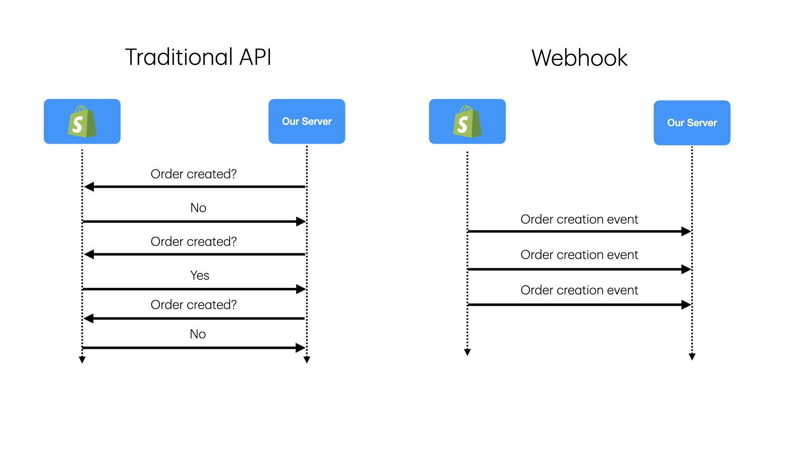
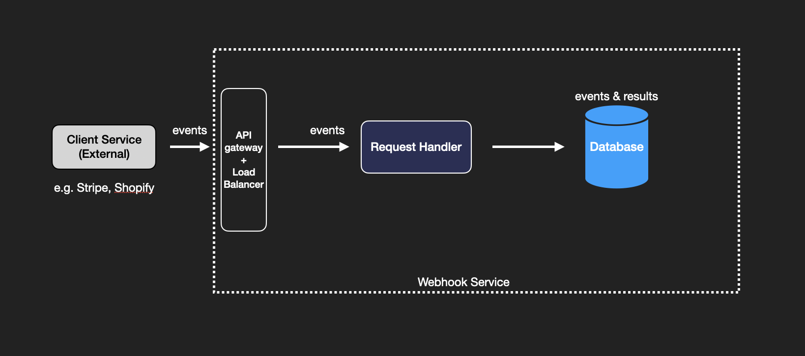
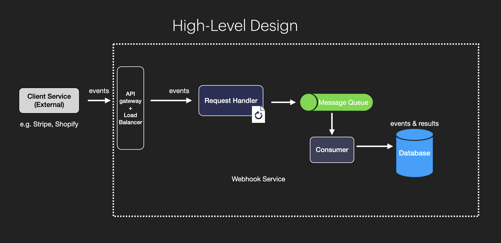
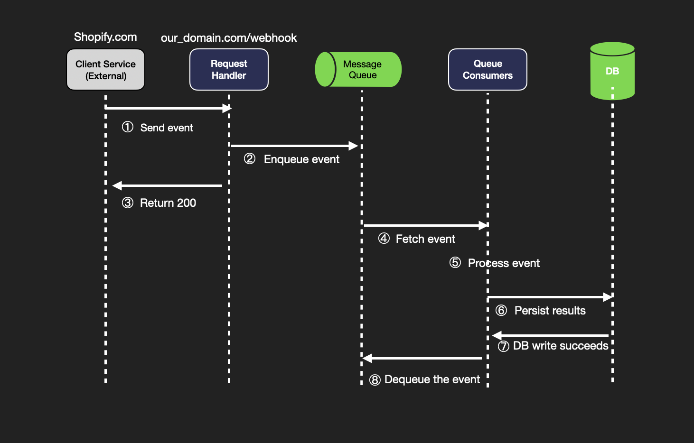
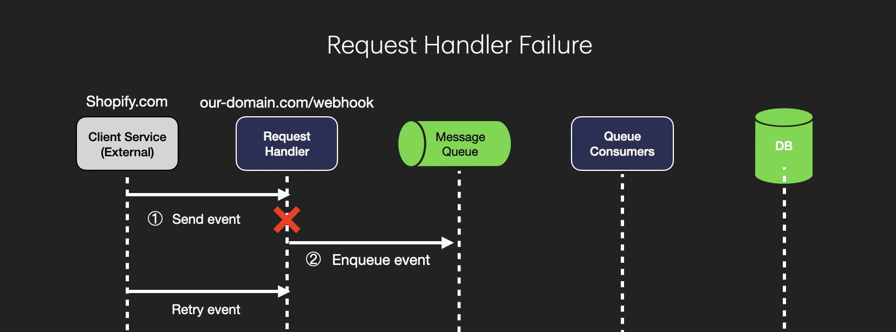
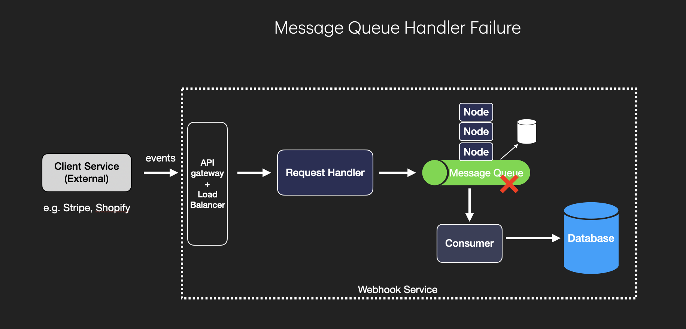
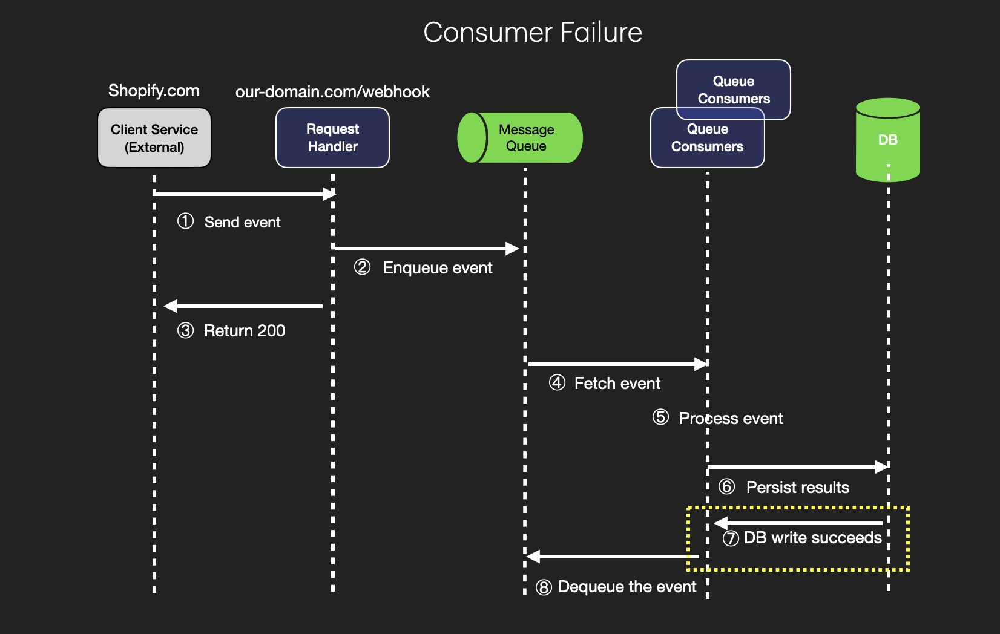
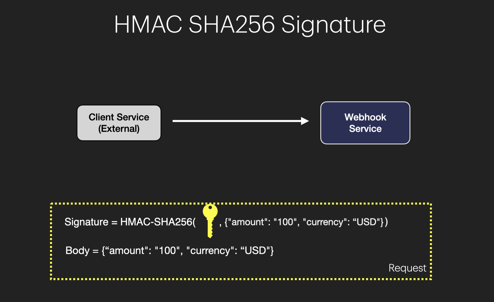

# Design Webhook

Source: https://systemdesignschool.io/problems/webhook/solution

> Note on fidelity: like the URL Shortener and Pastebin pages, this page uses real static PNG diagram images (not live JS/SVG widgets), plus a collapsible "Out of Scope" section and a "Request & response" API panel, both expanded via the live page. All eight of the page's diagram images are listed in Assets below; each is fully described by the numbered-step prose the site places directly alongside it, which is transcribed in full.

Tags: system design · easy

---

## Introduction

Webhooks allow systems to send real-time notifications triggered by specific events. Unlike traditional APIs, which rely on polling, webhooks push data immediately when an event occurs, making them highly efficient and real-time.

## Background

Webhooks are a common way to receive real-time notifications from external systems. They are widely used in modern web applications, including payment processing, social media updates, and event ticketing systems. Unlike traditional APIs, which rely on polling, webhooks push data immediately when an event occurs, making them highly efficient and real-time.


*Contrasts the traditional polling API pattern (client repeatedly asks "any updates?") against the webhook pattern (server pushes the update the moment it happens).*

Real-world examples:
- Stripe: https://docs.stripe.com/webhooks
- Shopify: https://shopify.dev/docs/apps/build/webhooks
- GitHub: https://docs.github.com/en/developers/webhooks-and-events/about-webhooks

## Functional Requirements

Accept API calls to receive event notifications (e.g., payment processed or order shipped), execute corresponding operations, and persist original event data and operation results for tracking, auditing, and debugging.

The service must ensure events are processed even if system components fail, maintaining reliability for critical data.

**Out of Scope (expanded):**
- Managing state changes in our system caused by the webhook.

**Scale Requirements:**

| Assumption | Value |
|---|---|
| Event volume | 1 million events per day |
| Traffic spikes | Peak-hour incoming requests may increase by 5x |
| Latency requirement | End-to-end latency (event arrival → processing completion) under 200ms |
| Data retention | 30 days, assuming each event is 5KB |

## Non-Functional Requirements

- **High availability** — The system should be highly available and resilient to failures.
- **Low latency** — As per the scale requirement, end-to-end latency should be under 200 milliseconds.
- **At-least-once processing** — Each event should be processed at least once if the system accepts it.

## API Endpoints

**POST `/webhook`** — Receive webhooks from external systems, returns 200 OK if the event is accepted.

Request & response (expanded):

Response body:
```json
{ "status": "success" }
```

## High Level Design

### 1. Accept API Calls to Receive Event Notifications

Accept API calls to receive event notifications (e.g., payment processed or order shipped), execute corresponding operations, and persist original event data and operation results for tracking, auditing, and debugging.

Let's start with a basic design. When an external system sends an event via an HTTP request, the webhook service needs a request handler to receive and process the event. This data is then immediately saved into a database.


*External system → Request Handler → Database.*

While straightforward, this design has a flaw. The request handlers handle the HTTP requests as well as the business logic of processing and persisting the events. If the request handler fails after processing the event but before saving it, the event could be lost.

### 2. High Availability and Resilience

The service must ensure events are processed even if system components fail, maintaining reliability for critical data.

**Buffering with Message Queue.** To address issues from the basic design, a message queue is introduced between the request handler and the database. This reduces the responsibility of the request handler to handling initial HTTP requests and enqueuing messages, while separate consumers process events from the queue and save them to the database. The message queue temporarily holds events, ensuring no data is lost even if the system experiences issues.


*External system → Request Handler → Message Queue → Queue Consumer(s) → Database.*

This design offers several benefits, including failure recovery, load buffering, and scalability.


*Sequence diagram for the design, described step-by-step below.*

1. **Send Event** — The external client service (e.g., Shopify.com) triggers an event and sends it to the webhook service's endpoint (`our_domain.com/webhook`). This event could represent a specific action, like a payment confirmation or order update.
2. **Enqueue Event** — The Request Handler in the webhook service receives the event and enqueues it into a Message Queue. This stores the event temporarily, allowing the system to process events asynchronously, improving reliability and scalability.
3. **Return 200** — After enqueuing the event successfully, the Request Handler immediately returns a 200 HTTP status code to the client, confirming that the webhook event has been received. This acknowledgment allows the client to know the event was accepted, even if processing hasn't yet occurred.
4. **Fetch Event** — A Queue Consumer fetches the event from the Message Queue, processing events one by one (or in batches, depending on design) as they become available.
5. **Process Event** — The Queue Consumer processes the event, performing the necessary operations related to the event. For example, if it's a payment confirmation, it may update the payment status in the system.
6. **Persist Results** — After processing, the Queue Consumer persists the results of the operation to a database — the original event, the outcome of the processing, and any relevant status updates.
7. **DB Write Succeeds** — Once the results are successfully saved, the system receives confirmation of a successful write operation, ensuring the event processing has been completed and recorded for audits or debugging.
8. **Dequeue the Event** — After the event has been successfully processed and stored, it is dequeued from the Message Queue, marking it fully handled and freeing space for new incoming events.

**Handling Failure in Each Component.** In a webhook processing service, maintaining reliability and resilience in the face of potential failures is crucial for ensuring events are not lost and the system can recover smoothly.

**1. Request Handler Failures.** The request handler receives incoming events and enqueues them for further processing. Failures here can lead to lost events if not managed carefully.


*Illustrates the request-handler failure scenario described below.*

- **Failure Before Enqueuing** — if the request handler fails after receiving an event but before enqueuing it, the client service will not receive an HTTP 200 response. Since a 200 status code signifies the event has been accepted, if the response isn't sent the client service knows the event wasn't successfully received and can retry sending it.
- **Timeouts and Circuit Breakers** — timeouts prevent the request handler from hanging indefinitely if it encounters issues; if a request takes too long, a timeout triggers a failure, signaling the client to retry. A circuit breaker can temporarily halt request processing if failures are detected, giving the system time to recover.

**2. Message Queue Failures.** The message queue temporarily holds incoming events until queue consumers can process them. Failures here could result in lost events, undermining reliability.


*Illustrates the message-queue failure scenario described below.*

- **Durable Queues** — use durable queues that persist messages to disk, so even if the queue server crashes or restarts, events remain available when the server comes back online. Durable queues typically store messages in a database or on disk rather than in memory, for an extra layer of reliability.
- **Replication Across Multiple Nodes** — replicating the queue across multiple nodes achieves high availability; if one node fails, others take over and continue processing events. Many message queue systems (Kafka, RabbitMQ) support cluster setups where messages are replicated across nodes to prevent data loss.

**3. Queue Consumer Failures.** Queue consumers fetch events, process them, and store the results. If a consumer fails mid-processing, this can lead to unacknowledged or incomplete operations.


*Illustrates the queue-consumer failure scenario described below.*

- **Multiple Consumer Instances** — deploy multiple instances of queue consumers so that, if one fails, another can take over its workload — fault tolerance and continuous processing, especially during high-traffic periods.
- **Message Acknowledgment** — only acknowledge and dequeue a message after the event has been successfully processed and stored in the database. This guarantees that if a consumer fails mid-processing, the message remains in the queue and can be retried by another consumer instance.
- **Auto-Restart and Scaling** — configure the system to automatically restart failed consumer instances (e.g., Kubernetes handles this automatically). Scaling consumer instances up or down based on queue length helps manage fluctuations in event volume — this is the primary reason a message queue is used in the design.

**4. Database Failures.** Prevented using typical measures:
- **Write Retries with Backoff** — automatic retries with exponential backoff for database writes; if the first attempt fails, the system retries after a short delay, with each subsequent delay increasing if failures continue, avoiding overwhelming the database during transient issues.
- **Database Replication and Failover** — use a database with built-in replication and failover capabilities, allowing the system to switch to a secondary instance if the primary fails, minimizing downtime.

Additionally, standard monitoring and alerting practices should be implemented on all components (Request Handler, Message Queue, Queue Consumers, Database) to detect issues like increased latency, high error rates, or resource bottlenecks — tools like Prometheus, Grafana, or New Relic monitor key performance metrics and set up alerts for quick response.

## Deep Dive Questions

### How to secure the webhook service?

**1. HMAC Signatures.** The webhook provider (e.g., Stripe) and the webhook service share a secret key. The provider generates an HMAC hash of the payload using this secret and includes it in the request headers.


*Illustrates HMAC signature generation and verification.*

- **Verification** — when the webhook service receives a request, it recalculates the HMAC hash using the shared secret and the request body. If the calculated hash matches the one in the request, the request is authenticated.
- **Benefit** — prevents unauthorized parties from spoofing requests, as they wouldn't have the shared secret.

**2. IP Whitelisting.** Configure the webhook service to accept requests only from known IP addresses associated with the webhook provider. Many cloud providers offer firewall or network rules to allow traffic only from specific IP addresses.
- **Benefit** — protects against attacks from unauthorized IPs, reducing the attack surface, though this requires the webhook provider's IP address to not change.

**3. Rate Limiting.** Limit the number of requests the webhook service can accept from a specific IP or client within a certain time frame — e.g., allow only 100 requests per minute per client.
- **Benefit** — prevents malicious actors from overwhelming the service by sending excessive requests (Denial-of-Service attacks, aka DoS attacks).

### How to handle duplicate requests?

Duplicate webhook requests can occur due to network retries, client-side issues, or intentional replay attacks. It's essential to design the webhook service to handle these duplicates gracefully to ensure data consistency and idempotent operations.

**1. Idempotency Keys.** An idempotency key is a unique identifier associated with each request that allows the server to recognize subsequent retries of the same request. The webhook provider includes a unique identifier (e.g., `event_id` or `request_id`) in the webhook payload or headers. When processing a webhook event, store the `event_id` along with a timestamp in a dedicated database table for tracking processed events. Before processing a new event, check if the `event_id` already exists in the database; if it does, skip processing to prevent duplicate operations. Since events must be stored for 30 days, idempotency keys should be retained for at least the same duration to handle late-arriving duplicates.

**2. Message Queue Deduplication.** Some message queue systems offer built-in deduplication features based on message IDs (e.g., AWS SQS with deduplication). Assign a unique message ID to each event when enqueuing it in the message queue, and configure the deduplication window according to the expected time frame in which duplicates might arrive. This prevents duplicate messages from being processed by consumers, reducing the load on the processing system.

### How to handle out-of-order requests?

Out-of-order requests occur when events arrive at the webhook service in a different order than they were sent, which can happen due to factors like network delays. For example, consider a system processing payment events from Stripe. If Stripe sends two events — `invoice.paid` and `invoice.created` — ideally `invoice.created` should be processed first, then `invoice.paid`. However, this doesn't always happen and `invoice.paid` may arrive first. Processing logic shouldn't expect events to arrive in order and should be designed to handle them correctly.

To handle the `invoice.paid` event correctly:
- Fetch the latest invoice data using the Stripe API and the invoice ID provided in the `invoice.paid` event, ensuring the most up-to-date and complete invoice information before processing the payment status.
- Update the local database with the latest invoice data, update the invoice status to `PAID`, then trigger any business logic that needs to happen when an invoice is paid.

When the `invoice.created` event arrives:
- Compare the `created_time` in the `invoice.created` event with the `updated_time` in the `invoice.paid` event. Once it's clear this event is older than the current invoice data, it can be skipped.

**Takeaways:**
- The system should not make assumptions about the order of events, and its correctness should not depend on event order or uniqueness.
- Webhooks should be designed to be idempotent and stateless.

To achieve this:
- Use states from the source of truth (e.g., Stripe API) and avoid making assumptions based on local database states.
- Utilize event IDs and timestamps to determine if an event is outdated and should be skipped.

