# Design Typeahead / Autocomplete

Source: https://systemdesignschool.io/problems/typeahead/solution

> Note on fidelity: this page is built from live JS-interactive widgets (a design-checkpoint multiple-choice toggle, expandable API request/response panels, several Bad/Good/Great rated-answer accordions per deep dive, and a quiz with click-to-reveal answers) rather than static images, matching the same template as the Rate Limiter reference page. Every widget's full content — including both design-checkpoint options, all expanded API bodies, all three Bad/Good/Great tiers per deep dive, and all five quiz answers — was clicked through on the live page and is transcribed below as text, in the same order it appears on the site. The site has no downloadable diagram image files for this page (all diagrams are inline JS/SVG node-and-arrow renderings), so there are no image assets to save.

Tags: Medium difficulty · Caching · Precomputation · Sharding · Async processing · Trie

---

## Problem statement

Build the suggestion service behind a search box. As a user types a prefix, the service returns the top few completions of that prefix, ranked by how popular each completion is. A user typing `car` should see `cardigan`, `car rental`, `cards` — the most-searched continuations, not a random match.

In scope: returning the top-K completions of a prefix, ranking them by popularity, and ingesting the search and click signals that popularity is built from. Out of scope: the full search results page, the search engine that answers the chosen query, spell correction, and per-user personalization. Those last two return as variants at the end.

> **K and top-K.** K is the size of the suggestion list — usually 5 to 10. "Top-K" means the K highest-ranked completions of a prefix, e.g. the 10 most-searched queries that start with `car`.

## Clarifying questions

Each question fixes an assumption that shapes the design.

- **What ranks the suggestions?** Global popularity — how often each query is searched. Personalization and context are extensions, not the base case.
- **How large is the corpus?** Assume tens to hundreds of millions of distinct popular queries. This decides whether the index fits on one machine or must be split.
- **How fresh must suggestions be?** Staleness of minutes to hours is acceptable. A query that started trending this minute need not appear instantly.
- **What is the latency target?** A near-instant response per keystroke — fast enough that a suggestion is back before the user presses the next key.
- **Prefix-only or fuzzy?** Exact prefix is the base case. Typo tolerance (`teh` → `the`) is a harder variant.

> **p99.** The 99th-percentile latency: 99% of requests finish faster than this number. We size for the tail, not the average, because the slowest 1% is what users notice.

## What makes this problem distinctive

A normal read endpoint can afford to do work per request: query a database, sort, return. Typeahead cannot. Two forces pull against each other.

The first is the time budget. A suggestion is only useful before the user types the next character, so the service has a tiny window per keystroke — and one user generates a burst of these as they type a single word. The second is ranking over scale. The answer is not "any completion of the prefix" but "the few most popular ones," chosen from a corpus far too large to scan and sort on demand.

In the naive approach — on each keystroke, find every query matching the prefix, sort by popularity, return the top few — the two forces collide. The matching-and-sorting work grows with the corpus, while the budget per keystroke stays fixed. The naive read path gets slower as the data grows.

The solution is to **move the ranking off the request path entirely**. Popularity changes slowly and is read enormously often, so compute the ranked answer for every prefix ahead of time, store it in memory, and let each keystroke be a lookup rather than a computation. This inversion — rank when data changes, not when it is read — is the central design principle.

**the two decoupled paths**

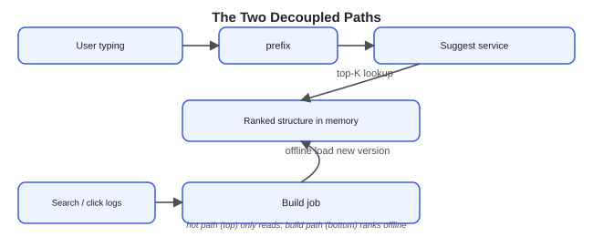

## Key concepts

This section covers the concepts needed to solve this problem — prerequisites for the design work that follows. The design rests on three ideas: the structure that holds completions, the ranked answer cached inside it, and the inversion that decides when ranking happens.

### The trie

A **trie** (prefix tree) is a tree where each edge is a character and each node represents the prefix spelled by the path from the root. All queries sharing a prefix share the path to that prefix's node. To find completions of `car`, you walk root → `c` → `a` → `r` in three steps, then everything in the subtree below is a completion. The walk costs one step per character of the prefix — independent of how many queries the trie holds.

**trie shape**

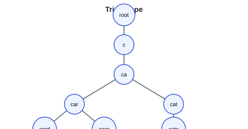

### Precomputed top-K per node

The trie alone tells you which queries complete a prefix, but not which are most popular — and the subtree under a short prefix can hold millions of queries. So store, at each node, the node's **top-K completions already sorted by popularity**. A lookup walks to the prefix node and returns that cached list directly. This avoids a subtree scan and a sort at request time.

**cached top-K at node `car`**

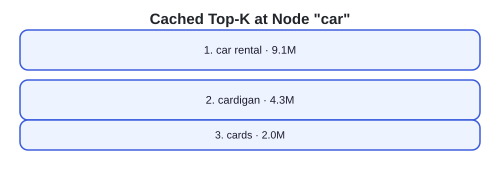

### Rank when data changes, not when it is read

This is the inversion. The naive path ranks at read time: every keystroke pays for matching and sorting. The chosen path ranks at write time: an offline job computes each node's top-K when popularity changes, and reads become pure lookups. It works because the read rate dwarfs the change rate — popularity shifts over minutes, but suggestions are served constantly.

**two paths contrasted**

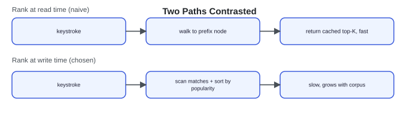

> **Key idea.** Autocomplete is a prefix index with the ranking already done. Precompute the top-K for every prefix offline, hold it in memory, and the per-keystroke latency budget is met with a cache hit instead of a computation.

## 1. Requirements

### 1.1 Functional requirements

- **Suggest.** Given a prefix, return its top-K completions (default K = 10) ranked by popularity.
- **Rank by popularity.** Ordering reflects how often each completion is searched, refreshed over time so the ranking tracks real demand.
- **Ingest signals.** Take in the search and click events that popularity is computed from.

### 1.2 Non-functional requirements

- **Latency.** A near-instant p99 per keystroke — the headline constraint that shapes everything else.
- **Read-heavy.** Suggestions vastly outnumber corpus and popularity changes. Build offline, serve from memory.
- **Availability.** Degrade gracefully — return slightly stale or fewer results rather than erroring. A blank suggestion box is acceptable; a failed page is not.
- **Scalability.** Scales linearly with added prefix shards and serving replicas.

### 1.3 The binding constraint vs the non-negotiable property

The binding constraint is the per-keystroke latency budget: it rules out any per-request ranking or disk access. The non-negotiable property is ranked relevance: returning *some* completion is easy, but returning the *most popular* ones is the point. The design exists to satisfy both at once — and that is achievable because the ranking is precomputed.

> **Key idea.** Latency forbids ranking at read time; relevance forbids skipping ranking. Ranking ahead of time, offline, is what lets a design honor both at once.

## 2. Back-of-the-envelope estimation

The numbers decide one thing: whether the index fits in memory, and how much read traffic the serving tier must absorb.

**Interactive estimation widget (default inputs):**

| Input | Default |
|---|---|
| Searches / sec | 100K |
| Suggest calls / search | 5 |
| Distinct query strings | 100M |
| Trie bytes / node | 120B |

**Computed outputs:**

| Output | Value | Formula shown |
|---|---|---|
| Suggest QPS (peak) | 500K/s | 100K searches × 5 calls |
| Ranked trie in RAM | 12 GB | 100M nodes × 120B |

`suggest QPS = 100K searches/s × 5 debounced calls = 500K/s`. Every keystroke is a read — debounce is what keeps the firehose tractable. The whole ranked trie fits in RAM, so a lookup is a pointer walk, not a ranked query.

### Query volume

Assume roughly 100K searches per second at peak. Each typed query fires several suggest calls as the user types — even after the client trims duplicate keystroke requests — so suggest traffic is several times search traffic, on the order of 500K suggest queries per second. This is the load the serving tier and any cache in front of it must handle.

### Corpus and memory

Assume around 100M distinct popular query strings, averaging about 20 characters. A trie with a small top-K cached per node lands in the range of a few to tens of gigabytes — large, but RAM-resident on the serving tier, and split across shards if one machine cannot hold it. Collapsing the many single-child chains — the long unique tails of queries — shrinks it further (shown in the deep dive). The point of the estimate is the conclusion: the whole index fits in memory, so the hot path never touches disk.

### Build cost

Aggregating billions of daily search and click events into popularity scores is a batch or streaming job on a schedule. It is heavy, but it runs off the serving path, so its cost does not enter the latency budget.

> **Key idea.** The corpus fits in memory and changes slowly, while reads arrive constantly. That ratio — huge read rate over a small, RAM-sized, slow-changing dataset — is what makes precompute-and-serve-from-memory the right shape.

## 3. API design

Two calls serve different paths. One is the entire hot path and must be a cached lookup; the other is a fire-and-forget write.

**Design checkpoint widget:** *"Where should ranking happen — in the suggest call, or before it?"* Options: "Inside suggest, on each request" / "Before suggest, in an offline build" (checked/correct answer). If ranking runs inside suggest, every keystroke pays for it and the latency budget is gone. Ranking must already be done before the request arrives, so suggest only reads a precomputed list.

### GET `/v1/suggest?prefix=car&k=10`

Request & response (expanded):

Request body: (none — `prefix` and optional `k`, `context` are query params)

Response body:
```json
[
  { "completion": "car rental", "score": 9.1 },
  { "completion": "cardigan", "score": 4.3 }
]
```

`suggest` is the hot path: a prefix in, a cached top-K out. An optional `context` (locale, for example) can select which precomputed index to read, but it never triggers ranking at request time.

### POST `/v1/events`

Request & response (expanded):

Request body:
```json
{ "query": "car rental", "action": "click" }
```
Response body:
```json
{ "accepted": true }
```

`logEvent` records a search or click. It is asynchronous — the client does not wait for it, and the event flows into the offline pipeline, never into the suggest path. The acting user is taken from the authenticated session, not the request body.

> **Key idea.** The API shape encodes the inversion: `suggest` only reads, `logEvent` only writes, and the two are wired to entirely separate paths.

## 4. Data model

Three representations of the same information, each shaped for its job.

**Three schema variants**
- `QueryEvent { string query; string action; timestamp ts }`
- `Popularity { string query_string; float score }`
- `TrieNode { string prefix; TopK top_k; map children }`

A **QueryEvent** is a raw search or click, appended to a log with no precomputation. The offline job aggregates events into **Popularity**: a `query_string → score` map, where score weights frequency by recency so old fads decay. Popularity is then inserted into the **TrieNode** structure, where each node carries the sorted `top_k` for its prefix.

**relationship**

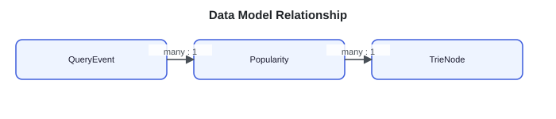

Many events roll up into one popularity score; many scores populate one node's top-K. They live in different places: events in a log or stream, popularity in an offline store, and the trie in RAM on the serving tier. The high-volume event stream and the heavy build do not run on the keystroke path, because they sit on the other side of that boundary.

> **Key idea.** The same query exists as an event, an aggregate score, and a cached rank — each form tuned for write, build, or read, and physically separated so they never contend.

## 5. High-level design

The design starts from the naive version and removes one failure at a time.

> **Reading the diagrams.** Each step adds components, marked **NEW**. Earlier parts stay as they were unless the text says otherwise.

The naive version: one service that, on each keystroke, queries a database with a prefix match and an order-by.

**naive**

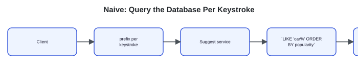

This fails the latency budget immediately. A prefix match plus a sort runs per keystroke, over a growing table, on disk. The work scales with the corpus while the budget does not.

### Fix 1: precompute the ranked answer in memory

Ranking moves off the read path. Aggregate popularity offline, build a trie whose every node holds its sorted top-K, and keep it in RAM. A keystroke walks to the prefix node and returns the cached list — a memory-speed lookup with no ranking.

**step 1**

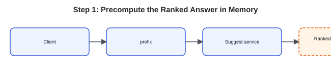

### Fix 2: shard the trie by prefix

The corpus outgrows one machine's RAM. Split the trie by leading characters across shards, and route each query to the one shard that owns its subtree. A lookup still touches exactly one shard. (Routing keys to nodes is the [consistent hashing](https://systemdesignschool.io/fundamentals/consistent-hashing) problem.)

**step 2**

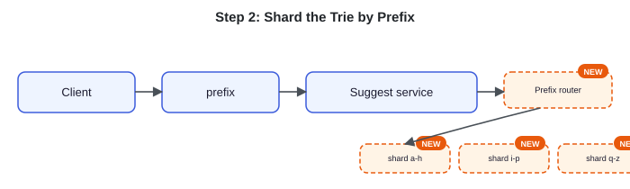

### Fix 3: cache hot prefixes and debounce the client

Short prefixes like `a` or `th` are queried enormously and have stable answers. Put a cache in front of the serving tier so those return without a trie walk. And on the client, wait a few tens of milliseconds after the last keystroke before sending, cancelling any superseded request — so a user typing `car` sends roughly one request, not three.

**step 3**

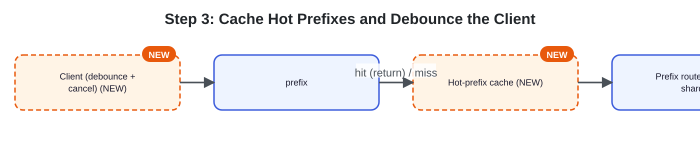

### Fix 4: build the index offline

Everything so far assumes the trie already exists. It is produced by a pipeline: search and click events stream through a [pub-sub](https://systemdesignschool.io/fundamentals/message-queue) log into an aggregation job that computes popularity, builds a fresh ranked trie, and loads the new version onto the serving tier on a schedule.

**step 4**

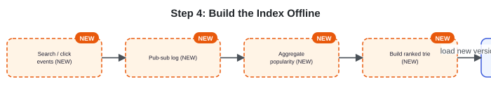

The composed system has two decoupled halves: a hot read path (client → cache → router → shard) and an offline build path (events → pub-sub → aggregate → build → load).

**composed sequence on a cache miss**

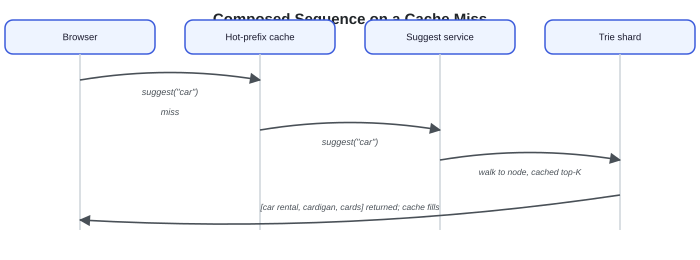

> **Key idea.** Every component here exists to defend the latency budget: the trie removes the sort, memory removes the disk, sharding removes the size ceiling, the cache removes repeat walks, and the offline pipeline removes the build from the request path.

## 6. Deep dives

### Building the ranked trie

> **Before reading on.** A short prefix like `c` could have millions of completions. How do you compute its top-K without scanning all of them on every build?

The build runs offline. First aggregate the query log into a popularity score per string, weighting recent activity more so that stale fads fade — without decay, a query that was huge last year would outrank today's rising one forever. Then insert the strings into a trie and compute each node's top-K.

Decay is a weight on each day's count by how old it is. With a decay factor of 0.5 per day, for example, 1,000 searches today count as 1,000, but 1,000 searches three days ago count as 1,000 × 0.5³ ≈ 125. So a query that spiked last week and went quiet sinks below one rising today, even when its all-time total is larger.

The build stays cheap because a node's top-K is built from its children's top-K, never from its whole subtree. Each child already stores its own sorted top-K list. To fill a parent, take the union of its children's lists — plus any query that ends exactly at the parent — sort by score, and keep the top K. Each child list is already only K long, so merging a handful of short lists is cheap. A single bottom-up pass (leaves first, then their parents) fills every node this way, and no node ever scans the millions of leaves beneath it.

For `car` with K = 3, its children `card`, `care`, `cart` each hand up their own short list; the parent merges those, re-sorts by score, and keeps the best three.

**bottom-up merge example**

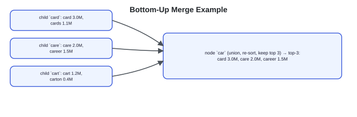

Two more refinements are used in production systems.

The first is **radix compression**. In a plain trie, most nodes have a single child: the long, unique tail of a word becomes a chain of one-character nodes that never branch. Each of those nodes still costs memory and a pointer hop, which adds up across a multi-gigabyte structure. Radix compression collapses each single-child chain into one edge labelled with the whole substring, so a node remains only where the path actually branches or a word ends.

Consider the queries `cardigan` and `cardigans`. A plain trie spells `cardigan` as eight chained nodes before the final `s` branches off — eight nodes that only pass the walk forward. Compression replaces that chain with a single edge labelled `cardigan`, then keeps the branch for `s`.

**plain trie vs radix-compressed**

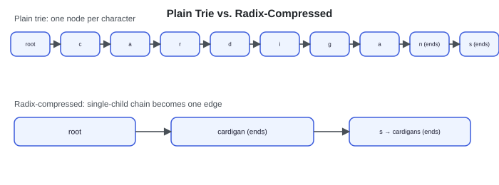

A lookup works the same way, only it matches the prefix against whole edge labels instead of one character at a time: finding `card` follows the `cardigan` edge and stops partway along it. Real query tails are mostly unique, so the collapse removes most of the nodes and most of the pointer hops, leaving a much smaller structure to hold in RAM.

The second refinement is the swap. The trie readers see is reached through a single pointer. The builder constructs the next version off to the side as a fresh, immutable structure, then flips that one pointer to it. Reads already in flight finish on the old trie; new reads follow the new one. Because nothing ever mutates a live structure, no read takes a write lock and no reader sees a half-built trie.

**three-step atomic swap**

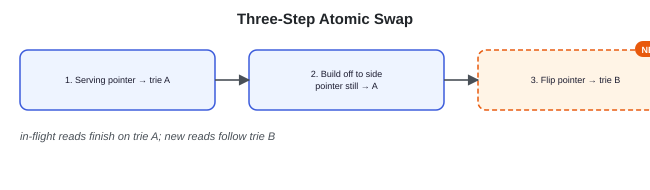

**Building the ranked trie — Bad/Good/Great widget (all three expanded):**
- **Bad — "Rank at query time":** Rank completions on each request. This is the naive design the whole problem is trying to escape — it cannot meet the latency budget.
- **Good — "Offline popularity + per-node top-K":** Aggregate popularity offline and store a precomputed top-K at each node. Reads become lookups.
- **Great — "Bottom-up propagation, radix compression, atomic swap, decay":** Add bottom-up top-K propagation so the build is one pass, radix compression to shrink the structure, time-decayed popularity so rankings stay current, and atomic immutable swaps so readers never see a partial build.

### Serving within the latency budget

> **Before reading on.** The trie is in memory and the answer is precomputed. What is left that could still blow the budget — and what is the cheapest thing to fix first?

On the hot path, the trie lives in RAM and a read is a lock-free pointer walk — no disk, no database, no lock contention because the structure is immutable between builds. That removes the per-request cost. What remains is request *volume* and *skew*.

The lowest-cost reduction is on the client: debounce and cancellation. Firing on every character sends three requests for `car`; waiting a few tens of milliseconds after the last keystroke and cancelling superseded requests cuts that to about one. It adds no server work and removes the most traffic, so it comes first.

**debounce timeline**

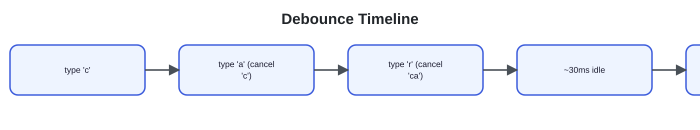

Next is skew. A few short prefixes take a large share of traffic, so a hot-prefix cache in front of the shards serves them without a walk. And because traffic is uneven across the alphabet, sharding should be skew-aware: split busy ranges like `s*` and `t*` across more shards than rare ones like `z*`, so no single shard becomes a hot spot. Concretely, the router holds a boundary table: `s*` might split into `s-a` through `s-m` on one shard and `s-n` through `s-z` on another, while all of `z*` shares a single shard. A query reads the table, picks the one owning shard for its prefix, and touches only that shard.

The same structure delivers the availability requirement — degrade, do not error. Because the serving tier is read-only replicas of an immutable index, a dead replica sheds its traffic to the others, and a failed build keeps serving the last good trie: suggestions become stale rather than unavailable. If one shard is briefly unreachable, the service returns the results it does have rather than failing the whole request — a shorter suggestion list is an acceptable answer, an error is not.

**Serving the hot path — Bad/Good/Great widget (all three expanded):**
- **Bad — "Trie on disk or a DB per keystroke":** Any disk or database access on the request path misses the budget by orders of magnitude.
- **Good — "In-memory trie, prefix sharding, caching":** Hold the trie in RAM, shard by prefix, and cache hot prefixes.
- **Great — "Debounce/cancel, lock-free reads, skew-aware sharding":** Treat client debounce and cancellation as a first-class latency lever, serve from a lock-free immutable structure, and shard by load rather than evenly so hot ranges do not concentrate.

### Freshness and trending

> **Before reading on.** The index is rebuilt on a schedule. What happens to a query that starts trending right after a build — and is that actually a problem?

Precomputed top-K is stale by up to one rebuild cycle. A term that began trending an hour ago will not appear until the next build. For most autocomplete that is acceptable, and the design should state the staleness rather than treat the index as live.

When near-real-time trending does matter, do not rebuild the whole trie on every event. Instead keep a small, fast-updating side structure of recently popular queries over a short window — fed from the same pub-sub stream — and blend it with the precomputed top-K at query time. The blend is a cheap merge of two short lists: take the union of the precomputed top-K and the real-time list for the prefix, dedupe by query, give the real-time entries a recency boost, re-sort, and keep the top K. Both inputs are already only K long, so this stays a handful of comparisons — it does not bring heavy ranking back onto the read path. That patches surging terms into the results without touching the heavy build.

**blend at query time**

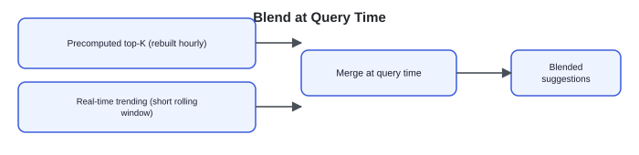

Time-decay belongs here too: weighting recent activity more means yesterday's fad fades and today's rises, instead of a once-huge query dominating forever.

**Freshness — Bad/Good/Great widget (all three expanded):**
- **Bad — "Assume suggestions are always current":** Treat the precomputed index as live and never mention staleness.
- **Good — "Name the rebuild-cycle staleness":** Acknowledge that suggestions lag by up to one build cycle and argue that is acceptable.
- **Great — "Real-time layer blended at query time, with decay":** Add a small real-time trending structure blended at read time and time-decayed popularity, and name the freshness-versus-simplicity tradeoff explicitly.

## 7. Variants

- **Personalization.** A global top-K is the same for everyone. Keep the shared trie and add a thin per-user re-rank, or blend per-user and per-segment signals at query time. Full per-user tries do not scale — keep the heavy structure shared and personalize in a small layer on top.
- **Fuzzy / typo tolerance.** Exact prefix misses `teh` → `the`. Allow a bounded number of edits during the trie walk, or add an n-gram index, at higher compute cost. Name it as a deliberate add-on rather than folding it into the base case.
- **10× scale.** More read volume means more serving replicas — the trie is read-only, so replicate it freely — plus finer prefix sharding for skew. The build pipeline scales independently as a batch or streaming job, and tiered caching of hot prefixes absorbs more of the load.

## 8. The transferable pattern

Typeahead is precompute-and-cache taken to its limit: the ranked answer to every prefix is computed and stored before anyone types. The per-keystroke budget is met by doing the ranking offline and serving from memory, not by computing per request.

That inversion — anticipate the reads, precompute the ranked answers, serve them from memory, and refresh asynchronously — recurs well beyond search boxes. Materialized feeds, leaderboards, recommendation candidate sets, and any latency-critical lookup over a slowly-changing corpus use the same shape. The answer is "a prefix index with the ranking already done," and the read path becomes a cache hit.

## Review: the 30-second answer

- Store completions in a trie; at each node, cache the precomputed top-K sorted by popularity.
- A keystroke walks to the prefix node and returns its cached list — no ranking at request time.
- Build the trie offline from query and click logs, and swap in each fresh immutable version.
- Serve from RAM; debounce on the client and cache hot prefixes to hold the latency budget.
- Shard by prefix when the trie outgrows one machine, splitting busy ranges more finely.
- Accept rebuild-cycle staleness, and patch in surging terms with a small real-time layer.

## Test yourself (Quiz)

**Quiz widget** ("Hide All" / "Reveal All" toggle) — 5 questions, each with a "Show/Hide Answer" button. Full text of every question and its revealed answer:

**1) Why does ranking at request time fail the latency budget as the corpus grows?**
Matching a prefix and sorting the matches is work proportional to how many completions exist. As the corpus grows, that work grows, but the per-keystroke budget stays fixed — so the naive read path gets slower as the data gets larger. Precomputing the top-K offline makes the read a constant-time lookup instead.

**2) How is a node's top-K computed without scanning its whole subtree?**
Bottom-up. A node's top-K is the merge of its children's top-K lists, so a single pass from the leaves upward computes every node's list — each parent only merges a few short lists from its children, never scanning the full subtree beneath it.

**3) Why swap the rebuilt trie in atomically as an immutable structure?**
So readers never observe a half-built index and never block on a write lock. The new trie is built separately, then made live with a single pointer change; every read sees either the complete old structure or the complete new one.

**4) What is the cheapest way to cut suggest traffic, and why first?**
Client-side debounce and cancellation: wait a few tens of milliseconds after the last keystroke and cancel superseded requests, so typing a word sends about one request instead of one per character. It adds no server work and removes the most traffic, so it is the first optimization to apply.

**5) How do you surface a term that starts trending between rebuilds?**
Keep a small real-time structure of recently popular queries over a short window, fed by the same event stream, and blend it with the precomputed top-K at query time. This patches in surging terms without rebuilding the whole trie on every event.

## Sources and further reading

- [Using Finite State Transducers in Lucene — Michael McCandless](https://blog.mikemccandless.com/2010/12/using-finite-state-transducers-in.html) — the compressed in-memory automaton behind Lucene's suggesters, the production form of a radix-compressed prefix structure.
- [Search suggesters — Elasticsearch reference](https://www.elastic.co/guide/en/elasticsearch/reference/current/search-suggesters.html) — the completion suggester loads a finite-state structure into memory to return prefix completions on the hot path, mirroring the in-memory trie here.

---

### System Design Master Template (embedded video)

YouTube embed: https://www.youtube.com/embed/OWVaX_cBrh8?si=MAfaQS1TV1r7USUI

### Comments

No comments were posted under this page at scrape time — the Comments section shows only the "Post" input with no existing comments listed.

---

## Assets

No downloadable diagram image files exist on this page — every diagram (the trie shapes, the estimation widget, the API panels, the bottom-up merge example, the plain-vs-radix-compressed trie comparison, the atomic-swap sequence, the debounce timeline, and the freshness blend) is a live JS/SVG node-and-arrow rendering, fully transcribed above as text. The only real `` on the page is the site's decorative header logo (`/logo.svg`), which is purely cosmetic and carries no article content.
