# Design Tinder

Source: https://systemdesignschool.io/problems/tinder/solution

> Note on fidelity: this page is built from live JS-interactive widgets (collapsible "Design Reflection" rationale boxes, expandable API request/response panels, a two-tab step-through race-condition simulator with 4 steps per tab, several Bad/Good/Great rated-answer accordions, and a quiz with click-to-reveal answers) rather than static images, matching the same template as the Rate Limiter and Typeahead reference pages. Every widget's full content — both race-condition tabs at all 4 steps, all 5 Design Reflection rationales, all expanded API bodies, all three Bad/Good/Great tiers per deep dive, and all six quiz answers — was clicked through on the live page and is transcribed below as text, in the same order it appears on the site. The site has no downloadable diagram image files for this page (all diagrams are inline JS/SVG node-and-arrow renderings), so there are no image assets to save.

Tags: Medium difficulty · Geospatial indexing · Sharding · Idempotency · Bloom filters · Availability

---

## Problem statement

Design the core of a location-based dating app: a user sees a feed of nearby candidate profiles, swipes like or pass on each one, and when two people like each other they match and can start talking.

In scope: the candidate feed, recording swipes, and detecting mutual matches. Post-match messaging is the Chat / Messenger case, treated as a separate service downstream of a match. Profile photo storage and delivery are out of scope — assume large blobs served behind a CDN. Ranking quality, payments, and identity verification are also out of scope.

## Clarifying questions

Each answer fixes an assumption the design leans on.

- **What counts as a match?** Both users swipe like on each other — a double opt-in. Neither side's like alone is a match.
- **Do we build the post-match chat?** No. Messaging is the Chat / Messenger case; this design stops at "two users are now matched."
- **How fresh must the candidate feed be?** Seconds to minutes of staleness is fine. Nobody expects a brand-new nearby user to appear in their feed instantly.
- **What's the scale unit?** Swipes per day, not profile views per day — the number that will turn out to size the system.
- **Is ranking or payments in scope?** No. Assume a ranker already exists and produces a score per candidate; defer its internals, the same way the Instagram design defers feed ranking.

## What makes this problem distinctive

Tinder looks like a nearby-search problem: find profiles near me, filter by preference, done. That is only half the problem, and the smaller half. Every swipe is a write, and a user issues one swipe for every card in their feed — the feed is read far less often than its contents are acted on. The system that has to survive load is the swipe path, not the candidate-search path.

Two invariants sit underneath that write path and cannot bend. A match is not something a user directly creates — it is a derived consequence of two independent likes, so the system must notice a mutual like without scanning anything. And a profile a user has already swiped must never resurface in their feed; the system must track every exclusion cheaply enough to check it on every request.

**load comparison**

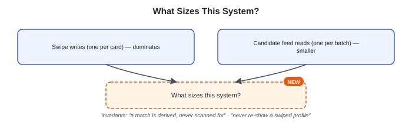

> **Key idea.** The swipe write firehose, not the candidate-feed read, is the load that shapes this design — and every swipe must respect two invariants: a match is derived, and a swiped profile never comes back.

## Key concepts

This section covers the concepts needed to solve this problem — prerequisites for the design work that follows.

### Geospatial indexing

Finding "who is nearby" cannot mean scanning every user's coordinates on every request. Space is divided into a grid of cells (a geohash string or an H3 hexagon), and each user's profile is tagged with its cell. Proximity search then becomes "look up this cell and its immediate neighbors" instead of a full scan — the same nearby-search problem Uber solves for drivers, applied here to profiles instead of moving vehicles.

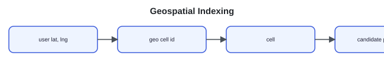

### Likes and derived matches

A swipe records one user's one-way decision about another: like or pass. A match is not stored by either user's action directly — it exists only once both directions of a pair have liked each other. Detecting it means checking whether the reverse edge already exists, not scanning a table for pairs.

> **Derived state.** A match is computed from two swipe rows, not written directly by any single request. If both swipes exist, the match must exist; if the match record is lost but both swipes remain, the system can rebuild it.

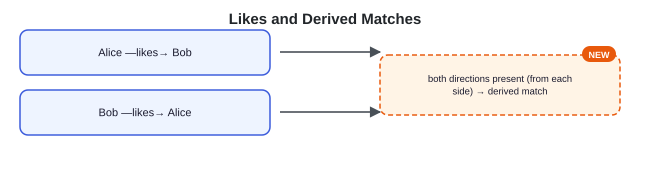

### The seen filter: a Bloom filter

The feed's "never re-show a swiped profile" rule means checking, for every candidate, whether the user has already swiped it. Keeping the full list of swiped ids per user is exact but grows without bound for active users. A Bloom filter is a compact, probabilistic set: a fixed-size bit array plus a handful of hash functions. Adding an id runs it through each hash function and sets the bit at each resulting position. Checking an id runs the same hash functions and looks at those same bit positions — if any of them is still unset, the id was definitely never added (no false negatives); if all of them are set, the id was probably added, but another combination of ids could have set the same bits by coincidence (a rare false positive).

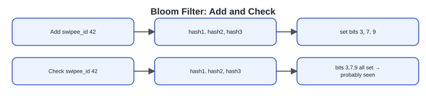

That asymmetry fits this exact rule — the guarantee runs the direction that matters, since a false positive only hides a candidate that was actually unseen, never resurfaces one the user rejected. This is why a Bloom filter satisfies the rule before any sharding or service design is added.

### Shard keys and access patterns

Splitting a large table across multiple machines means picking a shard key — the field used to decide which machine owns a row. Rows that share a shard key live together and can be queried together in one place; rows that don't share it may land on different machines and force a query to visit several. When a system has two access patterns that read the same data along different axes, one shard key will make one pattern cheap and the other expensive — never both.

**two shard-key choices**

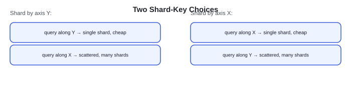

Which axis to optimize for depends on which pattern runs more often — a question the high-level design section works out concretely for swipes.

> **Key idea.** A match is derived from two directed likes, never scanned for; a Bloom filter's one-directional guarantee is exactly what "never re-show" requires; and a shard key can only make one access pattern cheap at a time.

## 1. Requirements

**Design Reflection widget:** *"Tinder's load is the exact reverse of typical web applications. While most sites are read-heavy (with a 100:1 read-to-write ratio), why is Tinder uniquely write-heavy, and how does this shape our requirements?"* — Revealed rationale: "On most social sites, users read many posts but write very little. On Tinder, pulling a candidate feed yields one read, but swiping on each card produces a database write. Because writes are frequent, our requirements focus on scaling the swipe write path."

### 1.1 Functional requirements

The actions in the problem statement are the requirements.

- **Candidate feed.** Given a user's location and preferences, return nearby profiles they have not already swiped.
- **Swipe.** Record a like or pass on a profile. This is the highest-volume write in the system.
- **Mutual match.** When two users like each other, create a match and notify both.
- **List matches.** A user can see their current matches.

### 1.2 Non-functional requirements

- **Swipe write throughput.** The swipe path must absorb billions of writes a day without falling over.
- **Match correctness.** A mutual like must produce exactly one match and notify both users — never zero, never two.
- **Feed latency.** Candidate-feed reads should return in the low hundreds of milliseconds.
- **No repeats.** A user must never be shown a profile they have already swiped.
- **Availability and durability.** Swipes and matches must survive process and node failure; the feed may degrade before the swipe path does.

### 1.3 The constraint versus the property

The property never to compromise is match correctness under a race: two near-simultaneous likes must still produce exactly one match, not zero and not two. The constraint that drives the rest of the design is swipe write throughput — everything from sharding to the seen filter has to survive that load first.

> **Key idea.** Match correctness is the property to protect; swipe write throughput is the constraint everything else is designed around.

## 2. Back-of-the-envelope estimation

**Interactive estimation widget (default inputs):**

| Input | Default |
|---|---|
| Daily active users | 50M |
| Swipes / user / day | 100 |
| Evening peak multiplier | 3× |
| Bytes / swipe row | 32B |

**Computed outputs:**

| Output | Value | Formula shown |
|---|---|---|
| Swipes / day | 5.0B | 50M × 100 |
| Average writes / sec | 58K/s | ÷ 86,400s |
| Evening peak writes / sec | 174K/s | 3× average |
| Swipe storage / day | 160 GB | 5.0B × 32B |

**Scaling verdict widget:** "Extreme Scale Architecture" — Peak writes exceed 100K/s. Requires sharded databases, append-only logs (Kafka), and precomputed candidate queues to protect the database layer. `writes = 50M × 100 ÷ 86,400s ≈ 58K/s average, 174K/s at peak`. A candidate feed is fetched a few dozen times a session, but every card in it produces a swipe write. Matches are rarer still — only the small fraction of swipes that are mutual. Size the write path first.

### 2.1 Writes: the swipe firehose

Assume about 50 million daily active users, each swiping roughly 100 profiles a day. That's 50M × 100 = 5,000M, or 5 billion swipes a day. A day holds 24 × 3,600 = 86,400 seconds, so the average write rate is 5×10⁹ ÷ 86,400 ≈ 58,000 swipes a second. Evening peaks run several times higher — at a 3× multiplier that's roughly 58,000 × 3 ≈ 174,000 writes a second.

### 2.2 Reads: the candidate feed

Each user pulls a fresh batch of candidates some tens of times a day (for example, 20). That's 50M × 20 = 1,000M, or 1 billion feed reads a day, averaging around 11,600 reads a second. Reads run at roughly a fifth of the write rate — the reverse of a typical read-heavy CRUD system.

### 2.3 Storage and the seen filter

Each swipe row is tiny: swiper id, swipee id, direction, timestamp — about 32 bytes. At 5 billion swipes a day that's roughly 160 GB of raw swipe data daily, before indexes. For the seen filter, a Bloom filter sized for a 1% false-positive rate costs about 9.6 bits per entry (from the standard formula bits/entry ≈ -log₂(p) / ln 2, evaluated at p = 0.01) — a fraction of the roughly 64 bits an exact per-entry record would need.

A match needs both users to like each other, so matches are a small fraction of swipes — the read side (matches list, notifications) never comes close to swipe-write volume.

> **Key idea.** The system must absorb roughly 58,000 swipe writes a second on average and 174,000 at peak — several times the candidate-feed read rate. Matches are a trickle by comparison; size for the writes.

## 3. API design

**Design Reflection widget:** *"When a user swipes 'like', they expect an immediate response. But the backend must check if the other user already liked them back. Should this match-check block the swipe write, or should it happen out-of-band?"* — Revealed rationale: "Blocking the write path adds latency to every swipe, even though most swipes do not result in a match. Instead, the API returns a response immediately, checking for a match out-of-band. If a match occurs later, the server pushes it asynchronously. This keeps the swiping experience instantaneous."

Every endpoint derives the acting user from the authenticated session — the swiper, the match owner — never from the request body.

### 3.1 Get the candidate feed

`GET /v1/candidates?limit=20`

Request & response (expanded):

Response body:
```json
{
  "candidates": [{ "user_id": "...", "name": "...", "photos": [], "distance_km": 0 }],
  "next_cursor": "..."
}
```

Location, preference filtering, and seen-filter removal all happen server-side against the authenticated user; the client only renders what comes back.

### 3.2 Swipe

`POST /v1/swipes`

Request & response (expanded):

Request body:
```json
{ "swipee_id": "...", "direction": "like | pass" }
```
Response body:
```json
{ "matched": false, "match_id": null }
```

This is the hot write. On a like, the server checks for the reverse like and derives the match. `matched` comes back true inline when the reverse like already existed; otherwise, if a match happens later, it arrives by push.

### 3.3 List matches

`GET /v1/matches`

Request & response (expanded):

Response body:
```json
{ "matches": [{ "match_id": "...", "other_user": "...", "created_at": "..." }] }
```

> **Key idea.** The API manages match detection asynchrony: swipes return immediately, inlining matches if known, or utilizing push notifications for later matches.

## 4. Data model

**Design Reflection widget:** *"To construct a candidate feed, we must filter out every profile the user has already swiped. If our database is massive, how should we key and index the Swipe table so this query does not scan millions of rows?"* — Revealed rationale: "Keying the Swipe table strictly by swiper_id (the person swiping) groups a user's outgoing swipes on a single database node. This allows the system to fetch their entire exclusion set in a single, local point read instead of scanning the database."

### 4.1 User and geo index

A user's profile includes a `geo_cell` derived from coordinates to support proximity searches.

```text
`User { string user_id
string name
string[] photos
float lat
float lng
string geo_cell
object prefs }`
```

The geo index inverts that column: `cell_id → set of user_ids`, so a candidate search is a lookup on a handful of cells instead of a scan.

### 4.2 Swipe

Every functional requirement so far — the feed's seen filter, and match detection — reads this table along the swiper direction, so it's keyed that way from the start.

```text
`Swipe { string swiper_id
string swipee_id
enum direction
timestamp created_at }`
```

Primary key `(swiper_id, swipee_id)`. One row per directed pair; a later swipe on the same target overwrites in place.

### 4.3 Match

A match needs a stable identity that both directions of a like compute to the same value, so a duplicate detection never creates a duplicate row.

```text
`Match { string match_id
string user_a
string user_b
timestamp created_at }`
```

`match_id = hash(min(user_a, user_b), max(user_a, user_b))` — deterministic regardless of which side triggered the match, which is what makes an insert-if-absent safe under a race (worked out in the mutual-match deep dive below).

### 4.4 Seen filter

```text
`SeenFilter { string user_id
bloomfilter swiped_ids }`
```

One Bloom filter per user, updated on every swipe, read on every feed request.

### 4.5 Where each entity lives

**relationships**

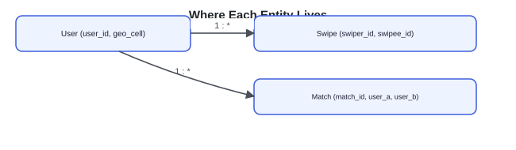

User profiles and the geo index are durable, replicated storage — the source of truth for who exists and where. Swipes are durable too, sharded by swiper_id (the high-level design derives why). Matches are a small, durable table. The seen filter is a cache: it can be rebuilt by replaying a user's swipe history, so its loss is a rebuild, not data loss.

> **Key idea.** One user forces a geo index; one swipe forces a swiper-keyed table; one mutual pair forces a deterministic match id; one "never re-show" rule forces a rebuildable seen filter.

## 5. High-level design

**Design Reflection widget:** *"In a naive design, a single database handles everything. When a user requests a feed, why does executing a live 'find nearby users who haven't been swiped' query fail catastrophically at scale?"* — Revealed rationale: "A live query combines two expensive operations: a geospatial cell search and an exclusion check against the user's swipe history. As the swipe history grows, the database query becomes slower. We must decouple this into an offline precomputation worker and a fast in-memory filter."

### 5.1 One database

In a naive design, a single database holds all users and all swipes. A candidate feed is a distance query over the users table; a swipe is an insert; a match check is a scan for the reverse row.

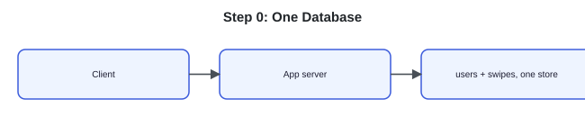

Five things break this at scale:
1. Finding candidates means a distance calculation over every user row — a full scan.
2. Billions of swipe writes a day overwhelm a single store.
3. Detecting a mutual like means scanning swipes for a matching reverse row.
4. The feed keeps re-showing profiles the user already swiped, because nothing tracks exclusions cheaply.
5. Assembling a filtered, ranked feed from scratch on every request is too slow to do live.

### 5.2 Fix 1: a geo index and a candidate service

Index every profile by geo cell and put a dedicated candidate service in front of it, so a feed request touches a handful of cells instead of every row.

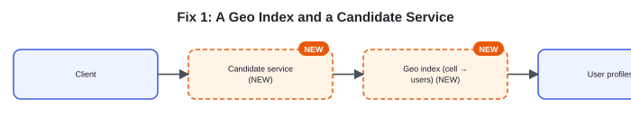

This fixes candidate search. Swipes still hit the same overloaded store.

### 5.3 Fix 2: a swipe service sharded by swiper

The swipe write is the firehose from the estimation section, so give it its own service and its own sharded store — one shard per range of `swiper_id`. Every user's own swipes land on one shard, which keeps a per-user write local and, as the deep dive works out, keeps the feed's exclusion check local too.

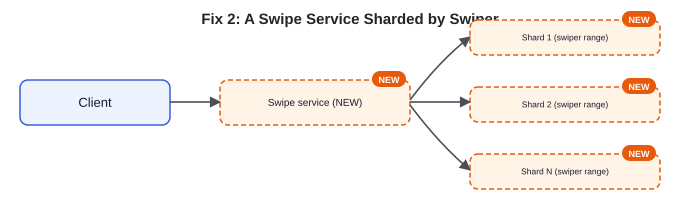

Writes now spread across shards and scale independently of candidate search. Match detection still means scanning for a reverse row.

### 5.4 Fix 3: detect the match with a reverse-key read

When A likes B, the write lands on shard(A). The system immediately performs a point read on shard(B) for `(swiper=B, swipee=A)`. A hit means B already liked A — insert the match, keyed by the deterministic id from the data model, using insert-if-absent so a race can't create two rows.

**steps**

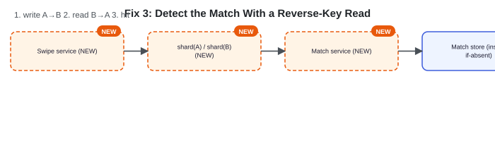

Matches are now detected without ever scanning the swipe table. The feed still re-shows profiles a user has already swiped, because nothing outside the swipe table tracks that cheaply.

### 5.5 Fix 4: a per-user seen filter

A feed must never re-show profiles a user has already swiped. Fetching the full swipe history from database shards on every request is too database-intensive.

Instead, the system stores a separate Bloom filter for each user at a unique Redis key (e.g., `seen:{swiper_id}`). This separation yields significant memory savings. Storing 10,000 profiles as 64-bit IDs in a standard hash set requires roughly 300 KB per user (including pointer and data structure overhead). In contrast, a Bloom filter sized for 10,000 entries with a 1% false-positive rate costs 9.6 bits per entry — totaling a fixed 96,000 bits (approximately 12 KB) per user, a 25x storage reduction.

When a user swipes, the Swipe service writes the event to the database shard and also updates the user's Bloom filter in Redis. During feed generation, the Candidate service fetches the user's filter and tests candidate profiles against it, discarding any profile that matches, preventing re-shows. Since the filter resides in memory, these lookups are highly efficient. If a cache node fails, the system rebuilds the filter by reading the user's swipe history from the database.

**storage comparison for 10,000 swipes**

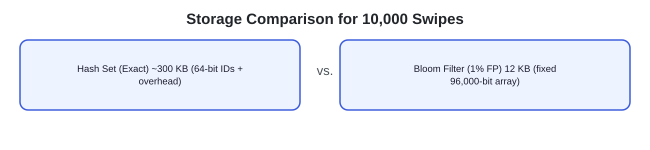

**Redis cache, per-user keys**

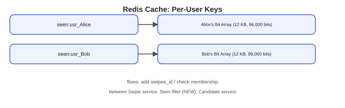

Re-shows are fixed. One problem remains: assembling geo lookup, preference filtering, and seen-filter removal live, on every request, is still too slow for a low-hundreds-of-milliseconds budget.

### 5.6 Fix 5: precompute a candidate queue

A background job pre-filters by geo cell and preference into a per-user queue of candidate ids. A feed request pulls from the queue, applies the fast-changing seen-filter check, ranks, and returns — no live geo query on the hot path.

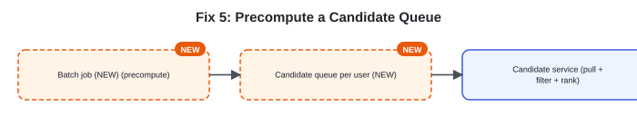

### 5.7 The composed design

**composed**

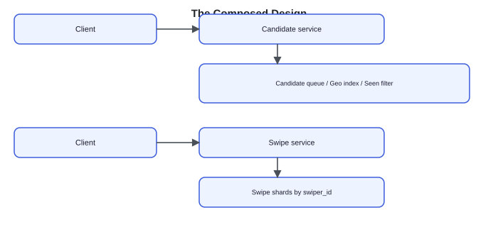

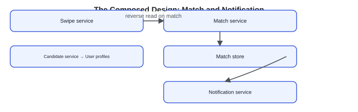

Each component answers one failure of the naive design: the geo index and candidate service fix the full-scan search, swiper-sharded swipes fix the write firehose, the reverse-key read fixes match detection, the seen filter fixes re-shows, and the precomputed queue fixes feed latency.

### 5.8 Sequence: swipe with an immediate match

**sequence**

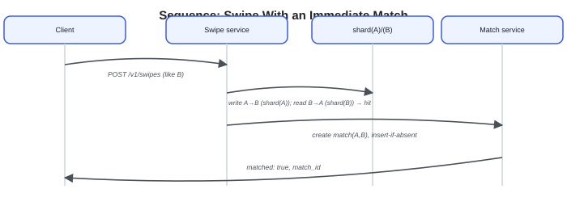

> **Key idea.** Every fix derives from one failure of the naive design — full-scan search, write overload, match scans, re-shows, and live-assembly latency — not from a pre-known list of components.

## 6. Deep dives

### 6.1 Mutual-match detection

**Design Reflection widget:** *"If Alice and Bob swipe right on each other at the exact same millisecond, how do we prevent both servers from creating duplicate match rows or deadlocking each other?"* — Revealed rationale: "Simultaneous swipes create a write race condition. Rather than using slow distributed locks, we generate a deterministic match ID by sorting the two user IDs. Both servers attempt to insert the same ID. The database unique constraint naturally discards the second write as a duplicate."

The reverse lookup is a single point read on the swipee's shard, so on the common case — no reverse like yet — it costs one cheap read on the hot swipe path, and it's safe to run inline. The race is the near-simultaneous case: if A→B and B→A arrive in the same window, each write may land before the other side's reverse-lookup runs, so both checks can report a hit.

The deterministic `match_id = hash(min(A,B), max(A,B))` collapses that race: however many times a match gets detected from either direction, both directions compute the identical id. Creating the match is an insert-if-absent on that id, so the second detection is a no-op, and exactly one match row and one notification pair result. If the swipee's shard is briefly unavailable, the like is still durably written and the match-check retries asynchronously — a match is delayed, never lost.

**Race-condition simulator widget** (tabs: "Sequential likes" / "Simultaneous likes (race)"; controls: Play / Step / Reset; steps t0–t3). Full text of every step in both tabs:

**Tab "Sequential likes":**
- **t0 — before anything happens:** shard(A): A: (no row yet). shard(B): B → A: like (already stored). Result: no match yet. "Bob already liked Alice earlier. That row sits on shard(B) waiting."
- **t1 — Alice swipes right on Bob:** shard(A): A → B: like (written). shard(B): B → A: like (already stored). Result: no match yet. "The write lands on shard(A), keyed (swiper=A, swipee=B). Cheap, local append."
- **t2 — reverse-lookup read:** shard(A): A → B: like (written). shard(B): B → A: like ← read: HIT. Result: no match yet. "Alice's swipe service does one point read on shard(B) for (swiper=B, swipee=A). It hits."
- **t3 — match materialized:** shard(A): A → B: like (written). shard(B): B → A: like (written). Result: 1 match row created. "`match_id = hash(min(A,B), max(A,B))`. Insert-if-absent creates exactly one match row; both users are notified."

**Tab "Simultaneous likes (race)":**
- **t0 — before anything happens:** shard(A): A: (no row yet). shard(B): B: (no row yet). Result: no match yet. "Neither side has liked the other yet."
- **t1 — both like in the same instant:** shard(A): A → B: like (written). shard(B): B → A: like (written). Result: no match yet. "Alice likes Bob and Bob likes Alice within the same window. Each write lands on its own shard first."
- **t2 — both reverse-lookups fire:** shard(A): A → B: like ← read: HIT. shard(B): B → A: like ← read: HIT. Result: no match yet. "Alice's check reads shard(B): hit. Bob's check reads shard(A): hit. Both sides now believe they found a mutual like."
- **t3 — both try to create the match:** shard(A): insert-if-absent(match_id). shard(B): insert-if-absent(match_id). Result: 1 match row created — one insert won, the other was a no-op. "Both computed the same deterministic `match_id = hash(min(A,B), max(A,B))`. One insert succeeds; the other is a no-op on the same key."

**Mutual-match detection — Bad/Good/Great widget (all three expanded):**
- **Bad — "Periodically scan for mutual pairs":** Runs a batch job that scans swipes for pairs who both liked each other, or recomputes matches on read. Either way, matches surface late and the scan cost grows with total swipe volume.
- **Good — "Reverse lookup on each like":** On every like, looks up the reverse swipe and creates a match on a hit. Misses the race case: two near-simultaneous likes can each detect a hit and try to create separate rows.
- **Great — "Single-shard point read, deterministic id, async retry on failure":** Makes the reverse lookup a single-shard point read via the (swiper, swipee) key, dedups a simultaneous double-detection with a deterministic match_id and insert-if-absent, and treats notification as at-least-once delivery over a durable, already-created match.

### 6.2 The swipe firehose and hot profiles

> **Before reading on.** Sharding swipes by swiper_id spreads writes evenly. What happens to the reads generated by one extremely popular profile?

Sharding by `swiper_id` means every user's outgoing likes land on one shard, and no single popular user creates a write hotspot — each admirer's like lands on the admirer's own shard, not the popular user's. But every one of those likes triggers a reverse-lookup read against the popular user's shard ("has this popular user already liked me back?"). A profile with an outsized number of admirers turns into a burst of reverse-read traffic concentrated on one shard, even though the writes stay perfectly spread.

The fix reuses the seen-filter idea from Key concepts: the system maintains a small Bloom filter of outgoing likes for every user, cached or replicated off the shard that owns it. Because a popular user has liked only a tiny fraction of their admirers, the filter absorbs almost all of the reverse-lookup traffic without touching the shard directly — the hotspot the sharding decision created gets relieved by the same probabilistic-membership trick that already solved re-shows.

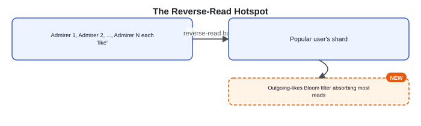

**The swipe firehose and hot profiles — Bad/Good/Great widget (all three expanded):**
- **Bad — "One table for all swipes":** Stores every swipe in a single unsharded table and finds matches with a scan or join. Neither writes nor the popular-profile read pattern have anywhere to spread.
- **Good — "Sharded by swiper_id, durable writes":** Shards the swipe store by swiper_id, keeps it durable, and gets cheap, evenly spread writes.
- **Great — "Names the reverse-read hotspot and fixes it with a filter":** Justifies sharding by swiper on write-spread grounds, keeps swipes durable rather than treating them like a disposable location ping, and identifies that a popular profile becomes a reverse-read hotspot even though writes stay spread — then fixes it with a per-user outgoing-likes Bloom filter.

### 6.3 Candidate generation

> **Before reading on.** Given a geo index, a preference filter, and a seen-filter, in what order should a candidate request apply them, and why does the order matter?

The filters are ordered cheap-to-expensive. The system first queries the user's geo cell plus its immediate neighbors. This boundary-aware search narrows millions of users down to a local candidate set. It then filters by stated preferences (age, distance, gender), ideally keeping only candidates whose own preferences also admit the user. Only then does it query the user's Bloom filter for each surviving candidate ID. The filter's no-false-negative guarantee ensures that a swiped profile is never wrongly reported as unseen. A false positive only drops a small fraction of unseen profiles, which is acceptable.

What's left is ranked — recency, activity, and a compatibility score from the ranker deferred in the problem statement — and the results are cached in the per-user candidate queue from the high-level design, so a swipe session is served from memory and refilled in the background rather than recomputed live on every card.

**pipeline**

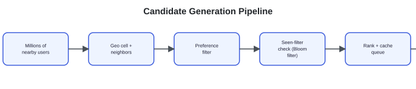

If ranking is unavailable, fall back to distance-sorted candidates rather than failing the feed. A brief seen-filter outage may cause a few profiles to resurface — a mild annoyance rather than a correctness failure. Key production metrics to monitor include the candidate-queue hit rate and empty-feed rate; the system also tracks geo-query latency.

**Candidate generation — Bad/Good/Great widget (all three expanded):**
- **Bad — "Query everyone nearby, unfiltered":** Queries all users nearby on every request and returns them, including profiles the user has already swiped.
- **Good — "Geo, then preference, then seen filter, ranked":** Applies geo-cell-plus-neighbors, a preference filter, seen-filter removal, and ranking, in some order.
- **Great — "Cheap-to-expensive ordering, correct filter guarantee, precomputed and degradable":** Orders filters cheap-to-expensive, explains that the Bloom filter's no-false-negative guarantee is exactly the "never re-show" invariant, precomputes a per-user queue so swiping is served from cache, and degrades to distance-sort if ranking fails.

> **Key idea.** Sharding by swiper_id spreads writes evenly but concentrates reverse-lookup reads on popular profiles; the same Bloom-filter trick that stops re-shows also relieves that hotspot; and ordering candidate filters cheap-to-expensive keeps the feed inside its latency budget.

## 7. Variants

- **10× scale.** Ten times the swipes means ten times the write firehose: more swipe shards, more aggressive batching per shard, and moving the match-check fully behind an async queue so a slow reverse-lookup never adds latency to the swipe write itself. The geo index shards finer in dense metros, where a single cell can otherwise hold far more users than a shard should own — the same hot-cell problem Uber solves by splitting a cell across sub-shards. Seen-filter memory grows linearly with users but stays shardable per user. Matches remain a trickle relative to swipes and scale without trouble.
- **Global distribution.** Dating is inherently geo-local — two users only match if they're near each other — so the system partitions cleanly by region. Deploying per-region clusters (profiles, geo index, swipe shards, matches) ensures that a user's candidates, swipes, and matches all stay within their home region. Cross-region travel — "show me profiles where I'm currently visiting" — is the rare case that needs a user's data served from a region other than their home one.
- **Recommendation quality.** Ranking candidates well — who to show first — is its own machine-learning system: it consumes the swipe stream as training signal and scores candidates at generation time. This design treats the ranker as an existing dependency the candidate service calls, the same way the Instagram feed defers ranking internals; the model itself is a separate problem.

> **Key idea.** The architecture holds at 10× scale and across regions with sharding and finer geo cells; only ranking quality is a genuinely separate system, deferred throughout.

## 8. The transferable pattern

The reusable shape: separate a write-heavy stream of independent events (swipes) from a read path over derived state (matches, feed). Detecting a relationship between two entities uses a reverse-key point read plus a deterministic id and insert-if-absent, rather than scanning. And enforcing a "never show this again" rule uses a probabilistic set whose error runs in the safe direction. The same shape reappears anywhere two independent actors must discover a mutual condition without a coordinator — from social-graph mutual follows to matching in a marketplace.

## Review: the 30-second answer

- Two paths: a swipe write firehose and a candidate-feed read, and the firehose is the one that sizes the system.
- Finding nearby candidates is the same geospatial-indexing problem Uber solves for drivers.
- A match is a mutual like, detected on write with a reverse-key read — never scanned for.
- A Bloom filter guarantees a swiped profile is never shown again.
- Matches are rare; swipes are not.

## Quiz

**Tinder Design Quiz widget** ("Hide All" / "Reveal All" toggle) — 6 questions, each with a "Show/Hide Answer" button. Full text of every question and its revealed answer:

**1) Why does sizing this system around the candidate-feed read miss the real load?**
A user swipes once for every card in their feed, so swipes outnumber feed reads by roughly the number of cards per feed load. At 50M DAU and about 100 swipes a user a day, that's on the order of 5 billion swipe writes a day against roughly 1 billion feed reads — the write path, not the read path, is what has to survive peak load.

**2) Why is a match detected with a reverse-key read instead of a scan over the swipes table?**
Swipes are sharded by swiper_id, so (swiper, swipee) is a single-shard, indexed key. When A likes B, checking whether B already liked A is one point read on shard(B) for the exact key (swiper=B, swipee=A) — O(1) against the shard, versus scanning for matching pairs across the whole table.

**3) Two users like each other within the same second. What guarantees exactly one match row instead of zero or two?**
Both directions compute the same match_id = hash(min(A,B), max(A,B)), so however many times either side detects the mutual like, they're both trying to insert the identical key. Creating the match with insert-if-absent makes every detection after the first a no-op on that key.

**4) A profile with an unusually large number of admirers creates no write hotspot, since likes are keyed by the admirer's own id. What load does it create instead, and how is that fixed?**
Every admirer's like still triggers a reverse-lookup read against the popular user's own shard, so that shard absorbs a burst of reads even though writes stay evenly spread. A per-user Bloom filter of outgoing likes, cached off the shard, absorbs almost all of that read traffic without hitting the shard directly.

**5) Why is a Bloom filter the right structure for 'never re-show a swiped profile,' rather than merely an acceptable one?**
A Bloom filter never reports a false "not seen" for something actually swiped — no false negatives — so a swiped profile is guaranteed never to resurface. Its only error is an occasional false positive, which only drops a small fraction of genuinely unseen profiles from the feed. The rule only cares about one direction of error, and that's the direction the structure guarantees.

**6) Why does the candidate pipeline apply geo, then preferences, then the seen-filter, in that order?**
Each stage is ordered cheap-to-expensive relative to how much it narrows the set: geo-cell-plus-neighbors turns millions of users into a local set using the cheapest index, preference filtering narrows further, and the seen-filter check — a per-candidate Bloom-filter lookup — runs last over the smallest remaining set. Running it earlier over the full user base would mean far more filter lookups for no additional benefit.

## Sources and further reading

- [Geospatial indexing explained — Ben Feifke](https://bignerdranch.com/blog/geospatial-indexing/) — geohash bit-interleaving and S2's Hilbert-curve cells, and why proximity search is cell-plus-neighbors-plus-exact-distance-refine.
- [H3: Uber's hexagonal hierarchical spatial index — Uber Engineering](https://www.uber.com/blog/h3/) — the hexagonal cell grid, its resolutions, and the k-ring neighbor lookup the candidate search reuses.

---

### System Design Master Template (embedded video)

YouTube embed: https://www.youtube.com/embed/OWVaX_cBrh8?si=MAfaQS1TV1r7USUI

### Comments

No comments were posted under this page at scrape time — the Comments section shows only the "Post" input with no existing comments listed.

---

## Assets

No downloadable diagram image files exist on this page — every diagram (geo indexing, the derived-match relationship, the Bloom filter mechanics, the shard-key axis comparison, the estimation widget, all high-level-design step diagrams, the race-condition simulator, the hot-profile burst diagram, and the candidate-generation pipeline) is a live JS/SVG node-and-arrow rendering, fully transcribed above as text. The only real `` on the page is the site's decorative header logo (`/logo.svg`), which is purely cosmetic and carries no article content.

> Note: an initial non-interactive fetch of this URL returned a materially different, older-style page (with "Profile/Feed/Swipe/Notification" services, real static image diagrams, and a "Field Details"-style data model) than what the live, JS-rendered browser page shows today. The content above reflects the current live page as rendered in-browser, which is treated as authoritative since it is what an actual visitor sees and its structure matches its own on-page table of contents exactly.
