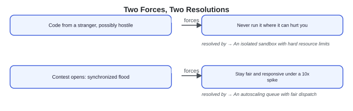
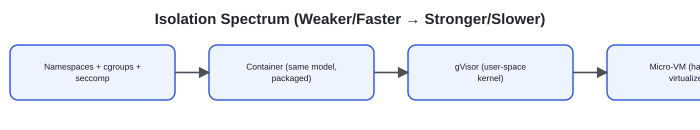
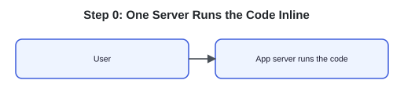
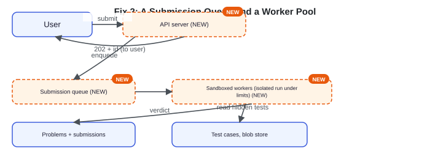
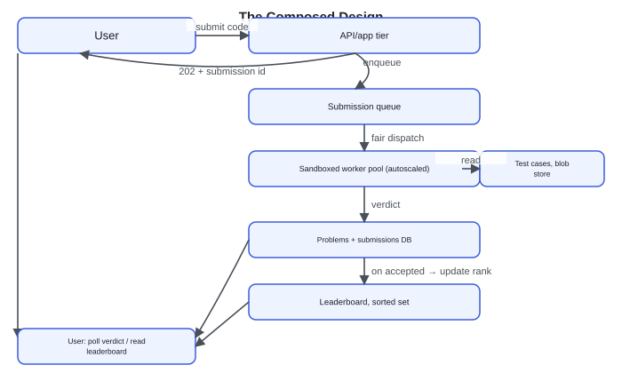
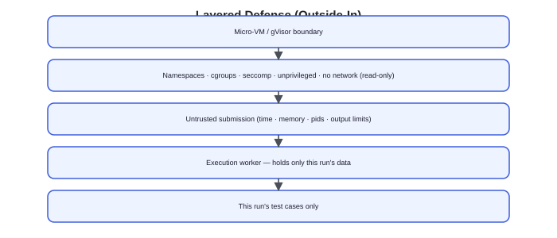
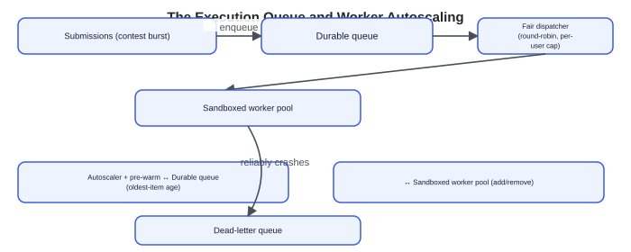
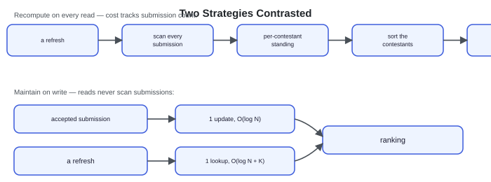
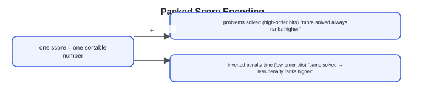
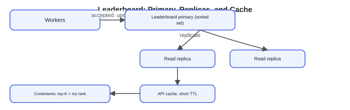

# Design an Online Judge (LeetCode)

Source: https://systemdesignschool.io/problems/leetcode/solution

> Note on fidelity: this page is built from live JS-interactive widgets (a resource-meter simulator with 5 selectable programs, design-checkpoint multiple-choice toggles, expandable API request/response panels, several Bad/Good/Great rated-answer accordions, a skip-list search-stepper widget, and a quiz with click-to-reveal answers) rather than static images, matching the same template as the Rate Limiter/Typeahead/Tinder reference pages. Every widget's full content — both design-checkpoint options, all expanded API bodies, all three Bad/Good/Great tiers per deep dive, and all five quiz answers — was clicked through on the live page and is transcribed below as text, in the same order it appears on the site. The site has no downloadable diagram image files for this page (all diagrams are inline JS/SVG node-and-arrow renderings), so there are no image assets to save.

Tags: Medium difficulty · Sandboxed execution · Async jobs · Leaderboards

---

## Problem statement

Design an online judge like LeetCode: a user submits source code for a coding problem, the system runs it against a set of hidden test cases under strict limits, and returns a verdict — Accepted, Wrong Answer, Time Limit Exceeded, and so on.

In scope: submitting code and receiving a graded verdict, running submissions against hidden tests under resource limits, and a contest mode with a live leaderboard during a synchronized flood of submissions. Out of scope: the in-browser code editor, problem authoring and curation, discussion forums, and the exact contest-rating algorithm.

## Clarifying questions

- **Which languages?** Assume a fixed set of popular languages, each with a defined compile-and-run toolchain. Adding a language means packaging a new sandbox image — the isolation mechanism stays the same, though each runtime needs its own sandbox tuning (allowed syscalls, mounts, limits).
- **Practice or contest, or both?** Both. Practice is steady, low-stakes, and cache-friendly; contests bring a synchronized spike, a fairness problem, and a live leaderboard — that's where the system gets stressed.
- **What verdicts are possible?** Accepted, Wrong Answer, Time Limit Exceeded, Memory Limit Exceeded, Runtime Error, and Compile Error. The verdict itself is the interesting output here, richer than a plain pass or fail.
- **Is the submitted code trusted?** No — that's the whole point of this problem. Every submission is treated as hostile: it might try to read the hidden tests, exfiltrate data over the network, fork-bomb the machine, or simply run forever.
- **How fast must a verdict come back?** Seconds in steady state. During a contest, still seconds, but under heavy load — a fairness and latency budget, not hard real-time.
- **What sizes the system?** Submissions per second at the contest peak, and how many sandboxed executions are running concurrently — not the steady-state average, since a contest start dwarfs it.

## What makes this problem distinctive

Modeling this as "run the code and diff the output" ignores the one thing that makes this problem hard: every submission is a program written by a stranger, and that stranger might be actively hostile. It might loop forever, allocate memory until the machine dies, fork itself until no processes are left to schedule, or try to read the hidden test cases and phone them home over the network.

That forces execution to happen somewhere fundamentally isolated from everything else in the system — a sandbox with hard limits on the key resources the code could abuse — CPU, wall time, memory, processes, output. And it has to hold up not just for one submission at a time, but for a fleet that stays fair and responsive the moment a contest opens and thousands of people submit within the same few minutes.

> **Ingest vs egress.** Ingest here is submitted code arriving to be judged; egress is verdicts (and leaderboard reads) going back out. Both matter, but the distinctive cost is neither — it's the compute spent safely *running* untrusted code in between.

**two forces, two resolutions**



## Key concepts

This section covers the concepts needed to solve this problem — prerequisites for the design work that follows.

### Sandboxing untrusted code

A **sandbox** is an execution environment deliberately restricted so that code running inside it cannot affect anything outside it. Isolation comes in layers of increasing strength. At the weakest end, Linux *namespaces* give a process its own isolated view of the process tree, network, and filesystem; *cgroups* (control groups) let the kernel cap how much CPU, memory, and how many processes that view can use; *seccomp* (secure computing mode) filters which system calls the process is even allowed to make. A **container** packages that same model. Stronger still, **gVisor** runs an entire user-space kernel between the untrusted code and the real host kernel, trapping the guest's system calls and servicing them itself rather than passing them to the host directly (gVisor still makes its own host syscalls on the sandbox's behalf). Strongest of all, a **micro-VM** (a lightweight virtual machine, such as Firecracker) gives each run a hardware-virtualized boundary — the same kind of isolation a full virtual machine gives, but fast enough to start per submission.

**isolation spectrum (weaker/faster → stronger/slower)**



### Resource limits as the enforcement mechanism

Isolation alone doesn't stop a program from consuming everything available inside its own sandbox — that's the job of resource limits, enforced by the sandbox itself rather than trusted to the code. A wall-clock timeout catches a program that simply takes too long; a separate CPU-time limit catches one that burns CPU across multiple threads to sneak past the wall-clock limit. A memory cap triggers an out-of-memory kill once the process crosses its threshold — usually quickly — rather than letting it swap the machine to death. A process-count limit stops a fork bomb (a program that spawns copies of itself until no more processes can be created) before it exhausts the machine. Each limit maps to a specific verdict: breach the time limit and the verdict is Time Limit Exceeded; breach the memory limit and it's Memory Limit Exceeded; crash outright and it's Runtime Error. A kill the judge cannot attribute cleanly falls back to Runtime Error.

**Resource-meter simulator widget** (program selector: "Correct solution" / "Wrong answer" / "Infinite loop" / "Memory bomb" / "Fork bomb"; controls: Play / Step / Reset). Default state at tick 0: wall-clock time 0 ticks / 6 ticks ("crossing this → Time Limit Exceeded"), memory 10 MB / 100 MB ("crossing this → Memory Limit Exceeded"), processes 1 / 20 ("crossing this → fork-bomb kill (Runtime Error)"). Each meter climbs as the selected program "runs"; the sandbox kills the run the instant any meter crosses its limit, and the limit crossed sets the verdict. Behavior per program: an infinite loop pins wall-clock time until it breaches; a memory bomb climbs the memory bar until it breaches; a fork bomb spikes the process count until it breaches; a correct solution finishes before any limit is reached; a wrong answer also finishes within limits but yields a Wrong Answer verdict (a logic mismatch, not a resource breach).

> **Key idea.** A sandbox stops untrusted code from reaching anything outside it; resource limits, enforced by the sandbox rather than the code, stop it from monopolizing what's inside its own boundary. Neither one alone is enough.

## 1. Requirements

### 1.1 Functional requirements

- Submit a solution (problem ID, language, source code) and receive a verdict once it has run against the hidden test cases.
- Run submitted code against hidden tests under time and memory limits; the verdict names the first failure (Wrong Answer, Time Limit Exceeded, Memory Limit Exceeded, Runtime Error) or Accepted if all pass.
- Support contest mode: a fixed problem set and time window, with accepted submissions updating a live leaderboard.

### 1.2 Non-functional requirements

- **Isolation and security.** Untrusted code must never read the hidden tests or other users' data, escape to the host, or reach the network. A single escape is a breach.
- **Stability under abuse.** A fork bomb, an infinite loop, or a memory hog must be contained and killed without taking down the worker or its neighbors.
- **Fair, timely verdicts.** Seconds to a verdict in steady state, and under a contest spike, no single user is starved while others wait.
- **Scale for the contest spike.** The worker fleet is sized and autoscaled for a synchronized contest start, which dwarfs the daily average by an order of magnitude.

### 1.3 The binding constraint

Isolation is non-negotiable — one piece of untrusted code escaping the sandbox to read the hidden tests or another user's data ends the product's usefulness outright. But the property that actually drives the architecture is the contest spike: a synchronized start floods the system with far more submissions than the daily average, so the queue, worker autoscaling, and fairness controls all exist to keep verdicts flowing under that burst. The two collide directly at the sandbox itself: isolation costs startup time and CPU per run, and the spike is exactly the moment that overhead is least affordable. That is why warm sandbox pools and reuse matter here (deep dive 1).

## 2. Back-of-the-envelope estimation

**Interactive estimation widget (default inputs):**

| Input | Default |
|---|---|
| Contestants | 100K |
| Submissions / contestant | 10 |
| % landing in the early burst | 40% |
| Burst window (minutes) | 10 min |
| Sandbox wall-clock / submission (sec) | 3s |
| Sandboxes / worker machine | 8 |

**Computed outputs:**

| Output | Value | Formula shown |
|---|---|---|
| Peak submissions / sec | 667/s | 400K in the 10-min burst |
| Sandboxes in flight | 2000 | 667/s × 3s wall-clock |
| Worker machines needed at peak | 250 | 2000 sandboxes ÷ 8 per worker |

`1.0M total × 40% in 10 min ≈ 667/s peak`. The contest start, not the daily average, sizes the fleet — this is why the worker pool autoscales rather than staying provisioned for the peak year-round.

Assume roughly 5 million submissions a day in normal use — an illustrative anchor, not a measured fact. Spread evenly, that's only about 60 a second, trivial for a modest queue. The number that actually matters is the contest peak: suppose a weekly contest draws 100,000 contestants who each submit about 10 times, for 1 million submissions total, with roughly 40% landing in the first 10 minutes as everyone rushes the early problems. That's `1,000,000 × 0.4 = 400,000` submissions across 600 seconds, or roughly 670 a second — about ten times the steady-state average. The contest, not daily traffic, sizes this system.

Each submission compiles once and runs inside a sandbox for roughly 3 seconds of wall-clock time on average. At the peak rate of 670/s, that's about `670 × 3 ≈ 2,000` sandboxes running concurrently. If one worker machine safely runs about 8 sandboxes at a time — a figure bounded by the machine's CPU cores and memory, not by anything the code itself controls — that's roughly 250 worker machines needed at the peak, against only about 25 in steady state. The fleet needs to grow roughly tenfold for the contest and shrink back down afterward, which is exactly why it autoscales rather than staying provisioned for the peak year-round.

> **Key idea.** The contest start, not the daily average, is the number that sizes this system — the fleet needs to scale by an order of magnitude for a burst that lasts only minutes, which is only affordable through autoscaling.

## 3. API design

**Design checkpoint widget:** *"Running a submission takes several seconds. What should the submit endpoint return, given that it can't wait for a verdict?"* Options: "Block the request until the verdict is ready, however long that takes" / "Return immediately with a submission ID, so the client can poll or be notified later" (checked/correct answer).

### POST `/problems/{id}/submissions`

Request & response (expanded):

Request body:
```json
{ "language": "...", "source_code": "..." }
```
Response body:
```json
202 { "submission_id": "...", "status": "queued" }
```

Submit returns `202 Accepted` with a submission ID rather than an inline verdict. Running untrusted code takes seconds, so grading inline would tie up request workers and outlive typical request timeouts, especially at contest scale — so submitting enqueues a job and hands back an ID immediately, and the client polls (or is pushed a notification) until the verdict lands. The source code itself is the payload, and it's the hostile part of the request: it's size-capped and never executed anywhere except inside the sandbox.

### GET `/submissions/{id}`

Request & response (expanded):

Response body:
```json
{ "status": "...", "verdict": "...", "failed_test": "...", "runtime_ms": 0, "memory_kb": 0 }
```

The verdict is structured feedback, not a bare pass/fail. It carries which hidden test failed along with the measured runtime and memory, so a user learns *why* their submission failed — Wrong Answer versus Time Limit Exceeded versus Memory Limit Exceeded — without the hidden test's actual contents ever being exposed.

### GET `/contests/{id}/leaderboard`

Request & response (expanded):

Response body:
```json
[{ "rank": 1, "user": "...", "score": 0, "penalty": 0 }]
```

The leaderboard is its own read path. During a contest it's read far more often than it's written, so it's served directly from an in-memory sorted structure rather than recomputed per request (deep dive 3).

## 4. Data model

Start with the one obvious entity: a problem the user is trying to solve.

```text
`Problem { string problem_id
string title
string statement
int time_limit
int memory_limit }`
```

But the hidden test cases a submission is graded against are many and potentially large — they can't be columns on the problem row. They're their own entity, with the heavy bytes stored separately.

**relationship**

```text
Problem —1:many→ `TestCase { string problem_id
int index
string input_url
string expected_output_url }`
```

Now the attempt itself: who submitted it, which problem, the code and its language, and — once graded — the verdict, measured runtime, and memory.

```text
`Submission { string submission_id
string user_id
string problem_id
string language
string source_code
string verdict
int runtime
int memory
timestamp created_at }`
```

But actually running that code isn't something you can represent as a row. Executing untrusted code safely can't happen in the app server or the database — it needs a genuinely isolated place to run. Execution becomes a *job*: the queue hands the submission to an ephemeral sandboxed worker that reads the code and the test cases, produces a verdict, and is then destroyed. That worker stores nothing and adds no new entity to the data model at all — only a new component to the architecture (Step 5).

Finally, a contest needs fast ranking. Answering "who's winning?" by scanning every submission on each page view is far too slow while thousands of people watch live, so a contest keeps a derived leaderboard.

```text
`Leaderboard { string contest_id
sorted_set rankings }`
```

Where each entity lives follows from how it's used. `Problem` and `Submission` sit in a sharded store — problems partitioned by `problem_id`, submissions by `submission_id` (or by `user_id` for a "my submissions" view) — small structured rows read on every verdict and profile lookup. Test cases live in [object storage](https://systemdesignschool.io/fundamentals/blob-object-storage), referenced by URL, written once at authoring time and streamed by workers at run time. Execution itself lives nowhere persistent — it's a job run on an ephemeral sandboxed worker, torn down after each run. The leaderboard lives in an in-memory sorted structure, rebuildable at any time from the accepted submissions that back it.

> **Key idea.** Execution is the one piece of this model that deliberately isn't a stored entity — it's a job the system runs and then discards, which is exactly why it can't leak anything between submissions.

## 5. High-level design

Start with the simplest thing that could work: one server that runs the submitted code inline.



Four things break the instant this faces real submissions: running in-process, a submission inherits the server's own privileges and can read secrets or hidden tests, open outbound connections, fork-bomb the machine, or loop forever; execution takes seconds and a contest starts thousands of them at once, so doing it inline ties the server's own threads to the slowest, spikiest work in the system; a synchronized contest start floods the system, and with no fairness control a few users spamming submissions can starve everyone else; and a contest leaderboard rebuilt from raw submissions on every page view can't keep up with live viewers. Fix them one at a time.

> **Reading the diagrams.** Each step marks the components newly added at that step with a dashed outline and a **NEW** badge, so you can see what changed from the step before.

### Fix 1: isolate execution in a sandbox on separate workers

Move running the code off the app tier entirely, into an isolated sandbox — a container, a micro-VM, or a syscall-filtering runtime like gVisor — on dedicated worker machines, with the network disabled, a read-only filesystem, an unprivileged user, and hard resource limits (deep dive 1). The app tier now only *accepts* code; it never *runs* it.

### Fix 2: a submission queue and a worker pool

Submitting a solution drops a job onto a queue and returns `202 Accepted` immediately; a pool of sandboxed workers pulls jobs off that queue and grades them. This is the standard [async job](https://systemdesignschool.io/fundamentals/async-processing) shape: accept, enqueue, return — workers drain the queue independently, and the client learns the verdict by polling. The queue absorbs the contest burst, and worker throughput scales independently of the API tier.



### Fix 3: autoscaling and fair dispatch for the spike

The worker pool autoscales on queue backlog (deep dive 2), and dispatch is fair rather than strict first-in-first-out: per-user concurrency caps and round-robin dispatch across users keep one contestant's flood of submissions from monopolizing the whole fleet. Since sandboxes are slow to cold-start, a warm pool is kept ready ahead of a scheduled contest.

### Fix 4: a verdict store and a fast leaderboard

Workers write each verdict back to the submission store; on an *accepted* contest submission, they also update an in-memory sorted-set leaderboard (deep dive 3), which the leaderboard endpoint reads directly, with no recomputation on read.

Composing all four fixes gives the full design:

**composed**



These boxes are the data model's homes made concrete. `Problem` and `Submission` live in the problems-and-submissions database; the heavy hidden test cases live in the blob store, streamed by workers at run time; the leaderboard is the in-memory sorted set. The one thing from the data model that's deliberately not a store is execution itself: the queue hands a job to an ephemeral sandbox that reads the submission and its tests, emits a verdict, and is destroyed — it holds nothing between runs.

> **Key idea.** Each of the four fixes traces to a concrete failure of the naive inline design — untrusted code with server privileges, slow bursty runs blocking the request path, an unfair contest flood, and a leaderboard that can't keep up — not to a feature checklist.

## 6. Deep dives

### 6.1 Secure sandboxed execution

**Design checkpoint widget:** *"You're about to run a stranger's program on your machine. Besides 'it might crash', what else might it try to do?"* Options: "Nothing else — a crash is the only real risk" / "Read the hidden tests or other users' data, exfiltrate them over the network, exhaust the machine with a fork bomb or memory bomb, or try to escape to the host kernel" (checked/correct answer).

Untrusted code has four broad ways to cause harm, and every defense in this section answers one of them: reading the hidden tests or other users' data, exfiltrating whatever it finds over the network, exhausting the machine through a fork bomb, an infinite loop, or a memory balloon, and escaping to the host kernel through a system-call exploit.

The isolation levels from Key Concepts trade strength against startup cost. Namespaces, cgroups, and seccomp are cheap and fast but still share the host kernel, so a kernel exploit escapes cleanly. A container packages that same model without adding real strength. gVisor's user-space kernel traps the guest's system calls and services them itself instead of passing them straight to the host kernel — a meaningfully stronger boundary. A micro-VM gives each run a hardware-virtualized boundary — generally the strongest of these options, though no boundary is absolute — at a modest additional startup cost. Because the blast radius of a kernel escape is catastrophic — every hidden test, every user's submission, exposed at once — reaching for gVisor or a micro-VM is the right default when the strongest guarantee matters, though many production judges accept the lighter namespaces-and-cgroups boundary as an acceptable tradeoff.

Resource limits, covered mechanically in Key Concepts, map directly onto specific verdicts: a wall-clock or CPU-time breach becomes Time Limit Exceeded, a memory breach becomes Memory Limit Exceeded, a process-count breach kills a fork bomb outright, and an output-size cap stops a program that tries to print forever and fill the disk. Network egress is dropped entirely, so nothing leaves over the network regardless of what the code manages to read; the remaining channels are the run's own observable outputs, which is why the verdict deliberately never carries hidden-test contents.

*Same resource-meter simulator widget repeats here (see Key Concepts above for full state/behavior description).*

The defense here is layered on purpose: escape the seccomp filter, and the process is still just an unprivileged user; escape that, and it's still inside a micro-VM boundary; and even past that, a worker only ever holds one run's own data — nothing else is there to steal. A fresh sandbox per submission means no other run's data is sitting next door — what remains is shared host state and side channels, which the outer layers bound.

**layered defense (outside-in)**



A single layer's failure lands the code in the layer outside it, not on the host.

The one real tension is startup cost. The strongest, freshest sandbox per run is also the slowest to start, and a contest opening is exactly when a cold start hurts the most — the fix is a warm pool of pre-initialized sandboxes, reset between runs, or fast-booting micro-VMs (the seam into deep dive 2). The signals worth watching: per-run CPU, memory, and wall-clock time; kill-reason counts broken down by verdict type; seccomp violation counts; and any network egress attempt at all, which should sit flat at zero — a nonzero count there means someone is actively probing the sandbox.

> **Strong-answer criteria.** A strong answer names all four threat categories explicitly, picks an isolation level based on the blast radius of an escape rather than defaulting to the cheapest option, stacks defenses so no single layer's failure is a full escape, and treats a nonzero egress-attempt count as an active security alert.

**Sandboxed execution: how it's graded — Bad/Good/Great widget (all three expanded):**
- **Bad — "Run the code in a container with a timeout and hope":** A single layer of defense with no resource limits beyond time means a memory bomb or fork bomb still takes the worker down.
- **Good — "A locked-down sandbox: no network, unprivileged user, seccomp, cgroup limits":** Covers the core threats but hasn't yet reasoned about isolation strength relative to the actual blast radius of a failure.
- **Great — "Isolation chosen by blast radius, layered defenses, warm-pool startup hiding":** Picks gVisor or a micro-VM because a kernel escape exposes every hidden test, stacks defense in depth with a fresh per-run sandbox holding no other data, and hides startup latency behind a warm pool rather than accepting slow cold starts during a contest.

### 6.2 The execution queue and worker autoscaling

**Design checkpoint widget:** *"A contest opens and submissions jump by an order of magnitude within a minute. What should the autoscaler actually watch to react in time?"* Options: "Worker CPU utilization" / "How long the oldest queued submission has been waiting (backlog age)" (checked/correct answer).

The queue is what absorbs the burst: submissions land on a durable queue and workers drain it at their own pace, so the user-facing submit call stays fast — it only ever enqueues — even as the backlog grows underneath it. Under load, verdicts simply arrive a little later rather than the system falling over.

The signal worth autoscaling on is backlog age — how long the oldest queued submission has been waiting — not worker CPU utilization, which can look fine even while a backlog quietly grows. Because sandboxed workers are slow to start (pulling an image, warming up a runtime), the fleet should pre-scale ahead of a scheduled contest rather than chase the spike reactively once it's already underway — the contest's start time is known in advance, so there's no reason to wait for backlog to climb before adding capacity.



Fairness under contention matters just as much as raw capacity. Strict first-in-first-out ordering lets one user who submits dozens of times monopolize the pool during a contest. The fix is threefold: a per-user concurrency cap so at most a few of any one user's submissions run at once, a submit rate limit per user, and round-robin or weighted-fair dispatch across users instead of pure arrival order — so everyone gets a fair share of the fleet while the contest is hot.

Delivery from the queue is at-least-once, so a worker can end up grading the same submission twice — for instance, if it crashes right after finishing a run but before acknowledging the job. Grading is deterministic enough that a re-run produces the same verdict in almost every case, but measured runtime varies slightly, so a solution sitting right at the time limit can occasionally flip between verdicts. That's why the verdict write is a first-write-wins transition guarded by a conditional update on `submission_id` — a duplicate grade finds the verdict already recorded and becomes a no-op, rather than overwriting it with a possibly different result. The downstream side effect has to be idempotent too: the leaderboard update keys on the acceptance event, so a re-graded submission can't move the ranking twice. A submission that reliably crashes the sandbox itself — a poison payload — goes to a dead-letter queue for manual inspection instead of retrying forever.

> **Strong-answer criteria.** A strong answer autoscales on backlog age rather than CPU, explicitly pre-warms the fleet ahead of a scheduled contest instead of reacting after the spike starts, enforces per-user fairness over strict FIFO, and makes grading idempotent on `submission_id` with a dead-letter path for poison payloads.

**Queue and autoscaling: how it's graded — Bad/Good/Great widget (all three expanded):**
- **Bad — "One fixed pool of workers, strict FIFO":** A single popular user's flood of submissions can monopolize the entire fleet during a contest, and the fixed pool simply can't absorb the peak.
- **Good — "A queue with autoscaling workers and retries":** Handles growth reasonably but reacts to the spike after it's already underway rather than anticipating a scheduled contest.
- **Great — "Backlog-age autoscaling, pre-warming, per-user fairness, idempotent grading":** Autoscales on backlog age, pre-warms the pool ahead of a known contest start, enforces per-user concurrency caps and fair dispatch, keys verdict writes on submission ID for safe at-least-once delivery, and dead-letters poison payloads instead of retrying forever.

### 6.3 The contest leaderboard at scale

**Design checkpoint widget:** *"Ten thousand contestants refresh a live ranking every few seconds while accepted submissions keep changing it. Why can't the ranking be recomputed from all submissions on every view?"* Options: "It can — submission counts are always small enough to scan" / "Scanning every submission per page view is order-of-submissions work, and that cost is repeated for every single viewer, which doesn't survive live traffic" (checked/correct answer).

A contestant's standing — problems solved and total penalty time — is itself derived from their submission history. The naive design keeps no running leaderboard at all: to answer "what's the ranking?", it folds every contestant's submissions into a current standing, then sorts everyone. Folding in the submissions is the expensive step, because it reads every submission once — so producing the ranking a single time costs work proportional to the total number of submissions in the contest.

The trap is that this recompute runs on every *read*, not on every write. Ten thousand contestants each refreshing every few seconds is thousands of ranking requests a second, and each one re-scans the whole submission history. Read rate multiplied by a full scan is what collapses; the write rate barely matters.

The fix is to stop recomputing on read and maintain the ranking incrementally on write — which is the natural instinct that "you only touch the ranking when someone submits." Keep a sorted-set structure keyed per contest, with each member's score built so the leader sorts first. An accepted submission does one small update to it; a refresh does one lookup against the already-sorted structure and never reads a raw submission. Rank and a user's own position become logarithmic-time operations, and a top-K read costs O(log N + K) — where N is the number of contestants, not the number of submissions.

**two strategies contrasted**



That logarithmic cost comes from how the sorted set is built. Most implementations use a **skip list** — a sorted linked list with extra "express lanes" layered on top, each linking only a fraction of the nodes. A search starts on the highest lane and hops forward until the next hop would overshoot the target. Then it drops down a lane and repeats. That reaches any score in about log(N) steps instead of walking all N.

**Skip-list search-stepper widget** (target buttons: "find 40" / "find 70" / "find 100" / "find 120"; controls: Play / Step / Reset). Default state: step 0/3, "Start at the head, on the top express lane," examined 0 of 12 entries. Structure shown: L3 (top express lane): node 60. L2: nodes 20, 60, 100. L1: nodes 20, 40, 60, 80, 100, 120. L0 (base list, all entries): 10, 20, 30, 40, 50, 60, 70, 80, 90, 100, 110, 120. Stepping through a search (e.g. "find 100") walks the top lane first and drops down a level only when the next hop would overshoot the target, touching roughly log(N) of the 12 entries rather than scanning all of them.

Insert, delete, and rank all follow the same top-lane-then-drop traversal. That is why updating a player's score on an accepted submission and reading the top of the board stay cheap, even with a full contest on one key.

How does one score capture "most problems solved, then least penalty"? It packs both into a single sortable number: problems solved in the high-order bits, and inverted penalty time (so less time scores higher) in the low-order bits. The high bits dominate any comparison, so a contestant who solved more always outranks one who solved fewer. The low bits only decide ties between contestants on the same solved count.

**packed score**



One representation caveat: many sorted-set implementations store scores as double-precision floats, which only hold exact integers up to 2^53. The packed encoding must fit within that precision, or the store must support a true integer or lexicographic ordering, so rankings stay exact.

Many accepted submissions can touch the same contest's leaderboard at once — the same race a database transaction or an inventory counter faces, two writers touching shared state simultaneously. The fix is to make the whole transition atomic: recompute the user's contest state (problems solved, penalty) and write the new score as one indivisible operation, via a transaction or script, so two simultaneous updates can't clobber each other. Because the tie-break lives inside the score, ordering stays deterministic under concurrent updates rather than depending on which write happened to land first.

One contest is one key on one node, and a popular contest's leaderboard gets read far more than it's written while it's live. Reads are served from replicas and from short-lived caches at the API tier, accepting a leaderboard that might be a second or two stale — writes still always go to the primary. This moves the read load entirely off that one hot key without meaningfully changing what any viewer actually sees.

Two viewers reading slightly different snapshots can still transiently see different orderings — not from any coin-flip on arrival order, since the score fixes that, but simply because replicas and caches lag the primary by a moment. That staleness is the cost of moving reads off the hot key.



Because the leaderboard is fully derived, a lost node is easily recoverable — snapshot it periodically and replay recent accepted submissions to rebuild it, since it's really just a cache of a ranking backed by the authoritative submissions table. The signals worth watching: leaderboard read and write rates, the set's total size, replication lag (the actual staleness being served to readers), and CPU on the primary key specifically.

> **Strong-answer criteria.** A strong answer picks a sorted-set structure for logarithmic-time ranking, updates scores atomically with the tie-break encoded directly in the score, serves reads from replicas and short-TTL caches to survive the single hot contest key, and treats the whole structure as a rebuildable cache of the authoritative submissions.

**Contest leaderboard: how it's graded — Bad/Good/Great widget (all three expanded):**
- **Bad — "Recompute the ranking from all submissions on every leaderboard view":** Cost scales with total submission count and is repeated per viewer — collapses the moment a contest gets popular.
- **Good — "Maintain a sorted set, updated when a submission is accepted":** Gets the core structure right but hasn't yet addressed concurrent-update safety or the single hot key under heavy read load.
- **Great — "Atomic score updates, tie-break in the score, replica/cache reads, rebuildable":** Encodes the tie-break directly in the score for deterministic ordering under concurrency, survives the single hot contest key by serving reads from replicas and short-TTL caches, and treats the structure as a rebuildable cache of the authoritative submissions.

## 7. Variants

- **10x scale.** Ten times the contestants means hotter starts, but the overall shape holds. The submission store and worker pool shard further, and the fleet scales roughly linearly with contest-peak executions in flight. The hot instant is still the contest start, so pre-warming more sandboxes ahead of the gun and widening the fairness controls both matter more. The leaderboard's single hot key becomes the sharpest pressure point — add more read replicas and per-region caches. The cost that grows fastest is the warm capacity reserved for spikes and left idle between contests, which is why co-scheduling steady practice-mode load into those troughs helps offset it.
- **Multi-language and heavier runtimes.** Each supported language is really just a sandbox image with its own compile-and-run toolchain; a heavier runtime inflates per-run time and, in turn, the fleet size needed at peak. The isolation mechanism is shared, though each runtime's sandbox profile — allowed syscalls, mounts, limits — is tuned per language, so adding a language is mostly packaging work rather than a design change. Compiled languages add a compile step ahead of execution, with its own limit and its own Compile Error verdict.
- **Tighter isolation.** If submissions are expected to be especially hostile, or the hidden tests especially sensitive, the isolation dial can go all the way to a fresh micro-VM per run with no reuse at all — trading away density and startup latency for the largest possible blast-radius margin. This is the security-versus-cost knob from deep dive 1, turned as far toward security as it goes.

## 8. The transferable pattern

An online judge is an async-job queue-and-worker-pool with the worker itself turned into a sandbox, because the job in question is untrusted code. Once the unit of work is genuinely hostile, the rest of the design follows: never run it anywhere it can cause harm, cap every resource it could possibly consume, make execution an idempotent job so it's safe to retry and to autoscale, and treat a synchronized spike as a self-inflicted flood absorbed with a queue, warm pools, and fair dispatch.

The same shape recurs anywhere a system runs other people's code: continuous-integration runners, serverless functions, data-notebook platforms, browser-based development environments. Recognizing that an online judge is "async jobs where the job happens to be untrusted code" is what turns the intimidating part into just a sandbox with resource limits, sitting behind a fair, autoscaling queue.

## Review

An online judge treats every submission as hostile code that must never run anywhere it can cause harm — so execution happens on isolated, resource-limited sandboxes on a dedicated worker fleet, never on the app tier itself. Submitting a solution enqueues an async job and returns immediately; a pool of sandboxed workers drains that queue, autoscaling on backlog age and pre-warming ahead of scheduled contests, with per-user fairness controls stopping any one contestant from monopolizing the fleet during a synchronized flood. Each run's wall-clock time, CPU, memory, and process count are all enforced by the sandbox itself, mapping cleanly onto specific verdicts. A contest's live leaderboard runs on an in-memory sorted structure with atomic, tie-break-aware updates, surviving its single hot key by serving reads from replicas and short-lived caches.

## Quiz

**Online Judge — check your understanding widget** ("Hide All" / "Reveal All" toggle) — 5 questions, each with a "Show/Hide Answer" button. Full text of every question and its revealed answer:

**1) Why can't a submission's code simply run on the same app server that accepted it?**
The submitted code is untrusted and potentially hostile — running it in-process would inherit the server's own privileges, letting it read secrets or hidden tests, open outbound connections, fork-bomb the machine, or loop forever, taking the whole server down with it.

**2) Why does a wall-clock timeout alone not fully solve the 'infinite loop' problem, and what does a separate CPU-time limit add?**
A wall-clock timeout catches a program that simply takes too long in real time, but a multi-threaded program could spread its work across many cores and finish within the wall-clock limit while still consuming an unfair amount of total compute. A CPU-time limit measures actual computation performed, closing that gap.

**3) Why does the submit endpoint return 202 Accepted with a submission ID instead of waiting for a verdict?**
Running untrusted code inside a sandbox takes multiple seconds, which is far too long to hold open a single synchronous request, especially at contest scale. Submitting instead enqueues a job and returns an ID immediately, and the client polls or is notified once the verdict is actually ready.

**4) Why should the worker autoscaler watch queue backlog age instead of worker CPU utilization?**
CPU utilization can look perfectly healthy even while a backlog of unprocessed submissions quietly grows behind it, especially if individual sandboxes are I/O-bound or waiting rather than CPU-bound. Backlog age directly measures how long users are actually waiting for a verdict, which is the thing that matters.

**5) Why does the leaderboard's tie-break need to be encoded directly inside the score, rather than handled separately during a read?**
Multiple workers can update the same contest's leaderboard concurrently, and an atomic score update is what prevents those simultaneous writes from clobbering each other. If the tie-break lived outside the score, ordering could depend on which update happened to land first; encoding it in the score keeps ranking deterministic regardless of update order.

## Sources and further reading

- [gVisor overview and architecture](https://gvisor.dev/docs/) — the user-space kernel that intercepts guest system calls before they reach the host, backing the isolation-level discussion in deep dive 1.
- [Firecracker: Lightweight Virtualization for Serverless Applications (NSDI 2020)](https://www.usenix.org/conference/nsdi20/presentation/agache) — the micro-VM design AWS built for Lambda and Fargate, cited for the strongest-isolation-with-fast-startup tradeoff.
- [seccomp(2) — Linux manual page](https://man7.org/linux/man-pages/man2/seccomp.2.html) — the syscall-filtering mechanism referenced as the lightest isolation layer in Key Concepts and deep dive 1.

