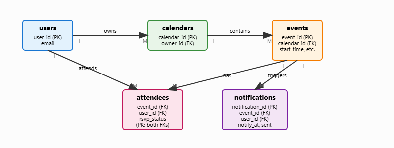
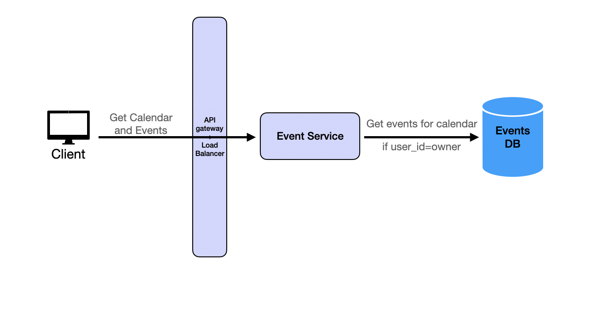
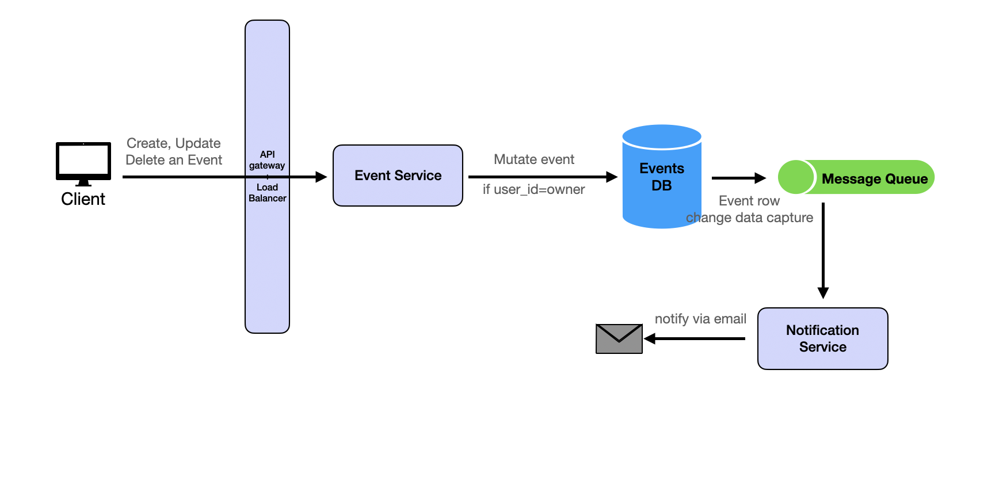
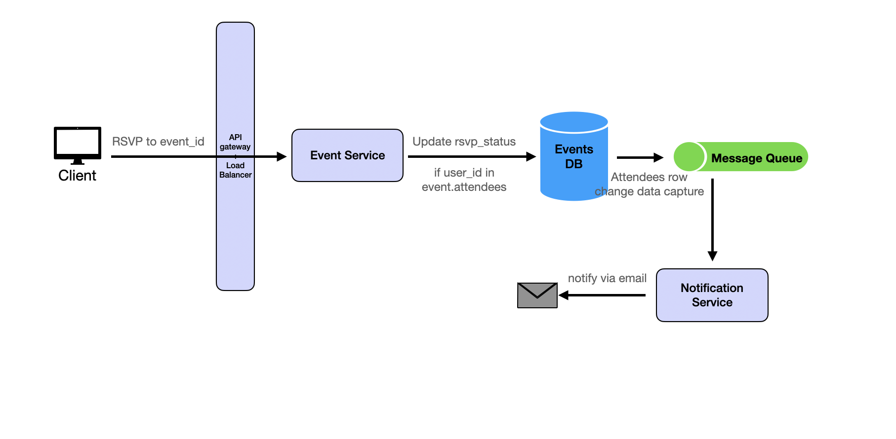
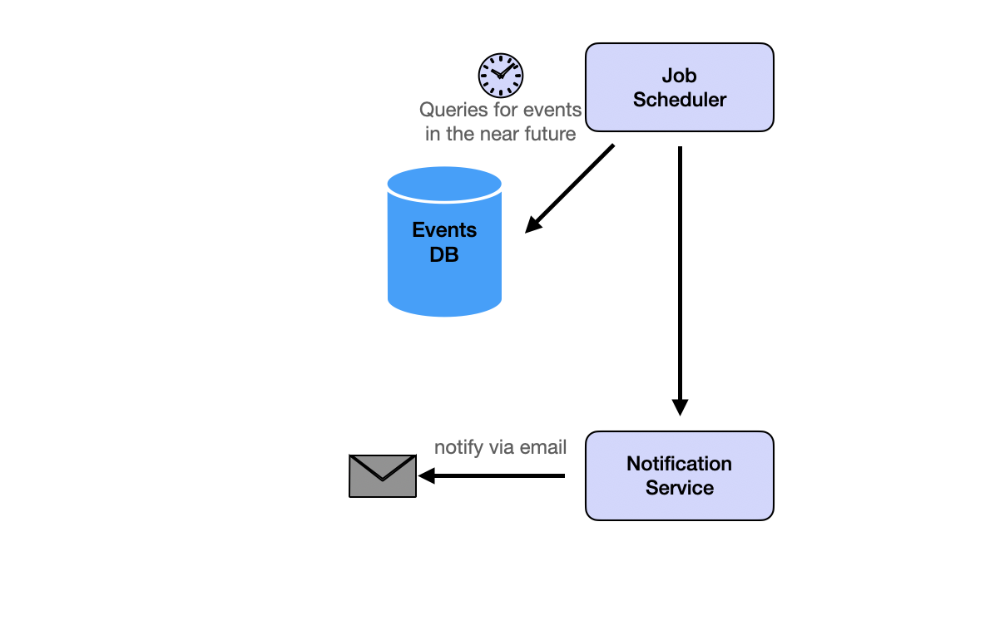
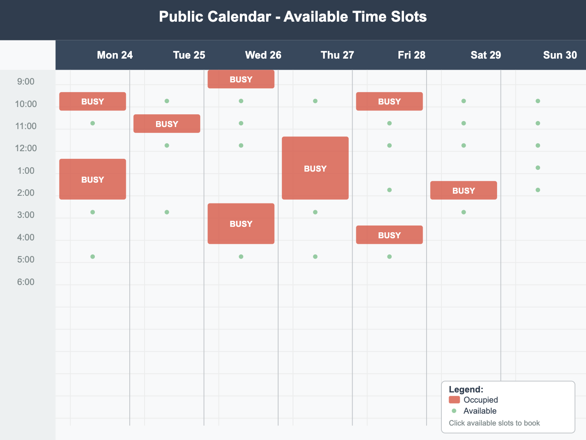

# Design Google Calendar

Source: https://systemdesignschool.io/problems/google-calendar/solution

> Note on fidelity: unlike the primer and some other problem pages, this page uses real static PNG diagram images (not live JS/SVG widgets) for its four High-Level-Design flow diagrams and one deep-dive diagram, plus five collapsible "Request & response" API panels. All five API panels were expanded via the live page and their full request/response JSON bodies are transcribed below. The page has no quiz/"Test Your Understanding" section. The PNG diagram files themselves could not be downloaded in this sandbox (outbound fetches to systemdesignschool.io are limited to page-text/browser tools, which don't return raw binary bytes, and this environment's shell cannot reach the site) — their content is instead captured via the numbered "Flow" text the site places directly under each image, which fully describes each diagram's steps.

Tags: system design · medium

---

## Introduction

Google Calendar is a comprehensive calendar management system that allows users to create, manage, and share calendar events. The system supports event creation, attendee invitations, RSVP functionality, and automated notifications. Users can view their calendars, create events, invite other users as attendees, and receive email notifications before events occur.

Key features include:

- **Event Management** — Create, read, update, and delete calendar events
- **Attendee Management** — Invite users to events and manage their RSVP status
- **Notifications** — Automated email reminders sent 30 minutes before events
- **Access Control** — Only calendar owners can modify events, attendees can RSVP
- **Recurring Events** — Support for recurring meeting patterns (deep dive topic)

## Background

Unlike social media platforms — where user activity generates a high volume of frequent, lightweight writes such as likes, comments, and posts — Google Calendar prioritizes data correctness, integrity, and relationship modeling. Each calendar event may involve multiple users, resources, time constraints, notifications, and access controls, making consistency and structured interactions central to the system's design.

With the assumption of 10 million daily active users (DAUs), the system exhibits a relatively low write frequency: assuming users create an average of 3 events per day, totaling around 30 million writes daily or ~347 write QPS. Each event is typically accessed multiple times — for viewing, notifications, or syncing — resulting in ~300 million reads per day, or ~3,472 read QPS. This is well within the capacity of modern cloud services. Therefore, the design focuses on the entity, relationship, and core-feature implementation rather than raw scale.

## Functional Requirements

1. Users should be able to retrieve their calendar events for a specific time range. Only calendar owners can view all events in their calendar.
2. Calendar owners should be able to create, update, and delete events. When events are modified, the system should trigger notifications to attendees and update the notification scheduling system.
3. Event attendees should be able to RSVP to events they're invited to. The system should validate that users can only RSVP to events where they are listed as attendees and should trigger notifications about RSVP changes.
4. The system should automatically send email notifications to all event attendees 30 minutes before each event starts. The notification system should be reliable and handle large volumes of notifications efficiently.

**Out of Scope:** (the page's "Out of Scope" heading is present but the section renders with no bullet content beneath it — left blank on the live site.)

**Scale Requirements:**

| Assumption | Value |
|---|---|
| Daily active users | 10M |
| Event mutation frequency | Relatively infrequent (low QPS) |
| Events created per user / day | ~3 |
| Attendees per event | ~5 average |
| Design emphasis | More focus on system design and logic than scale |
| Data retention | Indefinitely |

## Non-Functional Requirements

- **Consistency** — Event data must be consistent across all users to prevent double-booking conflicts
- **Security** — Only authorized users can view/modify calendar events, with proper access control
- **Scalability** — System should handle millions of users and events efficiently

## Database Schema

The site notes it doesn't typically go into this much schema detail, but for this problem the schema matters for understanding entity relationships.

- **users** — application accounts (primary key `user_id`).
- **calendars** — every owner has one (or more in the future) calendars; one-to-many (`owner_id → users`).
- **events** — time-bounded items that live inside a calendar; many-to-one (`calendar_id → calendars`).
- **attendees** — join table that captures the many-to-many relationship between users and events plus the `rsvp_status` attribute. RSVP status is a string that can be `accepted`, `pending`, or `denied`.
- **notifications** — records the notifications sent to attendees.


This diagram is a live interactive SVG widget on the site, not a static image. It shows the ER diagram: users own calendars, calendars contain events, events have notifications, and users attend events via the attendees join table which also triggers notifications.

```sql
-- Users
users (
  user_id UUID PRIMARY KEY,
  email TEXT UNIQUE NOT NULL
);

-- Calendar (one-to-many with Users)
calendars (
  calendar_id UUID PRIMARY KEY,
  owner_id UUID REFERENCES users(user_id)
);

-- Events (belongs to a calendar)
events (
  event_id UUID PRIMARY KEY,
  calendar_id UUID REFERENCES calendars(calendar_id),
  created_by UUID REFERENCES users(user_id),
  start_time TIMESTAMP NOT NULL,
  end_time   TIMESTAMP NOT NULL,
  title TEXT NOT NULL,
  description TEXT,
  location TEXT
);

-- Attendees (many-to-many between users and events)
attendees (
  event_id UUID REFERENCES events(event_id),
  user_id  UUID REFERENCES users(user_id),
  rsvp_status TEXT CHECK (rsvp_status IN ('accepted','pending','denied')),
  PRIMARY KEY (event_id, user_id)
);

-- Notifications (emails to be sent)
notifications (
  notification_id UUID PRIMARY KEY,
  event_id UUID REFERENCES events(event_id),
  user_id  UUID REFERENCES users(user_id),
  notify_at TIMESTAMP NOT NULL,
  sent BOOLEAN DEFAULT FALSE,
  sent_at TIMESTAMP
);
```

The schema supports indexed queries on `events.calendar_id`, `events.start_time`, and composite `(event_id, user_id)` in `attendees`.

## API Endpoints

Each endpoint below has an expandable "Request & response" panel; all five were expanded and are transcribed in full.

**`GET /calendars/{calendarId}/events?start=start_time&end=end_time`** — Retrieve calendar events for a specific time range.

Response body:
```json
{
  "events": [
    {
      "event_id": "evt_123",
      "title": "Team Meeting",
      "description": "Weekly sync",
      "start_time": "2024-01-15T14:00:00Z",
      "end_time": "2024-01-15T15:00:00Z",
      "location": "Conference Room A",
      "attendees": [
        { "user_id": "user_456", "rsvp_status": "accepted" }
      ]
    }
  ]
}
```

**`POST /calendars/{calendarId}/events`** — Create a new calendar event. Automatically adds the creator (`token.sub`) to the **attendees** table with `rsvp_status = "accepted"` so they always appear as attending their own event.

Request body:
```json
{
  "title": "Team Meeting",
  "description": "Weekly sync",
  "start_time": "2024-01-15T14:00:00Z",
  "end_time": "2024-01-15T15:00:00Z",
  "location": "Conference Room A",
  "attendees": ["user_456", "user_789"]
}
```
Response body:
```json
{ "event_id": "evt_123", "status": "created" }
```

**`PATCH /calendars/{calendarId}/events/{eventId}`** — Update an existing calendar event.

Request body:
```json
{ "title": "Updated Team Meeting", "description": "Weekly sync - updated agenda" }
```
Response body:
```json
{ "event_id": "evt_123", "status": "updated" }
```

**`DELETE /calendars/{calendarId}/events/{eventId}`** — Delete a calendar event.

Response body:
```json
{ "status": "deleted" }
```

**`POST /calendars/{calendarId}/events/{eventId}/rsvp`** — RSVP to an event.

Request body:
```json
{ "rsvp_status": "accepted" }
```
Response body:
```json
{ "status": "rsvp_updated" }
```

## High Level Design

### 1. Event Retrieval

Users should be able to retrieve their calendar events for a specific time range. Only calendar owners can view all events in their calendar.


*Flow, described by the accompanying numbered steps:*

1. Client issues `GET /calendars/{id}/events?start=&end=`.
2. API Gateway forwards the request to an Event-Service instance.
3. Service authorizes the user, performs an indexed range query on `events` by `calendar_id` and time window, and returns the rows.
4. Client renders the calendar (result may be cached for subsequent loads).

### 2. Event Creation and Modification

Calendar owners should be able to create, update, and delete events. When events are modified, the system should trigger notifications to attendees and update the notification scheduling system.


*Flow:*

1. Client sends `POST|PATCH|DELETE /calendars/{id}/events`.
2. Event-Service validates ownership, performs the DB write in a transaction, and commits.
3. After commit it publishes an "event-changed" message.
4. Notification workers consume the message to insert/update/delete reminder rows so attendees get the right email.

### 3. RSVP Management

Event attendees should be able to RSVP to events they're invited to. The system should validate that users can only RSVP to events where they are listed as attendees and should trigger notifications about RSVP changes.


*Flow:*

1. Attendee submits `POST /events/{id}/rsvp`.
2. Event-Service validates attendee, updates `attendees.rsvp_status`, and emits an `rsvp-changed` message.
3. Notification-Service consumes the message to email confirmations (and optionally the organizer).

### 4. Automated Notifications

The system should automatically send email notifications to all event attendees 30 minutes before each event starts. The notification system should be reliable and handle large volumes of notifications efficiently.


*Flow:*

1. Scheduler periodically selects unsent rows where `notify_at <= now()`.
2. Notification-Service sends emails via provider and sets `sent=true`.
3. Failed sends are retried; repeated failures go to a dead-letter queue for manual review.

This is a very simplified job scheduler. A distributed job scheduler is quite involved and itself deserves a deep dive (a separate design question is planned for that on the site).

## Deep Dive Questions

### How do you handle recurring events in the calendar system?

Use a well-defined standard for recurrence rules rather than inventing one: the **iCalendar RFC 5545 standard's `RRULE`**, generated/parsed with the open-source **rrule.js** library.

Add a `recurrence_rule` field to the Events table:

```sql
ALTER TABLE events ADD COLUMN recurrence_rule TEXT;

-- Example values:
-- "FREQ=WEEKLY;BYDAY=MO,WE,FR" (Monday, Wednesday, Friday weekly)
-- "FREQ=MONTHLY;BYMONTHDAY=15" (15th of each month)
-- "FREQ=DAILY;INTERVAL=2" (Every 2 days)
```

When loading calendar events, query both non-recurring and recurring events:

```sql
-- Query non-recurring events:
SELECT * FROM events
WHERE calendar_id = ?
  AND recurrence_rule IS NULL
  AND start_time >= ? AND start_time <= ?

-- Query recurring events:
SELECT * FROM events
WHERE calendar_id = ?
  AND recurrence_rule IS NOT NULL
  AND start_time <= ?  -- Only events that started before query end
```

Expand recurring events in application code using a library like `rrule.js`:

```js
const rrule = new RRule({
  freq: RRule.WEEKLY,
  byweekday: [RRule.MO, RRule.WE, RRule.FR],
});
```

Combine the expanded recurring instances with the non-recurring results into a single list of events.

### How do you implement conflict detection and find free time slots for scheduling?

Feature goal: let users show their availability and find free time slots for scheduling, without exposing event details to other users.


*"Free Time Slot Generation": time ranges with events are merged into a single "busy" time range; other users cannot see the event details but know these ranges cannot be used for scheduling.*

Two sub-problems:
- Find if two events overlap
- Find time ranges between existing events that can be used for scheduling

**Check if two events overlap** — a straightforward SQL query using `start_time`/`end_time`:

```sql
SELECT COUNT(*) FROM events e
JOIN attendees a ON e.event_id = a.event_id
WHERE a.user_id = ?
  AND a.rsvp_status = 'accepted'
  AND e.start_time < ?  -- proposed_end_time
  AND e.end_time > ?    -- proposed_start_time
```

**Find time ranges between existing events** — merge overlapping events and find gaps between them; a classic "merge intervals" greedy-algorithm problem.

1. Fetch all accepted events in time range:
```sql
SELECT start_time, end_time FROM events e
JOIN attendees a ON e.event_id = a.event_id  
WHERE a.user_id = ? AND a.rsvp_status = 'accepted'
  AND start_time >= ? AND end_time <= ?
ORDER BY start_time
```
2. Merge overlapping intervals:
```python
def merge_intervals(intervals):
    if not intervals:
        return []

    merged = []
    for start, end in sorted(intervals):
        if merged and start <= merged[-1][1]:
            merged[-1] = (merged[-1][0], max(merged[-1][1], end))
        else:
            merged.append((start, end))
    return merged
```
3. Find gaps between merged intervals: use the `merged` list to derive the free gaps.

**Performance optimization:**
- Index on `(user_id, start_time, end_time)` for efficient conflict queries
- Cache frequently accessed user availability data
- Use database-level interval operations where supported

**Business rules:**
- Allow double-booking (Google Calendar allows this)
- Provide conflict warnings rather than blocking
- Consider different event types (busy, free, tentative)

### How do you handle concurrent event modifications when multiple users can edit the same event simultaneously?

Up to this point the design assumed only the event owner can edit it. Extending to **multi-user editing** introduces the classic concurrent-modification problem: when multiple users attempt to modify the same event simultaneously, the system must ensure data consistency while maintaining good user experience.

If changes are non-conflicting they can simply be merged — e.g. Alice changes the title while Bob changes the location; both apply. If changes conflict, three approaches exist:

1. **Reject and Retry** — reject the update and ask the user to try again.
2. **Last Writer Wins** — accept the latest changes and overwrite previous ones; simple but can lose important data.
3. **User-Driven Resolution** — show both versions to the user and let them choose which changes to keep.

Editing an event is relatively infrequent in the real world, but a user whose change got overwritten must be notified right away. The chosen approach is **reject and retry**, implemented via **optimistic locking with version control** to reject the second update.

**Optimistic Locking with Version Control.** Add a version field to the Events table:

```sql
ALTER TABLE events ADD COLUMN version INTEGER DEFAULT 1;
```

When a user loads an event, they receive the current version. When they attempt to save changes, the version is checked:

```sql
UPDATE events
SET title = ?, location = ?, version = version + 1
WHERE event_id = ? AND version = ?
```

If the version doesn't match (someone else modified the event), the update fails and a conflict error is returned to the user. (Optimistic locking is covered in more depth in the site's Domain Knowledge section: [Optimistic Locking](https://systemdesignschool.io/domain-knowledge/optimistic-locking).) On the frontend, a conflict error is shown to the user, who is asked to try again.

