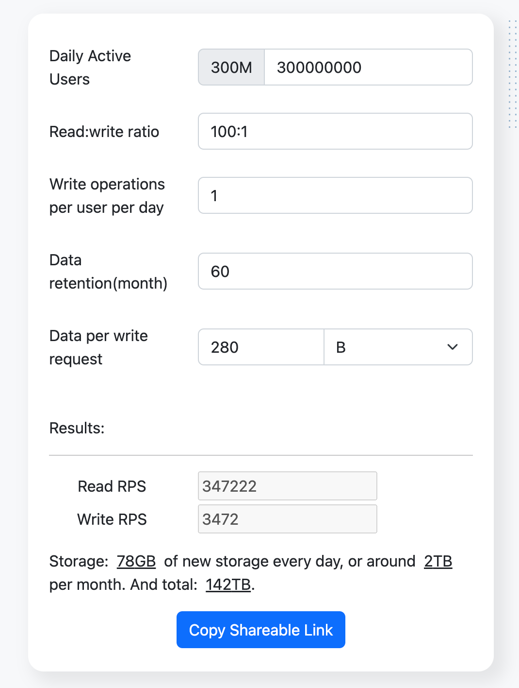
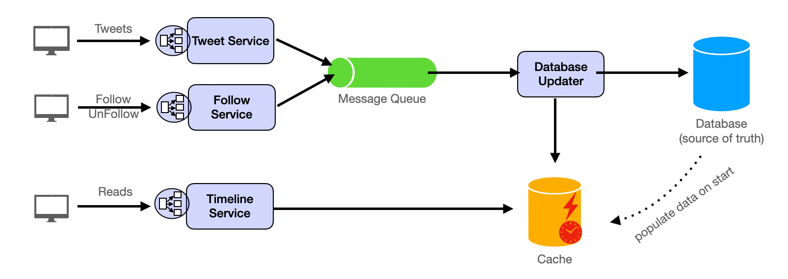

# Design Twitter

Source: https://systemdesignschool.io/problems/twitter/solution

> Note on fidelity: this is an older-style solution page — mostly static prose, tables, and two real (non-JS/SVG) PNG diagrams, with no interactive widgets and no quiz section. One quirk found while researching: an unauthenticated `web_fetch` of this URL renders a "Pro Member Exclusive" upsell card immediately after the "Data Schema" section and appears to cut the article off there; opening the same URL in a live browser session shows the full article text straight through to "References" with no paywall gate encountered, so the upsell card is evidently an unrelated promotional insert (for the site's interactive practice tool) rather than a gate on the article text itself. All sections below — including Database Partitioning, Database Replication, Data Retention, Cache, Analytics, the Follow-Up Q&A, and References — were captured from the live page and are complete.

---

## Introduction

We aim to design a simplified version of Twitter, a popular social media platform where users can post tweets, follow or unfollow other users, and view the tweets of the people they follow. The platform also includes a recommendation algorithm that suggests content to users based on their preferences and interactions.

## Functional Requirements

1. **Tweeting** — Users should be able to write and post new tweets.
2. **Follow/Unfollow** — Users should have the ability to follow or unfollow other users.
3. **Timeline** — Users should be able to view a list of tweets from the people they follow, as well as content recommended by the recommendation algorithm.

## Non-Functional Requirements

- 300M DAUs
- Each tweet is approximately 140 characters (or 280 bytes)
- Retain data for five years
- Assuming each user posts one tweet per day
- High availability
- Low latency
- High durability
- Security

## Resource Estimation

Assuming a read-write ratio of 100:1. Using the [resource estimator](https://systemdesignschool.io/resource-estimator?dau=300000000&read_write_ratio=100:1&write_operations=1&data_retention=60&data_per_write_request=280&precision_mode=true) (DAU 300M, read:write 100:1, 1 write op, 60-unit retention, 280 bytes/write, precision mode).


*The resource estimator's computed output table for these inputs (QPS and storage figures derived from the parameters above; exact numeric readout is embedded in the image only).*

## API Endpoint Design

The API endpoints could include:

- `POST /tweets` — creating a new tweet. Request body:
  ```json
  { "content": "The content of the new tweet." }
  ```
- `GET /tweets/{userId}?last={timestamp}&size={size}` — retrieving a user's tweets.
- `POST /follow/{userId}` — following a user.
- `DELETE /follow/{userId}` — unfollowing a user.
- `GET /timeline?last={timestamp}` — retrieving timeline tweets.

## High-Level Design

Twitter is the perfect example of designing a scalable system using the site's [system design template](https://systemdesignschool.io/fundamentals/system-design-template).

The system is designed with distinct components: the **Tweet Service**, **Follow Service**, and **Timeline Service**.


*The architecture the surrounding prose describes is Tweet Service and Follow Service → write into a Message Queue (not directly into the database) → Database Updater consumes the queue, processes business logic, writes to the database, and updates the cache; separately, Timeline Service reads from the cache to serve timeline requests (not the database).*

The Tweet Service and Follow Service handle requests for sending tweets, following, and unfollowing. Considering the need for response speed to the client and support for high concurrency, these two services do not directly write into the database, but write the request data into the Message Queue. The Database Updater component reads the request data from the Message Queue, genuinely processes the business logic, writes into the server, and updates the cache.

The Timeline Service handles requests for loading Twitter lists. Based on considerations of response speed and improving system efficiency, this service reads data from the cache, rather than accessing the database.

### Fan-out-on-write

Each user has their own "inbox" inside the cache that stores the tweets to be displayed in its timeline. When a user it follows posts a tweet, the tweet is sent to its "inbox." This is often called "fan-out-on-write" because it replicates ("fans out") a piece of information to multiple destinations at the time of its creation or update. The advantage is it significantly enhances read performance since the tweets are already present in a timeline cache when a user logs in, reducing the need for complex and time-consuming queries at read time. However, for celebrities with millions of followers this presents a problem, as the write would be quite large — a common follow-up question in Design Twitter interviews, covered in the follow-up question section below.

## Detailed Design

### Database Type

Considering the scale requirement of 300M DAU and assuming each user sends one tweet per day, this generates 300M tweets per day — a tremendous amount of data. At the same time, this system does not have complex query requirements. Considering these two points, NoSQL could be used as the database.

A NoSQL database like **Cassandra** could be used due to its ability to handle large amounts of data and its high write speed.

### Data Schema

The data schema could include a Users table, a Tweets table, and a Follows table. The Users table stores user information, the Tweets table stores tweets, and the Follows table stores information about who each user is following.

Table structure, designed with Cassandra as the database:

**Users Table**

| Field | Type |
|---|---|
| UserID | UUID PRIMARY KEY |
| UserName | Text |
| UserEmail | Text |
| UserPassword | Text |

**Tweets Table**

| Field | Type |
|---|---|
| TweetID | UUID PRIMARY KEY |
| UserID | UUID |
| TweetContent | Text |
| TweetTimestamp | Timestamp |

**Follows Table**

| Field | Type |
|---|---|
| FollowerUserID | UUID |
| FollowedUserID | UUID |
| FollowID | UUID PRIMARY KEY |

UUIDs are used as primary keys because they can generate unique IDs without the need for a central coordinator — very useful for distributed systems.

Additional tables are needed to optimize queries — e.g., if tweets-from-a-user is a frequent query, a table keyed on `(UserID, TweetTimestamp)` lets that query be served quickly.

### Database Partitioning

The database could be partitioned based on user ID to distribute the data evenly and reduce the load on any single node.

Using user ID as the partitioning field can lead to the "celebrity problem." Resolving this requires a more complex partitioning strategy, discussed further in the Follow Up Detailed Design Questions and Answers section.

### Database Replication

Distributed NoSQL databases usually have a certain degree of data redundancy and failover capability, and can automatically recover when nodes fail. The main consideration for data backup is therefore protecting data against extreme situations such as physical damage to the data center, network attacks, or human errors.

Data backup strategies for these extreme situations:

- **Regular Backups** — perform full and incremental backups regularly. A full backup backs up all data; an incremental backup backs up only the data changed since the last full or incremental backup.
- **Offline Backups** — store backup data separate from the production environment, so it stays safe even if production is attacked or damaged.
- **Geographical Distribution** — store backup data in different geographical locations, so a disaster at one location (fire, flood) doesn't take out the backups too.
- **Test Backups** — regularly test the restore process to ensure data can be successfully restored when needed.
- **Version Control** — keep multiple versions of backups, so an older backup remains usable if the latest one has a problem.

### Data Retention and Cleanup

Tweets older than five years could be archived or deleted to free up storage space.

### Cache

Caching is essential for low latency and high availability. An in-memory database like **Redis** can store the most recent or most frequently accessed tweets, reducing load on the primary database and improving read speed.

Caching strategies:

- **Caching User Timelines** — cache users' timelines (tweets from people they follow). On a timeline request, check the cache first; if present, return directly; if absent, query the database, update the cache, then return the data.
- **Caching Popular Tweets** — cache frequently accessed tweets, particularly useful for popular tweets liked/retweeted/replied to by many users.
- **Caching User Profiles** — cache profile data (tweets, followers, following), speeding up profile views and follow-checks.
- **Eviction Policies** — since cache size is limited, decide how to remove items when full; e.g. **LRU** (Least Recently Used) removes items unaccessed for the longest time.
- **Cache Refreshing** — keep the cache up to date via **write-through** (update cache every time the database updates) or **TTL** (items auto-expire after a set period).
- **Cache Partitioning** — partition the cache across multiple servers (e.g. hash of the data key) to handle large data volumes and high traffic.
- **Replication and Persistence** — replicate cache data across multiple servers and periodically persist to disk, to prevent data loss on cache failure.
- **Cache Consistency** — use strategies like read-through, write-through, write-around, or write-back caching to keep cache and primary database consistent.

By implementing these caching strategies, the design significantly improves performance and user experience for a Twitter-like service. (The site notes further detail on Loading Patterns and Eviction Policy lives in its separate Caching section.)

### Analytics

The system should include an analytics component that collects and processes data to provide insights into user behavior and improve the recommendation algorithm — understanding users' interests, their interaction with the platform, and the recommendation algorithm's performance.

Key aspects the analytics component could focus on:

- **User Behavior Analysis** — track and analyze user actions (likes, retweets, follows/unfollows, tweet frequency, etc.) to understand interests and preferences, feeding the recommendation algorithm.
- **Content Analysis** — analyze tweet content (trending topics, hashtags, shared links) to understand what content is popular and engaging.
- **Performance Analysis** — track how the recommendation algorithm performs (click-through, dwell time on recommended content) to identify where it can improve.
- **A/B Testing** — test different recommendation-algorithm versions against each other (e.g. past-behavior-based vs. social-connections-based) to determine which is more effective.
- **Real-Time Analytics** — process and analyze data in real time (trending topics, spam/abuse detection) to respond quickly to platform changes and issues.

Implementation might combine a data-processing framework like **Apache Hadoop** (large-scale processing), a data warehouse like **Google BigQuery** (storage/analysis), and a visualization tool like **Tableau** (results), plus machine learning to predict user behavior and improve recommendations.

## Follow Up Detailed Design Questions and Answers

**How should the system handle the massive write operations for new tweets?**
Write requests initially go into a message queue; when a user posts a tweet, the request is queued and processed in the background, letting the user continue interacting without waiting for the write to complete. Writing from the queue into the database uses a distributed database that scales horizontally, distributing write load across multiple nodes and reducing load on any single node.

**How should the system generate a unique ID for each tweet?**
A Distributed ID Generation Service — also known as a Key Generation Service (KGS) — generates unique IDs in a distributed system, useful when many nodes/services must independently generate unique IDs without overlaps. Examples: Twitter's Snowflake and Instagram's ID generation method. (The site points to the "Distributed ID Generation Service" section in the URL Shortener Solution for more depth.)

**How is the Timeline feature implemented?**
Via "fan-out-on-write" — a data-distribution strategy common where reads vastly outnumber writes: when a user posts a tweet, it is immediately written to the timelines of all their followers. When a user who hasn't logged in for a while requests their timeline, the system first checks the cache; if present, return directly; if absent, query the database, update the cache, then return the data.

**How to handle the "celebrity problem," where an account with a large number of followers posts a tweet and potentially causes a surge in traffic?**
For a "celebrity" user with a large following, fan-out-on-write becomes expensive — updating millions of followers' timelines risks a traffic surge and performance issues. Mitigation: a **hybrid fan-out-on-write** strategy — immediately push the tweet to a subset of followers (e.g. those currently online or recently active); for the rest, add the tweet to their timeline when they next request it. This balances load, letting followers see tweets in a timely manner while preventing a sudden traffic surge. So fan-out-on-write typically writes to all followers' timelines on post, but can be adjusted based on follower count and system performance considerations.

**If a timeline is maintained for each person, how are tweets sent before following and unfollowing handled?**
On follow: the system adds the recent tweets of the followed user to the follower's timeline, so the follower immediately sees them after following. The timeline tracks the point in time up to which tweets from the followed user have been loaded; when the user browses to an unloaded point, the system fetches and adds those tweets. On unfollow: the system removes the unfollowed user's tweets from the timeline, so they no longer appear — but any interactions the user made with those tweets (retweet, like) remain on the user's own timeline/activity. In summary, the timeline dynamically changes with the user's current following situation — loading tweets posted before a follow, and removing tweets from unfollowed users.

**How will the system prevent abuse or overly heavy use by a single user or IP?**
Via **rate limiting** — limiting the number of requests a user or IP can make within a time period; requests beyond the limit are temporarily blocked. This helps prevent spam, abuse, and denial-of-service attacks.

## References

- Original Twitter architecture talk by Twitter engineers, 2016.

