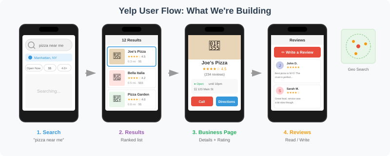
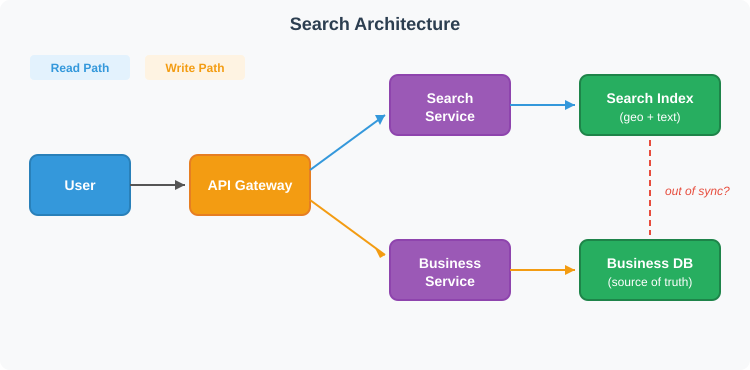
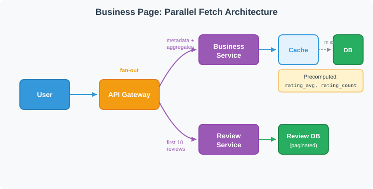
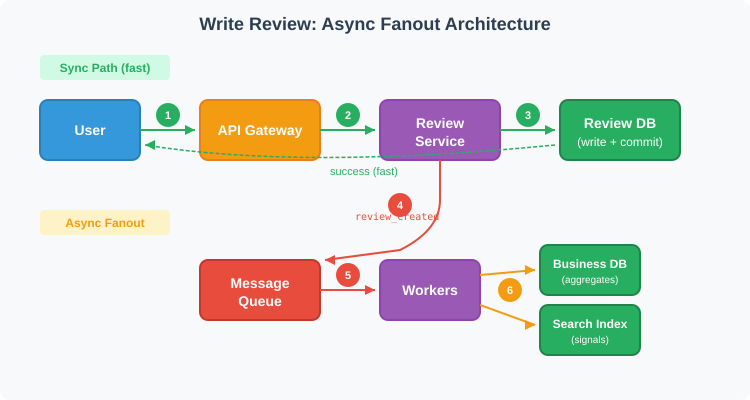

# Design Yelp

Source: https://systemdesignschool.io/problems/yelp/solution

> Note on fidelity: this page is dense with collapsed accordion panels (API "Request & response" details, "Search Backend Options," "Review Storage Options," numbered "Option"/"Approach"/"Mitigation"/"Invalidation Approach" comparison cards, and three "Staff-Level Discussion Topics" cards) plus two static SVG diagram images. All accordions were expanded via the live page and their full text captured, across two passes (clicking one batch of toggles collapsed a few that had been opened by an earlier, overlapping click — this was cross-checked and merged so every panel's body text below is complete). One small gap: the "Review Database: Relational vs NoSQL" comparison has two sub-options, "Option 1: Relational Database (Recommended)" and "Option 2: Wide-Column Store" — their toggle buttons could not be located/expanded before the live page's client-side state reset (this site's practice-problem carousel appears to auto-cycle in the background), so their per-option body paragraphs are not transcribed; the section's "Our Choice" rationale immediately after them **is** fully captured and states the substantive conclusion. Everything else on the page, including all deep-dive sections through "Interview Cheatsheet," is complete below. No quiz/"Test Your Understanding" section exists on this page.

Tags: system design · medium

---

## Introduction

Yelp connects users with local businesses through search and reviews. A user searches "pizza near me, open now" and gets a ranked list of nearby pizzerias. They tap a result to see the business page with hours, photos, and reviews. After dining, they leave a 4-star review with a photo of their margherita.



The user-journey flow described by the surrounding prose — search → business page → review.

The system handles three core flows: searching businesses by location and keywords, viewing business details with reviews, and writing reviews that update ratings.

## Functional Requirements

Three core functional requirements map to the user journey (each requirement builds on the previous, progressively adding components to the architecture):

1. **Search** — Find businesses near a location with text and filters. Users search by text query and location; results are filtered by criteria (open now, price range, categories) and sorted by distance, rating, or relevance.
2. **View** — See business details, reviews, and ratings. Users view a business page showing details (name, hours, photos), aggregate rating (4.5 stars from 234 reviews), and paginated reviews.
3. **Review** — Write a review and update derived data. Users write reviews with a star rating, text, and optional photos. The review must be durable, and derived data (aggregates, search index) must eventually update.

**Out of Scope:** (heading present on the page with no bullet content listed beneath it.)

**Scale Requirements:**

| Assumption | Value |
|---|---|
| Daily active users | 10M |
| Read:write ratio | 1000:1 (search/view heavy, reviews infrequent) |
| Businesses globally | 200M |
| Reviews total | 500M |
| Peak search QPS | 50,000 |

## Non-Functional Requirements

The NFRs shape architecture choices:

- **Latency** — Search p95 should be low hundreds of milliseconds. Business pages similarly fast. Users expect instant results when searching "coffee near me."
- **Scale** — Read-heavy workload (1000:1 ratio). Large dataset with 200M businesses and 500M reviews. Search traffic spikes during meal times and weekends.
- **Consistency** — Reviews must be durable once written. Aggregates (average rating, review count) and search index can be eventually consistent.
- **Availability** — Graceful degradation for browse/search. If the review service is slow, search should still work.

These NFRs imply: search index for geo+text queries, caching for read-heavy traffic, and async pipelines for derived data.

- **Low Latency** — Search p95 < 200ms; business page loads < 100ms
- **High Scalability** — Handle 50K search QPS at peak; support 200M businesses
- **Eventual Consistency** — Reviews durable immediately; aggregates and search index eventually consistent
- **High Availability** — Search and browse degrade gracefully; review writes always succeed

## API Endpoints

Minimal API surface covering the three core flows. All four "Request & response" panels were expanded.

**`GET /search?query={text}&lat={lat}&lng={lng}&radius={meters}&open_now={bool}&price_range={1-4}&category={text}&sort={type}`** — Search businesses near a location with optional text query, filters, and sort. Individual filter params are URL-cacheable and avoid JSON parsing overhead.

Response body:
```json
{
  "results": [
    { "business_id": "abc123", "name": "Joe's Pizza", "rating": 4.5, "review_count": 234, "distance_m": 150 }
  ],
  "next_cursor": "eyJvZmZzZXQiOjIwfQ=="
}
```

**`GET /businesses/{id}`** — Get business details including hours, photos, and aggregate rating.

Response body:
```json
{
  "id": "abc123",
  "name": "Joe's Pizza",
  "categories": ["pizza", "italian"],
  "lat": 40.7128,
  "lng": -74.0060,
  "address": "123 Main St, New York, NY 10001",
  "phone": "+1-212-555-0198",
  "website_url": "https://joespizza.com",
  "hours": { "mon": "11:00-22:00", "...": "..." },
  "rating_avg": 4.5,
  "rating_count": 234
}
```

**`GET /businesses/{id}/reviews?cursor={cursor}`** — Get paginated reviews for a business, sorted by recency or usefulness.

Response body:
```json
{
  "reviews": [
    { "id": "r1", "user_id": "u1", "stars": 5, "text": "Best pizza!", "created_at": "2024-01-15" }
  ],
  "next_cursor": "eyJvZmZzZXQiOjEwfQ=="
}
```

**`POST /businesses/{id}/reviews`** — Create a review. Include idempotency key header to prevent duplicates.

Request body:
```json
{
  "stars": 4,
  "text": "Great margherita, service was slow",
  "photo_urls": ["https://..."]
}
```
Response body:
```json
{ "review_id": "r123" }
```

## High Level Design

### 1. Search Businesses

A user searches "pizza" while standing in Manhattan. The system must find pizzerias within 2km, filter to those currently open, and rank by distance and rating. Built incrementally:

**The Problem.** The naive approach queries the Business Database directly:

```sql
SELECT * FROM businesses
WHERE distance(lat, lng, 40.75, -73.99) < 2000
  AND name ILIKE '%pizza%'
ORDER BY distance
LIMIT 20;
```

At 200M businesses, this query scans millions of rows. The distance calculation runs for every row. `ILIKE '%pizza%'` can't use a B-tree index. Response time: 2-3 seconds. At 5,800 peak QPS, queries queue faster than they complete, exhausting connections and timing out.

**Step 1: Add a Search Index.** Move geo+text queries to a dedicated search index like Elasticsearch. The Search Service sits between the API Gateway and the index. On the write side, the Business Service handles updates to the Business Database — hours changes, new listings, closures.



API Gateway → Search Service → Search Index (Elasticsearch); separately, Business Service → Business Database, described by the surrounding prose.

Elasticsearch provides geo queries (geohash-based spatial filtering), text search (inverted indexes for fast keyword matching), and combined queries (efficient intersection of geo + text + filters). Search now returns in 50ms.

But there's a problem: the Business Service writes to the database, not the search index. A restaurant updated their hours yesterday. The database shows "closes at 10pm" but the search index still shows "closes at 9pm." A user filters for "open now" at 9:30pm and the restaurant doesn't appear. The index is stale.

**Search Backend Options (expandable comparison cards, all three expanded):**

- **Elasticsearch/OpenSearch** — Purpose-built for search with native `geo_distance` queries and text analysis. Handles both geo filtering and relevance ranking in a single query. Most teams choose this for combined geo+text search. *Trade-offs:* requires maintaining a separate index synced from the source database; eventually consistent by nature.
- **PostgreSQL + PostGIS** — PostGIS extension adds spatial indexing (R-tree) to Postgres. Can handle geo queries efficiently; text search via full-text search or trigram indexes. *Trade-offs:* works well for moderate scale; at 200M businesses and 5K QPS, may struggle without read replicas and careful tuning; combining geo + text + filters in a single query can be complex.
- **Split by Query Type** — Use PostGIS for geo filtering to get a candidate set, then Elasticsearch for text ranking; each system handles the query type it's best at. *Trade-offs:* more complex architecture — two systems to maintain, coordinate, and keep in sync — but each layer can be tuned and scaled independently.

**Step 2: Keep the Index Fresh.** The Search Index must stay in sync with the Business Database. A restaurant updates its hours from "closes at 9pm" to "closes at 10pm" — how quickly and reliably does the index reflect that? Two approaches dominate.

- **Option 1: Dual Write** — Application code writes to both the database and the search index in the same request handler. No extra infrastructure — the write path is short and easy to reason about. If step 2 fails after step 1 succeeds, the database and index drift apart silently. A nightly reconciliation script can catch drift by scanning recent database changes and patching the index. At 10,000 businesses, that script runs in seconds. At Yelp's scale (200M businesses), reconciliation becomes impractical — a full scan takes hours, competes with production traffic, and drift accumulates faster than reconciliation can fix it.
- **Option 2: Change Data Capture** — A CDC pipeline (Debezium, DynamoDB Streams, etc.) watches the Business Database transaction log and pushes changes to the Search Index asynchronously. The transaction log is the single source of events — if data was committed, the log entry exists; even if the pipeline is temporarily down, the entry is waiting. Business updates succeed immediately; the index catches up within seconds. CDC comes with real operational cost: the pipeline needs monitoring for consumer lag (a lagging connector during a traffic spike serves stale results); schema changes in the source database can break the connector if new columns aren't mapped; connector failures (network partitions, credential rotation, rebalancing) require alerting and automated restart; if the database log rotates before a crashed connector recovers, those changes are permanently lost and a full reindex is the only recovery path. Beyond infrastructure, CDC events are row-level — a review event carries `business_id` but not the business name or hours, so consumers must join streams or look up related data. Parallel consumers can also reorder events, causing deletes to arrive before creates unless partitioned by entity ID.

**Concept callout: Change Data Capture.** In interviews, candidates often throw around "CDC" like magic pixie dust that solves synchronization — don't be that candidate. CDC does solve consistency, but it comes with real operational cost: stream joins, infrastructure sprawl, schema evolution headaches, and ordering pitfalls. At Yelp's scale (200M businesses, users filtering by "open now"), that cost is justified — permanent data drift is unacceptable and reconciliation against a database that large is impractical. For a smaller system — say 10,000 listings — dual writes with a reconciliation script would be the better choice. (Links to the site's full [Change Data Capture](https://systemdesignschool.io/fundamentals/change-data-capture) article.)

When the CDC consumer receives a change event, it transforms the row into a search document and upserts it into the index. Deletes in the source become deletes in the index.

Now the architecture is complete: fast searches via the index, fresh data via CDC, and the database remains the source of truth.

### 2. View Business Details

A user taps a search result to view Joe's Pizza. The page needs the business name, hours, photos, the aggregate rating (4.5 stars from 234 reviews), and the first page of reviews. Built incrementally:

**The Problem.** The naive approach joins everything in one query:

```sql
SELECT b.*, AVG(r.stars) as rating, COUNT(r.id) as review_count
FROM businesses b
LEFT JOIN reviews r ON b.id = r.business_id
WHERE b.id = 'joes-pizza'
GROUP BY b.id;
```

This calculates the average from all 234 reviews on every page load. A popular restaurant with 5,000 reviews makes this query slow. At 1,700 page views per second, the database struggles.

**Step 1: Separate Business and Review Queries.** Business metadata (name, hours, location) and reviews have different access patterns. Business data rarely changes and can be cached aggressively. Reviews are append-mostly and need pagination. Split into two services: Business Service for metadata, Review Service for paginated reviews. The API Gateway fans out to both.



API Gateway fanning out to Business Service (→ cache) and Review Service (→ paginated reviews), per the surrounding prose.

Now business data comes from cache (fast), and reviews are paginated (only fetch 10 at a time). But `AVG(stars)` is still calculated on every request — a restaurant with 5,000 reviews still requires scanning all of them.

**Review Storage Options (expandable comparison cards, both expanded):**

- **Relational Database (PostgreSQL)** — Reviews fit naturally in a relational model: reviews table with foreign key to businesses. Pagination via `OFFSET/LIMIT` or cursor-based with `WHERE created_at < cursor ORDER BY created_at DESC LIMIT 10`. *Trade-offs:* works well at moderate scale; at 500M reviews, needs read replicas and careful indexing; hot businesses (thousands of reviews) can cause slow queries.
- **Wide-Column Store (Cassandra/DynamoDB)** — Partition by `business_id`, sort by `created_at`. Pagination is natural — read the next N rows from the partition. Scales horizontally. *Trade-offs:* more operational complexity; eventual consistency by default; harder to do complex queries (e.g., "reviews by user X across all businesses").

Either option can be paired with a cache layer (Redis sorted sets) for hot business reviews to speed up first-page pagination.

**Step 2: Precompute Rating Aggregates.** Instead of calculating `AVG(stars)` on read, store `rating_avg` and `rating_count` in the Business table or a dedicated cache, updated asynchronously when reviews change. Trade-off: the aggregate might be seconds behind the actual reviews (eventual consistency) — a user submits a 5-star review and the page still shows 4.5 stars for a few seconds; acceptable since users don't expect real-time aggregate updates.

Now the business page loads three independent pieces: cached business metadata, precomputed aggregates, and the first page of reviews — each scaling independently.

### 3. Write a Review

A user finishes dinner and writes a 4-star review with a photo. The system must save the review durably, then update derived data: the rating aggregate and search index signals. Built incrementally:

**The Problem.** On submit, the system needs to (1) save the review to the database, (2) update the business's `rating_avg` and `rating_count`, and (3) update search index signals (businesses with more/better reviews rank higher). The naive approach does all three synchronously: submit → write review → update aggregates → update search index → return success. If Elasticsearch is slow, the user waits; if it's down, the review fails even though it could have been saved.

**Step 1: Write to Database First, Return Success.** The user cares that their review is saved, not that the aggregate updates immediately. So: write the review to the Review Database, commit, then return success.



Client → Review Service → Review Database (commit) → return success, with derived-data updates happening afterward, per the surrounding prose.

Now writes are fast (tens of ms), but derived data (aggregates, search index) is stale — the user submitted a 5-star review, but the business page still shows the old average.

**Review Database: Relational vs NoSQL (comparison; body text for the two sub-options was not retrievable in this session — see fidelity note above):**

- **Option 1: Relational Database (Recommended)**
- **Option 2: Wide-Column Store**
- **Our Choice:** Relational database. The write volume (approximately 1.2 QPS) doesn't justify the operational complexity of a wide-column store. Relational databases handle the query patterns naturally — paginate by business, query by user, join for aggregates — and ACID guarantees simplify the write path. Read replicas handle the read load.

**Step 2: Async Fanout via Message Queue.** After writing the review, publish a `review_created` event to a message queue (Kafka, SQS, etc.). Workers consume events and update: rating aggregates (`rating_sum`/`rating_count`, avg = sum/count) and search index signals (`review_count`/rating for the business). This decouples the write path from derived-data updates — if Elasticsearch is down, reviews still save; workers retry when it recovers. Even at low write QPS, the queue is mainly for decoupling fanout and handling downstream outages, not raw throughput.

The review row exists in the primary database immediately, but if the business page reads reviews from a replica or cache, replication lag or cached pages can hide the new review for a few seconds.

**Step 3: Read-Your-Writes for the Author.** The author should see their review immediately — two options: (1) **Read from primary** — for the author's session, read reviews from the primary database instead of a replica; (2) **Optimistic display** — include the new review in the API response and have the client display it locally. Other users see the review with a slight delay (seconds) as replicas sync and caches invalidate — acceptable.

**Idempotency and Duplicate Prevention.** Users shouldn't submit duplicate reviews by double-clicking or network retries. Enforced two ways: **Database constraint** — unique index on `(user_id, business_id)` prevents duplicate rows, second insert fails; **Idempotency key** — client sends a unique key in the request header; if the same key reappears, return the existing review instead of creating a duplicate.

**Photo Uploads.** If photos are in scope, they follow a separate path: (1) client uploads photo to object storage (S3) via presigned URL; (2) client includes the photo URL in the review submission; (3) photos are served via CDN for fast loading.

## Deep Dive Questions

### How does ranking and relevance work for search results? *(Senior)*

When a user searches "pizza," they expect the best nearby pizzerias — not just the closest ones.

**The Challenge.** Search results need to balance multiple signals: proximity, quality (high ratings matter), and confidence (a 4.5-star rating from 500 reviews is more trustworthy than a 5-star from 1 review). At 50K QPS with 200M businesses, ranking must also be fast.

- **Approach 1: Distance-Only Ranking** — Sort results by distance from the user. Simple and fast. *Limitation:* the closest pizza place might have 2 stars and reviews mentioning "cold pizza." Users expect quality, not just proximity.
- **Approach 2: Rating × Distance** — Combine signals: `score = rating × (1 / distance)`. Higher-rated places rank above closer mediocre ones. *Limitation:* a new restaurant with one 5-star review (from the owner's friend) outranks an established 4.5-star place with 500 genuine reviews — raw ratings don't account for confidence.
- **Approach 3: Smoothed Ratings** — Apply Bayesian smoothing: businesses with few reviews get pulled toward the global average. Formula: `smoothed = (sum_of_stars + prior × avg) / (num_reviews + prior)`. With `prior = 10`, a single 5-star becomes ~3.8 stars; an established 4.5 with 500 reviews stays at 4.5. *Limitation:* at 50K QPS, scoring millions of businesses with complex formulas is too slow.
- **Approach 4: Two-Stage Retrieval (Recommended)** — Split ranking into stages: **Retrieval** — search index returns top 1000 candidates using simple scoring (text match + geo filter), fast via precomputed index structures; **Reranking** — a lightweight service rescores the 1000 candidates with richer signals (smoothed rating, review freshness, category match), returning the top 20. Fast (only 1000 candidates scored) and accurate (rich signals in reranking).

**Our Choice:** Two-stage retrieval with smoothed ratings in the reranking stage. Start with search engine scoring (Elasticsearch `function_score`). Add application-level reranking when you need ML models or A/B testing flexibility.

### How does geo indexing work at scale? *(Senior)*

A user at coordinates (40.75, -73.99) searches for pizza within 2km. With 200M businesses, an efficient spatial index is needed.

**The Challenge.** Finding "points within radius" requires either scanning all records (slow) or a spatial index that narrows candidates quickly. The naive approach — calculating haversine distance for every business — takes seconds and melts the database at 50K QPS.

- **Approach 1: B-tree on Latitude/Longitude** — Index the lat column, query `WHERE lat BETWEEN 40.73 AND 40.77`; narrows to ~1M rows in that latitude band. *Limitation:* latitude 40.75 spans the entire globe — still get businesses in Spain and China. A compound index `(lat, lng)` helps, but B-trees handle one dimension well, not two; circular radius queries become rectangular bounding boxes needing post-filtering.
- **Approach 2: Geohash Encoding (Recommended)** — Encode lat/lng as a string: (40.75, -73.99) → `"dr5ru7"`; nearby locations share prefixes, `"dr5ru"` covers a ~1km² area. To find nearby businesses: compute which geohash prefixes intersect the search circle, query for businesses with those prefixes (fast string prefix match), post-filter with exact distance (small candidate set). *Limitation:* grid cells are rectangular; edge cases at cell boundaries require querying multiple prefixes, but this is well-understood and handled automatically by tools like Elasticsearch.
- **Approach 3: R-Tree (PostGIS)** — Groups nearby points into bounding rectangles, organized hierarchically; queries traverse the tree to find overlapping regions. More accurate for complex shapes (polygons, intersections). *Limitation:* harder to distribute across shards; better suited for single-node or replicated databases.
- **Approach 4: S2/H3 Cells** — Modern alternatives using spherical (S2) or hexagonal (H3) cells; better mathematical properties (hexagons have uniform distance to neighbors). *Limitation:* requires specialized libraries; often overkill unless precise coverage analysis is needed (e.g., delivery-radius area coverage).

**Our Choice:** Geohash in Elasticsearch. It combines naturally with text search, scales horizontally, and is operationally simple; Elasticsearch's `geo_point` field handles geohash encoding automatically — a `geo_distance` query is efficient at 200M documents and 50K QPS. Consider R-tree (PostGIS) if already on PostgreSQL without needing combined text+geo search. Consider S2/H3 for precise area calculations or coverage-analysis tooling. (Links to the site's [Choosing a Spatial Index](https://systemdesignschool.io) article for a deeper comparison.)

**Geo Distance vs Road Distance.** All approaches above use geo distance (straight-line, "as the crow flies"). Real travel follows roads — two restaurants 3km apart across the San Francisco Bay might be 40km by road (over the Golden Gate Bridge and back). Whether this matters depends on geography: in dense urban grids (Manhattan, central London) geo distance closely approximates road distance; near rivers, bays, mountains, or highways without exits, the gap widens, and in areas with many users near such barriers this affects a significant share of results, not just a rare corner case. A layered approach handles this without slowing search: **First pass: geo distance** — the search index filters candidates by straight-line radius, fast, eliminating most irrelevant businesses; **Reranking: cached road distances** — precompute approximate road distances between grid cells (geohash pairs) via a routing service, store in cache, and during reranking replace geo distance with cached road distance for top candidates (catches the Bay-crossing problem without a routing API call per request); **Business page: on-demand routing** — when a user taps a specific business, fetch the actual driving/walking route and display it (a single API call, acceptable latency for a detail view). For most interviews, acknowledging the geo-vs-road distinction and sketching the layered solution is sufficient.

### What caching strategy handles read-heavy traffic? *(Senior)*

With a 1000:1 read/write ratio, every read hitting the database won't scale. At 1,700 page views per second, the database connection pool saturates.

**The Challenge.** Caching involves two decisions: what to cache (and for how long), and how to keep cache fresh when data changes. Different data types have different staleness tolerances — business hours should be accurate, but a rating aggregate lagging by a minute is fine.

**What to Cache: TTL by Data Type**

| Data type | TTL | Rationale |
|---|---|---|
| Business metadata (name, hours, location) | 1 hour | Rarely changes; high cache hit rate |
| Rating aggregates (avg stars, count) | 5 minutes | Changes with each review; slight staleness acceptable |
| Search results | 1 minute | Ranking signals change frequently; short cache still helps burst traffic |
| Review pages | 5 minutes | Paginated data; first page changes most often |

**Invalidation approaches (all three expanded):**

- **Invalidation Approach 1: TTL-Only** — Let cached data expire naturally; simple, no invalidation logic needed. *Limitation:* a restaurant permanently closes — with a 1-hour TTL, users see "Open" for up to an hour; critical updates have unacceptable staleness.
- **Invalidation Approach 2: Event-Based** — Publish invalidation events when data changes (business updated → invalidate `biz:{id}` immediately; review created → invalidate `agg:{id}` and `reviews:{id}:page:1`). *Limitation:* if the event system fails or lags, cache serves stale data indefinitely.
- **Invalidation Approach 3: TTL + Events (Recommended)** — Combine both: events for immediate freshness on important changes, TTL as a fallback safety net; if events fail, data still expires eventually.

**Our Choice:** TTL + event-based invalidation. Set TTLs by data type based on staleness tolerance. Fire invalidation events for critical changes (business closures, hours updates). Redis cluster with key prefixes handles most Yelp-scale workloads; add tiered caching for extreme hot spots.

### How do you handle celebrity businesses (hotspots)? *(Senior)*

A viral TikTok video sends 100,000 users to a single restaurant's page in an hour. The page normally gets 10 requests/minute; now it gets 1,000 requests/second.

**The Challenge.** Without protection, the spike hammers a single database row and cache key — the database connection pool exhausts, a single Redis node handling the hot key spikes to 100% CPU, other businesses' pages slow down, and the entire system degrades because of one hot key.

- **Mitigation 1: Aggressive Caching** — Cache the full business page response with a short TTL (10 seconds); at 1,000 req/sec, the cache serves 9,990 requests, only 10 hit the database. *Limitation:* all 1,000 requests/second still hit the same Redis key — a single Redis node handles all the traffic, creating a cache-layer hotspot.
- **Mitigation 2: Cache Key Replication** — Spread the hot key across replicas: instead of `biz:viral-restaurant`, create `biz:viral-restaurant:replica:{0-9}`; each request randomly picks a replica, load distributes across 10 Redis nodes. *Limitation:* when the cache expires, all replicas expire simultaneously — the next 1,000 requests all see a cache miss, a thundering herd hits the database at once.
- **Mitigation 3: Request Coalescing (Single-Flight)** — When multiple requests hit a cache miss for the same key, only the first request fetches from the database; others wait for that result — 1,000 simultaneous cache misses become 1 database query. *Limitation:* doesn't help with different keys (e.g., paginated review pages), each page is a separate key.
- **Mitigation 4: Graceful Degradation** — When a service is overwhelmed, return partial data instead of failing: cache first 5 review pages and return "please try again later" for deeper pages; if Review Service is slow, serve business info without reviews — users see hours and location, reviews load when traffic subsides.

**Detection and Preemption.** Monitor per-key access rates; alert when a single key exceeds 1,000 req/sec. Automated systems can preemptively warm caches for trending businesses before the spike fully hits.

**Our Choice:** Layer all four mitigations — aggressive caching reduces database load, key replication spreads cache load, request coalescing prevents thundering herds, and graceful degradation keeps the system usable under extreme load. Detection helps respond before users notice.

### What are the trade-offs between different approaches to keeping the search index in sync? *(Staff)*

The search index must reflect changes in the Business Database — a restaurant updates its hours from "closes at 9pm" to "closes at 10pm." How quickly and reliably does the index reflect that?

- **Approach 1: Dual Write** — Application code writes to both the database and the search index in the same request handler; the simplest approach, no additional infrastructure needed:
  ```python
  def update_business(business):
      db.update(business)          # step 1
      search_index.upsert(business) # step 2
  ```
  *Limitation:* if step 2 fails after step 1 succeeds, the database and index drift apart silently — no built-in mechanism to detect or repair the inconsistency. Wrapping both in a distributed transaction adds latency and couples availability — if the index is down, database writes fail too. *Best for:* most applications — startups, internal tools, any system where a small team values simplicity. A nightly reconciliation script catches drift before users notice. At Yelp's scale (200M businesses), reconciliation becomes impractical.
- **Approach 2: Periodic Batch Reindex** — A scheduled job (every 5–15 minutes) queries the database for recently changed records and bulk-updates the index:
  ```python
  def reindex_job():
      changed = db.query("SELECT * FROM businesses WHERE updated_at > last_run")
      search_index.bulk_upsert(changed)
  ```
  *Limitation:* the index can be minutes behind the database — a restaurant marks itself closed, but search results show it as open for up to 15 minutes; the batch job also creates periodic load spikes on the database. *Best for:* systems where minutes of staleness are acceptable and operational simplicity matters more than freshness — internal tools, analytics dashboards, secondary search features.
- **Approach 3: CDC Pipeline** — A CDC connector (Debezium, DynamoDB Streams) tails the database transaction log and streams changes to the index in near real-time; the database doesn't know the pipeline exists, no application code changes needed. CDC solves the consistency problem but introduces four dimensions of operational cost:
  - **Stream Joins** — Yelp stores businesses and reviews in separate tables; CDC emits row-level changes (a review event carries `business_id` but not the business name, hours, or location), so the consumer must hydrate each event by joining with business data, typically through a stream processor or lookup service — far more complex than a SQL `JOIN` the dual-write approach can do inline.
  - **Infrastructure Sprawl** — dual write has two components (app, index); CDC introduces a longer chain: App → DB (WAL) → Connector → Message Queue → Consumer → Index. Each layer needs monitoring and operating. If the connector crashes and the database log rotates before recovery, those changes are permanently lost — a full reindex is the only recovery path.
  - **Schema Evolution** — an `ALTER TABLE ADD COLUMN` changes the binary log format; the connector may not recognize the new field, consumers crash on unknown columns, and the search index has no mapping for them. Production CDC pipelines use a schema registry enforcing compatibility rules (backward, forward, or full) so changes propagate safely.
  - **Ordering and Duplication** — a user creates a review, then deletes it seconds later; if the delete event arrives before the create event (possible when the consumer parallelizes across partitions), the review becomes a zombie — permanently in the index, deleted in the database. The fix is partitioning by entity ID so all events for a given review are processed sequentially.
  - *Best for:* large-scale production systems where data drift is unacceptable and the team can invest in pipeline operations; for a smaller company, almost certainly over-engineering.

**When to Use Each:** decision depends on how fresh the index must be, how much operational overhead the team can absorb, and write volume. Write volume under 10 QPS + small team + staleness acceptable → dual write with periodic full reindex as a safety net. Staleness of minutes acceptable, batch-friendly workload → periodic reindex every 5–15 minutes with a `WHERE updated_at > last_run` filter. Near real-time freshness required, production-grade → CDC pipeline with monitoring (consumer lag, connector health) and automated restart on failure.

**Summary Comparison:**

| Feature | Dual Writes (App → DB + ES) | CDC (DB → Kafka → ES) |
|---|---|---|
| Implementation | Trivial (a few lines of code) | High (requires DevOps/data engineering) |
| Data Consistency | Poor — network blips cause permanent drift | Excellent — guaranteed eventually |
| Performance | Slower — user waits for both writes | Faster — user only waits for DB write |
| Tight Coupling | High — app must know ES schema | Low — app only cares about DB |
| Re-indexing | Hard — must query prod DB | Easy — replay the Kafka topic |

**Verdict:** For Yelp — where users filter by "open now" and expect accurate hours across 200M businesses — CDC is the right choice; the operational cost is justified because reconciliation against a database that large is impractical, and stale hours data directly erodes user trust. For a smaller restaurant directory with 10,000 listings, dual writes with a reconciliation script would be the better choice.

### Staff-Level Discussion Topics *(Staff)*

The following topics contain open-ended architectural questions without prescriptive solutions, designed for staff+ conversations demonstrating systems thinking, trade-off analysis, and strategic decision-making. (All three expandable cards opened; each has a "Discuss with AI" button linking to the site's AI tutor.)

**Search Index Operations.** *Context:* your search index is out of sync with the database — some businesses show wrong hours, closed businesses still appear in results, new businesses aren't searchable, users are complaining. *Discussion points:* How do you detect index drift? What metrics indicate the index is stale? How do you design reindex/backfill jobs that don't impact production traffic? What's your strategy for zero-downtime index schema changes? How do you handle the trade-off between index freshness and indexing throughput? What organizational processes ensure index health is monitored and maintained?

**Multi-Region Deployment.** *Context:* Yelp expands to Europe — users in Paris searching for restaurants should hit European infrastructure, not US servers, but business owners in the US update their Paris restaurant's hours. *Discussion points:* How do you route users to the nearest region while maintaining data consistency? Where does the source-of-truth database live? How do you handle cross-region writes? What's acceptable replication lag for search index vs business data vs reviews? How do you handle a region outage — failover strategy? What trade-offs exist between latency, consistency, and operational complexity?

**Review Integrity and Abuse.** *Context:* a competitor is paying people to leave 1-star reviews on your client's restaurants; legitimate business owners are furious; your trust & safety team needs solutions. *Discussion points:* What signals indicate fake or coordinated review attacks? How do you balance aggressive fraud detection with not blocking legitimate negative reviews? What's the user experience for flagged reviews — immediate removal vs manual review? How do you handle appeals from businesses who claim reviews are fake? What cross-functional processes involve legal, support, and engineering in abuse response?

## Level Expectations

The following table summarizes what interviewers typically expect at each level when discussing Yelp system design.

| Dimension | Mid-Level (L4) | Senior (L5) | Staff (L6) |
|---|---|---|---|
| Requirements | List core features (search, view, review); identify read-heavy pattern | Define latency SLAs; distinguish consistency requirements for writes vs derived data | Detailed failure mode analysis; cross-region consistency trade-offs |
| Search Architecture | Recognize need for search index; mention Elasticsearch | Explain geo+text query flow; discuss index sync via CDC | Index operations (reindex, schema changes); multi-region search |
| Data Model | Separate business and review storage; basic pagination | Precomputed aggregates; cache strategy for hot data | Hotspot handling; cross-region data ownership |
| Write Path | Async updates for derived data | Idempotency; read-your-writes consistency | Abuse detection; review integrity |

## Interview Cheatsheet

**Core Architecture in 60 Seconds**

- "Search is geo+text → search index." Direct database queries won't hit latency at 200M businesses. Elasticsearch/OpenSearch handles geo filtering and text matching in one query. CDC keeps the index fresh.
- "Business page reads details + reviews + cached aggregates." Separate services for business metadata and reviews (different access patterns, independent scaling). Precompute rating averages — don't calculate on every request.
- "Write review to DB first; async updates aggregates and index." Durable write to source-of-truth, then fan out via message queue. User sees their review immediately (read-your-writes); others see it within seconds (eventual consistency).
- "Cache for read-heavy traffic; eventual consistency for derived data." 1000:1 read/write ratio demands aggressive caching. Hot business pages, rating aggregates, first page of reviews, popular search queries. TTL-based invalidation for simplicity; event-based for freshness-sensitive data.

**Key Trade-offs to Mention**

- Search index vs database: latency vs consistency
- Sync vs async derived updates: latency vs complexity
- TTL vs event-based cache invalidation: simplicity vs freshness
- Precomputed aggregates: read speed vs write complexity

## Comments

No comments were posted under this page at scrape time — the Comments section shows only the "Post" input with no existing comments listed.

---

### System Design Master Template (embedded video)

YouTube embed: https://www.youtube.com/embed/OWVaX_cBrh8?si=MAfaQS1TV1r7USUI

## Assets

This page has four real static SVG diagrams, downloaded from the live site and embedded above in `diagrams/`:

- [diagrams/yelp-user-flow.svg](diagrams/yelp-user-flow.svg) (source: https://systemdesignschool.io/solutions/yelp/yelp-user-flow.svg)
- [diagrams/yelp-search-architecture.svg](diagrams/yelp-search-architecture.svg) (source: https://systemdesignschool.io/solutions/yelp/yelp-search-architecture.svg)
- [diagrams/yelp-business-page-architecture.svg](diagrams/yelp-business-page-architecture.svg) (source: https://systemdesignschool.io/solutions/yelp/yelp-business-page-architecture.svg)
- [diagrams/yelp-write-review-architecture.svg](diagrams/yelp-write-review-architecture.svg) (source: https://systemdesignschool.io/solutions/yelp/yelp-write-review-architecture.svg)

The only other `` on the page is the decorative header logo (`/logo.svg`), which is purely cosmetic.
