# Design Dropbox (File Sync)

Source: https://systemdesignschool.io/problems/dropbox/solution

> Note on fidelity: this page is built from JS-interactive widgets (a fixed-size-vs-content-defined-chunking step-through, grading accordions under each deep dive, collapsible API request/response panels, and a quiz with click-to-reveal answers) rather than static images, on the same lazy-loaded template as the rate-limiter reference page (the article body streams in after an initial "Loading full content..." placeholder). Everything behind those interactions — all quiz answers and every expanded request/response body — was expanded live (via "Reveal All" and by opening each "Request & response" panel) and is transcribed below as text, in the same order it appears on the page. There are no downloadable diagram image files on this site (every diagram is rendered live by JS/SVG, not an `` file) — confirmed against the live page in-browser (blue pill = client/device, orange rounded rectangle = service or process step, green rounded rectangle or cylinder = store/cache/success outcome, light-green bordered box = success outcome, light-red bordered box = conflict/error outcome, amber hexagon = the framing question, pink bordered box = the two starting nodes in the framing diagram, gray dashed/dotted arrows = return, fallback, or async paths, and a pink "NEW" badge marks components newly introduced at each build-up step) — so the 15 diagrams below have instead been recreated as standalone SVG images (`images/d01`–`d15`), redrawn to match that box/shape/color language and layout, and are embedded inline next to each diagram's original text transcription.

Tags: Hard difficulty · Object storage · Consistency · Async processing

---

## Problem statement

Design a file-sync service like Dropbox: a folder of files lives on many devices, and when a user edits a file on one device, the change appears on every other device within seconds.

In scope: syncing changes across devices, uploading and downloading files efficiently, transferring only what changed, and resolving conflicting edits. Real-time character-by-character collaborative editing, full-text search over file contents, and sharing permissions are out of scope.

## Clarifying questions

Each answer fixes an assumption the design leans on.

- **Sync across devices, or just backup?** The interesting problem is multi-device sync — many devices holding the same folder, converging within seconds of each edit.
- **Whole files, or real-time collaborative editing?** Whole-file sync: a save produces a new file version. Real-time, keystroke-level editing is a different problem, covered in Google Docs.
- **Sharing and permissions?** Assume a namespace (a personal or shared folder) as the unit of sync; access control is deferred.
- **Full-text search over file contents?** A separate indexing problem, deferred.
- **How fast must changes propagate?** Seconds, not minutes — polling fast enough to meet that is expensive at scale, which pushes the design toward push notification.

## What makes this problem distinctive

A user edits one paragraph of a large document and hits save; two seconds later, another device shows the update. What actually crossed the network? If the answer is "the whole file got re-uploaded," or "the other device keeps asking 'changed yet?'," that's only the easy half of the problem. The bytes are large but static once written — storage itself is the secondary concern.

The hard half is the sync engine: detecting exactly what changed, moving only that delta, and keeping every device converged on the same current version even when edits happen concurrently and offline. This is a sync problem before it is a storage problem, and the two halves have almost opposite characters — the bytes are huge and rarely change once written, while the metadata describing what changed is small, mutable, and sits on every single save.

```text
Edit saved on one device ──▶ What actually crosses the network? ──▶ must move only the delta (not by polling) ──▶ Other devices must converge within seconds
```
This diagram is a live interactive SVG widget on the site, not a static image. It frames the real question: what crosses the network on a save must be only the delta, delivered without polling, so other devices converge within seconds.

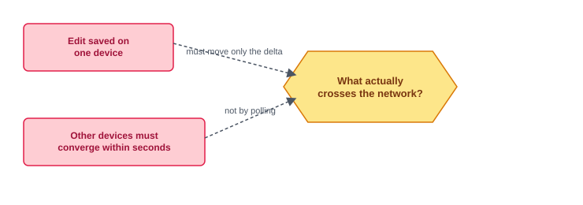

> **Key idea.** This is a sync problem, not a storage problem — the bytes are the large, easy half; detecting the delta, propagating it fast, and reconciling concurrent edits is the hard half.

## Key concepts

This section covers the concepts needed to solve this problem — prerequisites for the design work that follows.

### Content-addressed blocks

A file is split into blocks, each named by a hash of its own bytes rather than its position in the file. Two blocks with identical content always get the same hash, anywhere, which makes an upload check trivial: send the hashes you have, and the server tells you which ones it's missing. This is the mechanism behind both delta sync (only upload blocks the server doesn't already have) and deduplication (two users' identical blocks are stored once), the same content-addressing idea covered in object storage. Cross-user dedup assumes blocks are not encrypted with per-user keys — encrypted that way, identical content produces different stored bytes, and the match disappears.

```text
File ──▶ split into blocks ──▶ hash each block ──▶ server has this hash?
                                                       ├── yes ──▶ skip, already stored
                                                       └── no  ──▶ upload block
```
This diagram is a live interactive SVG widget on the site, not a static image. It shows the probe-before-upload flow: a file is split into blocks, each hashed, and only blocks the server doesn't already have are uploaded.

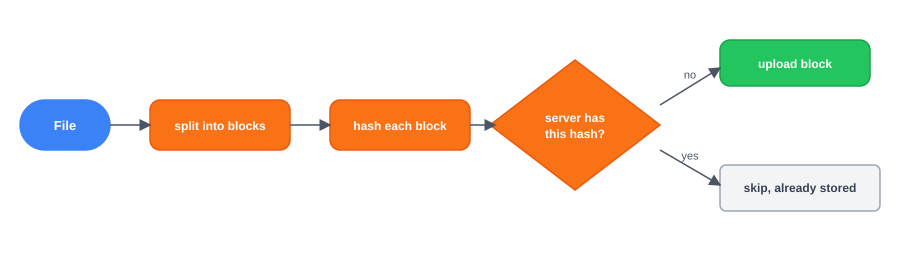

### The metadata service as authority

While block bytes are immutable and can live anywhere, something has to own the single question "what is the current version of this file?" — and answer it the same way for every device, every time. A metadata service is that authority: it tracks each file's version history and commits a new version atomically; because every device asks this one authority rather than a stale copy, "current" never means two different things to two devices at once.

### Versions, not overwrites

Each save produces a new version — an ordered list of block hashes plus a pointer to the version it was edited from (its `parent_version`) — rather than mutating a file in place. Keeping that lineage is what makes it possible to detect, later, whether two devices edited from the same starting point or from two different ones.

```text
                     ┌──▶ V2  (parent = V1, edit from device A)
V1 (base version) ───┤
                     └──▶ V2b (parent = V1, edit from device B)
```
This diagram is a live interactive SVG widget on the site, not a static image. It shows version lineage: two children of V1 from concurrent edits on different devices, detectable because both share the same parent version.

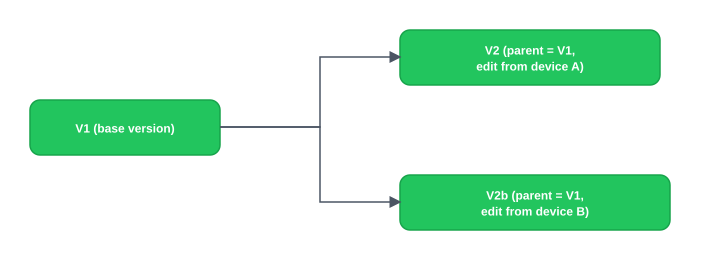

### Push notification with a poll fallback

A device that just committed a change needs every other device watching that folder to find out within seconds, not by asking on a timer. A lightweight, payload-free notification — "namespace N changed" — pushed over a persistent connection is enough to trigger a device to go pull the actual delta. Because the notification carries no data and the metadata service remains the authority regardless, a dropped notification is not a correctness problem: a periodic background poll catches anything a missed push didn't, so a failure makes sync slower, never wrong.

```text
Commit lands ──▶ push nudge ──▶ Persistent connection ──┬── delivered ──▶ Device pulls delta
                                                          └── dropped ──▶ missed ──▶ caught by Periodic poll ──▶ Device pulls delta
```
This diagram is a live interactive SVG widget on the site, not a static image. It shows push notification with a poll fallback: a delivered nudge triggers an immediate pull, while a dropped nudge is caught by a periodic background poll.

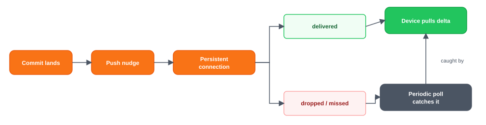

> **Key idea.** Content-addressed blocks make delta sync and dedup the same mechanism; the metadata service is the single authority on "current version," never the block store; versions form a lineage a conflict check can reason about; and push notification is a fast, best-effort trigger sitting on top of a poll fallback that's always correct.

## 1. Requirements

> **Before reading on.** Name three functional and three non-functional requirements, then name the one resource you would size first. If it's raw storage, look again — the bytes are the bulk, easy half.

### 1.1 Functional requirements

- **Sync a change.** An edit (create, modify, move, delete) on one device propagates to every other device holding that namespace.
- **Upload and download files**, including large ones, over unreliable networks, with resume.
- **Move only the delta.** A small edit to a large file transfers only the changed blocks.
- **Resolve concurrent edits.** Two devices editing the same file must never silently lose data.

### 1.2 Non-functional requirements

- **Low sync latency.** A change should appear on other devices within seconds — this is what drives push notification.
- **Metadata consistency.** Every device converges on the same current version; the metadata service is the single authority that orders changes.
- **Durability.** An uploaded block, and a committed version, are never lost.
- **Availability and graceful degradation.** If notification is down, sync falls back to periodic polling — slower, still correct.
- **Efficiency.** Minimize bytes moved (delta sync plus dedup) and metadata round-trips per save.

### 1.3 The constraint versus the property

The property never to compromise is metadata consistency: every device must converge on the same current version, with no silent divergence. The constraint that drives the design is that this has to hold while moving the minimum possible bytes and notifying devices within seconds — which is why the architecture splits sharply into a tiny, hot, authoritative metadata path and a huge, cold, content-addressed block path.

> **Key idea.** Metadata consistency is the property that can't bend; doing that cheaply, fast, and with minimal bytes moved is the constraint that splits the design into a metadata path and a block path.

## 2. Back-of-the-envelope estimation

**Interactive estimation widget (default inputs):**

| Input | Default |
|---|---|
| Active users | 100M |
| Storage / user | 50GB |
| Dedup retention rate | 60% |
| Metadata ops / user / min | 10 |

**Computed outputs:**

| Output | Value | Formula shown |
|---|---|---|
| Raw storage | 5.0 EB | 100M × 50GB |
| Stored after dedup | 3.0 EB | 60% retained |
| Metadata ops / sec | 17M/s | 100M × 10/min ÷ 60 |

What's on the hot path: **metadata**, not the exabytes of blob storage — metadata ops = 100M × 10/min ÷ 60 ≈ 17M/s, millions/sec even though storage is exabytes. Storage is exabytes, but it sits off the latency-critical path. The metadata and notification path — millions of small operations a second — is what the architecture is actually built around.

### 2.1 Raw storage, and what dedup buys back

Assume roughly 0.1 billion active users storing about 50 GB each: `0.1B × 50GB = 5 billion GB`, or 5 exabytes, raw. Deduplication — shared blocks stored once — cuts actually-stored bytes below that raw figure. The ratio depends on how much content users' files share: an OS install image or a common media file overlaps completely, while most personal documents overlap not at all. Treat the raw number as the upper bound and dedup as a variable discount on it, not a fixed fraction.

### 2.2 The metadata rate is what's hot

Assume roughly 10 metadata operations per active user per minute (version checks, cursor reads, commits): `0.1B × 10 = 1 billion` operations a minute, or `1B ÷ 60 ≈ 17 million` operations a second.

### 2.3 Bytes are the bulk; metadata is the center

Storage measures in exabytes, but it's write-once and off the latency-critical path. The metadata and notification path, at millions of operations a second, is small per-operation but sits on every single save — that's the hot center of the design.

> **Key idea.** Exabytes of block storage are the bulk, easy half; millions of metadata operations a second are the small, hot center the architecture is actually built around.

## 3. API design

**Design checkpoint widget:** *"The client wants to upload a changed file without sending bytes the server already has. What must the API let it ask before uploading anything?"* Options presented: (a) *Just upload the whole file and let the server dedup on its end*; (b) *Ask the server which content hashes it's missing, before sending any bytes*. (Correct: option (b), confirmed by the probe endpoint below.)

### 3.1 Check which blocks are missing

`POST /v1/namespaces/{id}/blocks:probe`

**Request & response (expanded):**

Request body:
```
{
  hashes: [h1, h2, ...]
}
```
Response body:
```
{
  missing: [h2, ...]
}
```

### 3.2 Upload a block

`PUT /v1/blocks/{hash}`

**Request & response (expanded):**

Request body: `<block bytes>`

Response body: `200 OK`

Content-addressed and idempotent — uploading the same hash twice stores nothing new, though the server still verifies the bytes match the hash.

### 3.3 Commit a new version

`POST /v1/namespaces/{id}/commit`

**Request & response (expanded):**

Request body:
```
{
  path,
  parent_version,
  block_hashes: [...]
}
```
Response body: `{ version } | 409 conflict`

The transactional heart of the design. `parent_version` is what lets the server detect a concurrent edit, covered in the conflict resolution deep dive.

### 3.4 Catch up on missed changes

`GET /v1/namespaces/{id}/changes?cursor=C`

**Request & response (expanded):**

Response body:
```
{
  changes: [...],
  next_cursor
}
```

### 3.5 Watch for changes

`GET /v1/namespaces/{id}/subscribe`

**Request & response (expanded):**

Response body: `{ changed: true }` (long-poll / WebSocket)

Carries no file data — a nudge that triggers the client to call `changes` next.

> **Key idea.** Probe-before-upload makes delta sync explicit at the API level; commit is the one transactional write in the whole surface; subscribe is a payload-free nudge, not a data channel.

## 4. Data model

### 4.1 Block

Bytes, named by content.

```
Block
string content_hash
int size
```

### 4.2 Version

An ordered list of blocks, with a pointer to what it was edited from.

```
Version
string version_id
string file_id
string parent_version
string[] block_hashes
timestamp created_at
```

### 4.3 File and namespace

```
File
string file_id
string namespace_id
string path
int size
string owner_id
timestamp updated_at

Namespace
string namespace_id
string owner_id
enum type
```

### 4.4 Change log and cursor

```
Change
string namespace_id
int seq
string file_id
string version_id

Cursor
string user_id
string device_id
string namespace_id
int last_seq
```

The ordered, monotonic `seq` per namespace is what a device's cursor tracks — "give me everything since the seq I last saw."

### 4.5 Where each entity lives

```text
Namespace (namespace_id) ──1:*──▶ File (file_id, namespace_id) ──1:*──▶ Version (version_id, file_id, block_hashes)
```
This diagram is a live interactive SVG widget on the site, not a static image. It shows the entity relationships: a namespace has many files, and each file has many versions.

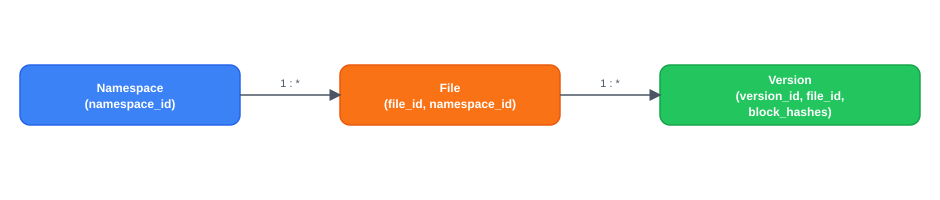

`File`, `Version`, `Namespace`, `Change`, and `Cursor` are small, structured, mutable rows in the metadata store. Block bytes live in a huge, immutable, write-once block store, keyed by hash. The two stores have opposite characters on purpose: metadata is small and hot; blocks are enormous and cold.

> **Key idea.** A file needs blocks (large, unchanging bytes); blocks need versions (ordered, non-overwriting lineage); versions need a change log and cursor (so a device can catch up from wherever it left off) — each entity forced by the one before it.

## 5. High-level design

> **Before reading on.** You already have content-addressed blocks, the metadata authority, versions, and push-with-poll-fallback from Key concepts. Predict the services: who holds the bytes, who owns ordering, who tells a device something changed, and who catches a collision?

> **Reading the diagrams.** Each step marks the components newly added at that step with a dashed outline and a **NEW** badge, so you can see what changed from the step before.

### 5.1 One server, whole files

Start naive: a single server stores complete files. A device uploads the whole file on every save; other devices download the whole file to get the update.

```text
Device A ──(whole file)──▶ Single server ──▶ Disk
                                │
                          (whole file)
                                ▼
                            Device B
```
This diagram is a live interactive SVG widget on the site, not a static image. It shows step 0: the naive design, a single server storing whole files, uploaded and downloaded in full on every save.

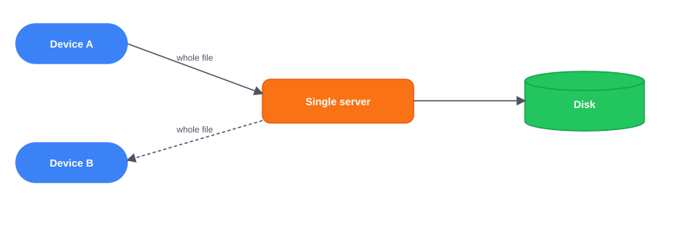

Four things break this.

- Every save re-uploads the entire file, wasting bandwidth on a one-paragraph edit to a large document.
- One disk can't hold every user's files, and nothing owns which version is current.
- Devices only learn of changes by polling — laggy if infrequent, wasteful if frequent.
- Two devices editing concurrently and both uploading their whole file: the second overwrite silently destroys the first edit.

### 5.2 Fix 1: client-side chunking and a content-addressed block store

Clients split files into blocks, hash them, and probe the server for which hashes are missing before uploading only those.

```text
Client ──(probe hashes)──▶ Metadata service [NEW] ──(missing hashes)──▶ Client ──(upload only missing blocks)──▶ Block store [NEW] (content-addressed)
```
This diagram is a live interactive SVG widget on the site, not a static image. It shows step 1: client-side chunking and a content-addressed block store — the client probes for missing hashes and uploads only those blocks.

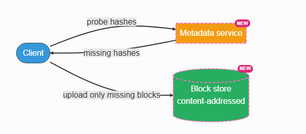

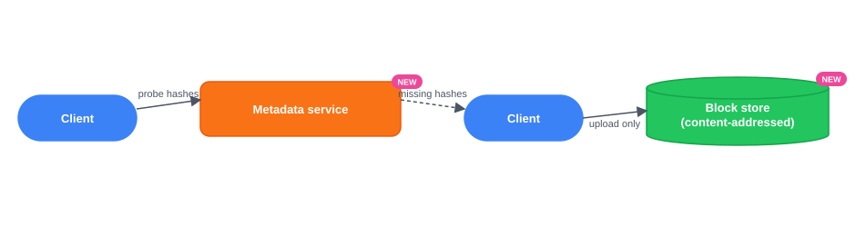

Whole-file re-uploads are fixed. Nothing yet owns which version is current, and devices still don't learn of changes fast.

### 5.3 Fix 2: a metadata service as the authority

A sharded, transactional metadata service tracks each namespace's file tree, current versions, and change log, and commits new versions atomically.

```text
Client ──(commit)──▶ Metadata service [NEW] ──▶ Metadata store [NEW] (sharded by namespace)
```
This diagram is a live interactive SVG widget on the site, not a static image. It shows step 2: a metadata service as the authority, committing new versions into a metadata store sharded by namespace.

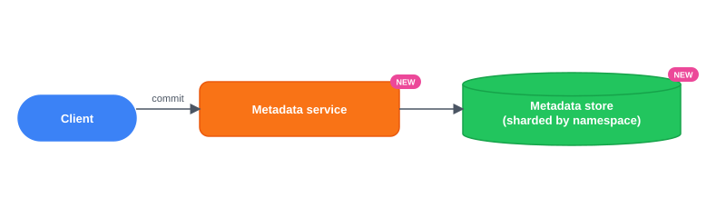

There's now one authoritative current version. Other devices still don't learn about it quickly, and concurrent edits are still unresolved.

### 5.4 Fix 3: a notification service

Devices hold a long-poll or WebSocket connection; when the change log advances, the notification service pushes a payload-free "namespace changed" nudge, and the device pulls the actual delta.


Devices learn about changes within seconds. Two devices committing from the same starting version still silently overwrite each other.

### 5.5 Fix 4: conflict detection at commit

Each commit names its `parent_version`. The metadata service checks, in the same transaction as the commit, whether the file's current version still equals that parent — a mismatch means someone else committed first.

```text
Commit, parent_version=V1 ──▶ current version = V1? [NEW] ──┬── yes ──▶ new version accepted
                                                              └── no  ──▶ conflicted copy created
```
This diagram is a live interactive SVG widget on the site, not a static image. It shows step 4: conflict detection at commit — the metadata service checks the current version against the commit's stated parent version.

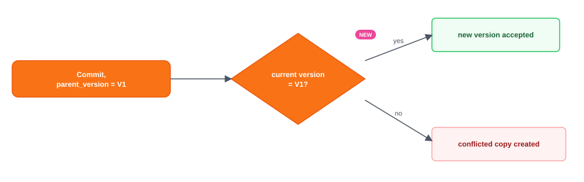

### 5.6 The composed design
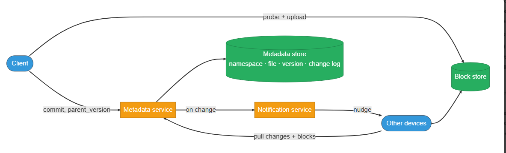

Each fix answers one failure of the naive version: chunking fixes whole-file waste, the metadata service fixes ownerless versions, notification fixes slow discovery, and parent-version checking fixes silent conflict loss.

> **Key idea.** Every component traces to one concrete failure — whole-file waste, ownerless versions, slow discovery, silent overwrite — not a pre-known architecture diagram.

## 6. Deep dives

### 6.1 Delta sync: moving only what changed

> **Before reading on.** You split a file into fixed-size blocks and upload the changed ones. The user inserts one byte at the front of the file. What happens to your blocks, and how do you avoid re-uploading the whole thing?

Fixed-size blocks work well for in-place edits — a byte changed in the middle only touches the block containing it. But insert one byte at the very front, and every fixed-size boundary downstream slides by one byte: every block's contents shift, every block gets a new hash, and the delta is the entire file.

**Interactive chunking-demo widget** (tabs: Fixed-size blocks / Content-defined chunking; controls "Play" / "Step" / "Reset"): shows an original file chunked into pieces (example blocks shown: "the-q" / "uick-" / "brown" / "-fox-" / "jumps"); stepping through an insertion at the front of the file on the fixed-size tab shifts every subsequent block boundary (all blocks get new hashes, full re-upload), while the content-defined-chunking tab keeps unaffected boundaries in the same place (only the block(s) touching the insertion point get new hashes).

Content-defined chunking fixes this by picking boundaries from the content itself — a rolling hash over a sliding window finds the same natural boundary points regardless of where they now sit in the byte stream. An insertion shifts where a boundary falls, but the block contents on either side of unaffected boundaries stay byte-identical to before, so their hashes don't change and they're never re-uploaded. Using a strong content hash for block identity is what makes this safe: two genuinely different blocks colliding on the same hash has to be astronomically unlikely, or content-addressing stops being trustworthy as identity.

On the client, a local block-state database avoids rehashing an entire file on every save, small files get batched together, and downloaded blocks are verified against their hash before being trusted. Chunking is also what makes an interrupted upload resumable: if a connection drops halfway through a large file, the client re-runs the probe step on reconnect — blocks that already made it to the server come back as "not missing" and are skipped, so only the blocks that never landed get retried. What to monitor: bytes-uploaded per byte-changed, which should stay low and stable for small edits — a sustained rise means chunking is failing to find blocks it should be reusing.

**Delta sync: how it's graded**
- **Bad** — Fixed-size blocks, no handling of insertions
- **Good** — Content-defined chunking, strong hash, resumable uploads
- **Great** — Local diff state, batching, verified downloads, a regression metric

### 6.2 Conflict resolution for concurrent edits

> **Before reading on.** Two devices both edit the same file while offline, then both come online and commit. The server cannot merge whole files. What does each device end up seeing, and how does the server decide?

**Design checkpoint widget:** *"Why compare parent_version against the current version instead of comparing wall-clock timestamps on the two commits?"* Options: (a) *Timestamps are simpler and usually accurate enough*; (b) *Logical versions are immune to clock skew across devices, so the comparison is deterministic regardless of clock drift*. (Correct: option (b), confirmed by the surrounding text.)

Whole-file sync has no general way to merge two divergent byte streams — that needs operation-level history, the approach Google Docs takes. The safe resolution here is to keep both: whichever commit the metadata service's transaction sees first becomes the file's next version, and the other is written as a separate conflicted copy rather than silently discarded.

The check compares the committed `parent_version` against the file's actual current version — not wall-clock timestamps. Logical versions are immune to clock skew across devices; wall-clock comparison would let a device with a fast clock silently win over one with a slow clock, regardless of which edit actually happened first in the transaction's own view. The same mechanism handles an edit racing a delete (the file resurrects as a conflicted copy) and arbitrarily long offline periods (the version check doesn't care how much time passed, only whether the parent still matches).

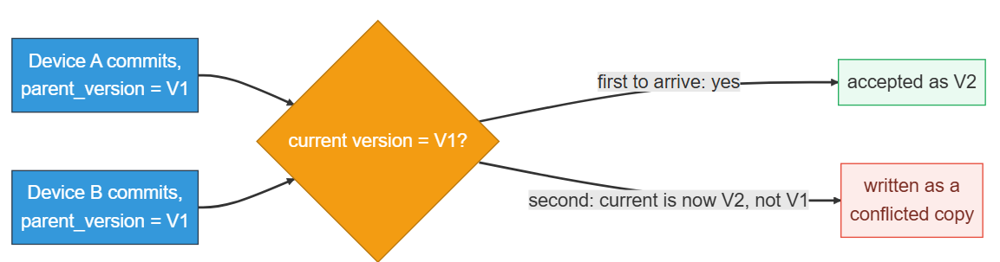

**Conflict resolution: how it's graded**
- **Bad** — Last-write-wins by timestamp
- **Good** — Parent-version check, conflicted copy on mismatch
- **Great** — Transaction-level atomicity, file-id reconciliation, treats silent overwrites as an alarm

### 6.3 Change notification at scale

> **Before reading on.** Hundreds of millions of devices each want to know the instant their namespace changes, but almost nothing changes most of the time. How do you deliver near-instant notifications without hammering the metadata store?

Each device holds a persistent long-poll or WebSocket connection, registering the namespaces it cares about. On a commit, the metadata service signals the notification service, which pushes a lightweight nudge — no file data, just "namespace N changed" — to every registered device. The device then calls the `changes` endpoint to pull the actual delta.

Because the nudge carries no payload and the metadata store remains the authority regardless of whether the nudge arrives, the whole notification path can be best-effort: a dropped nudge is caught by a periodic background poll, so correctness never depends on delivery, only latency does. The steady-state scaling constraint is the sheer number of idle connections — hundreds of millions of them — rather than message throughput, since almost nothing changes most of the time. A large shared namespace is the dangerous case: one commit can fan out to thousands of subscribed devices simultaneously, which then all pull changes and fetch blocks at once. Coalescing rapid commits into a single nudge, jittering the resulting pull requests across time, and serving immutable blocks from a cache absorb that thundering herd. What to monitor: end-to-end sync lag (commit to visibility elsewhere), connection count and churn, fan-out magnitude per commit, and how often clients fall back to polling — a spike in the last one signals the notification path itself is failing.

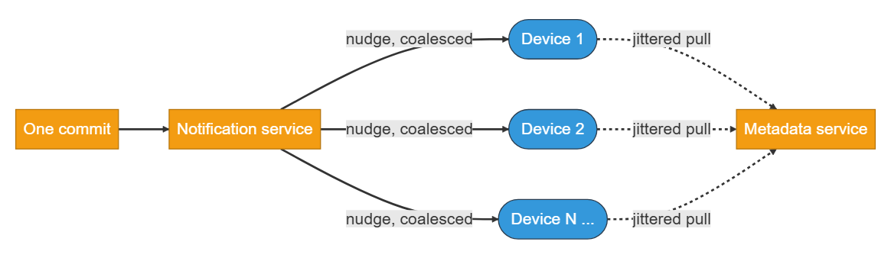
**Change notification at scale: how it's graded**
- **Bad** — Every device polls the metadata store on a timer
- **Good** — Push with a payload-free nudge and polling fallback
- **Great** — Best-effort by design, connection count as the real cost, fan-out mitigated

### 6.4 Scaling the metadata store

> **Before reading on.** The metadata store must serve millions of operations a second and be the authority on ordering. Partition it wrong and you either lose ordering or create a hot shard. What's the natural partition key?

The hot operations — "what changed in this namespace since seq C" and "commit the next version" — are both scoped to one namespace. Sharding by `namespace_id` co-locates a namespace's files, versions, and change log on a single shard, and that shard can act as the single writer that assigns the next monotonic `seq`. The shard is replicated behind one leader, which serves both commits and the reads that check them. That single-writer property is what makes per-namespace ordering — and the conflict check that depends on it — linearizable: every device sees commits in the same order, with no ambiguity about which came first, and no cross-shard coordination is needed.

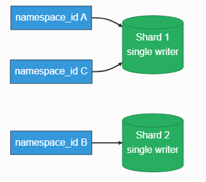

A hot namespace (heavy shared-folder traffic) is handled by keeping the commit transaction lean — touching only that namespace's own rows — and caching read-heavy items like current version lists, since reads vastly outnumber writes. Moving a file between two namespaces is a genuinely cross-shard operation and needs a saga, since it can't be a single atomic write anymore. The metadata store's commit path deliberately chooses consistency over availability: a commit must see the true current version to detect a conflict, so under a network partition this design rejects the commit rather than risk a silent fork. The block store and notification path make the opposite choice — blocks are immutable and notifications are best-effort, so both favor availability.

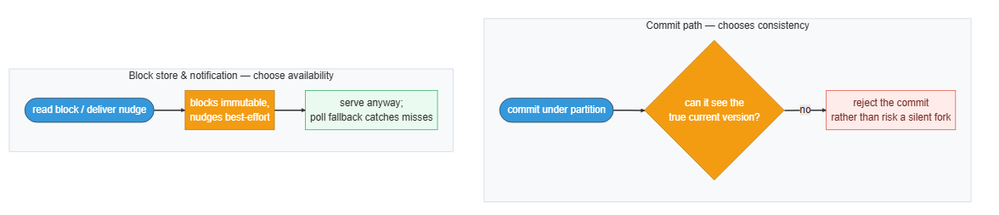

**Scaling the metadata store: how it's graded**
- **Bad** — One database, or sharded by user
- **Good** — Shard by namespace, single writer per shard
- **Great** — Read caching, cross-namespace as a saga, explicit CAP stance

> **Key idea.** Content-defined chunking keeps an insertion's cost local instead of re-uploading the whole file; parent-version comparison resolves a conflict deterministically without merging; notification is best-effort because the metadata store is always the fallback; and sharding by namespace makes per-namespace ordering linearizable without cross-shard coordination.

## 7. Variants

**10× scale.** Ten times the users and devices means roughly ten times the metadata operations and ten times the idle connections — the architecture doesn't change shape, but shard count, notification infrastructure, and read-side caching all scale up with it. Block storage grows near-linearly with bytes, and a larger user base only improves dedup's payoff. The metadata and notification layer stays the persistent bottleneck to watch.

**A large shared namespace.** Thousands of users sharing one folder concentrates fan-out on a single commit — the exact scenario the notification deep dive's coalescing and jittering exist for. If one namespace's traffic exceeds what a single shard can serve, sub-partitioning that namespace becomes necessary, trading some of the single-writer simplicity for more capacity.

**Selective sync and offline.** Selective sync means a device subscribes to and materializes only some folders locally, while still tracking metadata for the rest so the overall tree stays complete and consistent. Longer offline periods increase how often conflicted copies occur, but the resolution mechanism itself doesn't change — the parent-version check works identically no matter how much time passed.

> **Key idea.** The architecture holds at 10× scale by scaling shard count and connections proportionally; a large shared namespace stresses the exact fan-out problem notification already solves; and offline duration only changes how often conflicts happen, never how they're resolved.

## 8. The transferable pattern

Dropbox splits into an immutable, content-addressed block store — the bulk, easy half — and a small, mutable, authoritative metadata log every device reconciles against. Whenever many clients must converge on shared mutable state, the same shape repeats: name data by its content so unchanged parts are free to skip, keep an ordered per-partition change log as the single source of truth, push a cheap "something changed" nudge, and pull the actual delta. Git, database replication, and collaborative editors follow this same shape at different levels of granularity — Dropbox syncs whole-file versions and resolves collisions with a conflicted copy, while an editor working at keystroke granularity can merge instead. Detect the change, move only the delta, reconcile against an authoritative log: that's the shape underneath "sync across all your devices."

## Review: the 30-second answer

- This is a sync problem before it's a storage problem — the bytes are the large, easy half.
- Content-addressed blocks make delta sync and deduplication the same mechanism: hash first, upload only what's missing.
- A metadata service is the single authority on the current version of every file; nothing else decides that.
- A notification service pushes "your namespace changed" for near-instant sync, backed by a poll fallback that's always correct.
- Concurrent edits resolve to a conflicted copy rather than a silent overwrite — checked by comparing versions, not timestamps.

## Quiz

**Dropbox Design Quiz widget** ("Hide All" / "Reveal All" toggle) — 5 questions, each with a "Show/Hide Answer" button. Full text of every question and its revealed answer:

**1) Why is this fundamentally a sync problem rather than a storage problem?**
Storing files is the easy, static half — bytes are large but rarely change once written. The hard part is detecting exactly what changed on a save, moving only that delta, and keeping every device converged on the same current version even under concurrent and offline edits. The architecture is built around that sync engine; storage capacity is a secondary concern by comparison.

**2) A user inserts one byte at the front of a large file. Why does fixed-size block chunking re-upload the whole file, and what fixes it?**
Fixed-size blocks sit at fixed byte offsets, so inserting one byte shifts every later boundary by one position — every downstream block's contents change, giving every block a new hash and forcing a full re-upload. Content-defined chunking picks boundaries from the content itself via a rolling hash, so the boundary points move with the content rather than staying at fixed offsets; only the block(s) immediately around the insertion change, and everything else keeps its original hash.

**3) Why does the metadata service compare parent_version rather than timestamps when detecting a conflicting commit?**
Device clocks are never perfectly synchronized, so comparing wall-clock timestamps could let a device with a faster clock incorrectly "win" a conflict it should have lost. Comparing the commit's stated parent_version against the file's actual current version, inside the same transaction as the commit, is deterministic and immune to clock skew — whichever commit the transaction processes first is unambiguously the winner.

**4) Why can the change-notification path be entirely best-effort, when the metadata service itself cannot be?**
The notification carries no file data — it's just a trigger telling a device to go pull the real delta from the metadata service, which remains the single source of truth regardless of whether any given nudge arrives. A dropped notification only delays when a device notices a change; a periodic background poll catches it eventually, so correctness never depends on the notification path succeeding, only latency does. The metadata service can't have that same tolerance because it's the actual authority on what the current version is.

**5) Why does sharding the metadata store by namespace_id, rather than by user_id, make per-namespace ordering possible without cross-shard coordination?**
The hot operations — checking recent changes and committing the next version — are both scoped to a single namespace, so co-locating a namespace's files, versions, and change log on one shard lets that shard act as the sole writer assigning the next sequence number. Sharding by user_id instead would scatter a shared folder's data across multiple users' shards, forcing a distributed transaction just to maintain a single ordered sequence for that folder.

## Sources and further reading

- [The Rsync Algorithm — Andrew Tridgell & Paul Mackerras](https://www.samba.org/~tridge/phd_thesis.pdf) — the rolling-checksum technique behind detecting which parts of a file changed without transferring the whole thing, the same idea content-defined chunking builds on.

---

