# Design Google Docs

Source: https://systemdesignschool.io/problems/google-docs/solution

> Note on fidelity: this page is built from prose sections plus several JS-interactive widgets (an OT-vs-naive step-through simulation, design-checkpoint multiple-choice widgets, "What separates answers" Bad/Good/Great rating lists, and inline node/arrow diagrams) rather than static images. Every widget's full content — including the transform step-through's states and the diagrams' box/arrow labels — has been transcribed below as text, in the same order it appears on the site. All 5 "Show Answer" quiz reveals were clicked open in a live browser and their full text captured. The site has no downloadable diagram image files (they're rendered live by JS/SVG, not `` files) — so the 17 diagrams below have instead been recreated as standalone SVG images (`images/d01`–`d17`), redrawn from screenshots of the live page to match its box shapes, colors, and layout, and are embedded inline next to each diagram's original text transcription.

Tags: Hard · Consistency · Real-time · Async processing

---

## Problem statement

Design a collaborative document editor: many people open the same document and type into it at once, every keystroke shows up for the others within a moment, and everyone's screen converges to the identical text with no edit ever silently lost.

In scope: concurrent text editing, real-time propagation of edits, presence (cursors and selections), and reconnecting after being offline. Rich formatting beyond plain text, sharing permissions, and peer-to-peer editing without a server are variants, covered briefly at the end.

## Clarifying questions

Each answer fixes an assumption the design leans on.

- **One shared document edited concurrently, or file storage?** The hard part is many cursors in one document at once, not storing bytes.
- **How many concurrent editors per document?** A handful of active typists is the norm, not thousands.
- **Rich text and media, or plain text?** Model plain-text insert and delete as the core; rich formatting is a variant.
- **Offline editing?** Yes — a client may edit while disconnected and reconcile on reconnect.
- **Permissions and sharing?** Access-control lists gate who can open a document, but that's orthogonal to this design.
- **How strong must convergence be?** Non-negotiable — every editor must end at the identical document, with no lost keystroke.

## What makes this problem distinctive

Two people type into the same document at the same instant. If each edit is a whole-document write, the second one clobbers the first — a lost update, where the row every write contends on is the entire document, and the two writers are people watching their own screen in real time.

The core of the problem is convergence, not storage or scale: making concurrent edits converge is the mechanism every other requirement builds on. Live propagation, presence, and offline reconciliation all assume that two people typing at the same moment each keep their intent and both end up looking at the identical text.

```text
Editor A inserts (at the same instant) ──must preserve intent──▶ How do concurrent edits converge? ◀──must preserve intent── Editor B deletes (at the same instant)
```
This diagram is a live interactive SVG widget on the site, not a static image. It frames the central question: two simultaneous edits from different editors must both preserve their author's intent while converging to the same result.

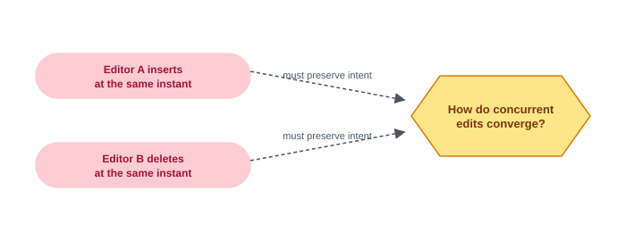

> **Key idea.** Convergence — every editor ending at the identical text with no lost keystroke — is not one requirement among several here; it is the entire design problem, and everything else builds on the mechanism that guarantees it.

## Key concepts

This section covers the concepts needed to solve this problem — prerequisites for the design work that follows.

### Edits as operations, not document snapshots

Instead of treating a save as "here is the whole new text," each edit is a small **operation** — `insert(position, text)` or `delete(position, length)` — describing exactly what changed. Two people editing at once can both have their operations recorded and reasoned about individually, which is impossible once an edit collapses into "replace the whole document with this."

```text
Edits as operations:
  A: insert at position 0 ─┐
  B: delete at position 2  ─┴──▶ both edits recorded, reconcilable individually

Whole-document writes:
  Editor A saves whole text ──┐
  Editor B saves whole text ──┴──▶ stored document ──▶ second save erases the first (a lost update)
```
These diagrams are live interactive SVG widgets on the site, not static images. They contrast recording edits as individually reconcilable operations against whole-document writes, where the second save silently clobbers the first.

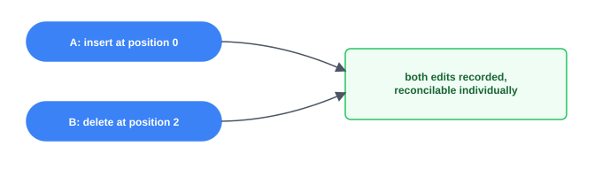

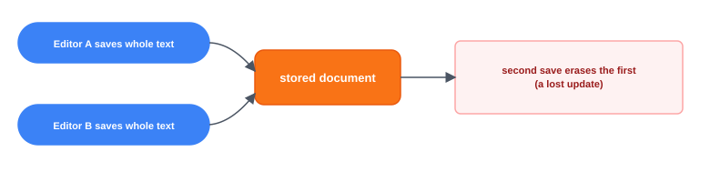

### Operational Transformation (OT)

An operation is authored against the document state its author last saw. If other operations commit in between, applying the original operation as-written can target the wrong position — the classic case is a delete meant to remove one character ending up removing its neighbor instead, because an intervening insert shifted everything after it. **Operational Transformation** is a family of functions, one per pair of operation types, that rewrite an incoming operation to account for what changed underneath it, so it still expresses its author's original intent when applied to the current state. That guarantee is only as good as the transform functions themselves — each operation-type pair must be carefully designed and verified, including deterministic tie-breaking for ambiguous cases.

**decision flow**

```text
op, base_revision = R → "ops committed since R?" → **none** → apply as-written / **yes** → transform against each intervening op.
```

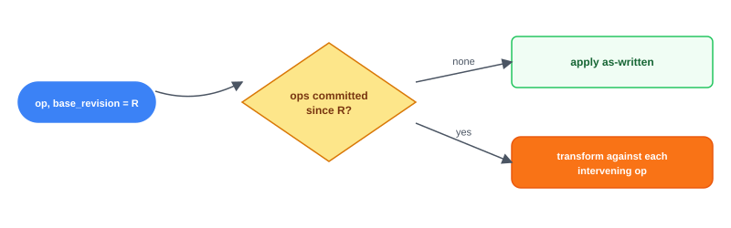

### The op log as source of truth

The authoritative record of a document is not its visible text — it's an ordered log of every committed operation, and the text is a **materialized view** produced by replaying that log from the start. A **snapshot** is a periodic checkpoint of that replay, so opening a document or recovering from a crash only has to replay operations after the most recent snapshot, not the whole history.

```text
Op log (op 1 ... op N) → replay → Visible text *(a materialized view)*
Snapshot at revision K → replay only ops after K.
```

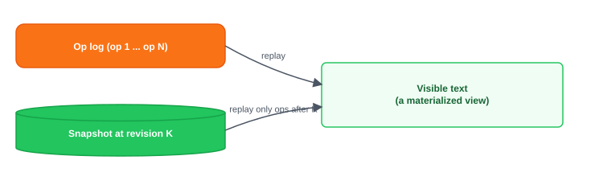

### Ephemeral presence versus durable edits

A cursor position or a text selection needs to reach other editors fast, but losing one costs nothing — the next update replaces it. An edit can never be lost. This is the same [durable-versus-ephemeral split](https://systemdesignschool.io/problems/chatapp/solution) a real-time chat system makes: presence rides the live connection and is never written to the durable log; edits are persisted before they're ever acknowledged.

> **Key idea.** Operations, not snapshots, are what gets recorded and reasoned about; Operational Transformation rewrites an operation so it keeps its author's intent after concurrent changes; the visible document is a replay of an ordered op log, not a stored value; and presence is ephemeral where edits are durable.

## 1. Requirements

> **Before reading on.** Name three functional and three non-functional requirements, then name the one property you would never compromise.

### 1.1 Functional requirements

- **Open and join a document** — load its current text and start receiving others' edits live.
- **Edit concurrently** — many people insert and delete in the same document at once.
- **Converge** — all editors' screens end at the identical text, regardless of edit order or timing.
- **Presence** — see who else is here, and where their cursors and selections are.

### 1.2 Non-functional requirements

- **Convergence with no lost update.** The non-negotiable property: no keystroke is silently dropped, and every editor ends identical.
- **Low-latency propagation.** Others see a keystroke within tens of milliseconds; typing must feel local.
- **Durability.** An acknowledged edit survives a server crash — the op log is persisted before the edit is confirmed.
- **Availability.** Editing continues through component failure; a reconnecting client resyncs.
- **Scale.** Many concurrent editing sessions across a large number of documents; the load is live connections and edit fan-out, and bytes are cheap.

### 1.3 The constraint versus the property

The property never to compromise is **convergence**: every editor ends at the identical text, with no keystroke silently lost. The constraint that drives the design is doing this within tens of milliseconds, for concurrent edits arriving in any order — which is why the design centers on a mechanism (Operational Transformation) that reconciles intent after the fact, rather than trying to prevent concurrent edits from happening at all.

> **Key idea.** Convergence is the property that can't bend; reconciling concurrent edits fast enough to feel instant is the constraint the rest of the design answers.

## 2. Back-of-the-envelope estimation

| Input / Output | Value |
|---|---|
| Concurrent editors | 10M |
| Connections / gateway | 100K |
| Live documents | 1.0M |
| Ops / doc / sec | 5/s |
| Avg editors / document (fan-out) | 3× |
| Gateway servers needed | 100 *(10M editors ÷ 100K/gateway)* |
| Ops entering the system / sec | 5.0M/s *(1.0M docs × 5/s)* |
| Op-deliveries / sec (after fan-out) | 15M/s *(5.0M × 3× fan-out)* |

**What's cheap:** the bytes — an op is a position and a few characters. deliveries = 5.0M/s × 3× fan-out ≈ 15M/s — this, not storage, is what scales.

A single op is tiny — a position and a character. The load that matters is live connections and fan-out: one committed op multiplied by every other editor watching that document.

### 2.1 Connections, not storage, set the gateway count

Assume roughly 10 million concurrent editors, each holding a persistent connection, and about 100,000 connections per gateway server: `10,000,000 ÷ 100,000 = 100` gateway servers.

### 2.2 Ops entering the system

Assume roughly 1 million live documents, each seeing about 5 operations a second: `1,000,000 × 5 = 5,000,000` operations a second entering the system.

### 2.3 Fan-out multiplies it

Each operation is delivered to every other editor of that document — say 3 on average: `5,000,000 × 3 = 15,000,000` op-deliveries a second. Op log writes run at roughly 50 bytes an operation, about 250 MB/second. The append rate tracks the edit rate and can't be reduced, but periodic snapshots bound what has to be *retained*: once a snapshot covers a prefix of the log, older segments can be compacted away, and replay after a crash starts from the snapshot instead of the beginning.

> **Key idea.** Bytes are cheap here — an operation is a position and a character. Live connections and op fan-out are what actually have to scale.

## 3. API design

**Design checkpoint (multiple choice):** *"Should the API include a 'save the whole document' call for the client to PUT its current text back?"* Options: (a) *Yes — it's the simplest way to persist a document*; (b) *No — any whole-document write erases concurrent edits that landed since the client last loaded.* The design's answer, per the surrounding text, is (b) — there is no "save the document" call.

### 3.1 Open a document

`GET /v1/documents/{id}`

*(Expandable "Request & response" detail in the live UI, not expanded further here.)*

### 3.2 Submit an operation

`WS submit`

`base_revision` names the state this operation was authored against — the input the server's Operational Transformation step needs.

### 3.3 Receive committed operations and presence

`WS broadcast / presence`

Both ride the same persistent connection; only `broadcast` ever touches the durable op log.

> **Key idea.** There is no "save the document" call — only operations against a known revision — and `base_revision` is exactly what makes server-side transformation possible.

## 4. Data model

### 4.1 Document

The obvious starting entity — and the one whose `text` field turns out to be the wrong idea.

- `Document`: `string document_id`, `string title`, `string owner_id`

Storing the current text as a single mutable field is exactly what a whole-document write would clobber under concurrent edits — which is what forces the next entity.

### 4.2 Op-log entry

The record of one committed edit, in order.

- `OpLogEntry`: `string document_id`, `int revision`, `string author_id`, `string op`, `timestamp created_at`

`revision` is the total order for the document — the single sequence every client replays to reconstruct the text.

### 4.3 Snapshot

A checkpoint that bounds how much of the log ever needs replaying.

- `Snapshot`: `string document_id`, `int revision`, `string text`

### 4.4 Where each entity lives, and what's the source of truth

**ER-style**

```text
Document (`document_id`, `title`) —1:*— OpLogEntry (`document_id`, `revision`, `op`)
Document —1:*— Snapshot (`document_id`, `revision`, `text`)
```

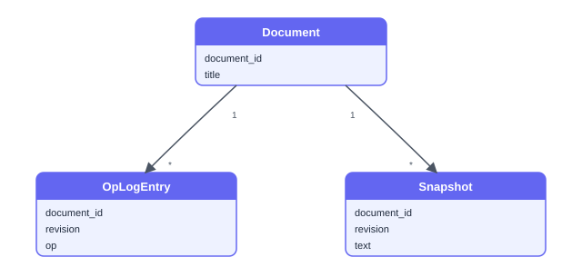

`Document` metadata is a small, rarely-changing row. `OpLogEntry` is the actual source of truth — the visible text is always a materialized view of replaying this log. `Snapshot` exists purely to bound replay cost; it can be regenerated from the log at any time and is never authoritative on its own.

> **Key idea.** The document's text is never authoritative as a stored value — the ordered op log is the source of truth, and a snapshot is a disposable, regeneratable checkpoint that bounds how far back a client ever has to replay.

## 5. High-level design

> **Before reading on.** You already have operations, Operational Transformation, the op log, and the durable/ephemeral presence split from Key concepts. Predict the services: who orders and transforms concurrent edits, who pushes a committed edit to the other editors, and what survives a crash?
> **Reading the diagrams.** Each step marks the components newly added at that step with a dashed outline and a **NEW** badge, so you can see what changed from the step before.

### 5.1 One server, apply edits as they arrive

Start naive: a single server holds the document in memory and applies each incoming edit in the order it happens to arrive.

```text
Editor A, Editor B → Single server → In-memory document
```

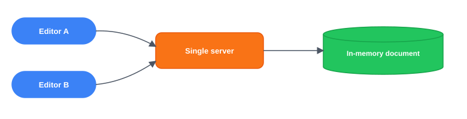

Four things break this.

- Two edits authored against the same base text, applied in arrival order with no reconciliation, diverge — each editor's intent gets corrupted by the other's concurrent change.
- Showing another editor's keystroke within tens of milliseconds needs a live push channel, not request-response.
- The in-memory document vanishes entirely if the server crashes.
- Global ordering needs one server per document, but a single global server can't hold every document in the world.

### 5.2 Fix 1: a per-document serializer with transformation

Route every operation for a document through one serializer, which assigns the next monotonic `revision` and applies Operational Transformation against anything committed since the operation's `base_revision`.

```text
Editor A, Editor B → *(op, base_revision)* → Per-document serializer **NEW** → *(transform + assign revision)* → committed op
```

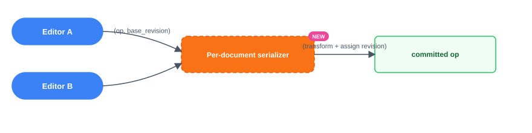

Concurrent edits now converge correctly. Editors still aren't notified within tens of milliseconds, and a crash still loses everything.

### 5.3 Fix 2: a persistent broadcast channel

A gateway fleet holds a persistent WebSocket connection per editor; the serializer broadcasts each committed operation down every connected editor's socket the moment it's committed.

```text
Serializer → *(broadcast committed op)* → Gateway fleet **NEW** → Editor A, Editor B
```

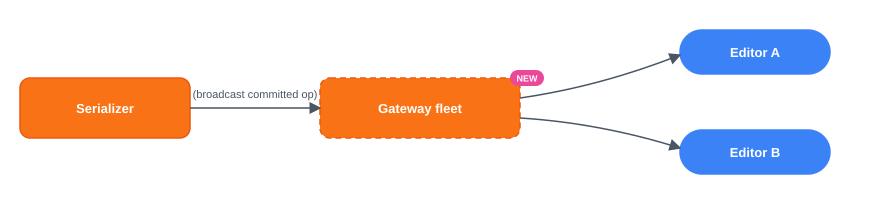

Propagation is fast. The document still lives only in memory, and one global serializer still can't scale.

### 5.4 Fix 3: a durable op log with snapshots

Before acknowledging any edit, the serializer appends it to a durable, per-document op log. A periodic snapshot captures the full text at a given revision, bounding how much of the log ever needs replaying.

```text
Serializer → *(persist before ack)* → Op log **NEW**
→ *(periodic)* → Snapshot store **NEW**
```

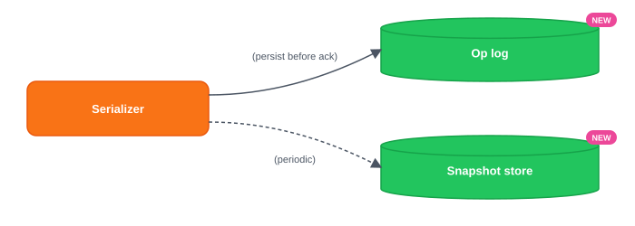

### 5.5 Fix 4: route each document to one session server

All editors of a document route to one **session server**, chosen by consistent hashing of `document_id`. Hashing only places the document; a **lease** — a time-bounded ownership claim that expires unless the owning server keeps renewing it — is what guarantees a single active owner during failures and rebalances (covered in the deep dive). Different documents live on different servers, so the system scales horizontally across independent sessions even though each individual document is still serialized through one owner.

```text
Editor A, Editor B → *(hash(document_id))* → Session server 1 **NEW** / Session server 2
```

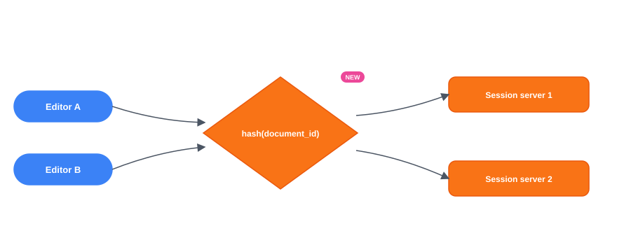

### 5.6 The composed design

**combined architecture**

```text
Editors → Gateway fleet → *(route by document_id)* → Session server *(OT + serialization)* → *(persist before ack)* → Op log
→ *(periodic)* → Snapshot store
→ *(broadcast committed op)* → back to Editors
```


Each fix answers one failure of the naive version: the per-document serializer with OT fixes divergence, the broadcast channel fixes propagation speed, the durable log with snapshots fixes crash recovery, and routing by `document_id` fixes global scale despite each document needing one owner.

> **Key idea.** Every component traces to one concrete failure — divergence, slow propagation, volatile state, and a single global bottleneck — not a pre-known architecture diagram.

## 6. Deep dives

### 6.1 Convergence: Operational Transformation versus CRDTs

> **Before reading on.** A document reads "abc". Editor A inserts "x" at position 0, intending "xabc". At the same instant, Editor B issues delete(2), intending to remove the "c". Applied naively in sequence, what goes wrong, and how does the server fix it?

**Interactive step-through widget** (tabs: "Apply as-written (naive)" / "Transform before applying (OT)"; controls "Play / Step / Reset"; state shown: document text `abc`, description "Starting document, both editors see the same text.")

Applying both operations exactly as their authors wrote them corrupts intent. The server commits A's insert first, producing "xabc". B's operation, `delete(2)`, is then applied as-written — but position 2 in "xabc" is now `b`, not `c`, because A's insertion shifted everything after it. The result is "xac": B's intent (remove the `c`) never happened, and something B never touched (the `b`) is gone instead.

Operational Transformation fixes this by rewriting B's operation against what changed underneath it before applying it. Since A's insertion landed at position 0 — before B's target position — every position from 2 onward shifts right by one, so `delete(2)` transforms into `delete(3)`. Applied to "xabc", `delete(3)` removes index 3, which is the `c`, giving "xab" — exactly what both editors intended. The mechanism generalizes to a set of transform functions, one for each pair of operation types (insert-vs-insert, insert-vs-delete, and so on), each rewriting one operation to account for a concurrent operation it didn't know about.

**Design checkpoint (multiple choice):** *"Why does OT require a central serializer per document, while a CRDT does not?"* Options: (a) *OT's transform functions only need to be correct against a linear sequence handed down by one server; without that, decentralized transform is extremely hard to get right*; (b) *OT is an older technique and CRDTs are a strict improvement.* The design's reasoning points to (a).

Relying on a single serializer per document is what keeps this tractable: each client only ever transforms an incoming operation against the linear sequence the server hands it, not against every other client's independent view. Decentralized OT — no central authority, every replica transforming against every other — needs far stronger guarantees that are hard to implement correctly in practice.

**CRDTs (Conflict-free Replicated Data Types)** take a different approach entirely: instead of numeric positions, every character gets a stable, globally unique identifier assigned once when it's inserted and never reused. Replay the same "abc" example with ids: say `a` is id1, `b` is id2, `c` is id3. A's operation is "insert `x` before id1"; B's operation is "delete id3" — not "delete position 2." Applying A's insert first gives `x,id1,id2,id3` (text "xabc"), and B's operation still says "delete id3," which is still unambiguously the character `c` no matter what got inserted elsewhere. Applying B's delete first instead gives the identical final result: id3 is gone, A's insert still lands before id1. Because operations refer to stable ids rather than positions, concurrent operations **commute**: applying them in either order produces the same result. Ties — two inserts at the same spot — break deterministically by comparing ids. Replicas that have received the same set of operations therefore converge, with no transform step and no serializer needed at all. The cost is real. Every character carries id metadata, and the in-memory representation is heavier than plain text. Deletes can't renumber the rest of the text, so most designs leave **tombstones** — markers for removed characters that linger until every replica has seen the delete and they can be safely garbage-collected.

**commutativity**

```text
Order 1: insert x before id1 (`id1,id2` "ab" → `x,id1,id2` "xab") then delete id3 → `x,id1,id2,id3` "xabc" then delete id3 = identical result. Order 2: delete id3 first, then insert x before id1 → also `x,id1,id2` "xab". Both orders converge to the same result.
```

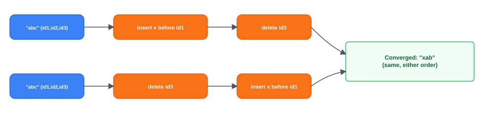

This design chooses **server-authoritative OT**, because a central session server per document is already needed for the op log, presence fan-out, and routing — the serializer OT depends on comes for free, and OT keeps the wire format tiny (just a position and a character). CRDTs earn their cost specifically where no serializer is available at all: peer-to-peer or offline-first editing, where convergence must hold without anyone imposing a central order.

**What separates answers — convergence:**
- **Bad** — Apply operations in arrival order with raw positions
- **Good** — OT with a serializer, or a CRDT — pick one and explain convergence
- **Great** — Walks the transform example, justifies OT via the existing serializer, names CRDT tradeoffs

### 6.2 The document session: ordering, the log, and failure

> **Before reading on.** The session server owning a hot document crashes with dozens of editors connected. What's lost, what's recovered, and from where?

All edits for a document funnel through its one session server, which stamps each with the next `revision` — exactly one orderer per document, so ordering itself never needs cross-node agreement in the steady state. Coordination doesn't disappear entirely, though: guaranteeing there is only ever *one* active owner across crashes and rebalances still needs a lease or leader-election mechanism, and the durable op log is itself typically a replicated store. The single orderer removes consensus from the per-edit hot path, not from the system. Durability comes from **persist-before-ack**: an operation is appended to the durable op log before the edit is ever acknowledged to its author — and "appended" here means the log has confirmed the write as durable — replicated or flushed to stable storage, not merely buffered in memory. An acknowledged edit is then, by construction, already durable.

**happy path**

```text
Editor → *(submit op, base_revision)* → Session server → *(append, before ack)* → Op log *(durable)* → *(transform against intervening ops)* → *(ack: revision, transformed_op)* → Editor
```

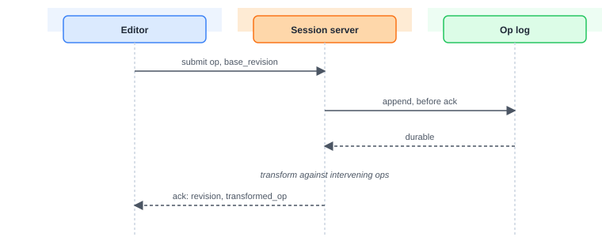

When the session server crashes, the durable log is untouched: a new server is assigned the document, loads the latest snapshot, replays only the operations committed after it, and connected editors reconnect and resync from their last known revision. The blast radius is exactly that one document's editors, for however many seconds reassignment and replay take — every other document is entirely unaffected.

**recovery path**

```text
Session server crashes → New server assigned → *(load latest)* → Snapshot at revision K → *(replay ops after K)* → Durable op log *(untouched by crash)* → Document rebuilt → *(reconnect from last revision)* → Editors resync
```

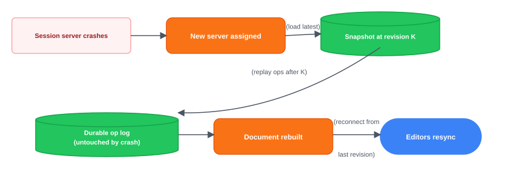

Snapshot cadence is a real tradeoff: snapshotting more often means faster reopen and recovery, at the cost of more write volume; snapshotting every N operations or every few minutes is the usual balance. What to monitor: per-document op-commit latency, the revision gap a client reports on reconnect, session-server reassignment rate, and op-log append errors.

The one hard ceiling this creates: a single document is a single serializer, so a document with an unusually large number of simultaneous editors can't be spread across multiple servers the way normal horizontal scaling would. Server-side coalescing of rapid keystrokes into fewer broadcasts, and capping interactive editors while routing the rest to a read-only, slightly-delayed view, are the practical relief valves.

**What separates answers — the document session:**
- **Bad** — In-memory only, or any server can order edits
- **Good** — One session server per document, persist-before-ack, snapshots
- **Great** — Names persist-before-ack, the snapshot-cadence tradeoff, blast radius, and the hot-document ceiling

### 6.3 Presence, cursors, and offline edits

> **Before reading on.** Two things ride the same connection as edits but must be handled oppositely: a cursor blinking as someone moves it, and a batch of edits made on a plane with no wifi. Which is disposable, and which must converge like any other edit?

A cursor position is disposable — broadcast it over the socket, hold it in memory, and never write it to the op log; losing one costs nothing because the next update replaces it. But a cursor still has to stay visually anchored to the right spot in the text as other edits land, which means cursor positions get transformed against incoming operations using the exact same machinery that transforms edit positions — without that, everyone's cursor silently drifts to the wrong place the instant text changes above it.

**Cursor update — ephemeral**

```text
cursor moves → held in memory only, never written to the op log → broadcast over the socket, transformed against edits.
```


**Offline edits — durable**

```text
ops accumulate offline against base_revision R → applied in order, appended to op log → on reconnect: transform against everything committed since R.
```

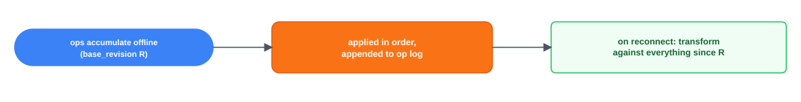

Offline edits are the opposite case: they must converge like any other edit, just after a longer gap. A disconnected client keeps accumulating operations against its last-seen `base_revision`; on reconnect, the server transforms each of them against everything committed during the absence and applies them in order — the identical transform used for two people typing concurrently online, just stretched over a longer interval. A very long offline gap is exactly where this strains: the transform backlog against a large volume of intervening changes grows heavy, which is where a CRDT's commutative merge becomes more attractive than OT's transform chain. Practical systems either cap how much offline divergence they'll reconcile automatically, or fall back to a coarser three-way merge for very large gaps, accepting that the resulting interleaving may not exactly match what a live session would have produced — while convergence itself still holds. What to monitor: cursor-drift reports, presence staleness, reconnect-resync duration, and the distribution of offline-operation batch sizes.

**What separates answers — presence, cursors, and offline edits:**
- **Bad** — Persist cursors like edits, or ignore that edits move them
- **Good** — Ephemeral presence, offline ops replay through the transform
- **Great** — Presence as a best-effort firehose, transformed cursors, and the large-gap CRDT tradeoff

> **Key idea.** The insert-versus-delete transform is the mechanism that makes concurrent edits converge without losing intent; persist-before-ack plus snapshots make a session-server crash a bounded, recoverable event rather than data loss; and presence stays ephemeral while offline edits reconcile through the same transform used for ordinary concurrency, just over a longer gap.

## 7. Variants

### 10× scale

More editors and more documents grow the gateway fleet and session servers roughly linearly, since documents are independent and shard cleanly by `document_id`. The real pressure point isn't total scale — it's a single hot document, since one serializer per document caps how many simultaneous editors it can absorb no matter how many other servers exist. Server-side operation coalescing, a read-only delayed tier beyond some interactive editor cap, and moving snapshotting off the hot path are the levers that push that ceiling higher.

### Rich text and formatting

Bold, links, and other styling become additional operation types — `format(range, attribute)` alongside insert and delete — transformed by the same machinery with a larger transform matrix (more operation-type pairs to handle), not a different mechanism. Large embedded media is stored as blobs referenced by id, kept out of the op log entirely, the same content-versus-metadata split any large-object system makes.

### Peer-to-peer / offline-first

Drop the central serializer, and the design has to shift to CRDTs — with no authority left to impose a single order, convergence can only come from commutative, id-based operations that merge correctly regardless of arrival order. The tradeoff is explicit: per-character id metadata and tombstones, in exchange for correctness with no central owner at all.

> **Key idea.** The architecture holds at 10× scale because documents shard independently; rich formatting is just more operation types through the same transform; and removing the central serializer entirely (peer-to-peer) is what actually forces a switch to CRDTs.

## 8. The transferable pattern

Collaborative editing is a durable, ordered operation log per document with a real-time transform layer on top — the same durable-log-plus-live-push shape a real-time chat system uses, with a convergence mechanism added because every write here targets the same shared item. The document is never a value you overwrite; it's a materialized view of replaying an ordered log. The same shape reappears anywhere multiple actors must converge on one shared mutable object in real time and no edit can be silently lost — shared whiteboards, live spreadsheets, and multiplayer editing of any kind.

## Review: the 30-second answer

- Never store the whole document as one overwritable value — model every edit as an insert or delete operation instead.
- Operational Transformation rewrites a concurrent operation so it keeps its author's intent after the fact, rather than preventing concurrency from happening.
- The op log is the source of truth; the visible text is a replay of it, and snapshots just bound how far back that replay has to go.
- Edits push over a persistent connection and are persisted before being acknowledged; presence rides the same connection but is purely ephemeral.
- One session server per document makes ordering and OT tractable; CRDTs are the answer specifically when no such central server exists.

## Quiz

**Google Docs Design Quiz** ("Hide All" / "Reveal All" toggle) — 5 questions, each with a "Show/Hide Answer" button. Full text of every question and its revealed answer:

**1) Why does modeling an edit as a whole-document write fail, even before considering scale?**
Two editors saving at nearly the same time each overwrite the entire document with their own version, so whichever save lands second silently erases everything the first save contributed — a lost update with no way to detect or recover it. Modeling each edit as a small operation instead lets the server reason about and reconcile two concurrent changes individually.

**2) Editor A inserts a character at the very start of a document; Editor B, at the same instant, issues a delete targeting a later position. Why does applying B's operation exactly as authored produce the wrong result, and what does Operational Transformation do about it?**
B's operation was authored against the document before A's insertion happened, so the position it names no longer refers to the same character once A's insert is applied first — every position after the insertion point has shifted. Operational Transformation rewrites B's operation to account for A's insertion (shifting B's target position accordingly) before applying it, so the transformed operation removes the character B actually intended to remove.

**3) Why does this design choose server-authoritative Operational Transformation instead of a CRDT, given that CRDTs need no central coordinator at all?**
A central session server per document is already required for other reasons — persisting the op log in order, fanning out presence, and routing editors to the right server — so the serializer that OT depends on is already present at no extra cost. OT also keeps the wire format small, just a position and a character, whereas a CRDT requires every character to carry a stable id and tombstones for deletions, overhead that only pays for itself when no central coordinator is available at all, such as peer-to-peer editing.

**4) A session server crashes while dozens of editors are connected to one document. Why does persist-before-ack mean nothing acknowledged is lost, and what does recovery actually replay?**
Because every operation is appended to the durable op log before it is ever acknowledged to its author, anything the server told an editor was committed is already safely in the log regardless of when the crash happens. Recovery loads the most recent snapshot for that document and replays only the operations committed after it — bounded by the snapshot cadence — rather than replaying the document's entire history from scratch.

**5) Why are cursor positions kept out of the durable op log, yet still passed through the same transform machinery used for edits?**
Cursor positions are disposable — losing one costs nothing, since the very next update from that editor replaces it, so writing them to a durable, ordered log would only add churn with no benefit. But a cursor still needs to stay visually anchored to the same piece of text as other edits land around it, and that anchoring is exactly what the transform machinery already computes for edit positions, so reusing it for cursors is what keeps them from silently drifting to the wrong spot.

## Sources and further reading

- [Concurrency control in groupware systems — Ellis & Gibbs, SIGMOD 1989](https://dl.acm.org/doi/10.1145/67544.66963) — the original paper introducing Operational Transformation for reconciling concurrent edits.
- [A comprehensive study of Convergent and Commutative Replicated Data Types — Shapiro, Preguiça, Baquero, Zawirski, INRIA 2011](https://inria.hal.science/inria-00555588/document) — the formal treatment of CRDTs and the commutativity property that lets replicas converge without a central coordinator.

---

### System Design Master Template (embedded video)

YouTube embed present at the bottom of the page (same "System Design Master Template" embed used across the site's problem pages).

### Comments

A "Join the Discussion" comments widget is present at the bottom of the page; no comments had been posted at scrape time (empty state, unlike the primer page which had visible comments).

---

## Assets

The live site renders every diagram on this page as a JS/SVG widget rather than a downloadable image file, so all 17 diagrams have been recreated as standalone SVG files in `images/`, redrawn to match the live page's box shapes, colors (blue = actor/editor, orange = service/process, green = store/log/success outcome, red/pink = problem or failure, amber = decision/central question, indigo = entity-relationship boxes), and layout, and embedded inline next to each diagram's text transcription above:

- `d01_convergence_question.svg` — the central "How do concurrent edits converge?" question ("What makes this problem distinctive")
- `d02_ops_as_operations.svg` — insert/delete recorded as individually reconcilable operations
- `d03_whole_document_write.svg` — whole-document writes clobbering each other (a lost update)
- `d04_ot_decision_flow.svg` — the OT decision: transform only if ops committed since `base_revision`
- `d05_op_log_replay.svg` — op log and snapshot both replaying into the visible text
- `d06_er_diagram.svg` — Document / OpLogEntry / Snapshot entity relationships
- `d07_naive.svg` — 5.1 naive Editor A, Editor B → Single server → In-memory document
- `d08_fix1_serializer.svg` — 5.2 the new per-document serializer with transform + revision assignment
- `d09_fix2_broadcast.svg` — 5.3 the new gateway fleet broadcasting committed ops
- `d10_fix3_oplog_snapshot.svg` — 5.4 the new durable op log and periodic snapshot store
- `d11_fix4_session_routing.svg` — 5.5 hashing `document_id` to route to a session server
- `d12_composed_design.svg` — 5.6 the full composed architecture
- `d13_commutativity.svg` — 6.1 CRDT commutativity: either operation order converges to the same result
- `d14_happy_path.svg` — 6.2 sequence across Editor / Session server / Op log lanes for a submitted op
- `d15_recovery_path.svg` — 6.2 session-server crash, snapshot load, replay, and editor resync
- `d16_cursor_ephemeral.svg` — 6.3 cursor updates held in memory only, never durable
- `d17_offline_durable.svg` — 6.3 offline ops reconciled through the transform on reconnect

The only real `` on the current page is the site's decorative header logo (`/logo.svg`), which carries no article content.

---
