# Design Ticketmaster

Source: https://systemdesignschool.io/problems/ticketmaster/solution

> Note on fidelity: this page is built from prose sections plus several JS-interactive widgets (a race-for-one-seat step-through simulation, design-checkpoint multiple-choice widgets, "What separates answers" Bad/Good/Great rating lists, and inline node/arrow diagrams and a sequence diagram) rather than static images. Every widget's full content — including the CAS race step-through's states and the diagrams' box/arrow labels — has been transcribed below as text, in the same order it appears on the site. All 5 "Show Answer" quiz reveals were clicked open in a live browser and their full text captured. Note: an initial fetch of this URL returned an older, out-of-date cached version of this page (a different, pre-redesign layout with real PNG screenshots and a "Pro Member Exclusive" paywall cutting off two sections); the content below is instead transcribed from the current live page loaded in-browser, which matches the same modern template used by the other problem pages in this set and has no paywall. The site itself has no downloadable diagram image files on this current version (every diagram is rendered live by JS/SVG, not an `` file) — so the 15 diagrams below have instead been recreated as standalone SVG images (`images/d01`–`d15`), redrawn from screenshots of the live page to match its box shapes, colors, and layout, and are embedded inline next to each diagram's original text transcription.

Tags: Hard · Consistency · Rate limiting · Async processing

---

## Problem statement

Design a system that sells tickets to events with assigned seats: users browse what's available, pick a seat, and buy it. The same seat must never sell twice.

In scope: browsing seat availability, holding a seat during checkout, purchasing a held seat, and releasing an expired or abandoned hold. Out of scope: dynamic pricing, seat recommendations, and the internals of the payment provider itself.

## Clarifying questions

Each answer fixes an assumption the design leans on.

- **Assigned seats or general admission?** Assigned seats — the hard case, where each seat is a unique unit of inventory. General admission, a single counter per tier, is a variant.
- **How spiky is demand?** Extremely. A hot on-sale sells out in minutes with far more buyers than seats, which is what makes contention the central problem, not average load.
- **Is overselling ever acceptable?** No. Selling one seat twice is a correctness failure, so inventory is strongly consistent even at the cost of availability.
- **How long does a hold last?** A few minutes — long enough to check out, short enough that an abandoned cart returns to inventory quickly.
- **Are payments in scope?** No. Checkout hands off to an existing payment system; this design focuses on inventory and the on-sale stampede.

## What makes this problem distinctive

The difficulty isn't browsing. It's that a popular on-sale is a synchronized stampede — on the order of a hundred thousand people trying to grab the same few thousand seats in the same few seconds — and inventory correctness must hold exactly under that contention.

A naive "mark the seat sold on click" design fails in two directions at once. Read it as one operation and two clicks on the same seat both succeed, selling it twice. Slow it down with a lock held until checkout completes and one abandoned cart freezes a seat forever. The system needs a temporary, expiring reservation — a hold — that lets exactly one buyer through per seat, and a way to absorb a hundred-thousand-person spike without the inventory service failing under the load.

*Diagram — "How do you resolve the contention correctly?":* A thousand requests *(for the same seat, same millisecond)* → exactly ONE must win → **How do you resolve the contention correctly?** ← service must survive ← A hundred thousand buyers *(hit 'buy' at once)*

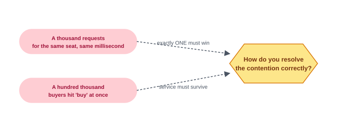

> **Key idea.** A popular on-sale is a synchronized stampede against a small, fixed inventory — the design needs exactly one winner per seat and a way to survive the spike that produces that winner.

## Key concepts

This section covers the concepts needed to solve this problem — prerequisites for the design work that follows.

### The hold

A hold is a short-lived, temporary reservation on a seat: it locks the seat for one buyer while they check out, and automatically expires if they don't complete the purchase in time. A hold is what separates "reserved" from "sold," and its expiry is what keeps an abandoned cart from stranding a seat forever.

*Diagram — seat lifecycle:* Seat: available → *(hold created)* → Seat: held, TTL set → *(purchase completes)* → Seat: sold; *(TTL expires)* → back to available.

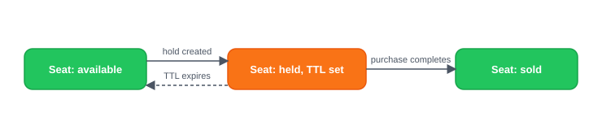

### Atomic compare-and-set

A seat's state transition from available to held has to happen as a single, indivisible operation: update the row only if it's still in the state you expect it to be in. When a thousand requests race for the same seat, the database serializes the writers to that one row — exactly one update finds the row still available and succeeds; every other one finds it already changed and fails. This is why the transition, not a read followed by a separate write, is what prevents overselling.

**Compare-and-set (CAS).** A conditional write: "set X to value B, but only if X currently equals A." If another writer changed X first, the CAS fails cleanly instead of overwriting a change it never saw.

*Diagram:* Request 1 → status = 'available'? → **yes, first to arrive** → status: held → 200 OK. Request 2 → status = 'available'? → **no, already changed** → 409 taken.

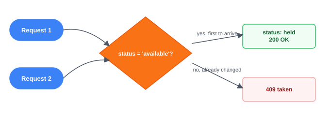

### The waiting room

A virtual queue issues each arriving user a token and admits them into the buying flow at a rate the inventory service can actually handle, turning a simultaneous wall of demand into a controlled stream — the same throttling idea behind rate limiting, applied to an entire on-sale event rather than a per-client quota. Admission into the waiting room is not a guarantee of a seat; it only guarantees the inventory service gets to process requests at a survivable rate.

*Diagram:* Simultaneous arrivals → Virtual queue *(token + position)* → *(admitted at a survivable rate)* → Buying flow.

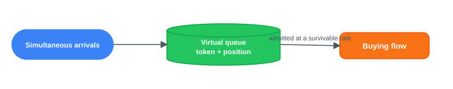

### Cached browse, consistent hold

Browsing availability and holding a seat have different consistency needs, and treating them differently is what keeps the system both fast and correct. Availability views can be served from an eventually-consistent cache — a stale view at worst shows a seat that was just taken, caught immediately by the CAS when the user tries to hold it. The hold itself is the one place correctness has to be exact, so it goes straight to a strongly-consistent store. Read traffic, which vastly outnumbers holds, never touches the path that has to be perfectly correct.

*Diagram:* Browse: high volume → Eventually-consistent cache. Hold: low volume, exact → Strongly-consistent store.

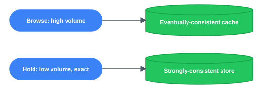

> **Key idea.** A hold is a temporary, expiring reservation; the available-to-held transition is an atomic compare-and-set that guarantees exactly one winner; a waiting room throttles the stampede into a survivable stream; and only the hold — not browsing — needs to be strongly consistent.

## 1. Requirements

> **Before reading on.** List the functional and non-functional requirements, then name the one property you would never compromise and the one constraint that drives the design.

### 1.1 Functional requirements

- **Browse availability** — which seats are open for an event.
- **Hold a seat** — temporarily reserve it while checking out.
- **Purchase** a held seat, converting the hold into a sale via the payment system.
- **Release** — holds expire and return to inventory automatically.

### 1.2 Non-functional requirements

- **No overselling.** A seat sells exactly once — the dominating correctness requirement.
- **Fairness under spike.** The on-sale stampede is admitted in a controlled, roughly-fair order.
- **Low-latency hold.** Grabbing a seat feels instant even under load.
- **Available browsing.** The read path stays up and fast even while the write path is under heavy contention.

### 1.3 The constraint versus the property

The property never to compromise is **no overselling**: a seat sells exactly once, no matter how many simultaneous requests race for it. The constraint that drives the design is that this has to hold under a stampede far larger than the inventory itself — which is why the design trades some availability for strong consistency at exactly one point (the hold), while keeping everything else (browsing) as available and cheap as possible.

> **Key idea.** No overselling is the property that can't bend; surviving a demand spike that dwarfs supply, without bending it, is the constraint the rest of the design answers.

## 2. Back-of-the-envelope estimation

| Input / Output | Value |
|---|---|
| Seats for sale | 50K |
| Buyers in the first minute | 1.0M |
| Browse reads per hold attempt | 200:1 |
| Contenders per seat | 20× *(1.0M buyers ÷ 50K seats)* |
| Hold attempts / sec | 17K/s *(bounded by seat count, small in absolute terms)* |
| Browse reads / sec | 3.3M/s *(orders of magnitude above hold attempts)* |

**What must be exact:** the hold — a small, atomic write path, not the read volume. `1.0M buyers ÷ 50K seats ≈ 20×` contenders per seat — the crush the design exists to resolve.

Reads (browsing) dwarf writes (holds) — holds are capped by seat count. The read path scales with caching; the hold path must be small and exactly correct.

### 2.1 Demand dwarfs supply

Assume a 50,000-seat venue with about 1,000,000 buyers arriving in the first minute of an on-sale. That's `1,000,000 ÷ 50,000 = 20` contenders per seat — the contention the entire design exists to resolve correctly.

### 2.2 Reads overwhelm writes

Browsing is orders of magnitude more frequent than holds. Holds are bounded by the seat count: no more than 50,000 seats can be on hold at any instant in a 50,000-seat venue. Expired holds re-issue, so total holds over the whole sale exceed that, but the concurrent bound stays fixed. The read path scales independently through caching; the write path is small in volume but has to be exactly correct.

### 2.3 The write hotspot is per-seat

Contention doesn't spread evenly across the venue — it concentrates on the good seats. The unit of serialization is one seat, and the hottest seats are the entire problem; sharding by event does nothing for contention that lands on a single row within that event.

> **Key idea.** The 20-to-1 (or worse) contenders-per-seat ratio, not the raw request volume, is the number that sizes this system — and it lands unevenly, on individual hot seats.

## 3. API design

**Design checkpoint (multiple choice):** *"A thousand requests arrive for the same seat in the same millisecond. What must the hold endpoint return to the losers that a normal write wouldn't need to?"* Options: (a) *A generic 500 error, retried by the client*; (b) *An explicit 409 (already taken), so the client can immediately show the seat as gone.* The design's answer is (b).

### 3.1 Browse availability

`GET /v1/events/{id}/seats`

Served from the eventually-consistent availability cache — this is the high-volume read path.

### 3.2 Hold a seat

`POST /v1/events/{id}/holds`

The atomic compare-and-set from Key concepts. A losing request gets 409 immediately — no queueing, no retry-and-hope.

### 3.3 Purchase a held seat

`POST /v1/holds/{id}/purchase`

410 (rather than 409) signals the hold itself lapsed, distinct from another buyer winning the seat.

> **Key idea.** The hold endpoint is a conditional write that fails fast and explicitly — losers get 409 immediately, not a queue position or a vague retry.

## 4. Data model

### 4.1 Seat

The unit of inventory — one row per physical seat.

- `Seat`: `string event_id`, `string seat_id`, `string section`, `string row`, `int number`, `decimal price`, `enum status`

### 4.2 Hold

A temporary claim on a seat, always time-bounded.

- `Hold`: `string hold_id`, `string event_id`, `string seat_id`, `string user_id`, `timestamp expires_at`

### 4.3 Order

The record of a completed purchase.

- `Order`: `string order_id`, `string user_id`, `string event_id`, `string[] seat_ids`, `string payment_id`, `enum status`, `timestamp created_at`

### 4.4 Where each entity lives

*Diagram (ER-style):* Seat (`event_id`, `seat_id`, `status`) —1:0..1— Hold (`hold_id`, `seat_id`, `expires_at`); Seat —1:0..1— Order (`order_id`, `seat_ids`)

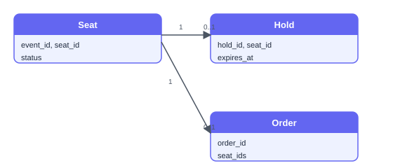

Seat rows live in a strongly-consistent, transactional store, partitioned by `event_id`; the available → held transition is a single atomic conditional update against this store. Hold rows carry the TTL that enforces expiry. Order rows are written once, on successful purchase. The availability shown to browsers is a separate, read-only, eventually-consistent cache derived from Seat — never the system of record.

> **Key idea.** Seat, Hold, and Order form one lifecycle — available → held → sold — with the strongly-consistent Seat store as the only place that lifecycle's correctness is enforced.

## 5. High-level design

> **Before reading on.** You already have the hold, atomic compare-and-set, the waiting room, and the cache/consistency split from Key concepts. Sketch what happens from "user clicks a seat" to "seat is sold," and where each of those four mechanisms plugs in.

### 5.1 Mark the seat sold on click

Start naive: the user picks a seat, and the server marks it sold directly.

*Diagram:* User → App server → Seat DB

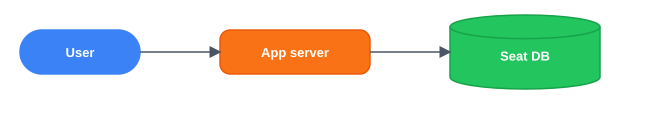

Four things break this at scale.

- Two users click the same seat close together and both get marked sold, overselling it.
- A user who holds a seat and abandons the page leaves it stuck forever — nothing ever frees it.
- A hundred thousand users hitting the service at the same instant overwhelms it outright.
- Everyone refreshing availability at once hammers the same database the sale itself needs.

### 5.2 Fix 1: an atomic hold

Split "sell" into hold-then-buy. The hold is an atomic conditional update: transition the seat available → held only if it is currently available.

*Diagram:* User → *(status = 'available'?)* → **yes** → status → held, hold created **NEW** / **no** → 409 taken

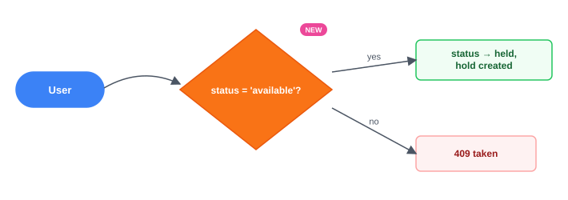

Overselling is fixed. An abandoned hold still strands the seat, and the service still has no defense against a hundred-thousand-person spike.

### 5.3 Fix 2: a hold TTL

Every hold carries a TTL. A sweeper scans for expired holds (or a lazy check on the next access treats an expired hold as available), returning the seat to inventory automatically.

*Diagram:* Hold-expiry sweeper **NEW** → *(scans)* → Holds *(with expires_at)* → *(TTL passed)* → status → available

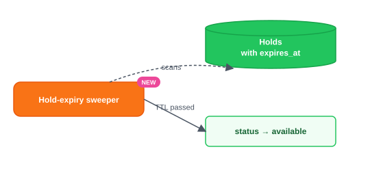

Abandoned holds no longer strand seats. The service still has to survive the initial stampede of arrivals.

### 5.4 Fix 3: a waiting room

A virtual queue issues each arriving user a token and admits them into the buying flow at a rate the inventory service can safely absorb.

*Diagram:* Hundred thousand users → Waiting room *(virtual queue)* **NEW** → *(admitted at controlled rate)* → Booking API

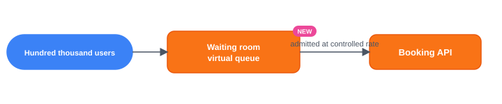

The service survives the on-sale moment. Every admitted user still hammers the same database just to see what's available.

### 5.5 Fix 4: a cached browse path

Availability is served from an eventually-consistent cache, so the flood of "what's open?" reads never touches the transactional inventory store at all.

*Diagram:* Booking API → *(browse)* → Availability cache **NEW** ; → *(hold)* → Seat DB *(strongly consistent)*

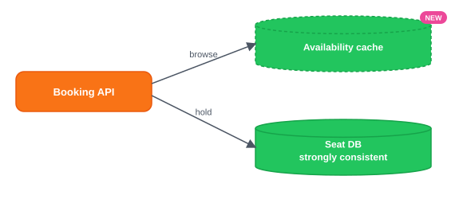

### 5.6 The composed design

*Diagram — combined architecture:* Users → Waiting room → Booking API → *(browse)* → Availability cache; → *(hold: atomic CAS)* → Seat + Hold DB; → *(purchase)* → Payment system → *(success)* → Order DB / *(failure)* → *(release: status → available)*; Hold-expiry sweeper runs alongside.

Each component answers one failure of the naive version: the atomic hold fixes overselling, the TTL fixes stranded seats, the waiting room fixes the stampede overwhelming the service, and the cached browse path fixes read traffic hammering the consistent store.

### 5.7 Sequence: the browse path and the hold path

*Sequence diagram:* Client → Booking API: `GET /events/{id}/seats` → Booking API → Availability cache: read (eventually consistent) → Availability cache → Booking API: seat list → Booking API → Client: availability. Then: Client → Booking API: `POST /events/{id}/holds` → Booking API → Seat DB: CAS available → held → Seat DB → Booking API: 200 held, or 0 rows (409) → Booking API → Client: hold result.

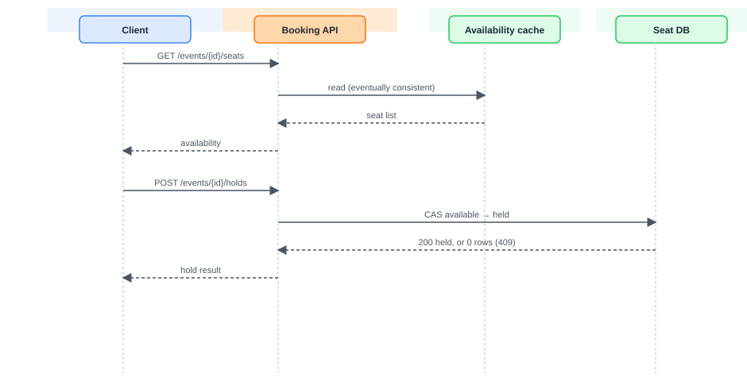

> **Key idea.** Browsing and holding are different consistency guarantees living side by side: a stale browse view at worst causes a 409 the atomic hold catches, so no amount of cache staleness can cause an oversell.

## 6. Deep dives

### 6.1 The hold and no oversell

> **Before reading on.** A thousand requests try to hold seat 14A in the same millisecond. Exactly one must win. What's the primitive, and where does the contention actually land?

The transition is a conditional update — `SET status = 'held' WHERE status = 'available'` — and the database serializes concurrent writers to that row: exactly one succeeds, and every other writer sees zero rows affected and gets 409. A row lock, an optimistic version check, or a `SET NX` plus TTL in an in-memory store all express the same underlying idea: an atomic winner-takes-one transition.

**Interactive step-through widget** (tabs: "Race for one seat" / "Hold expires, seat reopens"; controls "Play / Step / Reset"; state at t0: "5 requests arrive in the same millisecond", seat 14A status = `available`, contenders Alice, Bob, Carol, Dave, Eve all shown as `pending`; description: "All five contenders send POST /events/{id}/holds for seat 14A at once.")

Contention concentrates on individual hot seats, not the event as a whole — front-row seats absorb the fight while back rows sit uncontested. Sharding the whole event across nodes doesn't help a single hot row; the seat still needs one serialized decision, so the main lever is making that transition as cheap and fast as possible. Per-seat request queues or a best-available allocation mode can shape the contention, but they don't remove the serialization. Expiry has to be leak-proof: a sweeper reclaims expired holds, and the hold path itself treats an expired hold as available — the conditional update checks `expires_at`, not just `status` — so a lagging sweeper never leaves a seat stranded. What to monitor: any seat that ends up in two orders (an oversell, which should be structurally impossible), holds older than their TTL (a leak), and the held-but-never-purchased rate (abandoned-cart volume).

**What separates answers — the hold and no oversell:**
- **Bad** — Read status, then write sold separately
- **Good** — A single atomic compare-and-set with a TTL
- **Great** — Names the CAS primitive, per-seat contention, and leak-proof expiry

### 6.2 The waiting room

> **Before reading on.** A million people hit "buy" at 10:00:00 sharp. If they all reach the inventory service at once, it dies. How do you let them in without dropping the correctness guarantee?

Arrivals receive a queue token and a position; the system admits them into the buying flow at whatever rate the inventory service can safely absorb, the same throttling idea as rate limiting applied to an entire event's on-sale rather than one client's quota. The simultaneous arrivals become a controlled stream instead of hitting the service all at once.

*Diagram:* Arriving users → Assign token + position → Ordered queue → *(admit at controlled rate)* → Booking API → *(feeds back, adjusts rate)* → inventory-service latency → back to admission control.

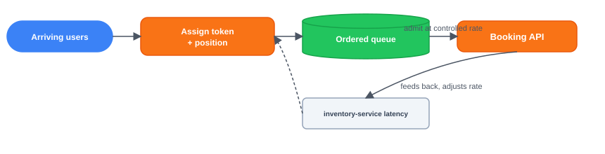

Position is roughly ordered by arrival, which is fairer than "whoever's retry lands first wins," and a token prevents skipping ahead. Perfect fairness at this scale isn't achievable — network jitter alone means two people who clicked at the same instant can arrive in either order — but roughly-ordered admission is the realistic, defensible bar. Being admitted is not a guarantee of a seat: inventory can sell out while someone is still queuing, so the client has to handle "your turn, but it's gone" as a normal outcome, not an error. The waiting room's only job is protecting the inventory service and smoothing the spike — it doesn't reserve anything. Without a waiting room, a hot on-sale can overwhelm the inventory service the same way an external denial-of-service attack would. What to monitor: admit rate against inventory-service latency (back off admission as latency climbs), queue depth, and abandonment.

**Design checkpoint (multiple choice):** *"A user is admitted from the waiting room, but the seat they wanted just sold out. Whose bug is this?"* Options: (a) *A bug in the waiting room — it should have reserved the seat*; (b) *Not a bug — the waiting room only throttles arrivals, it never guarantees availability.* The design's answer is (b).

**What separates answers — the waiting room:**
- **Bad** — No queue at all
- **Good** — A virtual queue admitting at a fixed rate
- **Great** — Arrival-ordered fairness, adaptive rate, explicit no-guarantee

### 6.3 The purchase-to-payment seam

> **Before reading on.** A user has a hold and clicks buy, but their card is declined. What must happen to the seat? And what if payment succeeds but your service crashes before recording the order?

The hold already reserved the seat for this user, so payment can take its time — up to the hold's TTL — without another buyer sneaking in, the ticketing equivalent of a payment authorization holding funds before they're captured. Converting a hold to a sale is a small saga: reserve (the hold) → charge (payment) → confirm (mark sold, write the order). If payment succeeds, the transition is held → sold and the order is confirmed; if payment is declined, or the hold's TTL lapses first, the compensation is releasing the seat back to available. A charge that succeeds only after the hold has lapsed is the awkward case. The confirm step checks hold validity first. If the seat is gone, the charge is voided or refunded rather than selling a released seat.

*Diagram — saga:* 1. reserve (hold) → 2. charge (payment) → 3. confirm: sold + order *(on success)*. On **declined, or TTL lapses** → compensate: release seat to available.

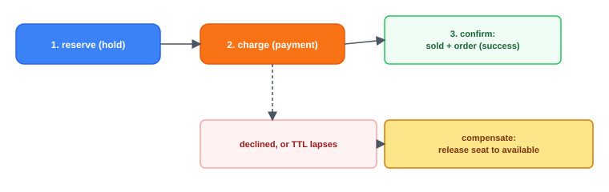

The remaining gap is a crash between a successful charge and a recorded order. Both steps carry an idempotency key derived from the hold: the payment system dedups a retried charge, and a retried confirmation finalizes the same outcome once. Idempotent confirmation alone prevents a double-sell; only an idempotent charge prevents a double-charge. What to watch: a seat marked sold with no successful payment behind it, or a successful charge with no seat — reconciling orders against payments and against seat status catches either mismatch directly.

**What separates answers — the purchase-to-payment seam:**
- **Bad** — Charge first, mark sold, no release path
- **Good** — Hold during checkout, convert on success, release on failure
- **Great** — Reserve-charge-confirm saga, idempotent confirmation, reconciliation

> **Key idea.** The atomic hold is what makes exactly one winner possible under a race; the waiting room protects the service from the crowd that creates that race, without ever promising a seat; and treating purchase as a small saga keeps the seat, the charge, and the order consistent across a payment failure or a crash.

## 7. Variants

### 10× scale

More events and bigger on-sales shard inventory further by event, but a single hot seat is irreducible — its one transition must stay cheap regardless of how much else scales around it. The waiting room scales horizontally and its admission rate adapts to inventory-service latency; the browse cache absorbs nearly all of the read growth, since availability reads dwarf hold attempts by a wide margin.

### General admission (no assigned seats)

Inventory becomes a single counter per tier, so a hold is an atomic decrement (`remaining > 0 ? remaining-- : reject`) rather than a per-seat compare-and-set. One counter per tier is itself a hot row — every buyer now hits the same key — but fungible inventory can be distributed: sharded counters or pre-allocated blocks spread the load while keeping the same oversell guard and waiting room. The problem gets easier because inventory is interchangeable, not because contention disappears.

### Resale / transfer

Reselling a ticket is a change of ownership on an already-sold seat, paired with a new payment between two users — the inventory count never changes, so it's a wallet-style transfer layered on an existing order, not a new hold against inventory.

> **Key idea.** The architecture holds at 10× scale because a hot seat's cost is irreducible regardless of sharding elsewhere; general admission removes per-seat contention entirely by replacing it with a counter; and resale is an ownership transfer on existing inventory, not a new hold.

## 8. The transferable pattern

Selling limited inventory under a stampede is an atomic hold plus a waiting room: correctness lives in one cheap compare-and-set per unit of inventory, survivability lives in a queue that turns a wall of simultaneous demand into a manageable stream. The same shape reappears anywhere fixed, contended inventory meets a demand spike that dwarfs it — flash sales, limited-release product drops, and any other "the first N people get it" system.

## Review: the 30-second answer

- Hold, then purchase — grabbing a seat creates a short-lived hold so no one else can take it while checkout completes, and the hold expires if the buyer doesn't finish in time.
- Never oversell: the seat's available → held transition is an atomic compare-and-set, so exactly one contender wins per seat.
- A waiting room absorbs the stampede, admitting users at a controlled, roughly-fair rate — it protects the service, it doesn't reserve a seat.
- Browse is cached and eventually consistent; the hold is the one strongly-consistent point where correctness actually lives.
- Purchase hands off to the payment system as a small saga, releasing the seat on failure so it's never left stuck.

## Quiz

**Ticketmaster Design Quiz** ("Hide All" / "Reveal All" toggle) — 5 questions, each with a "Show/Hide Answer" button. Full text of every question and its revealed answer:

**1) Why does a naive 'mark the seat sold on click' design fail even without considering scale?**
A single write with no intermediate hold state means two near-simultaneous clicks on the same seat can both succeed, overselling it — there's no mechanism forcing exactly one to win. Conversely, if a lock is held all the way through checkout to prevent that, an abandoned cart strands the seat with no automatic way to free it. The hold-then-buy split, with an expiring reservation in between, is what resolves both failures at once.

**2) A thousand requests try to hold the same seat in the same millisecond. Why does an atomic compare-and-set guarantee exactly one winner, when a read-then-write approach does not?**
A read-then-write approach lets multiple requests read 'available' before any of them writes, so more than one can proceed to write 'held' — a lost-update race. An atomic compare-and-set folds the check and the write into a single indivisible operation the database serializes: only the first writer finds the row still matching its expected prior state, and every subsequent writer sees zero rows affected and fails cleanly.

**3) Why doesn't sharding inventory by event help with contention on a single hot seat?**
Sharding by event spreads different events' load across different shards, but every request for one specific hot seat still lands on that seat's single row within its event's shard. The unit of serialization is the row, not the event, so no amount of sharding at the event level reduces the contention on that one row — only making its transition as cheap as possible helps.

**4) Why is a user being admitted from the waiting room not a guarantee that a seat is still available?**
The waiting room's only responsibility is throttling how fast arrivals reach the inventory service, to keep it from failing under simultaneous arrivals — it has no visibility into which specific seats remain. Correctness about seat availability lives entirely in the atomic hold, so a user can be legitimately admitted and still find their desired seat already held or sold by someone else.

**5) Why does converting a hold to a sale need to be idempotent, given that a hold has already guaranteed the seat to one buyer?**
The hold guarantees the seat won't go to anyone else, but it doesn't guarantee the confirmation step completes cleanly — a crash can happen after a payment charge succeeds but before the order is recorded. An idempotent confirmation, keyed to the hold, means retrying that step after a crash produces the same final state exactly once, rather than risking a duplicate charge or a seat that's charged for but never marked sold.

## Sources and further reading

- [Distributed locks with Redis — Redis docs](https://redis.io/docs/latest/develop/use/patterns/distributed-locks/) — the `SET NX` plus TTL primitive behind a time-bounded seat hold, and the correctness caveats of lock expiry.

---

### System Design Master Template (embedded video)

YouTube embed present at the bottom of the page (same "System Design Master Template" embed used across the site's problem pages).

### Comments

- **Rashid Jaffar** (Wed Nov 12 2025): "what is the purpose of BOOKING TABLE ? We track our actual BOOKING in EVENT SEATS TABLE." — followed by a reply (Sat Jun 20 2026): "Think of the purpose, I personally concluded it should be the store were bookings are final and should save information with regards to booking i.e event details, owner details etc." *(Note: these comments reference an older version of the data model — a "Booking Table" / "Event Seats Table" — from the pre-redesign page; the current live page's data model instead uses Seat / Hold / Order as documented above.)*
- A "Load More" control indicates additional comments exist beyond what was shown.

---

## Assets

The live site renders every diagram on this page as a JS/SVG widget rather than a downloadable image file, so all 15 diagrams have been recreated as standalone SVG files in `images/`, redrawn to match the live page's box shapes, colors (blue = actor/request, orange = service/process, green = store/cache/success, red = error, amber = decision/hotspot), and layout, and embedded inline next to each diagram's text transcription above:

- `d01_stampede.svg` — the contention illustration ("What makes this problem distinctive")
- `d02_seat_lifecycle.svg` — available → held → sold state diagram
- `d03_cas_race.svg` — the two-requests-one-winner CAS diagram
- `d04_waiting_room.svg` — arrivals → virtual queue → buying flow
- `d05_cache_consistency.svg` — browse-cache vs. hold-store split
- `d06_er_diagram.svg` — Seat / Hold / Order entity relationships
- `d07_naive.svg` — 5.1 naive User → App server → Seat DB
- `d08_fix1_atomic_hold.svg` — 5.2 atomic hold decision
- `d09_fix2_ttl.svg` — 5.3 hold-expiry sweeper
- `d10_fix3_waiting_room.svg` — 5.4 waiting room admission
- `d11_fix4_cached_browse.svg` — 5.5 cached browse path
- `d12_composed_design.svg` — 5.6 the full composed architecture
- `d13_sequence.svg` — 5.7 browse-path/hold-path sequence diagram
- `d14_saga.svg` — 6.3 purchase-to-payment saga
- `d15_waiting_room_feedback.svg` — 6.2 waiting-room admission feedback loop

Note that an earlier, out-of-date cached fetch of this same URL did show real downloadable `` screenshot assets (e.g. `ticketmaster-capacity-planning.png`, `ticketmaster-system-design-diagram.png`, `ticketmaster-seats.png`, `ticketmaster-notification-service.png`, `ticketmaster-scheduler.png`) from a prior, pre-redesign version of the page — those belong to old content that no longer reflects the current live page and were not recreated. The only real `` on the current page is the site's decorative header logo (`/logo.svg`), which carries no article content.
