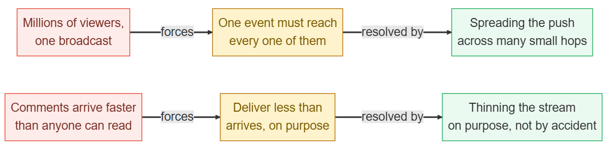
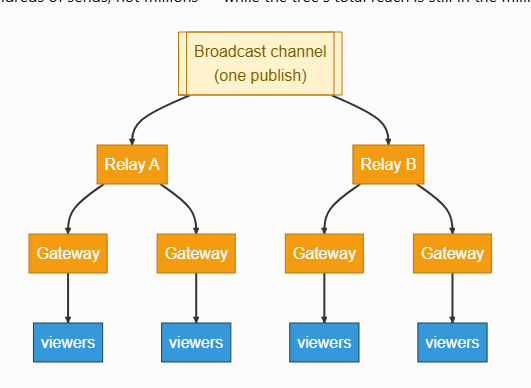
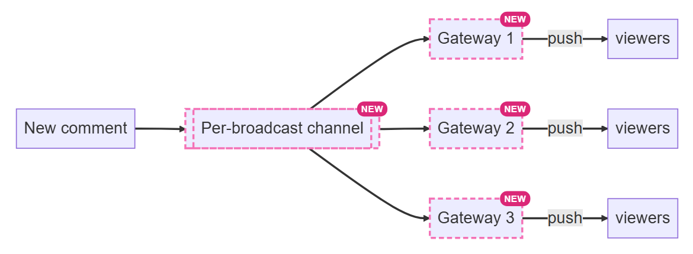
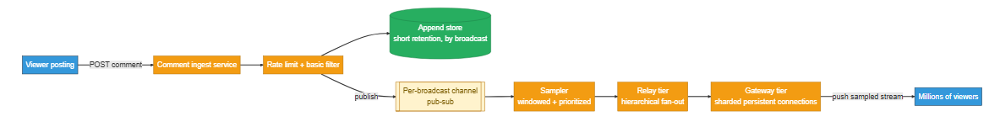
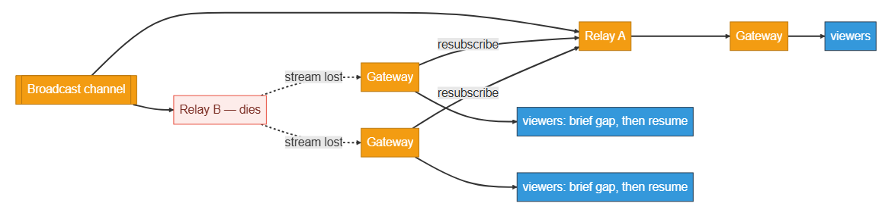
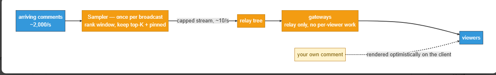

# Design Live Comments (Real-Time Fan-Out)

Source: https://systemdesignschool.io/problems/live-comments/solution

> Note on fidelity: this page is built from prose sections plus several JS-interactive widgets (a sampler step-through simulation, design-checkpoint multiple-choice widgets, "How it's graded" Bad/Good/Great rating lists, and inline node/arrow diagrams) rather than static images. Every widget's full content — including the sampler step-through's states and the diagrams' box/arrow labels — has been transcribed below as text, in the same order it appears on the site. All 5 "Show Answer" quiz reveals were clicked open in a live browser and their full text captured. The site has no downloadable diagram image files (they're rendered live by JS/SVG, not `` files), so there are no image assets to save for this page.

Tags: Hard · Real-time fan-out · Pub-sub · Sampling

---

## Problem statement

Design live comments on a live broadcast: viewers type short comments, and every viewer watching sees new comments stream in near-real-time.

In scope: posting a comment on a broadcast, broadcasting new comments to every connected viewer in near-real-time, and delivering a readable stream even when comments arrive faster than anyone can read. Out of scope: long-term comment history and search, machine-learning moderation, and the live video stream itself.

## Clarifying questions

- **One broadcast, or many at once?** Many broadcasts run concurrently, but the design is sized by the single largest broadcast — that one is the hot key that can break everything else.
- **How many concurrent viewers on the biggest broadcast?** Millions — an illustrative order of magnitude, sized precisely in the estimation section. That's what forces both fan-out and sampling; a small room is just a group chat.
- **Does every viewer need every comment?** No — at high arrival rates, a representative, prioritized subset is the actual goal.
- **How durable must comments be?** Barely. They're ephemeral; long-term history is a separate, deferred system.
- **What ordering guarantee is needed?** Rough near-real-time order per broadcast is enough. Strict global ordering across a sampled, scrolling stream isn't worth its cost here.
- **Is post latency the same as delivery latency?** No — posting should return fast; delivery to other viewers is near-real-time (within a second or two). They're different budgets.
- **Is the video stream itself in scope?** No — assume video is delivered separately; this system owns only the comments.

## What makes this problem distinctive

The surface looks like a chat room: viewers see a scrolling list of short messages. The transport is the same persistent-connection problem — holding an open connection per viewer so the server can push, rather than the viewer having to ask.

What breaks the chat-room framing is scale in two dimensions at once. First, one popular broadcast can have millions of viewers subscribed to the exact same stream at the same moment. That's a single, synchronous fan-out target far larger than any one person's friend list. Second, at a peak moment, comments arrive faster than any human could possibly read them. A design that only solves "push a message to a lot of connections" still fails. Pushing every comment to every viewer is both technically infeasible and pointless — nobody could read it. The stream has to be thinned down to a readable rate before it ever reaches a viewer, and that thinning has to happen without singling out any one connection.

**Ingest vs egress.** Ingest is the rate comments are posted; egress is the rate they're delivered to viewers. Ingest here is comparatively small — one broadcast, one stream of short texts. Egress is enormous, because it multiplies by every connected viewer, and it's egress that this design bends around.


```text
Millions of viewers, one broadcast ──(forces)──▶ One event must reach everyone
                                                          │
                                              (resolved by)
                                                          ▼
                                    Spreading the push across many small hops

Comments arrive faster than anyone can read ──(forces)──▶ Deliver less than arrives, on purpose
                                                          │
                                              (resolved by)
                                                          ▼
                                   Thinning the stream on purpose, not by accident
```

Millions of viewers on one broadcast force the need for one event to reach every one of them, resolved by spreading the push across many small hops; comments arriving faster than anyone can read force delivering less than arrives, on purpose, resolved by thinning the stream deliberately rather than by accident.

## Key concepts

This section covers the concepts needed to solve this problem — prerequisites for the design work that follows.

### Persistent connections and pub-sub channels

A persistent connection (typically a WebSocket) stays open between a viewer's client and a server, so the server can push data the moment it exists instead of the client repeatedly asking "anything new?" A **pub-sub** (publish-subscribe) channel is a named stream that any number of subscribers can listen to at once: one publisher writes an event, and each current subscriber receives it — best-effort, since a disconnect or backpressure can drop or duplicate a delivery. A broadcast's comment stream is naturally one pub-sub channel — every viewer of that broadcast subscribes to the same channel, and a posted comment is a single publish that every subscriber sees.

### Hierarchical fan-out

Pushing an event to a channel with a million subscribers from one process means that process has to perform a million sends for a single comment — an out-degree no single machine sustains at any real rate. **Hierarchical fan-out** breaks that single hop into a tree: the channel feeds a handful of relay nodes, each relay feeds a set of gateway servers, and each gateway pushes to only the viewers connected to it. Every node in the tree does a bounded amount of work — tens or hundreds of sends, not millions — while the tree's total reach is still in the millions.




```text
                                   ┌──▶ Relay A ──▶ Gateway, Gateway ──▶ viewers, viewers
Broadcast channel (one publish) ──┤
                                   └──▶ Relay B ──▶ Gateway, Gateway ──▶ viewers, viewers
```

A single publish on the broadcast channel reaches Relay A and Relay B, each of which fans out to several gateways, each of which fans out to its connected viewers.

### Sampling: delivering less than what arrives

When arrival rate outpaces what a person can read, the fix isn't a faster pipe — it's deliberately delivering fewer comments than arrive, chosen well rather than at random. A sampler looks at a short time window of arriving comments, ranks them by signals like engagement and author status, and keeps only the best few, capped at a rate a person can actually follow. This is different from dropping messages under overload as a last resort — sampling is a designed-in, always-on part of the pipeline, not a failure response.

**Interactive step-through widget** (controls "Play / Step / Reset"; state: "window 0/4"; "arrivals this window (cap = 2 + any pinned)" showing candidates c1(20), c2(65), c3(15), c4(40), c5(10), c6(30) with scores; "delivered stream (what viewers actually see)" panel; initial description "Waiting for the first window of arrivals.")

The widget runs four windows of arriving comments through a sampler capped at two comments per window, always keeping any pinned comment regardless of score — watch how most arrivals never reach the delivered stream, by design.

> **Key idea.** A pub-sub channel and hierarchical fan-out solve reaching millions of connections; sampling solves a completely different problem — deciding what's even worth reaching them with, once arrival outpaces what anyone can read.

## 1. Requirements

### 1.1 Functional requirements

- **Post** a comment on a live broadcast (short text).
- **Broadcast comments**: every connected viewer sees new comments stream in near-real-time.
- **Deliver a readable stream**: at high arrival rates, each viewer sees a representative, prioritized subset, and always sees their own comment.

### 1.2 Non-functional requirements

- **Near-real-time delivery.** A new comment should reach connected viewers within a second or two; a comment landing a minute late on a live stream is worthless.
- **Massive synchronous fan-out.** Millions of concurrent viewers on a single broadcast, all tailing the exact same stream at once.
- **Bounded, readable delivered rate.** Delivery stays capped at a human-readable rate regardless of how fast comments actually arrive.
- **Graceful degradation.** Under overload, sample harder or drop rather than fail outright — losing an ephemeral comment is an acceptable cost.
- **Elastic connection scale.** Connection counts spike hard when a broadcast starts and collapse when it ends.

### 1.3 The binding constraint

Near-real-time delivery to the whole audience is non-negotiable — the system favors freshness and availability over durability. But the property that actually organizes the architecture is that the delivered stream must stay bounded. Viewers times arrival rate is both physically impossible to serve and unreadable to a human, so a sampler capping the delivered rate is the central constraint every other piece serves. The two collide directly at that sampler: cap too aggressively and viewers miss the moment's best comments; cap too loosely and the fan-out tree and the clients drown. That collision is why sampling earns its own deep dive.

## 2. Back-of-the-envelope estimation

| Input / Output | Value |
|---|---|
| Concurrent viewers (millions) | 10M |
| Comment arrival rate / sec | 2000/s |
| Readable delivery cap / viewer / sec | 10/s |
| Connections / gateway server | 100K |
| Undelivered-every-comment rate | 20.0B/s *(viewers × arrival rate — impossible)* |
| Capped delivery rate | 100M/s *(viewers × readable cap — independent of arrival)* |
| Gateway servers needed | 100 *(10M viewers ÷ 100K connections/gateway)* |

`10M × 2000/s = 20.0B/s` vs `10M × 10/s = 100M/s`. Delivering every comment scales with arrival rate, which nobody controls. Capping at a readable rate makes the firehose depend only on viewer count — sampling is what makes that cap possible.

Assume one popular broadcast has roughly ten million concurrent viewers, each holding one persistent connection — an illustrative anchor, not a measured fact. That alone is the number that breaks a naive single-server design.

Say comments spike to roughly two thousand a second at a peak moment. Delivering every comment to every viewer would mean `10M × 2,000/s = 20 billion` deliveries a second for this one broadcast — a rate no fan-out tier could serve, and one no person could read anyway. A person can realistically read on the order of ten comments a second, so capping delivery there instead gives `10M × 10/s = 100 million` deliveries a second — still large, but now fixed by viewer count and the readable cap, independent of how fast comments actually arrive.

Connections, more than requests per second, set the server count on the gateway tier — CPU for TLS and egress bandwidth are the other sizing dimensions at high delivered rates. Assume, as another illustrative anchor, roughly a hundred thousand connections per gateway server — at that figure, a hundred gateways cover ten million connections, this one broadcast's audience, before counting every other broadcast live on the platform at the same time.

> **Key idea.** Delivering every comment scales with arrival rate, something nobody controls. Capping delivery at a readable rate makes the firehose depend only on viewer count — which is exactly what makes sampling structural rather than a nice-to-have.

## 3. API design

**Design checkpoint (multiple choice):** *"A viewer's client needs to know about new comments the instant they're posted, without asking. What shape does that read path take, compared to a normal GET request?"* Options: (a) *A GET endpoint the client polls every second*; (b) *A subscription over a persistent connection, where the server pushes new comments as they arrive*; (c) *A batch endpoint the client calls once per minute.* The design's answer is (b).

### `POST /broadcasts/{id}/comments`

This write returns as soon as the comment is appended and published — the poster never blocks on however many millions of live deliveries follow. It's rate-limited per user, since one person spamming comments is cheap abuse worth stopping right at the edge.

### `WS /broadcasts/{id}/stream?since=<cursor>`

The read path is a subscription over a persistent connection, not a one-shot request. Over a WebSocket, the server pushes the already-sampled stream — a viewer's client never polls "anything new?", which would be the design's worst enemy at this scale. What comes down the socket has already been thinned by the sampler (Key Concepts, deep dive 2): the client just renders whatever arrives.

The `since` cursor is a best-effort catch-up, not an exact replay. On reconnect, the server sends the recent sampled window and then resumes live delivery — it does not attempt to replay every comment that was missed. That's the honest contract for a stream that's already sampled and ephemeral; a system that must replay exactly (like a durable chat log) needs a different guarantee entirely.

## 4. Data model

Start with the one obvious entity: a comment someone typed on a broadcast.

- `Comment`: `string comment_id`, `string broadcast_id`, `string user_id`, `string text`, `timestamp created_at`

This looks like a row in a table, and stopping here means modeling a storage problem instead of the real one. The read pattern isn't "fetch a comment by ID" — millions of viewers all want the next comments on one broadcast the instant they appear. Nobody queries a single comment by ID; everyone tails the same growing stream at once. That's a subscription, and the object being subscribed to is a per-broadcast channel, not a queryable table.

- `Channel`: `string broadcast_id`, `stream comment_events`

But the channel alone can't decide which comments actually reach a viewer. When comments arrive faster than anyone can read (the estimation math above), each viewer can only receive a subset. A comment needs to carry the signals a sampler ranks on, and the broadcast needs a delivery budget.

- `Comment` (extended): `int author_rank`, `int like_count`, `bool is_pinned`
- `Broadcast`: `string broadcast_id`, `int deliver_rate_cap`, `string status`

Ephemerality decides where each entity lives. A live comment matters for the moment and then goes cold — the live path never paginates last week's stream comment by comment. Comment events live in a fast append store with short retention, sharded by `broadcast_id`, because nearly every read is "recent comments on one broadcast," rarely a point lookup — those remain for moderation and ops, but they don't shape the design. The channel is a pub-sub topic per broadcast — physically a tree of relays for a hot broadcast, but one logical channel. The sampler is a running component, not a stored table: the delivered subset is computed continuously and not durably persisted — at most a short recent window is kept for reconnect catch-up.

This inverts a chat system's usual shape: there, the durable message store is the source of truth and the live push is an optimization on top of it. Here, the live channel is the source of truth, and the store is only a short-lived transcript.

> **Key idea.** The reframing from "comment as a row" to "comment as an event on a subscribed channel" is forced by the read pattern — millions tailing one stream, not one client looking up one row — and it's what makes the sampler a natural next piece rather than a bolt-on.

## 5. High-level design

Start with the simplest thing that could work: one server holding every viewer's connection and looping over them on every new comment.


A viewer posts a comment to one server, which pushes it to every connection, reaching all viewers.

This works for a small room. Four things break as the broadcast grows:

- One server can't reliably hold millions of connections while doing real per-connection work, and pushing one comment means millions of individual sends.
- Even a fleet of servers must be sized by connection count, which spikes hard the moment a broadcast starts.
- Comment arrival rate can exceed what's even mechanically deliverable, let alone readable.
- A single celebrity broadcast can dwarf every other one and overwhelm any single relay.

Fix them one at a time.

### Fix 1: a fan-out layer — channel, then gateways

Split the single server into a fleet of gateway servers, each holding a slice of viewers' persistent connections. A posted comment goes onto the broadcast's pub-sub channel; every gateway with viewers on that broadcast subscribes to the channel and pushes each new comment down its own sockets. One publish, many gateways.


```text
New comment ──▶ Per-broadcast channel [NEW] ──(push)──▶ Gateway 1, Gateway 2, Gateway 3 [NEW]
                                                                 │
                                                                 ▼
                                                     viewers, viewers, viewers
```

A new comment goes onto a new per-broadcast channel, which pushes it to Gateway 1, Gateway 2, and Gateway 3 (all new), each reaching its own viewers.

This is a genuinely different shape from a one-to-one chat system: chat delivers to a specific recipient, so it needs a registry mapping user to gateway to find that one socket. Live comments are one-to-all — a gateway subscribes once to the whole channel on behalf of every viewer it holds, so there's no cross-fleet per-recipient lookup; each gateway keeps only a local map of which of its sockets watch the broadcast. The channel, not a registry, is the center of this design.

### Fix 2: shard the gateway tier by connection count

Connections are the capacity unit here, not requests per second, so the gateway tier scales out by connection count and is sharded across many servers, with a load balancer placing each new viewer on a gateway. Because delivery is one-to-all, any gateway can serve any viewer of a given broadcast — adding gateways simply adds connection capacity.

### Fix 3: a sampler between the channel and the gateways

A sampler reads the full arrival stream for a broadcast and emits a capped, prioritized subset — a readable rate's worth of comments per second, ranked by engagement, author, and pinned status. It runs once per broadcast (or once per region), so the expensive ranking work happens a handful of times, and the exact same sampled stream fans out to every gateway — not once per connection. Per-viewer touches, like always showing someone their own comment, get merged in cheaply at the gateway rather than through the shared sampler.

### Fix 4: hierarchical fan-out for the biggest broadcasts

A single relay process still can't push one broadcast's sampled stream to a hundred gateways serving millions of viewers behind them. The one channel-to-gateways hop becomes a tree: the channel feeds a set of relay nodes, each relay feeds a subset of gateways, each gateway feeds its own viewers. The channel stays one logical topic — the relay tree is just how it physically reaches millions.

**Composing all four fixes:**

```text
Viewer posting ──(POST comment)──▶ Comment ingest service
                                      (rate limit + basic filter)
                                              │ (publish)
                                              ▼
                          ┌───────────────────┴───────────────────┐
                          ▼                                       ▼
              Append store (short retention,          Per-broadcast channel
                   by broadcast)                            (pub-sub)
                                                                  │
                                                                  ▼
                                                Sampler (windowed + prioritized)
                                                                  │
                                                                  ▼
                                                Relay tier (hierarchical fan-out)
                                                                  │
                                                      (push sampled stream)
                                                                  ▼
                                          Gateway tier (sharded persistent connections)
                                                                  │
                                                                  ▼
                                                       Millions of viewers
```

The combined architecture: a viewer's POST comment reaches the comment ingest service (rate limit + basic filter), which publishes to both a short-retention append store and the per-broadcast pub-sub channel; the channel feeds a windowed, prioritized sampler, which feeds the hierarchical relay tier, which pushes the sampled stream to the sharded gateway tier, which reaches millions of viewers.

These boxes are the data model's homes made concrete. Comment events are appended to the store and published onto the per-broadcast channel; the sampler is where the model's "delivered subset" becomes a running component; the gateway tier holds the actual subscriptions and sockets. One thing from the data model splits further here: the single logical channel becomes a tree of relays for a hot broadcast, because one process cannot fan out to millions on its own, so the relay itself gets replicated into a hierarchy.

> **Key idea.** Each of the four fixes traces to a concrete failure of the single-server design — connection limits, connection scale, arrival rate, and a single hot broadcast — not to a feature checklist.

## 6. Deep dives

### 6.1 Fan-out to millions of connections

**Design checkpoint (multiple choice):** *"A broadcast has ten million viewers spread over a hundred gateways. How does one posted comment reach all of them without any single node performing ten million sends?"* Options: (a) *One relay process pushes to all hundred gateways directly and each gateway pushes to all its viewers*; (b) *A tree of relay nodes, each with bounded out-degree, multiplies the fan-out width until total reach is in the millions.* The design's answer is (b).

The fan-out is a tree: channel to relays to gateways to sockets. Each level multiplies width so no single node's out-degree is unmanageable — a relay pushes to tens of gateways, a gateway pushes to its own connected viewers, and total reach across the whole tree still lands in the millions.

Because every viewer of a broadcast wants the exact same stream, a gateway subscribes once to the (relayed) channel and reuses that single stream for every viewer connected to it — the per-connection cost is just a socket write, never a lookup. This contrasts directly with a one-to-one chat system's registry-and-route-per-recipient model; there is no registry anywhere on this delivery path.

A broadcast's viewer count sets how deep and wide its tree needs to be, and the platform runs many such trees — one per live broadcast — growing each as its own audience grows. A small broadcast collapses to a single hop: channel straight to one gateway.

If a relay dies, its gateways simply resubscribe to a sibling or parent relay, and viewers see a brief gap before the stream resumes — no replay is needed, since the stream was already ephemeral. The blast radius of a lost relay is bounded to its own subtree of the fan-out tree.

```text
                     ┌──▶ Relay A (fine) ──▶ Gateways ──▶ viewers (unaffected)
Broadcast channel ──┤
                     └──▶ Relay B (dies) ──(stream lost)──▶ downstream Gateways
                                                                     │
                                                            (resubscribe)
                                                                     ▼
                                              viewers see a brief gap, then resume
```

When Relay B dies, its downstream gateways lose the stream and resubscribe, so their viewers see a brief gap before resuming, while Relay A's gateways and viewers are entirely unaffected — only Relay B's subtree is impacted, and the dropped gateways resubscribe upward rather than replaying anything.

**Strong-answer criteria.** A strong answer describes a relay tree with bounded per-node out-degree, explains why broadcast delivery needs no connection registry (unlike one-to-one delivery), and scopes a relay failure's blast radius to its subtree with resubscribe-and-resume recovery.

**Fan-out mechanism: how it's graded:**
- **Bad** — One channel pushing straight to every socket, or gateways addressing each other
- **Good** — A pub-sub channel per broadcast with sharded gateways subscribing to it
- **Great** — A relay tree sized to the broadcast, with subtree-scoped failure recovery

### 6.2 The delivered-rate and sampling problem

**Design checkpoint (multiple choice):** *"Comments arrive at two thousand a second; a viewer can read maybe ten. What should the sampler send to ten million viewers, and how should it choose?"* Options: (a) *A uniformly random sample of arriving comments, to be fair*; (b) *The highest-ranked comments per short time window, by engagement and author signals, always including pinned comments.* The design's answer is (b).

The math from estimation makes the constraint concrete: ten million viewers times a two-thousand-per-second arrival rate is twenty billion deliveries a second, impossible to serve and impossible to read. Capping delivery at ten per second instead makes it a hundred million a second — still large, but now independent of arrival rate. The remaining design question is simply which comments to keep.

The sampler ranks each short window's comments by signals like engagement, likes, and author status, and emits only the top few per second, up to the cap. A purely random sample reads as noise to a viewer; ranking surfaces the moment's genuinely best comments instead. If peak arrival stays on the order of a few thousand comments a second, buffering a short window to pick the top few is cheap; substantially higher rates would need larger buffers or simpler scoring.

Two things always bypass the cap. Creator and pinned comments are a global guarantee: the sampler always keeps them in its output regardless of score, because they matter to every viewer by policy, not by ranking (the pinned comment in the Key Concepts widget above survives every window for exactly this reason). A viewer's own comment is rendered optimistically by their own client the instant they post it, so posting feels instantly responsive without needing any per-recipient routing on the delivery path at all.

Selection runs once per broadcast (or once per region), so its cost is paid only a handful of times; the same sampled stream then flows through the entire relay tree to every viewer, and each gateway just relays it with zero per-recipient computation. This is why the sampler sits above the gateway tier in the composed design, not inside it.



Arriving comments at roughly 2,000/s pass through a sampler that runs once per broadcast, ranking each window and keeping the top-K plus pinned comments, producing a capped stream of roughly 10/s that flows through the relay tree and relay-only gateways to viewers; separately, a viewer's own comment is rendered optimistically on their client, reaching them directly and bypassing the pipeline. The rate collapses at the sampler, once, before fan-out — so the whole tree below carries the small capped stream, and a viewer's own comment reaches their screen without ever entering it.

Under overload, the system degrades by sampling harder — lowering the cap and widening the window, so viewers see fewer comments but the stream stays live and readable. A thinner stream beats a frozen or flooded one; dropping ephemeral comments under pressure is an acceptable cost, not a failure. The signals worth watching are arrival rate versus delivered rate per broadcast, the drop ratio, sampler lag, and the latency of a viewer seeing their own comment echoed back (a proxy for how responsive posting feels).

**Strong-answer criteria.** A strong answer prioritizes within a window rather than sampling randomly, always keeps creator/pinned comments and renders the poster's own comment optimistically on the client, runs sampling once per broadcast above the fan-out tree rather than per connection, and degrades by tightening the cap rather than failing outright.

**Sampling: how it's graded:**
- **Bad** — Try to deliver every comment, or drop uniformly at random
- **Good** — Cap the delivered rate and sample a representative subset per window
- **Great** — Prioritizes within the window, guarantees pinned comments, samples once above the fan-out tier

### 6.3 Connection management and failure

**Design checkpoint (multiple choice):** *"A broadcast ends and ten million connections drop within seconds; meanwhile a phone on a spotty connection keeps flapping. What breaks first if the gateway tier doesn't plan for this?"* Options: (a) *Nothing — connections are cheap and gateways handle drops automatically*; (b) *A reconnection thundering herd overwhelms gateways, and unbounded per-connection buffers let one slow client back up an entire gateway.* The design's answer is (b).

Reconnection is constant and bursty by nature. A broadcast starting is a connection thundering herd — millions connecting within seconds — and a broadcast ending is a mass disconnect. The standard absorbers are connection-rate limiting at the load balancer, jittered client reconnect backoff so retries don't all land at once, and gateways that shed or queue new connections gracefully rather than falling over. On reconnect, a client resubscribes, receives the recent sampled window as a best-effort catch-up, and then resumes live — no exact replay, since the stream was ephemeral to begin with.

A viewer on a weak network can't keep up with the delivered rate. This is **backpressure**: sends queue up faster than a slow client can drain them, and a gateway must never let that queue grow without bound. The fix is to drop the oldest queued comments or coalesce them for that one connection — reasonable, since the stream is already designed to be sampled — and if a socket falls too far behind anyway, cut it and let the client reconnect fresh. One slow client can never be allowed to back up a gateway serving a hundred thousand others.

Heartbeats (small periodic ping/pong messages) detect connections that look open but are actually dead — a phone that went to sleep, or a network that silently dropped. Without application-level heartbeats (or tightly tuned TCP keepalive), a gateway can keep counting a dead connection as live for an extended period, which wastes a connection slot and quietly skews every capacity number the whole design is sized by.

When a gateway itself dies, its viewers simply reconnect onto other gateways — since delivery is one-to-all, any gateway works for any viewer of that broadcast. When a relay dies, its subtree resubscribes upward. Because everything here is ephemeral, recovery is always reconnect-and-resume; there's no durable state that needs rebuilding, since the store only ever holds a short recent transcript for catch-up.

```text
Broadcast starts: connect storm ──▶ Rate-limited, jittered reconnect

Slow client: queue grows ──▶ Drop-oldest or coalesce ──▶ "Still behind?" ──▶ cut the socket

Dead socket, no heartbeat reply ──▶ Reclaim the connection slot
```

The connection-management flow: a broadcast starting causes a connect storm, absorbed by rate-limited, jittered reconnects; a slow client's growing queue is handled by dropping the oldest entries or coalescing them, and a socket that's still too far behind gets cut; a dead socket with no heartbeat reply has its connection slot reclaimed.

The operational signals worth watching: concurrent connections per broadcast, connect/disconnect rate (to catch a thundering herd forming), delivered-versus-arrival rate and drop ratio, per-gateway send-queue depth (the direct signal of backpressure building), heartbeat-timeout rate, and end-to-end post-to-deliver latency. A climbing send-queue depth alongside a flat delivered rate points at clients or sockets as the bottleneck, not the channel itself.

**Strong-answer criteria.** A strong answer absorbs connect/disconnect storms with rate limiting and jittered backoff, bounds per-connection buffers with drop-oldest-or-coalesce and a cutoff for persistent laggards, uses heartbeats to reclaim dead-connection slots, and scopes failure recovery to a gateway or relay subtree with reconnect-and-resume.

**Connection management: how it's graded:**
- **Bad** — Assume stable connections, buffer without bound, no heartbeats
- **Good** — Heartbeats, reconnect with recent-window catch-up, bounded buffers
- **Great** — Rate-limited jittered reconnect, drop-or-cut for laggards, subtree-scoped recovery

## 7. Variants

### 10x scale

A hundred million viewers on one broadcast. The fan-out pattern extends — the tree deepens and the cap tightens — but load balancers, TLS termination, kernel memory, and the control plane all need revalidation at that scale. Connections scale roughly tenfold, so a thousand gateways at a hundred thousand connections each cover the hundred million viewers on that one broadcast. At the same readable cap, the delivered firehose becomes a billion deliveries a second, so the response is to add relay layers to the tree, push the sampler's cap down further, or regionalize — same overall picture, just more relay levels and a lower delivered cap.

### Multi-region: a global audience

Viewers worldwide connect to nearby regional gateway tiers. The broadcast's channel forwards its events to each region continuously — one cross-region stream per region rather than per viewer — and sampling runs per region, so each region delivers its own readable subset without a single global bottleneck. A viewer in a distant region sees comments slightly later, due to replication delay — acceptable for an ephemeral stream, and cross-region ordering isn't attempted.

### Small broadcast: it degenerates into chat

When a broadcast is small — a handful of viewers, a low comment rate — sampling becomes unnecessary and the tree collapses to a single gateway: the problem is now just a group chat room where every message reaches every member. Naming this boundary explicitly shows an understanding of when the distinctive machinery here — sampling and hierarchical fan-out — actually earns its keep, and when it's simply unneeded overhead.

## 8. The transferable pattern

Live comments combines a persistent-connection transport with fan-out to many subscribers, but synchronous, ephemeral, and bounded by human readability. Whenever one high-rate stream must reach millions of concurrent subscribers in real time, the same shape recurs: a pub-sub channel per stream, a sharded connection tier that subscribes on the audience's behalf, hierarchical fan-out so no single node's out-degree explodes, and — the piece unique to a firehose faster than any human can read — a sampler that caps the delivered rate independent of the arrival rate.

The same pattern drives live reactions, sports tickers, and "who's watching" presence counters. Recognizing live comments as "a broadcast channel you sample and fan out" is what turns a millions-to-one delivery problem into just four pieces: a channel, a connection tier, a sampler, and a fan-out tree.

## Review

Live comments looks like chat for a big room, but two forces break that framing: millions of viewers subscribed to one broadcast at once, and comments arriving faster than anyone can read. The design routes every posted comment through a per-broadcast pub-sub channel, fans it out through a tree of relays and sharded gateway servers so no single node ever needs an unbounded out-degree, and — critically — samples the stream down to a readable rate before it ever reaches a gateway, always keeping pinned comments and rendering a viewer's own comment optimistically on their own client. Connection management absorbs the thundering herds at a broadcast's start and end, bounds per-connection buffers against slow clients, and recovers failures by simple reconnect-and-resume, since the whole stream is designed to be ephemeral in the first place.

## Quiz

**Live Comments — check your understanding** ("Hide All" / "Reveal All" toggle) — 5 questions, each with a "Show/Hide Answer" button. Full text of every question and its revealed answer:

**1) Why does live comments need hierarchical fan-out instead of one relay pushing directly to every gateway?**
A single relay process pushing to every viewer directly would need an out-degree of millions, which no single process can sustain. A tree of relay nodes bounds each node's out-degree to a manageable number (tens or hundreds of pushes) while the tree's total reach still covers millions of viewers.

**2) Why is sampling structural to this design rather than an optional tuning knob?**
Delivering every comment to every viewer scales as viewers times arrival rate, which at scale becomes both technically infeasible to serve and impossible for any person to read. Capping the delivered rate makes the firehose depend only on viewer count, not on how fast comments happen to arrive — which is only possible if a sampler actively chooses what to deliver.

**3) Why does broadcast delivery need no connection registry, unlike a one-to-one chat system?**
In one-to-one delivery, the system must look up which specific socket belongs to a specific recipient. In broadcast delivery, every viewer of a channel wants the identical stream, so a gateway simply subscribes once to the channel and reuses that single stream for every viewer it holds — there's no per-recipient lookup anywhere on the path.

**4) What two kinds of comments bypass the sampler's rate cap, and why?**
Creator and pinned comments always survive the cap as a global policy guarantee, regardless of their engagement score, because they matter to every viewer by design. A viewer's own comment is rendered optimistically on their own client the instant they post it, which needs no fan-out or sampling at all since it never has to travel through the delivery path to reach its author.

**5) Why does reconnecting after a dropped connection get a best-effort recent window instead of an exact replay of missed comments?**
The stream is already sampled and ephemeral, so an exact replay of everything missed isn't meaningful or even fully knowable after the fact — most arriving comments were never delivered to begin with. The honest contract on reconnect is "catch up to roughly now" with the recent sampled window, then resume live delivery.

## Sources and further reading

- [The WebSocket Protocol — RFC 6455](https://www.rfc-editor.org/rfc/rfc6455) — the persistent, full-duplex connection standard that carries the delivered comment stream to each viewer.
- [Fan-out: building a scalable feed — Stream](https://getstream.io/blog/fanout/) — fan-out strategies for pushing updates to many subscribers; live comments applies the same push shape synchronously and adds sampling to bound the delivered rate.
