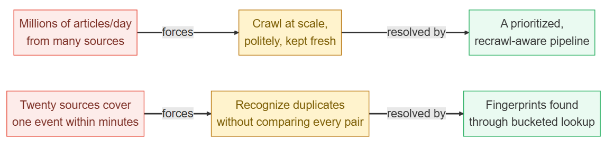
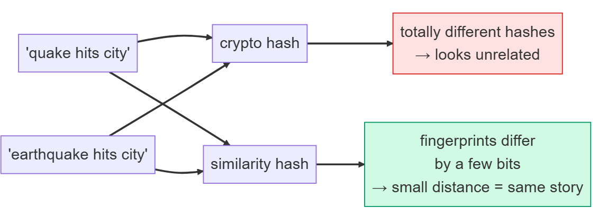
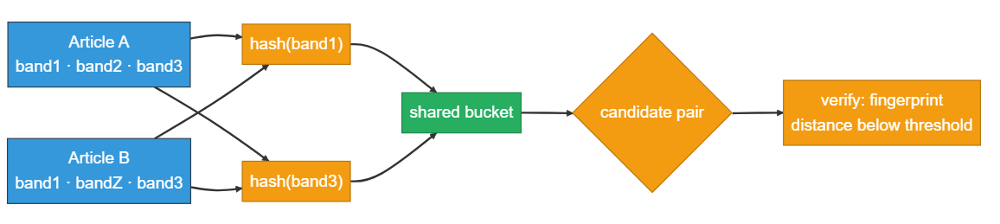
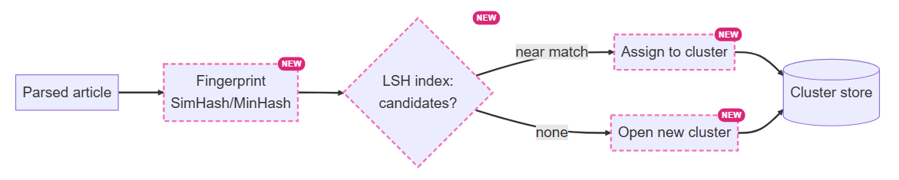
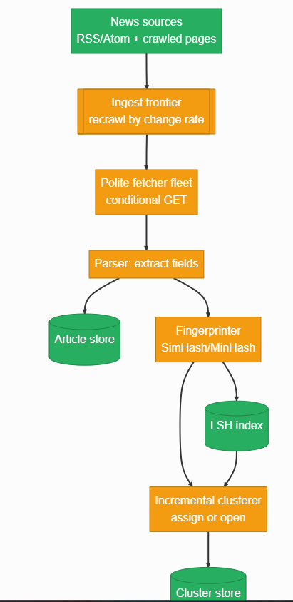
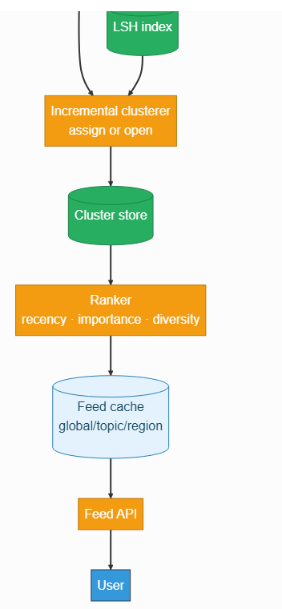
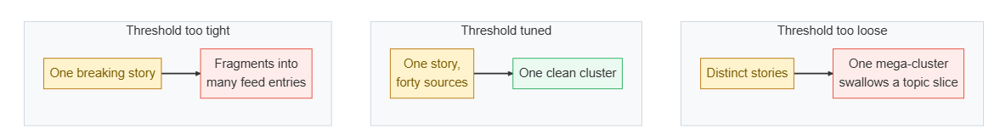
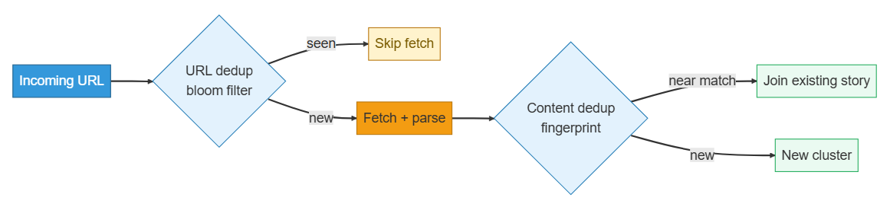
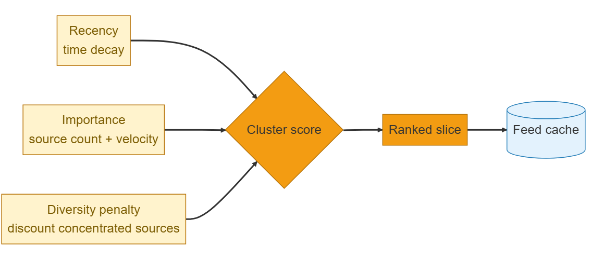

# Design a News Aggregator

Source: https://systemdesignschool.io/problems/news-aggregator/solution

> Note on fidelity: this page is built from prose sections plus several JS-interactive widgets (an incremental-clustering step-through simulation, design-checkpoint multiple-choice widgets, "How it's graded" Bad/Good/Great rating lists, and inline node/arrow diagrams) rather than static images. Every widget's full content — including the clustering step-through's states and the diagrams' box/arrow labels — has been transcribed below as text, in the same order it appears on the site. All 5 "Show Answer" quiz reveals were clicked open in a live browser and their full text captured. The site has no downloadable diagram image files (they're rendered live by JS/SVG, not `` files), so there are no image assets to save for this page.

Tags: Hard · Near-duplicate detection · Clustering · Web crawling

---

## Problem statement

Design a news aggregator: crawl thousands of news sources continuously, then present a fresh, ranked feed of what's happening.

In scope: ingesting articles from many sources on an ongoing basis, recognizing when many articles cover the same event and grouping them, and ranking and presenting a feed of those grouped stories. Out of scope: the reader UI, comments, paywall handling, and deep personalization or recommendation machine learning.

## Clarifying questions

- **What are the sources?** RSS/Atom feeds plus crawled news sites — assume tens of thousands of publishers. The fetch mechanics reuse the same problem as Web Crawler.
- **One shared feed, or personalized per user?** Assume a shared, ranked feed: global, plus per-topic and per-region slices. Deep personalization is a separate system to name and defer.
- **How fresh must it be?** Breaking news should surface within a few minutes. Freshness drives both the recrawl policy and how clustering has to work incrementally.
- **Exact duplicates only, or near-duplicates too?** Both. Syndication gives byte-identical copies, which is the easy case. The hard case is a reworded or lightly edited version of the same story — which is why the design needs a similarity threshold, not exact matching.
- **Reader UI, comments, paywalls?** Out of scope — this system is ingest, then dedup and cluster, then ranked feed.

## What makes this problem distinctive

Modeling this as "fetch each source's feed and list the items by time" fails for two separate reasons. The first is familiar: tens of thousands of sources and millions of articles a day is a crawl-at-scale problem. The second is the part that's easy to miss: when one event breaks, twenty different outlets publish about it within minutes of each other. A feed that just sorts by time shows the same story twenty times in a row.

The system has to recognize that twenty articles, arriving from twenty different sources at twenty different moments, describe one event — and it has to do that without comparing every new article against every article it has ever seen, since that comparison count grows far faster than the article count itself.

**Ingest vs egress.** Ingest is the rate articles arrive from crawled sources; egress is feed reads. Ingest is where the real cost lives here. Egress is a shared, cacheable read, so it can be made far cheaper than ingest, though it still scales with traffic and cache misses.


Millions of articles/day from many sources force crawling at scale, politely, kept fresh, which is resolved by a prioritized, recrawl-aware pipeline. Twenty sources covering one event within minutes forces recognizing duplicates without comparing every pair, which is resolved by fingerprints found through bucketed lookup.

## Key concepts

This section covers the concepts needed to solve this problem — prerequisites for the design work that follows.

### Similarity fingerprints (SimHash / MinHash)

A cryptographic hash changes completely if even one word changes, so it only ever catches byte-identical copies. A similarity hash does the opposite: it produces a fingerprint where similar content yields a similar fingerprint. **SimHash** builds a fixed-length signature (say, 64 bits) from an article's weighted token set, so two near-duplicate articles differ in only a handful of bits — a small Hamming distance (the count of differing bit positions). **MinHash** instead estimates how much two articles' word-shingle sets overlap. Either way, "are these the same story?" turns into "are these two fingerprints close?" — a distance check instead of a full-text comparison.


'Quake hits city' and 'earthquake hits city' run through a crypto hash produce totally different hashes and look unrelated, while the same two inputs run through a similarity hash produce fingerprints that differ by only a few bits — a small distance meaning the same story.

### Locality-sensitive hashing (LSH)

Even with fingerprints, comparing one new article against every existing article is still quadratic — for a million articles, up to a trillion comparisons. **Locality-sensitive hashing (LSH)** avoids that by splitting each fingerprint into several bands and hashing each band separately; two articles that share even one band's hash land in the same bucket. Only articles sharing a bucket ever get compared in full, so each new article only checks a handful of candidates instead of the whole corpus. That lookup stays cheap on average as the corpus grows, provided the bands are tuned and hot buckets are watched.


Article A (band1 · band2 · band3) and article B (band1 · bandZ · band3) both match on hash(band1) and hash(band3), landing in a shared bucket as a candidate pair, which is then verified by checking that the fingerprint distance is below threshold.

### Incremental clustering

Because articles never stop arriving, the system can't afford to re-cluster the entire corpus every time freshness matters. **Incremental clustering** processes one article at a time as it streams in: look up its LSH candidates, and if the closest existing cluster is within a similarity threshold, add the article to it; otherwise open a brand-new cluster. This keeps the cost of processing a new article near-constant on average — bounded by the candidate set size — rather than growing with the corpus.

**Interactive step-through widget** (controls "Play / Step / Reset"; state: "article 0/7"; "arriving article" panel shows e.g. "a1 from Reuters — bucket 'eq7x'"; "clusters (stories)" panel; initial description "Waiting for the first article to arrive.")

The widget streams seven articles one at a time. Watch how articles whose fingerprints hash into the same LSH bucket join an existing cluster, while an article with no bucket-mate opens a new one — no article is ever compared against the full set of everything seen so far.

> **Key idea.** A similarity fingerprint turns "same story?" into a distance check; LSH turns that distance check into a bucketed lookup instead of an all-pairs scan — together they make deduplication affordable at crawl scale.

## 1. Requirements

### 1.1 Functional requirements

- **Ingest** articles from many sources (RSS/Atom feeds and crawled pages) continuously.
- **Deduplicate and cluster**: recognize when many articles cover the same story and group them into one cluster.
- **Rank and present a feed** of clusters, freshest and most important first, with source diversity.
- **Categorize** articles by topic (world, tech, sports) so the feed can be sliced.

### 1.2 Non-functional requirements

- **Freshness.** Breaking news should appear within a few minutes of publication — the headline property of a news product.
- **Dedup quality.** One story should show as one cluster. Over-merging (two distinct stories fused together) and under-merging (one story split across many entries) are both failures a reader notices immediately.
- **Scale.** Tens of thousands of sources, millions of articles a day; clustering has to stay near-linear in article count, not quadratic.
- **Graceful degradation.** If clustering or ranking falls behind, serve the last good feed rather than an error.

### 1.3 The binding constraint

Freshness is non-negotiable — a news feed running an hour behind is worthless. But the property that actually shapes the architecture is the cost of clustering: deciding, for every one of millions of daily articles, which existing story it belongs to. The two collide directly: the fresher the feed needs to be, the more often clustering has to run, and naively comparing each article against every other article gets more hopeless the more the system ingests. The resolution is fingerprints plus LSH plus incremental clustering — assigning each new article to a story in near-constant time as it streams in, so freshness and scale stop fighting each other.

## 2. Back-of-the-envelope estimation

| Input / Output | Value |
|---|---|
| Sources (thousands) | 50K |
| Articles / source / day | 20 |
| Candidates / LSH bucket | 10 |
| Articles / day | 1.0M *(50K sources × 20/day)* |
| All-pairs comparisons / day | 1.0T *(quadratic — infeasible)* |
| LSH comparisons / day | 10M *(100K× fewer than all-pairs)* |

`1.0M² = 1.0T` vs `1.0M × 10 = 10M`. All-pairs comparison grows with the square of article count. LSH bucketing makes each article's cost independent of corpus size — near-linear instead of quadratic.

Assume roughly 50,000 sources, each publishing about 20 articles a day — illustrative anchors, not measured facts. That's `50,000 × 20 = 1 million` articles ingested per day.

Finding duplicates naively means comparing each article against every other one: for a single day's articles, that's on the order of `1,000,000 × 1,000,000 = 1 trillion` comparisons — no fleet of machines does that. LSH instead compares each article only against its own bucket-mates, say around 10 candidates on average, giving roughly `1,000,000 × 10 = 10 million` comparisons a day — about five orders of magnitude fewer, and near-linear in article count instead of quadratic.

On the read side, assume roughly 10 million daily readers each checking the feed about 10 times a day: `10M × 10 = 100 million` reads a day, or on the order of 1,200 reads per second on average. Because the feed is shared — every reader asking for the same slice gets the same ranked list — a small set of cached copies serves a large fraction of reads. How large depends on hit rate and update frequency, but this read number matters far less than the ingest side.

> **Key idea.** The expensive resource here is the clustering compute, not the read rate. All-pairs comparison is quadratic in article count; fingerprints plus LSH bring it down to near-linear, which is what makes clustering affordable at crawl scale.

## 3. API design

**Design checkpoint (multiple choice):** *"A reader's feed should show 'earthquake: 40 sources' as one entry, not forty separate rows. What does the feed endpoint actually need to return?"* Options: (a) *A flat list of the forty raw articles, sorted by time*; (b) *Clusters — one entry per story, each carrying a source count and a representative lead article.* The design's answer is (b).

### `GET /feed`

The feed returns clusters, each carrying a `source_count`. "Earthquake: 40 sources" is one entry, with a representative lead article standing in for the story — that collapse from many articles to one entry is the entire point of the product, so it shapes the response shape directly.

### `GET /clusters/{id}`

This expands a story into its member articles — the "40 sources" detail view — read directly from the cluster store.

There's no public write endpoint. Articles enter only through the internal ingest pipeline; there's no external `POST /articles`. The system's real interface is internal: fingerprint an article, look up LSH candidates, then assign it to an existing cluster or open a new one. That internal pipeline, built out in the next two sections, is where the actual design work lives — the public surface is deliberately thin.

The feed query is cacheable by construction: topic, region, and cursor together key a shared ranked list, and the identical response serves every reader asking for that same slice.

## 4. Data model

Start with the one obvious entity: an article ingested from a source.

- `Article`: `string article_id`, `string url`, `string source_id`, `string title`, `string content`, `timestamp published_at`

But many articles cover the same story — twenty outlets publish about one earthquake, and the Article entity has no way to record that twenty of them describe the same event. A feed built directly from articles shows that story twenty times. That grouping needs a new entity: the cluster, representing one story.

- `Cluster`: `string cluster_id`, `string lead_article_id`, `string topic`, `int source_count`, `timestamp first_seen`, `timestamp last_updated`, `float score` — relationship: many `Article` to one `Cluster`

But deciding which cluster an article belongs to can't mean comparing full article bodies pairwise — that's the quadratic cost from Step 1 — and exact hashing misses near-duplicates, since a reworded version of the same story has entirely different bytes. Each article needs a compact fingerprint, a similarity hash whose value stays close for near-duplicate content.

- `Article` (extended): `bytes fingerprint`

But a fingerprint alone still needs a way to find its near-matches without scanning the whole corpus. That's the LSH index: it buckets fingerprints so similar ones collide, and a lookup returns only a handful of candidates worth a closer comparison.

- `LshIndex`: `string bucket_key`, `list candidate_ids`

Finally, the feed itself: a reader reads ranked clusters, so the feed is simply an ordered list of cluster IDs per slice — global, topic, or region — derived from and rebuilt out of the cluster store.

Where each entity lives follows from how it's used. Articles sit in a sharded store keyed by article ID, sharded by URL hash, since it's the durable source of truth; large bodies can go to object storage with metadata staying in a database. The fingerprint and LSH index live in a fast in-memory index on the hot ingest path, sharded by bucket key, since the access pattern is a candidate lookup, not a scan. The cluster store holds membership and the aggregates ranking needs — source count, timestamps. The feed itself lives in a cache: a read-optimized, shared, ranked list rebuilt from clusters.

> **Key idea.** The cluster is forced by the article entity's inability to express "these are one story"; the fingerprint and LSH index are forced, in turn, by needing to decide cluster membership without a full pairwise comparison.

## 5. High-level design

Start with the simplest thing that could work: one server polls each source's feed and lists the items sorted by time.


News sources (RSS/Atom) feed a fetcher, which sorts items by time into the user feed.

Four things break the moment this faces real traffic: one fetcher can't keep up with tens of thousands of sources and millions of articles a day, and polling every source blindly hammers them while wasting work on unchanged feeds; when a story breaks, the same event arrives from twenty sources and the time-sorted list shows it twenty times; a raw time sort isn't a useful feed on its own, since readers want the important stories, fresh, without any one publisher dominating; and articles arrive continuously with a freshness budget measured in minutes, so reprocessing the whole corpus on every update is out of the question. Fix them one at a time.

### Fix 1: a crawl/ingest pipeline

Put sources behind a prioritized, polite fetch pipeline — the same frontier and per-host politeness used in Web Crawler, reused wholesale rather than rebuilt. The news-specific twist is that this is mostly recrawl: the scheduler polls each feed according to how often it actually changes, using a conditional GET (checking etag/last-modified headers) to avoid re-downloading unchanged feeds. A parser then extracts each article's fields and passes it downstream.

### Fix 2: fingerprint, then LSH, then cluster

Each parsed article gets a content fingerprint via SimHash or MinHash. That fingerprint is looked up in the LSH index to fetch a handful of candidate near-duplicates cheaply, sidestepping the all-pairs comparison entirely. If a candidate is close enough, the article joins that cluster; otherwise it opens a new one.


A parsed article goes through fingerprinting (SimHash/MinHash) into the LSH index, which checks for candidates: on a near match the article is assigned to an existing cluster, on none a new cluster is opened, and both paths feed into the cluster store.

### Fix 3: categorize, rank, and cache the feed

Slicing the feed by topic and region needs each cluster tagged first. A lightweight classifier runs once per cluster over its lead article's text, assigning a topic label (world, tech, sports); region is derived from the source's home region and any location signals in the content. Both run once per cluster, not once per member article, since every article in a cluster describes the same event.

A ranker then scores each tagged cluster by recency, importance (source count and how fast it's growing), and source diversity, and writes an ordered list of cluster IDs per slice — global, topic, region — into a feed cache. Because the feed is shared, one cached copy serves nearly all readers.

### Fix 4: incremental clustering

The fingerprint-then-LSH-then-assign step runs per article as it streams in, either assigning it to an existing cluster or opening a new one — so freshness costs one lookup per article rather than a global re-clustering pass. Ranking then only needs to update the specific clusters that changed.

**Composing all four fixes:**

```text
News sources (RSS/Atom + crawled pages)
        │
        ▼
Ingest frontier (recrawl by change rate)
        │
        ▼
Polite fetcher fleet (conditional GET)
        │
        ▼
Parser: extract fields ──▶ Article store
        │
        ▼
Fingerprinter (SimHash/MinHash)
        │
        ▼
LSH index
        │
        ▼
Incremental clusterer (assign or open)
        │
        ▼
Cluster store
        │
        ▼
Ranker (recency · importance · diversity)
        │
        ▼
Feed cache (global/topic/region)
        │
        ▼
Feed API ──▶ User
```






Combined architecture: news sources (RSS/Atom + crawled pages) flow into the ingest frontier (recrawl by change rate), then the polite fetcher fleet (conditional GET), then the parser, which extracts fields into the article store; the article also flows to the fingerprinter (SimHash/MinHash), the LSH index, the incremental clusterer (assign or open), and the cluster store, then to the ranker (recency, importance, diversity), the feed cache (global/topic/region), the feed API, and finally the user.

These boxes are the data model's homes made concrete. Articles land in the article store; the fingerprint and LSH index are computed by the fingerprinter and searched at the clustering gate; clusters live in the cluster store; the per-slice feed is the feed cache. One thing from the data model splits further here: a fingerprint is computed by the fingerprinter but indexed separately in the LSH store, because writing a fingerprint and searching for its near-matches are genuinely different jobs running on different paths.

> **Key idea.** Each of the four fixes traces to a concrete failure of the naive poll-and-sort design — ingest scale, duplicate stories, feed usefulness, and freshness under continuous arrival — not to a feature checklist.

## 6. Deep dives

### 6.1 Near-duplicate detection and clustering

**Design checkpoint (multiple choice):** *"An earthquake breaks; forty outlets publish within ten minutes, some word-for-word syndicated, some reworded. Why isn't an exact content hash enough to group them?"* Options: (a) *It is enough — just hash the article body and group by equality*; (b) *An exact hash changes completely if even one word differs, so it only catches byte-identical syndication and misses every reworded copy.* The design's answer is (b).

Similarity hashing solves what exact hashing can't: SimHash and MinHash are built specifically so that near-duplicate content produces near-identical fingerprints, turning "same story?" into a distance check rather than a full comparison (Key Concepts covers the mechanism). Even so, comparing one new article's fingerprint against every existing fingerprint is still quadratic — LSH is what makes that check cheap, bucketing similar fingerprints together so only bucket-mates are ever compared in full.

Incremental clustering is the assign-or-open decision applied per article as it streams in: look up LSH candidates, and if the closest cluster is within the similarity threshold, assign the article to it and update that cluster's lead article, source count, and timestamps; otherwise open a new cluster (the animation in Key Concepts above shows exactly this decision running article by article). This costs one lookup per article, which is why freshness stays affordable even as the corpus keeps growing.

The similarity threshold is the single knob that trades accuracy against scale. Loosen it — accept more distant matches as duplicates — and distinct stories start merging into one bloated cluster. Tighten it, and one real story fragments into several separate feed entries. The LSH band and row counts trade the same thing from the other direction: recall (finding true duplicates) against candidate volume (compute cost). In practice this threshold gets tuned against a labeled sample of known duplicate/non-duplicate pairs, watching how the cluster-size distribution shifts.

Two failure modes follow directly from mistuning that threshold, in opposite directions.



```text
One breaking story  ──▶ Threshold too tight ──▶ Fragments into many feed entries
Same story           ──▶ Threshold tuned    ──▶ One clean cluster (one story, forty sources)
Distinct stories     ──▶ Threshold too loose ──▶ One mega-cluster swallows a topic slice
```
One breaking story with the threshold too tight fragments into many feed entries; the same story with the threshold tuned forms one clean cluster (one story, forty sources); distinct stories with the threshold too loose collapse into one mega-cluster that swallows a topic slice.

A too-loose threshold creates a runaway mega-cluster that swallows unrelated stories and poisons an entire topic slice — the fix is capping cluster size and alerting on sudden growth. A too-tight threshold splits a genuinely breaking story into duplicates — the exact symptom the whole system exists to prevent. A hot breaking story is also a hot cluster operationally: millions of reads hit one `cluster_id`, and every new article about it contends to join — caching the cluster's expanded view and batching membership updates absorbs that. The signals worth watching: the cluster-size histogram, the singleton rate (too many one-article clusters means under-merging), the largest-cluster size (a spike means over-merging), and precision/recall measured against a labeled duplicate set.

**Strong-answer criteria.** A strong answer explains fingerprints as a distance check and LSH as the mechanism that avoids all-pairs comparison, treats the similarity threshold as the explicit knob trading over-merging against fragmentation, and names both failure directions with their monitoring signals.

**Near-duplicate detection: how it's graded:**
- **Bad** — Exact-hash the article body and group by equality
- **Good** — Similarity fingerprints with an LSH index for candidate lookup
- **Great** — Incremental assign-or-open, a tuned threshold, and named failure modes

### 6.2 The ingest pipeline, tuned for freshness

**Design checkpoint (multiple choice):** *"A news aggregator's ingest looks like a web crawler's. What's actually different about it, given a freshness budget measured in minutes?"* Options: (a) *Nothing is different — reuse the crawler frontier exactly as-is*; (b) *It's mostly recrawl of known feeds rather than discovery of new URLs, so the scheduler polls by change rate instead of exploring outward.* The design's answer is (b).

Ingest reuses the crawler's frontier wholesale: a prioritized, deduplicated, per-host-polite queue feeding a fetch fleet. URL deduplication uses a bloom filter as a memory-cheap pre-check, backed by an exact seen-set since bloom filters can return false positives. So a URL seen a million times gets fetched close to once, and per-host crawl-delay plus robots.txt rules keep the fetcher from getting banned. None of that gets rebuilt here — it's cited and reused.

The news-specific twist is that ingest is mostly recrawl, not discovery. A general web crawler spends most of its effort finding new URLs; a news aggregator mostly re-polls a known, fixed set of feeds. The scheduler estimates each feed's change rate: it polls fast-moving feeds like a constantly-publishing wire service every few minutes, and slow ones far less often. It uses a conditional GET so an unchanged feed answers with a 304 Not Modified — the request still happens, but the body re-download and all downstream parsing are skipped. Freshness, in other words, is a scheduling policy applied to the same frontier concept, not a separate mechanism.

Two distinct dedup steps run in a fixed order, at two different pipeline stages, keyed on different things.



```text
Incoming URL ──▶ URL dedup (bloom filter)
                        │
          ┌─────────────┴─────────────┐
        seen                         new
          │                            │
          ▼                            ▼
     Skip fetch              Fetch + parse ──▶ Content dedup (fingerprint)
                                                          │
                                        ┌─────────────────┴─────────────────┐
                                  near match                              new
                                        │                                    │
                                        ▼                                    ▼
                            Join existing story                      New cluster
```
An incoming URL goes through URL dedup (bloom filter): if seen, the fetch is skipped; if new, it is fetched and parsed, then passed through content dedup (fingerprint) — a near match joins an existing story, and no match opens a new cluster.

URL dedup with a bloom filter happens before fetch, so the same link is almost never downloaded twice — races and retries can still cause an occasional duplicate fetch. Content-fingerprint dedup happens after parsing, so syndicated copies published at different URLs still collapse into one story. They key on genuinely different things — an address versus actual content — and both are necessary; neither can substitute for the other.

Two failure modes matter operationally. A source changes its feed format or goes dark — parse failures need to be isolated per source so one bad feed doesn't stall the whole pipeline, with an alert firing if a source stops producing entirely. A source floods, whether from a spam feed or a hacked one — per-source rate caps and a sanity bound on articles-per-source-per-interval catch that. The top-line freshness metric to watch is ingest lag: the time from an article's publication to its appearance in the feed, alongside per-source fetch success and parse-error rates.

**Strong-answer criteria.** A strong answer explicitly reuses the crawler frontier rather than rebuilding it, names recrawl-by-change-rate as the actual news-specific difference, keeps URL dedup and content dedup as two separate steps at two separate pipeline stages, and tracks ingest lag as the primary freshness metric.

**Ingest pipeline: how it's graded:**
- **Bad** — Poll every feed on a fixed global interval, one parser for everything
- **Good** — Reuse the crawler frontier with per-host politeness and URL dedup
- **Great** — Change-rate-driven recrawl, isolated failures, flood caps, ingest-lag monitoring

### 6.3 Ranking and feed generation

**Design checkpoint (multiple choice):** *"Every cluster has a source count and timestamps. Why does this shared feed cache so much better than a per-user social feed?"* Options: (a) *It doesn't — both need identical per-user computation*; (b) *Every reader of a given slice (global/topic/region) gets the exact same ranked list, so there's no per-user fan-out at all.* The design's answer is (b).

Three separate signals feed into one score, which orders each slice and lands in the cache.

```text
Recency (time decay)                          ─┐
Importance (source count + velocity)           ├──▶ Cluster score ──▶ Ranked slice ──▶ Feed cache
Diversity penalty (discount concentrated       ─┘
  sources)
```
Recency (time decay), importance (source count plus velocity), and a diversity penalty (discounting concentrated sources) combine into a cluster score, which produces a ranked slice that is written to the feed cache.

A cluster's score blends three signals. Recency is a time decay — for example, a cluster's score halves every few hours, so day-old stories naturally drop out of a "what's happening now" feed. Importance rises with source count and velocity: a story twenty outlets picked up within ten minutes matters more than a single blog post nobody else covered. A source-diversity penalty discounts a cluster's score in proportion to how concentrated its sources are: if 8 of a cluster's 10 member articles all come from the same wire service, the cluster is scored as if it had far fewer than 10 independent confirmations, so one outlet re-publishing the same story eight times can't out-rank a story genuinely covered by ten different publishers.

The feed is shared, which is what makes it cache so well. Unlike News Feed, there's no per-user fan-out here at all — every reader asking for "global" or "tech" gets the identical ranked list. The ranker recomputes each slice periodically, and on major cluster changes, writing the result to the feed cache; a read is then just a single cache hit. This is exactly why the feed's read rate was the easy number back in estimation.

Even after clustering, a light read-time dedup pass acts as a safety net: two clusters might still be near-duplicates that the similarity threshold missed, and this pass collapses them before display, so residual duplicates rarely reach readers even when upstream clustering was imperfect.

Under degradation, the rule is simple: if the ranker falls behind, keep serving the last good cached feed. A feed stale by a few minutes beats an empty one. The signals worth watching: feed staleness (the age of the cached slice), the rate of residual duplicates caught at read time (a rising rate signals slipping clustering quality), and click-through as the actual quality signal readers respond to.

**Strong-answer criteria.** A strong answer blends recency, importance, and a source-diversity penalty into the cluster score, names the shared-feed-cache-versus-per-user-fan-out contrast with News Feed explicitly, and keeps a read-time dedup pass as a safety net against clustering misses.

**Ranking and feed generation: how it's graded:**
- **Bad** — Sort clusters by recency alone; recompute per user on every request
- **Good** — Rank by recency and importance; cache a shared feed per slice
- **Great** — Adds a diversity penalty and a read-time dedup safety net

## 7. Variants

### 10x scale

Ten times the sources means roughly 500,000 sources and about 10 million articles a day. This is exactly where the clustering choice earns its keep: naive all-pairs comparison would climb to `10M × 10M = 100 trillion` comparisons a day, a hundred times worse. LSH instead stays at roughly `10M × 10 = 100 million` comparisons, using the same illustrative 10-candidates-per-bucket figure from estimation — only ten times worse, tracking the article count directly rather than its square. The fingerprint and LSH indexes shard further by bucket key; the cluster store and ingest fleet scale linearly. The feed cache barely moves at all, since it's shared — more readers just means more hits on the same cached slices.

### Per-topic and per-region slices

The feed is already sliced by topic and region (Fix 3's classifier tags each cluster once); adding more slices multiplies the number of cached feeds, but not the clustering work itself, since clustering happens globally and slices are just ranked views over the same underlying clusters.

### Personalized feed

Adding per-user ranking turns the shared cache into a genuinely per-user problem, pulling in the same machinery as News Feed: candidate generation from the ranked clusters, followed by a per-user re-rank on read. The clustering layer itself stays unchanged — personalization sits entirely on top of clusters, scoring which stories a given user sees, while the deep recommendation model remains its own separate, deferred system.

## 8. The transferable pattern

A news aggregator is an ingest pipeline feeding a near-duplicate-clustering stage feeding a ranked, shared feed — the same ingest problem as Web Crawler and the same ranking problem as News Feed, joined by one new lever: same-story clustering. The move that makes it tractable is turning an all-pairs quadratic comparison into a near-linear one with a similarity fingerprint and locality-sensitive hashing, then keeping the result fresh by clustering incrementally as articles stream in.

The same shape recurs anywhere many near-identical items need collapsing into one, kept current: plagiarism and spam detection, image and video near-duplicate detection, log deduplication, entity resolution. Recognizing that "aggregate the news" really means "crawl many sources, collapse twenty copies of a story into one cluster without comparing every pair, then rank the clusters" is what turns the problem into just three pieces: a fingerprint, an LSH index, and an incremental clusterer.

## Review

A news aggregator crawls tens of thousands of sources through a politeness-aware, recrawl-tuned ingest pipeline reused from web crawling. Every parsed article gets a similarity fingerprint, looked up through an LSH index that returns only a handful of candidates instead of the whole corpus — turning what would be a quadratic all-pairs comparison into a near-linear one. An incremental clusterer assigns each article to an existing story or opens a new one as it streams in, keeping freshness affordable. A ranker scores clusters by recency, importance, and source diversity, and writes the result into a shared, cacheable feed — since every reader of a given slice sees the identical ranked list, this is by far the cheaper half of the system.

## Quiz

**News Aggregator — check your understanding** ("Hide All" / "Reveal All" toggle) — 5 questions, each with a "Show/Hide Answer" button. Full text of every question and its revealed answer:

**1) Why does an exact content hash fail to detect that a syndicated, reworded article is a duplicate of the original?**
An exact hash changes completely if even a single word differs, so it can only ever catch byte-identical copies. A reworded version of the same story has different bytes even though the meaning is unchanged, so it produces a completely different exact hash and is missed entirely.

**2) Why is comparing every new article against every existing article infeasible at this scale, and what makes LSH avoid that cost?**
All-pairs comparison grows with the square of the article count — at roughly a million articles a day, that's on the order of a trillion comparisons, which no fleet can perform. LSH buckets similar fingerprints together so a new article only needs to compare against its own bucket's candidates, a small, roughly fixed number regardless of how large the total corpus is.

**3) What does loosening the similarity threshold too far do to the feed, and what does tightening it too far do?**
A threshold that's too loose merges distinct, unrelated stories into one runaway mega-cluster that can swallow an entire topic slice. A threshold that's too tight fragments a single real story into multiple separate feed entries — the exact duplicate-story problem the system exists to prevent.

**4) Why does the ingest pipeline need two separate deduplication steps — URL dedup and content-fingerprint dedup — instead of just one?**
URL dedup with a bloom filter runs before fetching, preventing the same link from being downloaded twice, but it can't catch the same story published at two different URLs. Content-fingerprint dedup runs after parsing and catches exactly that case — syndicated copies at different URLs collapsing into one story — so both are needed since they key on different things.

**5) Why does this feed cache far more effectively than a per-user social feed like News Feed?**
Every reader requesting the same slice — global, a topic, or a region — receives the exact same ranked list of clusters, so there is no per-user fan-out or per-user computation at all. One cached copy of each slice serves nearly every reader, unlike a social feed where each user's timeline is materialized individually.

## Sources and further reading

- [Introduction to Information Retrieval, Ch. 20: Web crawling and indexes — Manning, Raghavan & Schütze (Stanford NLP)](https://nlp.stanford.edu/IR-book/) — crawler architecture and the URL frontier that the ingest pipeline reuses.

---

### System Design Master Template (embedded video)

YouTube embed present at the bottom of the page (same "System Design Master Template" embed used across the site's problem pages).

