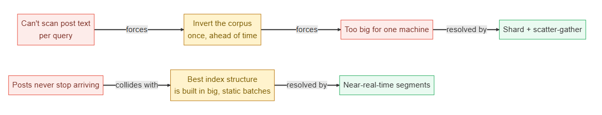
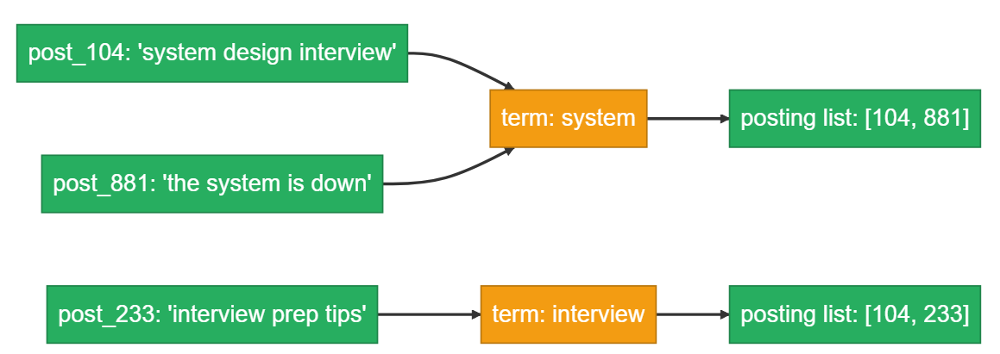
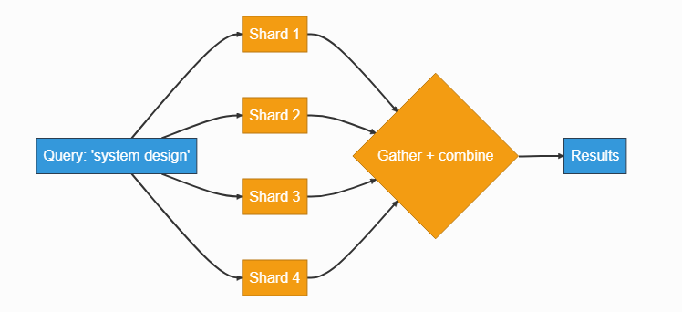
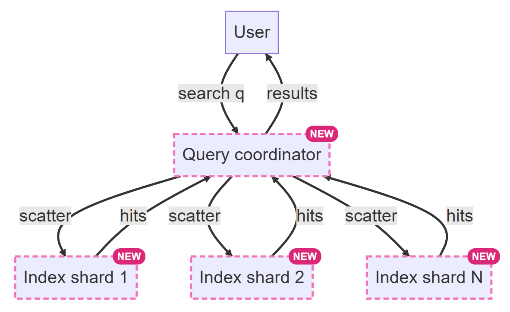
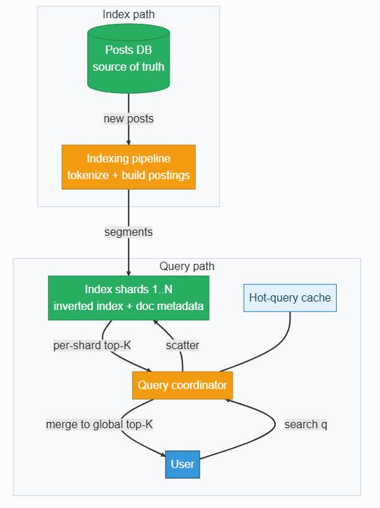
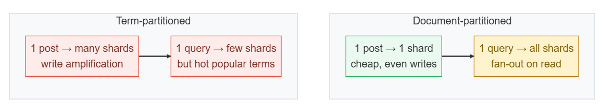
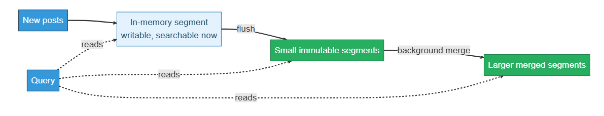

# Design Post Search (Full-Text Search)

Source: https://systemdesignschool.io/problems/post-search/solution

> Note on fidelity: this page is built from JS-interactive widgets (a K-way top-K merge step-through widget shown twice, grading accordions under each deep dive, collapsible API request/response panels, and a quiz with click-to-reveal answers) rather than static images, on the same lazy-loaded template as the rate-limiter reference page. Everything behind those interactions — all quiz answers and every expanded request/response body — was expanded live (via "Reveal All" and by opening each "Request & response" panel) and is transcribed below as text, in the same order it appears on the page. There are no downloadable diagram image files on this site (diagrams are live JS/SVG widgets, not `` files).

Tags: Hard difficulty · Inverted index · Sharding · Ranking

---

## Problem statement

Design search over a social product's posts: a user types a multi-word query and gets back the most relevant posts, ranked, out of a corpus of billions that grows every second.

In scope: indexing new posts so they become searchable, answering a full-text keyword query with ranked results, and keeping the index current as posts keep arriving. Out of scope: deep personalization, image or video search, spell-correction and query understanding, and the internals of the learned ranking model.

## Clarifying questions

- **What kind of query?** Full-text keyword search over post text, multi-word, ranked by relevance — not prefix completion of a half-typed word, which is a different system (Typeahead). Assume the user submits a whole query.
- **What ranks the results?** Text relevance, recency, and engagement, blended into one score. The learned ranking model's internals are a separate problem; name and defer.
- **How fresh must results be?** A new post should be findable within seconds, not on tomorrow's batch rebuild. This single answer forces most of the indexing design.
- **How big is the corpus?** Billions of posts, always growing, so the index cannot live on one machine and cannot be rebuilt from scratch on every change.
- **Personalization, media, spell-correction?** Defer all three — each sits in a layer around this core system.
- **Exact keywords, or semantic meaning?** Keyword and boolean matching is the base case; semantic (vector) search is a variant that keeps the same overall shape.

## What makes this problem distinctive

A generic search box tempts a query like `WHERE text LIKE '%query%'` against a posts table. That query can't use a standard B-tree index — a leading wildcard forces a full scan — and at billions of rows it's not a slow query, it's an impossible one within any real latency budget. Specialized text indexes (trigram, full-text) exist precisely to avoid that scan, and they are variants of the structure this design builds.

The system has to work backwards from that constraint: instead of scanning post text per query, it inverts the corpus once, ahead of time, into a structure that maps each word to the posts containing it. That structure quickly outgrows a single machine, so it has to be split across many, and every query becomes a fan-out to all of them rather than a lookup on one. Layered on top of that is a second tension: posts never stop arriving, but the index structure works best when built in large, efficient, unchanging pieces. Making a brand-new post searchable within seconds fights directly against that efficiency. Reconciling the two is the core of the write path.

> **Ingest vs egress.** Ingest here is new posts entering the index (the write path); egress is search queries reading it back (the read path). Both matter, but the tension between them — freshness on ingest vs efficient batch structure on egress — is what shapes the design.


```text
"Can't scan post text per query"
        │ forces
        ▼
"Invert the corpus once, ahead of time"
        │ collides with
        ▼
"Too big for one machine"
        │ resolved by
        ▼
"Shard + scatter-gather"


"Posts never stop arriving"
        │ forces
        ▼
"Best index structure is built in big, static batches"
        │ resolved by
        ▼
"Near-real-time segments"
```
"Can't scan post text per query" forces "invert the corpus once, ahead of time", which collides with "too big for one machine", resolved by "shard + scatter-gather". "Posts never stop arriving" forces "best index structure is built in big, static batches", resolved by "near-real-time segments".

## Key concepts

This section covers the concepts needed to solve this problem — prerequisites for the design work that follows.

### The inverted index and posting lists

An inverted index turns the natural direction of the data inside out. Instead of storing, for each post, the words it contains, it stores, for each word, the list of posts that contain it. That per-word list is a **posting list**: for the term "system", the posting list might be `[post_104, post_881, post_233, ...]`, often carrying extra signal per entry like how many times the term appears in that post. A multi-word query becomes intersecting or unioning a handful of posting lists — a set operation over lists that are already sorted — instead of reading a single post's text at all. See database indexing for the general indexing concept this extends.

```text
post_104: "system design interview"  ─┐
post_881: "the system is down"        ├──▶ term: system    ──▶ posting list: [104, 881]
post_233: "interview prep tips"      ─┘

post_104: "system design interview"  ─┐
post_233: "interview prep tips"      ─┴──▶ term: interview ──▶ posting list: [104, 233]
```
Building an inverted index: post_104 ("system design interview"), post_881 ("the system is down"), and post_233 ("interview prep tips") are tokenized so that the term "system" maps to posting list [104, 881], and the term "interview" maps to posting list [104, 233].

### Document-partitioned sharding

The inverted index for billions of posts runs on the order of tens of terabytes and does not fit on one machine, so it has to be sharded. The natural split is **document-partitioned**: each shard owns a subset of posts and holds its own small, self-contained inverted index over just those. Indexing a new post touches one shard (plus its replicas). The cost shows up on reads — since a single term's matching posts are spread across every shard, a query has to **scatter-gather**: fan out to every shard, collect what each one finds, and combine the results.

```text
                          ┌──▶ Shard 1 ──┐
                          ├──▶ Shard 2 ──┤
Query: "system design" ──┼──▶ Shard 3 ──┼──▶ Gather + combine ──▶ Results
                          └──▶ Shard 4 ──┘
```
The query "system design" scatters to Shard 1, Shard 2, Shard 3, and Shard 4, which are then gathered and combined into results.

### Scatter-gather and top-K

Fanning a query out to a thousand shards and shipping every match back would swamp the network. Instead, each shard ranks its own local matches and returns only its best few — its top-K — and a coordinator merges those small, already-sorted lists into one global top-K. Merging sorted lists this way only needs to look at each list's current head at any moment, which is why it stays cheap even with many shards.

**Interactive top-K-merge widget** (Play / Step / Reset): default state shows four shards each holding a sorted top-3: Shard 1: P104—97, P881—82, P233—61; Shard 2: P552—91, P019—74, P760—58; Shard 3: P347—88, P901—79, P118—65; Shard 4: P622—95, P404—70, P266—52. The coordinator holds each shard's local top-3, ready to merge, and building the "global top-5" panel below. Stepping through picks the single highest-scoring head across all shards into the growing global result at each step (so the merge order would be P622-95, P104-97, P552-91, P347-88, P881-82, ... continuing until 5 results are assembled).

The widget steps through exactly this merge: each shard's top-3 sits sorted and ready, and every step picks the single highest-scoring head across all shards into the growing global result.

> **Key idea.** Scanning text is replaced by walking an inverted index; the index is split by document so writes stay cheap, which pushes the fan-out cost onto reads — a cost contained by ranking locally and merging only the top few.

## 1. Requirements

### 1.1 Functional requirements

- **Index a post:** tokenize its text and add it to the inverted index so it becomes searchable.
- **Search:** given a multi-word query, return the best K matching posts, ranked.
- **Rank results** by a blend of text relevance, recency, and engagement.
- **Make a newly created post findable** within seconds of being posted.

### 1.2 Non-functional requirements

- **Low query latency.** A laggy search box is a broken feature; a fast 99th-percentile (p99) latency is the headline read-path requirement.
- **Freshness.** Near-real-time indexing — the gap between "posted" and "searchable" is measured in seconds, not hours.
- **Scale.** Billions of posts, growing forever; the index must shard and grow horizontally.
- **Graceful degradation.** Under load or partial failure, returning fewer or slightly staler results beats returning an error.

### 1.3 The binding constraint

Query latency and relevance are non-negotiable — results must come back fast and be genuinely good, or nobody trusts the search box again. But the property that actually drives the architecture is corpus scale and its constant growth: billions of posts that can't be scanned, forcing a sharded inverted index that some background process must keep current forever. Those two pull against each other most sharply at freshness. Making a brand-new post searchable within seconds works against the efficiency of building large, well-merged, immutable index segments — which is exactly why near-real-time indexing (deep dive 2) is the hardest part of the write path.

## 2. Back-of-the-envelope estimation

**Interactive estimation widget (default inputs):**

| Input | Default |
|---|---|
| Searches / day (millions) | 500M |
| Peak multiplier | 5× |
| Total index size (TB) | 50 TB |
| Index size / shard (GB) | 50 GB |

**Computed outputs:**

| Output | Value | Formula shown |
|---|---|---|
| Peak QPS | 29K/s | 5× average of 6K/s |
| Shards | 1K | 50 TB ÷ 50 GB per shard |
| Internal sub-queries / sec (scatter-gather) | 29M/s | peak QPS × shard count — every query hits every shard; 29K/s queries × 1K shards ≈ 29M/s shard sub-queries |

Shard count multiplies external QPS into internal fan-out. Fewer, bigger shards lower this fan-out but raise per-shard work — the tradeoff behind sharding the index at all.

Assume roughly 500 million new posts a day, each with around 300 bytes of text — an illustrative anchor, not a measured fact. New post text alone is `0.5B × 300 bytes ≈ 150 GB/day`, or about 55 TB a year; the inverted index built from it runs a similar order of magnitude, so tens of terabytes of new index data every year. That is already past what any single machine can hold.

On the read side, assume roughly 500 million searches a day. That's an average of about `500M / 86400 ≈ 5,800` queries per second, and at several times that for peak load, call it on the order of 30,000 queries per second (QPS).

The number that actually shapes the design is the fan-out. If the whole inverted index totals roughly 50 TB and each shard holds about 50 GB, that's `50TB / 50GB = 1,000` shards. Because the index is document-partitioned, every query must scatter to all of them — shard pruning by recency or term metadata can trim this in practice, but the baseline design pays the full fan-out. At 30K peak QPS that's on the order of `30,000 × 1,000 = 30 million` shard sub-queries per second. A single user query touches roughly a thousand machines. That's the number the rest of the design answers to: it's why each shard ranks and cuts to top-K before returning anything, and why one slow shard threatens every query in flight.

> **Key idea.** The index size forces sharding; the shard count then forces a fan-out on every single query — around a thousand-way scatter-gather per search — which is the constraint that ranking-and-cutting-to-top-K (deep dive 3) and shard-tail mitigation (deep dive 1) both exist to control.

## 3. API design

**Design checkpoint widget:** *"A generic REST resource has one job: fetch by ID. What does the search endpoint's input and output actually look like instead?"* Options presented: (a) *A post ID lookup, same as any resource GET*; (b) *A free-text query string in, a ranked list of posts with relevance scores out*; (c) *A full SQL query passed through directly*. (Correct: option (b), confirmed by the endpoint definition below.)

### 3.1 Search

`GET /search`

**Request & response (expanded):**

Request body: `?q={query}&k={20}&cursor={c}`

Response body: `{ results: [{post_id, score, snippet}, ...], next_cursor }`

The read path's one job that a generic create-read-update-delete API doesn't have is turning a text query into a ranked page of results over an index, not a lookup by key. `k` bounds the page size, and `cursor` continues a ranked scan rather than an arbitrary one.

Pagination uses a score cursor instead of an offset. An `OFFSET n` forces the database to scan and discard the first n results on every page — cost that grows with how deep the user pages — and the ranked result set can shift under an offset as new posts keep landing. A cursor that encodes the last result's score and post ID resumes from there cheaply, and stays far more stable than an offset as new posts arrive mid-scroll — fully frozen pages would need a point-in-time snapshot of the index.

### 3.2 Submit a post for indexing

`POST /index`

**Request & response (expanded):**

Request body: `{post_id, author_id, text, created_at}`

Response body: `202 Accepted`

Indexing is asynchronous and internal. Making a post searchable means updating the sharded inverted index through the indexing pipeline, and the poster's own request should never block on that. `POST /index` just hands the post to the pipeline and returns; freshness is delivered later by near-real-time segments (deep dive 2), not by waiting on a synchronous index write.

## 4. Data model

Start with the one thing that actually exists on write: a post.

```
Post
+string post_id
+string author_id
+string text
+timestamp created_at
```

But answering "which posts contain these words?" by reading text means scanning billions of rows per query — the impossible query from the problem statement. The fix is to store the relationship backwards: for each term, the posts that contain it.

```
InvertedIndex
+string term
+list postings          --- 1:many ---> Posting
                                          +string post_id
                                          +int term_freq
```

But the full index is tens of terabytes and won't fit one machine, so it has to shard. The natural cut is document-partitioned: each shard owns a subset of posts and holds a self-contained inverted index over just those.

```
Shard
+string shard_id
+InvertedIndex local_index
```

But ranking needs facts a posting list doesn't carry — a post's age and its engagement. Each shard also keeps a small metadata store, co-located, for its own posts.

```
Shard --- 1:many ---> DocMetadata
                        +string post_id
                        +timestamp created_at
                        +int engagement_score
                        +string author_id
```

Where each entity lives follows from how it's used. The sharded inverted index and its doc metadata sit together on the index nodes — hot terms in memory, the rest on solid-state disk — so ranking a shard's own matches never needs a cross-machine lookup. The post records remain the source of truth in the primary posts database; the index is a derived structure, rebuildable from those posts, which is exactly what lets it be replaced wholesale during a merge (deep dive 2) without any risk of losing data.

> **Key idea.** The inverted index is forced by the impossibility of scanning text; sharding it is forced by its size; co-locating doc metadata with each shard is forced by ranking needing to stay a local operation per shard.

## 5. High-level design

Start with the simplest thing that could work: one search service running a text query against a posts database.

```text
User ──▶ "search q" ──▶ Search service ──▶ Posts DB
```
Step 0: the user sends "search q" to the search service, which queries the posts DB.

Four things break the moment this faces real traffic: a leading-wildcard text match can't use an index and scans every row; even a proper inverted index is too big for one machine; new posts must be searchable within seconds, but posts never stop arriving; and a query can match millions of posts, so returning all of them is not an option. Fix them one at a time.

### Fix 1: build the index off the query path

Scanning text at query time is out. An indexing pipeline — a fleet of async jobs — reads posts, tokenizes their text, and builds the term-to-posting-list structure. A query now walks posting lists instead of scanning rows.

### Fix 2: shard the index and scatter-gather

The index is document-partitioned across roughly a thousand shards. A query coordinator scatters every query to all of them, and each shard searches only its own local inverted index — the fan-out sized in the estimation section.


### Fix 3: near-real-time indexing

A new post cannot wait for the next full index rebuild. Each shard keeps a small in-memory segment that new posts enter and that queries read immediately; a background job periodically flushes it to an immutable on-disk segment and merges segments together over time (deep dive 2). Freshness drops from a rebuild cycle measured in hours to a flush interval measured in seconds.

### Fix 4: rank on each shard, merge top-K

Shipping millions of matches back to the coordinator is hopeless. Each shard ranks its own hits — blending text relevance, recency, and engagement from its co-located doc metadata — and returns only its own top-K; the coordinator merges those small sorted lists into the global top-K (deep dive 3). A cache in front absorbs hot, repeated queries.

Composing all four fixes gives the full design — a read path that scatters, ranks, and merges, and a write path that keeps every shard's index fresh:



These boxes are the data model's homes made concrete. The sharded inverted index and per-shard doc metadata live on the index shards; the posts database is the source of truth the pipeline reads from and the index can always be rebuilt against. The single "inverted index" from the data model splits into two writers over time here: a fast in-memory segment written per post, and background-merged immutable segments written by compaction — one has to be fast to update, the other efficient to search.

> **Key idea.** Each of the four fixes traces to a concrete failure of the naive single-database design — impossible text scans, index size, freshness, and match volume — not to a feature checklist.

## 6. Deep dives

### 6.1 Sharding the inverted index: document vs. term partitioning

> **Design checkpoint.** *"You must split the index across machines. Partition by document (each shard owns some posts) or by term (each shard owns some words' full posting lists)? Which makes a query cheap, and which makes indexing a post cheap?"* Options: (a) *Document-partitioning makes indexing cheap (one shard per post); term-partitioning makes queries cheap but writes expensive*; (b) *Term-partitioning is strictly better on both axes*; (c) *Document-partitioning is strictly better on both axes*. (Correct: option (a), confirmed by the surrounding text.)

Document-partitioning is the default: each shard indexes a subset of posts and holds a self-contained index over them. Indexing a new post touches one shard (plus its replicas), and write load spreads evenly across shards. The cost lands on reads — a query for any term has to scatter-gather to every shard, since that term's matches are spread across all of them.

Term-partitioning looks tempting at first: each shard owns certain terms' entire posting lists, so a query for a few terms only touches those few shards, with far less fan-out. But indexing one post now writes to many different term-shards — one per distinct word in the post — popular terms create permanently hot shards, and a multi-word query has to ship long posting lists between shards just to intersect them. Write amplification and hot terms usually make this the harder system to run in practice.


```text
Term-partitioned:
  1 query ──▶ few shards, but hot popular terms
  1 post  ──▶ many shards, write amplification

Document-partitioned:
  1 query ──▶ all shards, fan-out on read
  1 post  ──▶ 1 shard, cheap, even writes
```
Two partitioning schemes: term-partitioned means one query hits few shards but creates hot popular terms, while one post touches many shards causing write amplification; document-partitioned means one query hits all shards with read fan-out, while one post touches just one shard, cheap and with even writes.

This is the same local-vs-global secondary-index tradeoff covered in sharding: document-partitioning is a local index (cheap writes, scatter-gather reads), while term-partitioning is a global index (cheap targeted reads, expensive writes, hot keys). Full-text search almost always takes the local index and pays the read fan-out, because balanced indexing load and bounded per-shard work matter more in practice than avoiding that fan-out.

The fan-out itself is the failure surface: a scatter-gather query is only as fast as its single slowest shard, and across roughly a thousand shards, one is always momentarily slow — a merge pause, a busy disk. The standard mitigations: replicate each shard and hedge a slow request to a replica. Return partial results after a deadline rather than hang the whole query. Choose shard count deliberately — more shards means more parallelism but also a longer tail of stragglers, so fewer, bigger shards can lower p99 latency even though each one does more work. The signals to watch are per-shard p99 latency, the fraction of queries that time out waiting on a shard, and the rate of partial-result responses.

> **Strong-answer criteria.** A strong answer names this as the local-vs-global index tradeoff, defends document-partitioning on balanced write load and bounded per-shard work, and handles the straggler tail explicitly with shard replication, hedged requests, deadline-bounded partial results, and a deliberate shard-count choice.

**Index sharding: how it's graded**
- **Bad** — Shard by term because "a query only hits a few shards"
- **Good** — Document-partition, scatter-gather, merge, and name the fan-out cost
- **Great** — Names the local-vs-global tradeoff and defends against stragglers

### 6.2 Near-real-time indexing

> **Design checkpoint.** *"A post must be searchable within seconds, but rebuilding a shard's entire inverted index on every new post is impossible. How does a new post show up in results without a rebuild?"* Options: (a) *Queue posts and rebuild the whole shard index once an hour*; (b) *Buffer new posts in a small in-memory segment that queries read immediately, then flush and merge in the background*; (c) *Skip indexing and search post text directly for very recent posts*. (Correct: option (b), confirmed by the surrounding text.)

New posts enter a small in-memory segment that queries read alongside the existing on-disk segments, so a post becomes searchable within seconds of landing — no rebuild required. Periodically, that in-memory buffer is flushed to a new, small, immutable segment on disk. This is the log-structured merge idea from database indexing, applied to a full-text index instead of a key-value store.

A query has to read every segment and combine hits, so as small segments accumulate, queries slow down. A background job periodically merges small segments into fewer, larger ones — **compaction** — keeping the segment count low. Because merged segments are immutable, they're also cache-friendly and simple to replicate safely, since nothing is ever edited in place.



The tunable knob is freshness versus throughput. Flushing often means fresher results but more small segments — slower queries and more background merge work. Flushing less often keeps queries fast but lets new posts lag behind. The flush interval is tuned directly against the freshness requirement from Step 1.

Edits and deletes ride on this same mechanism. Because segments are immutable, a deleted or edited post can't be changed in place — instead a tombstone record masks it at query time, and the next merge drops it for good. Two failure modes are worth naming. A merge can compete with live queries for disk I/O — throttle compaction, or run it on a replica and swap in the result. A segment can fail to build mid-flush — that's safe to simply retry, since the posts database remains the source of truth; a failure here only delays visibility, it never loses data. The two dials to watch operationally are indexing lag — time from posted to searchable — and segment count per shard.

> **Strong-answer criteria.** A strong answer buffers new writes in-memory for immediate visibility, flushes to immutable segments on a tunable interval, runs background merges to bound segment count, uses tombstones for edits/deletes rather than in-place mutation, and throttles compaction so it doesn't starve live queries.

**Near-real-time indexing: how it's graded**
- **Bad** — Rebuild the index on a schedule, accept hours of staleness
- **Good** — In-memory segment for new posts, periodic immutable flushes
- **Great** — Adds background merges, tombstones, and a tuned flush knob

### 6.3 Ranking and the top-K merge

> **Design checkpoint.** *"A query matches millions of posts spread across roughly a thousand shards. How do you return the best 20 quickly without moving millions of post IDs across the network?"* Options: (a) *Ship every match back to the coordinator and sort there*; (b) *Have each shard rank locally and return only its own top-K; the coordinator merges the N small sorted lists*. (Correct: option (b), confirmed by the surrounding text.)

Each shard scores its own matches and returns only its best K, say the top 20. That single choice is what bounds network traffic — from "millions of matches" down to "N shards times K results." The per-post score typically blends text relevance (a bag-of-words scoring function like TF-IDF or BM25 — both measure how characteristic a term is of a specific post relative to the whole corpus), recency (a time decay favoring newer posts), and engagement (likes and replies, read from the co-located doc metadata).

**The same top-K-merge widget from Key concepts reappears here** (Play / Step / Reset; four shards each with a sorted top-3 as before; "global top-5 (coordinator's K-way merge)"; default state: "Coordinator holds each shard's local top-3, ready to merge.").

The coordinator receives N already-sorted top-K lists and performs a K-way merge — repeatedly taking the highest-scoring head across all the lists — to build the final global top-K. That merge is cheap precisely because each shard already did the expensive cutting-down work locally, so the coordinator only handles a small number of already-ranked candidates.

One relevance detail is easy to miss: inverse document frequency (how rare a term is, one input to relevance scoring) depends on how many posts across the whole corpus contain that term, but each shard only knows its own local count. Two options exist — accept each shard's local estimate as a reasonable approximation (fine when posts are randomly distributed across shards) or periodically broadcast corpus-wide term statistics so every shard scores consistently. Naming this tradeoff explicitly, rather than assuming local scoring is globally exact, is a mark of depth.

In production, the hand-tuned relevance blend is often replaced by a learned ranking model, frequently in two passes: cheap scoring picks per-shard candidates, then a more expensive model re-ranks the coordinator's merged top-K. The model's internals are out of scope here, but the shape — rank locally, cut to top-K, merge — stays exactly the same regardless of what scoring function fills it in.

Operationally, a single slow shard stalls the whole merge — the same straggler problem from deep dive 1, handled the same way, with a deadline and partial results. Deep pagination stays a score cursor rather than a growing offset, for the reasons in the API design. Engagement counts drift constantly as a post accrues likes, so those signals refresh out of band on their own schedule while the underlying postings stay immutable. The signals to watch: result relevance via click-through rate, merge latency, and the empty-result rate.

> **Strong-answer criteria.** A strong answer ranks and cuts locally per shard before any network transfer, names that inverse document frequency is only locally accurate unless term stats are synced, and defers the learned-ranker internals while keeping the rank-locally/merge-top-K shape intact.

**Ranking and merge: how it's graded**
- **Bad** — Ship every shard's full match list back and sort centrally
- **Good** — Rank and cut to top-K per shard, merge at the coordinator
- **Great** — Names the IDF approximation, handles stragglers, defers the learned model

## 7. Variants

**10x scale.** Ten times the corpus at a fixed shard size means ten times the shards, so both the per-query fan-out and its straggler tail get worse — document-partitioned read cost grows directly with shard count. The levers: grow shard size so shard count rises sublinearly (fewer, bigger shards means a shorter tail), replicate shards more heavily to support hedging, and tier by age — most searches hit recent posts, so keep recent posts on hot shards and push old, rarely-searched posts onto cheaper, fewer shards, the same power-law tiering used in YouTube's storage design.

**Semantic / vector search.** Keyword matching misses meaning — "cheap flights" won't match "budget airfare." Embedding each post and each query into vectors and retrieving by approximate nearest-neighbor search over a vector index catches that. The index structure changes, but the system shape holds: shard the vectors, scatter-gather, take top-K per shard, merge. Often run alongside the keyword index, blending both result sets.

**Spell-correction and query understanding.** Typos and synonyms ("teh" for "the", "NYC" for "New York") are handled by a query-rewriting layer in front of the index — correct and expand the query, then search normally. It's a pre-processing stage bolted on, not part of core retrieval.

## 8. The transferable pattern

Post search is a read-optimized-structure inversion: when the corpus can't be scanned at query time, invert it into a term-to-postings index, shard that index, and turn every query into a parallel ranked retrieval finished off with a top-K merge.

It rhymes with Typeahead — both precompute a ranked structure so the request becomes a lookup, but Typeahead completes a prefix from a trie while post search matches a full query against a sharded inverted index. It also connects to Web Crawler (the pipeline that feeds an index) and to News Feed (ranking by relevance, recency, and engagement). The same sequence — invert, shard, scatter-gather, rank locally, merge top-K, keep the index fresh in the background — recurs in log search, product search, and code search. Recognizing that post search is "an inverted index, sharded, kept fresh, and merged to top-K" is what turns billions of posts into a fan-out you rank your way out of.

## Review

Post search inverts the corpus into a term-to-posting-list index instead of scanning text, because scanning billions of posts per query is never fast enough. That index is sharded document-partitioned, so writes stay cheap and evenly spread, at the cost of every query scattering to every shard. New posts land in a small in-memory segment that's immediately searchable, then get flushed and merged into larger immutable segments in the background — trading a freshness/throughput knob rather than rebuilding anything. Each shard ranks its own matches by relevance, recency, and engagement, cuts to its own top-K, and a coordinator merges the small sorted lists into the final ranked page.

## Quiz

**Post Search — check your understanding widget** ("Hide All" / "Reveal All" toggle) — 5 questions, each with a "Show/Hide Answer" button. Full text of every question and its revealed answer:

**1) Why can't the design scan post text directly, even with a database index?**
A search query like "system design" requires matching arbitrary substrings anywhere in the text, which needs a leading-wildcard match. That kind of match can't use a standard index and forces a full table scan, which is infeasible at billions of rows within any reasonable latency budget.

**2) Why does document-partitioning win over term-partitioning for this system, despite causing more fan-out per query?**
Document-partitioning keeps writes cheap and evenly distributed — one new post touches a single shard and its replicas. Term-partitioning would make one post write to many shards (write amplification) and create permanently hot shards for popular terms, which is usually harder to operate than paying the scatter-gather cost on reads.

**3) How does a new post become searchable within seconds without rebuilding the whole index?**
It's added to a small in-memory segment that queries read immediately alongside existing on-disk segments. That segment is later flushed to an immutable on-disk segment and eventually merged with others in the background, but the post is visible from the moment it enters the in-memory segment.

**4) Why does each shard return only its top-K matches instead of everything it found?**
A query can match millions of posts across roughly a thousand shards; shipping all of them back to a coordinator would overwhelm the network. Ranking and cutting to the top few locally, per shard, bounds the traffic to roughly (shard count × K) candidates, which the coordinator can then merge cheaply.

**5) Why might per-shard relevance scoring not be globally accurate, and what are the two ways to handle it?**
Inverse document frequency depends on how rare a term is across the whole corpus, but each shard only knows its own local counts. Systems either accept the per-shard estimate as a reasonable approximation, or periodically broadcast corpus-wide term statistics so every shard scores consistently.

## Sources and further reading

- [Introduction to Information Retrieval — Manning, Raghavan & Schütze (Stanford NLP)](https://nlp.stanford.edu/IR-book/information-retrieval-book.html) — inverted indexes and index construction, the foundation behind the data model and indexing pipeline in this article.

---

### System Design Master Template (embedded video)

YouTube embed: https://www.youtube.com/embed/OWVaX_cBrh8?si=MAfaQS1TV1r7USUI

### Comments

No comments were posted under this page at scrape time — the Comments section shows only the "Post" input with no existing comments listed.

---

## Assets

No downloadable diagram image files exist on this page — every diagram (the forces diagram, the inverted-index/scatter-gather/top-K-merge concept diagrams, the high-level-design architecture steps, and the sharding/near-real-time-indexing/ranking deep-dive widgets) is a live JS/SVG widget, fully transcribed above as text. The only real `` on the page is the site's decorative header logo (`/logo.svg`), which is purely cosmetic and carries no article content, so nothing further was retrieved.
