# Design Local Delivery (Gopuff)

Source: https://systemdesignschool.io/problems/local-delivery/solution

> Note on fidelity: this page is built from JS-interactive widgets (an atomic-reservation contention step-through, grading accordions under each deep dive, collapsible API request/response panels, and a quiz with click-to-reveal answers) rather than static images, on the same lazy-loaded template as the rate-limiter reference page. Everything behind those interactions — all quiz answers and every expanded request/response body — was expanded live (via "Reveal All" and by opening each "Request & response" panel) and is transcribed below as text, in the same order it appears on the page. There are no downloadable diagram image files on this site (diagrams are live JS/SVG widgets, not `` files).

Tags: Hard difficulty · Consistency · Geospatial indexing · Real-time

---

## Problem statement

Design local, on-demand delivery of physical goods: a shopper opens the app, sees what they can get in under an hour, orders it, and watches a courier bring it.

In scope: browsing nearby in-stock items, placing and reserving an order, matching a store and a courier, and live delivery tracking. Out of scope: payment processing internals, and multi-store orders or item substitution, covered briefly as variants.

## Clarifying questions

Each answer fixes an assumption the design leans on.

- **Per-store inventory, or one virtual catalog?** Real per-store inventory — each store holds a different, constantly changing set of counts.
- **How fresh must stock be?** Near-real-time for the reserve; the browse view can be seconds stale and reconciles at order time.
- **Is overselling ever acceptable?** No. Promising a unit that can't be delivered is a broken order, so inventory is strongly consistent at the point of reserving it.
- **One store per order, or many?** Assume one fulfilling store in the core design; an order spanning stores or needing a substitution is a variant.

## What makes this problem distinctive

The trap is modeling this as "Uber for packages" and stopping at courier dispatch. The harder, distinctive problem is live inventory: the app must show only what a nearby store actually holds, and two shoppers reaching for the last unit of something must not both get it.

This is Uber's geo-dispatch problem with a second, harder axis bolted on. Matching is no longer just "find a courier" — it's "find a store that actually has the item and a courier near it," two independently changing facts that both have to line up before an order can be confirmed.

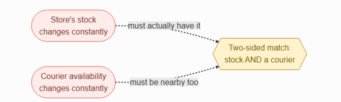
The two-sided match: store's stock changes constantly, so it must actually have the item, while courier availability changes constantly, so a courier must also be nearby — both facts have to line up at once.

> **Key idea.** This is Uber's geo-dispatch with live inventory bolted on — matching becomes two-sided (a store with stock and a courier nearby), and never overselling the last unit is the correctness property everything else is built around.

## Key concepts

This section covers the concepts needed to solve this problem — prerequisites for the design work that follows.

### Available-to-promise: on_hand versus reserved

A single stock count forces an impossible choice: decrement it when an order is placed, and an abandoned or failed checkout strands a unit nobody can now buy; decrement it only at payment, and two shoppers can both pass an availability check on the same last unit. Splitting stock into two numbers resolves this: `on_hand` is the physical count on the shelf, and `reserved` is stock currently claimed by in-flight orders. What a shopper can actually buy is `on_hand − reserved`, and a reservation only ever touches `reserved`, never `on_hand`, until the unit physically leaves the shelf.

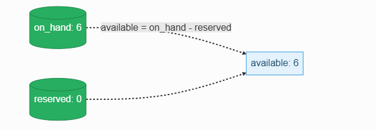
Available-to-promise: available equals on_hand minus reserved; for example, on_hand 6 and reserved 0 gives an available count of 6.

### The atomic reservation, generalized to counts

The same atomic conditional update that guarantees exactly one winner for a single, unique item — as in a ticket hold — generalizes to a quantity: a reservation succeeds only if enough units are still available, checked and claimed in one indivisible database operation. The database serializes concurrent attempts against the same row, so however many orders race for the last units, exactly the ones that fit succeed and the rest fail cleanly.

### The two-sided match

Matching a driver to a rider is a one-axis problem: nearest available driver. Here, fulfillment must satisfy two independent constraints at once — a store that actually holds every item in the order, and a courier near that specific store. Store selection happens first, at reservation time; courier matching then reuses the same nearby-search mechanism as ride-hailing: space is divided into fixed-size cells (via a scheme like geohash), each cell holds the set of couriers currently in it, and a query checks the store's cell plus its immediate neighbors so a courier just across a cell boundary isn't missed. Whichever courier is chosen gets locked: an atomic compare-and-set in a strongly-consistent store flips the courier's status from available to assigned, so two fulfillment attempts can't both claim the same courier. The geo-index only proposes candidates. Uber covers this cell-based matching mechanism in full depth.
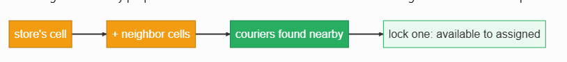
Courier lookup: the store's cell plus its neighbor cells surface couriers found nearby, and one is locked, flipping its status from available to assigned.

### Reserve-then-commit as a saga

Placing an order is really three steps that can each fail independently: reserve the inventory, charge the payment, and dispatch a courier. If any later step fails — payment declined, no courier available — the earlier claim has to be undone. This reserve-charge-dispatch sequence, with an explicit compensating release at any failure point, is a small saga: no single step is allowed to leave inventory silently reserved forever, or an order silently charged with nothing to deliver.

> **Key idea.** Splitting stock into on_hand and reserved is what makes available-to-promise a safe, atomic thing to check; the reservation itself generalizes a unique-item hold to a quantity; matching is two-sided, not one axis; and the whole order is a small saga that must release its reservation if any later step fails.

## 1. Requirements

> **Before reading on.** Name three functional and three non-functional requirements, then name the one thing that, done wrong, promises a unit you can't deliver.

### 1.1 Functional requirements

- **Browse what's available near me** — items a nearby store currently has in stock.
- **Place an order** for one or more items from a store.
- **Reserve inventory atomically** — claim units to prevent overselling.
- **Fulfill** — select a store and dispatch a courier to pick up and deliver.
- **Track the delivery** — live courier location and estimated time of arrival.

### 1.2 Non-functional requirements

- **No overselling.** A confirmed order's items are guaranteed available.
- **Fresh, correct availability.** Browse can be cached; the reserve must be exact.
- **Low-latency order placement.** A reserve feels instant even under contention.
- **Delivery-time visibility.** Tracking updates stay live throughout the trip.
- **Availability and geo-locality.** A city's load is served locally; a missed tracking update is harmless.

### 1.3 The constraint versus the property

The property never to compromise is no overselling: a confirmed order's items are always available in the inventory system of record. Physical shelves can still drift — shrink, mis-picks — so a substitution or refund flow reconciles what the record missed. The constraint that drives the design is that this correctness has to hold while browse stays fast and cheap for far more traffic than it ever generates — which is why the reserve is the one strongly-consistent path in an otherwise cache-friendly system.

> **Key idea.** No overselling is the property that can't bend; keeping that guarantee cheap and fast under contention, while browse stays cached and eventually consistent, is the constraint the rest of the design answers.

## 2. Back-of-the-envelope estimation

**Interactive estimation widget (default inputs):**

| Input | Default |
|---|---|
| Orders / day (network-wide) | 10M |
| Peak multiplier | 10× |
| Browse sessions / order | 10 |
| Stores | 1K |
| Items / store | 10K |

**Computed outputs:**

| Output | Value | Formula shown |
|---|---|---|
| Average reserve rate | 116/s | small, and bounded per row |
| Peak reserve rate | 1K/s | 10× average |
| Peak browse (geo-lookups) / sec | 12K/s | 10× the reserve rate; browse = 1K/s reserves × 10 ≈ 12K/s — read-heavy and cacheable |
| Inventory rows | 10M | 1K stores × 10K items |

Browse reads dwarf reserve writes, and the total inventory data is modest. The constraint is contention on a single hot (store, item) row, not raw volume.

### 2.1 Orders are modest; browse is not

Assume roughly 10 million orders a day network-wide: `10,000,000 ÷ 86,400 ≈ 116` orders a second on average, with peak running roughly 10× higher, around 1,160 a second. Assume about 10 browse sessions per order: peak browse load runs around `1,160 × 10 ≈ 11,600` geo-lookups a second — read-heavy and easily cacheable.

### 2.2 The hotspot is one row, not the whole system

A busy store selling a trending item at roughly 2 orders a second, with half of them wanting that item, is only about 1 decrement a second on that single (store, item) row — small in absolute terms, but it's the row every one of those orders contends on simultaneously during a sellout.

### 2.3 Total data is modest

Roughly 1,000 stores × 10,000 items each is about 10 million inventory rows — small next to the write volume of a high-throughput system. The constraint here isn't storage volume; it's correctness under contention on individual hot rows.

> **Key idea.** Order volume and inventory data are both modest; the real constraint is serialized contention on a single hot (store, item) row during a sellout, and browse traffic that dwarfs the reserve rate but never needs the same consistency.

## 3. API design

**Design checkpoint widget:** *"Should placing an order be one call that reserves inventory and charges payment together, or two separate calls?"* Options presented: (a) *One call that reserves and charges atomically*; (b) *Two calls: a reserve with a short TTL, then a separate confirm*. (Correct: option (b), confirmed by the endpoint definitions below.)

### 3.1 Browse nearby availability

`GET /v1/catalog?lat={lat}&lng={lng}`

**Request & response (expanded):**

Response body:
```
{
  items: [{ item_id, store_id, name, price }]
}
```

Served from a cache — the highest-volume, most cache-friendly path in the system.

### 3.2 Place an order (reserve)

`POST /v1/orders`

**Request & response (expanded):**

Request body:
```
{
  items: [{ item_id, qty }]
}
```
Response body:
```
{
  order_id,
  store_id,
  reserved,
  eta
} | 409 out_of_stock
```

Atomically claims inventory for a short, TTL-bounded window. A 409 means the atomic reserve found insufficient stock at the moment it ran.

### 3.3 Confirm the order

`POST /v1/orders/{id}/confirm`

**Request & response (expanded):**

Request body:
```
{
  payment_token
}
```
Response body:
```
{
  order_id,
  status
} | 410 reservation_expired
```

410 signals the reservation's TTL lapsed before checkout completed — distinct from 409, which means the stock was never there to begin with.

### 3.4 Track the delivery

`GET /v1/orders/{id}/track`

**Request & response (expanded):**

Response body: `stream: { courier_location, eta }`

> **Key idea.** Reserve and confirm are deliberately two calls, not one — the reservation's TTL is what lets checkout take its time without either overselling or freezing stock behind an abandoned cart.

## 4. Data model

### 4.1 Store

```
Store
string store_id
float lat
float lng
string name
```

### 4.2 Inventory

The available-to-promise split from Key concepts, made concrete.

```
Inventory
string store_id
string item_id
int on_hand
int reserved
```

### 4.3 Reservation

A time-bounded claim, distinct from the inventory row it claims against.

```
Reservation
string reservation_id
string store_id
string item_id
int qty
string order_id
timestamp expires_at
```

### 4.4 Order

```
Order
string order_id
string user_id
string store_id
string courier_id
enum status
string payment_id
timestamp created_at
```

### 4.5 Where each entity lives
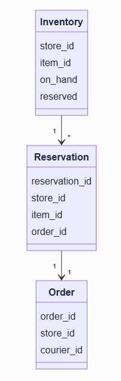

Entity relationships: Inventory (store_id, item_id, on_hand, reserved) has a one-to-many relationship to Reservation (reservation_id, store_id, item_id, order_id), which has a one-to-one relationship to Order (order_id, store_id, courier_id).

`Inventory` and `Reservation` live in a strongly-consistent, transactional store partitioned by `store_id` — this is the one path that must never be wrong. `Store` lives in a geo-index organized by cell, the same structure Uber uses for drivers. `Order` persists in its own durable store partitioned by `order_id`. Courier location reuses Uber's in-memory, cell-sharded geo-index unchanged.

> **Key idea.** Inventory needed a reserved column to avoid the oversell-versus-freeze dilemma; a reservation needed its own entity with a TTL rather than living inline on inventory; and the store/courier geo-indexes are reused directly from the nearby-search problem Uber already solves.

## 5. High-level design

> **Before reading on.** You already have available-to-promise, the atomic reservation, the two-sided match, and the reserve-as-saga idea from Key concepts. Sketch what happens from "shopper opens the app" to "courier arrives," and where each mechanism plugs in.

### 5.1 One store, one database

Start naive: a single store's inventory lives in one database; browsing scans it directly, and an order decrements a count.

```text
[ Shopper ] ──▶ [ App server ] ──▶ [ Single store's inventory ]
```
Step 0: the shopper talks to the app server, which reads a single store's inventory directly.

Four things break this.

- With many stores, nothing finds which nearby ones actually carry an item — there's no notion of proximity or per-store stock at all.
- Two orders can both pass an availability check on the last unit and both get confirmed, overselling it.
- Nothing connects "this store has the stock" to "a courier is actually near it" — dispatch and inventory are unrelated.
- Shoppers have no way to see the delivery in progress once it's dispatched.

### 5.2 Fix 1: a store geo-index and cached availability

Index every store by location; browsing queries the shopper's cell plus neighbors and filters by `on_hand − reserved > 0`, served from a cache.

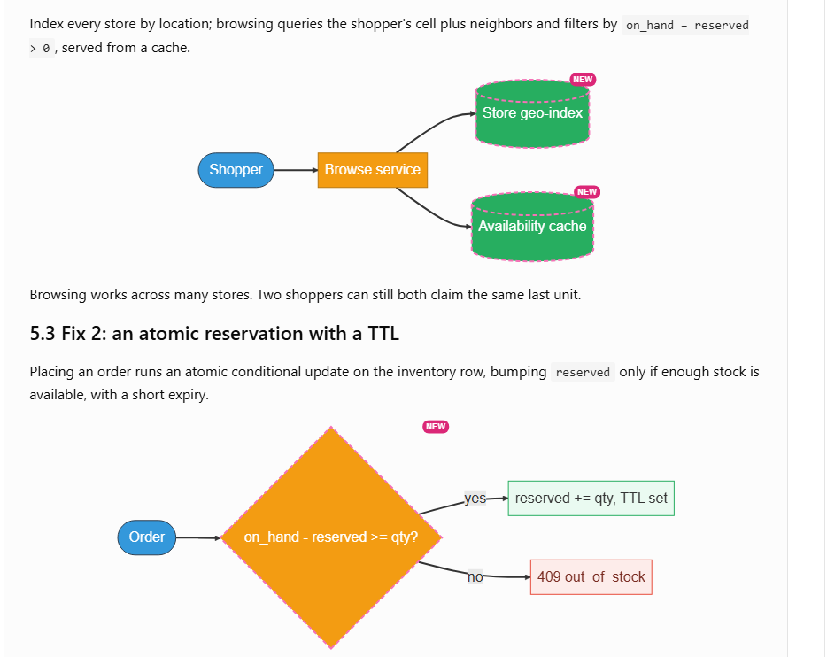
```text
                              ┌─▶ [ Store geo-index    NEW ]
[ Shopper ] ──▶ [ Browse service ]
                              └─▶ [ Availability cache  NEW ]
```
Step 1: the shopper hits a new browse service, which fans out to a new store geo-index and a new availability cache.

Browsing works across many stores. Two shoppers can still both claim the same last unit.

### 5.3 Fix 2: an atomic reservation with a TTL

Placing an order runs an atomic conditional update on the inventory row, bumping `reserved` only if enough stock is available, with a short expiry.

```text
[ Order ] ──▶ "on_hand - reserved >= qty?"   NEW
                    │
                    ├── yes ──▶ reserved += qty, TTL set
                    └── no  ──▶ 409 out_of_stock
```
Step 2: placing an order runs a new atomic check of whether on_hand minus reserved is at least the requested quantity — if yes, reserved is bumped and a TTL set; if no, the order gets a 409 out_of_stock.

Overselling is fixed. Reserving stock doesn't yet connect to actually getting it delivered.

### 5.4 Fix 3: a fulfillment service for the two-sided match

Once a store is chosen at reservation time, a fulfillment service matches a nearby courier to that specific store, reusing Uber's courier geo-index and per-courier locking.
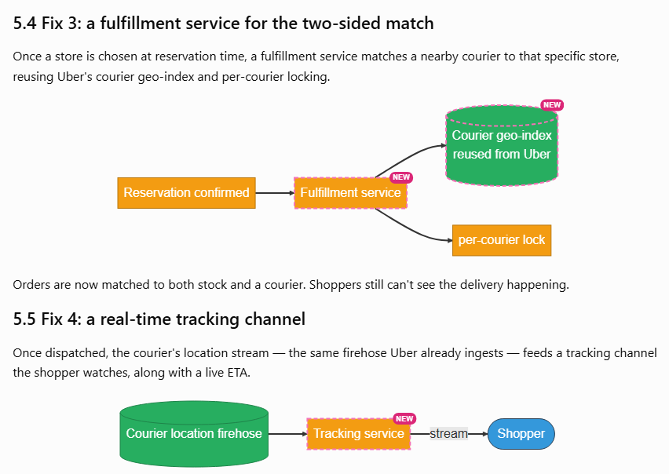
```text
[ Reservation confirmed ] ──▶ [ Fulfillment service  NEW ] ──▶ [ Courier geo-index (reused from Uber)  NEW ] ──▶ per-courier lock
```
Step 3: once a reservation is confirmed, a new fulfillment service queries the courier geo-index reused from Uber, and locks the chosen courier.

Orders are now matched to both stock and a courier. Shoppers still can't see the delivery happening.

### 5.5 Fix 4: a real-time tracking channel

Once dispatched, the courier's location stream — the same firehose Uber already ingests — feeds a tracking channel the shopper watches, along with a live ETA.

```text
[ Courier location firehose ] ──"stream"──▶ [ Tracking service  NEW ] ──▶ [ Shopper ]
```
Step 4: the courier location firehose streams into a new tracking service, which forwards updates to the shopper.

### 5.6 The composed design
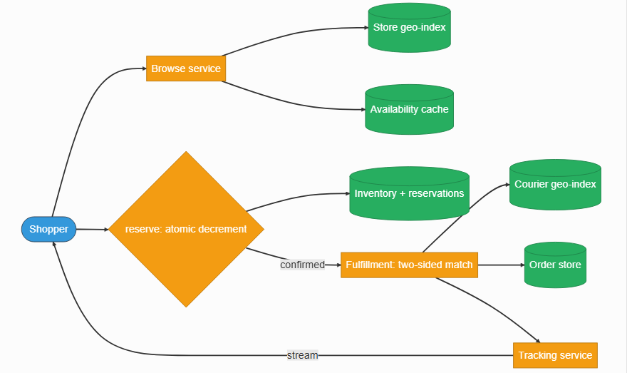
```text
                              ┌─▶ [ Store geo-index ]
[ Shopper ] ──▶ [ Browse service ]
                              └─▶ [ Availability cache ]

[ Shopper ] ──"reserve: atomic decrement"──▶ [ Inventory + reservations ]
                                                        │
                                                    "confirmed"
                                                        ▼
                                        [ Fulfillment: two-sided match ] ──▶ [ Courier geo-index ]
                                                        │
                                                        ▼
                                                  [ Order store ]

[ Tracking service ] ──"stream"──▶ [ Shopper ]
```
Composed design: the shopper browses via the browse service into the store geo-index and availability cache; the shopper also reserves stock through an atomic decrement against inventory and reservations, and once confirmed, fulfillment performs the two-sided match against the courier geo-index while the order is written to the order store; the tracking service streams updates back to the shopper.

Each component answers one failure of the naive version: the geo-index and cache fix browse across many stores, the atomic reservation fixes overselling, the fulfillment service fixes the disconnect between stock and dispatch, and the tracking channel fixes delivery visibility.

> **Key idea.** Every component traces to one concrete failure — no proximity awareness, overselling, stock disconnected from dispatch, and no visibility — not a pre-known architecture diagram.

## 6. Deep dives

### 6.1 The atomic reservation and no oversell

> **Before reading on.** A hundred shoppers each reach for one of the last six units of one item at one store in the same second. Exactly six orders should win. What's the primitive, and where does the contention actually land?

**Interactive contention widget** (Play / Step / Reset): default state — "t0 — on_hand = 6, reserved = 0, available = 6"; on_hand: 6, reserved: 0, available (on_hand − reserved): 6; four pending orders shown: Order A (qty 2), Order B (qty 3), Order C (qty 2), Order D (qty 1), described as arriving close together for the same (store, item) row. Stepping through processes each order's conditional update one at a time against the current available count, so orders are admitted only while enough stock remains and the rest are rejected once the row is exhausted.

The reserve is a single atomic conditional update: `UPDATE inventory SET reserved = reserved + q WHERE store_id = ? AND item_id = ? AND on_hand - reserved >= q`. The database serializes concurrent writers to that row, so orders are processed one at a time against the current available count — whichever orders still fit when their turn comes succeed, and every order that would oversell finds zero rows affected and gets 409, in a single round trip with no explicit lock to manage. The same idea appears as a Redis atomic check-and-decrement (sometimes a short Lua script) when the store lives outside a relational database. This generalizes the exact mechanism behind a Ticketmaster seat hold from a unique item to a quantity.

Crucially, `on_hand` never moves at reserve time, or even at payment — only `reserved` does. At pickup, `on_hand` and `reserved` drop together, the picker's action consuming the reservation exactly as the physical unit leaves the shelf.
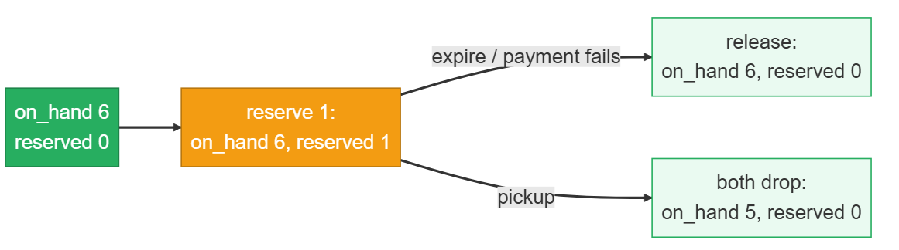
```text
on_hand 6, reserved 0 ──▶ reserve 1: on_hand 6, reserved 1
                                          │
                        ┌─────────────────┴─────────────────┐
                  "expire / payment fails"                "pickup"
                        │                                     │
                        ▼                                     ▼
          release: on_hand 6, reserved 0        both drop: on_hand 5, reserved 0
```
Reservation lifecycle: starting at on_hand 6 and reserved 0, reserving 1 unit moves to on_hand 6, reserved 1; from there it branches — an expiry or a failed payment releases back to on_hand 6, reserved 0, while a pickup drops both together to on_hand 5, reserved 0.

This is what keeps available-to-promise from ever leaking: a failed payment or an expired reservation releases `reserved` back without ever having touched `on_hand`, so nothing was oversold and nothing was silently lost either. Expiry itself needs to be leak-proof the same way a hold does elsewhere — a background sweeper reclaims expired reservations, and the reserve path itself reaps any expired holds on that (store, item) row before checking availability, so a lagging sweeper doesn't strand a unit. Contention concentrates on the last units of a trending item at a busy store. Sharding by `store_id` spreads different stores across nodes, but a single hot row within one store is still a hotspot sharding alone can't relieve. Under strict no-oversell that row is the serialization point, so keeping its update lean and fast is what actually matters. What to monitor: any (store, item) where `reserved` exceeds `on_hand`, which should not occur in normal reservation flow but can follow a downward stock adjustment, so treat it as a reconciliation trigger; reservations older than their intended TTL; and the rate of reservations that never reach confirmation.

**The atomic reservation and no oversell: how it's graded**
- **Bad** — Read stock, then write a decrement separately
- **Good** — One atomic conditional decrement with a reservation TTL
- **Great** — Names the conditional-update primitive, separates reserved from on_hand, leak-proof expiry, monitored invariant

### 6.2 The two-sided match: a store with stock and a courier

> **Before reading on.** The nearest store has your items but every courier near it is busy; the next store has a free courier but is missing one item. What does the matcher optimize, and what does it do when no single store-plus-courier fits?

Uber optimizes one axis: the nearest available driver. Here, the match is two-sided — a store that holds every requested item, and a courier near that store — optimized for total time to the shopper, not either half in isolation. Store selection happens once, at reservation time; because inventory is committed then, fulfillment afterward focuses solely on finding a nearby courier for that already-decided store, which keeps the two constraints from having to be solved jointly.

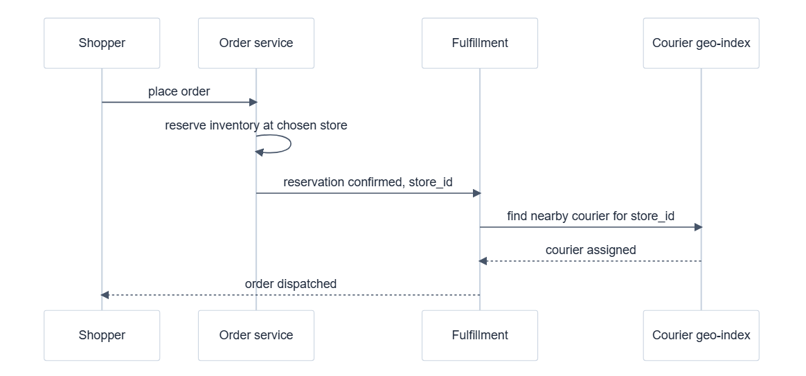
Fulfillment sequence: the shopper places an order with the order service, which reserves inventory at the chosen store; once the reservation is confirmed with a store_id, the order service hands off to fulfillment, which finds a nearby courier via the courier geo-index; once a courier is assigned, fulfillment marks the order dispatched and notifies the shopper.

Courier matching reuses Uber's infrastructure directly: query the store's cell and neighbors in the in-memory, cell-sharded courier geo-index, filter by ETA, and secure the assignment with per-courier locking to prevent double-booking a courier. If the nearest in-stock store has no couriers nearby, the search radius widens, or the order queues for a short, bounded wait; if no single store carries every item, the order either splits across stores or offers a substitution, both deferred to variants.
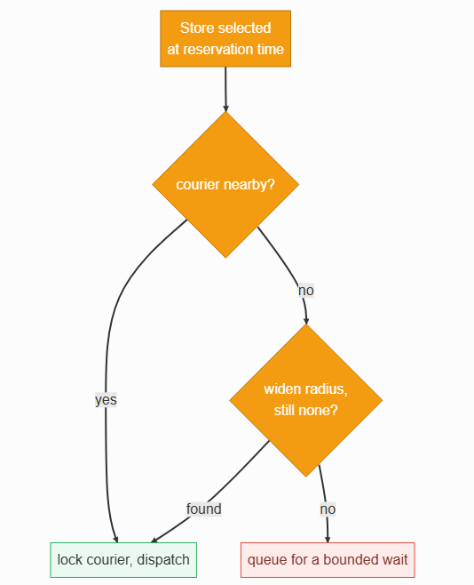
```text
[ Store selected at reservation time ] ──▶ "courier nearby?"
                                                  │
                                    ┌─────────────┴─────────────┐
                                   yes                          no
                                    │                             ▼
                                    ▼                     widen radius
                          lock courier, dispatch                 │
                                                          "still none?"
                                                                   │
                                                    ┌──────────────┴──────────────┐
                                                  found                          no
                                                    │                             │
                                                    ▼                             ▼
                                          lock courier, dispatch      queue for a bounded wait
```
Matching decision flow: once a store is selected at reservation time, the system checks whether a courier is nearby — if yes, it locks the courier and dispatches; if not, it widens the search radius and checks again, dispatching if one is found, or otherwise queuing the order for a bounded wait.

Because inventory is reserved before a courier is found, a failed match — no courier available anywhere reasonable — has to trigger the same kind of compensation as an expired reservation: release the claimed stock back to available and notify the shopper, rather than leaving an order paid-but-undeliverable or inventory reserved forever. Framed as a saga, this is exactly reserve → charge → dispatch, with release as the compensating action whenever any later step fails. What to monitor: the age of reserved-but-undispatched orders, dispatch-failure frequency by region, and how often a store has stock but genuinely no nearby courier.

**Design checkpoint widget:** *"An order's inventory is reserved and payment succeeds, but no courier can be found anywhere reasonable. What must happen next?"* Options: (a) *Leave the reservation in place and keep retrying indefinitely*; (b) *Release the reservation back to available inventory and notify the shopper, the same compensation used for an expired hold*. (Correct: option (b), confirmed by the surrounding text.)

**The two-sided match: how it's graded**
- **Bad** — Pure courier-matching, ignoring which store has stock
- **Good** — Select an in-stock store, then match a nearby courier
- **Great** — Optimizes total time, reuses dispatch infra fully, models fulfillment as a saga

### 6.3 Real-time tracking and the ETA

> **Before reading on.** The shopper wants to watch the courier move and trust the arrival time. Which transport, and what do you show when the courier drops offline for thirty seconds?

Tracking is one-way — the shopper only ever receives position and timing updates, never sends anything back — which makes Server-Sent Events over a held HTTP connection a better fit than a bidirectional WebSocket: simpler to implement, and browser clients reconnect automatically (native apps add their own retry and heartbeat logic). The stream consumes the same courier location firehose Uber already ingests for dispatch, so nothing new has to be built to source the data, only to fan it out to a watching shopper.

A live stream pins a shopper to whichever gateway server holds their open connection, so the system needs a way to route "courier X moved" to the specific gateway serving that shopper — a connection registry distributing from the location firehose out to the right gateway.
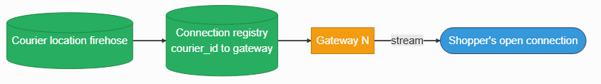

Capacity planning here centers on concurrent active trips, not requests per second, since each trip holds one long-lived connection rather than issuing discrete requests. The ETA itself is courier position to destination over a road graph with live traffic — a routing computation, not a static lookup — and it has to be recomputed as the courier moves, on each location update or a short interval; a frozen ETA that ignores a developing traffic jam erodes a shopper's trust faster than one that's merely a little pessimistic.

When a courier's location updates stop — a tunnel, a dead phone battery, a dropped connection — the right response is showing the last-known position and a coarser ETA, never a frozen dot or an outright error. A single missed update is covered by the next one seconds later, but offline windows can stretch to minutes — dead battery, a backgrounded app, no coverage — so the client marks the position stale after a bounded silence and falls back to a coarser ETA; the map degrades to visibly stale, not broken. What to monitor: stream-disconnect frequency, location-update latency per courier, and ETA accuracy — predicted arrival time against what actually happened.

**Real-time tracking and the ETA: how it's graded**
- **Bad** — Client polling, a static ETA computed once
- **Good** — Push updates via SSE, sourced from the existing courier firehose
- **Great** — One-way SSE, connection registry, continuous ETA recomputation, graceful degradation

> **Key idea.** The atomic reservation generalizes a unique-item hold to a quantity, with on_hand and reserved dropping together only at physical pickup; the two-sided match optimizes total shopper time and treats a failed dispatch as a compensating release, the same as an expired reservation; and one-way tracking over Server-Sent Events, fed by an existing location firehose, degrades to a coarser estimate rather than freezing when updates stop.

## 7. Variants

**10× scale.** The levers hold at ten times the orders and stores: shard the inventory store further by `store_id` so each store's writes stay local, add more cell-shards to both the store and courier geo-indexes, and lean harder on the browse cache since availability reads dwarf reserves by an even wider margin at scale. A single hot (store, item) row stays the serialization point under strict no-oversell — batching requests to it can soften contention, but its one atomic update has to stay cheap regardless of everything else growing around it, the identical limit a single hot seat hits in the Ticketmaster design. Peak order rate rises roughly linearly, and the contention stays per-row, so it widens without becoming qualitatively harder.

**Multi-store orders and substitutions.** When no single nearby store carries every requested item, the order splits across stores: each line reserves at whichever store holds it, and dispatch either sends two couriers or has one courier make two pickups. Cost and delivery time both rise, so this is a fallback path, not the default. Substitution — offering a comparable in-stock item when the exact one is gone — trades an exact match for a filled order, and needs the shopper's explicit consent before it happens. Both variants reuse the identical reservation and dispatch machinery, just composed differently.

**Batched courier trips.** At high enough store density, one courier can carry several orders from the same store on a single trip. The reservation and inventory logic is completely unchanged; what shifts is dispatch, from one order per courier to a small bin-packing problem over orders headed the same direction — trading a little extra per-order latency for meaningfully higher courier throughput. This is an optimization on the matching step, not a new system.

> **Key idea.** The architecture holds at 10× scale because a hot row's cost is irreducible but independent of everything else growing; multi-store orders and substitutions reuse the same reservation machinery, just composed across more than one store; and batching is purely a dispatch-side optimization that leaves inventory logic untouched.

## 8. The transferable pattern

Local delivery is Uber's geo-dispatch with a live-inventory constraint bolted on, so the match becomes two-sided — a store with stock and a courier — and correctness lives in one atomic reservation per (store, item) row. The reserve-then-commit shape (claim with a TTL, release on any failure) is exactly a Ticketmaster seat hold applied to a count instead of a unique unit, and the browse view stays cached and eventually consistent because correctness is enforced only at the one place it actually needs to be: the reserve. The same shape reappears anywhere limited physical inventory meets a two-sided real-time match — grocery delivery, on-demand rental fleets, or any marketplace where "what's actually available right now, nearby" is itself the hard problem.

## Review: the 30-second answer

- This is Uber's geo-dispatch with a live-inventory constraint bolted on — the match becomes two-sided, not one axis.
- Splitting stock into on_hand and reserved is what makes available-to-promise safe to check atomically, without oversell or frozen inventory.
- The reservation generalizes a unique-item hold (like a Ticketmaster seat) to a quantity, using the identical atomic conditional-update primitive.
- Store selection happens at reservation time; courier matching afterward reuses Uber's dispatch infrastructure unchanged.
- Tracking is one-way, over Server-Sent Events, and degrades to a coarser estimate rather than freezing when updates stop.

## Quiz

**Local Delivery Design Quiz widget** ("Hide All" / "Reveal All" toggle) — 5 questions, each with a "Show/Hide Answer" button. Full text of every question and its revealed answer:

**1) Why is this problem harder than plain courier dispatch, and where does that extra difficulty actually live?**
Plain courier dispatch is a one-axis match: find the nearest available driver. Here, a second, independently-changing fact — whether a specific nearby store actually holds every requested item right now — has to line up with courier availability before an order can be confirmed. The extra difficulty lives specifically at order placement, where the system must guarantee a confirmed order's items are genuinely available, not in browsing or in dispatch itself.

**2) Why does splitting inventory into on_hand and reserved avoid both overselling and stranding stock, when a single count can't do both?**
A single count forces a choice: decrementing it at order time oversells nothing but strands stock if checkout fails or is abandoned, while decrementing only at payment lets multiple orders pass an availability check on the same last unit before any of them actually pays. Splitting the count means a reservation only ever changes reserved, computing available-to-promise as on_hand − reserved; a failed or expired reservation releases reserved back with on_hand never having moved, so nothing was oversold and nothing was silently lost either.

**3) A hundred shoppers race for the last six units of one item, each wanting one unit. Why does an atomic conditional update guarantee exactly six succeed, rather than more or fewer?**
The database serializes every write to that specific inventory row, so each order's conditional update — bump reserved only if on_hand minus reserved is still at least the requested quantity — is evaluated one at a time against whatever the row's current state actually is at that instant. The first six orders (in whatever order they're processed) each still see enough available stock and succeed; every order after that finds the condition false and gets rejected with zero rows changed, with no race window where more than the true available count could ever get claimed.

**4) Why must a failed courier match trigger the same compensation as an expired reservation, rather than simply retrying dispatch forever?**
Inventory is reserved before a courier is even searched for, so if no courier can reasonably be found, that reservation is holding stock hostage that could otherwise be sold to a shopper the system genuinely can deliver to. Treating a failed match exactly like an expired hold — release the reservation back to available inventory and notify the shopper — is what prevents an order from becoming permanently paid-but-undeliverable or a unit from being reserved forever with nothing ever arriving.

**5) Why is Server-Sent Events, not a bidirectional WebSocket, the right transport for delivery tracking?**
Tracking is inherently one-way: the shopper only ever receives the courier's position and ETA, and never sends data back through that same channel. Server-Sent Events is built specifically for this shape — simpler to implement than a full bidirectional connection, with reconnection built into browser clients — so choosing it over a WebSocket avoids paying for two-way capability the feature never actually uses.

## Sources and further reading

- [Distributed locks with Redis — Redis docs](https://redis.io/docs/latest/develop/use/patterns/distributed-locks/) — the atomic set-with-expiry primitive behind a time-bounded claim, generalized here to a guarded quantity decrement.
- [Geospatial indexing explained — Ben Feifke](https://www.bigdatabase.dev/geospatial-indexing) — cell-plus-neighbors proximity search, the mechanism behind both the nearby-store and nearby-courier lookups.

---
