# Design an Online Auction

Source: https://systemdesignschool.io/problems/online-auction/solution

> Note on fidelity: this page is built from many JS-interactive widgets (sliders, step-through diagrams, tabbed panels, animated simulations, expandable "Request & response" and quiz-answer panels) rather than static images. Every widget's full content — including states behind tabs/toggles/expanders, and the labels/boxes/arrows inside each diagram — has been clicked through and transcribed below as text, in the same order it appears on the site. The site has no downloadable diagram image files (they're rendered live by JS/SVG, not `` files), so there are no image assets to save for this page.

Tags: **Hard** · Fan-out · Consistency · Real-time

---

## Problem statement

Design a real-time auction: many bidders compete on an item, each bid must beat the current high, the price climbs live in front of thousands of watchers, and the auction closes at a hard deadline with an unambiguous winner.

In scope: placing bids, viewing the current price, watching a live price feed, and closing an auction with exactly one winner. Out of scope: proxy (automatic) bidding beyond a brief variant, fraud detection, and the payment charge itself.

## Clarifying questions

Each answer fixes an assumption the design leans on.

- **Ascending (English) auction?** Assume the common case: open ascending price, highest bid at close wins.
- **How many watchers versus bidders?** Watchers vastly outnumber bidders, which makes the read path a broadcast problem and the write path a per-item contention problem.
- **Hard close or soft close?** A hard deadline, but with anti-sniping extensions — a last-second bid is the correctness minefield, not an edge case to ignore.
- **How live must the price be?** Sub-second. A stale price causes wasted bids and disputes over who actually had the high bid.
- **Are payments in scope?** No. Assume a payment system exists downstream; this design focuses on bidding and the close.

## What makes this problem distinctive

One item is two different problems at once, depending on which side you look from. The write side is a contention problem: every bid on that item races on the same question — "am I the new high?" — and a lost update means the wrong winner, or a bid accepted below the current price. The read side is a broadcast problem: one accepted bid must reach every watcher, sometimes tens of thousands of them, within a moment.

These two sides want opposite treatments. Correctness on the write side means serializing every bid for one item — forcing them through a single, ordered decision point so the winner is always well-defined. Liveness on the read side means fanning that one decision out to a crowd as fast and as cheaply as possible. Getting the close right is the third piece: a bid landing in the last second must not be able to steal an otherwise-settled auction, and however the system finalizes a winner has to produce exactly one, even if the closing logic somehow runs twice.

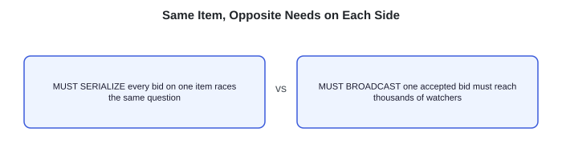

Same item, opposite needs on each side: the write side must serialize, since every bid on one item races the same question, while the read side must broadcast, since one accepted bid must reach thousands of watchers.

> **Key idea.** One item is a write hotspot and a read hotspot at the same time — writes must serialize for a well-defined winner, reads must fan out for a live crowd, and the close has to be correct under both a last-second bid and a retried close.

## Key concepts

This section covers the concepts needed to solve this problem — prerequisites for the design work that follows.

### Serializing writes per item

All bids for one item route through a single, ordered decision: accept only if the new bid strictly beats the current price. Whether that's a single logical writer per item or an atomic conditional update, the effect is the same — concurrent bids are *ordered*, not lost. Two bids that arrive in the same instant still resolve to exactly one winner, because the database (or the writer) processes them one at a time against the current price, never both against a stale read of it.

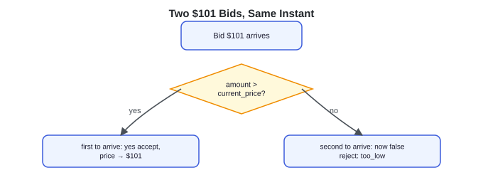

Two $101 bids arrive at the same instant and both ask "amount > current_price?" — the first to arrive gets yes and is accepted, setting price to $101; the second now evaluates false and is rejected as too_low.

### The append-only bid log

Every accepted bid is appended to an ordered, immutable log rather than only updating a `current_price` column in place. Order comes from a per-auction sequence number (`seq`) assigned atomically at accept time — timestamps alone can't define it under clock skew. The current price and high bidder are *derived* — the max and the most recent entry — but the log itself is the audit trail and the authoritative source for who actually won: at any point, the winner can be proven from the sequence of accepted bids, not just trusted from a single mutable value.

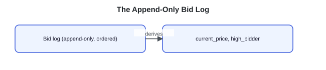

The append-only, ordered bid log derives the current_price and high_bidder.

### Fan-out for live prices

When a bid is accepted, the new price is published once to a per-item topic, and a fleet of gateways — each holding many live connections — relays it to every watcher subscribed to that item. This is the same fan-out shape used anywhere one write needs to reach many readers: the publisher sends one message per accepted bid, and the broker and gateway layer do the multiplication — the audience-dependent cost lives downstream, not on the write path.

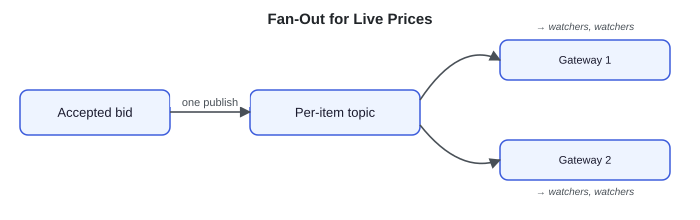

An accepted bid is published once to a per-item topic, which fans out to Gateway 1 and Gateway 2, each relaying to their watchers.

> **WebSocket.** A persistent, bidirectional connection between a client and a server, so the server can push an update the instant it happens instead of the client polling and asking repeatedly. Standardized in RFC 6455.

### Authoritative, idempotent close

A scheduled process finalizes the auction at its deadline by reading the bid log's top entry — the winner is whatever the ordered log says, computed once from data that's already settled. Because a scheduler can retry or run twice (a failover, a duplicate trigger), closing has to be idempotent: the transition is an atomic update guarded on `status = 'open'`, so a second run matches no row and does nothing, rather than picking a second winner.

> **Key idea.** Serializing writes per item makes the winner well-defined even under a race; the append-only log is the provable source of truth the current price is only a derived view of; fan-out lets one accepted bid reach a crowd without cost per watcher; and the close must be both authoritative (read from the settled log) and idempotent (safe to run twice).

## 1. Requirements

> **Before reading on.** List the functional and non-functional requirements, then name the one property you would never compromise and the one constraint that drives the design.

### 1.1 Functional requirements

- **Place a bid** — accepted only if it beats the current high.
- **View the current price** and the current high bidder.
- **Watch live** — receive price updates in real time.
- **Close** at the deadline, determining exactly one winner.

### 1.2 Non-functional requirements

- **Bid correctness.** The winner is unambiguous; no accepted bid is ever below the price it beat.
- **Real-time price.** Watchers see a new high within a moment of it being accepted.
- **Close correctness.** Exactly one winner, determined authoritatively, correct under last-second bids.
- **Read scalability.** Thousands of watchers per hot item, vastly outnumbering the bidders.

### 1.3 The constraint versus the property

The property never to compromise is **bid correctness**: the winner is always well-defined, with no accepted bid below the price it claimed to beat. The constraint that drives the design is that one item is simultaneously a write hotspot and a read hotspot — which is why writes serialize for correctness while reads fan out for a live crowd, rather than applying one strategy to both.

> **Key idea.** Bid correctness is the property that can't bend; satisfying it while also serving a live crowd on the same item is the constraint that splits the design into a serialized write path and a fanned-out read path.

## 2. Back-of-the-envelope estimation

**Interactive estimation widget (default values shown):**

| Metric | Value | Note |
|---|---|---|
| Watchers on a hot item | 100K | |
| Accepted bids / sec near close | 10/s | |
| Accepted writes / sec | 10/s | small, serialized per item |
| Price-update messages / sec | 1.0M/s | 100K watchers × 10 bids/s |
| Fan-out ratio | 100K× | one write, many reads |
| What must serialize | one item's price | everything else fans out and scales independently |

Formula shown: `fan-out = 100K watchers × 10 accepted bids/s ≈ 1.0M price-update messages/s`

The write path stays small — one accepted bid at a time, serialized per item. The read path multiplies that single write across every watcher.

### 2.1 Writes stay small

A hot item might see around 10 accepted bids a second near close — bounded naturally, since every bid serializes through the same per-item decision point. Accepted throughput never grows with watcher count, though attempted bids — most of them rejected — can run much higher and still hit the accept path, so plan capacity for attempts, not accepts.

### 2.2 Fan-out dominates

Assume roughly 100,000 watchers on a hot item, each accepted bid triggering a price update to all of them: `100,000 × 10 = 1,000,000` price-update messages a second at that item's peak. The read path, not the write path, is what has to scale to serve a crowd.

### 2.3 The close is a synchronized spike

Bidding concentrates in the final seconds before a deadline, producing a burst on both the write and read paths at exactly the same instant across every closing auction — size for that spike, not the average rate across the auction's lifetime.

> **Key idea.** Accepted writes stay small and bounded per item; fan-out multiplies that one write by the watcher count, and the close moment concentrates both into a synchronized spike.

## 3. API design

**Design checkpoint widget:** *"Placing a bid and watching a price are fundamentally different operations. Should watching a price be a plain GET the client polls, or a subscription the server pushes to?"* Options: (a) *A GET the client polls on an interval*; (b) *A subscription (WebSocket) the server pushes updates through* — the design picks (b).

### 3.1 Place a bid

`POST /v1/auctions/{id}/bids`

**Request & response (expanded):**
- Request body: `{ amount }`
- Response body: `{ accepted: true, new_price }` | `{ accepted: false, reason: too_low|closed }`

The acting user comes from the authenticated session. Acceptance is a synchronous, conditional decision — the caller learns immediately whether the bid won.

### 3.2 View the current state

`GET /v1/auctions/{id}`

**Request & response (expanded):**
- Response body: `{ current_price, high_bidder, ends_at }`

### 3.3 Watch live

`GET WS /v1/auctions/{id}/watch`

**Request & response (expanded):**
- Response body: stream of `{ new_price, high_bidder, ends_at }`

A persistent subscription; the server pushes an update on every accepted bid instead of the client asking repeatedly.

> **Key idea.** Bidding is a synchronous conditional write; watching is a subscription, not a poll — the two operations have different shapes because they solve different problems.

## 4. Data model

### 4.1 Auction

The current, derived state of one item's sale.

- `string auction_id`
- `string item_id`
- `decimal current_price`
- `string high_bidder`
- `timestamp ends_at`
- `enum status`

### 4.2 Bid

Append-only — the source of truth `current_price` and `high_bidder` are derived from.

- `string bid_id`
- `string auction_id`
- `string user_id`
- `decimal amount`
- `int seq`
- `timestamp created_at`

### 4.3 Watch registry

Ephemeral — lives with the real-time gateway layer, not the database.

- `string auction_id`
- `string[] live_connection_ids`

### 4.4 Where each entity lives, and what's derived

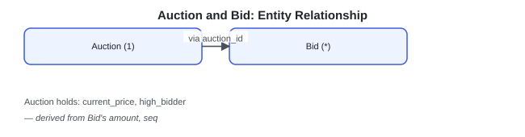

ER-style: Auction (1) relates to Bid (many) via auction_id; Auction holds current_price and high_bidder, both derived from Bid's amount and seq.

`Auction` and `Bid` live in a strongly-consistent, transactional store, partitioned by `auction_id` — the write path that must serialize. `current_price` and `high_bidder` on `Auction` are a materialized view of `Bid`, always derivable by replaying the log if ever in doubt. The watch registry lives entirely in the real-time gateway's memory; a connection disappearing costs nothing to the system of record, since a reconnecting client just re-fetches `current_price`.

> **Key idea.** Bid is the source of truth; Auction's current_price and high_bidder are a derived, materialized convenience — never the other way around.

## 5. High-level design

> **Before reading on.** You already have serialized writes, the append-only log, fan-out, and the authoritative idempotent close from Key concepts. Sketch what happens from "a bid arrives" to "every watcher sees the new price," and where each mechanism plugs in.

*Reading the diagrams: each step marks the components newly added at that step with a dashed outline and a NEW badge.*

### 5.1 Read the price, compare, write if higher

Start naive: the app server reads the current price, compares the incoming bid, and writes the new price if it's higher.

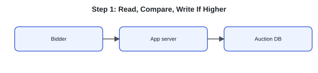

The bidder talks to the app server, which reads and writes the auction DB directly.

Four things break this.

- Two bids read the same current price, both compare higher, and both write "the new high" — a lost update that produces a disputed winner.
- Watchers polling for the latest price hammer the database directly.
- A bid landing in the final seconds has no defined handling, so sniping can steal an otherwise-settled auction.
- One popular item concentrates both the write contention and the read crowd on the same server.

### 5.2 Fix 1: serialize the accept decision

Route all bids for one auction through a single logical writer, or accept via an atomic conditional update: `SET price = amount, high = user WHERE amount > current_price`. Only a strictly-higher bid succeeds; a concurrent loser is rejected, not silently overwritten.

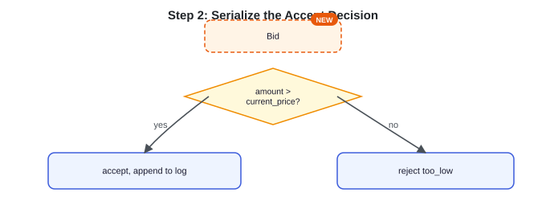

A bid triggers a new atomic check of whether amount exceeds current_price — if yes, it's accepted and appended to the log; if no, it's rejected as too_low.

Lost updates are fixed. Watchers are still polling the same database, and the close and sniping problems remain.

### 5.3 Fix 2: fan out the price via pub-sub

On each accepted bid, publish the new price to a per-auction topic; a WebSocket gateway layer relays it to every connected watcher.

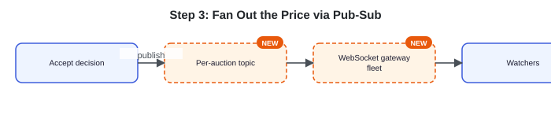

The accept decision publishes to a new per-auction topic, which a new WebSocket gateway fleet relays out to watchers.

Steady-state polling load on the database is gone — watchers still fetch initial state and resync after a reconnect, but those reads are occasional, not continuous. The close and sniping problem is still unresolved.

### 5.4 Fix 3: an authoritative, extending close

A scheduler closes the auction at `ends_at`, finalizing the winner from the bid log. A bid landing within the final seconds extends `ends_at`, so a last-instant bid can't steal an otherwise-uncontested win.

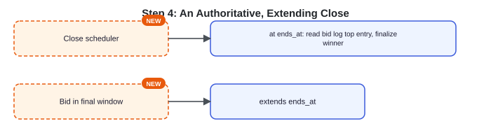

A new close scheduler, at ends_at, reads the bid log's top entry and finalizes the winner; a new rule for a bid in the final window extends ends_at.

### 5.5 The composed design

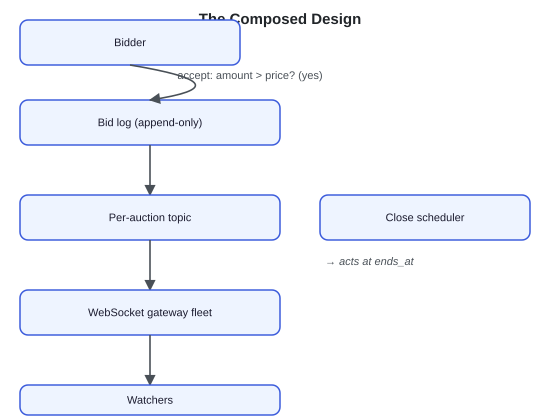

Full composed design: a bidder's accepted bid (amount greater than current_price) is appended to the bid log, published to the per-auction topic, relayed by the WebSocket gateway fleet to watchers; separately, the close scheduler acts at ends_at.

Each fix answers one failure of the naive version: serialization fixes lost updates, pub-sub fixes polling load, and an extending, authoritative close fixes sniping and winner ambiguity.

> **Key idea.** Every component traces to one concrete failure of "read, compare, write" — lost updates, polling load, and an undefined close — not a pre-known architecture diagram.

## 6. Deep dives

### 6.1 Bid concurrency and the correct winner

> **Before reading on.** Two bids of $101 arrive on a $100 item at the same instant. Exactly one becomes the new high. What primitive guarantees that, and what happens to the loser?

Every bid for one auction routes through a single writer or an atomic conditional update that accepts only if `amount > current_price` — an all-or-nothing step the database serializes. Whichever $101 bid reaches that step first commits and sets the price to $101; the second then evaluates `101 > 101`, which is false, so exactly one bid is accepted and the other is rejected with `too_low`, free to be resubmitted at a higher amount. This is the same shape as the atomic hold in the Ticketmaster design — a race resolved by a single serialized decision, not a read followed by a separate write.

The reason a naive "read, compare, write" fails is exactly the gap that serialization closes: both concurrent $101 bids can read the current price as $100 before either writes, so both conclude they're the new high and both write $101 — a lost update with no way to tell which should have won. Folding the accept decision into one atomic step removes that gap entirely. What to monitor: every accepted bid in the log should strictly exceed the prior one; a violation, or an out-of-order sequence number, is a lost-update bug surfacing in production.

**Comparison widget (two side-by-side sequences):**
- *Atomic conditional accept — serialized:* A: accept only if amount beats price → price $101, A wins. B: 101 beats 101 is false → rejected too_low, resubmit higher.
- *Read, compare, write — the lost update:* A reads price $100. B reads price $100. Both write $101 → two winners, which one counted?

**"What separates answers — bid concurrency and the correct winner" (expandable rating list):**
- **Bad** — Read the price, compare, write if higher
- **Good** — A single atomic conditional accept
- **Great** — Names the primitive, keeps an append-only log, monitors the invariant

### 6.2 Real-time price fan-out

> **Before reading on.** One accepted bid must reach a hundred thousand watchers within a moment. What has to be true about the update for that to be cheap?

The accept decision publishes the new price once, to a per-auction topic; a fleet of WebSocket gateways, each subscribed to the topics for the connections it holds, relays it to every watcher. The publish happens once on the write side regardless of audience size — the gateway layer, not the write path, does the multiplication, which is why fan-out cost scales with watcher count while the write path stays untouched by it.

What makes this cheap is that a watcher only ever needs the *current* price, not a guaranteed, ordered delivery of every intermediate one — a **latest-wins** tolerance. A dropped or duplicated update self-heals on the very next accepted bid, and a client that reconnects after a gap just fetches the current derived price rather than replaying history. Near the close, when no further bid may arrive, a periodic client resync and a pushed final-state event cover the last gap. That tolerance is what avoids the cost of per-watcher acknowledgment or guaranteed delivery, which would turn a cheap broadcast into an expensive one. Gateways shard by auction and scale horizontally; a gateway restart causing a thundering reconnect is smoothed by staggering reconnect attempts and letting the cached current price absorb the gap. What to monitor: end-to-end price-propagation latency (from accept to watcher) and gateway fan-out queue depth, both early signals that fan-out is falling behind.

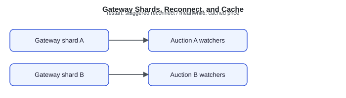

Gateway shard A serves Auction A's watchers and gateway shard B serves Auction B's watchers; on a restart, reconnects are staggered while the cached price covers the gap in the meantime.

**"What separates answers — real-time price fan-out" (expandable rating list):**
- **Bad** — Watchers poll for the latest price
- **Good** — Pub-sub push to WebSocket watchers
- **Great** — Latest-wins tolerance, sharded gateways, staggered reconnects

### 6.3 The close: sniping and exactly one winner

> **Before reading on.** A bid arrives 200 milliseconds before the deadline. Accept it or not? And how do you guarantee exactly one winner is recorded, even if the closing job runs twice?

**Simulation widget:** tabs "No last-second bid" / "Snipe in the final window"; controls "Play" / "Reset"; state readout "t = 0s, ends_at = 20s, extensions = 0" and "time remaining until close"; three bidder rows Alice / Bob / Carol each starting at "—"; status line "Auction open. Current deadline: t=20s."

A scheduler finalizes the auction at `ends_at` by reading the bid log's top entry — the winner is whatever the ordered log already says, computed once from settled data, not decided live at the close instant. Bids arriving after the effective close are rejected with `closed`. Anti-sniping handles the last-second case: a bid landing within a final window (say, the last few seconds) pushes `ends_at` out, so a last-instant bid can win only by surviving a further contest, not by timing alone — the same soft-close idea used by real auction platforms. The extension must be part of the same atomic accept step as the bid itself, and the close's own guarded update checks the effective `ends_at` — otherwise a close could slip in between a bid's accept and its extension.

The remaining requirement is that the close can never produce more than one winner, however many times it runs. A check-then-skip is not enough: two close jobs can both observe `open` and both write a winner. The transition must be atomic — `UPDATE auctions SET status = 'closed' WHERE id = ? AND status = 'open'` — and only the run whose update changes a row records the winner.

A retry or a failover-triggered second run matches zero rows and becomes a no-op, not a second decision. Because the winner is read from an already-committed log rather than computed from live, in-flight state, the answer is deterministic regardless of how many times the read happens. What to monitor: every auction should end in exactly one terminal winner record; alert on a double-close, a missing winner, or any bid accepted after `ends_at` without a corresponding extension.

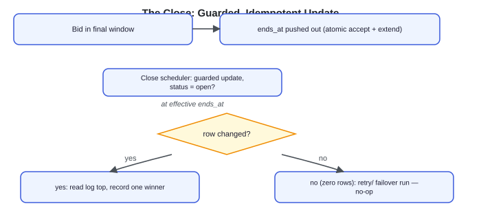

A bid in the final window pushes ends_at out via an atomic accept-plus-extend; the close scheduler performs a guarded update checking status = open, and at the effective ends_at, a run whose row actually changed reads the log top and records one winner, while a retried or failover run that matches zero rows is a no-op.

**"What separates answers — the close: sniping and exactly one winner" (expandable rating list):**
- **Bad** — A timer close with no extension and no idempotency
- **Good** — Scheduled authoritative close with anti-sniping extension
- **Great** — Race-free extension, idempotent close, explicit invariant monitoring

> **Key idea.** The same atomic accept decision that resolves a two-bid race also underlies the winner log; a latest-wins tolerance is what makes broadcasting a live price cheap regardless of watcher count; and the close is correct only when it's both authoritative (read from a settled log) and idempotent (safe to run more than once).

## 7. Variants

### 10× scale

Each item is independent, so sharding across auctions scales cleanly — a single hot item's bids still have to serialize, and that per-item bottleneck is irreducible regardless of how many other auctions run alongside it. The read side scales by adding more WebSocket gateways, since latest-wins fan-out and the cached current price already decouple watcher count from write load. Size for the close spike specifically, not the average rate across an auction's lifetime — that's when both sides peak simultaneously.

### Sealed-bid / second-price

When bids are hidden until the close, the entire real-time fan-out disappears — there's no broadcast and no anti-sniping problem, since nobody sees a live price to snipe against. The challenge shifts entirely to accurately recording every bid and determining the winner (and, for second-price formats, the second-highest bid) at close time. Serialized-write correctness for recording bids still matters; the read-broadcast half of the design evaporates completely.

### Proxy / automatic bidding

A user sets a maximum amount in advance, and the system bids on their behalf up to that ceiling as others bid higher. This doesn't introduce a new concurrency model — an incoming bid can trigger a cascade of automatic counter-bids, but each one is still just another accept decision serialized through the same single writer per item.

> **Key idea.** The architecture holds at 10× scale because a hot item's write bottleneck is irreducible but independent of other auctions; sealed-bid formats remove the entire read-broadcast half of the design; and proxy bidding is a sequence of ordinary serialized accepts, not a new mechanism.

## 8. The transferable pattern

A live auction is a serialized write path wrapped in a fanned-out read path: correctness comes from forcing every bid through one ordered, atomic accept decision per item, and liveness comes from publishing each accepted result once and letting a gateway layer multiply it to a crowd. The append-only log is what makes the winner provable rather than merely asserted, and a close is only correct when it's both authoritative (read from settled state) and idempotent (safe under retry). The same shape reappears anywhere one write must serialize per resource while its result needs to reach many simultaneous observers — a live sports score, a stock quote, or any other single-writer, many-reader real-time feed.

## Review: the 30-second answer

- One item is a write hotspot and a read hotspot at once: bids must serialize for a well-defined winner, while price updates must fan out to a crowd.
- An atomic conditional accept — `amount > current_price` — resolves a race between simultaneous bids without ever losing an update.
- An append-only bid log is the provable source of truth; the current price is only a derived view of it.
- Fan-out publishes an accepted price once; a gateway layer and a latest-wins tolerance make broadcasting it to any number of watchers cheap.
- The close must be authoritative (read from the settled log) and idempotent (safe to run twice), with an anti-sniping extension so a last-second bid can't win uncontested.

## Quiz

**Quiz widget ("Online Auction Design Quiz")** — "Hide All" / "Reveal All" toggle — 5 questions, each with a "Show/Hide Answer" button. Full text of every question and its revealed answer:

**1) Why is one auctioned item both a write hotspot and a read hotspot, and why does that force two different design treatments?**
Every bid on the item contends on the same "am I the new high?" question, making it a write hotspot; every watcher wants the live price, making it simultaneously a read hotspot. Correctness on the write side requires serializing bids through one ordered decision so the winner is always well-defined; liveness on the read side requires fanning that one decision out to a crowd as cheaply as possible — the two goals pull in different directions, so the design treats them with different mechanisms rather than one.

**2) Two bids of $101 arrive on a $100 item in the same instant. Why does a 'read the price, compare, write if higher' approach fail, when an atomic conditional accept does not?**
The read-compare-write approach lets both bids read the current price as $100 before either writes, so both independently conclude they're the new high and both write $101 — a lost update with no record of which should have won. An atomic conditional update folds the check and the write into one indivisible step the database serializes, so only the first bid to actually commit finds the condition true; the second finds it already false and is rejected.

**3) Why does the current price and high bidder get derived from an append-only bid log, rather than stored directly as the source of truth?**
A single mutable value has no way to prove how it arrived at its current state — if it's ever in doubt, there's nothing to check it against. An append-only log of every accepted bid lets the current price and winner be reconstructed and proven from the actual sequence of events at any time, which is what makes it trustworthy as an audit trail and as the authoritative input to the close.

**4) Why is a 'latest-wins' tolerance what makes fan-out cheap, and what would it cost to remove that tolerance?**
Because a watcher only needs the current price, a dropped or duplicated update self-heals on the next accepted bid — there's no need to guarantee delivery of every intermediate price change. Removing that tolerance would require per-watcher acknowledgment and retry logic to guarantee every single update reaches every client in order, turning a cheap one-time publish multiplied by a gateway layer into an expensive, stateful delivery guarantee per watcher.

**5) Why must the auction close be both authoritative and idempotent, and what specifically breaks if it's only one of the two?**
Authoritative means the winner is read from the bid log's already-settled top entry rather than computed live, which is what makes the answer deterministic. Idempotent means a retried or duplicated close run recognizes the auction is already closed and does nothing. Without idempotency, a retry or failover could re-run the close logic and potentially record a second winner; without being authoritative (reading from a settled log), even an idempotent close could produce a different, non-deterministic answer depending on exactly when it happened to run.

## Sources and further reading

- The WebSocket Protocol — RFC 6455 — the full-duplex connection specification behind pushing live price updates to watchers instead of polling.

---

## Assets

No downloadable diagram image files exist on this page — every diagram, simulation, and widget is a live JS/SVG component, fully transcribed above. The site's decorative header logo (`/logo.svg`) is the only real `` on the page and carries no article content, so nothing further needs to be saved for this page.
