# Design a Payment System

Source: https://systemdesignschool.io/problems/payment-system/solution

> Note on fidelity: this page is built from many JS-interactive widgets (sliders, step-through diagrams, tabbed panels, animated simulations, expandable "Request & response" and quiz-answer panels) rather than static images. Every widget's full content — including states behind tabs/toggles/expanders, and the labels/boxes/arrows inside each diagram — has been clicked through and transcribed below as text, in the same order it appears on the site. The site has no downloadable diagram image files (they're rendered live by JS/SVG, not `` files), so there are no image assets to save for this page.

Tags: **Hard** · Consistency · Async processing · Availability

---

## Problem statement

Design a system that moves money: a payer is charged, a payee is credited, and the balances are always right — even though every step runs over networks that fail, and an external payment provider (a card network, a bank) that cannot participate in your database transaction.

In scope: initiating a payment, executing it through an external provider, recording every money movement in an auditable ledger, exposing balances and payment status, and refunding or voiding a payment. Fraud detection, the provider's own internals, and pricing/fee calculation are out of scope.

## Clarifying questions

- **Who are the parties?** Card payments through an external processor, wallet-to-wallet internal transfers, or both — this design covers card payments through a provider, with internal transfers as a variant.
- **What's the correctness bar?** An exactly-once effect: never double-charge, never lose a payment, and balances must always be reconcilable against what actually happened.
- **What's the scale?** Thousands of payments a second at peak — modest next to an analytics firehose. This system optimizes for correctness under failure, not raw throughput.
- **How consistent must balances be?** Strongly consistent. A balance read must reflect every committed money move; showing someone funds they've already spent is not an acceptable staleness window.

## What makes this problem distinctive

The trap is "charge the card and update a balance." In this domain, three failure modes that a simpler CRUD system can ignore become the whole design problem: a retried request that double-charges, a provider call that succeeds but whose response never comes back, and a mutable balance column that silently loses a concurrent update.

Underneath all three is one structural fact: the external provider is not your database. You cannot wrap "charge the card" and "update my balance" in a single transaction, because the provider lives outside your system and offers no such guarantee. Correctness has to come from somewhere else — not from a transaction spanning both systems, but from making every step safe to retry and giving the system a way to find out, after the fact, what actually happened.

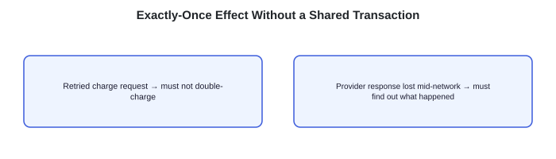

"Retried charge request" (must not double-charge) and "Provider response lost mid-network" (must find out what happened), both labelled "How do you get an exactly-once EFFECT without a shared transaction?"

> **Key idea.** The external provider can never share a transaction with your database — exactly-once has to be engineered as an effect, from retry-safety and after-the-fact reconciliation, not from a guarantee the provider can't offer.

## Key concepts

This section covers the concepts needed to solve this problem — prerequisites for the design work that follows.

### Idempotency keys

A caller attaches a unique **idempotency key** to a request; the server stores which keys it has already processed, and a retry carrying the same key returns the original result instead of repeating the effect. This is what makes "the client didn't hear back, so it retries" safe by default rather than dangerous — the same mechanism used for at-least-once delivery generally, applied here to money.

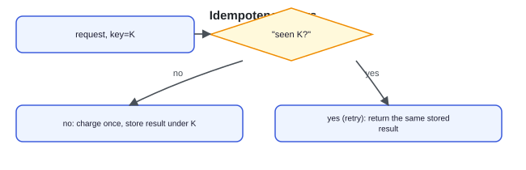

request, key=K → "seen K?" → no: charge once, store result under K / yes, retry: return the same stored result.

### The double-entry ledger

An **immutable** record of money movement: every payment writes a paired **debit** (money leaves an account) and **credit** (money enters another), and a balance is never stored as a value you overwrite — it is derived by summing an account's entries. Because nothing is ever mutated, the ledger doubles as a full audit trail: any balance can be reconstructed and proven from the entries that produced it, and a lost or corrupted update cannot happen the way it can to a mutable column.

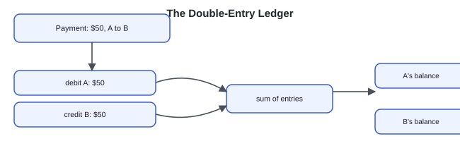

Payment: $50, A to B → debit A: $50 / credit B: $50 → (sum of entries) → A's balance / B's balance.

### Sagas and compensation

A **saga** breaks one logical operation into a sequence of local steps, each with a **compensating action** that undoes it if a later step fails — since no distributed transaction can span your database and the external provider. Authorizing a card and then capturing it are two separate provider steps; if capture fails after authorization succeeded, the compensation is voiding the authorization, not silently leaving it dangling.

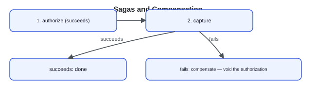

1. authorize (succeeds) → 2. capture → succeeds: done / fails: compensate — void the authorization.

### Reconciliation

Sagas handle failures the system *observes* — a step that returns an explicit error. They cannot handle a response that never arrives at all: the request may have succeeded on the provider's side with no way to tell from the caller's end. **Reconciliation** is the backstop for exactly this case — a batch job that periodically compares your ledger against the provider's own settlement report (its ground truth for what actually happened) and resolves any payment left in limbo.

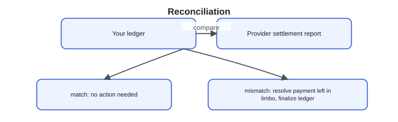

Your ledger ↔ compare ↔ Provider settlement report → match: no action needed / mismatch: resolve payment left in limbo, finalize the ledger.

> **Key idea.** Idempotency keys make retries safe; the double-entry ledger makes every balance derived and auditable rather than a value that can be silently lost; sagas compensate for failures the system can see, and reconciliation resolves the ones it can't.

## 1. Requirements

> **Before reading on.** Name three functional and three non-functional requirements, then name the one property you'd refuse to compromise.

### 1.1 Functional requirements

- **Initiate a payment** (payer, payee, amount, currency) and execute it through the provider.
- **Record** every money move in an auditable ledger.
- **Expose** balances and payment status.
- **Refund or void** a payment.

### 1.2 Non-functional requirements

- **Correctness (exactly-once effect).** Never double-charge, never lose a payment — the dominating requirement.
- **Durability and auditability.** Every money move is durable and immutable, a full audit trail rather than an overwritten balance.
- **Strong consistency on balances.** A balance reflects all committed moves; no eventual-consistency window where a balance can be overdrawn against reality.
- **Availability.** Accept payments through partial failure, degrading to "processing" rather than dropping a request.

### 1.3 The constraint versus the property

The property never to compromise is **correctness**: a payment counted exactly once, system-wide, no matter how many times a client retries or a network drops a response. The constraint that drives the design is that this has to hold without ever sharing a transaction with the external provider — which is why idempotency, an immutable ledger, and reconciliation, not a bigger or faster database, are the mechanisms that carry the weight.

> **Key idea.** Correctness is the property that can't bend; doing it without a shared transaction across an external provider is the constraint the rest of the design answers.

## 2. Back-of-the-envelope estimation

**Interactive estimation widget (default values shown):**

| Metric | Value | Note |
|---|---|---|
| Peak payments / sec | 10K/s | |
| Ledger entries / payment | 2 | |
| Bytes / ledger entry | 200B | |
| Payments / day (reconciliation) | 500M | |
| Ledger writes / sec | 20K/s | 10K/s × 2 entries |
| Ledger write bandwidth | 4.0MB/s | comfortably within a sharded transactional store |
| Daily reconciliation batch | 500M rows | a routine batch scan against settlement files |
| Payment volume vs. an analytics firehose | modest | correctness dominates, not raw throughput |

Formula shown: `ledger writes = 10K/s × 2 ≈ 20K/s — well within a sharded, transactional store`

Payment volume itself is modest next to a high-QPS analytics or ad system. The design is won on correctness under failure, not raw scale.

### 2.1 Payment throughput

Assume roughly 10,000 payments a second at peak — illustrative, modest next to a high-QPS analytics or ad system.

### 2.2 Ledger writes

Double-entry accounting means every payment writes at least two ledger rows: `10,000 × 2 = 20,000` ledger writes a second at minimum — comfortably within a sharded, transactional store.

### 2.3 Storage and reconciliation

A payment record and its ledger entries are well under a kilobyte combined; the entire ledger stays small next to any media or event-log system. The daily reconciliation batch re-checks every payment against the provider's settlement file, sized by daily payment count — hundreds of millions of rows a day if the assumed peak rate were sustained, and still a routine batch scan, not a real-time concern.

> **Key idea.** Payment volume itself is modest; the design optimizes for correctness under failure, not for absorbing a high write rate.

## 3. API design

**Design checkpoint widget:** *"A client's POST /payments times out with no response. What should the client do?"* Options: (a) *Assume the payment failed and try a brand-new payment*; (b) *Retry the exact same request with the same idempotency key* — the design picks (b).

### 3.1 Initiate a payment

`POST /v1/payments`

**Request & response (expanded):**
- Request body: `{ idempotency_key, payer, payee, amount, currency }`
- Response body: `{ payment_id, status: pending|succeeded|failed }`

The caller generates `idempotency_key`; a retry carrying the same key returns the same `payment_id` and status rather than initiating a second payment.

### 3.2 Check payment status

`GET /v1/payments/{id}`

**Request & response (expanded):**
- Response body: `{ status, ledger_refs }`

### 3.3 Refund a payment

`POST /v1/payments/{id}/refund`

**Request & response (expanded):**
- Request body: `{ idempotency_key, amount }`
- Response body: `{ refund_id, status }`

A refund is itself a money movement and carries its own idempotency key, for the same reason the original payment does.

> **Key idea.** Every write-side endpoint carries its own idempotency key, because every one of them can be retried after an ambiguous failure.

## 4. Data model

### 4.1 Payment

The record of one payment's lifecycle, tracked through an explicit saga state.

- `string payment_id`
- `string payer`
- `string payee`
- `decimal amount`
- `string currency`
- `enum status`
- `string idempotency_key`
- `enum saga_state`
- `timestamp created_at`

`saga_state` moves through `authorizing → authorized → capturing → captured`, with `compensating` and `in_doubt` as the two paths a failure can take (the idempotency deep dive covers `in_doubt` in full).

### 4.2 Ledger entry

Immutable by design — nothing about this row is ever updated after it's written.

- `string entry_id`
- `string account_id`
- `string payment_id`
- `enum direction`
- `decimal amount`
- `timestamp created_at`

### 4.3 Idempotency mapping

- `string idempotency_key`
- `string payment_id`

A unique constraint on `idempotency_key`, so a concurrent duplicate request fails to insert a second mapping rather than racing to create two payments.

### 4.4 Where each entity lives, and what's atomic

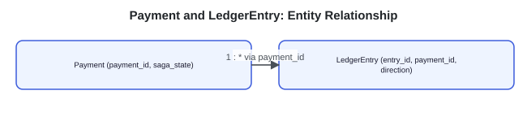

ER-style: Payment (1) —* LedgerEntry (*) via payment_id; Payment holds payment_id, saga_state; LedgerEntry holds entry_id, payment_id, direction.

`Payment` and `IdempotencyMapping` are written by the API server and the saga worker at different points in a payment's life. `LedgerEntry` rows are written only by the worker, at capture time, and — this is the one non-negotiable atomicity requirement — the debit, the credit, and the payment's status flip to `captured` all commit in a single transaction. A balance is never a column; it is always the sum of `LedgerEntry` rows for an account, so there is no separate "update the balance" step to lose.

> **Key idea.** Payment and ledger_entry are written by different actors at different times, but the ledger write and the status flip to captured must be one atomic transaction — that's the one place a partial write would corrupt money.

## 5. High-level design

> **Before reading on.** You already have idempotency keys, the double-entry ledger, sagas, and reconciliation from Key concepts. Sketch what happens from "client calls POST /payments" to "money has moved," and where each of those four mechanisms plugs in.

### 5.1 Charge the card, update a balance

Start naive: the API server calls the provider directly and, if it succeeds, updates a balance column in the database.

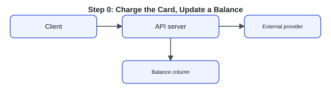

Client → API server → External provider; API server → Balance column.

Four things break this.

- A retried request calls the provider a second time and charges the card twice.
- If the provider's response is lost after the charge succeeds, the caller has no way to know whether it happened.
- A mutable balance column can lose a concurrent update, and it carries no audit trail of how it got to its current value.
- The external provider cannot join a transaction with your database, so "charge and update" is never really atomic to begin with.

### 5.2 Fix 1: an idempotency gate

Before doing anything else, look up the request's `idempotency_key`. If it's been seen, return the existing payment; if not, create a new payment record and proceed.

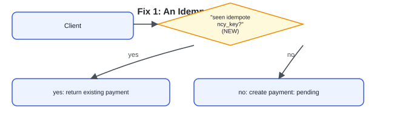

Client → "seen idempotency_key?" (NEW) → yes: return existing payment / no: create payment: pending.

Double-charging on retry is fixed. A lost provider response still leaves the caller unsure what happened, and the balance column is still mutable and unaudited.

### 5.3 Fix 2: an async state machine

The payment is created `pending` and handed to a worker that drives it through the provider asynchronously, passing the same idempotency key downstream so a provider that supports idempotent requests dedups a retried call.

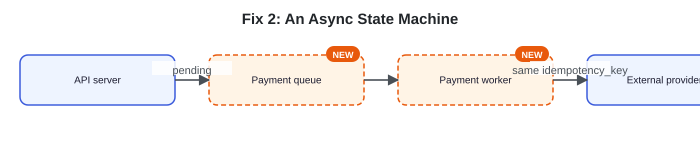

API server → (pending) → Payment queue (NEW) → Payment worker (NEW) → (same idempotency_key) → External provider.

The caller gets an immediate, honest `pending` instead of blocking on an uncertain provider call. The balance is still a mutable column with no audit trail.

### 5.4 Fix 3: a double-entry ledger

On capture, the worker writes the immutable debit/credit pair and flips the payment's status, in one transaction.

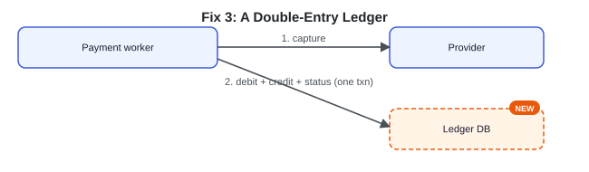

Payment worker → 1. capture → Provider; Payment worker → 2. debit + credit + status (one txn) → Ledger DB (NEW).

Balances are now derived and auditable. The provider still can't join that transaction — a saga failure between authorize and capture has no compensation yet.

### 5.5 Fix 4: a saga with compensation, backstopped by reconciliation

Each provider step gets a compensating action on failure — void an authorization, issue a reversing refund — and a daily reconciliation job compares the ledger against the provider's settlement report to catch anything a compensation couldn't.

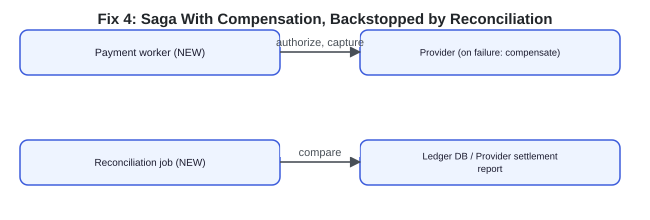

Payment worker (NEW) → authorize, capture → Provider (on failure: compensate); Reconciliation job (NEW) → compare → Ledger DB / Provider settlement report.

### 5.6 The composed design

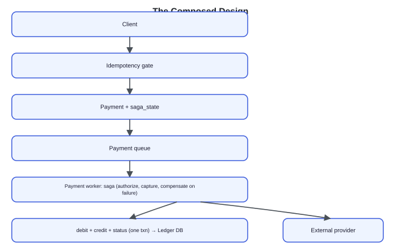

Full composed design: Client → Idempotency gate → Payment + saga_state → Payment queue → Payment worker: saga (authorize, capture, compensate on failure) → External provider; Payment worker → debit + credit + status (one txn) → Ledger DB; Reconciliation job → compare → Ledger DB / Provider settlement report.

Each fix answers one failure of the naive version: the idempotency gate fixes double-charging, the async state machine fixes blocking on an uncertain call, the double-entry ledger fixes lost or unaudited balance updates, and the saga plus reconciliation fixes the absence of a shared transaction with the provider.

> **Key idea.** Every component traces to one concrete failure of "charge the card, update a balance" — double-charging, uncertainty, lost updates, and the un-transactable provider — not a pre-known architecture diagram.

## 6. Deep dives

### 6.1 Idempotency and the in-doubt problem

> **Before reading on.** Your worker calls the provider to capture, and the call times out. The money may or may not have moved. What state do you put the payment in, and how is the truth finally established?

The idempotency key is stored at your own gate *and* passed down to the provider, so a retry dedups at both layers: even if your worker doesn't know whether the first capture succeeded, a provider with idempotent request support recognizes the repeated key, within its retention window, and returns the original outcome rather than executing a second charge. Where the provider offers no such guarantee, querying it by your own payment reference — and reconciliation — fills the gap.

That still leaves the moment right after a timeout, before any retry happens. The temptation is to mark the payment `failed` and move on, but that's wrong — a timeout means the response was lost, not that the charge failed; the money may well have moved. The correct state is `in_doubt`, a state that explicitly says "unresolved" rather than guessing in either direction. The provider's settlement report is ground truth for what actually happened, and the reconciliation job matches every `in_doubt` payment against it, finalizing the ledger once the real outcome is known.

**Simulation widget:** tabs "Happy path" / "Capture times out"; controls "Play" / "Step" / "Reset"; state readout `payment.saga_state: pending`; `ledger: (no entries yet)`; status line "Payment created after the idempotency gate confirms this key hasn't been seen before."

What to watch: the count and age of `in_doubt` payments (a payment stuck there for hours signals something is wrong with reconciliation itself), and any mismatch between the ledger and the provider's settlement report after a reconciliation run — both are alarm-worthy, since a mismatch is exactly the failure mode this entire design exists to prevent.

**"What separates answers — idempotency and the in-doubt problem" (expandable rating list):**
- **Bad** — Retry on timeout
- **Good** — Idempotency keys at your gate, in_doubt on timeout
- **Great** — Keys passed to the provider, settlement reports as ground truth

### 6.2 The double-entry ledger

> **Before reading on.** Why not just store an account balance and add to it? Name two things that model can't do that money requires.

A mutable balance column can lose a concurrent update — two debits racing against the same row can clobber each other depending on how the update is written — and it carries no history: once overwritten, there's no record of how the balance arrived at its current value. Double-entry rows fix both. Every payment writes a paired debit and credit, immutably; a balance is never stored directly, only derived by summing an account's entries, so there is no mutable value to race against or lose.

That derivation has to stay correct under concurrency and under the possibility of overdraft. An overdraft check reads the account's current derived balance inside the *same* transaction as the debit that would create it — with `SERIALIZABLE` isolation or an explicit per-account lock, since default isolation levels still let two concurrent debits both pass the check against the same balance.

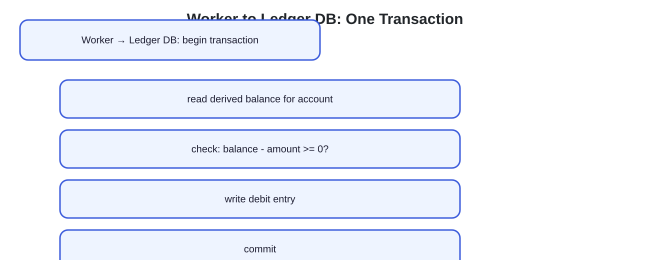

Worker → Ledger DB — begin transaction → read derived balance for account → check: balance - amount >= 0? → write debit entry → commit.

A hot account — one being debited or credited very frequently — needs its writes serialized (or its ledger sharded across sub-accounts) so contention doesn't become a bottleneck, the same problem any high-contention row creates. Sharding across sub-accounts means splitting one merchant account into N sub-ledgers (say, hashed by `payment_id`), writing each incoming payment's entry to just one sub-ledger, and deriving the merchant's total balance as the sum across all N — spreading the write contention across N rows instead of serializing every payment through one. For performance, a materialized balance can be kept as a cache, but only ever updated in the same transaction as the entries that justify it — never as a separate step that could drift from the truth. The system-wide correctness check is an invariant enforced per payment: each payment's legs must balance, its debits and credits summing to zero per currency. This is checked continuously across the ledger, and any unbalanced payment is proof that something in the write path is broken.

**Design checkpoint widget:** *"A materialized balance column exists purely as a read-path optimization. When is it safe to update?"* Options: (a) *Whenever it's convenient, as a background job*; (b) *Only inside the same transaction as the ledger entries that change it* — the design picks (b).

**"What separates answers — the double-entry ledger" (expandable rating list):**
- **Bad** — A mutable balance column
- **Good** — Immutable double-entry rows, derived balance
- **Great** — Same-transaction materialized balance, overdraft check, contention handling, global invariant

### 6.3 Sagas and reconciliation

> **Before reading on.** Authorizing then capturing a card is two separate provider steps, and either can fail. Without a distributed transaction, how do you keep your ledger consistent with the provider?

Authorize and capture mirror how card networks actually work: authorization holds funds without claiming them, and capture is a separate step that claims them — cheaper to reverse (void the authorization) than to reverse a completed capture (a refund). Compensation attaches to steps that *succeeded*: an authorization that will never be captured is voided, and a completed capture that must be unwound is reversed with a refund. A failed authorization needs no compensation — there is no hold to void. Every step must be idempotent and resumable, because a worker can crash mid-saga and be replaced by another one picking up exactly where it left off.

Sagas and reconciliation are not redundant — they handle two different failure categories. A saga compensates for failures the system *observes*: a step that returns an explicit error. Reconciliation resolves failures the system cannot observe at all — a response that never arrives, leaving a step's true outcome unknown until the provider's settlement report says otherwise. Neither replaces the other; a saga without reconciliation has no backstop for the in-doubt case, and reconciliation without a saga has no way to unwind a step that failed cleanly and visibly.

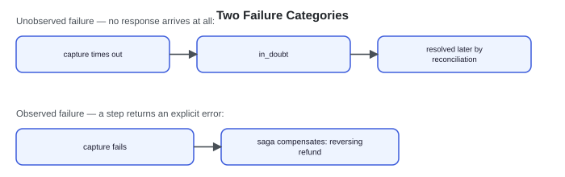

Two scenarios: "Unobserved failure — no response arrives at all": capture times out → in_doubt, resolved later by reconciliation. "Observed failure — a step returns an explicit error": capture fails → saga compensates: reversing refund.

**"What separates answers — sagas and reconciliation" (expandable rating list):**
- **Bad** — Assume every step succeeds
- **Good** — A saga with compensations, idempotent and resumable
- **Great** — Maps to the card network's two phases, reconciliation as the irreplaceable backstop

> **Key idea.** Idempotency at both the gate and the provider closes the retry gap; a per-payment debits-equal-credits invariant is the ledger's own correctness alarm; and sagas handle observed failures while reconciliation handles the unobserved ones neither the saga nor the client can detect on their own.

## 7. Variants

### 10× scale

Payment throughput grows, but correctness still matters more than raw rate: the ledger shards by account, keeping per-account writes serialized so the debits-equal-credits invariant and overdraft checks never race across shards.

### Internal wallet transfers

A wallet-to-wallet transfer stays entirely within your own ledger — both the debit and credit sides can commit in one transaction, since there's no external provider in the loop at all. That removes the in-doubt state and reconciliation from this path entirely; they exist specifically to bridge a boundary this variant doesn't have.

### Multi-currency

A cross-currency payment adds a foreign-exchange step — its own quoted rate and its own provider call — into the saga, and the ledger records both legs of the conversion in their native currencies rather than forcing everything into one.

> **Key idea.** The architecture holds at 10× scale by sharding the ledger per account; removing the external provider (internal transfers) removes the in-doubt state and reconciliation entirely, since those exist only to bridge a boundary you don't control.

## 8. The transferable pattern

A money-moving system is idempotency plus an immutable ledger plus sagas plus reconciliation: idempotency keys make retries safe by default, the ledger makes every balance derived and auditable instead of a value that can silently drift, sagas compensate for the failures the system can see, and reconciliation resolves the ones it can't. The common thread is that none of these mechanisms depends on a transaction spanning a system you don't control — exactly-once is engineered as an effect, not assumed as a guarantee. The same shape reappears anywhere a system coordinates with an external, untransactable party: booking a flight through an airline's reservation system, provisioning a resource through a third-party cloud API, or any workflow where "it might have happened, and I need to find out" is a real state, not a bug.

## Review: the 30-second answer

- The external provider can never share a transaction with your database — exactly-once has to be built from retry-safety and after-the-fact reconciliation.
- An idempotency key, stored at your gate and passed to the provider, makes a retried request safe by default.
- A double-entry ledger derives balances from immutable entries instead of a mutable column, giving correctness and a full audit trail together.
- A timed-out call is `in_doubt`, never guessed as failed or succeeded — the provider's settlement report resolves it.
- Sagas compensate for failures the system observes; reconciliation catches the ones it can't.

## Quiz

**Quiz widget ("Payment System Design Quiz")** — "Hide All" / "Reveal All" toggle — 5 questions, each with a "Show/Hide Answer" button. Full text of every question and its revealed answer:

**1) Why can't 'charge the card, then update a balance' be made correct just by adding a database transaction around both steps?**
The external payment provider is not part of your database and cannot participate in a distributed transaction with it. Wrapping the two calls in your own transaction only protects your side — if the provider call succeeds but the response is lost, or your process crashes between the two steps, there is no transaction boundary spanning both systems to roll back or commit atomically.

**2) A client's request times out and it retries with the same idempotency key. Walk through why this is safe.**
The server's idempotency gate recognizes the key as already processed and returns the original payment's result instead of executing a new charge. If the timeout happened before the provider call, the key was passed to the provider too, so even the provider-level retry recognizes it and returns the original outcome rather than charging again. Either way, the retry produces the same result as if it had never been sent.

**3) Why is 'in_doubt' a necessary third state, rather than just choosing between 'succeeded' and 'failed' when a capture call times out?**
A timeout means the response was lost, not that the operation failed — the charge may have completed on the provider's side with no way for the caller to know yet. Guessing either 'succeeded' or 'failed' risks being wrong in a way that either loses money or double-charges later; 'in_doubt' is an honest statement that the outcome is unknown until the provider's settlement report resolves it.

**4) Why does a double-entry ledger derive balances instead of storing them directly, and what does that buy you?**
Storing a balance as a mutable column means a concurrent update can be lost, and there's no record of how the balance reached its current value. Deriving it as the sum of immutable debit/credit entries means there's no mutable value to race against, and every balance is provably reconstructable from the entries that produced it — an audit trail comes for free rather than needing to be maintained separately.

**5) Why do sagas and reconciliation both need to exist, rather than one replacing the other?**
A saga compensates for failures the system observes directly — a step that returns an explicit error, which triggers a defined compensating action. Reconciliation exists for the failures a saga structurally cannot see: a response that never arrives at all, leaving the true outcome unknown until compared against the provider's own settlement report. Removing either leaves a gap the other was never designed to cover.

## Sources and further reading

- Idempotent requests — Stripe API docs — the canonical idempotency-key contract for retry-safe payments: the key is stored, and a retry returns the same result rather than repeating the effect.
- Sagas — Garcia-Molina & Salem, SIGMOD 1987 — long-lived transactions modeled as local steps plus compensations, the paper behind the payment saga.

---

