# Design a Web Crawler

Source: https://systemdesignschool.io/problems/web-crawler/solution

> Note on fidelity: like the rest of the site, this page is built mostly from JS-interactive pieces (an animated URL-frontier simulation, tabbed diagram steps, design-checkpoint multiple-choice widgets, expandable API request/response bodies, and a quiz with click-to-reveal answers) rather than static images. Everything behind those interactions — the diagram box/arrow labels, the data-model field lists, both API request/response bodies, and all five quiz answers — was expanded live in the browser (via "Reveal All" / "Show Answer" and the request-response toggles) and is transcribed below as text, in the same order it appears on the page. There are no downloadable diagram image files on this page (every diagram is a live JS/SVG widget, not an ``), so no image assets exist to save.

Tags: Hard difficulty · Sharding · Async processing · Bloom filters · Object storage

---

## Problem statement

Design a system that crawls the web: start from a set of seed URLs, fetch each page, extract its links, and keep going — billions of pages deep — so a downstream system (a search index, an archive, a training corpus) has the content.

In scope: fetching pages, extracting and enqueueing links, deduplicating URLs and content, and recrawling for freshness. Out of scope: the search index or archive itself, ranking, and rendering client-side JavaScript (a variant).

## Clarifying questions

Each answer fixes an assumption the design leans on.

- **What's downstream?** A search index, an archive, or a training corpus — something that consumes fetched content, not part of this design.
- **Scale and completeness?** Billions of pages, best-effort coverage — not a guarantee that every page on the web gets fetched.
- **How fresh must pages be?** Some pages change hourly; most rarely. Freshness is a per-page policy, not a single global answer.
- **Render JavaScript?** Usually deferred as an optional, expensive stage for the pages that need it.
- **Respect `robots.txt`?** Yes, always. Politeness and robots compliance are non-negotiable, not features to trade off.

## What makes this problem distinctive

The naive version of this problem is "a queue of URLs, workers fetch and enqueue the links." That's right in spirit and wrong in every detail that matters at scale, for two reasons.

The same URL gets discovered from many different pages — a popular page might be linked from a million others. Without a way to recognize "already seen," the crawler re-fetches it endlessly and never converges. And links are not evenly spread across hosts: a single site can have hundreds of internal links pointing back into itself. Fetch one host too fast and its server falls over, or it bans the crawler's IP — and once banned, that host is gone from the crawl entirely. The system needs a queue that is deduplicated and *per-host rate-limited*, not just a queue.

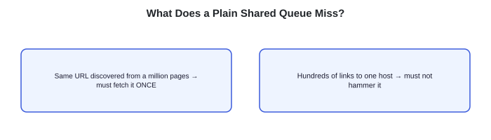

"Same URL discovered from a million pages" → must fetch it ONCE; "Hundreds of links to one host" → must not hammer it.

> **Key idea.** A plain shared queue re-fetches the same popular URL forever and hammers whichever host has the most internal links — dedup and per-host politeness are the two things a queue alone doesn't give you.

## Key concepts

This section covers the concepts needed to solve this problem — prerequisites for the design work that follows.

### Bloom filters for URL dedup

Testing "have I seen this URL" against billions of URLs with an exact set is expensive: even 64-bit hashes run roughly 80 GB at 10 billion URLs, and full URL strings run far larger. A Bloom filter is a compact, probabilistic set: it never wrongly says "not seen" for a URL actually added (no false negatives, so a real duplicate is always caught), but it can rarely claim "seen" for a URL that's genuinely new (a false positive, which just skips that one page). That asymmetry — skipping an occasional new page is a rounding error at web scale, re-fetching everything forever is not — is why a Bloom filter, not an exact set, is the standard tool here.

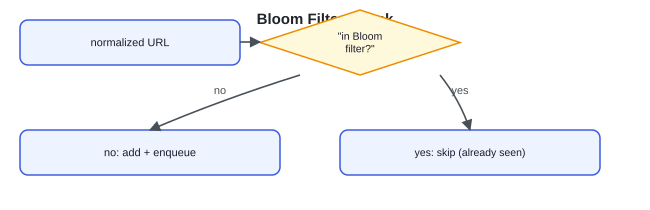

Bloom filter check: normalized URL → "in Bloom filter?" → no: add + enqueue / yes: skip (already seen).

### Per-host politeness

A host's `robots.txt` can disallow parts of the site, and some hosts also declare a `crawl-delay` — a requested minimum gap between fetches. Ignoring either is how a crawler gets its IP blocked by a site, halting progress on that host until it backs off or is unblocked. Politeness means treating "how fast can I hit this host" as a property of the host, tracked and enforced independently of everything else being crawled.

> **robots.txt.** A file at a site's root declaring which paths crawlers may not fetch (`User-agent`, `Allow`, `Disallow`), standardized in RFC 9309. `Crawl-delay` — how long to wait between requests — is a common but non-standard extension: some sites declare it and some crawlers honor it, so a polite crawler defines its own interpretation and a default gap when it's absent.

### Two-level queue: priority versus per-host order

A single queue can express "what to fetch next" (priority) or "one host at a time" (politeness), but not both at once — sorting by importance scatters one host's URLs throughout the queue, and grouping by host loses any sense of priority. Splitting into two levels resolves this: a **front** layer of queues buckets URLs by priority; a **back** layer holds one queue per host and releases its next URL only once that host's crawl-delay has elapsed. How URLs move between the two levels is worked out in the URL frontier deep dive below.

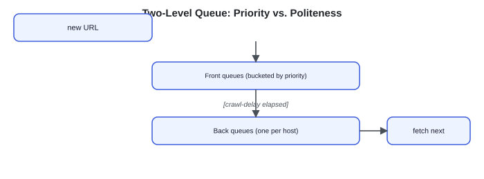

Two-level queue: new URL → Front queues (bucketed by priority) → [crawl-delay elapsed] → Back queues (one per host) → fetch next.

### Content versus metadata split

A fetched page is large, opaque bytes; the record of that it was fetched — its URL, a content hash, an `etag`, when it was fetched — is small and structured. The same split as any large-object system: bytes belong in an object store, and a small metadata row referencing them belongs in a database. A **conditional `GET`** (sending the stored `etag` and getting a cheap "unchanged" response back if nothing has changed) is what makes checking a page for updates affordable without re-downloading it.

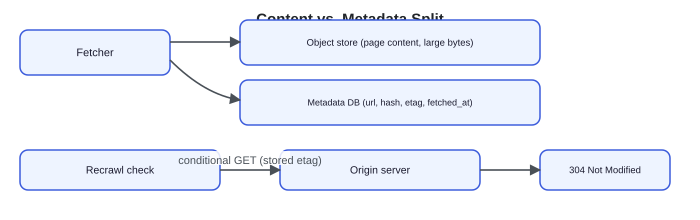

Content/metadata split: Fetcher → Object store (page content, large bytes) / Metadata DB (small row: url, hash, etag, fetched_at, references blob); Recrawl check → Origin server → conditional GET (stored etag) → 304 Not Modified.

> **Key idea.** A Bloom filter makes "have I seen this URL" cheap at billions of entries; per-host politeness is enforced as a property of the host, not the crawler as a whole; a two-level queue is what lets priority and politeness coexist; and content/metadata split the same way any large-object system does.

## 1. Requirements

> **Before reading on.** List the functional and non-functional requirements, then name the one property you would never compromise and the one constraint that drives the design.

### 1.1 Functional requirements

- **Fetch** a URL and store its content.
- **Extract links** from a fetched page and enqueue the new ones.
- **Deduplicate.** Never redundantly enqueue a URL already seen, and never store the same content twice — scheduled recrawls (below) are the deliberate exception.
- **Recrawl** pages for freshness, based on how often each page tends to change.

### 1.2 Non-functional requirements

- **Politeness.** Never overload a host; obey `robots.txt` and per-host crawl-delay. This is a correctness requirement — violating it gets the crawler banned.
- **Scale and throughput.** Billions of pages; thousands of fetches a second, sustained.
- **No traps.** Bounded work per URL; the crawler must not loop forever on an infinite URL space (a calendar with a "next month" link, for instance).
- **Robustness.** Survive oversized pages, timeouts, redirect loops, and malformed HTML without stalling a worker.
- **Freshness.** Keep fast-changing, important pages reasonably up to date.

### 1.3 The constraint versus the property

The property never to compromise is **politeness**: a crawler that overloads or gets banned from a host stops making progress on that host for as long as the block lasts. The constraint that drives the design is doing this at billions of URLs and thousands of fetches a second, which rules out a single shared queue and forces a structure that tracks dedup and per-host timing independently at scale.

> **Key idea.** Politeness is the property that can't bend; sustaining it at billions of URLs and thousands of fetches a second is the constraint the frontier design answers.

## 2. Back-of-the-envelope estimation

**Interactive estimation widget (default inputs):**

| Input | Default |
|---|---|
| Target fetch rate | 10K/s |
| Avg page size | 50KB |
| Total URLs seen | 10B |
| Bloom filter bits / URL | 10 bits |

**Computed outputs:**

| Output | Value | Formula shown |
|---|---|---|
| Ingest bandwidth | 500MB/s | 10K/s × 50KB |
| Bloom filter size | 12.5 GB | 10B URLs × 10 bits |
| Exact set would cost | ~400 GB | illustrative, ~40B/entry hash set |
| Bloom vs. exact | 32× smaller | same billions of URLs |

seen-set = 10B × 10 bits ÷ 8 ≈ 12.5 GB, versus ~400 GB for an exact set. The seen-set stays in the gigabytes even at billions of URLs. The content itself is what dominates bandwidth and storage.

### 2.1 Fetch throughput

Assume a target of about 10,000 pages a second, each page around 50 KB. That's `10,000 × 50 KB ≈ 500 MB/second` of content flowing into the system — the number the fetcher fleet and content storage have to sustain.

### 2.2 The seen-set

Assume roughly 10 billion URLs need a "have I seen this" check. A Bloom filter at about 10 bits per URL costs `10,000,000,000 × 10 bits ≈ 12.5 GB` — small enough to fit in memory on a handful of machines, versus roughly 80 GB for exact 64-bit hashes of the same count — and far more for full URL strings.

### 2.3 The frontier itself

Billions of discovered-but-not-yet-fetched URLs sit in the frontier at any given time, far more than fits in memory on one machine — the frontier has to be disk-backed and sharded, with only the next-to-fetch head of each host's queue kept hot.

> **Key idea.** The seen-set stays in the gigabytes even at billions of URLs; content bandwidth (hundreds of MB/second) and the disk-backed frontier are what actually have to scale.

## 3. API design

**Design checkpoint widget:** *"The outward API only needs to accept seed URLs and serve fetched content. Where does the actual design work happen — in the public API, or somewhere else?"* Options: (a) *In the public API surface (seed submission and content retrieval)*; (b) *In the internal frontier operations (enqueue, dedup check, next-fetchable) that the public API barely touches*. (The page's own "Key idea" below §3 confirms the real interface is internal — option (b).)

### 3.1 Submit seed URLs

The gateway calls this on every request. Seeds are the only URLs a caller provides directly; everything else is discovered by parsing fetched pages.

`POST /v1/seeds`

**Request & response (expanded):**

Request body:
```
{
  urls[],
  priority
}
```

Response body: `202 Accepted`

### 3.2 Read fetched content

This serves the downstream consumer (the search indexer, typically) the stored content reference and metadata for a URL already crawled.

`GET /v1/pages/{url}`

**Request & response (expanded):**

Response body:
```
{
  content_ref,
  fetched_at,
  status,
  content_hash
}
```

> **Key idea.** The public API is thin — submit seeds, read results — because the real interface is internal: enqueue after dedup, ask what's next-fetchable per host, and mark a URL seen.

## 4. Data model

### 4.1 Page

The record of a URL once it has actually been fetched.

Page schema:
```text
Page {
  string url
  string content_ref
  string content_hash
  timestamp fetched_at
  string etag
  enum status
}
```

### 4.2 Frontier entry

A link is not a page yet — it's a candidate, with a priority and a host to be politely scheduled against.

FrontierEntry schema:
```text
FrontierEntry {
  string url
  string host
  int priority
  timestamp discovered_at
}
```

### 4.3 Seen (dedup state)

A membership test over billions of URLs — the Bloom filter from Key concepts, sharded by URL hash so no single node holds the whole thing.

Seen schema:
```text
Seen {
  bloomfilter normalized_url_hashes
}
```

### 4.4 Host

Politeness is a property of the host, so it gets its own record.

Host schema:
```text
Host {
  string hostname
  string robots_rules
  int crawl_delay
  timestamp next_fetch_allowed_at
}
```

### 4.5 Where each entity lives

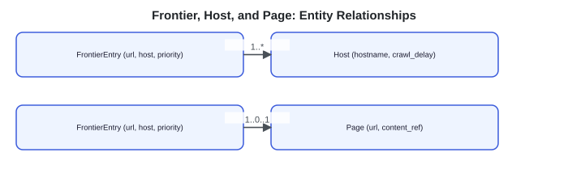

Entity relationships: FrontierEntry (url, host, priority) —1..*— Host (hostname, crawl_delay); FrontierEntry —1..0..1— Page (url, content_ref).

Page content bytes live in an object store; the `Page` row itself, `FrontierEntry`, and `Host` records live in databases sized for their access pattern (the frontier is disk-backed and sharded by host; `Host` is small and read on every fetch decision). `Seen` lives in its own sharded Bloom filter service, checkpointed so a restart doesn't forget what's already been crawled.

> **Key idea.** Four entities, each forced by the one before it: a page needs a frontier entry to have arrived from somewhere, the frontier needs a seen-set to avoid duplicates, and per-host politeness needs its own record independent of any single URL.

## 5. High-level design

> **Before reading on.** You already have Bloom-filter dedup and the two-level priority/politeness queue from Key concepts. Sketch what happens from "seed URL" to "new links back in the queue," and where each of those two mechanisms plugs in.

### 5.1 A queue and a worker pool

Start naive: seed URLs go on a single shared queue; a pool of workers pops a URL, fetches it, stores the content, and pushes any newly-discovered links back onto the same queue.

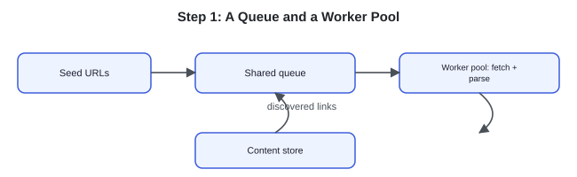

Step 1: Seed URLs → Shared queue → Worker pool: fetch + parse → Content store; discovered links loop back to Shared queue.

Four things break this at scale.

- A popular URL discovered from a million pages gets pushed onto the queue a million times and re-fetched endlessly.
- Hundreds of links into one host get fetched by many workers simultaneously, overloading it and risking a ban.
- The queue holds billions of pending URLs — far past what fits in memory on one machine.
- Nothing ever revisits a page that was already crawled, so the content goes stale forever.

### 5.2 Fix 1: dedup before enqueue

Every discovered URL is normalized (lowercased host, sorted query parameters, fragment stripped) and checked against the Bloom filter from Key concepts before it's added to the queue; only unseen URLs get enqueued.

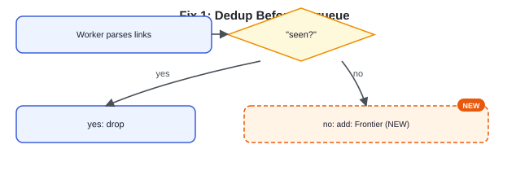

Step 2: Worker parses links → "seen?" → yes: drop / no, add: Frontier **NEW**.

Re-discovery loops are fixed. Hosts can still be hammered by many workers hitting them at once.

### 5.3 Fix 2: route by host, enforce crawl-delay

Route each URL to a per-host queue via consistent hashing, and let one worker at a time fetch from a given host, spaced out by that host's crawl-delay — a small per-host concurrency is possible, but one in-flight request is the safe default.

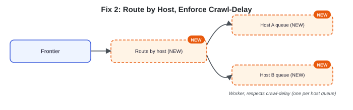

Step 3: Frontier → Route by host **NEW** → Host A queue **NEW** / Host B queue **NEW** → Worker, respects crawl-delay (one per host queue).

Politeness is enforced. The frontier is still one shared structure with no persistence story, and nothing revisits an already-fetched page.

### 5.4 Fix 3: a sharded, persisted frontier

Make the frontier a disk-backed, sharded, prioritized queue — the front/back two-level structure from Key concepts — keeping only the next-to-fetch head of each host's queue in memory.

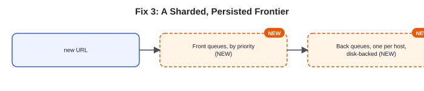

Step 4: new URL → Front queues, by priority **NEW** → Back queues, one per host, disk-backed **NEW**.

### 5.5 Fix 4: split content from metadata, recrawl by policy

Page bytes go to an object store; a small metadata row (`url`, `content_hash`, `fetched_at`, `etag`) goes to a database. A recrawl scheduler re-enqueues pages by how often they tend to change, using a conditional `GET` to skip pages that haven't.

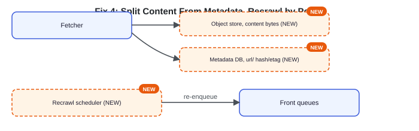

Step 5: Fetcher → Object store, content bytes **NEW**; Fetcher → Metadata DB, url/hash/etag **NEW**; Recrawl scheduler **NEW** → re-enqueue → Front queues.

### 5.6 The composed design

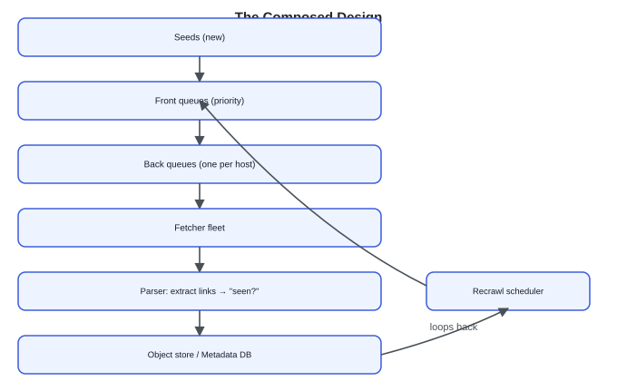

Composed: Seeds (new) → Front queues (priority) → Back queues (one per host) → Fetcher fleet → Parser: extract links → "seen?" → Object store / Metadata DB → Recrawl scheduler (loops back into Front queues).

Each fix answers one failure of the naive queue: dedup fixes re-discovery loops, per-host routing fixes overload, the sharded two-level frontier fixes scale, and the content/metadata split with a recrawl scheduler fixes staleness.

> **Key idea.** Every component traces to one concrete failure of "a queue and workers" — re-discovery, host overload, frontier scale, and staleness — not a pre-known architecture diagram.

## 6. Deep dives

### 6.1 The URL frontier

> **Before reading on.** You want to crawl important pages first, and you also want to never fetch one host twice within its crawl-delay. Those two goals pull on the same queue in different directions. How do you satisfy both?

The two goals don't share a sort key. Priority wants to order by importance; politeness wants to group by host and space out each group's fetches. A single queue can express one ordering, not both — the classic **Mercator** design resolves this by splitting into two levels. **Front queues** implement priority: a URL's importance (an estimated page rank, a freshness need) picks which front queue it enters. **Back queues** implement politeness: each back queue holds URLs for exactly one host, and a timing structure releases that host's next URL only once its crawl-delay has elapsed.

Pinning one host to exactly one back queue (via consistent hashing) is the simplest way to make politeness enforceable: if a host's URLs were scattered across many back queues, multiple workers could pull from different queues and fetch that host simultaneously — enforceable then only with a shared per-host rate limiter every worker consults. One queue per host guarantees fetches to that host are serialized and spaced out by a single clock.

**Interactive URL-frontier simulation widget:** sliders "Crawl-delay per host" (default 3 ticks), "Share of links to viral.example" (default 40%), "Per-host queue cap" (default 12); controls "Play" / "Reset"; readout "t = 0, shed for cap 0"; visualization is one back queue per host — bar height is queue depth, ring color shows crawl-delay cooldown — with four host panels each showing "queued" count, status ("ready"), and "fetched" count: **news.example** (0 queued, ready, fetched: 0), **shop.example** (0 queued, ready, fetched: 0), **blog.example** (0 queued, ready, fetched: 0), **viral.example** (0 queued, ready, fetched: 0). Caption: "Front queues assign new URLs by host; back queues fetch one URL per host, respecting crawl-delay." Running the simulation shows viral.example (which gets 40% of link share by default) filling its queue fastest and, once the per-host cap of 12 is reached, shedding new low-priority entries while the other three hosts continue fetching normally at their own crawl-delay pace.

Because the frontier holds billions of pending URLs, it's disk-backed, with only the ready head of each host's queue kept in memory; it's checkpointed so a crash doesn't force re-deriving pending work from the seen-set. A slow or unresponsive host stalls only its own back queue — other hosts keep fetching — and a host that suddenly floods the frontier with URLs has its queue capped, shedding low-priority entries rather than growing without bound. Per-host queue depth and fetch-rate dashboards are the signal: a deep queue with zero fetches means that host's crawl-delay (or a stall) is throttling it.

**Design checkpoint widget:** *"A host's back queue is capped and starts shedding new URLs. Is that a bug to fix, or expected behavior?"* Options: (a) *A bug — no URL should ever be dropped*; (b) *Expected — it's the mechanism that stops one host from growing its queue without bound at the expense of everything else*. (Confirmed correct by the surrounding prose: this is expected behavior.)

**What separates answers — the URL frontier:**
- **Bad** — One priority queue, politeness bolted on with sleeps
- **Good** — Separate priority and per-host queues
- **Great** — Mercator two-level frontier, pinned via consistent hashing, persisted and isolated

### 6.2 Dedup at scale

> **Before reading on.** A Bloom filter can occasionally say "already seen" for a URL that's actually new. What does that false positive cost, and why is it an acceptable trade at web scale?

A false positive means the crawler silently skips one genuinely new URL. At web scale, missing an occasional page out of billions is a rounding error, and the false-positive rate is a knob — more bits per URL brings it down further, at a memory cost. What the Bloom filter can never do is a false negative: it never claims "not seen" for a URL actually seen before, which is the direction that would matter (an infinite re-fetch loop). The asymmetry runs the safe way, which is exactly why the earlier tradeoff in Key concepts holds up under scrutiny.

URL dedup and content dedup are two separate mechanisms, keyed on different things. URL dedup (the Bloom filter) operates on the address — has this exact URL been queued before. Content dedup operates on the bytes: many different URLs — mirrors, session-id variants, printer-friendly pages — often serve identical or near-identical content. A content hash catches exact duplicates; a similarity hash (simhash or minhash) flags likely near-duplicates — a probabilistic check with tunable thresholds — keeping the same article from being stored and indexed under a dozen different URLs.

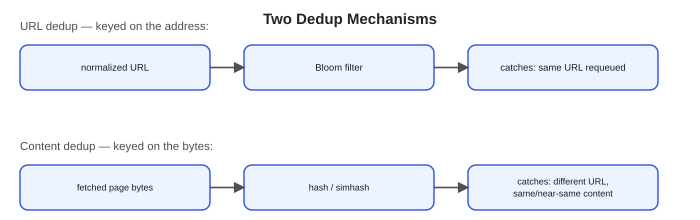

Two dedup mechanisms: "URL dedup — keyed on the address": normalized URL → Bloom filter → catches: same URL requeued. "Content dedup — keyed on the bytes": fetched page bytes → hash / simhash → catches: different URL, same or near-same content.

At 10-plus billion URLs, the Bloom filter itself is sharded across nodes by URL hash, with each shard checkpointed so a restart doesn't force re-crawling everything to rebuild it. Losing or corrupting a shard means the affected slice of URLs gets re-crawled — wasted fetches, but the crawl still respects politeness and eventually catches up, so it degrades rather than fails outright.

**What separates answers — dedup at scale:**
- **Bad** — An exact set of every URL string
- **Good** — A Bloom filter over normalized URLs
- **Great** — URL dedup and content dedup as separate mechanisms, sharded and checkpointed

### 6.3 Politeness, robots, and traps

> **Before reading on.** A site has a calendar page that links to "next month" forever, and a `robots.txt` that disallows `/private`. What must the crawler do to avoid both an infinite crawl and a ban?

Two separate hazards, two separate defenses. `robots.txt` compliance means fetching and caching each host's rules, honoring its `Disallow` paths and `Crawl-delay`, and defaulting to a conservative delay when none is specified — RFC 9309 standardizes the format. Non-compliance, not raw throughput, is how crawlers get blocked.

Infinite URL spaces — a calendar's endless "next month," faceted search permutations, a session id embedded in the path — generate an unbounded stream of technically-new URLs. Capping crawl depth and per-host page budgets bounds the damage; normalizing away session ids so those URLs collapse to the same normalized form lets the dedup mechanism from 6.2 catch what pattern detection misses. Every fetch also needs its own bounds regardless of the host: a timeout so one slow response can't stall a worker, a maximum page size so a multi-gigabyte response doesn't hang it either, and a cap on redirect chains so a redirect loop terminates.

Per-host error and ban-rate monitoring closes the loop: a host that starts returning `429` or `403` is signaling that the crawler is being throttled or blocked, and the correct response is to back off automatically, not retry harder.

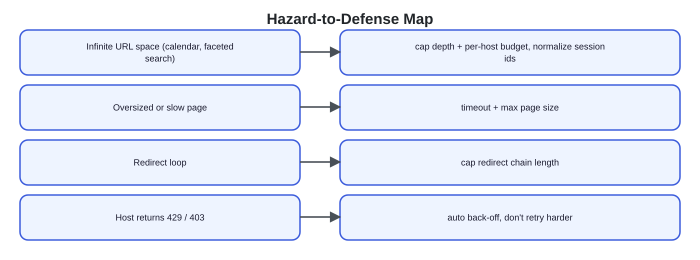

Hazard-to-defense map: "Infinite URL space (calendar, faceted search)" → cap depth + per-host budget, normalize session ids. "Oversized or slow page" → timeout + max page size. "Redirect loop" → cap redirect chain length. "Host returns 429 / 403" → auto back-off, don't retry harder.

**What separates answers — politeness, robots, and traps:**
- **Bad** — No robots.txt, no depth cap, no timeouts
- **Good** — Honors robots.txt and crawl-delay, caps depth and size
- **Great** — Trap detection plus every robustness bound, with automatic back-off

> **Key idea.** A Bloom filter's one safe-direction error (skipping a rare new URL) is what makes it usable at scale; URL dedup and content dedup catch different kinds of duplicates; and every crawl hazard — infinite spaces, oversized pages, redirect loops, bans — gets its own explicit bound rather than being left to chance.

## 7. Variants

**10× scale.** The frontier and seen-set shard further as URL count grows; the Bloom filter's memory grows with it but stays far under an exact set's cost, and the fetcher fleet scales with target throughput. Bandwidth and content storage become the dominant cost at this scale, pushing older content to tiered, cheaper storage and making prioritization — crawl the valuable pages, deprioritize the long tail — mandatory rather than a nice-to-have.

**Fresh-focused crawling (news, prices).** When freshness dominates over raw coverage, the recrawl scheduler becomes the lead component: pages are revisited on tight, per-page change-rate estimates, conditional `GET` skips unchanged content cheaply, and the priority function weights volatility over novelty. The crawl becomes mostly *re*-crawl rather than first-time discovery.

**JavaScript rendering.** Pages that build their content client-side need a headless browser to render before the parser can extract anything — far more expensive per page than a raw HTML fetch. Routing only JS-dependent pages to a dedicated rendering pool keeps the cheap raw-HTML path fast for the majority that don't need it.

> **Key idea.** The frontier and dedup mechanisms hold at 10× scale; freshness-heavy crawling shifts the recrawl scheduler to the center of the design, and JavaScript rendering is isolated to its own expensive pool rather than slowing down every fetch.

## 8. The transferable pattern

A web crawler is a prioritized, deduplicated, per-host-rate-limited frontier wrapped around a fetch-and-parse loop. A Bloom filter catches duplicates cheaply, while depth caps and per-host budgets bound the infinite URL spaces dedup alone can't; host-partitioned queues with crawl-delay timing keep the crawler from being banned; the two-level frontier is what lets crawl-priority and per-host restraint coexist without one undermining the other. Content and metadata split the same way any large-object system splits them. The same shape reappears anywhere a system discovers unbounded work from a shared resource that punishes being hit too fast — from crawling to polling third-party APIs with rate limits.

## Review: the 30-second answer

- A plain shared queue loops forever on popular URLs and hammers whatever host has the most internal links.
- A Bloom filter makes "have I seen this URL" cheap at billions of entries, at the cost of rare, harmless false positives.
- A two-level frontier — front queues for priority, one back queue per host for politeness — lets both goals coexist.
- Content bytes live in an object store; small metadata rows live in a database; a recrawl scheduler re-enqueues by change rate using conditional `GET`.
- Every crawl hazard (infinite URL spaces, oversized pages, redirect loops, bans) gets an explicit bound.

## Quiz

**Web Crawler Design Quiz widget** ("Hide All" / "Reveal All" toggle) — 5 questions, each with a "Show/Hide Answer" button. Full text of every question and its revealed answer:

**1) Why does a single shared queue of URLs fail even before considering scale?**
The same URL is frequently discovered from many different pages, so without a dedup check a shared queue re-enqueues and re-fetches it endlessly. Separately, one host can have hundreds of internal links, so pulling URLs off one shared queue with no per-host awareness lets multiple workers hit that host simultaneously, risking overload and an IP ban.

**2) Why does the URL frontier need two levels — front queues and back queues — instead of one?**
Priority (what to fetch first) and politeness (one host at a time, spaced out) are two different orderings over the same URLs, and a single queue can only express one sort order. Front queues bucket by priority; back queues, one per host, enforce crawl-delay timing independently of priority — splitting the concerns lets both be satisfied at once.

**3) Why is pinning exactly one host to exactly one back queue essential, not just a convenient implementation detail?**
If a host's URLs were spread across multiple back queues, different workers could pull from different queues and fetch that host at the same time, defeating politeness entirely. Pinning one host to one queue (via consistent hashing) guarantees all of that host's fetches are serialized through a single clock, so crawl-delay is actually enforced.

**4) A Bloom filter can produce a false positive. Why is that an acceptable trade here, when a false negative would not be?**
A false positive means skipping one genuinely new URL — at billions of URLs, an occasional missed page is negligible. A false negative would mean wrongly believing an already-seen URL is new, which the crawler would then re-fetch — but Bloom filters structurally cannot produce false negatives, so the only error direction possible is the cheap one.

**5) Why are URL dedup and content dedup treated as two separate mechanisms rather than one?**
They key on different things: URL dedup (a Bloom filter) checks whether a specific address has been queued before, while content dedup (a hash or simhash) checks whether the bytes returned are the same as something already fetched, regardless of the URL. Many different URLs — mirrors, session-tagged variants, printer-friendly pages — serve identical content, so catching only URL duplicates would still store and index the same content many times over.

## Sources and further reading

- [Introduction to Information Retrieval, Ch. 20: Web crawling and indexes — Manning, Raghavan & Schütze](https://nlp.stanford.edu/IR-book/html/htmledition/web-crawling-and-indexes-1.html) — the Mercator-style frontier design and the politeness and dedup problems it solves.
- [Robots Exclusion Protocol — RFC 9309, IETF (2022)](https://www.rfc-editor.org/rfc/rfc9309.html) — the standardized format for `robots.txt` `User-agent`, `Allow`, and `Disallow` rules; `Crawl-delay` remains a non-standard extension.

---

### System Design Master Template (embedded video)

YouTube embed present at the bottom of the page (same site-wide template video as other solution pages).

### Comments

No comments were posted under this page at scrape time — the Comments section shows only the "Post" input with no existing comments listed.

---

## Assets

No downloadable diagram image files exist on this page — every diagram (the shared-queue/frontier progression, the Bloom-filter and dedup diagrams, the URL-frontier simulation widget, the hazard-to-defense map) is a live JS/SVG widget, fully transcribed above as text. The only real `` on the page is the site's decorative header logo (`/logo.svg`), which is purely cosmetic and carries no article content, so nothing further was retrieved.
