# Design Top K (Trending) — Spotify Top K Songs

Source: https://systemdesignschool.io/problems/topk/solution

> Note on fidelity: this page is built from many JS-interactive widgets (sliders, step-through diagrams, tabbed panels, animated simulations, an expandable quiz, and expandable BAD/GOOD/GREAT rating rows) rather than static images. Every widget's full content — including states behind clicks/toggles, and the labels/boxes/arrows inside each diagram — has been clicked through and transcribed below as text, in the same order it appears on the site. The site has no downloadable diagram image files (they're rendered live by JS/SVG, not `` files), so there are no image assets to save for this page.

Tags: **Medium** · Stream processing · Probabilistic data structures · Sharding

---

## Problem statement

Design a system that surfaces the top K items from a continuous stream of events — the most-played songs, the most-viewed videos, the most-frequent search queries — over rolling time windows like the last hour, the last day, or the last 7 days.

In scope: ingesting play or view events at high volume, maintaining the top K items over those windows, and answering a top-K query in milliseconds. Out of scope: personalizing the ranking per user, filtering spam or bot traffic, and reporting an exact per-item count for billing. Those are separate systems that read the same event stream.

**Heavy hitter.** In a stream of events, a heavy hitter is an item that appears far more often than the rest — the handful of viral videos among billions of uploads. Finding the top K is the problem of finding the heaviest hitters.

## Clarifying questions

Each answer fixes an assumption the design leans on.

- **Exact counts, or approximate?** Approximate is acceptable. Trending has no billing consequence, so a small ranking error near rank K is fine — unlike the exact per-click counts in the ad click aggregator.
- **How accurate, and when?** Accurate for windows that have already closed (yesterday, last week); only approximate for the current, still-filling hour.
- **What's the query shape?** "Top K for a window," with K in the hundreds or low thousands — not arbitrary analytics over the raw events.
- **How fresh must a read be?** The top-K list must return in milliseconds, from a precomputed result. The current window may lag the live stream by seconds to minutes.
- **What scale?** Assume roughly 100M daily active users, each generating about 100 events a day, over a catalog of potentially billions of distinct items. Raw events are retained around a year for recompute and audit.

## What makes this problem distinctive

The naive version looks like a counter: keep a hash map from item to count, and when someone asks for the top K, sort the map and return the head. That version breaks on memory. A catalog of billions of distinct items means the count map cannot fit in one machine's RAM, and re-sorting billions of entries on every query is impractical. Sharding the map across machines spreads the memory, but then no single node knows the global ranking — each sees only its own slice — so the top K has to be assembled from partial views.

The forces pull against each other. Exact counting has to remember every distinct item it has ever seen, so its memory grows with the catalog without bound. But the defining requirement here is the opposite: memory must stay bounded and independent of how many distinct items the stream carries, because that catalog is effectively unlimited. The bounded-memory requirement therefore forces approximate rather than exact counting, which the accuracy tolerance allows.

**Ingest vs. query.** The ingest side is the write path — the firehose of play or view events flowing in, sized in events per second. The query side is the read path — an occasional request for the current top-K list. Ingest is enormous and continuous; queries are small and rare. The design is shaped almost entirely by ingest.

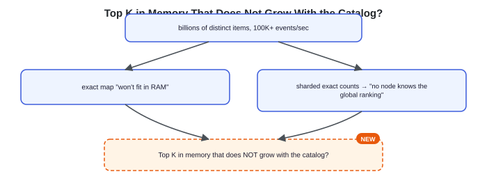

exact map "won't fit in RAM" / sharded exact counts → "no node knows the global ranking" — both fed by "billions of distinct items, 100K+ events/sec" — asking "Top K in memory that does NOT grow with the catalog?"

**Key idea.** Bounded memory independent of the distinct-item count is the property that cannot bend; unbounded cardinality (the number of distinct items) and the sharded-ranking problem are the two forces that make a naive counter unable to hold it.

## Key concepts

This section covers the concepts needed to solve this problem — prerequisites for the design work that follows. They are stated here as vocabulary rather than derived from a failure, because the sections that follow assume them as known terms.

### Heavy hitters and the long tail

Real event streams are steeply skewed. A tiny number of items — the heavy hitters — take a large share of all events, while a very long tail of items appear a handful of times each. This skew is what makes approximate counting safe: the top K live in the head of the distribution, where counts are large and unambiguous, so a little noise on the rare tail items rarely changes who reaches rank K.

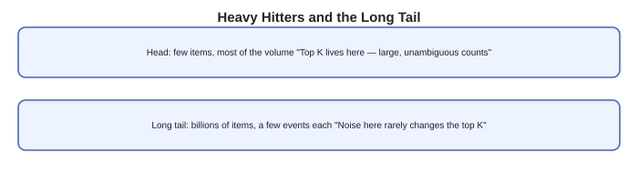

Head — few items, most of the volume, "Top K lives here — large, unambiguous counts" | Long tail — billions of items, a few events each, "Noise here rarely changes the top K".

### Count-min sketch

A count-min sketch counts item frequencies in a fixed grid of counters — depth rows by width columns — instead of one counter per item. Each row has its own hash function. To record an event, hash the item once per row and increment the one cell that hash points to in that row. To estimate an item's count, hash it the same way and take the minimum of its cells across all rows.

Two items can collide on the same cell in one row, which inflates that cell — so an estimate can read high, never low. Taking the minimum across rows discards the rows where a collision inflated the count, keeping the tightest estimate. Memory is fixed up front by the grid size and does not grow as new distinct items arrive; a busier stream raises the collision noise.

**Interactive widget — count-min sketch simulator:** controls "Play / Step / Reset"; state "event 0 / 20"; sketch grid shown as 3 rows × 6 columns (rows labelled h1, h2, h3), all cells starting at 0; a table tracking each item's true count, estimate, and error; caption: "estimate = min across an item's three cells (never underestimates)." Instructions: "Play the stream. Watch collisions inflate a rare item's estimate, while the heavy hitter's estimate tracks the truth."

### A min-heap for the top K

The sketch tells you how often an item was seen, but not which items are the current top K. A min-heap of fixed size K holds the current leaders, ordered so the smallest of them sits at the root. An item already among the leaders has its count updated in place; a non-leader whose estimate climbs above the root displaces it and takes its spot; anything else is ignored. The heap is always ready, so a query returns the top K without sorting anything.

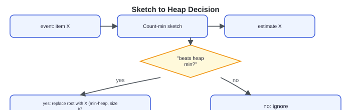

event: item X → Count-min sketch → estimate X → "beats heap min?" → yes → replace root with X (Min-heap, size K, root = smallest leader) / no → ignore.

### Rolling windows from bucketed sketches

"Top K in the last hour" needs a time boundary that keeps moving. Keeping one sketch per short bucket — say one per minute — makes windows composable: because sketches are additive, the last hour is the sum of the 60 most recent minute-sketches, cell by cell. Additivity holds only when every bucket uses the same grid size and the same hash functions, so cell (i, j) always counts the same set of items in every bucket; adding two grids cell by cell then sums their counts exactly. Because the sketch stores counts, not the identities behind them, each bucket also keeps a small heap of the candidate item IDs it saw; a window query unions those candidates and ranks them by their estimate from the summed sketch. When a new minute begins, its bucket starts empty; when a minute ages out of the window, its bucket is dropped. The window slides forward one bucket at a time without ever recounting the raw events.

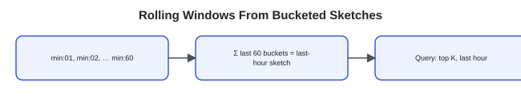

min:01, min:02, … min:60 → Σ last 60 buckets = last-hour sketch → Query: top K, last hour.

**Key idea.** A count-min sketch counts in fixed memory that ignores cardinality; a min-heap keeps the top K query-ready; and additive per-minute sketches make a rolling window a sum of buckets, not a recount.

## 1. Requirements

*Before reading on: List the functional and non-functional requirements, then name the one property you would never compromise and the one constraint that drives the design.*

### 1.1 Functional requirements

- **Ingest an event.** Record that an item was played or viewed, with its event time.
- **Maintain top K over windows.** Keep the K most frequent items current for rolling windows — last minute, hour, day, and 7 days.
- **Query the top K.** Return the current top-K list for a requested window, in milliseconds, with an approximate count per item.

### 1.2 Non-functional requirements

- **Bounded memory.** Working memory must stay fixed regardless of how many distinct items the stream carries. This is the defining constraint.
- **Read latency.** A top-K query returns in milliseconds, from a precomputed list.
- **Freshness.** The current window may trail the live stream by seconds to minutes; closed windows must be accurate.
- **Stable, approximate ranking.** Small errors near rank K are acceptable; the top few must be reliable.

### 1.3 The constraint versus the property

The property never to compromise is bounded memory — the system must scale with the event rate, not with the catalog size. The constraint that drives everything else is that this has to hold while ingesting on the order of 100K events a second over billions of distinct items, and still answer a query in milliseconds. That rules out an exact per-item map and forces approximate counting in a fixed-size structure, sharded for throughput and merged for a global answer.

**Key idea.** Bounded memory is the property to protect; holding it at 100K events/second over an unbounded catalog with millisecond reads is the constraint the rest of the design answers.

## 2. Back-of-the-envelope estimation

**Interactive estimation widget (default values shown):**

| Input | Default |
|---|---|
| Daily active users | 100M |
| Plays / user / day | 100 |
| Distinct items | 1.0B |
| Sketch columns / row | 2.0M |

**Computed outputs:**

| Output | Value | Basis |
|---|---|---|
| Write QPS | 116K/s | 100M × 100 plays ÷ 86,400s |
| Reads (top-K queries) | 2K/s | 100M × 2 queries ÷ 86,400s |
| Exact map memory | 60.0 GB | 1.0B items × 60B each |
| Sketch memory (fixed) | 40.0 MB | 2.0M × 5 rows × 4B |

Formulas shown: `exact = 1.0B × 60B ≈ 60.0 GB` and `sketch = 2.0M × 5 × 4B ≈ 40.0 MB`. Caption: "Move the distinct-items slider: the exact map grows without bound, while the sketch stays fixed — its memory depends on the grid, not on how many distinct items the stream carries."

### 2.1 Write volume dominates

With 100M daily active users generating about 100 events each, that is 100,000,000 × 100 = 10 billion events a day, or about 10e9 / 86,400 ≈ 116,000 events a second. Top-K queries, at roughly 2 per user per day, are about 200,000,000 / 86,400 ≈ 2,300 reads a second — over 50× fewer than writes. This is a write-heavy system, so the ingest path shapes the design.

### 2.2 Memory is the real constraint

An exact map needs one entry per distinct item. At billions of items and tens of bytes per entry — a key string plus a counter — the map runs to hundreds of gigabytes and grows with every new item. A count-min sketch is a fixed grid: a few million columns across a handful of rows, at 4 bytes a cell, is on the order of tens of megabytes and never grows. That gap — hundreds of gigabytes that scale with the catalog versus tens of fixed megabytes — is why the design accepts approximation.

### 2.3 Raw retention is a separate, large cost

If each raw event is roughly 200 bytes, a day of events is about 10e9 × 200 ≈ 2 TB, and a year of retention approaches 700 TB. That volume never sits in memory; it lives in cheap object storage and is read only by the batch path that recomputes exact numbers for closed windows.

**Key idea.** Writes (~116K/s) dwarf reads (~2.3K/s), and exact-map memory scales with billions of items while a sketch stays in fixed tens of megabytes — the number that justifies approximate counting.

## 3. API design

**Design checkpoint widget:** *"A top-K query must return in milliseconds, but the stream never stops. Should `GET /v1/top-k` compute the ranking on demand from the counters, or read a list the system already keeps current?"* Options: (a) *Compute the ranking on demand when the query arrives*; (b) *Read a precomputed top-K list that ingestion keeps current*. (No explicit reveal shown; the design that follows implements option b.)

### 3.1 Record an event

`POST /v1/events`

**Request & response (expanded):**
- Request body: `{ item_id, ts }`
- Response body: `202 Accepted`

The write is fire-and-forget: the event is appended to the ingest log and acknowledged, with no per-item durability guarantee, because one dropped play changes a heavy hitter's count by a single event out of the many thousands it accrues. The body carries only what happened — the item and its time. Nothing about the ranking is computed on this path.

### 3.2 Query the top K

`GET /v1/top-k?window=hour|day|7d&k=100`

**Request & response (expanded):**
- Response body: `{ window, results: [{ item_id, approx_count }] }`

The query names a window granularity and a K. The response is the precomputed list for that window — a few hundred entries at most, so the payload is tiny and the lookup is a single read.

**Key idea.** Writes append to a log and return immediately; reads never touch raw counters, only a small precomputed list, which is what keeps them in the millisecond range.

## 4. Data model

### 4.1 Event

The raw fact — one play or view, appended and never edited.

- `Event`: `string item_id`, `timestamp ts`

### 4.2 Bucket sketch

A count-min sketch for one time bucket on one shard. The window queries read sums of these.

- `BucketSketch`: `int shard_id`, `timestamp bucket_start`, `int depth`, `int width`, `int[][] counters`

### 4.3 Top-K result

The small, precomputed answer a query reads, one row per window.

- `TopKResult` (1:* with `Entry`): `enum window`, `timestamp computed_at`, `Entry[] entries`
- `Entry`: `string item_id`, `long approx_count`

### 4.4 Where each entity lives

Event rows live on a durable, partitioned ingest log, then age into object storage for the year of retention. BucketSketch grids live in memory on the aggregation shards — that is the bounded-memory core — with recent buckets checkpointed so a crashed shard can rebuild. TopKResult lives in a small in-memory cache that read queries hit directly.

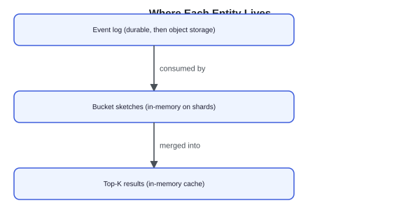

Event log (durable, then object storage) → consumed by → Bucket sketches (in-memory on shards) → merged into → Top-K results (in-memory cache).

**Key idea.** The log is the durable fact; the sketches are the bounded-memory working set; the top-K result is a tiny derived list built for millisecond reads.

## 5. High-level design

*Before reading on: You have the sketch, the heap, bucketed windows, and heavy-hitter skew from Key concepts. Sketch how an event flows from ingest to a queryable top-K list, and where the design must shard.*

*Reading the diagrams: each step marks the components newly added at that step with a dashed outline and a NEW badge, so you can see what changed from the step before.*

### 5.1 One node with an exact map

The initial design is a single process that keeps a hash map from item to count, incrementing on each event and sorting the map when a query arrives.

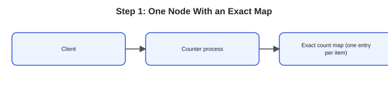

Client → Counter process → Exact count map (one entry per item).

Two things break it. The map grows with the catalog — billions of items overflow one machine's memory. And a single process cannot absorb ~116K events a second while also sorting a huge map on demand.

### 5.2 Fix 1: sketch plus heap for bounded memory

The next design replaces the exact map with a count-min sketch and a size-K min-heap. Memory is now fixed by the grid, independent of how many distinct items arrive, and the heap keeps the top K ready without sorting.

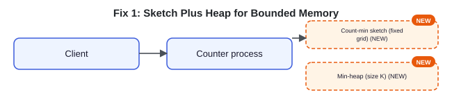

Client → Counter process → Count-min sketch (fixed grid) **NEW** + Min-heap (size K) **NEW**.

Memory is solved, but one process still cannot take the full write rate, and this holds no notion of a time window — it counts forever.

### 5.3 Fix 2: a log-based queue buffers the firehose

A partitioned, log-based message queue sits between clients and the counter. The ingest endpoint only appends events; the aggregation reads from the log at its own pace. Because the log is replayable and retained, a second, slower consumer can read the same events later for exact recomputation.

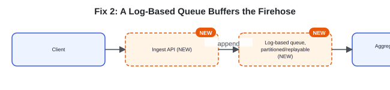

Client → Ingest API **NEW** → *(append)* → Log-based queue, partitioned/replayable **NEW** → Aggregator (sketch + heap).

Ingest is now decoupled and elastic. But one aggregator reading one log still can't keep up with the full rate, and a single sketch is one machine's worth of memory.

### 5.4 Fix 3: shard by item, merge for the global top K

The log is partitioned by item_id across N shards. Each shard keeps its own sketch and its own local top-K heap over just its slice of items. A coordinator merges the shards' local lists into the global top K. Each shard reports more than K — its local top m·K — because the counts are sketch estimates, and overestimation noise near the boundary can push a true leader just below a shard's local rank K.

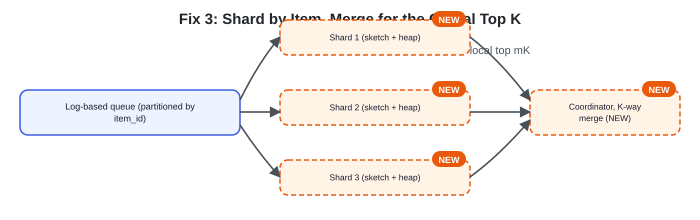

Log-based queue (partitioned by item_id) → Shard 1 / Shard 2 / Shard 3 (each "sketch + heap" **NEW**) → each sends "local top mK" → Coordinator, K-way merge **NEW** → Global top-K.

Throughput and memory now scale by adding shards. But everything so far counts over all time; there is still no rolling window.

### 5.5 Fix 4: bucketed windows on each shard

Each shard keeps one sketch per minute bucket instead of one forever. A rolling-window query sums the relevant buckets — 60 for the last hour, 1,440 for the last day — cell by cell, unions the candidate item IDs those buckets tracked, and ranks the candidates by their estimate from the summed sketch. Old buckets drop as the window slides.

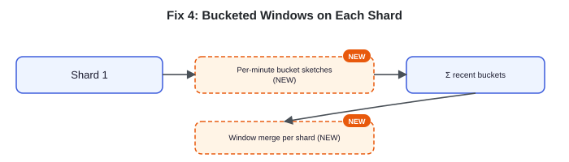

Shard 1 → Per-minute bucket sketches **NEW** → Σ recent buckets → Window merge per shard **NEW** → Coordinator, K-way merge → Global top-K per window.

The fast path now answers any rolling window in near-real time. But it is approximate, and for a closed window like "all of yesterday" the requirement is accurate.

### 5.6 Fix 5: a batch path for exact closed-window counts

The design adds a slow path. The same events, retained in object storage, feed a periodic batch job that computes exact counts for windows that have already closed, and overwrites the fast path's approximate numbers for those windows.

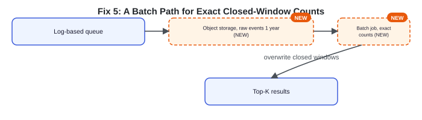

Log-based queue → Object storage, raw events 1 year **NEW** → Batch job, exact counts **NEW** → *(overwrite closed windows)* → Top-K results.

### 5.7 The composed design

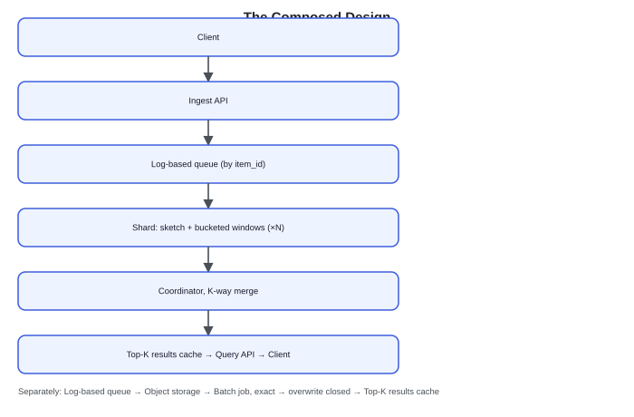

Client → Ingest API → Log-based queue (by item_id) → Shard: sketch + bucketed windows (×N) → Coordinator, K-way merge → Top-K results cache → Query API → Client (read). Separately: Log-based queue → Object storage → Batch job, exact → *(overwrite closed)* → Top-K results cache.

Each piece answers one failure of the naive map: the sketch and heap fix memory, the log fixes ingest throughput, sharding fixes single-node limits, bucketing adds windows, and the batch path fixes accuracy on closed windows.

### 5.8 Sequence: an event and a query

**Sequence diagram — actors:** Client, Ingest API, Shard, Coordinator, Log queue, Top-K cache (Storage: Log queue, Top-K cache; Services: Client, Ingest API, Shard, Coordinator).

Steps: Client → Ingest API: `POST /events (item_id, ts)` → Ingest API → Log queue: append event → Ingest API → Client: `202 Accepted` → Log queue → Shard: deliver event → Shard: update minute bucket sketch + local heap → Shard → Coordinator: local top mK (on interval) → Coordinator → Top-K cache: write merged global top-K → Client → Top-K cache: `GET /top-k?window=hour` → Top-K cache → Client: precomputed list.

**Key idea.** Every component is forced by a concrete failure of the one-node map — memory, throughput, single-node limits, windows, and closed-window accuracy — not drawn in up front.

## 6. Deep dives

### 6.1 Sizing the sketch and its error

*Before reading on: Two rare videos hash to the same busy cell, and the sketch reports one of them with a count far above its true plays. Does that corrupt the top-K list? How do you size the grid so it doesn't?*

A count-min sketch never underestimates — collisions only push a count up, and the min-across-rows keeps the tightest of several noisy readings. The expected collision noise on an item is on the order of the total event volume divided by the grid width: a wider grid spreads events thinner, so each cell carries less noise. More rows (depth) lower the probability that all of an item's cells are unlucky at once, since the estimate keeps the best row. The bound is probabilistic, not a hard guarantee — depth trades memory for a smaller chance of a bad estimate.

The skew is what makes this safe. Heavy hitters have counts so far above the collision noise that a little inflation rarely unseats them, while the rare tail items that do get inflated were not near rank K to begin with. The risk is only at the boundary — an item just below K nudged above it. Sizing the grid so the error is small relative to the K-th item's count keeps that boundary stable, and sampling exact counts on a replayed window measures whether the live error has crept past the threshold.

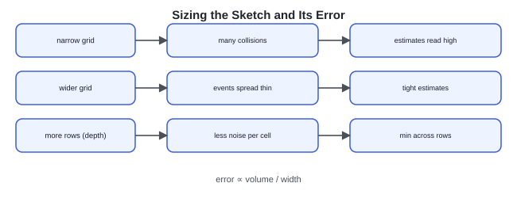

narrow grid → many collisions → estimates read high; wider grid → events spread thin → tight estimates; more rows (depth) → less noise per cell → min across rows. Caption: "error ∝ volume / width".

**What separates answers — sizing the sketch (expanded BAD / GOOD / GREAT rows):**
- **BAD — Pick grid dimensions arbitrarily.** Chooses a width and depth with no relation to volume or the target error, then treats the top-K output as exact. At high skew the heavy hitters survive, but nothing bounds the error at rank K or detects when it drifts.
- **GOOD — Size width and depth to a target error.** Sizes width from the acceptable error relative to the K-th count and adds rows to lower the odds of an all-unlucky estimate, accepting one-sided overestimation as the tradeoff for fixed memory.
- **GREAT — Size to error, exploit skew, and monitor drift.** Sizes the grid to keep error small against the K-th item's count, argues from the heavy-hitter skew why boundary errors are rare, and samples exact counts on replayed windows to detect when rising stream volume has pushed the live error past its threshold — then widens the grid.

### 6.2 Sharded aggregation and the K-way merge

*Before reading on: A shard holds the complete count for each of its own items, but only as a sketch estimate. Overestimated tail items crowd the top of that shard's local ranking and push a true top-K item to local rank K+1. If the shard reports only its local top K, that genuine leader is dropped. How do you keep it?*

Partitioning by item_id means every event for one item lands on the same shard, so that shard already holds the item's complete count — the merge never sums partial counts. The danger is the cutoff. Those counts are sketch estimates, and overestimation is uneven: an inflated tail item can outrank a true top-K item inside a shard's own local ordering, pushing it to rank K+1. If a shard sends only its local top K, that leader vanishes before the coordinator sees it. The fix is to widen each shard's report to its top m·K (for a small multiplier m), giving the coordinator margin to recover an item the local sketch noise mis-ranked. The coordinator then does a K-way merge over the candidate lists and takes the global top K.

Because partitioning is by item, each item's count comes from exactly one shard, so the merge is a selection over already-complete (if approximate) counts, not a sum of partial ones. A sketch stays additive within a shard's own buckets, which is what lets a window sum them; the cross-shard merge composes shards, not counts.

**Interactive widget — sharded merge step-through:** controls "Play / Step / Reset". Default state — Shard 1 top-3: P104—97, P881—82, P233—61; Shard 2 top-3: P552—91, P019—74, P760—58; Shard 3 top-3: P347—88, P901—79, P118—65; Shard 4 top-3: P622—95, P404—70, P266—52. Below: "global top-5 (coordinator's K-way merge)" with caption "Coordinator holds each shard's local top-3, ready to merge."

**Design checkpoint widget:** *"Raising m (each shard reports its top m·K instead of top K) shrinks the chance of missing a global leader. What does it cost?"* Options: (a) *Nothing — a larger m is always better*; (b) *More candidates to ship and merge each interval, for diminishing safety as m grows*.

**What separates answers — sharded merge (expanded BAD / GOOD / GREAT rows):**
- **BAD — Each shard reports its top K, merge them.** Has every shard send exactly its local top K and merges those. Misses any item that ranks below K on each shard but would rank high once shards are combined.
- **GOOD — Report top m·K per shard, then merge.** Widens each shard's report to its top m·K so borderline global leaders are captured, then K-way merges into the global list.
- **GREAT — Partition by item, report m·K, justify additivity.** Partitions by item_id so each item's count is complete on one shard, reports top m·K so sketch noise near the boundary can't drop a true leader, merges as a selection over complete counts rather than a sum of partials, and tunes m from the observed skew rather than fixing it blindly.

### 6.3 Rolling windows and recency

*Before reading on: "Trending right now" should weight the last five minutes more than five hours ago. Bucketed sums treat every minute in the window equally. How do you add recency without recounting?*

Summing the last 60 minute-buckets answers "top K in the last hour," but it is a flat window: a play 59 minutes ago counts exactly as much as one a minute ago, and the moment a bucket ages out, the bucket's full count is removed at once. For a smoother notion of "trending," an alternative is exponential decay: periodically scale every counter down by a constant factor, so recent events carry more weight and old ones fade continuously rather than dropping out abruptly. Redis's top-K structure offers a decay option of exactly this kind.

The two approaches trade precision for smoothness. Bucketed sums give exact window boundaries and let you answer several fixed windows (hour, day, 7 days) from one set of buckets, at the cost of the hard edge. Decay gives a smooth recency curve with a single set of counters, but blurs "the last hour" into "recent, weighted," which is fine for a trending feed and wrong for an auditable window.

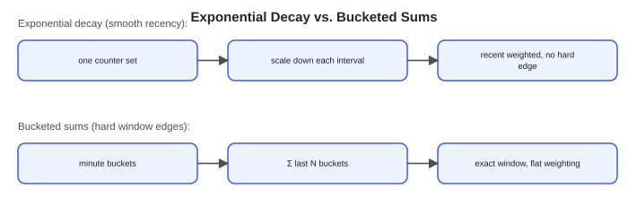

Exponential decay (smooth recency): one counter set → scale down each interval → recent weighted, no hard edge. Bucketed sums (hard window edges): minute buckets → Σ last N buckets → exact window, flat weighting.

**What separates answers — windows and recency (expanded BAD / GOOD / GREAT rows):**
- **BAD — One all-time counter.** Keeps a single running count with no time dimension, so an item that was huge last year outranks what is trending today and the window requirement is unmet.
- **GOOD — Bucketed sketches summed per window.** Keeps per-minute sketches and sums the relevant buckets for each rolling window, sliding forward as buckets age out — exact boundaries, flat weighting.
- **GREAT — Buckets for auditable windows, decay for 'trending now'.** Uses bucketed sums where windows must be exact and reproducible, and offers exponential decay for a smooth "trending now" feed, choosing per query which the consumer needs rather than forcing one model everywhere.

### 6.4 Approximate now, exact later

*Before reading on: A dashboard shows yesterday's top songs as "accurate," but the fast path only ever produced approximate counts. Where does the accurate number come from, and how does the switch happen without a visible jump?*

The fast path optimizes for freshness and runs on approximate sketches; the batch path optimizes for accuracy and runs on the retained raw events. For an open window still filling — the current hour — only the fast path can answer, and approximate is the agreed tolerance. Once a window closes, the batch job recomputes it exactly from object storage and overwrites the fast path's number for that window in the top-K cache. A reader of a closed window always sees the exact figure; a reader of the open window sees the fresh approximate one.

The overwrite is idempotent: the batch job computes a closed window's result purely from that window's immutable events, so re-running it yields the same list and a retry is harmless. This is the same speed-layer / batch-layer split the ad click aggregator uses to reconcile fresh-but-approximate against slow-but-exact; here the exactness is wanted for closed-window trust rather than billing.

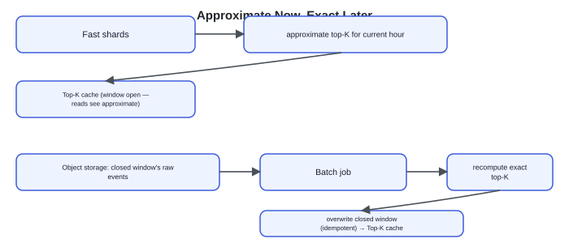

Fast shards → approximate top-K for current hour → Top-K cache (window still open — reads see approximate). Object storage → closed window's raw events → Batch job → recompute exact top-K → overwrite closed window (idempotent) → Top-K cache (reads of closed window see exact).

**What separates answers — approximate now, exact later (expanded BAD / GOOD / GREAT rows):**
- **BAD — One path only.** Serves everything from the approximate fast path, so closed windows are never accurate, or serves everything from batch, so nothing is fresh — either way one requirement is unmet.
- **GOOD — Fast path for open windows, batch for closed.** Answers the open window from sketches and overwrites each window with an exact batch recompute once it closes, giving fresh-then-accurate over time.
- **GREAT — Two layers, idempotent overwrite, one log.** Runs a speed layer and a batch layer over the same retained event log, makes the batch overwrite idempotent from immutable closed-window events so retries are safe, and monitors drift between the two as an early signal that the sketch is mis-sized.

**Key idea.** Sized-and-monitored sketches keep boundary error rare; reporting m·K per shard stops the merge from dropping a global leader; buckets-versus-decay trade exact edges for smooth recency; and a speed/batch split makes closed windows exact without slowing reads.

## 7. Variants

### 10× scale

Ten times the events means more log partitions and more shards, but the pressure lands on skew and the merge, not the average rate. A hotter head means a few shards absorb disproportionate traffic, and two mechanisms relieve it.

Key-salting splits one hot item_id into N sub-keys — item:0 through item:N-1, chosen per event by hash(event) mod N — so the item's events spread across N sub-shards instead of piling onto one. The count is now split across those sub-shards, so a read sums the N sub-counts back into the item's total. This is the one place the design sums partial counts, and it is confined to the few keys hot enough to need it.

Hierarchical merging handles a coordinator that can no longer keep up. As shards multiply, the single coordinator's m·K candidate streams outgrow one node. Intermediate coordinators each merge a group of shards into a partial top-m·K, and a top coordinator merges those partials — a tree of merges rather than one node reading every shard.

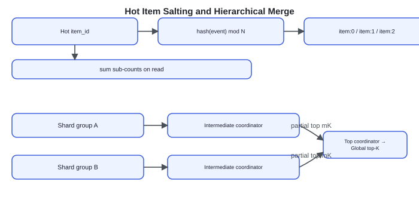

Hot item_id → hash(event) mod N → item:0 / item:1 / item:2 → sum sub-counts on read. Shard group A → Intermediate coordinator → partial top mK; Shard group B → Intermediate coordinator → partial top mK; both → Top coordinator → Global top-K.

The sketch grids also widen at 10× to hold error steady against a larger K-th count.

### Exact top K

If the counts must be exact — say the ranking drives payouts — the approximate sketch path no longer suffices, and the design shifts toward the ad click aggregator: durable per-item counts, idempotent increments keyed by event id, and exact windowed aggregation, trading the sketch's fixed memory for exactness the requirement now demands.

### Guaranteed heavy hitters

A count-min sketch can overestimate a rare item; where the requirement is a firm guarantee about which items might be missed, the Space-Saving algorithm fits better. It keeps a fixed set of monitored counters and, on overflow, evicts the smallest — giving bounded error with an explicit guarantee on which items it can drop, at the cost of the sketch's simpler additivity across shards and buckets.

**Key idea.** The architecture holds at 10× by making salting and a merge tree the default; a genuine exactness requirement moves the problem to the durable-count design; and a hard heavy-hitter guarantee swaps the sketch for Space-Saving.

## 8. The transferable pattern

"Find the most frequent K items in an unbounded stream" resolves to the same shape: approximate counting in fixed memory plus a small heap for the leaders, sharded by item for throughput and merged with a widened candidate list for a correct global answer, bucketed for rolling windows, and backed by a durable log so exact recomputation stays possible. The approximation is only safe because streams are skewed — the top K live where counts are large. The same shape reappears in trending feeds, top search queries, DDoS source detection, and hot-key identification for a cache.

### Review: the 30-second answer

- A count-min sketch counts in fixed memory that ignores catalog size; a size-K min-heap keeps the top K query-ready.
- A log-based queue decouples ingest from aggregation and lets a slower exact consumer replay the same events.
- Shard by item_id; each shard reports its top m·K, and a coordinator K-way merges into the global top K.
- Per-minute bucket sketches make a rolling window a sum of buckets, sliding forward without recounting.
- The fast path serves fresh approximate numbers; a batch path overwrites closed windows with exact counts.

## Quiz

**Top K / Trending Design Quiz** ("Hide All" / "Reveal All" toggle) — 5 questions, each with a "Show/Hide Answer" button. Full text of every question and its revealed answer:

**1) Why can't an exact hash map of item to count satisfy the requirements, even sharded across machines?**
An exact map needs one entry per distinct item, so its memory grows with the catalog — billions of items overflow available RAM, violating the bounded-memory requirement. Sharding spreads the memory but breaks the ranking: no single node sees global counts, and an item that ranks just below the top K on every shard can still be a global leader once the shards are combined, so the naive per-shard top K misses it.

**2) A count-min sketch can report a count higher than the truth. Why is that acceptable for top-K trending?**
The error is one-sided — collisions only inflate a count, never lower it — and streams are steeply skewed, so the top K sit in the head of the distribution where counts are far above the collision noise. The items that get inflated are rare tail items that were not near rank K. The only real risk is at the boundary, an item just below K nudged above it, which sizing the grid against the K-th item's count keeps rare.

**3) Why does each shard report its top m·K instead of its top K, and why is the merge a selection rather than a sum?**
Because counts are sketch estimates, an overestimated tail item can push a true top-K item to rank K+1 inside its own shard's local ordering; reporting only the local top K would drop it. Widening to top m·K gives the coordinator margin to recover such items. The merge is a selection, not a sum, because partitioning by item_id sends every event for an item to one shard, so that shard already holds the item's complete count — the coordinator picks the global top K from complete (if approximate) counts rather than summing partials.

**4) How does keeping one sketch per minute bucket answer 'top K in the last hour' without recounting raw events?**
Sketches are additive cell by cell (given the same grid and hash functions), so the last-hour sketch is the sum of the 60 most recent minute-buckets. Because a sketch stores counts and not identities, each bucket also tracks the candidate item IDs it saw; a query sums the buckets, unions those candidates, and ranks them by their estimate from the summed sketch. When a new minute starts it gets a fresh bucket and the oldest drops out of the window, so the window slides forward one bucket at a time and no raw event is ever recounted.

**5) A closed window like 'all of yesterday' must be accurate, but the fast path only produced approximate counts. How does the system deliver an exact number?**
The raw events are retained in object storage, and a batch job recomputes exact counts for a window once it has closed, overwriting the fast path's approximate result in the top-K cache. The overwrite is idempotent because it is computed from the window's immutable events, so retries are safe. Reads of an open window see the fresh approximate number; reads of a closed window see the exact one.

## Sources and further reading

- *An Improved Data Stream Summary: The Count-Min Sketch and its Applications* — Cormode & Muthukrishnan, 2005 — the sketch's construction and its one-sided error bounds, the basis for the sizing argument.
- *Efficient Computation of Frequent and Top-k Elements in Data Streams* — Metwally, Agrawal & El Abbadi, 2005 — the Space-Saving algorithm behind the guaranteed-heavy-hitters variant.
- *Top-K — Redis probabilistic data types* — a production top-K structure with the exponential-decay option described in the recency deep dive.

### Comments (as of scrape date)

- **pavan kumar Ganguru** (Nov 27 2025): asks what happens if top-K videos are deleted by uploaders after being ranked for a past hour window — the stored top-K would reference videos that no longer exist, and no backup next-in-line items were stored.
- **Arian Jafari** (Dec 06 2025) replying: suggests a separate microservice to remove deleted items' hashes from the heap or zero their counts.
- **Harley Pasoz** (Nov 12 2025): asks how the aggregator/coordinator gets state from the other shard instances.
- **Raj Nagulapalle** (Oct 27 2025): proposes an alternative production pipeline (Kafka → Flink/Spark Streaming → S3 raw → Pinot with upserts and time-based segments), noting tumbling windows suit structured reports and sliding windows suit fluid analytics.
- **Mayank Pant** (Sep 07 2025): raises that the bucketed approach only answers fixed-boundary windows, not arbitrary ranges (e.g., 9 minutes between two arbitrary timestamps) below the 1-minute bucket granularity; suggests caching frequent aggregations as a partial fix, and asks if there's a documented solution with defined trade-offs.
- **vaibhav k.** (Sep 07 2025): asks about very long (near 1-year) window queries and Kafka retention, and how the sliding-window consumer offset changes per query.
- **Joshua Goon** (Jun 25 2025): asks whether aggregating local top-K heaps across shards could be ignorant of the true accurate count, or if count is retrieved separately.
- **Joo Kang** (Jun 24 2025): asks whether different `k` values in queries (k=100, 500, 800) all draw from one max top-1000 list.
- **Ravi training** (May 13 2025): questions whether the low-QPS-design event should just be an eventId rather than `event(videoId_X, viewCountsTotal_Y)`.
- **akash goyal** (Mar 31 2025): asks how a Count-Min Sketch resets its counters for a sliding window.
- **he she** (Mar 20 2025) and **Siddhartha Jain** (Apr 18 2025) reply: discuss whether storing the heap index in the hash map is non-trivial to keep in sync during re-heapify (O(k), judged acceptable since k is typically ≤1000).
- **Bhargav Gohil** (Feb 25 2025): requests a "Design Google Calendar" article.

---

## Assets

No downloadable diagram image files exist on this page — every diagram, sketch simulator, and step-through widget is rendered live via JS/SVG and has been fully transcribed above as text. There are no ``-based architecture diagrams to save for this problem page.
