# Design a Chat / Messenger Service (WhatsApp)

Source: https://systemdesignschool.io/problems/chatapp/solution

> Note on fidelity: this page is built from many JS-interactive widgets (sliders, step-through diagrams, tabbed panels, animated simulations, an expandable quiz, and expandable BAD/GOOD/GREAT rating rows) rather than static images. Every widget's full content — including states behind clicks/toggles, and the labels/boxes/arrows inside each diagram — has been clicked through and transcribed below as text, in the same order it appears on the site. The site has no downloadable diagram image files (they're rendered live by JS/SVG, not `` files), so there are no image assets to save for this page.

Tags: **Hard** · Real-time · Connection registry · Durability · Fan-out · Ordering · Availability

---

## Problem statement

Design a real-time messaging service: users exchange 1:1 and group messages that arrive within milliseconds, in order, exactly once to the eye, and survive the recipient being offline.

In scope: sending and receiving 1:1 and group messages, offline delivery on reconnect, per-conversation ordering, receipts (sent/delivered/read), and presence (online/last-seen). End-to-end encryption is a variant.

## Clarifying questions

Each answer changes the design and fixes an assumption.

- **1:1 only, or groups — and how large?** Small groups fan out — one message copied to each member — cheaply; large groups need a different fan-out strategy.
- **Delivery guarantee?** At-least-once with client dedup is the practical answer; true exactly-once is expensive and usually unnecessary.
- **Ordering scope?** Per-conversation ordering is the norm and achievable; global ordering across conversations is neither needed nor cheap.
- **Offline support and history?** A week-long offline user must receive everything missed — this drives durable storage and a sync protocol.
- **Receipts and presence?** Each is its own subsystem.
- **End-to-end encryption?** It changes where messages can be processed (the server can't read content) — a major variant.

## What makes this problem distinctive

A naive chat is "client sends to server, server sends to client." That is incomplete: the recipient is often not connected when the message is sent, yet the message must not be lost and must still arrive the instant they reconnect.

That contradiction — durable and real-time at once — is what shapes the design. A message cannot be delivered straight over a socket, because the socket may be gone; it cannot only be stored for clients to poll, because that is not real-time. Every message has to be both saved and pushed, to a recipient who may be online on some server or offline entirely. The delivery path — how a message reaches a possibly-offline recipient — is the main design problem, not the happy-path socket write.

```text
Sender ──▶ [ one message ] ──▶ Recipient (may be offline)
                 │
                 ├── Durable:   survive a week offline
                 └── Real-time: arrive in milliseconds
```
Sender sends one message to a recipient who may be offline; the message must satisfy both durability (survive a week offline) and real-time delivery (arrive in milliseconds).

**Key idea.** Chat is a durable per-conversation log: clients read new messages as they arrive and re-read missed ones on reconnect, with the real-time path kept separate from the durable store.

## Key concepts

This section covers the concepts needed to solve this problem — prerequisites for the design work that follows.

### Persistent connections and the registry

Clients hold a long-lived WebSocket to a gateway server; with hundreds of millions of clients, gateways are a large fleet. Because any user can be on any gateway, a connection registry maps user → gateway so the system knows where to route a message. The registry is rebuilt on connect/disconnect and lives in a fast in-memory store.

**WebSocket.** A persistent, bidirectional TCP connection between client and server, so the server can push a message down to the client instead of the client polling for it.

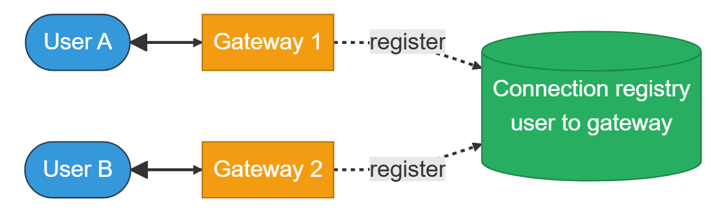
User A connects through Gateway 1, User B through Gateway 2; both register with the connection registry that maps user to gateway.

### Durability before delivery

A message acked to its sender is already stored. The message service writes to the durable store — assigning the message its order — before it acks the sender or attempts delivery. Live delivery is then a latency optimization on top of a durable record, not the system of record itself.

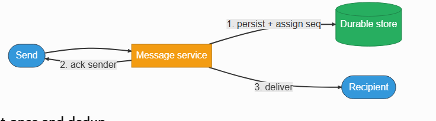
The message service persists the message and assigns it a sequence number, then acks the sender and delivers to the recipient.

### At-least-once and dedup

Networks force retries, so a message can be delivered twice. The sender attaches a client_msg_id; the server and client dedupe on it. The guarantee is at-least-once, but because duplicates are discarded, the experience is exactly-once. True exactly-once delivery across systems is expensive and rarely worth it.

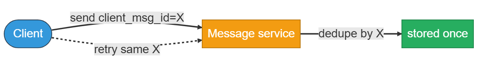

The client attaches a client_msg_id; the message service dedupes on it so a retried send with the same id is stored only once.

### Per-conversation ordering

Each conversation has a monotonic server_seq assigned at persist time; clients sort and dedupe by it. Per-conversation ordering is consistent for all participants and needs no global clock — global ordering across conversations is neither needed nor affordable.

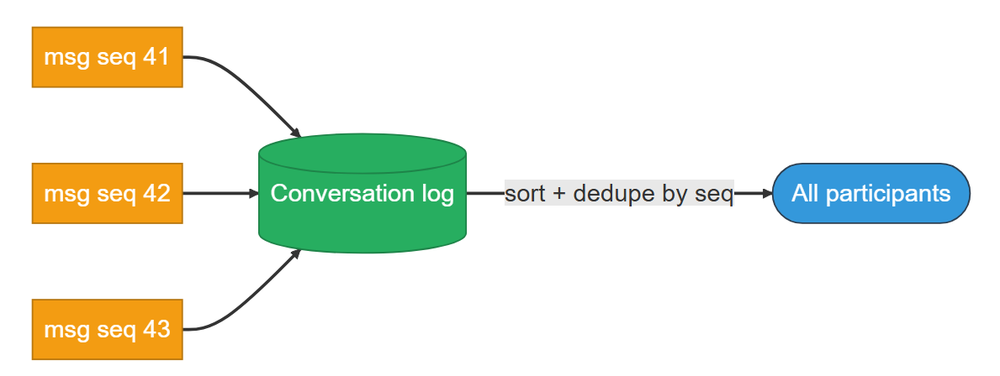

```text
Conversation log:  [ seq 41 ] [ seq 42 ] [ seq 43 ] ──▶ All participants: sort + dedupe by seq
```
The conversation log holds messages in sequence order; all participants sort and dedupe by that sequence number.

### Fan-out for groups

A group message to N members is N deliveries: push to the online members through their gateways, queue for the offline ones. Small groups fan out on write cheaply; very large groups favor a shared log the members read.

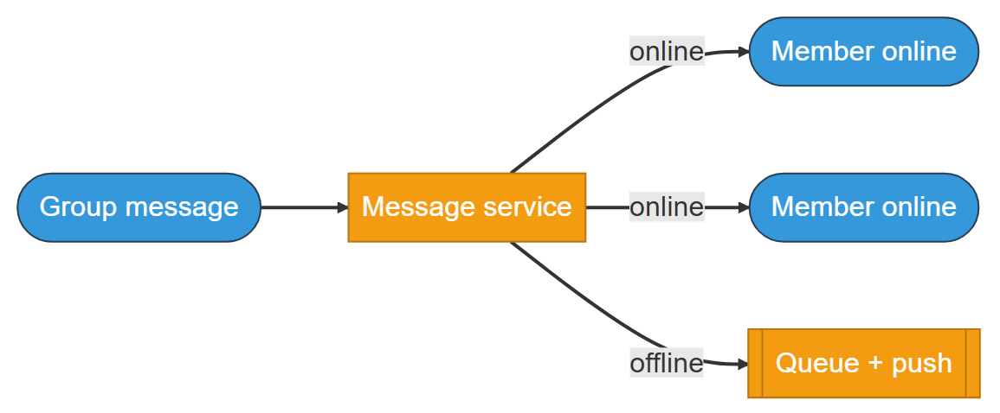

```text
Group message ──▶ Message service ──┬──▶ Member online   (direct push)
                                     ├──▶ Member online   (direct push)
                                     └──▶ Queue + push     (offline member)
```
A group message goes to the message service, which pushes directly to online members and queues delivery for the offline member.

### Presence

Online/last-seen is ephemeral and eventually-consistent — not part of the durable message path. The mechanism is a heartbeat with a time-to-live (TTL): each user has an in-memory presence key that expires after a few seconds, and the client sends periodic heartbeats that refresh it. While heartbeats arrive, the user reads as online. If the app crashes, the heartbeats stop, the TTL lapses a few seconds later, and the key flips to offline with a last-seen timestamp — subscribers watching that user get the change. Because it is rebuilt on connect and kept alive by heartbeats, losing the whole presence store costs only a refresh.

**Interactive widget — presence TTL simulator:** controls "Play / Reset"; sliders "Heartbeat interval: 3s" and "App crashes at: 12s"; state "t = 0.0s", "TTL remaining (10s max) —", "0 heartbeats received", "presence state: online", caption "Connected — heartbeats keep the presence key alive."

**Key idea.** Persist before you deliver; order per conversation with a monotonic sequence; dedupe by client id; keep presence and routing ephemeral, off the durable path.

## 1. Requirements

*Before reading on: List the requirements, then name the property you would never compromise and the constraint that drives the design.*

### 1.1 Functional requirements

- Send / receive 1:1 and group messages in real time.
- Offline delivery — messages sent while a user is offline are delivered on reconnect.
- Ordering within a conversation.
- Receipts — sent / delivered / read — and presence — online / last-seen.

### 1.2 Non-functional requirements

- **Durability** — a sent (acked) message is not lost. The top priority.
- **Latency** — online-to-online delivery well under a second.
- **Ordering** — per-conversation, consistent across participants.
- **Availability** — connection loss is routine; a client should reconnect and resync within a few seconds.
- **Scale** — hundreds of millions of concurrent connections; millions of messages per second.

### 1.3 The constraint versus the property

Durability is the property to protect: once a message is acked, it is not lost, which is why the message service persists before it acks or delivers. Real-time delivery is the constraint that drives the design: the demand to push within a second — to a recipient who may be on any gateway or offline — forces the persistent-connection fleet, the connection registry, and the split between the live path and the durable store.

**Key idea.** Protect durability (acked means stored); design around real-time delivery to a possibly-offline recipient.

## 2. Back-of-the-envelope estimation

The numbers size the gateway fleet (from concurrent connections) and the delivery and write rates (from the message rate and fan-out). Illustrative anchors.

**Interactive estimation widget (default values shown):**

| Input | Default |
|---|---|
| Concurrent users | 100M |
| Connections / gateway | 100K |
| Messages sent / sec | 1.0M |
| Avg recipients / message | 3 |
| Avg message size | 1.0 KB |
| Retention | 365d |

**Computed outputs:**

| Output | Value | Basis |
|---|---|---|
| Gateway servers | ~1K | 100M conns ÷ 100K |
| Deliveries / sec | 3.0M | 1.0M sent × 3 recipients |
| Durable write rate | 1.0 GB/s | before replication |
| History stored | 94.6 PB | × 3 replication, 365d |

Formula shown: `gateways = 100M connections ÷ 100K each = 1K`. Caption: "Concurrent connections size the gateway fleet; the message rate times fan-out sizes deliveries and the durable write rate the store must absorb."

### 2.1 Connections and gateways

At ~100M concurrent users there are ~100M open WebSocket connections. At ~100K connections per gateway, that is ~1,000 gateway servers. Connections, not message volume, set the fleet size.

### 2.2 Messages and deliveries

At ~1M messages sent per second, each fanning out to a few recipients, the system does a few million deliveries per second. At ~1 KB each, ingest is on the order of ~1 GB/sec, and retained history times replication reaches petabytes over time.

**Key idea.** Concurrent connections size the gateway fleet; message rate × fan-out sizes deliveries and the durable write rate.

## 3. API design

**Design checkpoint widget:** *"A client sends a message, the network drops the ack, and the client retries. How do you keep the recipient from seeing two copies?"* Options: (a) *The server timestamps arrival and drops anything within a few milliseconds*; (b) *The client attaches a client_msg_id and the server dedupes on it*.

The interface is a persistent connection plus four operations.

`GET connect()`
**Request & response (expanded):**
- Response body: `WebSocket` (gateway registers user → gateway)

`GET send(conversation_id, client_msg_id, body)`
**Request & response (expanded):**
- Response body: `{ server_seq, status }`

`GET sync(conversation_id, since_seq)`
**Request & response (expanded):**
- Response body: `[messages]` // catch up after offline

`GET ack(conversation_id, up_to_seq)`
**Request & response (expanded):**
- Response body: `ok` // delivered / read receipts

**Key idea.** `send` carries a client id for dedup and returns a per-conversation server_seq; `sync` replays everything after a sequence on reconnect.

## 4. Data model

A minimal message record exposes the fields needed for ordering, delivery, and receipts; each thing it cannot represent adds the next field.

### 4.1 Message and conversation

A message needs a conversation to belong to and a sequence to be ordered by; per-user cursors track how far each member has been delivered and has read.

- `Conversation`: `string conversation_id`, `enum type`, `string[] members`, `int last_seq`
- `Message`: `string conversation_id`, `int server_seq`, `string sender_id`, `string client_msg_id`, `string body`, `timestamp created_at`
- `Cursor`: `string user_id`, `string conversation_id`, `int last_delivered_seq`, `int last_read_seq`

### 4.2 Where each piece lives

Messages are partitioned by conversation_id in a durable log/KV store, ordered by server_seq — a per-conversation sequence gives ordering without a global clock. The connection registry (user → gateway) and presence (user → online | last-seen) are in-memory only, rebuilt on connect, and never on the durable message path.

**Key idea.** Messages are a durable per-conversation log; routing and presence are ephemeral in-memory state.

## 5. High-level design

The design is built up from the simplest version, each failure pulling in the next box.

*Reading the diagrams: each step marks the components newly added at that step with a dashed outline and a NEW badge.*

### 5.1 One server

A single server holds every connection and relays messages between them. It breaks at the first scale step: one box cannot hold hundreds of millions of sockets, and the instant there are many servers, a sender's server has no idea which server holds the recipient.

```text
User A ──▶ Chat server ──▶ User B
```
A single server holds every connection and relays messages between them.

### 5.2 Fix 1: a gateway fleet and a connection registry

Spread connections across a fleet of gateways, and add a connection registry that records user → gateway so any message can find where its recipient is connected.

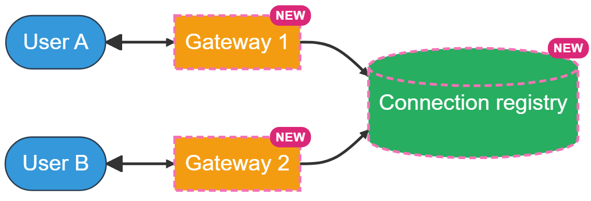

```text
User A ──▶ [Gateway 1 (NEW)] ──┐
                                ├──register──▶ [Connection registry (NEW)]
User B ──▶ [Gateway 2 (NEW)] ──┘
```
User A connects to Gateway 1 and User B to Gateway 2 (both new); both register with the new connection registry.

### 5.3 Fix 2: a message service and an internal bus

Direct gateway-to-gateway communication does not scale — every gateway would hold a connection to every other, which fails at a thousand boxes. Add a message service that owns each message and an internal pub-sub bus — a message broker where a sender publishes to a named topic and whichever servers subscribe to that topic receive it — that carries the message from the sender's gateway to the recipient's.

The mechanism is a topic per gateway. Each gateway subscribes to its own topic — Gateway-17 listens on gateway.17 — and the registry maps users to gateways. To deliver to User B: the message service asks the registry (B is on Gateway-17), publishes the message to topic gateway.17, and only Gateway-17, the one subscriber, receives it and pushes it down B's socket. No gateway ever sees traffic for connections it does not hold.

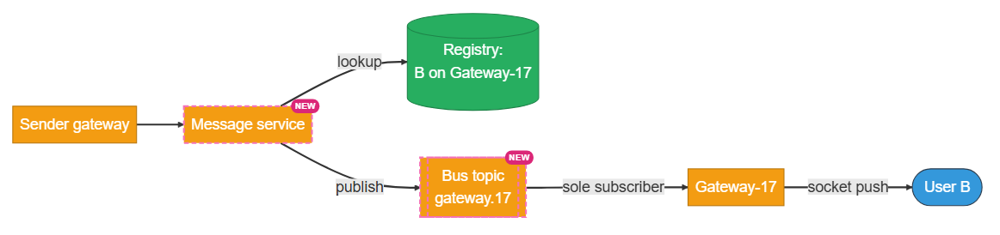
The message service looks up B via the registry, publishes to the per-gateway bus topic gateway.17, and only Gateway-17 (the sole subscriber) receives it and pushes it down B's socket.

The bus gets a message to an online recipient's gateway, but if that recipient is offline, no gateway is subscribed to receive it and the message has nowhere to go — it would simply be dropped.

### 5.4 Fix 3: a durable store and offline delivery

The message service persists to a durable store (assigning server_seq) before acking the sender. If the recipient is offline, the message is already stored; mark it pending and fire a push notification, and the recipient pulls it via sync on reconnect.

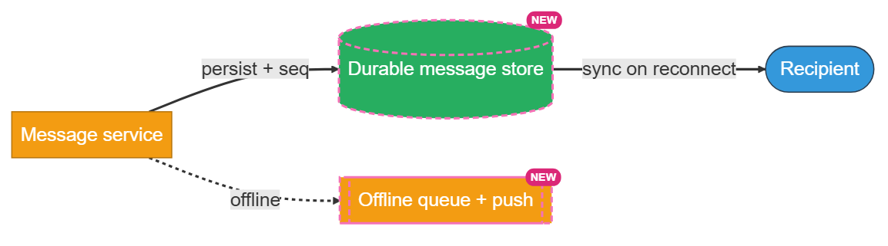
The message service persists to the new durable store; if the recipient is offline, it goes to the new offline queue with a push notification, delivered via sync on reconnect.

### 5.5 The composed delivery path

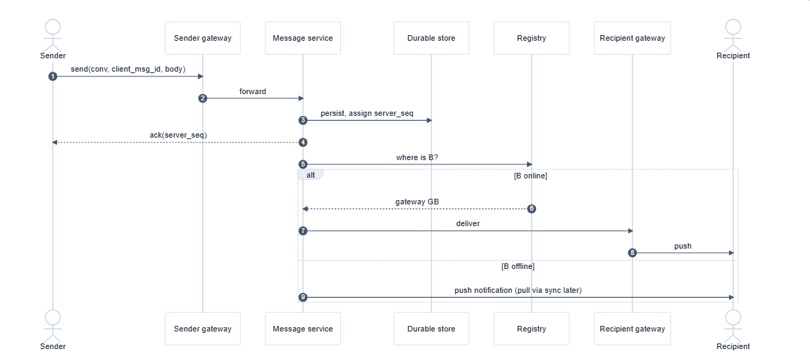

**Sequence diagram — actors:** Sender, Sender gateway, Message service, Durable store, Registry, Recipient gateway, Recipient. With an `alt [B online] / [B offline]` branch.

Steps: Sender → Sender gateway: `send(conv, client_msg_id, body)` (1) → Sender gateway → Message service: forward (2) → Message service → Durable store: persist, assign server_seq (3) → Message service → Sender: `ack(server_seq)` (4) → Message service → Registry: where is B? (5) → Registry → Message service: gateway GB (6) → Message service → Recipient gateway: deliver (7) → Recipient gateway → Recipient: push (8) [if B online]; or → push notification, pull via sync later (9) [if B offline].

**Key idea.** Each component answers one failure: a gateway fleet for connection scale, a registry to find the recipient, a bus to cross gateways, and a durable store so an acked message survives the recipient being offline.

## 6. Deep dives

### 6.1 Delivery and the connection registry

*Before reading on: A message is persisted and acked. The recipient is on some gateway in a fleet of a thousand — or on none. How does the message find them?*

The registry routes: user → gateway, kept in a fast store and updated on connect/disconnect, tells the message service which gateway holds the recipient. If they are online, the message goes over the bus to that gateway and down the socket; if offline, it is already durably stored, so the system marks it pending and fires a push, and the client pulls it with sync(since_seq) on reconnect. Heartbeats detect dead connections the server hasn't noticed yet, and the registry entry is cleared so messages aren't routed to a stale gateway entry.

In the offline case, Alice and Bob's conversation log holds seq 41–45. Bob's phone drops after his client has seen seq 42, so it remembers last_delivered_seq = 42. While he is offline, Alice sends 43, 44, 45 — each persisted to the log. Bob reconnects and calls sync(conv, since_seq=42); the server returns messages 43, 44, 45 straight from the log, and his client advances its cursor to 45. No message is missed and none is shown twice, because the cursor — not the live socket — defines what he still needs. A week offline is no different: the gap is larger.

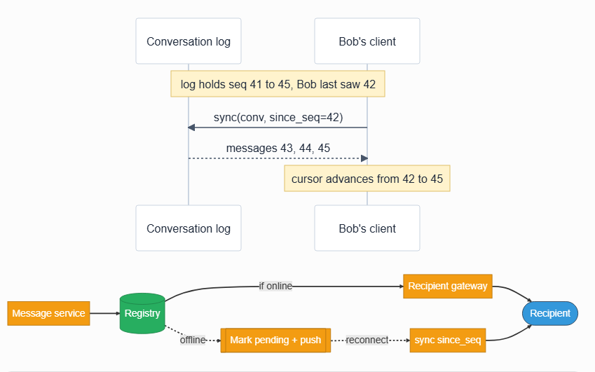

```text
Conversation log: [41][42][43][44][45]   (Bob last saw 42)
Bob's client ──sync(conv, since_seq=42)──▶ Conversation log
             ◀──── messages 43, 44, 45 ───
Bob's cursor: 42 ──▶ 45
```
The conversation log holds seq 41 to 45; Bob last saw 42, calls sync since 42, gets back 43-45, and his cursor advances to 45.

```text
Message service ──▶ Registry ──┬── online  ──▶ Recipient gateway ──▶ Recipient
                                └── offline ──▶ Mark pending + push ──(reconnect)──▶ sync since_seq ──▶ Recipient
```
The message service asks the registry: if the recipient is online it routes through their gateway; if offline it marks pending, pushes a notification, and delivers via sync on reconnect.

**What separates answers — delivery (expanded BAD / GOOD / GREAT rows):**
- **BAD — Direct gateway-to-gateway push, no durable store.** Pushes peer-to-peer without storing first, so a message to an offline or mid-reconnect user vanishes.
- **GOOD — Registry + bus + offline queue.** Routes via the registry and an internal bus, and queues for offline users.
- **GREAT — Store is authoritative, live delivery is an optimization.** Treats the durable store as the source of truth and live delivery as a latency optimization; handles constant reconnects with heartbeats and a sync cursor; clears stale registry entries.

### 6.2 Ordering and delivery guarantees

*Before reading on: A consumer reads a message, the network drops the ack, and it retries. Without care the recipient sees it twice and possibly out of order. What is the precise contract?*

The contract is at-least-once with idempotent dedup, which presents as exactly-once. The monotonic server_seq per conversation gives order: clients sort and dedupe by it, so a re-delivered or reordered message lands in the right place once. Receipts ride the same channel — sent (stored) → delivered (reached the device) → read (opened) — each a small state update on the per-user cursor keyed by sequence.

```text
Deliveries (maybe dup/reordered) ──▶ sort + dedupe by server_seq ──▶ each message once, in order ──▶ receipts: sent / delivered / read
```
Deliveries may arrive duplicated or out of order; sorting and deduping by server_seq yields each message once, in order, followed by sent/delivered/read receipts.

**What separates answers — ordering and guarantees (expanded BAD / GOOD / GREAT rows):**
- **BAD — Relies on arrival order, allows duplicates.** Assumes packets arrive in order and once; duplicates and reorders reach the user.
- **GOOD — Per-conversation sequence + dedup by id.** Orders by a per-conversation sequence and dedupes by message id.
- **GREAT — States the contract; folds receipts into the sequence.** Names at-least-once-plus-dedup as perceived exactly-once, explains why per-conversation ordering suffices, and integrates receipts as cursor updates over the same sequence.

### 6.3 Group chat and presence

*Before reading on: A 50,000-member group posts a message. Pushing it to every member like 50,000 unicasts is a lot of work. When does that stop being the right model?*

Small groups fan out on write — one message becomes N deliveries, pushed to online members and queued for offline ones — which is cheap up to moderate sizes. Concretely, a 50-member group turns one send into 50 delivery tasks, which is manageable. A 50,000-member group turns each send into 50,000 tasks, plus offline-cursor bookkeeping for every member — and that repeats on every message. So very large groups flip to a shared conversation log: the message is stored once, and each member reads it on their own by cursor (fan-out on read), turning 50,000 writes back into one. This is the same fan-out-on-read trade large feed systems make for high-follower accounts. Presence rides alongside but never in the durable path: it is an in-memory, eventually-consistent signal, sampled aggressively at scale, so a stale "online" dot has bounded impact and refreshes on the next signal.

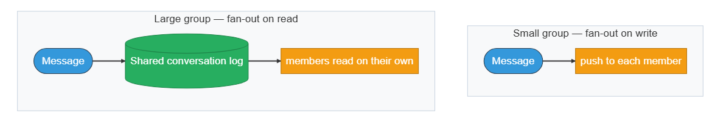

Small groups fan out on write, pushing to each member directly; large groups fan out on read, writing once to a shared log that members read from.

**What separates answers — groups and presence (expanded BAD / GOOD / GREAT rows):**
- **BAD — Group = independent unicasts; presence persisted.** Treats a group send as unrelated unicasts and writes presence to the durable store.
- **GOOD — Fan-out to online members, in-memory presence.** Fans out to active members and tracks presence in memory.
- **GREAT — Write vs read fan-out by group size; durable/ephemeral split.** Switches small-group fan-out-on-write to large-group shared-log fan-out-on-read, keeps presence and ephemeral signals off the durable path, and frames the durable-versus-ephemeral split as the organizing principle.

## 7. Variants

For **very large groups and broadcast** (channels with thousands of members), the shared-log read model applies — participants read from one durable log rather than receiving thousands of pushed copies.

For **end-to-end encryption**, the server routes ciphertext it cannot read; the architecture is unchanged, but plaintext-dependent features (search, smart replies) move client-side.

For **10× scale** (billions of connections), the gateway fleet expands, the message store and registry shard by conversation and user, the pub-sub bus is partitioned, and presence becomes aggressive in-memory sampling — a stale dot is acceptable, a lost message is not.

**Key idea.** The architecture holds across encryption and scale; only very large groups change the fan-out from push to a shared log.

## 8. The transferable pattern

A chat system is a per-conversation durable log, read live as messages arrive and re-read on reconnect. Persist first, then deliver; order with a per-conversation sequence; dedupe by a client id; and keep the durable message path strictly separate from the ephemeral routing and presence state. Whenever real-time delivery and durability both matter — notifications, activity feeds, collaborative editing, order events — the same shape recurs: a durable log under a live delivery layer, with a registry pointing live traffic at the right connection.

### Review: the 30-second answer

- Persistent WebSocket connections to a gateway fleet, with a connection registry mapping users to their gateway.
- Persist before delivering — a message is written durably (and assigned a sequence) before the sender is acked.
- Deliver live to online recipients, queue plus push for offline ones; the client pulls missed messages with sync on reconnect.
- Per-conversation monotonic server_seq for ordering; client_msg_id for dedup — at-least-once that looks exactly-once.
- Durable path separate from ephemeral state — routing and presence live in memory, off the message path.

## Quiz

**Chat / Messenger Design Quiz** ("Hide All" / "Reveal All" toggle) — 6 questions, each with a "Show/Hide Answer" button. Full text of every question and its revealed answer:

**1) Why must a message be persisted before it is delivered or acked?**
Durability is the top priority: once the sender is told "sent," the message must not be lost, even if the recipient is offline for a week or the delivering gateway crashes. Writing to the durable store first — and assigning the ordering sequence there — makes the store the source of truth and live delivery just a latency optimization on top of it.

**2) What is the role of the connection registry, and why is it kept in memory?**
The registry maps each user to the gateway holding their live connection, so the message service knows where to route a delivery across a fleet of thousands of gateways. It is ephemeral routing state, rebuilt on connect/disconnect, so it lives in a fast in-memory store off the durable message path — losing it costs only a reconnect, never a message.

**3) How does the system achieve an exactly-once experience without exactly-once delivery?**
Networks force retries, so delivery is at-least-once and a message can arrive twice. The sender attaches a client_msg_id; the server and client dedupe on it, and a monotonic per-conversation server_seq lets clients sort and place each message once. The guarantee underneath is at-least-once, but duplicates are discarded, so the user sees each message once, in order.

**4) Why is per-conversation ordering enough, and why not global ordering?**
Users only perceive order within a conversation, and a monotonic sequence assigned per conversation at persist time gives that consistently for every participant without a global clock. Global ordering across all conversations would force a single sequencer (a bottleneck) and buys nothing a user can see, so it is neither needed nor affordable.

**5) When should a group switch from fan-out-on-write to a shared log?**
Small groups fan out on write — one message becomes N pushes to online members and queued copies for offline ones — which is cheap at moderate sizes. As membership grows into the thousands, N pushes per message becomes wasteful, so the group flips to a shared conversation log that members read on their own (fan-out on read), the same trade a feed makes for celebrity accounts.

**6) Why is presence kept separate from the durable message path?**
Presence (online/last-seen) is a high-volume, fast-changing signal where a slightly stale value is harmless, while messages must never be lost or reordered. Treating presence as ephemeral, eventually-consistent in-memory state — sampled aggressively at scale — keeps its high update volume from loading the durable store, and a missed presence update refreshes on the next signal.

## Sources and further reading

- *It's About Time: How WhatsApp Built Reliability* — Meta Engineering — connection management and reliable delivery for hundreds of millions of concurrent users.
- *How Discord stores trillions of messages* — Discord Engineering — partitioning a durable message store by conversation and the storage-engine tradeoffs.
- *The Log: what every software engineer should know about real-time data* — Jay Kreps (LinkedIn Engineering) — the append-only log and per-reader cursor underneath the durable-log-plus-replay model.
