# Design YouTube

Source: https://systemdesignschool.io/problems/youtube/solution

> Note on fidelity: this page is built from many JS-interactive widgets (sliders, step-through diagrams, tabbed panels, animated simulations, an expandable quiz, and expandable BAD/GOOD/GREAT rating rows) rather than static images. Every widget's full content — including states behind clicks/toggles, and the labels/boxes/arrows inside each diagram — has been clicked through and transcribed below as text, in the same order it appears on the site. The site has no downloadable diagram image files (they're rendered live by JS/SVG, not `` files), so there are no image assets to save for this page.

Tags: **Hard** · Video streaming · CDN & delivery economics · Transcoding pipeline · Adaptive bitrate · Object storage · Async processing

---

## Problem statement

Design a service where users upload videos and a global audience watches them on any device and any connection. Uploads can be several gigabytes, and viewers expect playback to begin within a second or two and remain smooth as available bandwidth changes. The scope here is upload and delivery; browse, search, and recommendations are treated as a separate ranking problem.

## Clarifying questions

Before designing, define what is being asked. Each question, with the assumption its answer establishes:

- **VOD or live?** Video-on-demand (VOD) serves pre-recorded files, transcoded once after upload; live transcodes in real time with low-latency delivery, which is a different system. Assume VOD unless specified otherwise.
- **Uploads vs. views?** Views exceed uploads by orders of magnitude, which makes the CDN and delivery economics the primary concern.
- **Device and network mix?** A phone on cellular and a television on fiber cannot share one file, which determines how many rungs the ladder needs and how important ABR is.
- **Time to first watchable after upload?** Minutes of transcode latency are acceptable for VOD, which permits asynchronous, batched transcoding.
- **Global?** Typically yes, which makes per-region CDN and storage replication primary concerns.
- **Recommendations or search in scope?** Usually deferred as a separate ranking and search problem; the focus remains on upload and delivery.

## Why video is its own problem

The read path resembles any media platform: blob storage behind a content delivery network (CDN). Video adds two requirements that shape the rest of the design: an encoding ladder (multiple bitrates per video) and adaptive bitrate (ABR) streaming, in which the player selects a quality per segment based on current network conditions. The cost profile also differs: storage is inexpensive, but transferring the bytes to a large audience dominates cost, so most later decisions aim to minimize origin egress. The defining characteristics are therefore delivery cost and the encoding ladder, not simple storage and retrieval.

**Ingress and egress.** Ingress is data entering the system — here, uploads. Egress is data leaving it — the bytes served out to viewers. For video, egress far exceeds ingress, because each upload is watched many times.


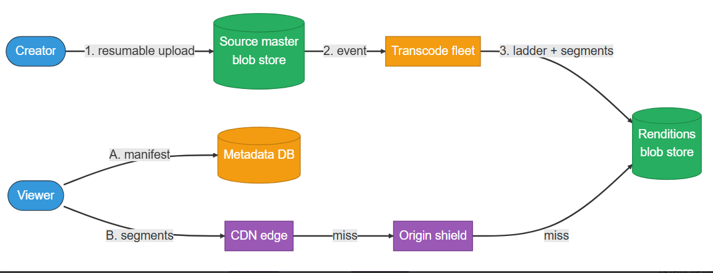
```text
Creator ──(1. resumable upload)──▶ Source master blob store ──(2. event)──▶ Transcode fleet ──(3. ladder + segments)──▶ Renditions blob store

Viewer ──(A. manifest)──▶ Metadata DB
Viewer ──(B. segments)──▶ CDN edge ──(miss)──▶ Origin shield
```
The creator's upload lands in the source blob store, triggers the transcode fleet to build the ladder and segments into the renditions blob store; the viewer reads the manifest from the metadata DB and segments from the CDN edge, falling back to the origin shield on a miss.

**Key idea.** Video's defining traits are egress cost and the encoding ladder, not storage and retrieval.

## Key concepts

This section covers the concepts needed to solve this problem — prerequisites for the design work that follows.

**Video playback is a loop.** The player downloads a small manifest listing the available qualities and the URLs of the segments that make up the video. It then fetches segments a few seconds at a time into a buffer — a short queue of already-downloaded video waiting to be shown — and plays from that buffer while it keeps downloading ahead. A brief network dip drains the buffer rather than stopping playback, and at each segment boundary the player can switch to a higher or lower quality.

**Interactive widget — playback loop simulator:** controls "Play / Restart"; state "Idle"; manifest `.m3u8` → lists 20 segments; legend "segments — played, buffered ahead, not yet downloaded"; readout "Buffer ahead: 0.0 segments"; a "Network (download speed)" control. Caption: "Playback (the line) drains the buffer at a steady rate; downloads refill it. When the network drops below the playback rate, the buffer shrinks — and if it empties, playback has to pause and rebuffer."

Each part of that loop has a name, and the design depends on all of them. The player's central choice, made at every segment boundary, is which quality to fetch — so we start with the qualities it chooses among, the renditions, and work outward to the segments and manifest it reads and the adaptation rule it follows.

### Rendition

A rendition is the same video encoded at one resolution and bitrate — a single rung. A lower bitrate yields a smaller file and lower quality; a higher bitrate yields higher quality and more bytes.

**Reading bitrate.** Bitrate is measured in megabits per second (Mbps) — the rate at which the stream delivers data. Eight bits make a byte, so 3 Mbps is about 0.38 MB per second, or roughly 225 MB for a 10-minute clip. For reference, typical YouTube renditions run about 1 Mbps at 360p, 2.5 Mbps at 720p, 4.5 Mbps at 1080p, and 15+ Mbps at 4K. To play without stalling, the connection must sustain at least the rendition's bitrate.

**Interactive widget — bitrate/size control:** default state — Bitrate: 3.0 Mbps, Size for a 10-min clip: 225 MB, Typical use: 1080p / broadband.

### Codec

A codec compresses each rendition. It stores one full keyframe and then only the differences between frames, which is the source of the compression. A more efficient codec achieves the same quality at a lower bitrate.

```text
frame 1 (I-frame): ██████████ cost 10
frame 2 (delta):   ██ cost 2
frame 3 (delta):   ██ cost 2
frame 4 (delta):   ██ cost 2
frame 5 (delta):   ██ cost 2
frame 6 (delta):   ██ cost 2
              vs "every frame full" baseline (each frame cost 10)
```
Bar heights are illustrative: a delta frame stores only what changed, so it costs far less than a full keyframe. Real ratios depend on motion in the footage.

### Encoding ladder

The encoding ladder is the set of renditions produced from one upload — for example 240p through 4K, one rung per device and network class. The same video exists at every rung, so the player can always select a quality it can sustain.

```text
                          ┌──▶ 240p  (0.4 Mbps, slow mobile)
                          ├──▶ 480p  (1.2 Mbps, 3G phone)
source master (4K H.265) ─┼──▶ 720p  (2.5 Mbps, 4G tablet)
                          ├──▶ 1080p (4.5 Mbps, laptop/broadband)
                          └──▶ 4K    (16 Mbps, TV/fiber)
```
The source master branches into ladder rungs, one per device and network class, from 240p up to 4K.

### Segments and the manifest

A rendition is not fetched as a single file. Each is divided into short segments of a few seconds, which is the unit that is requested and cached. A manifest lists the renditions and, per rendition, the ordered segment URLs. Two manifest formats dominate: HLS (HTTP Live Streaming, Apple's protocol, .m3u8 files) and DASH (Dynamic Adaptive Streaming over HTTP, the open standard, .mpd files); both follow the same manifest-plus-segments model. The player reads the manifest and then fetches segments in order.

**Interactive widget — rendition/segments/manifest viewer:** controls "Play / Restart"; caption "A rendition is one long file"; shows "1080p rendition, sliced into ~4s segments" as s1 through s10; a manifest panel `index.m3u8` listing `#EXTM3U`, `seg1.ts` through `seg10.ts`; player state "idle, buffer: 0 segments".

### Adaptive bitrate (ABR)

The player, not the server, selects the quality. It measures available bandwidth and, at each segment boundary, requests the next segment at the highest rung it can sustain — stepping down when the signal weakens and back up when it recovers. The server serves cacheable segments only, so the adaptation logic resides entirely in the client.

**Interactive widget — ABR bandwidth/quality simulator:** controls "Play / Restart"; prompt "Press play"; a bandwidth (Mbps) axis from 1–16; rendition rows: 1080p, 720p, 480p, 240p — the player line steps between rows as the simulated bandwidth trace moves.

### Rebuffering

If the buffer empties, playback stalls until enough new data arrives — a rebuffer, the spinning-wheel pause. It happens when the network cannot deliver the chosen quality fast enough to keep the buffer ahead of playback. Preventing it is exactly why ABR exists: in the widget below, a fixed 1080p stream stalls during a bandwidth dip, while adaptive mode drops to a lower quality the network can sustain, so the buffer holds and playback continues.

**Interactive widget — rebuffering comparison:** controls "Play / Restart"; two modes shown side by side: "fixed 1080p" vs "adaptive (ABR)"; readouts: Bandwidth 8.0 Mbps, Quality 1080p, Buffer 0.0 s, state "Idle", "rebuffers: 0".

**Key idea.** Playback is a client-driven loop: read the manifest, fill a buffer, switch rendition per segment.

## 1. Requirements

*Before reading on: List three functional and three non-functional requirements, and identify the resource to size first. The resource that dominates is egress bandwidth, which is the main respect in which video differs from most systems.*

### 1.1 Functional requirements

Functional requirements come from the actions in the problem statement — its verbs. The statement names two: users upload videos, and an audience watches them. Discovery (browse, search, subscriptions) is a separate ranking-and-search problem and is out of scope here, so the design covers two requirements:

- **Upload a video** → it is transcoded and becomes watchable.
- **Watch a video with ABR** → smooth across connections, with seeking supported.

### 1.2 Non-functional requirements

Non-functional requirements come from the qualities the problem demands — its adjectives and constraints. "Begin within a second or two" and "remain smooth as bandwidth changes" set startup latency and smooth playback. "A global audience … on any device and any connection" sets availability and, at that scale, makes delivery cost the binding constraint. And the implicit expectation that an upload is never lost sets durability of the source. Each requirement, with the mechanism that addresses it:

- **Low startup latency and smooth playback** — the first frame appears within roughly 1–2 seconds, with minimal rebuffering afterward (defined in Key concepts). ABR addresses both.
- **High availability** — playback continues through component failures, because the CDN absorbs origin interruptions for cached content.
- **Durability** — the uploaded source is never lost, since it is the master used for re-transcoding.
- **Cost efficiency** — egress dominates cost, so origin egress is minimized by maximizing CDN hit rate.

### 1.3 Durability versus egress

Two distinct things should be stated: the property that must not be compromised, and the constraint the architecture is organized around. Durability is the former and is non-negotiable: if the source master is lost, the video cannot be recovered. Egress is the latter. Storage is inexpensive and metadata is small, so CDN tiering, immutable segment URLs, lazy long-tail transcoding, and per-region replication all serve a single purpose: reducing origin egress toward zero.

**Key idea.** Egress, not storage, is the quantity to size first; it justifies most later decisions.

## 2. Back-of-the-envelope estimation

The purpose of this estimate is not precision but to establish, with numbers, that egress dominates all other costs. The figures are illustrative anchors, not measured values, and they rest on a few base assumptions, each derived from usage rather than asserted:

- **~1 billion watch-hours per day** — from roughly 1 billion daily viewers, each watching about an hour. Total viewing time is what drives egress.
- **~500 hours of video uploaded per minute** — a far smaller set of creators, each uploading a few minutes per day, summing to this rate.
- **~3 Mbps average stream bitrate** — a typical mid-ladder quality, around 720–1080p, averaged across viewers and devices.
- **~10 MB per source-minute**, with the encoding ladder adding about 2–3× for its extra renditions.

**Interactive estimation widget (default values shown):**

| Input | Default |
|---|---|
| Watch-hours per day | 1.0B |
| Average bitrate | 3.0 Mbps |
| Hours uploaded / min | 500 |

**Computed outputs:**

| Category | Output | Value |
|---|---|---|
| Ingest (written once) | New stored bytes | 12.5 GB/sec |
| Ingest (written once) | Per day | 1.08 PB/day |
| Egress (served on every view) | Per day | 1350 PB/day |
| Egress (served on every view) | Per month | 40.5 EB/month |

Formula shown: `egress/day = 1.0e9 watch-hr × 3600s × 3.0 Mbps ÷ 8 = 1350 PB/day`. Caption: "Egress moves about 1250× more bytes per day than storage grows, and it recurs on every view."

### 2.1 Ingest — what we store

From 500 hours uploaded per minute at about 10 MB per source-minute, the source is roughly 600 MB per source-hour; the ladder brings this to about 1.5 GB stored per source-hour. Across 500 hours per minute, that is near 12 GB/sec of new stored bytes, on the order of petabytes per day. This is large, but storage is inexpensive and is written once.

### 2.2 Delivery — what we serve

This is the dominant cost. From about 1 billion watch-hours per day at an average 3 Mbps rendition, the egress is 1e9 watch-hours × 3600 s × 3 Mbps ÷ 8, on the order of exabytes per month. Comparing the two figures — petabytes per day written once versus exabytes per month served on every view — shows why nearly all of these bytes must be served from the CDN edge rather than the origin.

### 2.3 Metadata — a rounding error

Video records are about 1 KB each, so a sharded database handles them easily. Media exceeds metadata by roughly 1000×, which is the quantitative basis for separating metadata from media.

**Key idea.** Exabytes served per month dwarf petabytes stored per day, so the design optimizes delivery.

## 3. API design

**Design checkpoint widget:** *"A multi-gigabyte upload over a flaky mobile connection can drop partway through. What must the upload path support so that one drop does not restart the whole transfer?"* Options: (a) *A longer request timeout and an automatic retry of the entire upload*; (b) *Splitting the file into chunks under one session and re-sending only the parts that did not arrive*.

The API splits along two directions, and neither resembles a small-object CRUD interface. Getting bytes in means a multi-gigabyte file over a connection that may drop mid-transfer. Getting bytes out means cacheable media served to a player that changes quality during playback. Rather than list the endpoints, we derive each from one need, in the order a video moves through the system.

### 3.1 Open an upload session

A single request carrying the whole file cannot resume, so the first call carries no bytes. It opens a session: the server allocates an identifier, returns a pre-signed URL — a short-lived, pre-authorized link that lets the client write bytes directly to blob storage, bypassing application servers (for example, an Amazon S3 pre-signed URL or a Google Cloud Storage signed URL) — and fixes the chunk size the client must use.

`POST /videos`
**Request & response (expanded):**
- Request body: `{ title, sizeBytes }`
- Response body: `{ video_id, upload_url /* pre-signed */, chunk_size }`

### 3.2 Upload the chunks

With a session open, the client sends the file as fixed-size chunks, each identified by its index so a failure is isolated to a single part. The server records which parts have arrived.

`PUT {upload_url}?part={index}`
**Request & response (expanded):**
- Request body: raw chunk bytes
- Response body: `{ received: index }`

A dropped connection is recovered by re-sending only the missing parts, not the whole file.

### 3.3 Commit the upload

The bytes are now in blob storage, but nothing is watchable, and transcoding must not start until every chunk is present. A final call commits the session: it verifies the parts, writes the video record, and emits the transcode event.

`POST /videos/{video_id}/complete`
**Request & response (expanded):**
- Response body: `{ status: "transcoding" }`

Keeping this step separate from the chunk uploads ensures the record is created and the transcode is triggered exactly once, only after all bytes have arrived.

### 3.4 Fetch the manifest

Now the read path. When a viewer opens a video, the player first needs the list of available qualities and the locations of their segments — the manifest. This is a small metadata read, not media.

`GET /videos/{video_id}/manifest`
**Request & response (expanded):**
- Response body: `HLS .m3u8 / DASH .mpd` (renditions + ordered segment URLs)

The client does not ask the server which bitrate to use; it reads the manifest and selects one per segment (ABR).

### 3.5 Fetch the segments

Finally the media itself. Each segment is a plain, immutable file with its own URL, served from the CDN edge rather than an application endpoint.

`GET {segment_url}`
**Request & response (expanded):**
- Response body: binary media segment (cached at the edge)

Because the URL never changes, the CDN caches it indefinitely, and application servers stay off the playback byte path entirely.

**Key idea.** Bytes move directly to and from blob storage; app servers stay off the upload and playback paths.

## 4. Data model

Rather than beginning with the final schema, start with the single obvious entity and let each property it cannot represent introduce the next.

### 4.1 Start with one entity: the video

The uploaded item has a title, an uploader, a duration, and a status that progresses uploading → transcoding → ready. One row per upload.

- `Video`: `string video_id`, `string uploader_id`, `string title`, `enum status`, `int duration_sec`, `timestamp created_at`

This is sufficient to list a video and track its progress, but it does not describe how the video plays.

### 4.2 One video plays at many qualities: the rendition

A phone on cellular requires a low-quality version; a television on fiber uses the top of the ladder. Each is a separately encoded file with its own codec and bitrate — the encoding ladder. This is a one-to-many relationship that cannot be represented in a single column, so it becomes its own entity.

- `Rendition`: `string rendition_id`, `string video_id`, `string quality`, `int bitrate_kbps`, `string codec`, `string manifest_url`

Each rendition is one rung of the encoding ladder defined in Key concepts: a resolution, bitrate, and codec, with its own manifest. The same video exists at every rung, so the player can always select a quality it can sustain.

### 4.3 A rendition isn't one file: the segment

A rendition still cannot be fetched as a single file, because ABR changes quality during playback. The player fetches a few seconds at a time, and the CDN caches at whatever unit is made addressable. Each rendition is therefore divided into short segments, which are the unit requested and cached.

- `Segment`: `string segment_id`, `string rendition_id`, `int sequence`, `string url`, `float duration_sec`

The manifest reassembles these segments, as defined in Key concepts: the player reads it and then fetches segments in order.

### 4.4 Where each entity lives

Each of the three entities is introduced by what the previous one cannot represent, and the storage for each follows from its nature. Metadata — the video and rendition records — resides in a sharded database partitioned by video_id: small, structured, and read on every watch. The large data — source master, renditions, and segments — resides in blob storage behind immutable, cache-forever URLs, with the source retained for re-transcoding to new codecs later. The status field governs availability: a video is watchable once its baseline renditions exist, while higher rungs finish encoding afterward.

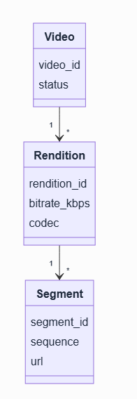

One Video has many Renditions, and each Rendition has many Segments.

**Key idea.** One Video fans out to many Renditions and Segments, with metadata and media in separate stores.

## 5. High-level design

Rather than presenting the final system, construct it incrementally: begin with the simplest design that works and let each failure introduce the next component.

*Reading the diagrams: each step's diagram outlines the components newly added at that step in pink, so you can see at a glance what changed from the step before.*

### 5.1 The naive version

Begin with one app server. The creator uploads to it, it stores the file on disk, and on playback it streams the bytes back. Under real video workloads, this fails in three ways: the multi-gigabyte upload passes through the app server over an unreliable connection; one stored file cannot serve both a phone and a television; and every viewer streams bytes through the server, so origin egress becomes prohibitively expensive. Each is addressed in turn.
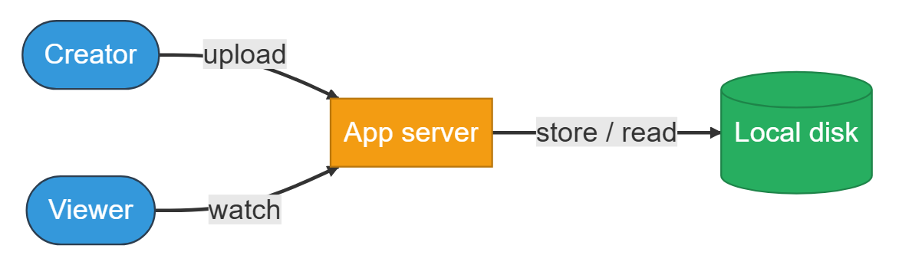
```text
Creator ──(upload)──▶ App server ──(store/read)──▶ Local disk
                          │
                      (watch)
                          ▼
                       Viewer
```
The creator uploads to the app server, which stores the file on local disk and streams it back on playback.

### 5.2 Fix 1: get the upload off the app server

Consider a 4 GB upload from a phone passing through the app server. If the connection drops at 90%, the entire transfer is lost. A simple retry restarts from byte zero, so the fix must change where the bytes are written. They are sent directly to a blob store with a resumable, pre-signed URL: a dropped connection re-sends one chunk, and the app server writes only a small metadata record. Large opaque files belong in a blob store rather than on an app server's disk.

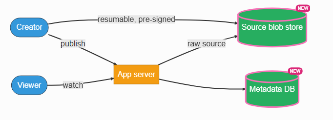

```text
Creator ──(resumable, pre-signed)──▶ [Source blob store (NEW)]
Creator ──(publish)──▶ App server ──▶ [Metadata DB (NEW)]
App server ──(watch)──▶ Viewer  (raw source flows from Source blob store)
```
Uploads go directly to the new source blob store via resumable, pre-signed URLs; the app server writes only metadata, and playback still flows from the source blob store.

### 5.3 Fix 2: transcode into a ladder, off the request path

The bytes are now stored, but a raw source still cannot play everywhere, so it is transcoded into the ladder of renditions and segments. Transcoding within the upload request is the direct approach, but a full ladder requires minutes of CPU time, so the request would time out and upload availability would depend on encode capacity. Instead, the completed upload places an event on a queue, and a worker fleet runs the ladder asynchronously, writes the renditions, segments, and manifest to blob storage, and sets status to ready. Because segments are independent, the work distributes across the fleet.

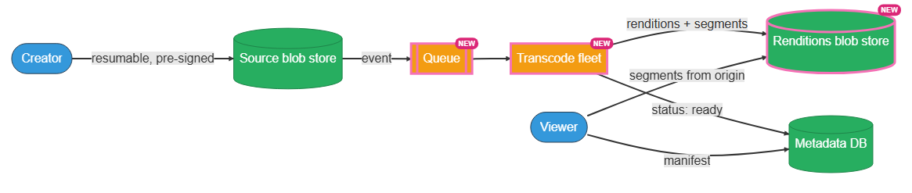
```text
Creator ──▶ Source blob store ──(event)──▶ [Queue (NEW)] ──▶ [Transcode fleet (NEW)] ──(renditions + segments)──▶ [Renditions blob store (NEW)]
                                                                    │
                                                            (status: ready)
                                                                    ▼
                                                              Metadata DB ◀── manifest ── Viewer
                                                       Renditions blob store ◀── segments (from origin) ── Viewer
```

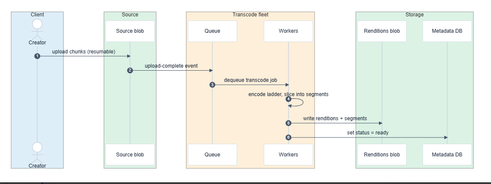
An upload event queues a transcode job; the transcode fleet writes renditions and segments to the new blob store and marks status ready in metadata; the viewer reads the manifest from metadata and segments from origin.

**Sequence — the upload-to-watchable flow over time. Actors:** Creator, Source blob, Queue, Workers, Renditions blob, Metadata DB (grouped as Client / Source / Transcode fleet / Storage).

Steps: Creator → Source blob: upload chunks (resumable) (1) → Source blob → Queue: upload-complete event (2) → Queue → Workers: dequeue transcode job (3) → Workers: encode ladder, slice into segments (4) → Workers → Renditions blob: write renditions + segments (5) → Workers → Metadata DB: set status = ready (6).

### 5.4 Fix 3: serve playback from the CDN, not the origin

**Design checkpoint widget:** *"A brand-new video suddenly goes viral. Within the same second, thousands of edge caches all miss the same not-yet-cached segment and turn to the origin at once. What keeps that from overwhelming the origin?"* Options: (a) *Provision the origin to absorb the burst of simultaneous misses*; (b) *Put a shield in front of the origin that merges the simultaneous misses into a single fetch*.

The third failure is the costly one. If every viewer reads from the origin, origin egress equals the full view bandwidth — the exabyte figure from the estimation. Nearly every byte must therefore be served from the edge. The viewer fetches the small manifest from metadata and then fetches immutable segments from the CDN, changing rendition per segment via ABR. The origin is accessed only on a cache miss, and those misses pass through an origin shield — a single intermediate cache placed between the many edge locations and the origin. Because every edge in a region fetches through the shield rather than going to the origin directly, a cold segment is read from the origin just once and then served to all the edges that want it. That coalescing is what keeps a newly popular video from overloading the origin.

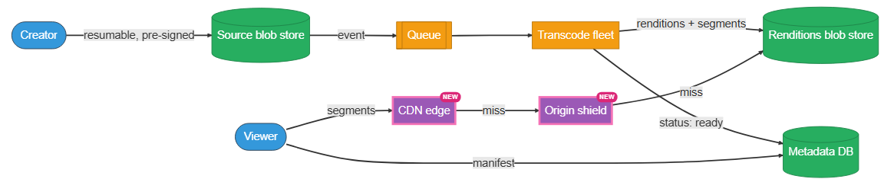
```text
(same pipeline as 5.3, plus)
Viewer ──(manifest)──▶ Metadata DB
Viewer ──(segments)──▶ [CDN edge (NEW)] ──(miss)──▶ [Origin shield (NEW)] ──(miss)──▶ Renditions blob store
```
The viewer still reads the manifest from metadata, but now fetches segments from a new CDN edge, which falls back through a new origin shield to the renditions blob store only on a miss.

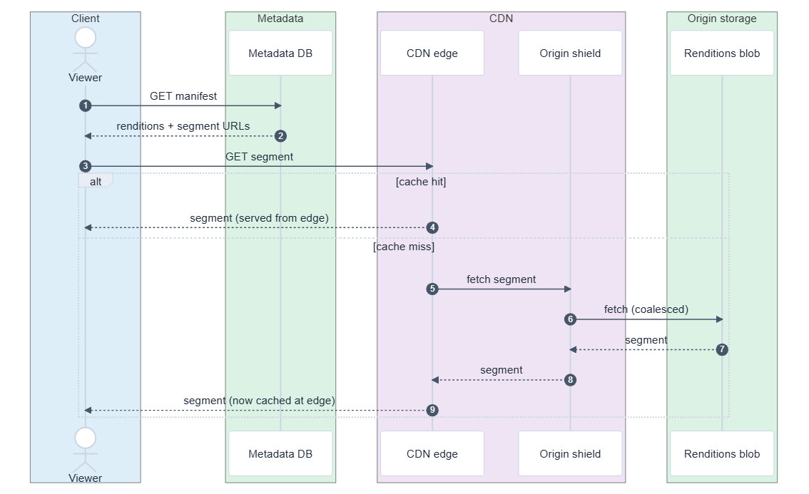
**Sequence — a playback request over time. Actors:** Viewer, Metadata DB, CDN edge, Origin shield, Renditions blob (grouped as Client / Metadata / CDN / Origin storage). Dashed `alt` box marks two paths: `[cache hit]` served straight from the edge, or `[cache miss]` which fetches through the shield to the origin and then caches the segment.

Steps: Viewer → Metadata DB: `GET manifest` (1) → Metadata DB → Viewer: renditions + segment URLs (2) → Viewer → CDN edge: `GET segment` (3) → CDN edge → Viewer: segment, served from edge (4) [hit path]; or CDN edge → Origin shield: fetch segment (5) → Origin shield → Renditions blob: fetch, coalesced (6) → Renditions blob → Origin shield: segment (7) → Origin shield → CDN edge: segment (8) → CDN edge → Viewer: segment, now cached at edge (9) [miss path].

### 5.5 The composed design

Combining the three fixes yields the complete system.

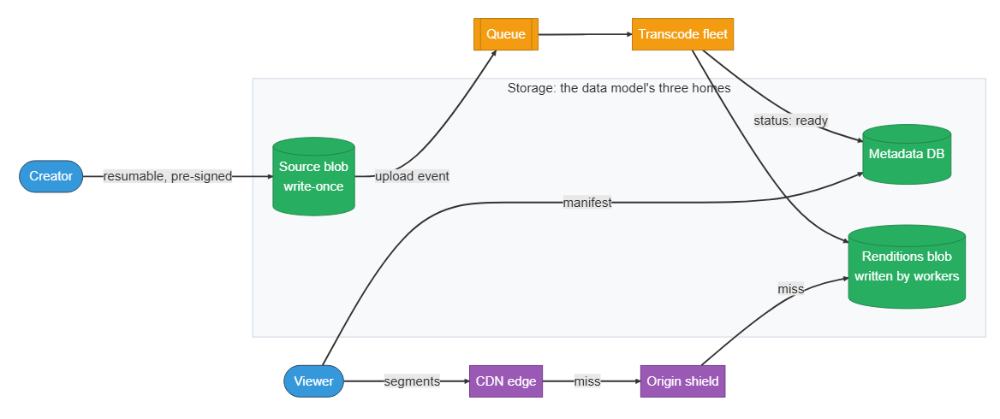
The data model's three homes: the source blob (write-once), the renditions blob (written by workers), and metadata DB, tied together by the upload and playback paths.

These stores are the data model's three locations made concrete. The video and rendition records reside in the metadata database; the large data is split into two blob stores — source, written once on upload, and renditions, written later by the workers. The data model specifies what is stored; the design specifies which component writes each store, and when.

**Strong-answer criteria.** A complete answer derives each component from a specific failure, justifies the parallel transcode and the origin shield from scale, and notes that the source master is retained for re-transcoding to future codecs.

**Key idea.** Each component answers one failure of the naive server: direct upload, async transcode, CDN delivery.

## 6. Deep dives

Three topics are central: the transcode pipeline, ABR and CDN delivery, and delivery economics with storage tiering.

### 6.1 The transcode pipeline

*Before reading on: Why is one uploaded video turned into five or more copies? And how is a 2-hour video transcoded in less than 2 hours?*

One source cannot play on all devices, which requires the encoding ladder defined in Key concepts. The ladder is five or more times the work, and a 2-hour video cannot take 2 hours to encode, which requires segmentation and parallelism. Because segments are independent, the source is split, chunks are transcoded concurrently across the fleet, and the results are reassembled. The useful consequence is that transcode time is decoupled from video length: a 2-hour video and a 10-minute video are both ready in roughly the time of one chunk, given enough workers.

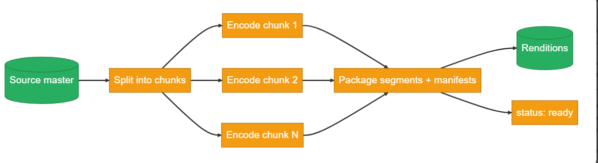
```text
Source master ──▶ Split into chunks ──(fan-out)──┬──▶ Encode chunk 1 ──┐
                                                  ├──▶ Encode chunk 2 ──┼──(fan-in)──▶ Package segments + manifests ──▶ Renditions ──▶ status: ready
                                                  └──▶ Encode chunk N ──┘
```
The source is split into chunks, encoded in parallel across the fleet, then fanned back in and packaged into renditions marked ready.

**Design checkpoint widget:** *"The transcode is split across a fleet, and one worker crashes halfway through a long video. How do you avoid re-encoding the entire video from scratch?"* Options: (a) *Restart the whole job from the beginning*; (b) *Key each unit of work by (video, rendition, segment) so only the failed segment retries*.

Two refinements complete the pipeline. Emitting HLS and DASH separately for every rendition duplicates storage, so the source is packaged once into a shared segment format both protocols can reference, and the packager produces both manifests from those shared segments, roughly halving segment storage. And because a job distributed across a fleet may fail partway, each unit is keyed by (video_id, rendition, segment) so a failed segment retries independently. The retained source master means a failure only delays completion; it does not lose data.

**What separates answers — the transcode pipeline (expanded BAD / GOOD / GREAT rows):**
- **BAD — Serial transcode, single bitrate.** Transcode the whole file serially into a single bitrate. Upload latency scales with video length, and there is one rung for every network.
- **GOOD — Async segmented ladder, off the upload path.** A ladder of renditions, segmented and transcoded asynchronously off the upload path, so the user is not blocked while encoding runs.
- **GREAT — Chunk-parallel, package once, per-segment idempotency.** Adds chunk-parallel transcoding, so encode time tracks the slowest segment rather than the video length; packages once into shared segments instead of duplicating per protocol; and makes each segment idempotent on (video_id, rendition, segment), so a failed segment retries alone and the retained source master means failure delays completion rather than losing data.

### 6.2 ABR delivery and the CDN

*Before reading on: A viewer's bandwidth drops mid-video while moving out of WiFi range. What component selects 480p instead of 1080p, and when?*

The answer to the teaser: the player decides, and it decides at every segment boundary. ABR, defined in Key concepts, runs entirely on the client. The mechanics rest on four points.

- **The client drives ABR.** The player measures its download throughput and how much buffered video it has left, and at each segment boundary requests the next segment at the highest rendition those signals can sustain — 480p instead of 1080p when bandwidth falls, back up when it recovers. The server does nothing adaptive and holds no per-viewer state; it just serves cacheable segments. This pushes the intelligence to the edge of the system — literally the client — keeping delivery a dumb, cacheable read.
- **The manifest is the contract.** It lists every rendition and its segment URLs, and the player picks a path through it, switching renditions between segments without re-downloading anything. Because segment URLs are immutable, the CDN caches each one indefinitely.
- **The CDN hierarchy does the heavy lifting.** Edge points of presence (POPs — a CDN's local clusters of cache servers, placed close to users in many cities) serve most hits on hot segments, while regional caches and the origin shield raise the cumulative hit rate toward near-complete. A newly popular video is cold exactly once per POP, and the shield coalesces those simultaneous misses into a handful of origin fetches.
- **Pre-positioning (push).** For a scheduled premiere or a known-viral drop, push segments to the edges ahead of demand, so the first viewers do not pay the cold miss.

The manifest behaves like a grid the player walks across — one row per rendition, one column per segment. As bandwidth changes, the player switches rows between columns, always pulling the next segment's URL from the rendition it can sustain.

**Interactive widget — ABR walk-through grid:** two scenarios "Stable WiFi" and "Walking out of WiFi"; "Available bandwidth while fetching each segment" trace: 5, 4.5, 2.2, 1, 1.6, 3.2 (Mbps across segments 1–6); grid rows: 1080p·4.5 (s1–s6), 720p·2.5 (s1–s6), 480p·1 (s1–s6); caption "segment 1 → 6 · the player picks one rendition per segment"; the resulting path the player walks: `s1_1080p.ts, s2_1080p.ts, s3_480p.ts, s4_480p.ts, s5_480p.ts, s6_720p.ts`.

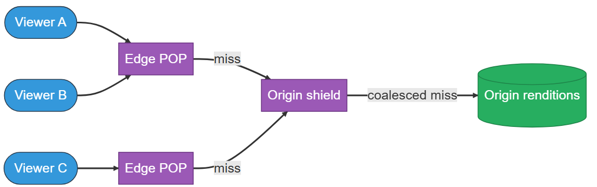
```text
Viewer A ──┐
Viewer B ──┼──▶ Edge POP ──(miss)──┐
Viewer C ──┘                       ├──▶ Origin shield ──(coalesced miss)──▶ Origin renditions
                    Edge POP ──(miss)──┘
```
Simultaneous misses from multiple viewers at multiple edge POPs are coalesced by the origin shield into a single fetch from origin renditions.

**Strong-answer criteria.** Client-driven ABR with the server as a cacheable read, the manifest as the contract, CDN tiering with shield coalescing, and pre-positioning for predictable spikes.

### 6.3 Delivery economics and storage tiering

Among these problems, video is distinctive in that egress bandwidth dominates cost rather than compute or storage. The deep dive therefore reduces to one equation and its consequences.

The equation is `origin egress = total × (1 − hit rate)`. At exabyte scale, even 1% origin egress is substantial, so the design maximizes hit rate through long cache lifetimes, immutable URLs, shield coalescing, and pre-positioning.

**Interactive widget — hit-rate simulator:** controls "Play / Restart"; caption "Requests start cold — every cache is empty"; nodes: edge·NA (cached: 0), edge·EU (cached: 0), edge·APAC (cached: 0), origin shield, origin storage; counters: requests 0, origin reads 0, cache hit rate 0%.

The second factor is popularity, which follows a power law: a small set of videos serves most views, while the long tail is rarely watched. Storage is therefore tiered by popularity — popular renditions on fast storage near the CDN, and older or cold content on lower-cost archival tiers with slower first-byte latency.

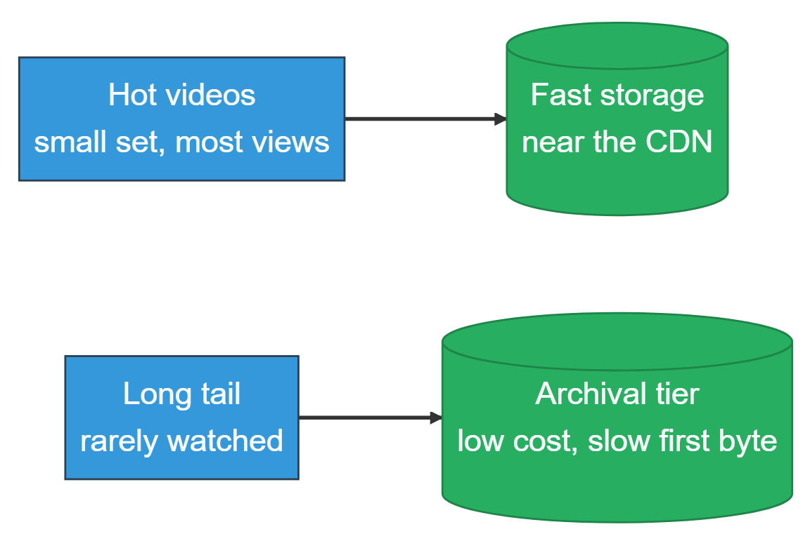

```text
Hot videos (small set, most views) ──▶ Fast storage (near the CDN)
Long tail (rarely watched)         ──▶ Archival tier (low cost, slow first byte)
```
Hot videos are kept on fast storage near the CDN; the rarely-watched long tail is moved to a low-cost archival tier with slower first-byte latency.

The same reasoning applies to rendition economics: pre-generating the 4K rung for a video rarely watched at that quality wastes transcode and storage, so common rungs are generated eagerly and rare or high rungs on demand. Source masters and popular renditions are replicated per region so the CDN origin is local, while cold content is stored in fewer regions.

**Strong-answer criteria.** Treating hit rate as the cost lever, tiering storage by the power law of views, transcoding the long tail on demand, and replicating popular content per region — each decision framed in terms of bandwidth and storage economics.

**Key idea.** Every deep dive serves one goal: drive origin egress toward zero while producing and serving the ladder.

## 7. Variants

For **live streaming**, transcoding occurs in real time as the stream arrives, segments are produced continuously, and the manifest grows during the stream. The added constraint is latency — viewers expect to be only seconds behind real time — so segment duration is reduced or low-latency chunked transfer is used. Delivery remains CDN-based, but cache lifetimes are short and the origin receives a continuous stream of new segments.

At **10× scale**, egress and storage reach multiple exabytes and the same measures become mandatory: aggressive cold-tiering, on-demand long-tail transcoding, per-region CDN origins, and maximizing hit rate. Transcode fleet cost becomes a significant line item, so codec efficiency — for example AV1 versus H.264 — trades transcode CPU for egress savings.

For **recommendations and discovery**, the watch-next feed is a separate ranking problem built on a fan-out of subscriptions; it is named and deferred rather than designed here.

**Key idea.** Live trades latency for freshness; 10× scale makes cold-tiering and codec efficiency mandatory.

## 8. The transferable pattern

A video platform is the metadata/media split applied at large scale, where delivery rather than storage is the primary problem. One immutable blob becomes a set of immutable blobs — renditions times segments. The read path becomes a CDN hit-rate optimization because egress dominates cost. And the client, not the server, performs adaptation through ABR, so delivery remains a simple cacheable read.

The same structure — precompute variants, segment for cacheability, move adaptation to the client, and serve from the CDN — recurs wherever large media is delivered to a global audience: live sports, podcasts, game-asset delivery, and software distribution. Recognizing that video is large media delivered at planetary audience scale reduces the problem to a hit-rate budget and an encoding ladder.

### Review: the 30-second answer

If you had thirty seconds to give the whole design, it rests on five decisions, each derived in the sections above:

- **Upload once, transcode to a ladder.** One source video becomes multiple renditions, each divided into short segments, produced asynchronously behind a queue.
- **Adaptive bitrate delivery.** The client reads a manifest, fetches segments, and changes quality per segment as bandwidth changes, providing smooth playback across connections.
- **CDN delivery is essential.** Because video is an egress-bound workload, nearly every byte must be served from the edge; otherwise bandwidth cost and origin load become prohibitive.
- **Separate metadata from media.** Small records reside in a database; large segments reside in blob storage behind the CDN.
- **Tier storage by popularity.** A small set of videos serves most views, so the long tail is moved to lower-cost storage.

## Quiz

Test your understanding of the key design decisions in this video platform.

**YouTube Design Quiz** ("Hide All" / "Reveal All" toggle) — 8 questions, each with a "Show/Hide Answer" button. Full text of every question and its revealed answer:

**1) Why is egress bandwidth, not storage, the quantity to size first?**
Storage is written once and is cheap; metadata is tiny. Egress recurs on every view and reaches exabyte scale per month. Because it is both the largest cost and the binding constraint, sizing it first is what justifies CDN tiering, immutable URLs, and long-tail decisions.

**2) Why does the client, not the server, select the bitrate for each segment?**
Keeping adaptation on the client lets the server hold no per-viewer state and serve only immutable, cacheable segments. Every request then looks identical regardless of bandwidth, which is exactly what lets the CDN absorb nearly all of the traffic.

**3) Why must segment URLs be immutable?**
An immutable URL always maps to the same bytes, so a cache can keep it indefinitely without revalidation. That permanence is what pushes the cumulative CDN hit rate toward near-complete and keeps origin egress near zero.

**4) Why doesn't a newly viral video overwhelm the origin?**
A cold segment would otherwise be missed by thousands of edges at once — a thundering herd. An origin shield sits between the edges and the origin and coalesces those simultaneous misses, so the origin serves the cold segment once rather than thousands of times.

**5) Why is transcoding run asynchronously off the upload request, and split into parallel chunks?**
A full ladder needs minutes of CPU, so doing it inside the request would time out and tie upload availability to encode capacity. Running it behind a queue decouples the two. Splitting the source into independent segments lets workers encode in parallel, so completion tracks the slowest chunk rather than the video length.

**6) Why key each unit of transcode work by (video_id, rendition, segment)?**
It makes each segment's encode idempotent. When a worker crashes midway, only that segment retries instead of restarting the whole job, and because the source master is retained, a failure only delays completion rather than losing data.

**7) Why separate metadata from media into different stores?**
Video and rendition records are about a kilobyte, structured, and read on every watch — a good fit for a sharded database. Segments and masters are far larger and belong in blob storage behind the CDN. Media outweighs metadata by roughly 1000×, so their size and access patterns demand different homes.

**8) Why tier storage by popularity instead of keeping everything on fast storage?**
Views follow a power law: a small set of videos serves most traffic while the long tail is rarely watched. Keeping cold content on fast storage wastes money, so the long tail moves to cheaper archival tiers with slower first-byte latency, and the eagerly generated rungs stay near the CDN.
