# Design a News Feed

Source: https://systemdesignschool.io/problems/news-feed/solution

> Note on fidelity: this page is built from many JS-interactive widgets (calculators, step-through diagrams, tabbed panels, animated simulations, sequence diagrams) rather than static images. Every widget's full content — including states behind tabs/toggles, the labels/boxes/arrows inside each diagram, and the answers behind the quiz's "Show Answer" buttons — has been clicked through (via "Reveal All") and transcribed below as text, in the same order it appears on the site. The site has no downloadable diagram image files (they're rendered live by JS/SVG, not `` files), so there are no image assets to save for this page.

---

Tags: Hard · Fan-out · Feed ranking · Hot-key / celebrity · Async processing · Caching · Availability

## Problem statement

Design the home feed for a social product. When a user opens the app, they see a ranked, near-real-time stream of posts from the accounts they follow. The scope here is producing posts, assembling each reader's timeline, following and unfollowing, and recording engagement. Profile timelines, notifications, search, ads, comment threads, and stories are separate problems and out of scope.

Two facts make this hard. Producers vary enormously: an account may have three followers or a hundred million. Consumers vary too: a reader may follow ten accounts or ten thousand. The feed must feel instant for all of them, and it must stay instant when the producers include celebrities and the consumers include power users.

## Clarifying questions

Before designing, pin down what shapes the system. Each question, with the assumption its answer establishes:

- **Read-to-write ratio?** Reads dominate — on the order of 20 to 1 under these assumptions. This makes the read path the thing to optimize.
- **Follower-count distribution?** A long tail of celebrities — a few accounts with millions of followers — drives most of the design despite being a tiny fraction of producers.
- **Latency target?** First content paint at p99 (the slowest 1% of requests). Assume a couple hundred milliseconds, server-side.
- **Ranked or chronological?** Ranked. Ranking becomes a first-class component, not an afterthought.
- **How fresh?** New posts visible within a few seconds, not strictly real-time. Seconds of staleness are acceptable.
- **Content types?** Text plus references to media; the bodies live in other services.
- **Global or single region?** Global eventually, which makes per-region placement a concern.

Say these out loud even if the interviewer waves them off. Half the senior signal is *which* questions you would ask.

## What makes a feed hard

A feed looks like a simple read: fetch recent posts from the people you follow, sort, return. At scale that read is the whole problem, because two coupled decisions sit underneath it.

The first is **fan-out**: how a new post travels from its producer to the timelines of everyone who follows them. The second is **ranking**: how those timelines are scored before they are shown. Most candidates handle one well and botch the other. The defining skill is holding both in your head at once, because the choice you make for fan-out constrains where ranking can run.

> **Fan-out.** Copying a new post into the feeds of everyone who should see it. *Push* (fan-out on write) copies the post into each follower's stored timeline when it is created. *Pull* (fan-out on read) leaves the post in place and gathers posts from each followed account at read time.

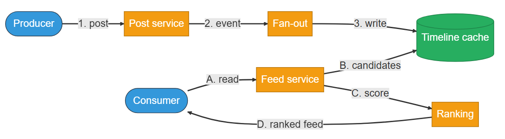
```text
Producer ──(1. post)──▶ Post service ──(2. event)──▶ Fan-out ──(3. write)──▶ Timeline cache
                                                                                    │
                                                                                (A. read)
                                                                                    ▼
Consumer ◀──(D. ranked feed)── Ranking ◀──(B. candidates)── Consumer's Feed service
              (C. score)
```
End-to-end flow: a post is written, fanned out into timeline caches, then read by the consumer's feed service, scored by ranking, and returned as the ranked feed.

> **Key idea.** A feed is two coupled decisions — fan-out and ranking — not one read.

## Key concepts

This section covers the concepts needed to solve this problem — prerequisites for the design work that follows. A feed is built from a handful of mechanisms. The producer posts; fan-out copies the post toward followers; the consumer reads an assembled timeline; a ranker scores it; the client shows the top.

### Push versus pull

Push pays at write time: when a post is created, the system writes its id into every follower's stored timeline. Reads are then cheap — the timeline is already assembled. Pull pays at read time: the timeline is built on demand by gathering recent posts from each followed account. Writes are then cheap, but a reader who follows thousands of accounts forces thousands of lookups per read. Neither extreme survives both a celebrity producer and a power-user consumer.


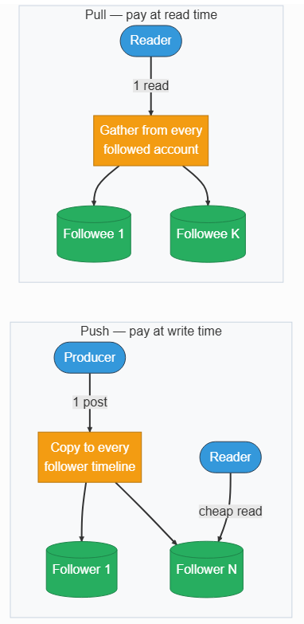
```text
Pull (pay at read time):
Reader ──(1 read)──▶ gathers from every followed account ──▶ Followee 1 … Followee K

Push (pay at write time):
Producer ──(1 post)──▶ copies to every follower timeline ──▶ Follower 1 … Follower N ──▶ Reader gets a cheap read
```
Pull gathers posts from every followee at read time; push copies the post to every follower's timeline at write time, making reads cheap.

### The materialized timeline

A **materialized timeline** is a per-user list of post ids kept ready to read, stored as a **sorted set** — entries ordered by a numeric score and keyed by post id, so re-inserting the same post updates it in place rather than duplicating — and capped at about 1,000 entries. It is *derived state*: it can be rebuilt from the post store and the follow graph, so losing it is recoverable. Push writes into it; the read path reads from it.

### The celebrity problem

One post from an account with 50 million followers becomes 50 million timeline writes under push. That single event can spike write load far above the steady-state average. The same account's posts are also a read hot key — millions of readers want them at once. Celebrities break pure push and stress pure pull, which is why neither pure strategy is the answer.

### Two-stage ranking

Ranking every candidate with a heavy model is too slow, so ranking runs in two stages. **Candidate generation** cheaply assembles a few hundred recent posts with high recall — it gathers everything that might deserve a spot. **Heavy ranking** then scores those candidates with a learned model and keeps the top few dozen. The ranking deep dive opens up the features and the score.

### Availability over consistency

A feed is the front door of the product. It must answer even when a dependency is degraded, so the system favors availability over consistency: it returns a slightly stale or chronologically-ordered feed rather than an error. Posts become visible within seconds, not instantly, and two devices may briefly show different feeds. That is an acceptable trade for never showing an empty screen.

> **Key idea.** Push and pull trade write cost for read cost; the celebrity tail breaks both pure strategies.

## 1. Requirements

> **Before reading on.** List the functional and non-functional requirements, then name the one property you would never compromise and the one constraint that drives the design. They are different here.

### 1.1 Functional requirements

The actions in the problem statement are the requirements. A producer *posts*, a consumer *reads* a feed, users *follow* and *unfollow*, and the system records *engagement* that ranking later consumes.

- **Post** text plus optional media references; the post becomes retrievable and eligible for followers' feeds.
- **Read** a ranked, paginated home timeline of recent posts from followed accounts.
- **Follow / unfollow** an account, which changes what appears in the follower's feed.
- **Record engagement** — likes, reshares, views — as signals the ranker uses as features. Recording the event is in scope; the high-throughput **engagement store** that counts those events is a separate problem, treated here as an existing service the ranker reads.

Profile timelines, notifications, search, ads, comment threading, and stories are named and deferred.

### 1.2 Non-functional requirements

- **Low read latency** — first content paint within roughly 200ms at p99, server-side (illustrative). This shapes materialization and the read path.
- **Freshness** — a new post is visible to most readers within a few seconds; the celebrity tail may lag longer.
- **High availability** — the feed degrades to cached or chronological order rather than failing.
- **Scale anchor** — roughly 300M daily active users, about 200 follows per user, and around 0.5 posts per active producer per day (illustrative).
- **Consistency** — eventual, within seconds; under a network partition the feed stays available.

### 1.3 The constraint versus the property

**Availability is the non-negotiable property**: the feed is the front door, so it must always answer. **Read latency is the constraint that drives the design**: it forces materialization, push for normal users, and the hybrid that follows. And the load multiplier behind both is fan-out amplification — one post becomes as many timeline writes as the author has followers.

> **Key idea.** Availability is the property you protect; read latency is the constraint you design around; fan-out amplification is the load you must bound.

## 2. Back-of-the-envelope estimation

The estimate exists to show, with numbers, that fan-out amplification — not raw post volume — is the load that shapes the design. The figures are illustrative anchors derived from the scale assumptions, not measured values.

**Interactive calculator widget (default values shown):**

| Input | Default |
|---|---|
| Daily active users | 300M |
| Follows per user | 200 |
| Feed loads / user / day | 10 |
| Posts / producer / day | 0.5 |
| Peak / average factor | 3× |

**Computed outputs:**

| Output | Value |
|---|---|
| Peak feed reads | 104K/s |
| Peak posts | 5K/s |
| Fan-out writes (pure push) | 1.0M/s |
| Timeline storage | 15 TB |

Formula shown: `push writes/s = 5K posts/s × 200 followers = 1.0M/s`. A single post becomes 200 timeline writes under push. Fan-out amplification, not post volume, is the load that shapes the design.

### 2.1 Reads

From 300M daily active users loading the feed about 10 times a day, that is 3 billion feed reads per day, or roughly 35,000 reads per second on average. Applying a 3× peak factor gives about **100,000 reads per second** at peak. Reads dominate, so the read path is the thing to make fast.

### 2.2 Writes and fan-out amplification

Posts themselves are modest: at peak, on the order of **5,000 posts per second**. The amplification is the story. Under pure push, each post is copied to every follower, so `5,000 posts/sec × 200 followers ≈ 1,000,000 timeline writes/sec`. A single post from a 50M-follower celebrity is 50 million writes on its own — a spike roughly 50× the steady-state average. That asymmetry is why pure push cannot stand alone.

### 2.3 Storage

Posts at about 500 bytes each accumulate on the order of tens of terabytes per year. The materialized timelines are `300M users × 1,000 entries × ~50 bytes ≈ 15 TB`, which fits in a sharded in-memory store. The follow graph at `300M × 200 edges × ~30 bytes ≈ 2 TB` is comparably small. Storage is not the binding constraint; amplification and read latency are.

> **Key idea.** The load that matters is fan-out amplification — a million timeline writes per second, spiking 50× on a single celebrity post.

## 3. API design

**Design checkpoint:** *The feed read must paint within ~200ms, and ranking can re-order results between requests. Should pagination use a timestamp/offset cursor or an opaque cursor?* Options: (a) *A timestamp or numeric offset the client can construct*; (b) *An opaque cursor the server issues, so it can encode ranking and position together* — the surrounding text confirms the design picks (b), since "the cursor is opaque so the server controls pagination across ranking changes."

The interface is small. Every endpoint derives the acting user from the authenticated session, so identities like the author, follower, or engagement actor never come from the request body. Writes return immediately because fan-out happens asynchronously behind them, and the feed read returns post bodies inline so the client does not make a second round trip.

### 3.1 Create a post

The producer publishes a post. The call writes to the post store, emits a `post_created` event for fan-out, and returns at once — the reader-side work is invisible here.

`POST /v1/posts` *(Request & response detail expandable in the live UI, not expanded here.)*

### 3.2 Read the home feed

The consumer requests a page of the ranked timeline. Post bodies are inlined, and the cursor is opaque so the server controls pagination across ranking changes.

`GET /v1/feed?cursor={opaque}&limit=20`

### 3.3 Follow and unfollow

Editing the graph changes future feed assembly. The follower is the authenticated user, so the request only names the target account.

`PUT /v1/me/following/{followee_id}` and `DELETE /v1/me/following/{followee_id}`

### 3.4 Record engagement

Engagement is recorded as a signal the ranker later reads as a feature. The actor is the authenticated user.

`POST /v1/posts/{post_id}/engagement`

> **Key idea.** The API hides the fan-out strategy: posts return immediately, the feed inlines bodies, and the cursor is opaque so ranking can re-order safely.

## 4. Data model

### 4.1 The post

A post is the source of truth for content. It is sharded by `post_id` and indexed by author and time so the pull path can fetch a celebrity's recent posts.

 Fields: `post_id`, `author_id`, `content`, `media_refs[]`, `created_at`, `status` (enum).

### 4.2 The follow edge

A follow is a directed edge. It is keyed by `(follower_id, followee_id)` and indexed in reverse so the push path can look up "everyone who follows X" — the bottleneck of fan-out. 

Fields: `follower_id`, `followee_id`, `created_at`, `status` (enum).

### 4.3 The materialized timeline

Each reader has a timeline of `(post_id, score)` pairs, a sorted set capped near 1,000 entries and sharded by `user_id`. It is derived from posts and the graph and can be rebuilt on loss, so it is a cache, not a system of record. 


Fields: `user_id`, `post_id`, `score` (double).

### 4.4 Where each entity lives

The post store and graph store are sources of truth in durable, replicated databases. The timeline is in-memory and rebuildable. Engagement counters and per-viewer interactions live in their own services that the ranker reads as features; the design treats them as existing.

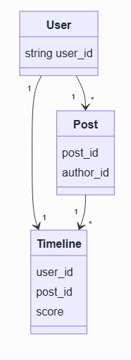


One Post is produced by one author and copied into many Timelines; one Follow edge connects two users; the score on each Timeline entry is what ranking and ordering read.

> **Key idea.** Posts and the graph are sources of truth; the timeline is derived state that can be rebuilt.

## 5. High-level design

Rather than present the final system, build it from the simplest design that works and let each failure introduce the next component.

> **Reading the diagrams.** Each step marks the components newly added at that step with a dashed outline and a **NEW** badge, so you can see what changed from the step before.

### 5.1 Pure pull

The simplest design stores nothing per reader. On each feed read, the feed service asks the graph for the reader's followees, queries each followee's recent posts, then merges and ranks them.

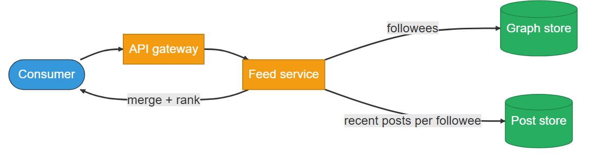

```text
Consumer ──▶ API gateway ──▶ Feed service ──(followees)──▶ Graph store
                                    │
                        (recent posts per followee)
                                    ▼
                                Post store ──(merge + rank)──▶ response
```
The feed service asks the graph store for followees, pulls recent posts per followee from the post store, then merges and ranks them into a response.

This fails in two ways. A power user following 5,000 accounts forces about 5,000 backend lookups per read, which blows the 200ms budget. And a celebrity's posts become a read hot key, fetched by millions of readers on every feed load.

### 5.2 Fix 1: pre-assemble timelines with push

Move the work to write time. When a post is created, a durable queue carries a `post_created` event to fan-out workers, which read the author's followers and write the post id into each follower's timeline cache. Reads then return a pre-assembled timeline.

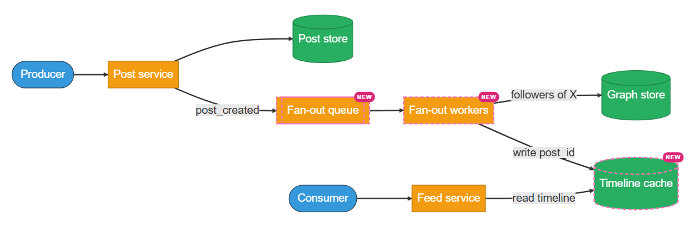
A new post triggers a fan-out queue and workers, which look up followers via the graph store and write the post id into the new timeline cache.

This makes reads fast but reintroduces the celebrity problem at write time. A 50M-follower post is 50 million writes; sustained celebrity posting spikes far above the million-writes-per-second average, the queue backs up, and timeline shards go hot.

### 5.3 Fix 2: split push and pull at a threshold

Push works for normal accounts and fails for celebrities, so split by follower count at a threshold `T` of roughly 100,000 (illustrative, tuned per deployment). Accounts below `T` are pushed; accounts above `T` are skipped at write time, and the read path pulls their recent posts from the post store's `(author_id, created_at)` index. A median reader follows about 200 accounts, of which only a fraction of a percent are celebrities — typically one extra read per feed load.

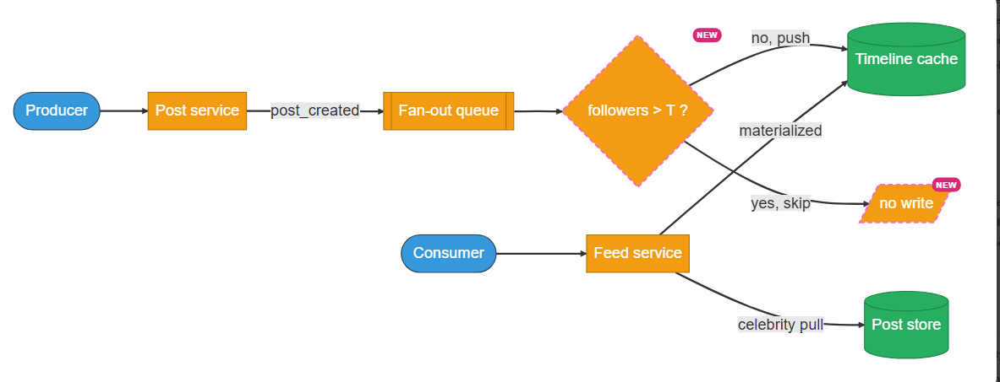
```text
Producer ──▶ Post service ──▶ Fan-out queue ──▶ [followers > T ? (NEW)] ──no──▶ push ──▶ Timeline cache
                                                          │
                                                         yes
                                                          ▼
                                                   skip, no write

Consumer ──▶ Feed service ──┬──(materialized)──▶ Timeline cache
                             └──(celebrity pull)──▶ Post store
```
Accounts below threshold T are pushed to the timeline cache at write time; accounts above T are skipped and pulled directly from the post store at read time.

**Push/hybrid toggle widget:** tabs "Pure push" / "Hybrid (T = 100K)"; slider "Producer followers: 6K"; readouts "Strategy for this author: Push on write", "Timeline writes per post: 6K" — "Push copies this post into 6K timelines at write time, so reads stay cheap." As the producer's follower count crosses `T`, the strategy flips from push to pull and the per-post write cost drops to zero.

This fixes the write spike, but it moves the problem to the read path. A celebrity's recent posts are now a read hot key — millions of feed reads pull the same author's posts at once, the very hot key that broke pure pull, now concentrated on a few accounts.

### 5.4 Fix 3: front celebrity reads with a replicated cache

Pulling celebrities from the post store on every feed read would hammer a handful of keys. Put a dedicated cache in front of the post store for celebrity posts, and replicate it widely so the hot key spreads across many nodes — the more followers an account has, the more replicas its entry gets.

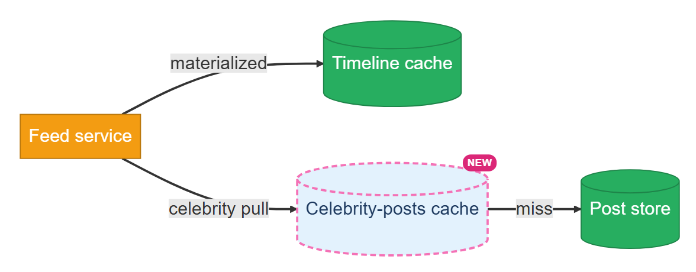

```text
Feed service ──(materialized)──▶ Timeline cache
Feed service ──(celebrity pull)──▶ [Celebrity-posts cache (NEW)] ──(miss)──▶ Post store
```
The feed service reads materialized entries from the timeline cache and celebrity posts from a new dedicated, widely-replicated cache, falling back to the post store on a miss.

The read path now merges two sources: the reader's materialized timeline and a small, cache-served pull from the accounts above `T`. How that cache survives a stampede of cold-key misses is the celebrity deep dive.

### 5.5 Fix 4: rank the candidate set on the read path

The read path now assembles a candidate set — the materialized timeline merged with the celebrity pull — but returns it in storage order, roughly newest-first. The feed is meant to be *ranked*: most relevant first, not most recent. So add a **Ranking Service** that scores the candidate set on the read path and returns the top few dozen.

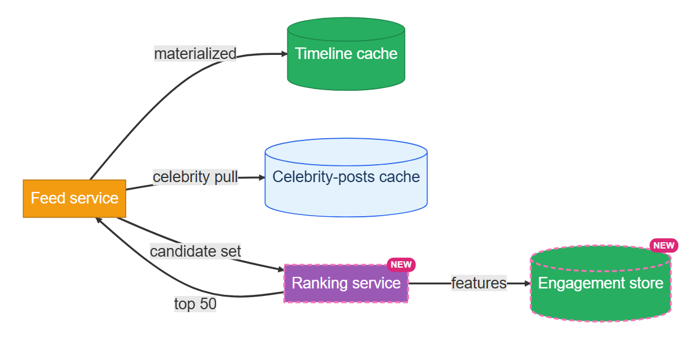
Candidates from the timeline cache and celebrity-posts cache are merged and sent to the new ranking service, which pulls features from the new engagement store and returns the top 50.

Ranking has to run here, on read, not at write time: the signals that decide relevance — how recently the reader visited, what they are engaging with this session — only exist at read time. That is the fan-out and ranking coupling. Scoring every candidate with a heavy model would blow the budget, so ranking is itself two-staged — cheap candidate generation, then a heavy model over the survivors.

The ranker's features come from the **engagement store** — the counter service fed by the `POST /engagement` writes. Recording a like or reshare is a thin, asynchronous write to that service; the ranker reads its counts (a post's engagement velocity, the viewer's prior engagement) at rank time. Building a counter store that absorbs write-heavy bursts is its own problem and is out of scope; the feed treats it as an existing dependency, and the read path degrades to ranking without engagement features when it is unavailable.

### 5.6 The read path and its latency budget

The feed read fans out internally and must stay within roughly 200ms.

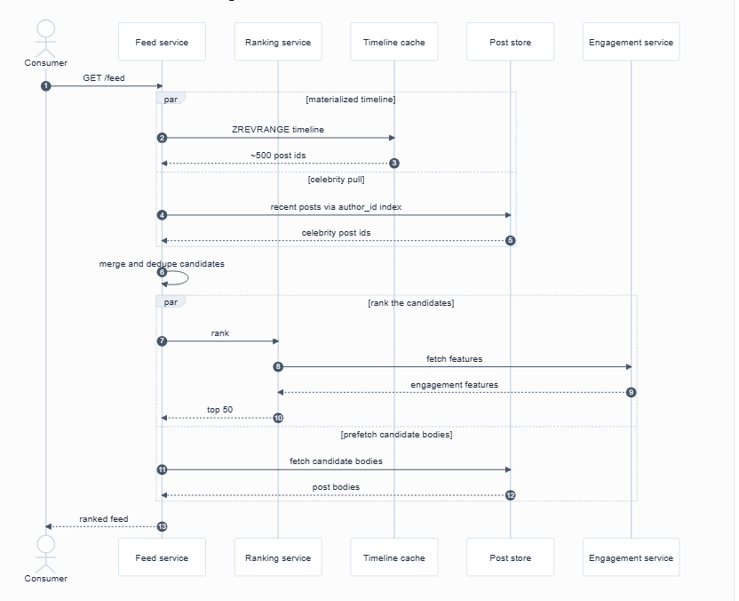

**Sequence diagram widget:** Consumer → Feed service: `GET /feed` (1); Feed service → Timeline cache: `ZREVRANGE timeline` (2) → `~500 post ids` (3), run in parallel with Feed service → Post store: `recent posts via author_id index` (4) → `celebrity post ids` (5); Feed service merges and dedupes candidates (6); Feed service → Ranking service: `rank` (7) → Engagement service: `fetch features` (8) → `engagement features` (9) → `top 50` (10), run in parallel with Feed service → Post store: `fetch candidate bodies` (11) → `post bodies` (12); Feed service → Consumer: `ranked feed` (13).

The budget, stage by stage at p99: network in 5ms, timeline read 10ms, celebrity pull 30ms (in parallel with the timeline read), merge 5ms, feature fetch 30ms, heavy ranker 50ms, candidate-body prefetch 30ms (in parallel with ranking, so the top posts are already hydrated when ranking returns), response out 10ms, plus slack — about 200ms total. The parallelism is not optional; without it the stages sum past budget.

### 5.7 The composed design

Combining the fixes yields the system: a write path that pushes below `T` and skips above it, and a read path that merges the materialized timeline with a cache-served celebrity pull, ranks the candidates in two stages while their bodies prefetch in parallel, and returns the top few dozen.

> **Strong-answer criteria.** Deriving each component from a specific failure, splitting push and pull at a tunable threshold, fronting celebrity reads with a replicated cache, ranking the candidate set on the read path, and naming the read-path parallelism that meets the latency budget.

> **Key idea.** Each component answers one failure of the naive design: push for cheap reads, a threshold for the celebrity write spike, a fronting cache for the celebrity read hot key, and read-path ranking for relevance.

## 6. Deep dives

Four topics are central: why fan-out and ranking are coupled, how ranking scores the candidate set, the celebrity problem, and managing the derived timeline cache.

### 6.1 Fan-out and ranking are coupled

> **Before reading on.** Push assembles timelines at write time. What viewer-side ranking signals simply do not exist yet when a post is pushed?

Push materializes a timeline before the viewer's context exists. Signals such as how long since the reader last visited, what they are dwelling on this session, and the freshness of engagement are unknown at write time, so a score computed then is stale by the time it is read. Pure pull could rank with fresh signals, but it pays K backend hops per read, where K is the number of followees — fatal for a 5,000-follow power user. Hybrid fan-out is the only design that hands ranking a bounded, fresh candidate set in the read path.

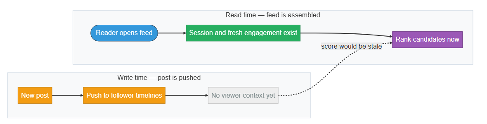
```text
Write time:  New post ──▶ Push to follower timelines   ("no viewer context yet")
Read time:   Reader opens feed ──▶ Rank candidates now   ("session and fresh engagement exist"; a push-time score "would be stale")
```
At write time a new post is pushed to follower timelines with no viewer context yet; ranking happens at read time when session and fresh engagement data exist.

**What separates answers — fan-out and ranking:**
- **Bad** — Treats fan-out and ranking as independent
- **Good** — Hybrid fan-out with read-path ranking
- **Great** — Explains the coupling, budgets the stages, tunes T

### 6.2 Ranking the candidate set

> **Before reading on.** Candidate generation hands the ranker ~500 posts, but the feed shows ~50. Why two passes — a cheap one and an expensive one — instead of one model over everything?

Ranking runs in two stages because the two goals pull in opposite directions. **Candidate generation** merges the reader's materialized timeline and the celebrity pull into roughly 500 deduped posts, optimizing for *recall* — cheap enough to finish in a few milliseconds. **Heavy ranking** then spends the bulk of the budget scoring those 500 with a learned model and keeping the top fifty, optimizing for *precision*. Splitting the work is what makes precision affordable: the expensive model only ever sees a few hundred posts, never the whole timeline.

> **Recall and precision.** *Recall* is the share of the posts worth showing that the candidate set actually contains; *precision* is the share of what is shown that the reader wanted. Stage one chases recall cheaply; stage two chases precision expensively.

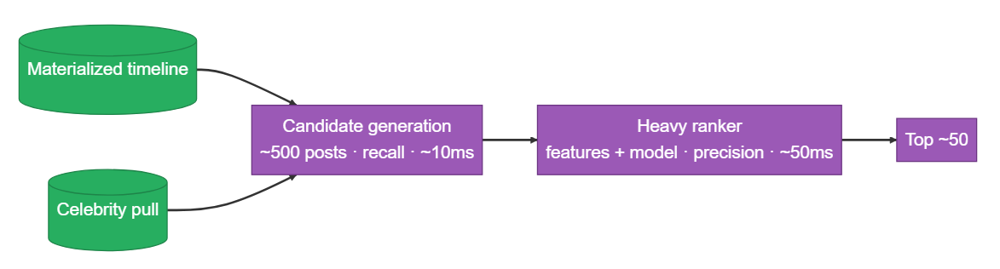

The ranker scores each candidate from three families of features: **Post-side** (age, engagement velocity, media type — fetched in batch), **Viewer-side** (time of day, device, time since last session, dwell behavior — computed once per request), and **Cross-features** (viewer's prior engagement with this author/topic, tie strength — fit between the two).

**Funnel widget:** ~500 candidates (timeline + celebrity pull) → score (heavy ranker, features + model) → ~50 shown (top of feed). **Latency comparison widget** — "Read-path p99 budget (illustrative) · dashed line = ~200ms target": bar "Run serially: ~200 ms" vs bar "Run with parallelism: ~160 ms." Overlapping the timeline read with the celebrity pull, and prefetching candidate bodies while the ranker runs, is what creates the headroom under budget.

**Design checkpoint:** *A cross-feature like 'has this viewer engaged with this author before' depends on both the viewer and the post. Why not precompute it offline and read it at rank time, the way a post id is pushed into a timeline?* Options: (a) *Precompute a viewer-by-post affinity table offline and look it up*; (b) *Compute it at rank time by joining the viewer's vector against the candidate set* — the surrounding text confirms (b), since features are "computed fresh on every read" to reflect the current moment.

The model emits one score per candidate, and that score is the feed's order. The opaque cursor from the API carries the reader's position through this ordering, so a later page stays consistent even as new posts arrive and scores shift. When the ranker is slow or down, the feed falls back to candidate order by recency — degraded, but never empty.

**What separates answers — ranking:**
- **Bad** — One model over the whole timeline
- **Good** — Two stages: cheap recall, then heavy precision
- **Great** — Three feature families, rank-time cross-features, recency fallback

### 6.3 The celebrity problem

> **Before reading on.** A celebrity posts and millions of readers request that post within the same second, all missing the same cold cache key. What stops them from stampeding the post store?

A 50M-follower post is 50 million writes under push — about 50× the average write rate — so celebrities are pulled, not pushed, above the threshold `T`. The read-side cost is small: a median reader follows roughly 200 accounts, of which well under a percent are celebrities. The harder issue is the read hot key. The fix is a dedicated cache in front of the post store, keyed by `celebrity_posts:{author_id}`, holding each celebrity's last ~100 posts, with a replication factor that scales with follower count — a few replicas for a one-million-follower account, dozens for a hundred-million-follower one — so reads spread across nodes.

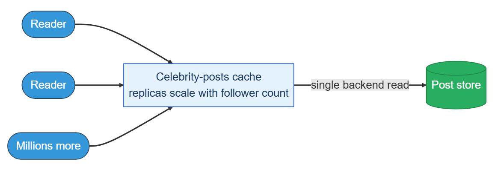

```text
Reader ──(single backend read)──▶ Celebrity-posts cache   (replicas scale with follower count)
Millions more Readers ──▶ same cache ──▶ Post store
```
Each reader does a single backend read against the celebrity-posts cache, whose replica count scales with follower count; millions of readers share that cache before it falls through to the post store.

**Design checkpoint:** *A brand-new celebrity post is a cold key. Thousands of feed reads miss it in the same second. What keeps them from all hitting the post store at once?* Options: (a) *Provision the post store to absorb the simultaneous misses*; (b) *Coalesce concurrent misses for the same key into a single backend read and serve the rest from the in-flight result* — confirmed as (b): "Request coalescing lets the first miss issue the backend read while concurrent requests for the same key wait on the in-flight result."

Two mechanisms keep the cache from stampeding. **Request coalescing** lets the first miss issue the backend read while concurrent requests for the same key wait on the in-flight result. **Lazy revalidation** serves a stale entry past its TTL while a background refresh runs, so readers rarely block. A lazy-push variant — push only to *active* followers and pull for the rest — bounds amplification further but needs per-edge activity tracking; for most teams, pulling all celebrities wins on operational simplicity.

**What separates answers — the celebrity problem:**
- **Bad** — Celebrities use pull, nothing more
- **Good** — Pull + fronting cache + coalescing
- **Great** — Replication scales with followers; lazy revalidation; T as one tunable

### 6.4 Managing the timeline cache

> **Before reading on.** The timeline cache is derived state. A shard dies and its timelines vanish. Why is that not a data-loss incident?

The materialized timeline is derived; the post store and graph are the sources of truth. Losing the cache is recoverable. Capacity is bounded by trimming to the top 1,000 entries on insert; readers who scroll deeper paginate into the celebrity pull and the post store's secondary index. Timelines for users inactive for 30 days are dropped under memory pressure and rebuilt on their next visit by running a pull fan-out over their full follow set — seconds cold versus about 200ms warm.

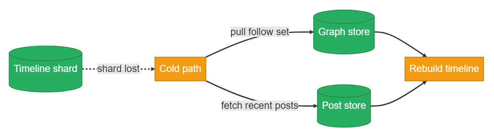

```text
Timeline shard (lost) ──▶ Cold path ──┬──(pull follow set)────▶ Graph store ──┐
                                       └──(fetch recent posts)──▶ Post store ──┴──▶ Rebuild timeline
```
When a timeline shard is lost, the cold path pulls the follow set from the graph store and recent posts from the post store to rebuild the timeline.

Because the timeline is derived, the queue can be **at-least-once** rather than exactly-once: a duplicate `post_created` re-runs the same `ZADD`. That is only safe if the score is **immutable for the event** — computed from the post's own fixed fields, never the worker's wall clock — so a retry writes the identical `(post_id, score)` and the operation is a true no-op. Anything that changes a post's score later, such as a periodic re-rank, runs through a separate versioned path, not the fan-out retry; where the immutability guarantee is hard, dedupe on the event id instead. On a shard failure, reads miss and fall to the cold path while a replica takes over, avoiding a from-scratch rehydration.

The consistency model is eventual. A normal post is visible within a few seconds; a celebrity post appears as soon as its cache entry refills, usually sub-second; the tail can stretch to minutes under sustained celebrity load. Under a partition the feed favors availability — it never returns an empty screen. A degradation ladder covers every read-path dependency:

- **Ranking slow or down** → skip heavy ranking and return candidates in chronological order.
- **Engagement service down** → rank on post-side and viewer-side features only.
- **Celebrity-posts cache down** → read the post store's `(author_id, created_at)` index directly.
- **Timeline shard down** → fall to the cold path and pull from the follow set.
- **Post store partially down** → serve the bodies that are available and mark the rest as loading.

Naming the ladder out loud is a senior signal: it shows you have thought past the happy path.

**What separates answers — the timeline cache:**
- **Bad** — Treats the cache as a database
- **Good** — Caps length, evicts, shards consistently
- **Great** — Derived state, idempotent at-least-once, cold rebuild, bounded staleness

> **Key idea.** The timeline is derived state: at-least-once delivery plus an immutable per-event score makes a retry a no-op and cache loss a rebuild, not an outage.

## 7. Variants

For **10× scale** (around 3B users), the architecture is unchanged but the breakpoints shift. The threshold `T` falls as more producers cross any absolute bound, sending more traffic to the pull path and its caches. Per-shard memory forces more shards — a shard sized for a million users holds about 50GB of timelines, so 10× users per shard is infeasible — and consistent hashing keeps each added node to roughly `1/N` of the keys. The fan-out worker pool scales with post rate, not user count, since most users are passive.

For **multi-region** deployment, post stores are homed by author region and replicated read-only elsewhere for celebrity pull. Fan-out workers run per region: home-region workers push same-region followers, and a cross-region follower's region pushes from the replicated post. Timeline caches stay regional and are never read cross-region. A cross-region follower sees a post a few hundred milliseconds later, from replication and the speed of light — name it, do not apologize. Chasing a single globally-ordered feed is the wrong goal; eventual visibility within seconds is fine.

For a **tighter freshness budget** — every post, including celebrities, visible within five seconds with no stale serving — the feed model breaks. That is a delivery problem, not a feed problem: long-lived connections (WebSocket or server-sent events) to a stateless gateway tier, a subscription registry mapping `user_id` to gateway node, and delivery workers that push new posts to connected clients while the materialized timeline becomes the cold-load fallback. When the staleness budget falls below about a second, stop making the feed faster and switch to a push-delivery architecture.

> **Key idea.** The architecture holds at 10× and across regions; only a sub-second freshness budget forces a different, delivery-pushed design.

## 8. The transferable pattern

A news feed is two coupled decisions. **Fan-out** chooses where work happens — at write time for the many, at read time for the few — and the hybrid exists so that **ranking** receives a bounded, fresh candidate set in the read path. Separating the two is the design failure that sinks most answers.

The second pattern is that the **materialized timeline is derived state**, not a database. Cache loss is recoverable, delivery can be at-least-once with idempotent writes, and visibility is eventual within seconds. The same shape — precompute for the common case, fall back to on-demand for the expensive tail, keep the materialized view derived, and favor availability — recurs wherever a read-heavy feed is assembled from a high-fan-out write: timelines, activity streams, notification inboxes, and home pages of any follow-graph product.

## Review: the 30-second answer

- **Two coupled decisions.** Treat fan-out and ranking together, not in isolation.
- **Hybrid fan-out.** Push to followers for normal accounts, and pull for celebrities above a threshold.
- **Materialized timeline.** Keep a per-user sorted set of post ids by score, capped near 1,000, as derived state.
- **Availability over consistency.** Serve a slightly stale or chronological feed rather than an error; eventual visibility within seconds.
- **Plan for hot spots.** Celebrity writes, celebrity reads under pull, and the engagement store the ranker depends on are the pressure points.

## Quiz

**Quiz widget** ("News Feed Design Quiz", "Hide All" / "Reveal All" toggle) — 7 questions, each with a "Show/Hide Answer" button. Full text of every question and its revealed answer:

**1) Why are fan-out and ranking treated as one coupled decision rather than two independent ones?**
Push materializes a timeline at write time, before the viewer's context exists, so fresh viewer-side ranking signals are unavailable. Pure pull could rank freshly but costs one backend hop per followee, which breaks the latency budget for power users. Only hybrid fan-out gives ranking a bounded, fresh candidate set in the read path — so the fan-out choice determines where ranking can run.

**2) Why does a single celebrity post break pure fan-out-on-write (push)?**
Push copies each post into every follower's timeline. An account with 50 million followers turns one post into 50 million writes — roughly 50× the steady-state average — so sustained celebrity posting backs up the fan-out queue and makes timeline shards hot. Above a follower threshold, those accounts are pulled at read time instead.

**3) Why is the materialized timeline cache not a data-loss risk when a shard dies?**
The timeline is derived state: it can be rebuilt from the post store and the follow graph, which are the sources of truth. A dead shard's reads fall to the cold path (a pull over the follow set) while a replica takes over, so losing the cache is a rebuild, not an outage.

**4) Why can the fan-out queue be at-least-once rather than exactly-once?**
The downstream write is a ZADD keyed by post id, so a duplicate event overwrites the same entry instead of duplicating it. This is a true no-op only if the score is immutable for the event — computed from the post's own fields, not the worker's clock — so a retry writes the identical score. Score changes from later re-ranking go through a separate versioned path.

**5) What keeps thousands of simultaneous misses on a fresh celebrity post from stampeding the post store?**
Request coalescing: the first miss for a key issues the backend read while concurrent requests for that key wait on the in-flight result. Combined with serving stale entries during a background refresh, readers see a real miss only on genuinely cold keys. A replicated celebrity-posts cache further spreads the load across nodes.

**6) Why does the read path run timeline reads and celebrity pulls in parallel?**
The p99 budget is about 200ms, and the stages — timeline read, celebrity pull, feature fetch, heavy ranking, candidate-body prefetch — sum past that if run serially. Running the timeline read alongside the celebrity pull, and prefetching candidate bodies alongside ranking so the top posts are already hydrated, brings the total within budget. The parallelism is what makes the latency target achievable.

**7) What does the threshold T control, and what happens to it at larger scale?**
T is the follower count above which an account is pulled instead of pushed. It is the single tunable that trades write amplification against read freshness: a lower T pushes fewer accounts (less write load, more pull reads). At larger scale T falls, because more producers cross any absolute bound, shifting more traffic onto the pull path and its caches.

## Sources and further reading

- [Fan-out: building a scalable feed — Stream](https://getstream.io/blog/fan-out-activities-followers/) — the hybrid push/pull model, and why skipping inactive followers cuts fan-out work substantially.

---

### System Design Master Template (embedded video)

YouTube embed: https://www.youtube.com/embed/OWVaX_cBrh8?si=MAfaQS1TV1r7USUI
