# Design Instagram

Source: https://systemdesignschool.io/problems/instagram/solution

> Note on fidelity: this page is built from many JS-interactive widgets (calculators, step-through diagrams, sequence diagrams, animated simulations) rather than static images. Every widget's full content — including states behind tabs/toggles, the labels/boxes/arrows inside each diagram, and the answers behind the quiz's "Show Answer" buttons — has been clicked through (via "Reveal All") and transcribed below as text, in the same order it appears on the site. The site has no downloadable diagram image files (they're rendered live by JS/SVG, not `` files), so there are no image assets to save for this page.

---

Tags: Hard · Object storage · CDN & delivery economics · Async processing · Fan-out · Durability · Hot key

## Problem statement

Design a photo-sharing service: users upload images, follow other users, and see a timeline of recent posts from the people they follow. It must ingest a high write volume of large binary objects, serve images at low latency worldwide, and assemble personalized feeds at scale.

In scope: uploading a photo with a caption and location so it becomes visible to followers, viewing a timeline of followed accounts, viewing a profile's grid of posts, and following or unfollowing. Comments, likes, direct messages, and search are out of scope.

## Clarifying questions

- **Read-heavy by how much?** Photo platforms are read-skewed: views far outnumber uploads. That justifies materialized feeds and CDN delivery.
- **What media size and variant set?** One multi-megabyte original, or also 1080/640/240px variants plus a thumbnail? The variant matrix drives transcode cost and storage.
- **How fresh must the feed be?** Seconds of staleness on a new post is fine, which unlocks asynchronous transcode and eventual feed propagation.
- **Chronological or ML-ranked?** Chronological lets you materialize the timeline cheaply; ranking forces candidate generation plus per-reader scoring at read time.
- **Single region or global?** Global delivery makes the CDN and cross-region blob replication first-order concerns.
- **Durability bar for media?** Losing a user's uploaded photo is unacceptable — media needs many-nines durability, unlike a cache you can rebuild.

## What makes this problem distinctive

The read side is a standard feed — assembling each user's timeline from the accounts they follow — a well-understood shape, designed in depth in [News Feed](https://systemdesignschool.io/problems/news-feed/solution). What is new is the **media write path**: getting a large photo uploaded, processed, durably stored, and served fast — everything that has to happen before a photo is ever readable.

The design turns on one decision: **split metadata from media**. A post record is small and structured — author, caption, location, timestamps — and belongs in a sharded database. The image bytes are large, opaque, and write-once, and belong in a **blob/object store** behind a CDN. The reason this split dominates: media dwarfs metadata over a read-heavy feed, and a lost photo cannot be re-derived. Almost every later decision traces back to that asymmetry.

> **Object storage.** A store for large, opaque blobs addressed by key, with many-nines durability — not a row store. Image bytes live here; the database holds only a reference.
> **Pre-signed URL.** A short-lived, scoped URL the app server issues so the client uploads bytes *straight to the object store*, never through the app tier.

**One photo upload, one path, two conflicting properties**

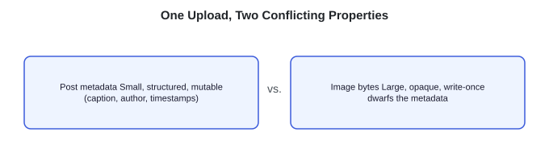

> **Key idea.** Split the small mutable record from the large immutable blob; the feed is a standard fan-out (one post copied to many followers' timelines), the media pipeline is the real design.

## Key concepts

### Metadata and media, split

Post records — small, structured, queried many ways — live in a sharded database. Image bytes — large, opaque, write-once — live in an object store behind a CDN. The post row holds only a reference to the media, never the bytes.

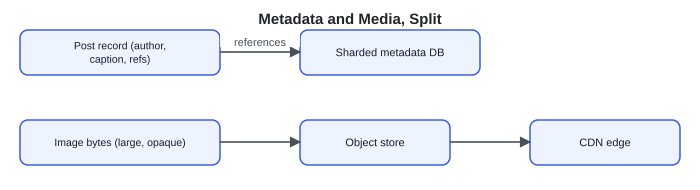

### Pre-signed direct upload

The app server issues a short-lived pre-signed URL; the client `PUT`s the bytes directly to the object store. The app tier never proxies the hundreds of terabytes a day of image data — it only mints URLs and writes small post rows.

**high-volume byte path**

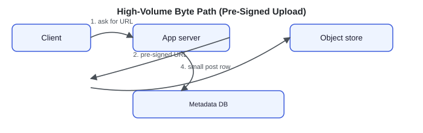

What makes that direct upload *safe* is what the URL actually authorizes. To mint it, the app server first fixes the post's identity — `media_id = abc`, object key `users/42/media/abc/original` — then asks the object store to sign a token granting exactly one request: a `PUT` to *that key*, with a set `content-type` and a `max-size`, expiring in (say) 10 minutes. The store re-checks the signature when the bytes arrive and rejects anything that does not match — a different key, a bigger body, the wrong method, or an expired token. The client uploads its own bytes without ever holding store credentials, and cannot write to another key or reuse the URL after it expires.

*Sequence diagram:* App server → Object store: "sign PUT for key `users/42/media/abc/original`, type + max-size, expiry 10m" → pre-signed URL; App server → Client: "hand URL to client"; Client → Object store: "PUT bytes to that URL" → "accept only if key, type, size, time match, else reject".

### Asynchronous transcode

Resizing a photo into its variant set is slow, so it cannot block the upload response. The blob-store upload fires an event onto a queue; a worker pool generates the variants (thumbnail through full size), writes them back, and flips the post from `processing` to `visible`. The post appears once its variants exist.

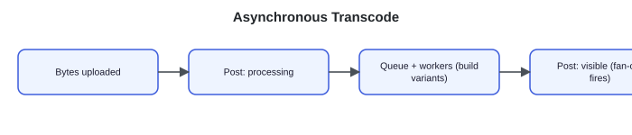

### Durability with erasure coding

A lost photo cannot be re-derived, so the origin store needs many-nines durability without the cost of keeping three full copies. **Erasure coding** splits each blob into, say, 10 data shards plus 4 *parity* shards (redundant pieces computed from the data), and spreads all 14 across different disks and zones. Any 10 of the 14 are enough to rebuild the original, so the store tolerates losing 4 shards at once — at 1.4× storage (14 ÷ 10), versus 3× for keeping three whole copies.

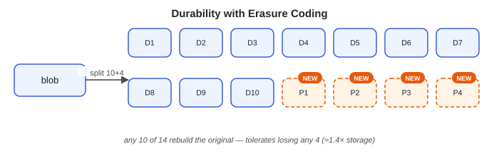

### CDN delivery

Images are served from CDN edge caches keyed by an immutable, **content-hashed URL** — the URL embeds a hash of the bytes, so it changes whenever the image changes and can therefore use a long cache lifetime. A viral photo is served from the edge and hits the origin roughly once per edge location — the structural fix for hot media.

**Hit-rate widget (default values shown):**

| Input | Default |
|---|---|
| Image reads | 250K/s |
| Edge cache hit-rate | 95% |
| Edge locations (POPs) | 100 |

**Results ("Reads served at the edge: 95%"):**

| Output | Value |
|---|---|
| Served from edge | 238K/s (95% of reads) |
| Reaches origin | 13K/s (5% miss) |

Formula: `origin = 250K/s × 5% miss = 13K/s — a hot object misses only ~once per 100 POPs`. Because each image has an immutable URL, it caches at the edge forever, so the origin sees only the 5% miss — a viral photo hits storage about once per edge location, not millions of times.

### Feed fan-out of references

The timeline is a fan-out problem, like any text feed, with one simplification: it stores **post ids, never bytes**. A post from a high-follower account is a cheap id write, and the expensive image is fetched once from the CDN no matter how many feeds reference it.

> **Key idea.** Because media is separate, the feed moves only small ids — fan-out stays cheap and the bytes ride the CDN.

## 1. Requirements

> **Before reading on.** List the requirements, then name the one property you would never compromise and the one fact that drives every later decision. They are different here.

### 1.1 Functional requirements

- **Upload a photo** with caption and location; it becomes visible to followers once processed.
- **View a timeline** — recent posts from followed accounts, paginated.
- **View a profile** — a user's own grid of posts.
- **Follow / unfollow** an account, which changes what appears in the follower's feed.

Comments, likes, direct messages, and search are named and deferred.

### 1.2 Non-functional requirements

- **Upload durability** — a successful upload is not lost; many-nines on the media store.
- **View latency** — p99 to first image byte from the edge is the headline budget.
- **Upload latency** — the byte transfer is as fast as the network allows, since it goes direct to the blob store.
- **Availability** — reads stay up through component failure; the CDN absorbs origin outages.
- **Scale** — linear in users, uploads, and views by adding nodes and edges.

### 1.3 The constraint versus the property

**Durability is the non-negotiable property**: lose a user's photo and there is no re-deriving it, which is why the media store gets erasure coding and the original is written before anything else runs. **The media-to-metadata asymmetry is the fact that drives the design**: media outweighs metadata by roughly 4,200×, so bytes must bypass the app tier, processing must be asynchronous, and delivery must ride the edge.

> **Key idea.** Durability is the property you protect; the ~4,200× media-over-metadata asymmetry is the fact that forces direct upload, async transcode, and CDN delivery.

## 2. Back-of-the-envelope estimation

The estimate exists to show two things with numbers: media dwarfs metadata, and the CDN absorbs nearly all reads. The figures are illustrative anchors derived from the assumptions.

**Interactive calculator widget (default values shown):**

| Input | Default |
|---|---|
| Photos / day | 100M |
| Original size | 2 MB |
| Variants size | 1 MB |
| Durability factor | 1.4× |
| Views per upload | 50× |
| CDN cache-miss | 5% |
| Peak / average factor | 4× |

**Computed outputs:**

| Output | Value | Formula |
|---|---|---|
| Peak uploads | 5K/s | 100M ÷ 86,400 × 4 |
| Media stored / year | 153 PB | 420 TB/day × 365 |
| Peak image reads | 231K/s | served from the CDN edge |
| Origin reads after CDN | 12K/s | 5% miss reaches the blob store |

Formula shown: `media 420M MB/day vs metadata 100K MB/day → media ≈ 4200× larger`. Media outweighs metadata by roughly 1000×, and the CDN absorbs the reads so the origin sees a trickle. Almost every later decision traces to that split.

### 2.1 Uploads

At about 100M photos a day, `100M ÷ 86,400 ≈ 1,200 uploads/sec` on average, and a 4× peak factor gives roughly **5,000 uploads/sec** at peak. The request rate is moderate; the size of each photo is what drives capacity.

### 2.2 Media storage

Each photo is about 2 MB original plus ~1 MB of variants. So `100M/day × 3 MB = 300 TB/day` raw, and at a 1.4× erasure-coding overhead, about **420 TB/day** stored, or roughly **150 PB/year**. Metadata, by contrast, is `100M posts × ~1 KB ≈ 100 GB/day` — small next to the media. At 420 TB/day stored against 100 GB/day metadata, media dominates storage by roughly 4,200×, and that ratio is the reason for the split.

### 2.3 Reads

Reads run far ahead of writes — assume about 50× the upload rate. That is `1,200 uploads/sec × 50 ≈ 250,000 image GETs/sec` at peak. With a CDN hit rate around 95%, only `250,000 × 0.05 ≈ 12,000 GETs/sec` reach the origin. The vast majority are served from the edge and never touch the blob store.

> **Key idea.** Media is ~4,200× metadata and the binding storage cost; the CDN turns 250K reads/sec into ~12K origin reads/sec.

## 3. API design

**Design checkpoint:** *A client wants to upload a 4 MB photo. Should the bytes flow through your app servers to the object store, or should the client upload them directly?* Options: (a) *Bytes flow through the app server, which streams them to the object store*; (b) *The app server issues a pre-signed URL and the client PUTs bytes directly to the object store* — confirmed as (b) throughout the rest of the page.

The interface is a two-phase create: upload the bytes first, then create the post that references them. The feed returns post ids and media URLs, never bytes.

### 3.1 Request an upload URL

The app server mints a pre-signed URL and a `media_id`; the client uploads bytes to that URL directly.

`POST /v1/uploads` *(Request & response detail expandable in the live UI, not expanded here.)*

### 3.2 Create the post

After the bytes land, the client creates the post referencing the `media_id`. The post starts in `processing` and becomes visible when its variants exist.

`POST /v1/posts`

### 3.3 Read the feed and a profile

Both return ids and media URLs, paginated by an opaque cursor.

`GET /v1/feed?cursor={opaque}&limit=20`
`GET /v1/users/{id}/posts?cursor={opaque}`

> **Key idea.** Two-phase create — bytes direct to the store via a pre-signed URL, then a small post row that references the media id.

## 4. Data model

### 4.1 The post

A post is a small structured record, sharded by `user_id` so a profile grid is a single-shard read. Its `state` gates visibility until transcode finishes. Fields: `post_id`, `user_id`, `caption`, `location`, `created_at`, `state` (enum).

### 4.2 The media

Media is the bytes' metadata: the variant URLs, the original, and a content hash for deduplication (identical bytes hash identically, so a re-upload shares the same stored object instead of duplicating it). The bytes themselves live in the object store, keyed by that hash. Fields: `media_id`, `original_url`, `content_hash`, `thumb_url`, `url_240`, `url_640`, `url_1080`, `status` (enum).

### 4.3 The follow edge and placement

A follow is a directed edge, keyed by `(follower_id, followee_id)`. Posts and the graph live in the sharded metadata database; media bytes live in the object store keyed by content hash; the timeline is the feed service's materialized store, written by fan-out when a post becomes visible.

**ER-style**

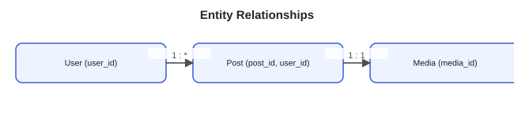

> **Key idea.** Small structured records go in the sharded database; opaque bytes go in the object store; the post row only references the media.

## 5. High-level design

> **Reading the diagrams.** Each step marks the components newly added at that step with a dashed outline and a **NEW** badge marking what changed from the previous step.

### 5.1 One server, one database

A client posts a photo to an app server, which writes a row; another client reads its timeline from the same server. Three failures appear the moment photos are large and the audience is global: multi-megabyte blobs flow through app servers into a row store; synchronous resizing blocks the response; and global viewers pull megabytes through a single-region origin.

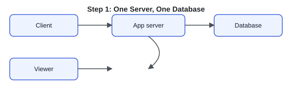

### 5.2 Fix 1: split metadata from media, upload direct

Bytes do not belong in a row store, and they do not belong flowing through the app tier. Move the bytes to an **object store** and let the client upload to it **directly** via a pre-signed URL. The app server only mints the URL and writes a small post record.

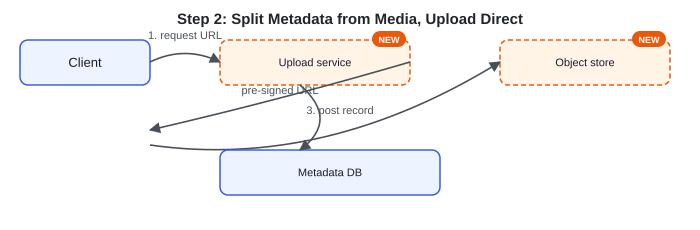

The app tier no longer proxies hundreds of terabytes. But the photo still needs its resolution variants, and generating them synchronously would block the upload for seconds.

### 5.3 Fix 2: transcode asynchronously

The upload to the object store fires an event onto a **queue**; a pool of **transcode workers** generates the variant set, writes the variants back, and flips the post from `processing` to `visible`. The user sees "processing" for a second or two; the upload response is not blocked by transcoding.

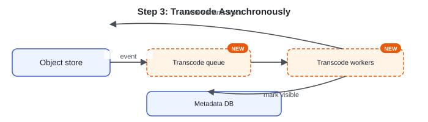

Now the post becomes visible without blocking. But a global audience pulling full images from a single-region origin would overwhelm it.

### 5.4 Fix 3: CDN delivery and feed fan-out

Put a **CDN** in front of the object store, keyed by immutable content-hashed URLs, so the origin is hit only on a cache miss. And when a post becomes `visible`, trigger **feed fan-out** — pushing the `post_id` (never bytes) into followers' materialized timelines.

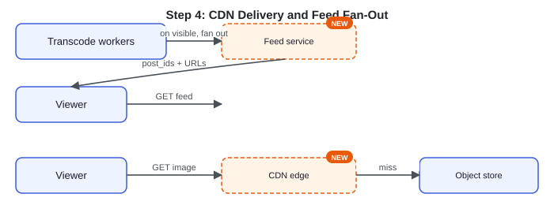

### 5.5 The composed upload-to-visible path

**Sequence diagram widget:** Client → Upload service: `request upload URL` (1) → `pre-signed URL + media_id` (2); Client → Object store: `PUT bytes` (3); Client → Upload service: `create post (processing)` (4) → Metadata DB: `write post row` (5); Object store → Transcode queue: `upload event` (6) → Transcode workers: `transcode job` (7) → Object store: `write variants` (8) → Metadata DB: `mark visible` (9) → Feed service: `fan out post_id` (10).

Each component answers a concrete failure: the blob store because images are huge and opaque, the pre-signed URL because the bytes cannot proxy through the app tier, the queue because resizing is slow, the CDN because a global audience would overwhelm one origin, and the feed service because materialized timelines let readers fetch ids cheaply while the bytes ride the CDN.

> **Key idea.** Each component answers one failure of the naive design: the blob store and pre-signed upload for the bytes, the queue for slow resizing, the CDN for global reads, and fan-out for cheap id-only feeds.

## 6. Deep dives

Three topics carry the design: the upload-and-transcode pipeline, feed generation, and media delivery and storage economics.

### 6.1 The upload and transcode pipeline

> **Before reading on.** What happens between "the client finished uploading bytes" and "the post is visible with every size"? If your answer is "resize it," name where, by whom, and what the user sees in the meantime.

Direct upload via the pre-signed URL keeps bytes out of the app tier — the capacity math makes it the right default at this scale. The upload event enqueues a transcode job; a worker pool generates the variant matrix, writes it back, and marks the post `visible`, at which point fan-out fires. The user sees a `processing` state for a second or two, not a blocked request.

**with a retry decision diamond**

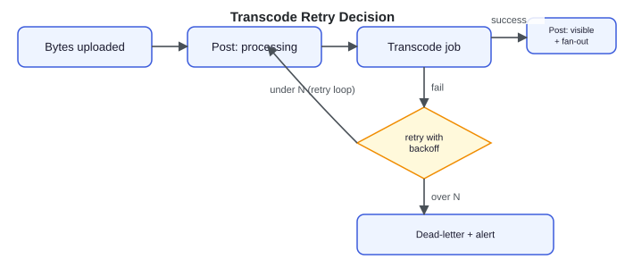

Two properties keep retries safe. Jobs are **idempotent**, keyed by `media_id` plus variant. Concretely: the queue delivers the transcode for `media_abc` twice (at-least-once delivery is normal). Both jobs build the 640px variant and write it to the same deterministic key `media/abc/640.jpg`, so the second overwrites identical bytes — no duplicate object, no second row — and each marks the post `visible` only once *all* required variants exist, so the two deliveries converge on one end state instead of racing to create two.

Content-hashing the original **deduplicates identical re-uploads** across users. If User A and User B upload the exact same bytes, both produce the same content hash `h123`; the original is stored once under a hash-keyed path like `sha256/h123`, and both users' `Media` rows reference that single object. Two posts, one stored blob.

A failed transcode retries with backoff and, after N attempts, dead-letters and alerts. The original bytes stay durable throughout, so the post is delayed, not lost.

**What separates answers — the pipeline:**
- **Bad** — Synchronous inline resize on the app server
- **Good** — Queue + workers, async, visible after
- **Great** — Idempotency, content-hash dedup, dead-letter, processing state

### 6.2 Feed generation

> **Before reading on.** The timeline is assembled from a high-fan-out write. What makes it *cheaper* to assemble here than for a text feed?

The timeline is a **fan-out** problem. When a post turns visible, push its `post_id` into the materialized timelines of normal accounts; for accounts with large followings, skip that write and pull their recent posts at read time; skip users who are inactive. Concretely, an account with 2,000 followers gets **push** fan-out — its `post_id` is written into 2,000 timelines, cheap because it is one small id each. A celebrity with 50 million followers is the opposite — writing 50M timelines per post is wasteful, so the system keeps the post only in the author's own timeline and **merges it in at read time** when a follower opens their feed. Followers who haven't opened the app in weeks are skipped until they return. Ranking is a fork: chronological is a cheap timeline merge, while ML ranking holds the timeline as candidates and scores them per reader at read time. Why push and pull are coupled, and where the threshold between them sits, is worked out in full in the [News Feed](https://systemdesignschool.io/problems/news-feed/solution) design.

**Push/hybrid toggle widget (same widget as the News Feed design):** tabs "Pure push" / "Hybrid (T = 100K)"; slider "Producer followers: 6K"; readouts "Strategy for this author: Push on write", "Timeline writes per post: 6K" — "Push copies this post into 6K timelines at write time, so reads stay cheap."

What makes it cheaper here is the split: because the feed stores ids and the bytes live in the object store, a post from a high-follower account is a tiny id write, and the expensive image is fetched once from the CDN regardless of how many feeds reference it.

> **Strong-answer criteria.** Recognizing the timeline as a fan-out problem, applying hybrid fan-out over post ids, and explaining that the metadata/media split is what keeps fan-out cheap.

### 6.3 Media delivery and storage economics

> **Before reading on.** A viral photo is requested tens of millions of times. How many times does it hit your storage? If the answer is not "roughly once per edge location," your delivery design is missing the CDN.

Because each image has an immutable, content-hashed URL, it is cacheable with a long TTL. A viral photo is served from edge caches and hits the origin about once per edge location per TTL — the structural fix for hot media, the same hot-key pressure a feed solves with a replicated cache, here solved by the CDN tier. This also sets the limit of the availability promise: during an origin outage, anything already cached at an edge keeps serving, but a **cold, uncached** photo — its first request anywhere — has nothing to fall back to and fails or degrades until the origin returns. CDN-fronting buys read availability for popular media, not for the cold tail.

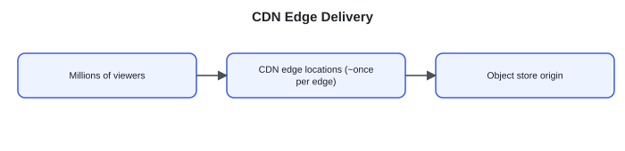

Storage is the cost center, so its economics are first-order. The origin uses the **erasure coding** from Key concepts (around 1.4× overhead) or cross-zone replication for many-nines durability at far less cost than keeping three full copies — the reason large media stores erasure-code the cold majority of blobs rather than replicating them whole.

Variants are a build-versus-serve trade: pre-generate the common sizes (storage cost, instant serve) and resize the long tail on demand (compute cost, slower first request). Aged photos, rarely viewed, tier down to cheaper cold storage with a slower first byte, keeping the hot tier small.

| Cost lever | Cheaper choice | Costlier choice |
|---|---|---|
| Origin durability | erasure coding, ~1.4× overhead | full replication, ~3× |
| Variants | resize the long tail on demand (compute) | pre-generate every size (storage) |
| Aged media | cold tier, slower first byte | keep everything in hot storage |

**What separates answers — delivery and storage:**
- **Bad** — Serve images from the origin directly
- **Good** — CDN in front, immutable URLs, durable origin
- **Great** — Erasure coding, pre-generate-hot vs resize-cold, cold tiering

## 7. Variants

For **global delivery**, home each blob in its author's region and replicate read-only copies elsewhere, with the CDN serving every region from the nearest edge. The metadata database shards and replicates per region; the feed stays regional. A cross-region viewer sees a new post a few hundred milliseconds later — an explicit trade-off of this design.

For an **ML-ranked feed**, the timeline becomes a candidate set scored per reader at read time, the same read-path shape the News Feed design builds — the media path is unchanged, since ranking reorders ids and the bytes still ride the CDN.

For **storage at 10× scale**, the 150 PB/year becomes the dominant bill, so cold-tiering and the erasure-coding scheme stop being details and become the cost levers that decide the architecture's economics.

> **Key idea.** The media path holds across regions and ranking changes; what flexes at scale is delivery topology and the storage-cost scheme.

## 8. The transferable pattern

Separate the small mutable record from the large immutable blob, and let each scale on its own axis. The post record is tiny, structured, and queried many ways, so it belongs in a sharded database. The image is huge, opaque, and write-once, so it belongs in an object store behind a CDN.

After this split, the rest follows: uploads bypass the app tier with a pre-signed direct write, processing decouples behind a queue, delivery rides the edge with immutable URLs, and the feed becomes a fan-out of references rather than bytes. The same metadata/blob split recurs in any system that mixes records and media — chat attachments, document stores, audio and video platforms, ad creatives. With the split, "design Instagram" becomes "a known feed problem plus a media pipeline."

## Review: the 30-second answer

- **Split metadata from media.** Small post rows in a sharded database; image bytes in an object store behind a CDN.
- **Upload direct to the blob store** via a pre-signed URL — bytes never touch the app tier.
- **Transcode asynchronously.** A queue and worker pool build the variants; the post turns visible when they exist.
- **The feed is a fan-out of post ids** — push to normal accounts, pull from large ones — never bytes.
- **Serve images from the CDN edge** by immutable URL; the origin is hit only on a cache miss.

## Quiz

**Quiz widget** ("Instagram Design Quiz", "Hide All" / "Reveal All" toggle) — 7 questions, each with a "Show/Hide Answer" button. Full text of every question and its revealed answer:

**1) Why split metadata from media instead of storing images in the database?**
Image bytes are large, opaque, and write-once, while post records are small, structured, and queried many ways — and media outweighs metadata by roughly 4,200×. Putting bytes in a row store would bloat it and force scaling the database for raw size. The split sends bytes to an object store behind a CDN and keeps only a small reference in the sharded database, so each scales on its own axis.

**2) Why upload bytes directly to the object store via a pre-signed URL?**
At hundreds of terabytes a day, proxying every byte through the app tier would force you to scale app servers for bandwidth rather than request logic. A pre-signed, short-lived, scoped URL lets the client PUT bytes straight to the object store while the app server stays in the control plane — minting the URL and writing a small post row. The capacity math makes direct upload the right choice at this scale.

**3) Why is transcoding done asynchronously, and what does the user see meanwhile?**
Generating the resolution variants is slow, so doing it inline would block the upload response for seconds. Instead the upload fires an event onto a queue, a worker pool builds the variants and flips the post from processing to visible, and fan-out fires on visible. The user briefly sees a processing state rather than a stalled request, and the pipeline degrades to slower rather than lost.

**4) Why must transcode jobs be idempotent, and how is that achieved?**
Queues deliver at least once, so a job can run more than once after a retry or duplicate. Keying each job by media_id plus variant makes a re-run overwrite the same output rather than produce duplicates, and content-hashing the original deduplicates identical re-uploads. Because the original bytes are already durable, a failed job retries with backoff and dead-letters after N attempts without losing anything.

**5) How does the CDN keep a viral photo from overwhelming the origin?**
Each image has an immutable, content-hashed URL, so it is cacheable with a long TTL at the edge. A photo requested tens of millions of times is served from edge caches and reaches the origin only about once per edge location per TTL. That reduces origin load from many requests to a small number of cache misses, the structural fix for hot media.

**6) Why is fan-out cheap here compared to a text feed, and what does the timeline store?**
The timeline stores post ids, never image bytes. Because the heavy media lives in the object store and is fetched once from the CDN regardless of how many feeds reference it, pushing a post into millions of follower timelines is millions of small id writes. The feed itself reuses the News Feed hybrid — push to normal accounts, pull from celebrities — so the only new work is the media pipeline.

**7) How does erasure coding help media storage, and why does it matter here?**
Erasure coding stores a blob plus parity so it survives disk and zone failures at a modest overhead (around 1.4×), far cheaper than keeping three full copies for the same durability. Since media is the dominant storage cost — on the order of 150 PB/year — the durability scheme is a real cost lever, not a detail. Pre-generating hot variants and cold-tiering aged photos further control that bill.

## Sources and further reading

- [Sharding & IDs at Instagram — Instagram Engineering](https://instagram-engineering.com/sharding-ids-at-instagram-1cf5a71e5a5c) — how Instagram shards its metadata store and generates sortable, time-ordered ids across shards (the `post_id` and sharded-DB choices in the data model).

---

### System Design Master Template (embedded video)

YouTube embed: https://www.youtube.com/embed/OWVaX_cBrh8?si=MAfaQS1TV1r7USUI

### Comments

No comments were posted under this lesson as of scrape date — the section shows an empty "Comments" / "Write a comment..." / "Post" prompt only.

---

## Assets

No downloadable diagram image files exist on this page — every diagram (the metadata/media split, the pre-signed upload sequence, the transcode pipeline, the erasure-coding diagram, the CDN hit-rate widget, the composed sequence diagram, and the deep-dive figures) is a live JS/SVG widget, fully transcribed above as text. There is no meaningful `` content on this page beyond the site's decorative header logo, which is cosmetic and carries no article content.
