# Design a Distributed Key-Value Store

Source: https://systemdesignschool.io/problems/distributed-kv-store/solution

> Note on fidelity: like the rest of the site, this page is built mostly from JS-interactive pieces (a quorum R/W/N interactive widget, tabbed diagram steps, a design-checkpoint multiple-choice widget, expandable API request/response bodies, and a quiz with click-to-reveal answers) rather than static images. Everything behind those interactions — the diagram box/arrow labels, the data-model field list, all three API request/response bodies, and all five quiz answers — was expanded live in the browser (via "Reveal All" and the request-response toggles) and is transcribed below as text, in the same order it appears on the page. There are no downloadable diagram image files on this page (every diagram is a live JS/SVG widget, not an ``), so no image assets exist to save.

Tags: Hard difficulty · Consistent hashing · Quorum · Replication · Conflict resolution · Availability

---

## Problem statement

Design a horizontally-scalable key-value store — `get(key)` / `put(key, value)` — that stays available and low-latency while spread across hundreds of nodes and multiple datacenters. It must survive node and network failures without downtime, scale storage and throughput by adding machines, and offer a *defensible* answer to "what does a read return after a write that raced a partition?"

This is the Dynamo / Cassandra / Riak lineage — a **leaderless** store (no single node orders writes; any node can accept one) that is **eventually consistent**, with consistency **tunable per request** (each call chooses how many replicas must agree). In scope: spreading keys and their replicas across nodes, reads and writes that stay available during failures with per-request consistency, reconciling versions that diverged, recovering after a node was unreachable, tracking cluster membership, and the on-disk storage engine. Out of scope: secondary indexes and range scans, rich schemas, single-leader strong-consistency designs, and multi-key transactions.

## Clarifying questions

Each answer changes the design, so state it and the assumption it fixes.

- **What's the consistency contract?** Strong (linearizable), read-your-writes, or eventual — the first decision to settle, because it reshapes everything.
- **Read/write ratio and absolute QPS?** Determines whether a leaderless quorum design (each read or write waits for a configured number of replicas) or a leader-based design fits.
- **Value size and shape?** Opaque blobs of a few KB versus large objects reshape the storage engine and the network math.
- **Single region or global?** Multi-region forces a stance on cross-region lag and conflicts.
- **Is the data conflict-mergeable?** Shopping carts (mergeable) versus account balances (not) demand different conflict resolution.
- **Durability bar?** Whether writes must hit disk before acknowledgment — sets `W` and the durability promise.

## What makes this problem distinctive

A single-leader database provides strong consistency but loses write availability when the leader's side of a partition can't reach a quorum. This design takes the opposite tradeoff: it must stay **writable under partition**, and that one choice shapes everything else.

Because there is no leader to order writes, any node can accept one, and divergence becomes inevitable — two replicas can take conflicting writes during a partition, and the system must heal them afterward rather than prevent them. So the work is a set of **tunable parameters and what each one costs**: how many replicas must answer a read or write (trading consistency for availability), how the store reconciles two versions that disagree, and how replicas catch up after a node was unreachable. The Key concepts section names and teaches each mechanism; here the point is only that a leaderless, partition-tolerant store turns those into explicit dials.

**Two writes during a partition**

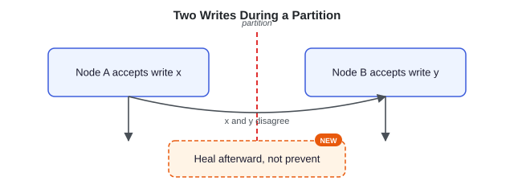

> **Key idea.** Staying writable under partition forces leaderless coordination, quorum instead of consensus, and conflict resolution to reconcile the divergence that follows.

## Key concepts

This section covers the concepts needed to solve this problem — prerequisites for the design work that follows.

### Partitioning and consistent hashing

Keys sit on a **consistent hash ring**. Each physical node owns many **virtual nodes** (hundreds of small arcs), which smooths load and spreads a failed node's share across many neighbors. A key's value is stored on the next **N** distinct physical nodes clockwise (N is the replication factor, set per the quorum numbers below) — its **preference list**.

**ring placement**

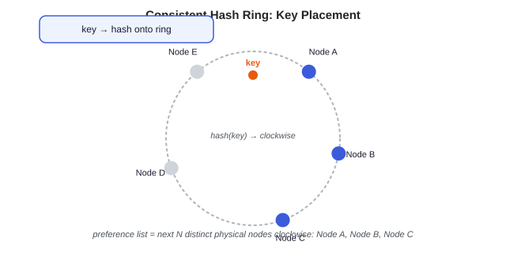

> **Virtual nodes.** Each physical machine is placed at many points on the ring rather than one, so load is even and a node's keys redistribute across many others when it leaves — not all onto one neighbor.

### Quorum: R, W, and N

Three tunable numbers: **N** replicas per key, **W** acks to commit a write, **R** replicas read. The invariant **`R + W > N`** guarantees the read and write sets overlap by at least one node, so a read reaches a node that saw the latest committed write. The accompanying widget shows how the three numbers interact.

**Interactive quorum widget (default values):**

| Slider | Default |
|---|---|
| N — replicas per key | 3 |
| W — acks to commit a write | 2 |
| R — replicas read | 2 |

Visualization: write set (W of N) shown blue, read set (R of N) shown separately; overlaps if R + W > N. Computed readouts: "R + W vs N" → "2 + 2 > 3" ("read sees the latest write"); "Write availability" → "1 node down" ("still commits with W=2"). Caption: "R + W = 4 > N = 3 → sets overlap by ≥ 1 node; reads tolerate 1, writes tolerate 1 down."

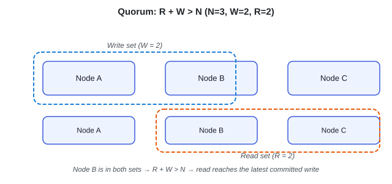

`R + W > N` guarantees the read and write sets share a node, so a read reaches one that saw the latest committed write. It is **not linearizability** — two concurrent writes can both reach W and conflict; overlap detects the divergence, it doesn't prevent it.

### Vector clocks and conflict

Each write carries a **vector clock** — a `{node → counter}` map of who has updated this key, and how many times. Comparing two clocks, the store asks: does one hold every counter of the other at an equal-or-higher value? If yes, that version **descends from** (is strictly newer than) the other — a clean winner. If each has a counter the other lacks, they are **concurrent** — neither is newer — and both come back as **siblings** for the application to merge.

Consider an example. The key starts empty. Node A takes a write and stamps it `{A:1}`. A partition splits the cluster, so node B never sees A's write and stamps its own write `{B:1}`. The partition heals; a reader fetches the key and gets both `{A:1}` and `{B:1}`. Neither clock contains the other's counter, so they are concurrent — the store returns the pair. The app merges them (for a shopping cart, the union of items) and writes the result back stamped `{A:1, B:1}`. That clock descends from both siblings, so on the next read it cleanly supersedes them.

**vector clock example (sequence: Node A, Node B, Reader/app)**

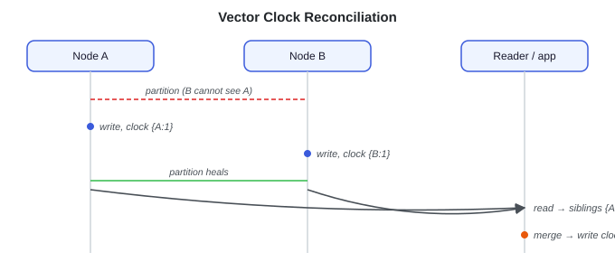

### Hinted handoff

If a preference-list node is briefly down, the node handling the request (the **coordinator** — any node can serve this role, covered in the High-level design section) writes to the **next healthy node** instead, tagged with a **hint** naming the intended home; when the home recovers, the holder hands the data back. This keeps `W` satisfiable during a transient failure — availability over strict placement.

**hinted handoff**

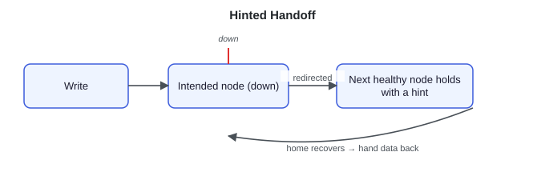

### Merkle-tree anti-entropy

For permanent divergence, each node keeps a **Merkle tree** over each key range: every key-value hashes to a leaf, each parent hashes its two children, up to a single root. Two replicas compare their roots. Equal roots mean every leaf underneath matches — the whole range is in sync after one comparison. If the roots differ, the replicas descend only into the child whose hash differs, halving the search at each level until they reach the one leaf — the one key — that diverged, and ship only that.

For four keys `a, b, c, d`, suppose only `c` differs between the two replicas. The roots differ, so the replicas compare the two halves: the `(a,b)` subtree hashes match and are skipped whole, while the `(c,d)` subtree differs. They recurse into it, find `c`'s leaf differs and `d`'s matches, and transfer just `c`. A range of millions of keys collapses to a few hash comparisons plus the single key that was actually out of sync.

**Merkle tree walk**

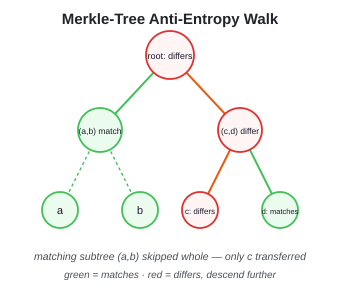

### Gossip membership

Nodes exchange ring state and liveness by **gossip**: on a timer, each node picks a few random peers and swaps its view of who is in the cluster and who looks alive. There is no central config service in the data path, so no single component's failure takes the cluster down. Convergence is the point. If node A marks C dead, that fact rides A's next gossip to B, B's to its peers, and within a few rounds — growing with the logarithm of cluster size — all nodes are aware. The tradeoff is flapping: a merely slow node can be gossiped as dead and then alive again, which is why liveness uses a suspicion window rather than acting on a single missed beat.

**gossip**

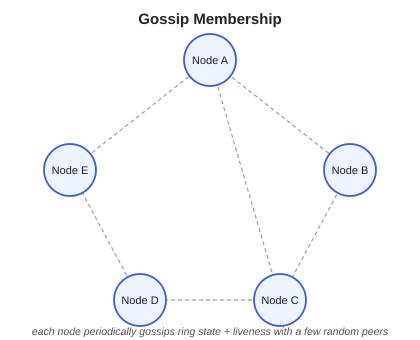

> **Key idea.** Consistent hashing places and replicates keys; `R + W > N` tunes consistency; vector clocks, hinted handoff, Merkle trees, and gossip keep replicas converging without a leader.

## 1. Requirements

> **Before reading on.** List the requirements, then name the property you would never compromise and the constraint that drives the design.

### 1.1 Functional requirements

- **`get(key)`** — returns the value(s); may return multiple conflicting versions to reconcile.
- **`put(key, value, context)`** — `context` carries the version (vector clock) the write is based on.
- **`delete(key, context)`** — a write of a tombstone, not an erase.
- **Tunable per-request consistency** (`R`, `W`).

### 1.2 Non-functional requirements

- **Availability** — write availability is the primary requirement; the cluster keeps accepting writes through expected partitions and node loss.
- **Latency** — low single-digit-millisecond `get`/`put` in region at the chosen quorum.
- **Scale** — linear: double the nodes, double capacity and throughput, no global rebuild.
- **Durability** — a successful `put` survives a bounded number of node failures, set by the replication factor `N` and write quorum `W`.
- **Partition tolerance** — mandatory; the real choice is availability-vs-consistency *during* a partition.

### 1.3 The constraint versus the property

**Write availability under partition is the property to protect**: the store must accept writes even when nodes can't all reach each other — which is the whole reason it is leaderless and quorum-based rather than consensus-based. **Conflict-free reconciliation is the constraint that shapes the design**: because divergence is now inevitable, every later choice — vector clocks, hinted handoff, Merkle anti-entropy — exists to detect and resolve it without losing writes.

> **Key idea.** Protect write availability under partition; design around reconciling the divergence that leaderless writes make inevitable.

## 2. Back-of-the-envelope estimation

The numbers set storage per node and the physical read/write amplification from replication and quorum. Illustrative anchors.

### 2.1 Storage

10 billion keys × ~1 KB = **10 TB** raw; at replication factor N=3, **30 TB** total; across 100 nodes, **~300 GB per node**.

### 2.2 Read and write amplification

A target of **500K `put`/sec** fans out to N=3 replicas — **1.5M physical writes/sec**, ~15K per node. A target of **2M `get`/sec** at R=2 is **4M physical reads/sec**, ~40K per node. Skew means a hot key can pin a preference list, so size each node for several times the average and have a key-level mitigation (hot partitions are covered under Failure handling, §6.3).

> **Key idea.** Replication multiplies physical writes by N and quorum multiplies reads by R; size per-node for that amplification plus hot-key skew.

## 3. API design

**Design checkpoint widget:** *"Key concepts showed a get returning sibling versions for one key. At the API level, how does the caller's merged write tell the store which versions it resolved?"* Options: (a) *The write carries no version information — the store infers it from timestamps*; (b) *The write includes the same opaque context the get returned, so the store can supersede exactly those siblings*. (Confirmed correct by the page's own "Key idea" below §3: the `put` returns the context to say "this descends from that version" — option (b).)

Three operations, with the `context` (a serialized vector clock) load-bearing.

### `get(key)`

**Request & response (expanded):**

Response body:
```
{ versions: [ (value, context), ... ] }
```

### `put(key, value, context)`

**Request & response (expanded):**

Response body:
```
ok // context = the version this write descends from
```

### `delete(key, context)`

**Request & response (expanded):**

Response body:
```
ok // writes a tombstone
```

> **Key idea.** `get` may return multiple versions plus a context; `put` returns that context to say "this descends from that version"; a delete is a tombstone write.

## 4. Data model

### 4.1 The stored record

A record is opaque key/value plus the version that makes conflict resolution possible and a tombstone flag for deletes.

**Record schema**
```text
Record {
  bytes key
  bytes value
  VectorClock version
  bool tombstone
}
```

The `key` determines placement via consistent hashing — it selects the preference list. The `value`, `version`, and `tombstone` travel together as the replicated payload. Vector clocks let replicas distinguish descendant from concurrent writes; deletes write a tombstone rather than erasing bytes, so an anti-entropy sync can't resurrect a deleted key.

> **Key idea.** Opaque key/value plus a vector-clock version and a tombstone; the key picks the preference list, the rest replicates together.

## 5. High-level design

The design is built up incrementally: each step below fixes a concrete failure of the one before it.

> **Reading the diagrams.** Each step marks the components newly added at that step with a dashed outline and a **NEW** badge.

### 5.1 Partitioning and replication

Place keys on a consistent hash ring with virtual nodes; replicate each key to the next N distinct physical nodes clockwise (its preference list). Adding a node moves only about one node's share of keys — roughly `1 / (number of physical nodes)` of the total — so it is linear scaling with no global rebuild.

**step 1**

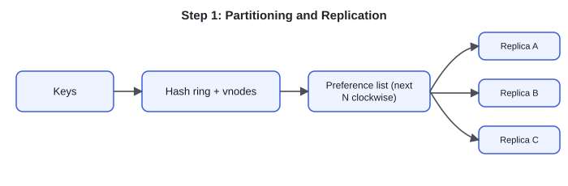

Placement now tells anyone which N nodes hold a key, but nothing yet says who accepts a request and talks to those replicas. A single fixed owner per key would be a leader — and a leader on the wrong side of a partition stops accepting writes, which is exactly the failure this design must avoid.

### 5.2 Fix 1: leaderless coordination

Any node is a **coordinator**: it computes the key's preference list and forwards the `get`/`put` to the N replicas. No leader means no single point that loses write availability under a partition.

**step 2**

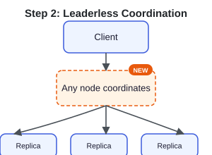

Any node can coordinate, but the coordinator still has to decide how many of the N replicas must respond before it answers the client. Wait for all N and a single slow or unreachable replica blocks every request; wait for just one and a read can miss a write that already landed elsewhere.

### 5.3 Fix 2: quorum reads and writes

The coordinator waits for **W** write acks or **R** read responses before replying. `R + W > N` makes the read and write sets overlap, so a read reaches a node that saw the latest committed write — modulo concurrent writes, which surface as conflicts.

**step 3**

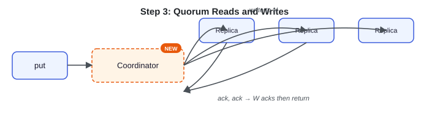

Quorum overlap assumes the coordinator knows which nodes are alive and which arc each one owns — that view has to come from somewhere, and a central registry would be the same single point of failure the design is trying to avoid. Each node also still needs a way to store its share of keys that keeps up with a write-heavy, always-available workload.

### 5.4 Fix 3: membership and storage

Nodes **gossip** ring state and liveness — no central config in the data path. For on-disk storage each node runs an **LSM tree** (log-structured merge tree), the engine built for the write-heavy, write-available workload.

It works by never updating data in place. A `put` appends to a write-ahead log and goes into an in-memory table (the **memtable**); when that fills, it is flushed to disk as an immutable sorted file, an **SSTable**. Writes are therefore sequential appends rather than in-place random-disk updates. The cost lands on reads: a key may live in the memtable or any of several SSTables, so a `get` could have to check them all. This is bounded by two mechanisms. The SSTables are sorted, and each carries a **Bloom filter** — a tiny probabilistic index that answers "is this key *definitely not* here?" in one cheap check. A `get` for `user:42` consults each file's Bloom filter; the two that answer "definitely not" are skipped without a disk read, and only the one that answers "maybe" is opened. Background **compaction** merges SSTables over time so the number to check stays small.

**LSM storage engine**

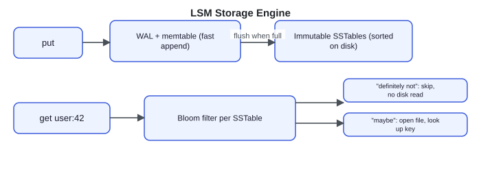

> **Key idea.** Each decision serves the write-available-under-partition goal: ring placement and replication, leaderless coordination, quorum overlap for consistency, and gossip + LSM for membership and storage with no central point.

## 6. Deep dives

### 6.1 Quorum and tunable consistency

> **Before reading on.** With N=3, what do R=2, W=2 buy you, and why is `R + W > N` still not the same as linearizability?

`R + W > N` is the core quorum condition: it guarantees the read and write sets overlap by a node, so a successful read reaches one that saw the latest *committed* write. The common default `W=2, R=2` (with N=3) gives read-your-writes and survives one node down; `W=3, R=1` makes durable writes and fast reads but blocks writes if any replica is down; `W=1, R=3` flips it. But overlap is **not linearizability**: two clients writing concurrently can each satisfy `W` and both "win" on different nodes — the overlapping read *sees* both (a conflict), it doesn't prevent the divergence. True linearizability needs consensus per key, which surrenders availability on the minority side of a partition.

**quorum overlap**

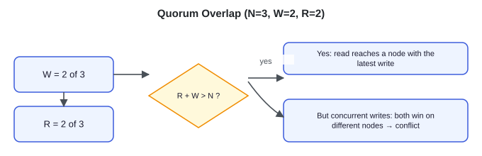

**What separates answers — quorum:**
- **Bad** — R=W=N for strong consistency
- **Good** — R=W=2, explains overlap
- **Great** — Tunes per workload; overlap ≠ linearizability

### 6.2 Conflict resolution

> **Before reading on.** Two replicas accepted a write to the same key during a partition. On heal, which value survives — and what does the wrong choice cost?

**Last-write-wins** tags each write with a timestamp and keeps the highest — a common default, but it **silently drops the losing write** and depends on synchronized clocks; fine for "user theme preference," but it loses data for accumulating values like "items in cart." **Vector clocks** keep causal history, so a clean descendant wins and genuinely **concurrent** writes are returned as **siblings** the application merges (union the carts) — so the store does not discard either version before the merge, at the cost of merge logic and clocks that grow with coordinators. **CRDTs** make the value type conflict-free by construction (grow-only sets, counters) so merges are automatic — useful when the data model supports automatic merges.

**three conflict-resolution strategies**

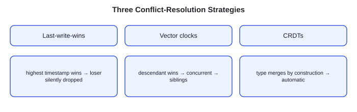

**What separates answers — conflict resolution:**
- **Bad** — Last-write-wins, no mention of what's lost
- **Good** — Vector clocks, names the concurrent case
- **Great** — Per data type; LWW clock-skew failure called out

### 6.3 Failure handling

> **Before reading on.** A replica is briefly unreachable, then later one is gone for hours. These are different failures needing different repairs — what are they?

**Transient** failure uses a **sloppy quorum**, backed by the hinted handoff from Key concepts. A sloppy quorum is the write-acceptance policy: it counts a write as committed once any `W` *healthy* nodes ack it, even if some of those nodes are not on the key's preference list. Hinted handoff is the repair half — the off-list node that stood in for the down one hands its data back once the rightful owner recovers. Together, `W` stays satisfiable without waiting for the down node, and the data still ends up where it belongs. **Permanent** divergence uses **Merkle-tree anti-entropy**: replicas compare tree roots and walk only differing branches, transferring just the out-of-sync keys, so repair traffic is bounded to what actually diverged. **Hot partitions** are separate — a hot key pins one preference list, mitigated by raising its N, fronting it with a cache, or sharding a hot counter. And **membership flap** is detected by gossip in seconds; tune the failure detector so a slow node isn't wrongly declared dead, which would trigger needless data movement.

**two failure regimes**

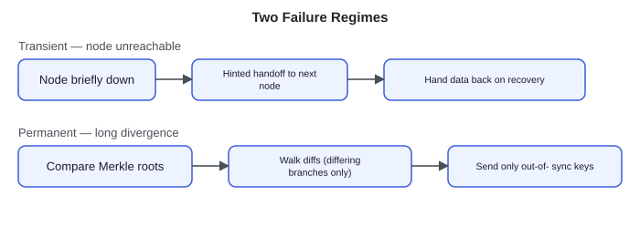

**What separates answers — failure handling:**
- **Bad** — We have replicas, no regime distinction
- **Good** — Hinted handoff + replica promotion + names re-sync
- **Great** — Two regimes, bounded repair, hot partitions separate

## 7. Variants

For **10× scale** (100B keys, multi-PB), node count grows an order of magnitude and the consistent-hashing math holds — per-node blast radius *shrinks*. Gossip overhead grows, so it becomes hierarchical; Merkle granularity gets finer; vector-clock truncation matters more.

For **multi-region**, cross-region replication is asynchronous — local writes commit first and propagate within seconds — giving **read-your-writes within a region, eventual across regions**. Strong cross-region consistency needs cross-region consensus (hundreds of ms), an optional per-table feature.

For **strong consistency**, layer a **consensus group (Raft/Paxos) per partition** to order writes for keys that need it — trading leaderless availability for linearizability only where mandated (the Cassandra-LWT / DynamoDB-transactions approach). The **storage engine** is LSM by default (sequential writes, Bloom-filtered reads); a B-tree inverts the tradeoff toward reads.

> **Key idea.** Consistent hashing carries the design to 10×; multi-region is async with regional read-your-writes; strong consistency is an optional per-key consensus layer.

## 8. The transferable pattern

A distributed KV store is **a sequence of independent choices about how much coordination to pay for**. Partitioning, replication, quorum, and conflict resolution are each a distinct trade between consistency, availability, durability, and latency — and the whole system is defined by where each dial is set. With that framing, "design a database like Dynamo" becomes a set of explicit configuration choices rather than a single fixed design: `R + W > N` for read overlap, vector clocks or CRDTs for divergence, hinted handoff and Merkle trees for failure, gossip for membership. The same decomposition recurs in any partition-tolerant distributed store — wide-column databases, object stores, even a cache that must survive partitions.

## Review: the 30-second answer

- **Partition** the keyspace with consistent hashing and virtual nodes; **replicate** each key to the next N distinct nodes (its preference list).
- **Leaderless, quorum reads/writes** where `R + W > N` gives read-your-writes overlap.
- **Favor availability over consistency** — stay writable during partitions and reconcile later with **vector clocks plus application merge**, or last-write-wins where a dropped loser is acceptable.
- **Transient failures → hinted handoff; permanent divergence → Merkle anti-entropy; membership → gossip.**
- **LSM storage** with Bloom filters for write-heavy throughput.

## Quiz

**Distributed Key-Value Store Design Quiz widget** ("Hide All" / "Reveal All" toggle) — 5 questions, each with a "Show/Hide Answer" button. Full text of every question and its revealed answer:

**1) What does R + W > N guarantee, and what does it not guarantee?**
It guarantees the read set and write set overlap by at least one node, so a successful read reaches a node that saw the latest committed write — that's read-your-writes-style overlap. It does not guarantee linearizability: two clients writing concurrently can each satisfy W and win on different nodes, and the overlapping read merely surfaces the conflict rather than preventing the divergence. True linearizability needs consensus per key.

**2) Why does a leaderless store distribute keys with consistent hashing and virtual nodes?**
Without a leader, any node must be able to locate a key's replicas, and the cluster must scale without a global rebuild. Consistent hashing maps keys and nodes onto a ring so a key's replicas are the next N nodes clockwise, and virtual nodes give each physical machine many small arcs — so load is even and a failed node's keys redistribute across many neighbors, with only roughly 1 / (number of physical nodes) of the total keys moving when a node joins or leaves.

**3) Why prefer vector clocks over last-write-wins for some data?**
Last-write-wins keeps the highest-timestamp value and silently discards the loser, which is fine for an idempotent field like a theme preference but catastrophic for accumulating data like a shopping cart — and it depends on synchronized clocks. Vector clocks track causal history, so a clean descendant wins and genuinely concurrent writes are returned as siblings the application merges, without the store silently discarding either concurrent version. CRDTs go further by making the value type merge automatically.

**4) How do hinted handoff and Merkle anti-entropy differ in what they repair?**
Hinted handoff handles transient failure: when a preference-list node is briefly down, the coordinator writes to the next healthy node tagged with a hint and the data is handed back on recovery, so writes stay available during a transient failure. Merkle anti-entropy handles permanent divergence: replicas compare tree roots and walk only the differing branches, transferring just the out-of-sync keys — bounding repair traffic to what actually diverged rather than the whole range.

**5) Why is this store kept available for writes under a partition rather than strongly consistent?**
The design's primary property is staying writable through partitions and node loss, which a single-leader strongly-consistent design can't do — it must reject writes when the leader's side can't reach a quorum. Going leaderless with quorum reads/writes keeps both sides of a partition writable and resolves the resulting divergence afterward with vector clocks or last-write-wins. Strong consistency is available as an optional per-key consensus layer where it's truly required.

## Sources and further reading

- [Dynamo: Amazon's Highly Available Key-value Store — DeCandia et al. (SOSP 2007)](https://www.allthingsdistributed.com/files/amazon-dynamo-sosp2007.pdf) — the origin of consistent hashing with vnodes, quorum R/W/N, vector clocks, hinted handoff, and Merkle anti-entropy.
- [Apache Cassandra — Dynamo-style architecture and consistency](https://cassandra.apache.org/doc/latest/cassandra/architecture/dynamo.html) — how a production store implements tunable consistency and gossip membership.
- [Impacts of changing the number of vnodes — The Last Pickle](https://thelastpickle.com/blog/2021/01/29/impacts-of-changing-the-number-of-vnodes.html) — practical effects of virtual-node count on load distribution and repair.
- [PACELC — Daniel Abadi](https://en.wikipedia.org/wiki/PACELC_design_principle) — the consistency-vs-latency trade even in the absence of a partition, the framing behind the quorum knobs.

---

