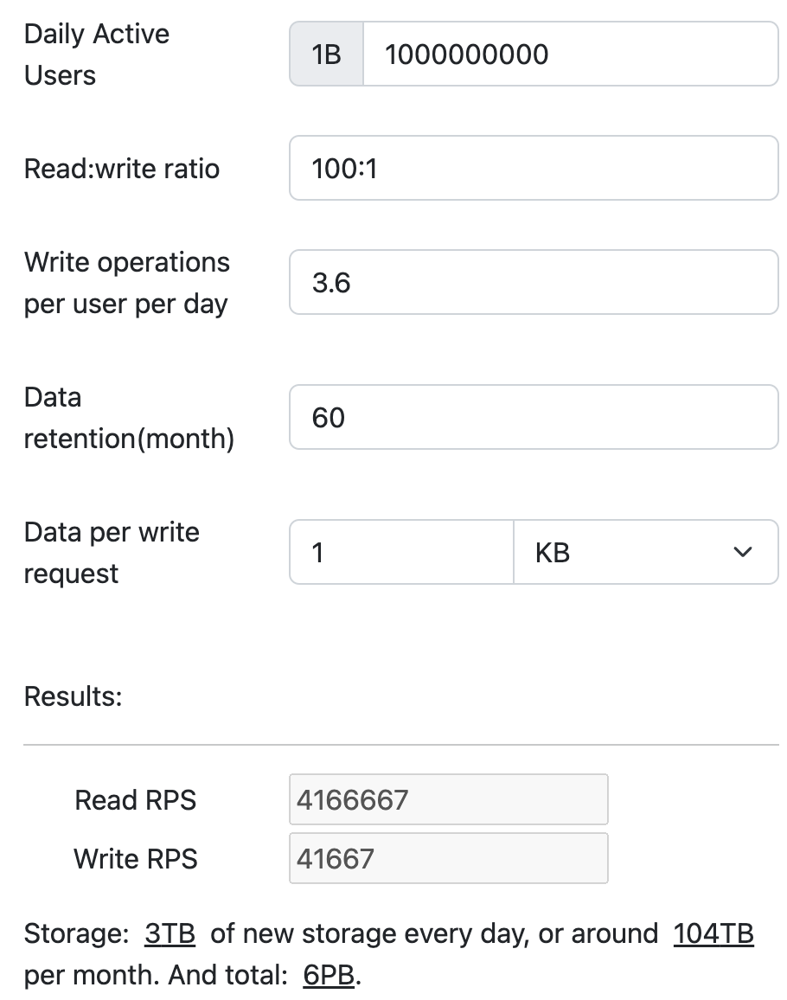
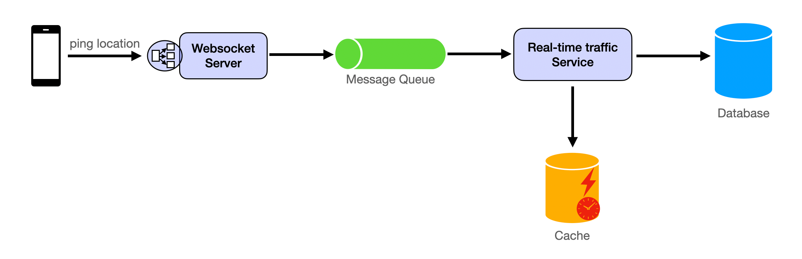
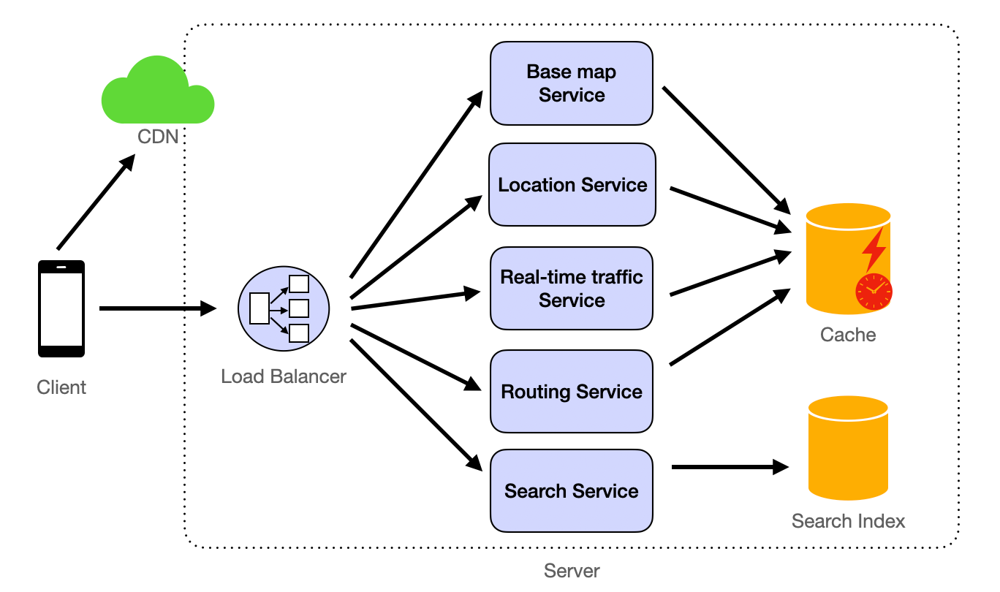
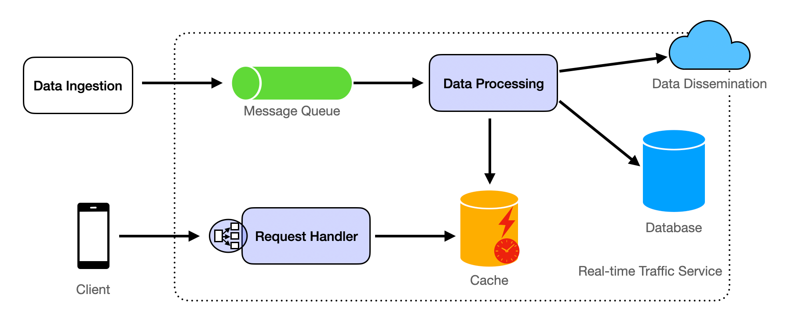
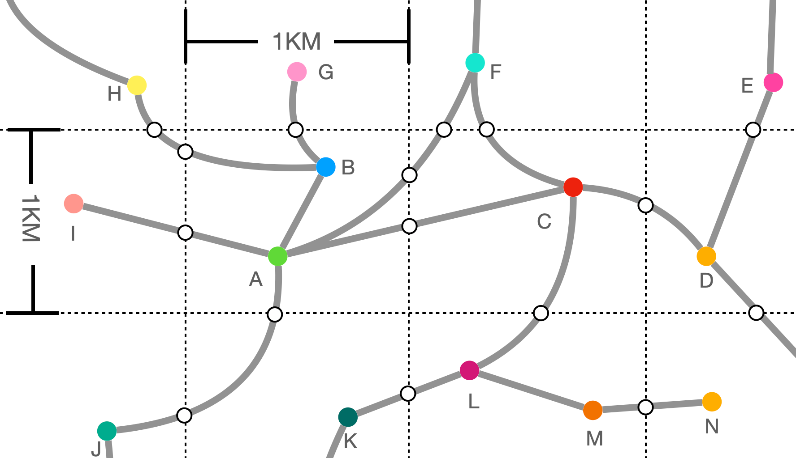
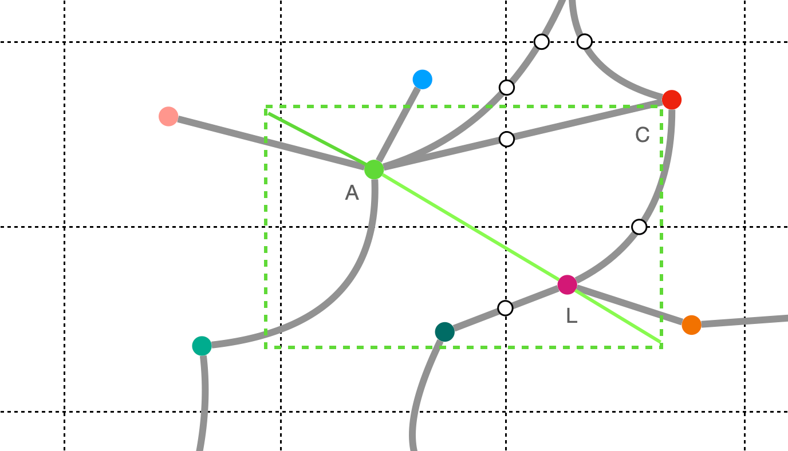

# Google Maps System Design

Source: https://systemdesignschool.io/problems/google-map/solution

> Note on fidelity: unlike the other three pages in this batch (web crawler, ad click aggregator, distributed key-value store), this page is built on the site's **older, plain-prose template** — real static screenshot images for every diagram (not live JS/SVG widgets), ordinary text sections, and no interactive sliders, tabs, "Before reading on" prompts, design-checkpoint widgets, or click-to-reveal quiz. There is also no Key Concepts section, no numbered "1. Requirements / 2. Estimation / ..." structure, no "Bad/Good/Great" rubric, and no quiz at all — this page simply doesn't have that content, not that it was hidden behind an interaction. One real gate was found: fetching this URL anonymously (outside the browser) stops mid-page with a "Login" prompt after an empty "Routing Service" heading, replacing the rest with generic filler about the site's general study-guide building blocks. The signed-in browser session used to research this page could see past that gate, so the "Routing Service" section and the "Follow up detailed design questions and answers" section below are included in full here. The images referenced below are real content screenshots (diagrams drawn by the article's author), described in place since they were not downloaded; the site does provide a "resource estimator" as a linked interactive tool, not an embedded widget.

Tags: (no explicit difficulty/topic tag chips shown on this page, unlike the other three)

---

## Problem intro

Designing a mapping service like Google Maps is a complex task that involves integrating massive amounts of multi-source data and processing real-time updates. The service should be able to load specified areas' streets and buildings, display real-time traffic conditions, search for streets, buildings, and landmarks, and plan navigation routes (providing both the shortest and fastest routes).

## Functional Requirements

- **Real-Time Traffic Information:** The service should provide real-time traffic information and adjust routes based on traffic conditions.
- **Route Planning:** Given a starting point and a destination, the service should be able to calculate both the shortest and the fastest route (with the least time taken).
- **Map Rendering:** Refer to [Design Map Rendering Service](https://systemdesignschool.io/problems/google-map-rendering/solution) for reference.
- **Geo-based Search:** Refer to [Yelp System Design](https://systemdesignschool.io/problems/yelp/solution).

## Non-Functional Requirements

- 100M Daily Active Users
- Read:write ratio = 1000:1
- Data retention for 5 years
- High availability
- Low latency
- High durability
- Security

## Resource Estimation

Assuming an average usage of 30 minutes per user per day, with a read request made every 5 seconds, the service is expected to handle significantly more read requests. Given this usage pattern, each user would make approximately 360 read requests daily. This translates to approximately 4,166,667 read requests and 41,667 write requests per second.

The storage requirement, considering that each entry is 1KB and data is retained for 5 years, is approximately 6 PB.


*Image — `resource-estimator.png` (real screenshot, alt text "resource estimation"):* a screenshot of the site's linked resource-estimator tool, pre-filled with this problem's inputs and showing its computed outputs: Daily Active Users = 1B (labeled "1B"), Read:write ratio = 100:1, Write operations per user per day = 3.6, Data retention (month) = 60, Data per write request = 1 KB. Results panel: Read RPS = 4,166,667, Write RPS = 41,667; Storage: 3TB of new storage every day, or around 104TB per month, and total 6PB.

Use the [resource estimator](https://systemdesignschool.io/resource-estimator?dau=1000000000&read_write_ratio=100:1&write_operations=3.6&data_retention=60&data_per_write_request=1024) to calculate.

## API Endpoint Design

1. The client needs to frequently send real-time locations to the server. Considering the frequency, we use Websocket to implement:

`ws://location`, the message is in JSON format:

```
{
  "lon": // Longitude coordinate, double, -180.0 ~ 180.0
  "lat": // Latitude coordinate, double, -90.0 ~ 90.0
}
```

2. `/route?src_lon={source longitude}&src_lat={source latitude}&dst_lon={destination longitude}&dst_lat={destination latitude}`, specify the longitude and latitude of the starting point and destination to provide the shortest and fastest routes. The response body is as follows:

```
{
  "shortestPath": {
    "description": "The path with the shortest distance",
    "distance": "The specific distance value",
    "duration": "The specific time value",
    "path": [
      {
        "lon": // double
        "lat": // double
      },
      ...
    ]
  },
  "fastestPath": {
    "description": "The path with the shortest time taken",
    "distance": "The specific distance value",
    "duration": "The specific time value",
    "path": [
      {
        "lon": // double
        "lat": // double
      },
      ...
    ]
  }
}
```

## High-Level Design

Real-time traffic conditions and the calculation of the shortest time for navigation both require the user's real-time location. This is the data that is updated most frequently. The client maintains a websocket connection, periodically sending location information to the server. Upon receiving the data, the Websocket Server writes the location information into the Message Queue. The Real-time traffic Service reads the location information from the Message Queue, saves the information to the database, and analyzes it. The traffic conditions derived from the analysis are written into the cache.


*Image — `ping-location.png` (real screenshot):* Phone → "ping location" → Websocket Server → Message Queue → Real-time traffic Service → Database; Real-time traffic Service also writes → Cache.

When the client loads the map, it first needs to render the underlying maps (referring to [Design Map Rendering Service](https://systemdesignschool.io/problems/google-map-rendering/solution) for details), which depict basic shapes such as some roads, buildings (outlines), bodies of water, and green spaces.

Real-time traffic information is loaded through the Real-time traffic Service.

When users perform a search, the Search Service searches for location information in the Search Index. Refer to [Yelp System Design](https://systemdesignschool.io/problems/yelp/solution) for details.

The Routing Service implements the navigation feature, analyzing the shortest and fastest routes based on the user's provided starting point and destination.


*Image — `http-apis.png` (real screenshot):* CDN → Client; Client → Load Balancer → (server box, dotted outline) Base map Service / Location Service / Real-time traffic Service / Routing Service / Search Service → Cache (from the first four services) and Search Index (from Search Service).

## Detailed Design

### Data Store

#### Database Type

For a service like Google Maps, we need a combination of database types to handle different kinds of data efficiently:

- **Spatial Database:** To store and query data related to locations and geographic information. Examples include PostGIS (an extension of PostgreSQL) and Google's proprietary solutions.
- **NoSQL Database:** For scalable, high-performance storage of unstructured data, such as real-time traffic conditions. Examples include Cassandra or MongoDB.
- **Time-Series Database:** To handle time-dependent data like historical traffic patterns, which can be used for predicting future conditions. Examples include InfluxDB.
- **Graph Database:** To store and compute the shortest/fastest paths efficiently. Examples include Neo4j.

#### Data Schema

- **Map Data:**
  - `MapTile` (id, northEastBound, southWestBound, imageUrls, lastUpdated)
  - `Landmark` (id, name, location, type)
  - `Road` (id, name, type, coordinates, trafficCondition)
- **User Data:**
  - `User` (id, username, hashedPassword, preferences)
  - `UserLocation` (userId, timestamp, location)
- **Traffic Data:**
  - `TrafficSnapshot` (timestamp, roadId, trafficSpeed, trafficCondition)

#### Database Partitioning (Sharding)

Database partitioning is critical, and here's how we can approach partitioning the different types of data:

- **Geographic Partitioning (Sharding):** The map data can be partitioned based on geographic boundaries. For example, the world can be divided into regions such as North America, Europe, Asia, etc., and each region's data is stored on separate database clusters. Within each region, further partitioning can occur at the country or city level.

  - **Fields for Partitioning:**
    - `MapTile`: Partitioned by `northEastBound` and `southWestBound` coordinates, which define the bounding box of the map tile.
    - `Landmark`: Partitioned by `location`, which includes latitude and longitude.
    - `Road`: Partitioned by `coordinates`, which is an array of latitude and longitude pairs that define the road's path.

- **Functional Partitioning:** Different types of data are stored in different databases optimized for their access patterns.

  - **User Data:**
    - `User`: Can be partitioned by `id` if the user base is large enough, with IDs hashed to distribute across shards evenly.
    - `UserLocation`: Partitioned by `userId` to keep all location updates for a user on the same shard, enabling efficient query patterns for individual user history.

  - **Traffic Data:**
    - `TrafficSnapshot`: Partitioned by `timestamp` and `roadId`. The `timestamp` allows for partitioning data into time-based chunks (e.g., per day or per hour), while `roadId` ensures that all traffic data for a specific road segment is stored together.

For more detailed content, refer to [Partitioning (Sharding)](https://systemdesignschool.io/fundamentals/database-partitioning).

#### Database Replication

- **Read Replicas:** To handle the high read load and improve read performance.
- **Multi-Region Replication:** To ensure low latency access across different geographical locations and provide disaster recovery.

For more information about replication, you can refer to the article [Replication](https://systemdesignschool.io/concepts/replication).

#### Data Retention and Cleanup

- **Old Traffic Data:** Aggregate and anonymize old traffic data for historical analysis and delete individual records after a certain period.
- **User Data:** Implement GDPR-compliant data retention policies, allowing users to request data deletion.

#### Cache

1. **In-memory Data Stores:** Utilize in-memory data stores like Redis or Memcached to cache frequently accessed data. This includes:
   - **Map Tiles:** Cache the most commonly requested map tiles at various zoom levels to speed up map loading times. Each tile can be identified by a unique key based on its geographic coordinates and zoom level.
   - **Search Results:** Cache the results of common search queries, such as popular landmarks or addresses, to provide instant responses to repeat searches.
   - **User Sessions:** Store session data, including user preferences and recent searches, to personalize the user experience without querying the database repeatedly.

2. **Local Caching:** Implement local caching on the client side (e.g., mobile apps, web browsers) to store recently viewed map tiles and search results. This reduces redundant network requests and improves the user experience, especially in areas with poor connectivity.

3. **Cache Invalidation:** Implement a robust cache invalidation strategy to ensure that users always receive the most up-to-date information. This includes:
   - **Time-based Expiration:** Set a time-to-live (TTL) for each cached item, after which it is automatically refreshed from the source data.
   - **Event-driven Invalidation:** Invalidate cache entries when underlying data changes, such as when a new road is added to the map or when traffic conditions change.

For additional information on caching, please refer to our article on [Caching](https://systemdesignschool.io/concepts/caching).

#### The usage of CDN

A Content Delivery Network (CDN) is extensively used to serve static assets like icons, stylesheets, and scripts. By caching these assets at edge locations around the world, the CDN reduces latency for end-users and decreases the load on the origin servers.

#### Analytics

For the analysis of large datasets, such as traffic patterns and map usage statistics, big data processing tools like Apache Hadoop and Spark are employed. These tools are designed to handle the processing of massive amounts of data efficiently. For real-time analytics, technologies such as Apache Kafka and Apache Flink are used to process data streams as they come in, enabling immediate insights into current traffic conditions and other dynamic data points. These analytics capabilities are crucial for making data-driven decisions and improving the overall service.

### Real-time Traffic Service

The Real-time Traffic Service is responsible for processing and providing up-to-date traffic information to users. This service must handle a continuous stream of data from various sources, including user devices, sensors, and third-party feeds.


*Image — `real-time-traffic-service.png` (real screenshot):* Data Ingestion → Message Queue → Data Processing → Data Dissemination (cloud icon); Data Processing → Database (labeled "Real-time Traffic Service"); separately, Client → Request Handler → Cache, and Request Handler also reads/writes the Database.

#### Key Components:

1. **Data Ingestion:** Real-time traffic data is ingested from multiple sources, including:
   - User location updates from the Websocket Server.
   - Traffic sensors and cameras deployed on roads.
   - Third-party data providers offering traffic updates.

2. **Data Processing:** The Data Processing component reads real-time traffic data from the Message Queue and stores it in the Database. For data analytics, it is necessary to analyze the current traffic conditions and travel times for each `Road`. Subsequently, the analyzed data is updated in the cache.
   - **Stream Processing:** Utilize a stream processing framework such as Apache Kafka Streams or Apache Flink to handle incoming traffic data in real-time. Refer to [the stream processing section](https://systemdesignschool.io/concepts/stream-processing) for more details.
   - **Traffic Pattern Analysis:** Implement machine learning algorithms to identify anomalies, forecast traffic congestion, and calculate travel times.
   - **Aggregation:** Compile data over specific time intervals to provide a snapshot of the current traffic conditions.

3. **Data Storage:**
   - Store processed traffic data in a time-series database for historical analysis and real-time access.
   - Use a spatial database to correlate traffic data with specific road segments.

4. **Data Dissemination:**
   - Push notifications to inform users about traffic incidents or congestions.
   - Update map overlays with color-coded traffic conditions.

5. **Request Handler:**
   - Provide RESTful APIs for clients to access real-time traffic information.
   - Support filtering by geographic area, road segments, or user preferences.

### Routing Service

The Routing Service is responsible for calculating the optimal paths for navigation based on various criteria such as distance, travel time, and current traffic conditions. It must provide fast and accurate directions to users in real-time.

Graph databases support queries for the shortest weighted paths between two nodes. We can assign weights to the edges as distance or real-time average duration to implement the calculation of the shortest distance route and the route with the shortest time.

#### Example of Querying Shortest Path in a Graph Database

Neo4j is one type of graph database. Below is an example using Neo4j to illustrate. In versions after Neo4j 4.x, a procedure like `gds.alpha.shortestPath.stream` is used to query for weighted paths.

First, ensure that you have installed the Neo4j Graph Data Science (GDS) library, as `gds.alpha.shortestPath.stream` is part of the GDS library.

Here's a simple example where we have a graph with nodes representing cities and relationships representing roads between cities. The `distance` attribute on the relationships indicates the distance between cities.

Creating the graph data:
```
CREATE (a:City {name: 'A'})
CREATE (b:City {name: 'B'})
CREATE (c:City {name: 'C'})
CREATE (d:City {name: 'D'})
CREATE (e:City {name: 'E'})
CREATE (a)-[:ROAD {distance: 100}]->(b)
CREATE (a)-[:ROAD {distance: 30}]->(c)
CREATE (b)-[:ROAD {distance: 20}]->(d)
CREATE (c)-[:ROAD {distance: 60}]->(d)
CREATE (c)-[:ROAD {distance: 90}]->(e)
CREATE (d)-[:ROAD {distance: 40}]->(e);
```

Querying the shortest path (using the GDS library):
```
MATCH (start:City {name: 'A'}), (end:City {name: 'E'})
CALL gds.alpha.shortestPath.stream({
  nodeProjection: 'City',
  relationshipProjection: {
    ROAD: {
      type: 'ROAD',
      properties: 'distance',
      orientation: 'UNDIRECTED'
    }
  },
  startNode: start,
  endNode: end,
  relationshipWeightProperty: 'distance'
})
YIELD nodeId, cost
RETURN gds.util.asNode(nodeId).name AS name, cost;
```

In this query, we first match the starting city 'A' and the destination city 'E'. We then call the `gds.alpha.shortestPath.stream` procedure, specifying the node and relationship projections, starting node, ending node, and the relationship weight property. Finally, we return the name of each node on the path and the cumulative cost to reach that node.

#### Optimization for Real-time Requests to Graph Database

Given the large volume of data and the real-time nature of the requests, querying the graph database directly for each route calculation can lead to performance bottlenecks.

Caching is an effective method to reduce the pressure on database requests. However, with the vast amount of data and nearly infinite parameter values for navigation requests, designing the cache becomes a challenge.

The map is divided into blocks of 1KM x 1KM, referred to as **Segments**. As shown in the figure below, two complete Segments and parts of 12 Segments are depicted.


*Image — `segment-in-graph.png` (real screenshot):* a grid of dotted lines marking 1KM × 1KM segment boundaries overlaid on a road network; grey curved lines are roads; colored solid dots are labeled road intersections (Nodes A through N, e.g. A green, B blue, C red, D orange, E magenta, F teal, G pink, H yellow, I salmon, J teal, K dark teal, L magenta, M orange, N orange); small hollow circles mark **Segment Exits** — the points where a road crosses a segment boundary.

The solid circles of various colors in the graph represent road intersections (referred to as **Nodes**), and are marked with uppercase letters. The grey lines represent roads. In this document, the intersection points between roads and the boundaries of Segments are referred to as **Segment Exits**.

The smallest unit we cache is the Segment, caching the shortest and fastest routes between every two Nodes (including Segment Exits) within a Segment. When data is updated, it is only necessary to recalculate the shortest and fastest routes within a particular Segment.

For inter-segment route planning, Segment Exits are used for calculations. At this point, it is necessary to determine which Segments to use for calculation. One method is to use twice the straight-line distance between two points (origin and destination) for calculation. For example, to calculate a route from A to L, draw a straight line between A and L, then extend it by 50% in the opposite direction to consider the Segments. As shown in the figure below, the six Segments involved in the green dashed line will be considered:


*Image — `segment-selected.png` (real screenshot):* the same road/segment grid, with a solid green line drawn directly from node A to node L, extended by 50% past each endpoint (dashed green line), and a green dashed rectangle bounding the segments that line passes through — six segments (a 3×2 block of the grid) highlighted as the search scope for the A→L route.

Once the Segments have been determined, Dijkstra's algorithm is run on this graph to find the route within this range.

By implementing these optimizations, the routing service can handle real-time requests more efficiently, ensuring that users receive timely and accurate navigation data without overloading the system.

## Follow up detailed design questions and answers

**How to efficiently store and retrieve map data?**

To efficiently store and retrieve map data, we can use a combination of spatial databases and caching mechanisms. Spatial databases like PostGIS provide efficient storage and querying capabilities for location-based data using spatial indexes like R-trees. These indexes allow for quick retrieval of map data relevant to a user's location or a specified area.

For retrieval, we can use a tile-based approach where the map is divided into smaller, fixed-size tiles at various zoom levels. Each tile can be pre-generated and stored in the database with a unique identifier based on its geographical bounds and zoom level. When a user requests a map, the server calculates which tiles are needed and retrieves them from the database.

Caching frequently accessed tiles in an in-memory cache like Redis can significantly improve performance. Additionally, using a CDN to distribute and cache these tiles can reduce latency and offload traffic from the origin servers.

**How to calculate the shortest or fastest route?**

Calculating the shortest or fastest route involves using graph algorithms on a graph database where intersections are nodes and roads are edges. For the shortest route, Dijkstra's algorithm or the A* algorithm can be used, with the edge weights representing distances. For the fastest route, edge weights can represent the expected travel time, which can vary based on traffic conditions.

To handle real-time traffic updates, we can use dynamic graph algorithms that can adjust the edge weights as traffic data is received. This ensures that the calculated routes are always based on the latest traffic information.

For scalability, we can use a hierarchical approach where long-distance routes are first calculated using a coarser, higher-level graph, and then refined using more detailed graphs for the start and end areas.

**How to provide real-time traffic information?**

Real-time traffic information can be provided by continuously collecting data from various sources such as GPS devices, sensors, and cameras. This data is processed using stream processing technologies like Apache Kafka and Apache Flink, which can handle high-throughput data streams and perform real-time analytics.

The processed traffic data is then stored in a time-series database for historical analysis and a spatial database for real-time querying. The latest traffic information is cached in an in-memory cache and is made available to users via the Real-time Traffic Service's API endpoints.

**How to provide information about points of interest in a given area?**

Information about points of interest (POIs) can be provided by maintaining a database of locations with associated metadata, such as name, type, and description. When a user requests information for a given area, a spatial query is performed to retrieve all POIs within the specified radius.

The POIs can be indexed using a geospatial index to improve the efficiency of these queries. Additionally, user preferences and historical data can be used to personalize the results, prioritizing POIs that are more likely to be of interest to the individual user.

**How to ensure the service can handle a large number of users?**

When lots of people want to use the service at the same time, we need to make sure it doesn't slow down or stop working. We do this by spreading out the work, using smart computer setups, and being ready to grow when more people use the service.

*Spreading Out the Work* — We use a setup where the service is split into smaller parts that can work on their own. This way, if one part gets too busy, it doesn't make the whole service slow. We can also add more computers to help with the work if we need to.

*Sharing the Load* — We have a system that acts like a traffic cop for the internet. It makes sure that the work is shared evenly across all the computers, so no single computer gets overwhelmed.

*Dividing the Data* — We keep the information in different places. Some data is kept based on where it's from, and other data is kept based on what it is. This helps things run faster and makes sure that if one part has a problem, it doesn't affect everything.

*Remembering Information* — We try to remember information that people ask for a lot. This way, we don't have to look it up every time, which saves time. We also store some information closer to where the users are, so it gets to them quicker.

*Managing Messages* — We use a special line for information that doesn't need to be dealt with right away. This line helps organize the information and keeps different parts of the service from getting mixed up. It's like having a to-do list for the computer.

*Doing Things Later* — Some tasks can wait a bit before they need to be done. We use our special line for these tasks so that they don't hold up other things that are more urgent.

*Watching and Adjusting* — We keep an eye on how the service is doing. If we see that it's getting too busy or too slow, we can add more power automatically. This helps the service stay smooth and fast for everyone.

By taking care of these things, we make sure that the service can handle lots of people using it without any problems.

---

