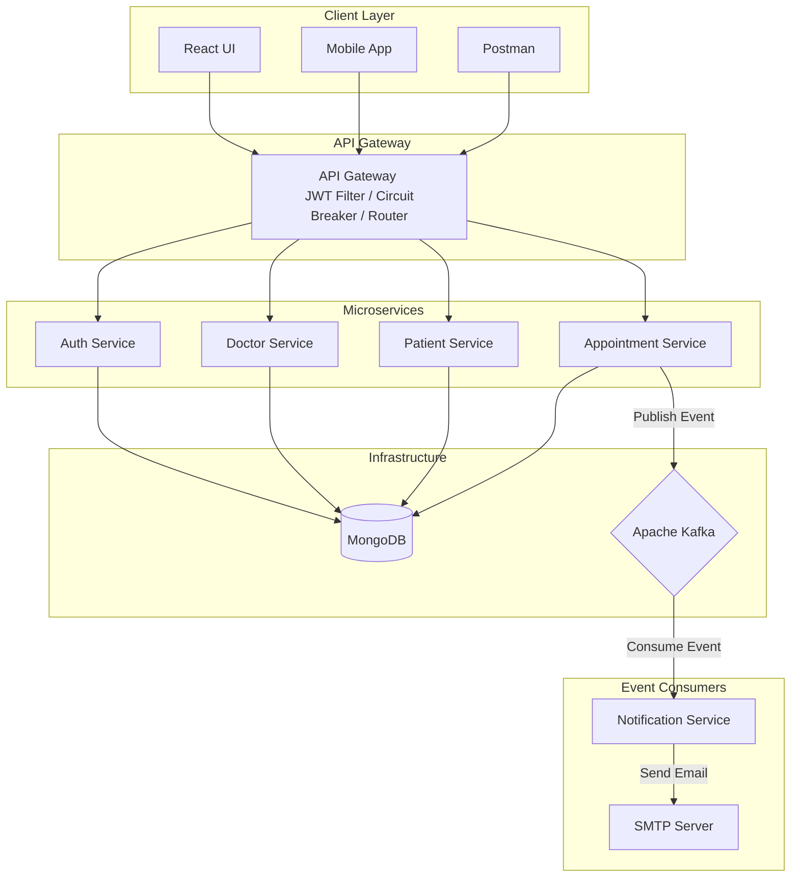
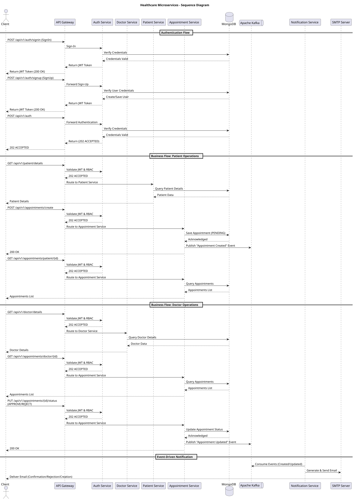

# Healthcare Microservices Project by HungryCoders

This project is a **Healthcare Microservices System** designed for self-learning and interview preparation. It includes services for authentication, appointments, doctor and patient management, notifications, and more. The system is implemented using **Spring Boot**, **Kafka**, **MongoDB**, **ReactJS**, and **Docker**.

---

### Environment Setup

* The project uses SDKMAN for managing Java and Maven versions.
* Initialize your development environment using **SDKMAN** CLI and sdkman env file [`sdkmanrc`](.sdkmanrc)

```shell
sdk env install
sdk env
```

#### Note: To install SDKMAN refer: [sdkman.io](https://sdkman.io/install)

---

## Prerequisites

1. **Install the following tools**:
    - [Java 21](https://openjdk.org/projects/jdk/21)
    - [Maven](https://maven.apache.org/install.html)
    - [Docker Desktop](https://www.docker.com/products/docker-desktop/)
    - [Docker Compose](https://docs.docker.com/compose/install/) (if not bundled with Docker Desktop)
    - [MongoDB Compass](https://www.mongodb.com/products/compass) (optional, for data inspection)

2. **Configure email functionality**:
    - This project uses the `mailpit` service from `compose.yml` for local email testing, so no external SMTP provider is required.
    - The `notification-service` is already configured to use:
      - `MAIL_SERVER_HOST=mailpit`
      - `MAIL_SERVER_PORT=1025`
      - `MAIL_SERVER_USERNAME=noreplyadmin@email.com`
      - `MAIL_SERVER_PASSWORD=secret`
    - Open the Mailpit web UI at [http://localhost:8025](http://localhost:8025) and sign in with `noreplyadmin@email.com` / `secret` to view captured emails.

---

## Architecture

The project consists of the following microservices:

1. **Auth Service**: Manages authentication and authorization.
2. **Doctor Service**: Handles doctor-related operations.
3. **Patient Service**: Handles patient-related operations.
4. **Appointment Service**: Manages appointments and sends events to Kafka.
5. **Notification Service**: Listens to Kafka events and sends notifications via email.
6. **Admin Service**: Provides centralized monitoring using Spring Boot Admin.
7. **Gateway Service**: Routes requests to other services and includes circuit breaker patterns.
8. **UI Service**: A ReactJS-based frontend for user interaction.
9. **MongoDB**: Stores data for all services.
10. **Kafka**: Facilitates asynchronous communication between services.

- The following diagram illustrates the overall **project structure** and **architecture** based on the system design:

### Architecture Diagram



### Sequence Diagram

- The following project **sequence diagram** outlines the business flows and the event-driven notification flow:



---

## How to Run

### Step 1: Prepare Secrets

Before starting any stack, create the JWT secret file used by `auth-service`:

```shell
mkdir -p deployment/secrets
printf '%s' '<base64-encoded-jwt-secret>' > deployment/secrets/jwt.secret
```

The file must contain only the secret value (no `KEY=` prefix and no comments).

### Step 2: Choose Runtime Mode (using `Docker`)

This project now supports two runtime modes:

- **Note**:
    - To build images for all the services, run command:
       ```shell
       docker compose -f compose-dev.yml build
       ```
    - Before running in `Prod` mode build the images using above command
    - To run all the dependent services for local development, run command: (using [compose.yml](./compose.yml))
       ```shell
       docker compose -f compose.yml up -d
       ```
    - MongoDB is initialized at container startup using `deployment/db/init.sh` mounted to `/docker-entrypoint-initdb.d/init.sh`.

1. **Dev mode (default local):**
   - Uses per-service `application-dev.yml` files.
   - `admin-service` runs as Spring Boot Admin only.
   - Start command:
     ```shell
     docker compose -f compose.yml up --build
     ```
   - Uses the same `dev` profiles, but routes OTLP telemetry to the bundled `otel-lgtm` stack.
   - Using [compose-dev.yml](./compose-dev.yml)
   - Start command:
     ```shell
     docker compose -f compose-dev.yml up --build
     ```

2. **Prod mode (centralized config):**
   - Uses per-service `application-prod.yml` that imports config from `admin-service`.
   - `admin-service` runs as Spring Boot Admin + Spring Cloud Config Server.
   - The prod deployment stack uses the configs directory under `deployment/admin-service/configs`.
   - Using [compose-prod.yml](./deployment/compose-prod.yml)
   - Start command:
     ```shell
     docker compose -f ./deployment/compose-prod.yml up
     ```

---

### Step 3: Access the System

- **Admin Panel**: [http://localhost:9093](http://localhost:9093)
- **React UI**: [http://localhost:9090](http://localhost:9090)
- **Mailpit Email-Web Panel**:[http://localhost:8025](http://localhost:8025)

Default seeded login users are:

1. `ADMIN`: `admin` / `admin123` (`noreplyhungrycoders@gmail.com`)
2. `DOCTOR`: `doctor` / `doctor123` (`doctorhungrycoders@gmail.com`)
3. `PATIENT`: `patient` / `patient123` (`patienthungrycoders@gmail.com`)

The full stack includes:

- **mongodb**: Primary database used by the microservices.
- **mongo-express**: MongoDB web UI for inspecting the database at [http://localhost:8081](http://localhost:8081) using `admin` / `secret`.
- **kafka**: Event broker used for asynchronous communication between services.
- **kafka-ui**: Kafka web UI for browsing topics and messages at [http://localhost:8181](http://localhost:8181) using `admin` / `secret`.
- **mailpit**: Local SMTP server and email web UI for testing notifications at [http://localhost:8025](http://localhost:8025).
- **gateway-service**: API gateway exposed at [http://localhost:8080](http://localhost:8080).
- **admin-service**: Spring Boot Admin panel for monitoring services at [http://localhost:9093](http://localhost:9093).
- **auth-service**: Authentication and authorization microservice.
- **doctor-service**: Doctor management microservice.
- **patient-service**: Patient management microservice.
- **appointment-service**: Appointment management microservice that publishes Kafka events.
- **notification-service**: Notification microservice that consumes Kafka events and sends emails through Mailpit.
- **ui-service**: React frontend exposed at [http://localhost:9090](http://localhost:9090).

---

## Configuration Model

Each backend service now uses profile-specific configuration files:

- `application.yml`: base config (`spring.application.name`, active profile default).
- `application-dev.yml`: local development runtime config.
- `application-prod.yml`: config-server import + fail-fast settings.

Centralized production config files are served by `admin-service` from:

- `admin-service/src/main/resources/configs/{application}/{application}-prod.yml` mirrored for prod deployment at `deployment/admin-service/configs/{application}/{application}-prod.yml`

### Compose Profiles

- `docker-compose.yml`: sets all Spring services to `dev` profile.
- `docker-compose-prod.yml`: overrides to `prod` profile and sets `CONFIG_SERVER_URL=http://admin-service:8080` for config clients.

## Observability

OpenTelemetry is enabled across the Spring services to export metrics, traces, and logs.

- Local observability dev mode uses `compose-dev.yml` and sends OTLP traffic to `otel-lgtm` on ports `4317` and `4318`.
- Prod deployment uses `deployment/compose-prod.yml` and sends OTLP traffic to `otel-collector`.
- The prod deployment also provisions `prometheus`, `loki`, `tempo`, `jaeger`, `zipkin`, and `grafana`.

### Observability Dashboards and Endpoints

#### Dev mode (`compose-dev.yml`)

- **Grafana Dashboard (otel-lgtm)**: [http://localhost:3000](http://localhost:3000)
- **OTLP HTTP ingest**: `http://localhost:4318`
- **OTLP gRPC ingest**: `http://localhost:4317`

In dev mode, use Grafana to explore:
- **Metrics** (Prometheus datasource)
- **Logs** (Loki datasource)
- **Traces** (Tempo datasource)

#### Prod mode (`deployment/compose-prod.yml`)

- **Grafana Dashboard**: [http://localhost:3000](http://localhost:3000)
- **Prometheus UI**: [http://localhost:9190](http://localhost:9190)
- **Jaeger UI**: [http://localhost:16686](http://localhost:16686)
- **Zipkin UI**: [http://localhost:9411](http://localhost:9411)
- **OTel Collector health**: [http://localhost:13133](http://localhost:13133)

In prod mode:
- **Metrics**: Prometheus (direct UI or via Grafana)
- **Logs**: Loki (queried from Grafana)
- **Traces**: Tempo (in Grafana), Jaeger UI, and Zipkin UI

Common OTLP environment variables:

- `OTLP_METRICS_EXPORT_ENABLED`
- `OTLP_METRICS_EXPORT_URL`
- `OTLP_TRACING_EXPORT_ENABLED`
- `OTLP_TRACING_EXPORT_TRANSPORT-TYPE`
- `OTLP_TRACING_EXPORT_URL`
- `OTLP_LOGGING_EXPORT_ENABLED`
- `OTLP_LOGGING_EXPORT_TRANSPORT-TYPE`
- `OTLP_LOGGING_EXPORT_URL`

## Environment Variables

The main environment variables in Compose are:

- **MongoDB**:
    - `MONGO_INITDB_ROOT_USERNAME`
    - `MONGO_INITDB_ROOT_PASSWORD`
- **Mongo Express**:
    - `ME_CONFIG_MONGODB_URL`
    - `ME_CONFIG_BASICAUTH_ENABLED`
    - `ME_CONFIG_BASICAUTH_USERNAME`
    - `ME_CONFIG_BASICAUTH_PASSWORD`
- **Kafka UI**:
    - `JAVA_OPTS`
    - `DYNAMIC_CONFIG_ENABLED`
    - `KAFKA_CLUSTERS_0_NAME`
    - `KAFKA_CLUSTERS_0_BOOTSTRAPSERVERS`
    - `AUTH_TYPE`
    - `SPRING_SECURITY_USER_NAME`
    - `SPRING_SECURITY_USER_PASSWORD`
- **Mailpit**:
    - `MP_MAX_MESSAGES`
    - `MP_DATABASE`
    - `MP_SMTP_AUTH_ACCEPT_ANY`
    - `MP_UI_AUTH`
- **Gateway Service**:
    - `GATEWAY_SERVICE_PORT`
    - `AUTH_SERVICE_BASE_URL`
    - `AUTH_SERVICE_URI`
- **Observability**:
    - `OTLP_METRICS_EXPORT_ENABLED`
    - `OTLP_METRICS_EXPORT_URL`
    - `OTLP_TRACING_EXPORT_ENABLED`
    - `OTLP_TRACING_EXPORT_TRANSPORT-TYPE`
    - `OTLP_TRACING_EXPORT_URL`
    - `OTLP_LOGGING_EXPORT_ENABLED`
    - `OTLP_LOGGING_EXPORT_TRANSPORT-TYPE`
    - `OTLP_LOGGING_EXPORT_URL`
- **Auth Service**:
    - `AUTH_SERVICE_PORT`
    - `MONGO_URI`
- **Doctor Service**:
    - `DOCTOR_SERVICE_PORT`
    - `MONGO_URI`
- **Patient Service**:
    - `PATIENT_SERVICE_PORT`
    - `MONGO_URI`
- **Appointment Service**:
    - `APPOINTMENT_SERVICE_PORT`
    - `MONGO_URI`
    - `KAFKA_BOOTSTRAP_SERVER`
    - `KAFKA_TOPIC`
- **Notification Service**:
    - `NOTIFICATION_SERVICE_PORT`
    - `KAFKA_BOOTSTRAP_SERVER`
    - `KAFKA_GROUP_ID`
    - `KAFKA_TOPIC`
    - `MAIL_SERVER_HOST`
    - `MAIL_SERVER_PORT`
    - `MAIL_SERVER_USERNAME`
    - `MAIL_SERVER_PASSWORD`
- **Admin Service**:
    - `ADMIN_SERVICE_PORT`

For the default local setup, these values are already wired to the internal Docker network services such as `mongodb`, `kafka`, and `mailpit`.

### JWT Secret Configuration

`auth-service` reads JWT secret from Docker secret file:

- `deployment/secrets/jwt.secret`

In containers, it is mounted with target name `JWT_SECRET`, and in `prod` mode services also import optional configtree from `/run/secrets/`.

### MongoDB Init Script

- The `mongodb` service runs `deployment/db/init.sh` (via `/docker-entrypoint-initdb.d/`) to create initial collections and seed sample data.
- This runs only when Mongo starts with a fresh/empty data directory (first init of `mongo-data` volume).

### Authentication and JWT Validation Flow

- All login and token generation happens in `auth-service`.
- `gateway-service` no longer performs local JWT parsing/signature checks.
- For secured routes, `gateway-service` calls `POST /api/v1/auth` and forwards:
    - `Authorization`
    - `X-Original-Method`
    - `X-Original-Path`
- `auth-service` validates JWT and performs RBAC authorization based on role + method + path.
- `auth-service` returns:
    - `202 Accepted`/`200 OK` when allowed
    - `403 Forbidden` when token is valid but access is not allowed by RBAC policy
    - `401 Unauthorized` when token is invalid/missing
- `gateway-service` forwards the same auth-service status back to the caller.

### RBAC Policy (auth-service)

RBAC policy is configured in:

- `auth-service/src/main/resources/application-dev.yml` for local dev.
- `admin-service/src/main/resources/configs/auth-service/auth-service-prod.yml` for prod via config-server.

Current configured defaults:

1. `DOCTOR`
    - Methods: `GET`, `POST`, `PUT`
    - Paths: `/api/v1/doctor/**`, `/api/v1/appointments`, `/api/v1/appointments/doctor/**`
2. `PATIENT`
    - Methods: `GET`, `POST`, `PUT`
    - Paths: `/api/v1/patient/**`, `/api/v1/appointments/create`, `/api/v1/appointments`, `/api/v1/appointments/patient/**`
3. `ADMIN`
    - Methods: `GET`, `POST`, `PUT`, `PATCH`, `DELETE`
    - Paths: `/api/**`

---

## Key Features

1. **Authentication**:
    - Register and log in using the Auth Service.
    - Secure communication using JWT.

2. **Service Monitoring**:
    - Admin Service provides centralized monitoring for all microservices.

3. **Notification**:
    - Notification Service sends emails based on appointment status.

4. **UI Integration**:
    - ReactJS frontend communicates with backend services via Gateway Service.

5. **Asynchronous Communication**:
    - Kafka ensures event-driven communication between services.

---

## Troubleshooting

1. **MongoDB not starting**:
    - Ensure the `mongo-data` volume is correctly mounted.
    - Check if the port `27017` is already in use.

2. **Kafka issues**:
    - Verify the `KAFKA_BOOTSTRAP_SERVER` in `compose.yml` or `compose-dev.yml`.

3. **Email sending errors**:
    - Confirm email credentials (`MAIL_SERVER_USERNAME` and `MAIL_SERVER_PASSWORD`).

4. **UI not loading**:
    - Ensure the UI Service is running at [http://localhost:9090](http://localhost:9090).

---

## Stopping the System

To stop all services and remove all mounted volumes, run:

```shell
docker compose -f compose.yml down --volumes
```

---

## Contributing

Feel free to contribute to this project!

For questions or issues, please open a GitHub issue or submit a pull request.

Happy coding! ✌️

---

## License

This project is by **HungryCoders** for educational purposes and self-learning only.
